# AD5724R/AD5734R/AD5754R - 完整的四通道、12/14/16位、串行输入、单极性/双极性、电压输出DAC

## 特性

- 完整的四通道、12/14/16位DAC
- 采用单电源/双电源供电
- 软件可编程输出范围
- +5 V、+10 V、+10.8 V、±5 V、±10 V、±10.8 V
- 积分非线性(INL)误差:±16 LSB(最大值)
- 微分非线性(DNL)误差:±1 LSB(最大值)
- 总不可调整误差(TUE):0.1% FSR(最大值)
- 建立时间:10 μs(典型值)
- 集成基准电压源:±5 ppm/℃(最大值)
- 集成基准电压缓冲器
- 上电/掉电期间输出受控
- 通过 LDAC 同时更新
- 异步CLR清零至零电平/中间电平
- DSP/微控制器兼容串行接口
- 24引脚TSSOP
- 工作温度范围:-40℃至+85℃
- CMOS工艺技术

## 应用

- 工业自动化
- 闭环伺服控制、过程控制
- 汽车测试与测量
- 可编程逻辑控制器

## 概述

AD5724R/AD5734R/AD5754R分别是四通道、12/14/16位串行输入、电压输出数模转换器(DAC),采用单电源(+4.5 V 至 +16.5 V) 或双电源(±4.5 V 至 ±16.5 V)供电。软件可选的标称满量程输出范围为+5 V、+10 V、+10.8 V、±5 V、±10 V 或±10.8 V。这些器件还内置输出放大器、基准电压缓冲器以及专有上电/断电控制电路。

这些器件可保证单调性,积分非线性(INL)为±16 LSB(最大值),噪声低,建立时间为10 μs(典型值),还内置一个+2.5 V片内基准电压源。

AD5724R/AD5734R/AD5754R采用串行接口,能够以最高30 MHz的时钟速率工作,并且与DSP和微控制器接口标准兼容。利用双缓冲,所有DAC可实现同时更新。对于双极性输出,输入编码为用户可选的二进制补码或偏移二进制(取决于BIN/2sCOMP 引脚的状态),单极性输出则为标准二进制。利用异步清零功能,可将所有DAC寄存器清零至用户可选的零电平或中间电平输出。这些器件采用24引脚TSSOP封装,保证温度范围为-40°C至+85°C工业温度范围。

表1. 引脚兼容器件

| 产品型号 | 描述 |
|---------|------|
| AD5724/AD5734/AD5754 | AD5724R/AD5734R/AD5754R, 无内部基准电压源。 |
| AD5722/AD5732/AD5752 | 完整的四通道、12/14/16位、串行输入、单极性/双极性、电压输出DAC。 |
| AD5722R/AD5732R/AD5752R | AD5722/AD5732/AD5752, 带内部基准电压源。 |

## 目录

- [特性](#特性)
- [应用](#应用)
- [概述](#概述)
- [引脚兼容器件](#引脚兼容器件)
- [功能框图](#功能框图)
- [技术规格](#技术规格)
- [交流工作特性](#交流工作特性)
- [时序特性](#时序特性)
- [时序图](#时序图)
- [绝对最大额定值](#绝对最大额定值)
- [ESD警告](#esd警告)
- [引脚配置和功能描述](#引脚配置和功能描述)
- [典型工作特性](#典型工作特性)
- [术语](#术语)
- [工作原理](#工作原理)
  - [架构](#架构)
  - [串行接口](#串行接口)
  - [加载DAC (LDAC)](#加载dac-ldac)
  - [异步清零(CLR)](#异步清零clr)
  - [配置AD5724R/AD5734R/AD5754R](#配置ad5724rad5734rad5754r)
- [传递函数](#传递函数)
- [输入寄存器](#输入寄存器)
- [DAC寄存器](#dac寄存器)
- [输出范围选择寄存器](#输出范围选择寄存器)
- [控制寄存器](#控制寄存器)
- [电源控制寄存器](#电源控制寄存器)
- [设计特性](#设计特性)
  - [模拟输出控制](#模拟输出控制)
  - [关断模式](#关断模式)
  - [过流保护](#过流保护)
  - [热关断](#热关断)
  - [内部基准电压源](#内部基准电压源)
- [应用信息](#应用信息)
  - [+5 V/±5 V电源](#5-v±5-v电源)
  - [布局指南](#布局指南)
  - [电流隔离接口](#电流隔离接口)
  - [微处理器接口](#微处理器接口)
- [外形尺寸](#外形尺寸)
- [订购指南](#订购指南)

---

## 修订历史

### 2011年7月 - 修订版D至修订版E
- 更改表4参数 t₇、t₈ 和 t₁₀

### 2011年5月 - 修订版C至修订版D
- 更改"配置AD5724R/AD5734R/AD5754R"部分

### 2010年7月 - 修订版B至修订版C
- 更改表28

### 2010年5月 - 修订版A至修订版B
- 更改表5
- 更改表6

### 2009年3月 - 修订版0至修订版A
- 增加AD5724R型号
- 增加12位分辨率
- 更改分辨率和积分非线性(INL)参数(表2)
- 更改尾注2(表2)
- 增加尾注4(表4)
- 增加图8和图11
- 增加图39
- 增加"理想的输出电压与输入代码之间的关系—AD5724R"部分
- 增加表21
- 更改订购指南

### 2009年1月 - 版本0: 初始版

---

## 功能框图

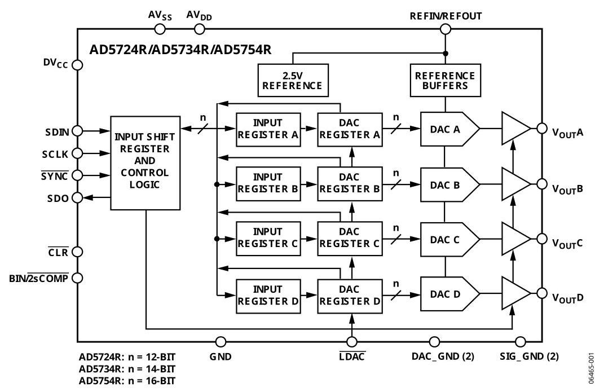

图1. AD5724R/AD5734R/AD5754R功能框图

## 技术规格

AVDD = 4.5 V¹ 至 16.5 V, AVSS = -4.5 V¹ 至 -16.5 V 或 AVSS = 0 V, GND = 0 V, REFIN = +2.5 V 外部基准电压, DVCC = 2.7 V 至 5.5 V, RLOAD = 2 kΩ, CLOAD = 200 pF; 除非另外说明,所有规格在 TMIN 至 TMAX 范围。

**表2**

| 参数 | 最小值 | 典型值 | 最大值 | 单位 | 测试条件/注释 |
|---|---|---|---|---|---|
| **精度** | | | | | 输出端无负载 |
| **分辨率** | | | | | |
| AD5754R | 16 | | | 位 | |
| AD5734R | 14 | | | 位 | |
| AD5724R | 12 | | | 位 | |
| 总不可调整误差(TUE) | -0.1 | | +0.1 | % FSR | |
| 积分非线性 (INL)² | | | | | |
| AD5754R | -16 | | +16 | LSB | |
| AD5734R | -4 | | +4 | LSB | |
| AD5724R | -1 | | +1 | LSB | |
| 微分非线性(DNL) | -1 | | +1 | LSB | 所有型号, 保证单调性 |
| 双极性零误差 | -6 | | +6 | mV | TA = 25°C ,其他温度下的误差用双极性零温度系数(TC) 获得 |
| 双极性零 TC³ | | ±4 | | ppm FSR/℃ | |
| 零电平误差 | -6 | | +6 | mV | TA = 25°C ,其他温度下的误差用零电平温度系数(TC)获得 |
| 零电平温度系数 (TC)³ | | ±4 | | ppm FSR/℃ | |
| 失调误差 | -6 | | +6 | mV | TA = 25°C ,其他温度下的误差用失调误差温度系数(TC) 获得 |
| 失调误差 TC³ | | ±4 | | ppm FSR/℃ | |
| 增益误差 | -0.025 | | +0.025 | % FSR | ±10V 范围, TA = 25°C ,其他温度下的误差用增益温度系 数(TC)获得 |
| 增益误差³ | -0.065 | | 0 | | +10V 和 +5V 范围, TA = 25°C ,其他温度下的误差用增益 温度系数(TC)获得 |
| 增益误差³ | 0 | | +0.08 | | ±5V 范围, TA = 25°C ,其他温度下的误差用增益温度系 数(TC)获得 |
| 增益 TC³ | | ±4 | | ppm FSR/℃ | |
| 直流串扰3 | | | 120 | μV | |
| **基准电压输入/输出** | | | | | |
| 基准输入³ | | | | | |
| 基准输入电压 | | 2.5 | | V | ±1% (额定性能) |
| 直流输入阻抗 | 1 | 5 | | MΩ | |
| 输入电流 | -2 | ±0.5 | +2 | μA | |
| 基准电压范围 | 2 | | 3 | V | |
| **基准电压输出** | | | | | |
| 输出电压 | 2.497 | | 2.501 | V | TA = 25°C |
| 基准电压 TC³,⁴ | | 1.8 | 5 | ppm/℃ | TA = 0°C 至 85°C |
| | | 2.2 | 10 | ppm/℃ | TA = -40°C 至 +85°C |
| 输出噪声(0.1 Hz至10 Hz)³ | | 5 | | μV p-p | |
| 噪声频谱密度3 | | 75 | | nV/VHz | 在10 kHz条件下 |
| **输出特性³** | | | | | |
| 输出电压范围 | -10.8 | | +10.8 | V | AVDD/AVSS = ±11.7V (最小值), REFIN = +2.5V |
| | -12 | | +12 | V | AVDD/AVSS = ±12.9V (最小值), REFIN = +3V |
| 裕量 | | 0.5 | 0.9 | V | |
| 输出电压TC | | ±4 | | ppm FSR/℃ | |
| 输出电压漂移与时间的关系 | | ±12 | | ppm FSR/500 小时 | |
| | | ±15 | | ppm FSR/1000 小时 | |
| 短路电流 | | 20 | | mA | |
| 负载 | 2 | | | kΩ | 额定性能 |
| 容性负载稳定性 | | | 4000 | pF | |
| 直流输出阻抗 | | 0.5 | | Ω | |

| 参数 | 最小值 | 典型值 | 最大值 | 单位 | 测试条件/注释 |
|---|---|---|---|---|---|
| **数字输入³** | | | | | DVcc= 2.7 V至5.5 V、JEDEC兼容 |
| 输入高电压 VIH | 2 | | | V | |
| 输入低电压 VIL | | | 0.8 | V | |
| 输入电流 | | | ±1 | μA | 每引脚 |
| 引脚电容 | | 5 | | pF | 每引脚 |
| **数字输出 (SDO)³** | | | | | |
| 输出低电压 VOL | | | 0.4 | V | DVcc = 5V ±10% ,吸电流 200μA |
| 输出高电压 VOH | DVcc -1 | | | V | DVcc = 5V ±10% ,源电流 200μA |
| 输出低电压 VOL | | | 0.4 | V | DVcc = 2.7V 至 3.6V ,吸电流 200μA |
| 输出高电压 VOH | DVcc - 0.5 | | | V | DVcc = 2.7V 至 3.6 V,源电流200 μA |
| 高阻抗漏电流 | | | ±1 | μA | |
| 高阻抗输出电容 | | 5 | | pF | |
| **电源要求** | | | | | |
| AVDD | 4.5 | | 16.5 | V | |
| AVss | -4.5 | | -16.5 | V | |
| DVcc | 2.7 | | 5.5 | V | |
| **电源灵敏度³** | | | | | |
| ΔVOUT/ΔAVDD | | -65 | | dB | 200mV 正弦波叠加于 AVss/AVDD @50 Hz/60 Hz上 |
| AlDD | | | 2.5 | mA/通道 | 输出端无负载 |
| | | | 1.75 | mA/通道 | AVSS = 0V ,输出端无负载 |
| Alss | | | 2.2 | mA/通道 | 输出端无负载 |
| DIcc | | 0.5 | 3 | μA | VIH = DVCC 、 VIL = GND,0.5μA 典型值 |
| **功耗** | | | | | |
| | | | 310 | mW | 工作电压为±16.5 V,且输出端无负载 |
| | | | 115 | mW | 工作电压为+16.5V,且输出端无负载 |
| **关断电流** | | | | | 所有DAC通道和内部基准电压源均关断 |
| AlDD | | 40 | | μA | |
| Alss | | 40 | | μA | |
| DIcc | | 300 | | nA | |

¹ 对于额定性能,裕量要求为 0.9 V 。

² INL为相对精度。AD5754R、AD5734R和AD5724R分别测量代码512、代码128和代码32。

³ 通过特性保证,但未经生产测试。

⁴ 片内基准电压源在25℃和85℃进行生产调整和测试；表征温度范围-40℃至+85℃。

## AD5724R/AD5734R/AD5754R

## 交流工作特性

AVDD = 4.5 V¹ 至 16.5 V, AVSS = -4.5 V¹ 至 -16.5 V 或 0 V, GND = 0 V, REFIN = 2.5 V 外部基准电压, DVCC = 2.7 V 至 5.5 V, RLOAD = 2 kΩ, CLOAD = 200 pF; 除非另外说明,所有规格在 TMIN 至 TMAX 范围。

**表3**

| 参数² | 最小值 | 典型值 | 最大值 | 单位 | 测试条件/注释 |
|---|---|---|---|---|---|
| **动态性能** | | | | | |
| 输出电压建立时间 | | 10 | 12 | μs | 20 V阶跃, ±0.03% FSR |
| | | 7.5 | 8.5 | μs | 10 V阶跃,±0.03 % FSR |
| | | | 5 | us | 512 LSB阶跃建立(16位分辨率) |
| 压摆率 | | 3.5 | | V/us | |
| 数模转换毛刺能量 | | 13 | | nV-sec | |
| 毛刺脉冲峰值幅度 | | 35 | | mV | |
| 数字串扰 | | 10 | | nV-sec | |
| DAC间串扰 | | 10 | | nV-sec | |
| 数字馈通 | | 0.6 | | nV-sec | |
| **输出噪声** | | | | | |
| 带宽:0.1 Hz至10 Hz | | 15 | | μV p-p | 0x8000 DAC代码 |
| 100 kHz带宽 | | 80 | | μV均方根 | |
| 输出噪声频谱密度 | | 320 | | nV/√Hz | 10 kHz、0x8000 DAC代码下测量 |

¹ 对于额定性能,裕量要求为 0.9V 。

² 提供设计和特性保证; 未经过生产测试。

## 时序特性

AVDD = 4.5 V 至 16.5 V, AVSS = -4.5 V 至 -16.5 V 或 0 V, GND = 0 V, REFIN = 2.5 V 外部基准电压, DVCC = 2.7 V 至 5.5 V, RLOAD = 2 kΩ, CLOAD = 200 pF; 除非另外说明,所有规格在 TMIN 至 TMAX 范围。

**表4**

| 参数¹,²,³ | 在 TMIN 、 TMAX 时的限值 | 单位 | 描述 |
|---|---|---|---|
| t1⁴ | 33 | ns(最小值) | SCLK周期时间 |
| t2 | 13 | ns(最小值) | SCLK高电平时间 |
| t3 | 13 | ns(最小值) | SCLK低电平时间 |
| t4 | 13 | ns(最小值) | SYNC 下降沿到SCLK下降沿建立时间 |
| t5 | 13 | ns(最小值) | SCLK下降沿到SYNC上升沿 |
| t6 | 100 | ns(最小值) | SYNC最小高电平时间(写入模式) |
| t7 | 7 | ns(最小值) | 数据建立时间 |
| t8 | 2 | ns(最小值) | 数据保持时间 |
| t9 | 20 | ns(最小值) | LDAC下降沿到SYNC下降沿 |
| t10 | 130 | ns(最小值) | SYNC 上升沿到LDAC下降沿 |
| t11 | 20 | ns(最小值) | LDAC 低电平脉冲宽度 |
| t12 | 10 | us(典型值) | DAC输出建立时间 |
| t13 | 20 | ns(最小值) | CLR 低电平脉冲宽度 |
| t14 | 2.5 | us(最大值) | CLR 脉冲启动时间 |
| t15⁵ | 13 | ns(最小值) | SYNC 上升沿到SCLK下降沿 |
| t16⁵ | 40 | ns(最大值) | SCLK上升沿到SDO有效 (CLSDO⁶ = 15pF) |
| t17 | 200 | ns(最小值) | SYNC最小高电平时间(回读/菊花链模式) |

¹ 通过特性保证,但未经生产测试。

² 所有输入信号均指定 tR = tF = 5ns (DVCC 的10%到90%)并从1.2V电平起开始计时。

³ 参见图2、图3和图4。

⁴ 为了适应$t_{16}$ ,在回读和菊花链模式下,必须将SCLK周期时间增加至90 ns。

⁵ 菊花链和回读模式。

⁶ CLSDO = SDO 输出上的容性负载。

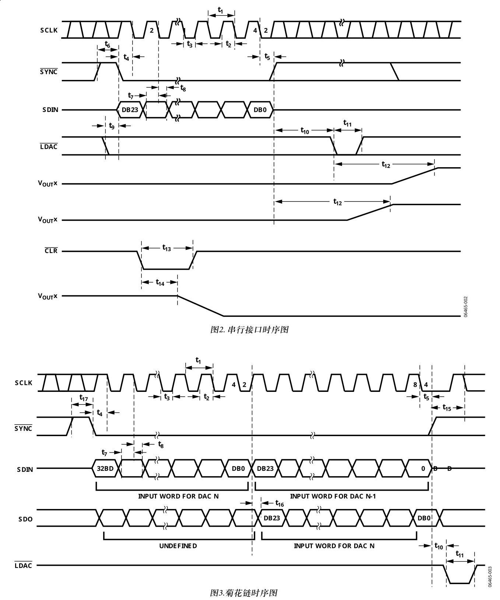

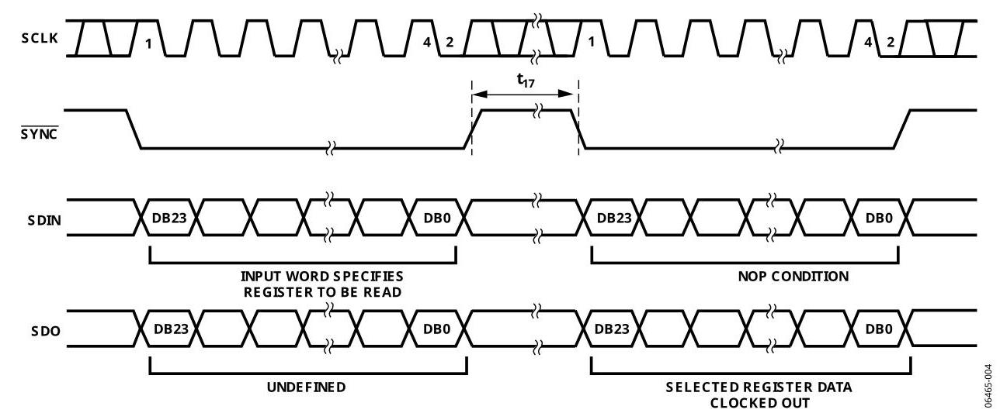

图4. 回读时序图

## 绝对最大额定值

除非另有说明, TA = 25°C 。 100mA 以下的瞬态电流不会造成SCR闩锁

**表5** 注意, 超出上述绝对最大额定值可能会导致器件永久性损坏。这只是额定最值, 不表示在这些条件下或者在任何其它超出本技术规范操作章节中所示规格的条件下,器件能够正常工作。长期在绝对最大额定值条件下工作会影响器件的可靠性。

| 参数 | 额定值 |
|---|---|
| AVDD 至 GND | -0.3 V至 +17 V |
| AVss 至 GND | +0.3V至-17V |
| DVcc 至 GND | -0.3 V至 +7 V |
| 数字输入至GND | -0.3 V至DVcc+0.3 V或7 V (取较小者) |
| 数字输出至GND | -0.3 V至DVcc+0.3 V或7 V (取较小者) |
| REFIN/REFOUT 至 GND | -0.3 V 至 +5 V |
| VouTX 至 GND | AVss 至 AVDD |
| DAC_GND 至 GND | -0.3 V 至 +0.3 V |
| SIG_GND 至 GND | -0.3 V 至 +0.3 V |
| **工作温度范围, TA** | |
| 工业 | -40°C 至 +85°C |
| 存储温度范围 | -65°C 至 +150°C |
| 结温, Tj(最大值) | 150°C |
| **24引脚TSSOP封装** | |
| θJA 热阻 | 42°C/W |
| θc热阻 | 9°C/W |
| 功耗 | (T,最大值 - TA )/ θJA |
| 引脚温度 | JEDEC工业标准 |
| 焊接 | J-STD-020 |
| ESD(人体模型) | 3.5 kV |

## ESD警告

ESD(静电放电)敏感器件。 带电器件和电路板可能会在没有察觉的情况下放电。尽管本产品具有专利或专有保护电路,但在遇到高能量ESD时, 器件可能会损坏。因此, 应当采取适当的ESD防范措施, 以避免器件性能下降或功能丧失。

## 引脚配置和功能描述

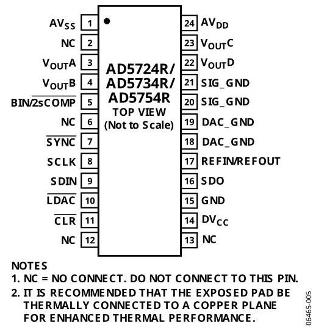

图5. 引脚配置

## 表6. 引脚功能描述

| 引脚编号 | 引脚名称 | 描述 |
|---|---|---|
| 1 | AVss | 负模拟电源引脚。电压范围为-4.5 V至-16.5 V。如果输出范围是单极性的,此引脚可连接到0V。 |
| 2,6,12,13 | NC | 不连接。请勿连接到这些引脚。 |
| 3 | VoutA | DAC A的模拟输出电压。输出放大器能够直接驱动一个2 kΩ、4000 pF负载。 |
| 4 | VoutB | DAC B的模拟输出电压。输出放大器能够直接驱动一个2 kΩ、4000 pF负载。 |
| 5 | BIN/2sCOMP | 此引脚决定双极性输出范围的DAC编码方式。此引脚硬连上应该与或GND连接。与DVcc连接时, 输入编码方式为偏移二进制。与GND连接时,输入编码方式为二进制补码。(对于单极性输出范围,编码方式始终为标准二进制。) |
| 7 | SYNC | 低电平输入有效。这是串行接口的帧同步信号。当SYNC处于低电平时,数据在SCLK下降沿传输。 数据在SYNC的上升沿锁存。 |
| 8 | SCLK | 串行时钟输入。数据在SCLK的下降沿逐个输入移位寄存器。工作时钟速率最高达30 MHz。 |
| 9 | SDIN | 串行数据输入。数据必须在SCLK的下降沿有效。 |
| 10 | LDAC | 加载DAC逻辑输入。用于更新DAC寄存器和模拟输出。当永久接为低电平时,在SYNC的上升沿更新 所寻址的DAC寄存器。如果LDAC在写入周期保持高电平, DAC输入寄存器会更新,但输出直到LDAC 的下降沿才会更新输出。在此模式下, 所有模拟输出都可以在LDAC的下降沿同时更新。LDAC引脚不 能悬空。 |
| 11 | CLR | 低电平输入有效。置位此引脚可将DAC寄存器设置为零电平代码或中间电平代码(用户可选)。 |
| 14 | DVcc | 数字电源引脚。电压范围为2.7 V至5.5 V。 |
| 15 | GND | 接地基准电压引脚。 |
| 16 | SDO | 串行数据输出。用于以菊花链模式或回读模式从串行寄存器逐个输出数据。数据在SCLK上升沿逐个 输出,而且在SCLK下降沿有效。 |
| 17 | REFIN/REFOUT | 外部基准电压输入和内部基准电压输出。基准电压输入范围为2 V至3 V。额定性能时, REFIN = 2.5 V。 REFOUT = 2.5 V ± 2 mV (25°C)。 |
| 18, 19 | DAC_GND | 四个数模转换器的接地基准引脚。 |
| 20, 21 | SIG_GND | 四个输出放大器的接地基准引脚。 |
| 22 | VoutD | DAC D的模拟输出电压。输出放大器能够直接驱动一个2 kΩ、4000 pF负载。 |
| 23 | VoutC | DAC C的模拟输出电压。输出放大器能够直接驱动一个2 kΩ、4000 pF负载。 |
| 24 | AVDD | 正模拟电源引脚。电压范围为4.5 V至16.5 V。 |
| 25 (EPAD) | 裸露焊盘 (EPAD) | 裸露焊盘应连接至AVSS引脚的电位,或者也可不连接。建议将焊盘热连接到铜层,增强散热性能。 |

## 典型工作特性

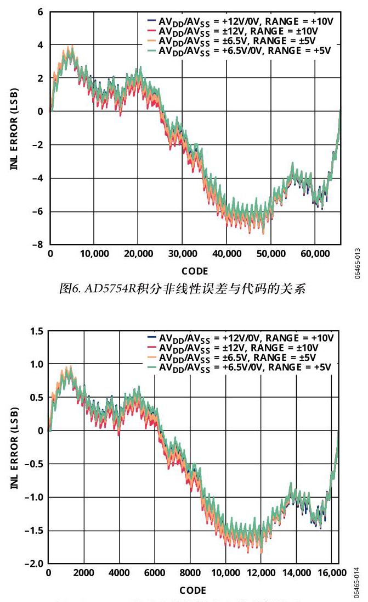

图7. AD5734R积分非线性误差与代码的关系

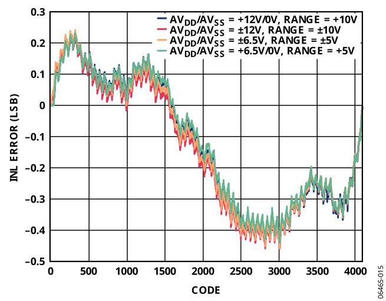

图8. AD5724R积分非线性误差与代码的关系

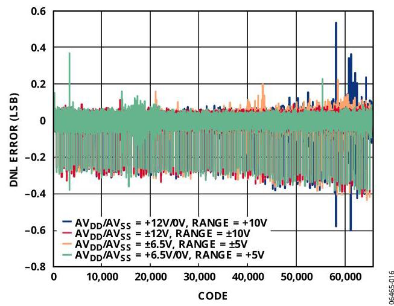

图9. AD5754R微分非线性误差与代码的关系

0.15

0.10

0.05

DNL ERROR (LSB) -0.05

-0.10

-0.15 AVDD/AVSS = ±12V, RANGE = ±10V

- AVnn/AVcc = ±6.5 V. RANGE = ±5 V

VDD/AVSS = +6.5V/0V, RANGE = +5V

-0.20

CODE

图10. AD5734R微分非线性误差与代码的关系

0.04 -AVDD/AVSS = +12V/0V, RANGE = +10V

-AVDD/AVSS = ±12V, RANGE = ±10V

0.03 AVDD⁻/AVSS⁻ = ±6.5V, RANGE = ±5V

AVDD/AVSS = +6.5V/0V, RANGE = +5V

0.02

DNL ERROR (LSB) 0.01 -0.01 -0.02

-0.03

-0.04

-0.05

500 1000 1500 2000 2500 3000 3500 4000

CODE

图11. AD5724R微分非线性误差与代码的关系

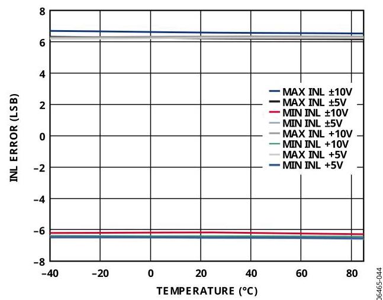

图12. AD5754R 积分非线性误差与温度的关系

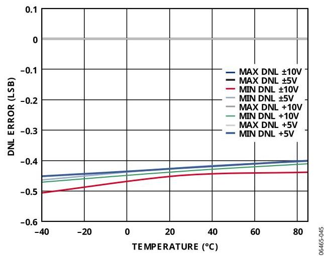

图13. AD5754R微分非线性误差与温度的关系

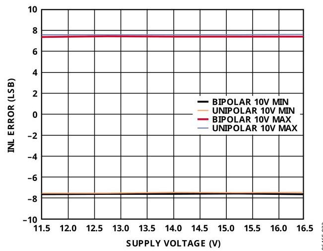

图14. AD5754R积分非线性误差与电源电压的关系

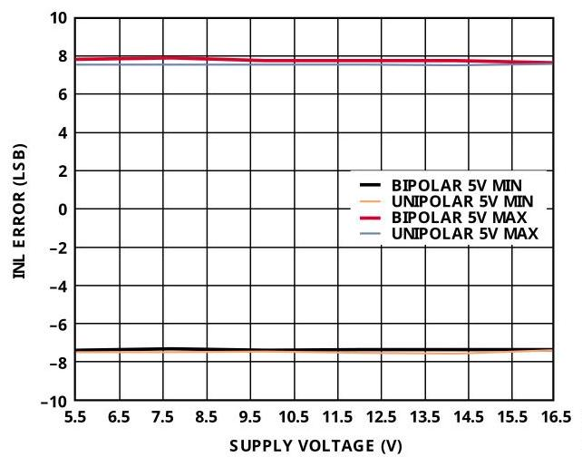

图15. AD5754R积分非线性误差与电源电压的关系

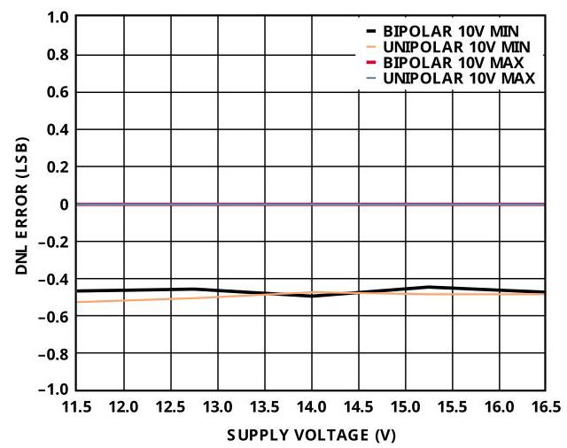

图16. AD5754R微分非线性误差与电源电压的关系

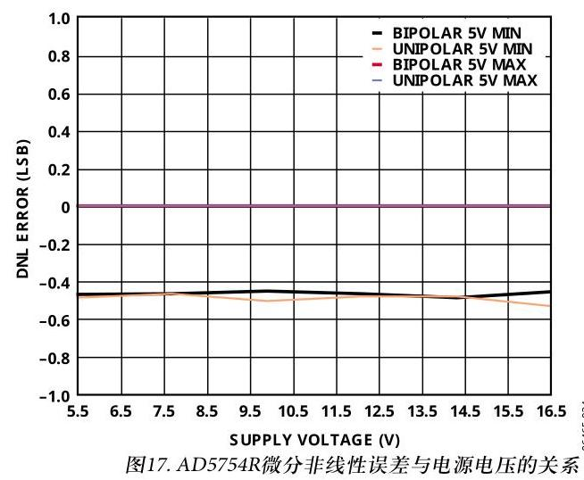

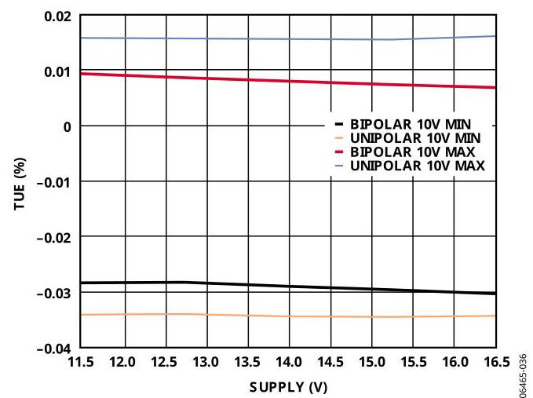

图18. AD5754R总不可调整误差与电源电压的关系

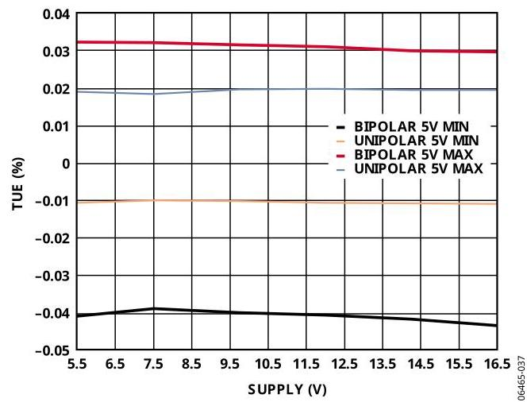

图19. AD5754R总不可调整误差与电源电压的关系

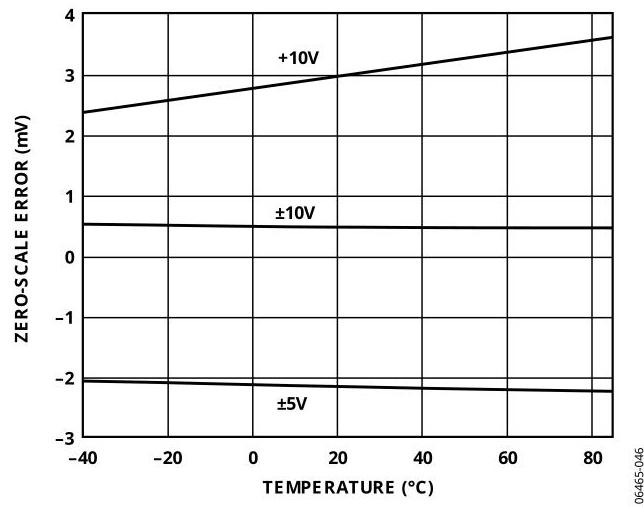

图20. 零电平误差与温度的关系

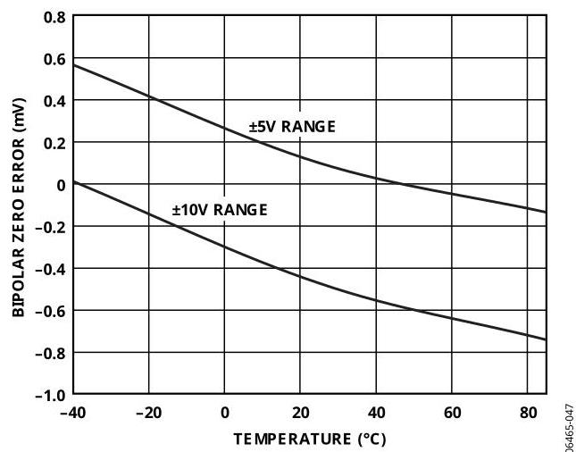

图21. 双极性零误差与温度的关系

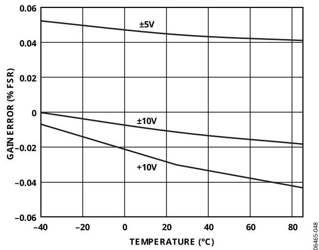

图22. 增益误差与温度的关系

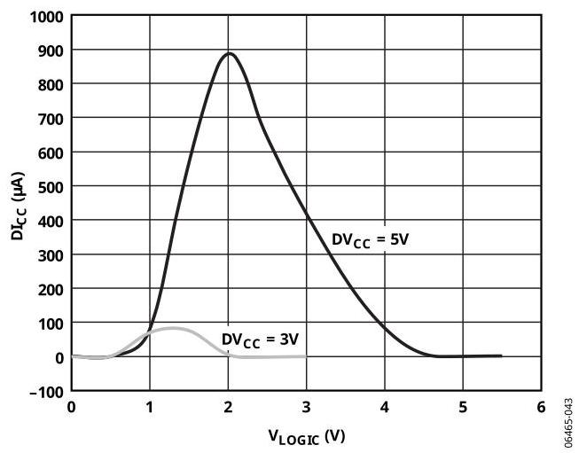

图23. 数字电流与逻辑输入电压的关系

0.010

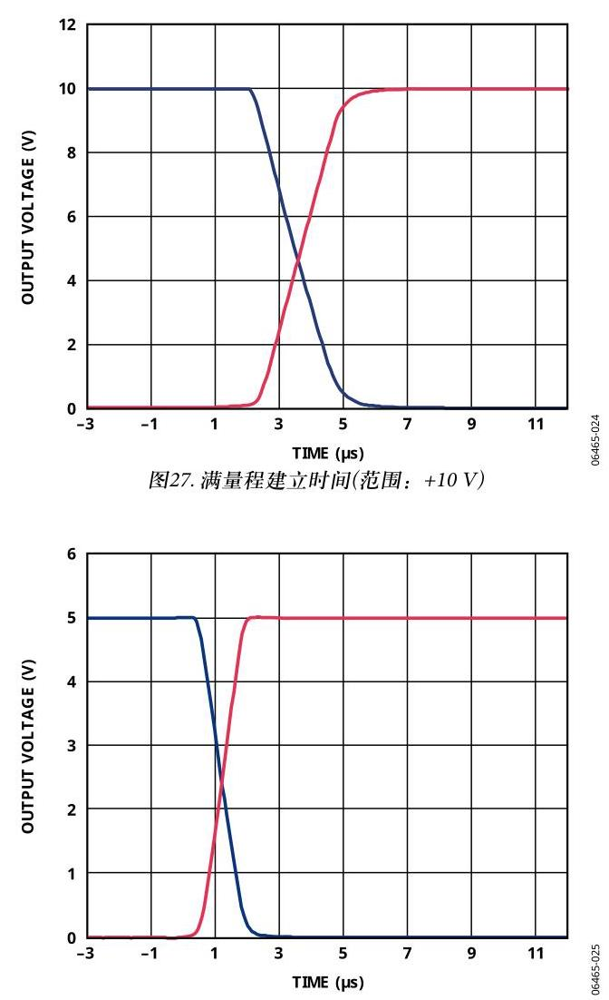

±10V RANGE, CODE = 0xFFFF

+10V RANGE.CODE = 0xFFFF

0.005 +5V RANGE, CODE = 0xFFFF

OUTPUT VOLTAGE DELTA (V) ±5V RANGE, CODE = 0x0000 0 -0.005 -0.010

-0.015

-0.020

-25 -20 -15 -10 -5 10 15 20

OUTPUT CURRENT (mA)

图24. 输出源电流和吸电流能力

15

10

DUTPUT VOLTAGE (V) 5

-10

-15

-1 3 11 06465-022 TIME (μs) 图25. 满量程建立时间(范围: ±10V) 图28. 满量程建立时间(范围:+5 V)

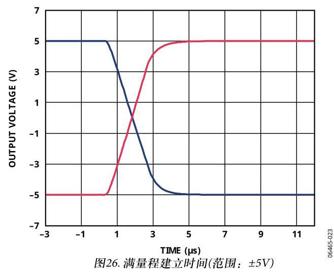

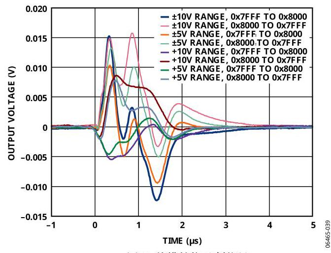

图29. 数模转换毛刺能量

RANGE = +5V RANGE = ±10V

M 5s

图30. 峰峰值噪声(0.1 Hz至10 Hz带宽)

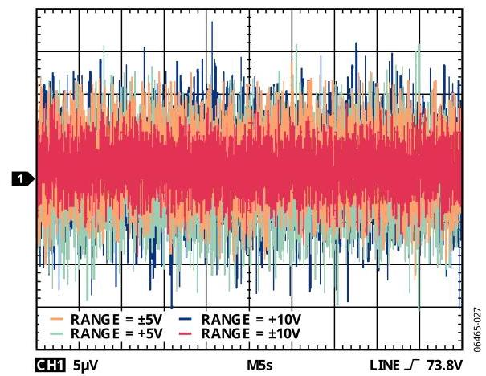

图31. 峰峰值噪声(100 kHz带宽)

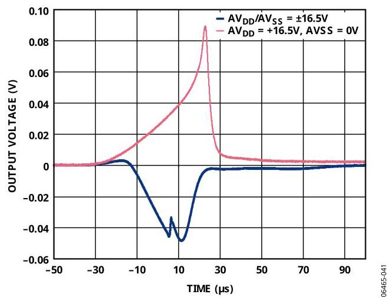

图32. 上电时的输出毛刺

CHI 5V 500mV M 200μs CH1 J2.9V 图33. REFOUT开启瞬变

CHI 10μV M 5s LINE J 1.2V 图34. REFOUT输出噪声(100 kHz带宽)

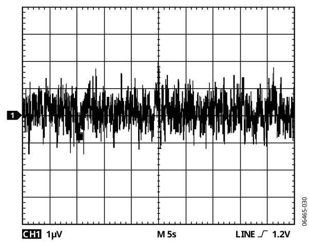

图35. REFOUT输出噪声(0.1 Hz至10 Hz带宽)

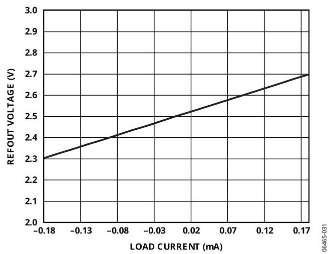

图36. REFOUT电压与负载电流的关系

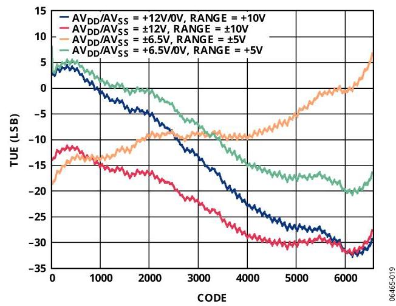

图37. AD5754R总不可调整误差与代码的关系

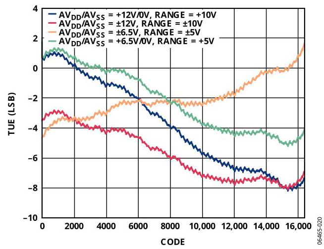

图38. AD5734R总不可调整误差与代码的关系

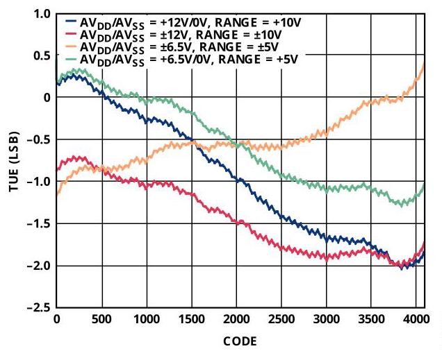

图39. AD5724R总不可调整误差与代码的关系

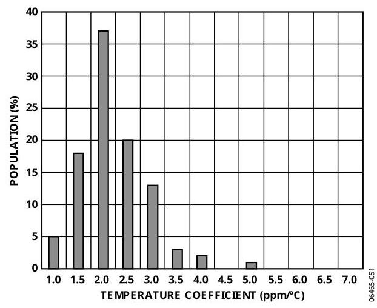

图40. 基准电压输出温度系数 TC(-40°C至+85°C)

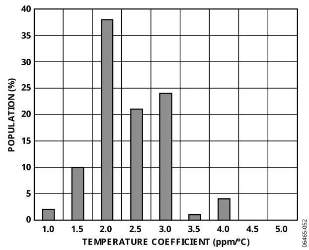

图41. 基准电压输出温度系数 TC(0°C至85°C)

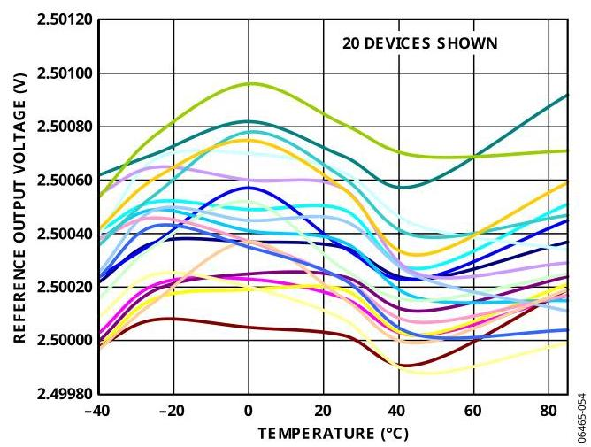

图42. 基准输出电压与温度的关系 (-40℃至+85℃)

图 43. 基准输出电压与温度的关系 (0°C至85°C)

## AD5724R/AD5734R/AD5754R

## 术语

## 相对精度或积分非线性(INL)

对于DAC,相对精度或积分非线性是指DAC输出与通过 DAC传递函数的两个端点的直线之间的最大偏差, 单位为 LSB。图6所示为典型INL与编码的关系图。

## 微分非线性(DNL)

微分非线性是指任意两个相邻编码之间所测得变化值与理想的1 LSB变化值之间的差异。最大 ±1 LSB的额定微分非线性可确保单调性。本DAC通过设计保证单调性。图9所示为典型DNL与编码的关系图。

## 单调性

如果输出针对数字输入码增加而增加或保持恒定, 则DAC 具有单调性。AD5724R/AD5734R/AD5754R在其整个工作温度范围内具有单调性。

## 双极性零误差

双极性零误差是DAC寄存器载入0x8000(直接二进制编码) 或 0x0000(二进制补码编码)时模拟输出与 0 V 的理想半量程输出的偏差。从图21可以看出双极性零电平误差与温度的关系。

## 双极性零TC

双极性零温度系数 (TC) 衡量双极性零误差随温度的变化, 用ppm FSR/℃表示。

## 零电平误差/负满量程误差

零电平误差是将 0x0000(直接二进制编码)或 0x8000(二进制补码编码)载入DAC寄存器时的DAC输出电压误差。理想情况下,输出电压应为负满量程 -1 LSB。从图20可以看出零电平误差与温度的关系。

## 零电平TC

零电平温度系数 (TC) 衡量零电平误差随温度的变化, 用 ppm FSR/℃表示。

## 输出电压建立时间

输出电压建立时间是指对于一个满量程输入变化, 输出建立为指定电平所需的时间量。图25给出了满量程建立时间。

## 压摆率

器件的压摆率是对输出电压变化率的限制。电压输出DAC 的输出压摆速度通常受其输出端使用的放大器的压摆率限制。压摆率是输出信号 10% 至 90% 之间的测量值,用 V/μs 表示。

## 增益误差

增益误差衡量DAC的量程误差, 是DAC传递特性的斜率与理想值的偏差,用 %FSR 表示。从图22可以看出增益误差与温度的关系。

## 增益TC

增益温度系数 (TC) 衡量增益误差随温度的变化,用ppm FSR/℃表示。

## 总不可调整误差(TUE)

总不可调整误差衡量包括所有误差在内的总输出误差, 即 INL误差、失调误差、增量误差以及在电源电压、温度和时间范围内的输出漂移, TUE用%FSR表示。

## 数模转换毛刺脉冲

数模转换毛刺脉冲是DAC寄存器中的输入代码改变状态而输出电压保持恒定时注入模拟输出的脉冲。数模转换毛刺脉冲通常规定为毛刺的面积,用 nV-sec 表示,数字输入代码在主进位跃迁中改变 1 LSB(0x7FFF至 0x8000) 时 进行测量。参见图29。

## 毛刺脉冲峰值幅度

毛刺脉冲峰值幅度是DAC寄存器中的输入代码改变状态时注入模拟输出的脉冲的峰值幅度。毛刺脉冲峰值幅度规定为毛刺的幅度, 用毫伏表示, 数字输入代码在主进位跃迁中改变1 LSB(0x7FFF至0x8000)时进行测量。参见图29。

## 数字馈通

数字馈通衡量从DAC的数字输入注入DAC的模拟输出的脉冲, 但在DAC输出未更新时进行测量。数字馈通用nV-sec 表示,利用数据总线上的满量程代码变化测定。

## 电源灵敏度

电源灵敏度表示DAC的输出受电源电压变化影响的程度。 其测量方法是将一个 50Hz/60Hz 、 200mVp-p 正弦波叠加于电源电压之上, 然后测量正弦波传递至输出的部分。

## 直流串扰

直流串扰是一个DAC输出电平因响应另一个DAC输出变化而发生的直流变化。测量时, 一个DAC发生满量程输出变化,同时对另一个DAC进行测量。以LSB为单位。

## 数字串扰

数字串扰衡量从一个DAC的数字输入注入另一个DAC模拟输出的脉冲,此时DAC输出没有更新。数字馈通用nV-sec 表示,利用数据总线上的满量程代码变化测定。

## DAC间串扰

DAC间串扰是指一个DAC的输出因响应另一个DAC的数字编码变化和后续的模拟输出变化, 而引起的毛刺脉冲, 包括数字和模拟串扰。它的测量方法是, 向一个DAC加载满量程编码变化(全 0 至全 1 ,反之亦然),保持 LDAC 为低电平, 同时监控另一个DAC的输出。毛刺的能量用nV-秒表示。

## 基准电压TC

基准电压TC衡量基准输出电压随温度的变化。基准电压 TC利用黑盒法计算,该方法将温度系数 (TC) 定义为基准电压输出在给定温度范围内的最大变化,用ppm/°C表示,计算公式如下:

$$
TC = [  (V_{REFmax} - V_{REFmin})/(V_{REFnom} × TempRange)]   ×  10^6
$$

其中:

VREFmax 是在整个温度范围内测量的最大基准电压输出。

VREFmin 是在整个温度范围内测量的最小基准电压输出。

VREFnom 是标称基准输出电压 2.5V 。

TempRange为额定温度范围: 0°C 至 85°C 或 -40°C 至 +85°C 。

## AD5724R/AD5734R/AD5754R

## 工作原理

AD5724R/AD5734R/AD5754R分别是完整的四通道、 12/14/16 位、串行输入、单极性/双极性、电压输出DAC, 采用单电源 (+4.5V至 +16.5V) 或双电源 (±4.5V至 ±16.5V) 供电。另外,这些器件可通过软件选择输出范围: +5V 、 +10V、 +10.8V、 ±5V、 ±10V 和 ±10.8V 。数据通过三线式串行接口,以24位字格式写入AD5724R/AD5734R/ AD5754R。这些器件还提供SDO引脚,以便于进行菊花链或回读配置。

AD5724R/AD5734R/AD5754R内置一个上电复位电路,确保DAC寄存器上电加载 0x0000 。上电时, 输出通过一个低阻抗路径被箝位至 0V 。这些器件还内置片内基准电压源和基准电压缓冲器。

## 架构

DAC架构由一个电阻串DAC和一个输出放大器构成。图44 为DAC架构框图。基准电压输入先缓冲起来, 然后再施加于DAC。

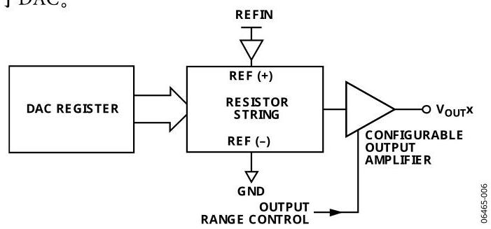

图44. DAC架构框图

电阻串结构如图45所示。它是一串电阻,各电阻的值为R。 载入DAC寄存器的编码决定抽取电阻串上哪一个节点的电压,以馈入输出放大器。抽取电压的方法是将连接电阻串与放大器的开关之一闭合。由于它是一串电阻, 因此可以保证单调性。

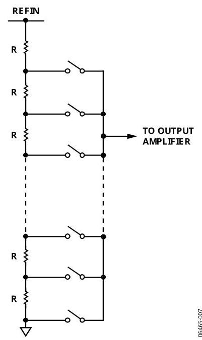

图45. 电阻串结构

## 输出放大器

输出放大器能够产生单极性和双极性两种输出电压, 能将一个与 4000pF 电容并联的 2kΩ 负载驱动至GND。从图24可以看出输出放大器的源电流和吸电流能力。压摆率为 3.5V/μs , 满量程建立时间为10μs。

## 基准电压缓冲器

AD5724R/AD5734R/AD5754R可以采用外部或内部基准电压源工作,基准电压输入范围是 2V 至 3V ,额定性能为 2.5V 。 输入电压先缓冲起来,然后再施加于DAC核心。

## 串行接口

AD5724R/AD5734R/AD5754R可以通过工作时钟速率最高达 30MHz 的多功能三线式串行接口进行控制。该接口与 SPI、QSPI™、MICROWIRE™和DSP标准兼容。

## 输入移位寄存器

输入移位寄存器为 24 位宽。数据在串行时钟输入SCLK的控制下以MSB优先方式作为24位字载入器件。输入寄存器包括一个读/写位、三个寄存器选择位、三个DAC地址位和 16位数据位。图2给出了这种操作的时序图。

## 独立操作

串行接口采用连续式和非连续式两种串行时钟工作。仅当 SYNC 在正确的时钟周期数内保持为低电平时,才能使用连续的SCLK时钟源。在门控时钟模式下, 必须采用包含确切时钟周期数的连续时钟,在时钟周期结束后必须将 SYNC 置为高电平来锁存数据。 SYNC 的第一个下降沿启动写周期。SCLK必须在 24 个时钟下降沿后, 才能将 SYNC 重新拉高。如果在第 24 个 SCLK 下降沿之前拉高 SYNC ,写入的数据无效。如果拉高 SYNC 前有超过 24 个 SCLK下降沿, 输入数据同样无效。寻址的输入寄存器在 SYNC 的上升沿更新。若需进行其他串行传输,必须将 SYNC 再次拉低。 串行传输结束后,数据自动从输入移位寄存器传送到寻址寄存器。

当数据传送至寻址DAC所选的寄存器后,所有DAC寄存器和输出端可以通过将 LDAC 置为低电平并使 SYNC 保持高电平来更新。

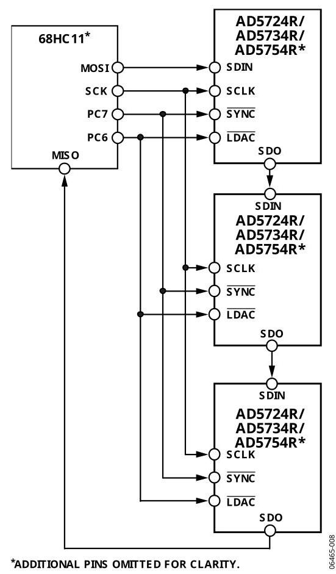

图46. AD5724R/AD5734R/AD5754R的菊花链连接

## 菊花链操作

对于包含数个器件的系统, 可利用SDO引脚通过菊花链方式将多个器件连接起来。菊花链模式有助于系统诊断和减少串行接口线的数量。 SYNC 的第一个下降沿启动写周期。当 SYNC 为低电平时, SCLK 不断施加到输入移位寄存器。如果施加了 24 个以上的时钟脉冲,则数据从移位寄存器纹波输出并出现在SDO线路上。此数据在SCLK上升沿逐个输出, 并在SCLK的下降沿有效。将第一个器件的 SDO连接到菊花链中下一个器件的SDIN输入, 可构建一个多器件接口。系统中的每个器件都需要24个时钟脉冲,因此总时钟周期数必须等于 24 x N ,其中 N 为菊花链中的 AD5724R/AD5734R/AD5754R器件总数。当对所有器件的串行传输结束时, SYNC变为高电平, 这样可以锁存菊花链中各器件的输入数据, 防止额外的数据进入输入移位寄存器。串行时钟可以是连续时钟或选通时钟。

仅当 SYNC 在正确的时钟周期数内保持为低电平时,才能使用连续的SCLK时钟源。在门控时钟模式下, 必须采用包含确切时钟周期数的连续时钟,在时钟周期结束后必须将 SYNC 置为高电平来锁存数据。

## 回读操作

回读模式通过在串行输入移位寄存器写操作时设置 R/W 位为1来调用。(如果通过控制寄存器中的SDO禁用位禁用了 SDO输出, 则读操作期间会自动启用该输出, 之后再次禁用。)当 R/W 置1时, A2 至 A0 位以及 REG2 位至 REG0 位用于选择所要读取的寄存器。写序列中其余的数据位为无关位。在下一次SPI写操作期间, SDO输出端的数据包含之前寻址寄存器的数据。当读取单个寄存器时, 可以使用 NOP命令通过SDO从选定的寄存器输出数据。回读图显示了回读顺序。例如, 要回读通道A的DAC寄存器, 应当实施如下操作序列:图 4

1. 将 0x800000写入AD5724R/AD5734R/AD5754R输入寄存器。这会将器件配置为读取模式, 同时选中通道A的 DAC寄存器。注意, 从DB15至DB0的所有数据位都是无关位。

2. 然后执行第二个写操作,写入NOP条件0x180000。在此写入期间,来自寄存器的数据在SDO线路上逐个输出。

## AD5724R/AD5734R/AD5754R

## 加载DAC (LDAC)

数据传输到DAC的输入寄存器之后, 有两种方法可以更新 DAC寄存器和DAC输出。根据SYNC和LDAC的状态, 选择两种更新模式之一:单独更新各DAC或同时更新所有 DAC。

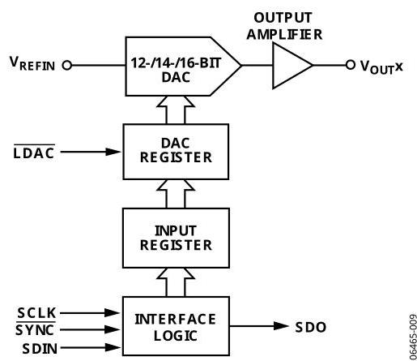

图47. 单个DAC的输入加载电路示意图

## 单独更新各DAC

在此模式下,当数据进入输入移位寄存器时, LDAC 要保持为低电平。寻址的DAC输出在SYNC的上升沿更新。

## 同时更新所有DAC

在此模式下,当数据进入输入移位寄存器时, LDAC 要保持为高电平。在拉高 LDAC 后,通过拉低 SYNC 可以异步更新所有DAC输出。此时在LDAC的下降沿进行更新。

## 异步清零 (CLR)

CLR 是低电平有效清零引脚,可用于将输出清零至零电平代码或中间电平代码。用户可通过控制寄存器的 CLR 选择位选择清零代码值(请参阅“控制寄存器”部分)。 CLR 必须至少保持一段时间的低电平才能完成操作 (参见图2)。当 CLR 信号变回高电平后, 输出会保持为清零值, 直到设置新值。当 CLR 引脚为低电平时,无法用新值更新输出。清零操作还可通过控制寄存器中的清零命令来执行。

## 配置AD5724R/AD5734R/AD5754R

AD5724R/AD5734R/AD5754R上电时,上电复位电路确保所有寄存器都默认为 0 。这会将所有通道以及内部基准电压源置于关断模式。在为任何接口线路供电之前, 必须将 DVCC拉高。否则, 向器件进行的第一次写操作可能被忽略。与AD5724R/AD5734R/AD5754R的第一次通信应是通过写入输出范围选择寄存器, 设置所有通道的要求输出范围(默认范围为 5V 单极性范围)。然后,用户应写入电源控制寄存器, 以给所需通道和内部基准电压源加电 (如需要)。如果使用的是外部基准电压源, 则内部基准电压源必须保持于关断模式。要设置某个通道上的输出值, 首先必须给该通道加电; 在通道处于关断模式时, 对其进行的写操作将被忽略。AD5724R/AD5734R/AD5754R支持宽电源范围。这些器件的电源必须具有充足的裕量, 以支持选择的输出范围。

## 传递函数

表8至图16显示AD5754R、AD5734R和AD5724R在所有输出电压范围下的理想输入代码与输出电压之间的关系。对于单极性输出范围, 数据编码方式始终为标准二进制。对于双极性输出范围,数据编码方式可由用户通过 BIN/2sCOMP 引脚进行选择, 可为偏移二进制或二进制补码。

对于单极性输出范围, 输出电压可表示为

$$
V_{OUT} = V_{REFIN} ×  Gain[  D/(2^N)]
$$

对于双极性输出范围, 输出电压可表示为

$$
V_{OUT} = V_{REFIN} ×  Gain[  D/(2^N)]   - (Gain ×  V_{REFIN})/2
$$

其中:

D 是载入DAC的代码的十进制等效值。

N 是DAC的位分辨率。

VREFIN 是REFIN引脚上施加的基准电压。

Gain是值取决于用户所选输出范围的内部增益, 如表7所示。

表7. 内部增益值

| 输出范围(V) | 增益值 |
|---|---|
| +5 | 2 |
| +10 | 4 |
| +10.8 | 4.32 |
| ±5 | 4 |
| ±10 | 8 |
| ±10.8 | 8.64 |

## 理想输出电压与输入代码之间的关系—AD5754R

表8. 双极性输出(偏移二进制编码)

| 数字输入 | | | | 模拟输出 | | |
|---|---|---|---|---|---|---|
| MSB | | | LSB | 输出范围:±5 V | 输出范围:±10 V | 输出范围:±10.8 V |
| 1111 | 1111 | 1111 | 1111 | +2 × REFIN × (32767/32768) | +4 × REFIN × (32767/32768) | +4.32 × REFIN × (32767/32768) |
| 1111 | 1111 | 1111 | 1110 | +2 × REFIN × (32766/32768) | +4 × REFIN × (32766/32768) | +4.32 × REFIN × (32766/32768) |
| ... | ... | ... | ... | ... | ... | ... |
| 1000 | 0000 | 0000 | 0001 | +2 × REFIN × (1/32768) | +4 × REFIN × (1/32768) | +4.32 × REFIN × (1/32768) |
| 1000 | 0000 | 0000 | 0000 | 0V | 0V | 0 V |
| 0111 | 1111 | 1111 | 1111 | -2 × REFIN × (1/32768) | -4 × REFIN × (1/32768) | -4.32 × REFIN × (1/32768) |
| ... | ... | ... | ... | ... | ... | ... |
| 0000 | 0000 | 0000 | 0001 | -2 × REFIN × (32766/32768) | -4 × REFIN × (32766/32768) | -4.32 × REFIN × (32766/32768) |
| 0000 | 0000 | 0000 | 0000 | -2 × REFIN × (32767/32768) | -4 × REFIN × (32767/32768) | -4.32 × REFIN × (32767/32768) |

表9. 双极性输出(二进制补码编码)

| 数字输入 | | | | 模拟输出 | | |
|---------|---|---|---|---------|---|---|
| MSB | | | LSB | 输出范围:±5 V | 输出范围:±10 V | 输出范围:±10.8 V |
| 0111 | 1111 | 1111 | 1111 | +2 × REFIN × (32767/32768) | +4 × REFIN × (32767/32768) | +4.32 × REFIN × (32767/32768) |
| 0111 | 1111 | 1111 | 1110 | +2 × REFIN × (32766/32768) | +4 × REFIN × (32766/32768) | +4.32 × REFIN × (32766/32768) |
| ... | ... | ... | ... | ... | ... | ... |
| 0000 | 0000 | 0000 | 0001 | +2 × REFIN × (1/32768) | +4 × REFIN × (1/32768) | +4.32 × REFIN × (1/32768) |
| 0000 | 0000 | 0000 | 0000 | 0 V | 0 V | 0 V |
| 1111 | 1111 | 1111 | 1111 | -2 × REFIN × (1/32768) | -4 × REFIN × (1/32768) | -4.32 × REFIN × (1/32768) |
| ... | ... | ... | ... | ... | ... | ... |
| 1000 | 0000 | 0000 | 0001 | -2 × REFIN × (32766/32768) | -4 × REFIN × (32766/32768) | -4.32 × REFIN × (32766/32768) |
| 1000 | 0000 | 0000 | 0000 | -2 × REFIN × (32767/32768) | -4 × REFIN × (32767/32768) | -4.32 × REFIN × (32767/32768) |

表10. 单极性输出(标准二进制编码)

| 数字输入 | | | | 模拟输出 | | |
|---------|---|---|---|---------|---|---|
| MSB | | | LSB | 输出范围:+5V | 输出范围:+10V | 输出范围:+10.8 V |
| 1111 | 1111 | 1111 | 1111 | +2 × REFIN × (65535/65536) | +4 × REFIN × (65535/65536) | +4.32 × REFIN × (65535/65536) |
| 1111 | 1111 | 1111 | 1110 | +2 × REFIN × (65534/65536) | +4 × REFIN × (65534/65536) | +4.32 × REFIN × (65534/65536) |
| ... | ... | ... | ... | ... | ... | ... |
| 1000 | 0000 | 0000 | 0001 | +2 × REFIN × (32769/65536) | +4 × REFIN × (32769/65536) | +4.32 × REFIN × (32769/65536) |
| 1000 | 0000 | 0000 | 0000 | +2 × REFIN × (32768/65536) | +4 × REFIN × (32768/65536) | +4.32 × REFIN × (32768/65536) |
| 0111 | 1111 | 1111 | 1111 | +2 × REFIN × (32767/65536) | +4 × REFIN × (32767/65536) | +4.32 × REFIN × (32767/65536) |
| ... | ... | ... | ... | ... | ... | ... |
| 0000 | 0000 | 0000 | 0001 | +2 × REFIN × (1/65536) | +4 × REFIN × (1/65536) | +4.32 × REFIN × (1/65536) |
| 0000 | 0000 | 0000 | 0000 | 0 V | 0 V | 0 V |

## AD5724R/AD5734R/AD5754R

## 理想输出电压与输入代码之间的关系—AD5734R

表11. 双极性输出(偏移二进制编码)

| 数字输入 | | | | 模拟输出 | | |
|---------|---|---|---|---------|---|---|
| MSB | | | LSB | 输出范围:±5 V | 输出范围:±10 V | 输出范围:±10.8 V |
| 11 | 1111 | 1111 | 1111 | +2 × REFIN × (8191/8192) | +4 × REFIN × (8191/8192) | +4.32 × REFIN × (8191/8192) |
| 11 | 1111 | 1111 | 1110 | +2 × REFIN × (8190/8192) | +4 × REFIN × (8190/8192) | +4.32 × REFIN × (8190/8192) |
| ... | ... | ... | ... | ... | ... | ... |
| 10 | 0000 | 0000 | 0001 | +2 × REFIN × (1/8192) | +4 × REFIN × (1/8192) | +4.32 × REFIN × (1/8192) |
| 10 | 0000 | 0000 | 0000 | 0 V | 0 V | 0 V |
| 01 | 1111 | 1111 | 1111 | -2 × REFIN × (1/8192) | -4 × REFIN × (1/8192) | -4.32 × REFIN × (1/8192) |
| ... | ... | ... | ... | ... | ... | ... |
| 00 | 0000 | 0000 | 0001 | -2 × REFIN × (8190/8192) | -4 × REFIN × (8190/8192) | -4.32 × REFIN × (8190/8192) |
| 00 | 0000 | 0000 | 0000 | -2 × REFIN × (8191/8192) | -4 × REFIN × (8191/8192) | -4.32 × REFIN × (8191/8192) |

表12. 双极性输出(二进制补码编码)

| 数字输入 | | | | 模拟输出 | | |
|---------|---|---|---|---------|---|---|
| MSB | | | LSB | 输出范围:±5 V | 输出范围:±10 V | 输出范围:±10.8 V |
| 01 | 1111 | 1111 | 1111 | +2 × REFIN × (8191/8192) | +4 × REFIN × (8191/8192) | +4.32 × REFIN × (8191/8192) |
| 01 | 1111 | 1111 | 1110 | +2 × REFIN × (8190/8192) | +4 × REFIN × (8190/8192) | +4.32 × REFIN × (8190/8192) |
| ... | ... | ... | ... | ... | ... | ... |
| 00 | 0000 | 0000 | 0001 | +2 × REFIN × (1/8192) | +4 × REFIN × (1/8192) | +4.32 × REFIN × (1/8192) |
| 00 | 0000 | 0000 | 0000 | 0 V | 0 V | 0 V |
| 11 | 1111 | 1111 | 1111 | -2 × REFIN × (1/8192) | -4 × REFIN × (1/8192) | -4.32 × REFIN × (1/8192) |
| ... | ... | ... | ... | ... | ... | ... |
| 10 | 0000 | 0000 | 0001 | -2 × REFIN × (8190/8192) | -4 × REFIN × (8190/8192) | -4.32 × REFIN × (8190/8192) |
| 10 | 0000 | 0000 | 0000 | -2 × REFIN × (8191/8192) | -4 × REFIN × (8191/8192) | -4.32 × REFIN × (8191/8192) |

表13. 单极性输出(标准二进制编码)

| 数字输入 | | | | 模拟输出 | | |
|---------|---|---|---|---------|---|---|
| MSB | | | LSB | 输出范围:+5V | 输出范围:+10V | 输出范围:+10.8 V |
| 11 | 1111 | 1111 | 1111 | +2 × REFIN × (16383/16384) | +4 × REFIN × (16383/16384) | +4.32 × REFIN × (16383/16384) |
| 11 | 1111 | 1111 | 1110 | +2 × REFIN × (16382/16384) | +4 × REFIN × (16382/16384) | +4.32 × REFIN × (16382/16384) |
| ... | ... | ... | ... | ... | ... | ... |
| 10 | 0000 | 0000 | 0001 | +2 × REFIN × (8193/16384) | +4 × REFIN × (8193/16384) | +4.32 × REFIN × (8193/16384) |
| 10 | 0000 | 0000 | 0000 | +2 × REFIN × (8192/16384) | +4 × REFIN × (8192/16384) | +4.32 × REFIN × (8192/16384) |
| 01 | 1111 | 1111 | 1111 | +2 × REFIN × (8191/16384) | +4 × REFIN × (8191/16384) | +4.32 × REFIN × (8191/16384) |
| ... | ... | ... | ... | ... | ... | ... |
| 00 | 0000 | 0000 | 0001 | +2 × REFIN × (1/16384) | +4 × REFIN × (1/16384) | +4.32 × REFIN × (1/16384) |
| 00 | 0000 | 0000 | 0000 | 0 V | 0 V | 0 V |

## 理想输出电压与输入代码之间的关系—AD5724R

表14. 双极性输出(偏移二进制编码)

| 数字输入 | | | | 模拟输出 | | |
|---------|---|---|---|---------|---|---|
| MSB | | | LSB | 输出范围:±5 V | 输出范围:±10 V | 输出范围:±10.8 V |
| 1111 | 1111 | 1111 | | +2 × REFIN × (2047/2048) | +4 × REFIN × (2047/2048) | +4.32 × REFIN × (2047/2048) |
| 1111 | 1111 | 1110 | | +2 × REFIN × (2046/2048) | +4 × REFIN × (2046/2048) | +4.32 × REFIN × (2046/2048) |
| ... | ... | ... | ... | ... | ... | ... |
| 1000 | 0000 | 0001 | | +2 × REFIN × (1/2048) | +4 × REFIN × (1/2048) | +4.32 × REFIN × (1/2048) |
| 1000 | 0000 | 0000 | | 0V | 0V | 0 V |
| 0111 | 1111 | 1111 | | -2 × REFIN × (1/2048) | -4 × REFIN × (1/2048) | -4.32 × REFIN × (1/2048) |
| ... | ... | ... | ... | ... | ... | ... |
| 0000 | 0000 | 0001 | | -2 × REFIN × (2046/2048) | -4 × REFIN × (2046/2048) | -4.32 × REFIN × (2046/2048) |
| 0000 | 0000 | 0000 | | -2 × REFIN × (2047/2048) | -4 × REFIN × (2047/2048) | -4.32 × REFIN × (2047/2048) |

表15. 双极性输出(二进制补码编码)

| 数字输入 | | | | 模拟输出 | | |
|---------|---|---|---|---------|---|---|
| MSB | | | LSB | 输出范围:±5 V | 输出范围:±10 V | 输出范围:±10.8 V |
| 0111 | 1111 | 1111 | | +2 × REFIN × (2047/2048) | +4 × REFIN × (2047/2048) | +4.32 × REFIN × (2047/2048) |
| 0111 | 1111 | 1110 | | +2 × REFIN × (2046/2048) | +4 × REFIN × (2046/2048) | +4.32 × REFIN × (2046/2048) |
| ... | ... | ... | ... | ... | ... | ... |
| 0000 | 0000 | 0001 | | +2 × REFIN × (1/2048) | +4 × REFIN × (1/2048) | +4.32 × REFIN × (1/2048) |
| 0000 | 0000 | 0000 | | 0 V | 0 V | 0 V |
| 1111 | 1111 | 1111 | | -2 × REFIN × (1/2048) | -4 × REFIN × (1/2048) | -4.32 × REFIN × (1/2048) |
| ... | ... | ... | ... | ... | ... | ... |
| 1000 | 0000 | 0001 | | -2 × REFIN × (2046/2048) | -4 × REFIN × (2046/2048) | -4.32 × REFIN × (2046/2048) |
| 1000 | 0000 | 0000 | | -2 × REFIN × (2047/2048) | -4 × REFIN × (2047/2048) | -4.32 × REFIN × (2047/2048) |

表16. 单极性输出(标准二进制编码)

| 数字输入 | | | | 模拟输出 | | |
|---------|---|---|---|---------|---|---|
| MSB | | | LSB | 输出范围:+5V | 输出范围:+10 V | 输出范围:+10.8 V |
| 1111 | 1111 | 1111 | | +2 × REFIN × (4095/4096) | +4 × REFIN × (4095/4096) | +4.32 × REFIN × (4095/4096) |
| 1111 | 1111 | 1110 | | +2 × REFIN × (4094/4096) | +4 × REFIN × (4094/4096) | +4.32 × REFIN × (4094/4096) |
| ... | ... | ... | ... | ... | ... | ... |
| 1000 | 0000 | 0001 | | +2 × REFIN × (2049/4096) | +4 × REFIN × (2049/4096) | +4.32 × REFIN × (2049/4096) |
| 1000 | 0000 | 0000 | | +2 × REFIN × (2048/4096) | +4 × REFIN × (2048/4096) | +4.32 × REFIN × (2048/4096) |
| 0111 | 1111 | 1111 | | +2 × REFIN × (2047/4096) | +4 × REFIN × (2047/4096) | +4.32 × REFIN × (2047/4096) |
| ... | ... | ... | ... | ... | ... | ... |
| 0000 | 0000 | 0001 | | +2 × REFIN × (1/4096) | +4 × REFIN × (1/4096) | +4.32 × REFIN × (1/4096) |
| 0000 | 0000 | 0000 | | 0V | 0V | 0 V |

## AD5724R/AD5734R/AD5754R

## 输入寄存器

输入寄存器为24位宽,由一个读/写位 (R/W) 、一个必须始终设为 0 的保留位(Zero)、三个寄存器选择位(REG1, REG2, REG3)、 三个DAC地址位(A2, A1, A0)和16个数据位(Data)构成。寄存器数据在SDIN引脚上的输入方式是MSB优先。表17所示为寄存器格式, 表 18 所示则为寄存器中各位的功能。所有寄存器都是读/写寄存器。

表17. AD5754R输入寄存器格式

MSB LSB

| DB23 | DB22 | DB21 | DB20 | DB19 | DB18 | DB17 | DB16 | DB15 至 DB0 |
|------|------|------|------|------|------|------|------|------|-------------|
| R/W  | Zero | REG2 | REG1 | REG0 | A2   | A1   | A0   | Data        |

## 表18. 输入寄存器位功能

| 数据 | 描述 |
|------|------|
| R/W | 表示对寻址寄存器的读或写操作。 |
| REG2, REG1, REG0 | 与地址位配合使用,以确定写操作的目标是DAC寄存器、输出范围选择寄存器、电源控制寄存器或控制寄存器 |
|  | REG2 | REG1 | REG0 | 功能 |
|  | 0 | 0 | 0 | DAC寄存器 |
|  | 0 | 0 | 1 | 输出范围选择寄存器 |
|  | 0 | 1 | 0 | 电源控制寄存器 |
|  | 0 | 1 | 1 | 控制寄存器 |
| A2, A1, A0 | 这些位用于DAC通道解码 |
|  | A2 | A1 | A0 | 通道地址 |
|  | 0 | 0 | 0 | DAC A |
|  | 0 | 0 | 1 | DAC B |
|  | 0 | 1 | 0 | DAC C |
|  | 0 | 1 | 1 | DAC D |
|  | 1 | 0 | 0 | 全部四个DAC |
| DB15 至 DB0 | 数据位 |

## DAC寄存器

DAC寄存器通过将三个REG位设为000来寻址。DAC地址位选择要进行数据传输的DAC通道(参见表18)。对于AD5754R, 数据位位于DB15至DB0(参见表19)；对于AD5734R,则是DB15至DB2(参见表20)；对于AD5724R,则为DB15至DB4(参见表21)。

表19. AD5754R DAC寄存器编程

MSB LSB

<table><tr><td>R/W</td><td>Zero</td><td>REG2</td><td>REG1</td><td>REGO</td><td>A2</td><td>A1</td><td>A0</td><td>DB15 至 DB0</td></tr><tr><td>0</td><td>0</td><td>0</td><td>0</td><td>0</td><td/><td>DAC地址</td><td/><td>16位DAC数据</td></tr></table>

表20. AD5734R DAC寄存器编程

MSB LSB

<table><tr><td>R/W</td><td>Zero</td><td>REG2</td><td>REG1</td><td>REGO</td><td>A2</td><td>A1</td><td>A0</td><td>DB15 至 DB2</td><td>DB1</td><td>DB0</td></tr><tr><td>0</td><td>0</td><td>0</td><td>0</td><td>0</td><td/><td>DAC地址</td><td/><td>14位DAC数据</td><td>✘</td><td>✘</td></tr></table>

## 表21. AD5724R DAC寄存器编程

MSB

<table><tr><td>R/W</td><td>Zero</td><td>REG2</td><td>REG1</td><td>REGO</td><td>A2</td><td>A1</td><td>A0</td><td>DB15 至 DB4</td><td>DB3</td><td>DB2</td><td>DB1</td><td>DB0</td></tr><tr><td>0</td><td>0</td><td>0</td><td>0</td><td>0</td><td/><td>DAC地址</td><td/><td>12位DAC数据</td><td>✘</td><td>✘</td><td>✘</td><td>✘</td></tr></table>

## 输出范围选择寄存器

输出范围选择寄存器通过将三个REG位设为001来寻址。DAC地址位选择DAC通道,范围位(R2, R1, R0)选择所需的输出范围 (参见表 22 和表 23)。

## 表22. 设置所需的电压范围

MSB LSB

<table><tr><td>R/W</td><td>Zero</td><td>REG2</td><td>REG1</td><td>REGO</td><td>A2</td><td>A1</td><td>A0</td><td>DB15 至 DB3</td><td>DB2</td><td>DB1</td><td>DB0</td></tr><tr><td>1/0</td><td>0</td><td>0</td><td>0</td><td>1</td><td/><td>DAC地址</td><td/><td>无关</td><td>R2</td><td>R1</td><td>R0</td></tr></table>

## 表23. 输出范围选项

<table><tr><td>R2</td><td>R1</td><td>R0</td><td>输出范围(V)</td></tr><tr><td>0</td><td>0</td><td>0</td><td>+5</td></tr><tr><td>0</td><td>0</td><td>1</td><td>+10</td></tr><tr><td>0</td><td>1</td><td>0</td><td>+10.8</td></tr><tr><td>0</td><td>1</td><td>1</td><td>±5</td></tr><tr><td>1</td><td>0</td><td>0</td><td>±10</td></tr><tr><td>1</td><td>0</td><td>1</td><td>±10.8</td></tr></table>

## AD5724R/AD5734R/AD5754R

## 控制寄存器

控制存器通过将三个REG位设为011来寻址。根据写入地址位和数据位的值来决定所选择的控制功能。控制寄存器选项如表 24 和表 25 所示。

## 表24. 控制寄存器编程

MSB LSB

<table><tr><td>R/W</td><td>Zero</td><td>REG2</td><td>REG1</td><td>REGO</td><td>A2</td><td>A1</td><td>A0</td><td>DB15 至 DB4</td><td>DB3</td><td>DB2</td><td>DB1</td><td>DB0</td></tr><tr><td>0</td><td>0</td><td>0</td><td>1</td><td>1</td><td>0</td><td>0</td><td>0</td><td colspan="5">NOP, 数据 = 无关</td></tr><tr><td>0</td><td>0</td><td>0</td><td>1</td><td>1</td><td>0</td><td>0</td><td>1</td><td>无关</td><td>TSD使能</td><td>箝位使能</td><td>CLR选择</td><td>SDO禁用</td></tr><tr><td>0</td><td>0</td><td>0</td><td>1</td><td>1</td><td>1</td><td>0</td><td>0</td><td colspan="5">清零, 数据 = 无关</td></tr><tr><td>0</td><td>0</td><td>0</td><td>1</td><td>1</td><td>1</td><td>0</td><td>1</td><td colspan="5">加载, 数据=无关</td></tr></table>

## 表25. 控制寄存器功能

<table><tr><td>选项</td><td>描述</td></tr><tr><td>无操作(NOP)</td><td>用于回读操作的无操作指令。</td></tr><tr><td>清零</td><td>寻址此功能会将DAC寄存器设为清零代码,并更新输出。</td></tr><tr><td>加载</td><td>寻址此功能会更新DAC寄存器和相应的DAC输出。</td></tr><tr><td>SDO禁用</td><td>由用户置1时,禁用SDO输出。由用户清0时,使能SDO输出(默认)。</td></tr><tr><td>CLR选择</td><td>有关CLR选择操作的描述,请参见表26。</td></tr><tr><td>箝位使能</td><td>由用户置1时,使能限流箝位(默认)。通道在检测到过流时不会关断；电流箝位在20mA。由用户清0时, 禁用限流箝位。通道在检测到过流时关断。</td></tr><tr><td>TSD使能</td><td>由用户置1时,使能热关断功能。由用户清0时,禁用热关断功能(默认)。</td></tr></table>

## 表26.CLR选择选项

<table><tr><td rowspan="2">CLR选择设置</td><td colspan="2">输出CLR值</td></tr><tr><td>单极性输出范围</td><td>双极性输出范围</td></tr><tr><td>0</td><td>0V中间</td><td>0 V</td></tr><tr><td>1</td><td>电平</td><td>负满量程</td></tr></table>

## 电源控制寄存器

电源控制寄存器通过将三个REG位设为010来寻址。该寄存器允许用户控制和确定AD5724R/AD5734R/AD5754R的电源和热状态。电源控制寄存器选项如表 27 和表 28 所示。

## 表27. 电源控制寄存器编程

MSB LSB

<table><tr><td>R/W</td><td>Zero</td><td>REG2</td><td>REG1</td><td>REGO</td><td>A2</td><td>A1</td><td>A0</td><td>DB15 至 DB11</td><td>DB10</td><td>DB9</td><td>DB8</td><td>DB7</td><td>DB6</td><td>DB5</td><td>DB4</td><td>DB3</td><td>DB2</td><td>DB1</td><td>DB0</td></tr><tr><td>0</td><td>0</td><td>0</td><td>1</td><td>0</td><td>0</td><td>0</td><td>0</td><td>✘</td><td>OC_D</td><td>OCc</td><td>OC_B</td><td>OC_A</td><td>0</td><td>TSD</td><td>PU_REF</td><td>PU_D</td><td>PUc</td><td>PU_B</td><td>PU_A</td></tr></table>

## 表28电源控制寄存器的功能

<table><tr><td>选项</td><td>描述</td></tr><tr><td>PU_A</td><td>DAC A上电。置1时,该位将DAC A置于正常工作模式。清0时,该位将DAC A置于关断模式(默认)。将该位置1来给DAC A 上电时,所需上电时间为10μs。在此期间,不应将DAC寄存器加载至DAC输出(参见"加载DAC (LDAC)"部分)。如果控制寄 存器的箝位使能位清0,则DAC A将在检测到过流时自动关断,并且PU₁清0以反应这种情况。</td></tr><tr><td>PU_B</td><td>DAC B上电。置1时,该位将DAC B置于正常工作模式。清0时,该位将DAC B置于关断模式(默认)。将该位置1来给DAC B 上电时,所需上电时间为10μs。在此期间,不应将DAC寄存器加载至DAC输出(参见"加载DAC (LDAC)"部分)。如果控制寄 存器的箝位使能位清0,则DAC B将在检测到过流时自动关断,并且PUв清0以反应这种情况。</td></tr><tr><td>PUc</td><td>DAC C上电。置1时,该位将DAC C置于正常工作模式。清0时,该位将DAC C置于关断模式(默认)。将该位置1来给DAC C上 电时,所需上电时间为10μs。在此期间,不应将DAC寄存器加载至DAC输出(参见"加载DAC (LDAC)"部分)。如果控制寄存器 的箝位使能位清0,则DACC将在检测到过流时自动关断,并且PUc清0以反应这种情况。</td></tr><tr><td>PU_D</td><td>DAC D上电。置1时,该位将DAC D置于正常工作模式。清0时,该位将DAC D置于关断模式(默认)。将该位置1来给DAC D上 电时,所需上电时间为10μs。在此期间,不应将DAC寄存器加载至DAC输出(参见"加载DAC (LDAC)"部分)。如果控制寄存器 的箝位使能位清0,则DACD将在检测到过流时自动关断,并且PU₁清0以反应这种情况。</td></tr><tr><td>PU_REF</td><td>基准电压源上电。置1时,该位将内部基准电压源置于正常工作模式。清0时,该位将内部基准电压源置于关断模式(默认)。</td></tr><tr><td>TSD</td><td>热关断报警。只读位。在发生过温时,四个DAC将关断,并且该位置1。</td></tr><tr><td>OC_A</td><td>DAC A过流报警。只读位。DAC A发生过流时,该位置1。</td></tr><tr><td>OC_B</td><td>DAC B过流报警。只读位。DAC B发生过流时,该位置1。</td></tr><tr><td>OCc</td><td>DAC C过流报警。只读位。DAC C发生过流时,该位置1。</td></tr><tr><td>OC_D</td><td>DAC D过流报警。只读位。DAC D发生过流时,该位置1。</td></tr></table>

## AD5724R/AD5734R/AD5754R

## 设计特性

## 模拟输出控制

在很多工业过程控制应用中, 输出电压在上电期间可控至关重要。当电源电压在上电期间发生变化时, VOUTX 引脚通过一个低阻抗路径 (约4kΩ) 箝位至 0V 。为避免此时输出放大器的输出短路变为 0V ,传输门 G1 也会打开 (参见图48)。 这种状况会一直持续到电源稳定下来并向DAC寄存器写入一个有效字。此时, G2打开, G1闭合。

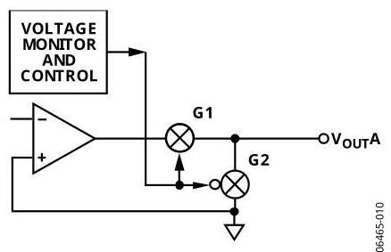

图48. 模拟输出控制电路

## 关断模式

AD5724R/AD5734R/AD5754R的每个DAC通道均可单独关断。默认情况下,所有通道均处于关断模式。电源状态由电源控制寄存器控制(详见表 27 和表 28)。当通道处于关断模式时,其输出引脚通过大约 4kΩ 的电阻被箝位至接地, 而放大器的输出与输出引脚断开。

## 过流保护

AD5724R/AD5734R/AD5754R的每个DAC通道均有单独的过流保护装置。用户可通过两种方式配置过流保护: 恒定电流箝位或自动通道关断。过流保护的配置通过控制寄存器的箝位使能位选择。

## 恒定电流箝位 (箝位使能 = 1)

在此配置下,如果发生短路,则电流将箝位在 20mA 。该事件通过电源控制寄存器中相应的过流 (OC_X) 位置 1 来通知用户。短路故障消除时, OC_X 位将清 0 。

## 自动通道关断(箝位使能 = 0)

在此配置下,如果发生短路,则短路通道将关断,且其输出通过大约 4kΩ 的电阻箝位至接地。同时,放大器的输出与输出引脚断开。该短路事件通过过流位 (OC_x) 通知用户,而上电位 (PU_X) 则指示已关断的通道。故障消除后,可通过将 PU_x 位置 1 再次使通道上电。

## 热关断

AD5724R/AD5734R/AD5754R集成一种热关断功能,可以在核心温度超过 150°C 左右时自动关断器件。该热关断功能在默认情况下被禁用, 可通过控制寄存器的TSD使能位来使能。发生热关断时, 电源控制寄存器的TSD位置1。

## 内部基准电压源

片内基准电压源默认关断。如果使用的是外部基准电压源, 则内部基准电压源必须始终保持于关断模式。如果要将内部基准电压源用作基准电压源, 则必须通过电源控制寄存器的 PU_REF 位使其上电。内部基准电压可以在 REFIN/REFOUT引脚处提供, 用作系统中其他器件的基准电压源。如果要在AD5724R/AD5734R/AD5754R之外使用内部基准电压,则必须先进行缓冲。

## 应用信息

## +5 V/±5 V电源

采用 +5V 单电源或 ±5V 双电源供电时,无法获得 +5V 或 ±5V 的输出范围, 因为输出放大器的裕量有限。这种情况下, 可以使用较小基准电压；例如,如果 2V 基准电压可以产生 +4V 或 ±4V 的输出范围,则1V 的裕量已足够。可使用2.048V 的标准值基准电压,以产生 +4.096V 和 ±4.096V 的输出范围。有关在多种基准电压值下的性能数据, 请参阅"典型性能特性"曲线图。

## 布局指南

在任何注重精度的电路中, 精心考虑电源和接地回路布局都有助于确保达到规定的性能。安装AD5724R/AD5734R/AD5754R 所用的印刷电路板应采用模拟部分与数字部分分离设计, 并限制在电路板的一定区域内。如果AD5724R/AD5734R/AD5754R 所在系统中有多个器件要求AGND至DGND连接, 则只能在一个点上进行连接。星形接地点尽可能靠近该器件。

AD5724R/AD5734R/AD5754R应当具有足够大的10μF电源电容,与每个电源上的 0.1μF 电容并联,并且尽可能靠近封装,最好是正对着该器件。 10μF 电容应为钽珠型电容。0.1μF电容应具有低等效串联电阻(ESR)和低等效串联电感(ESI), 如高频时提供低阻抗接地路径的普通陶瓷型电容,以便处理内部逻辑开关所引起的瞬态电流。

AD5724R/AD5734R/AD5754R的电源线路应采用尽可能宽的走线, 以提供低阻抗路径, 并减小电源线路上的毛刺效应。将时钟等快速开关信号用数字地屏蔽起来, 以免向电路板上的其他器件辐射噪声,并且绝不应靠近基准输入。 SDIN线路与SCLK线路之间布设接地线路有助于降低二者之间的串扰(多层电路板上不需要,因为它有独立的接地层, 但分开不同线路对此的确有所帮助)。REFIN线路上的噪声必须降至最低,因为这种噪声会被耦合至DAC输出。

避免数字信号与模拟信号交叠。电路板相对两侧上的走线应当彼此垂直。这样有助于减小电路板的馈通效应。微带线技术是目前为止最好的方法, 但这种技术对于双面电路板未必始终可行。采用这种技术时, 电路板的元件侧专用于接地层,而信号走线则布设在焊接侧。

## 电流隔离接口

在许多过程控制应用中, 需要在控制器与受控单元之间提供一个隔离栅, 以保护和隔离控制电路, 使其不受可能出现的任何危险共模电压影响。ADI公司的 iCoupler® 系列产品可提供超过 2.5kV 的电压隔离。AD5724R/AD5734R/AD5754R 采用串行加载结构, 使接口线路数量保持最少, 因此成为隔离接口应用的理想选择。图49显示使用ADuM1400时与 AD5724R/AD5734R/AD5754R的4通道隔离接口。欲了解更多信

息,请访问http://www.analog.com/zh/icouplers

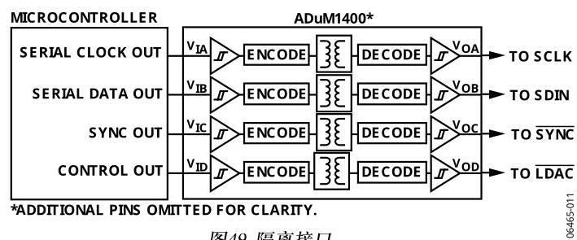

图49. 隔离接口

## 微处理器接口

AD5724R/AD5734R/AD5754R通过一条串行总线实现与微处理器的接口, 这条总线使用与微控制器和DSP处理器兼容的标准协议。通信通道是包含一个时钟信号、一个数据信号和一个同步信号的三线(最少的)接口。AD5724R/AD5734R/AD5754R 需要24位数据字,在SCLK的下降沿时数据有效。

对于所有接口来说, 当所有数据输入时, DAC的输出更新可以自动启动, 或者可以在LDAC的控制下完成。寄存器的内容可采用回读功能进行读取。

## AD5724R/AD5734R/AD5754R至Blackfin® DSP接C

图50显示了AD5724R/AD5734R/AD5754R与ADI Blackfin DSP的接口方式。Blackfin集成了一个SPI端口, 可以直接连到AD5724R/AD5734R/AD5754R的SPI引脚和可编程I/O引脚, 以便设置 LDAC 引脚等数字输入的状态。

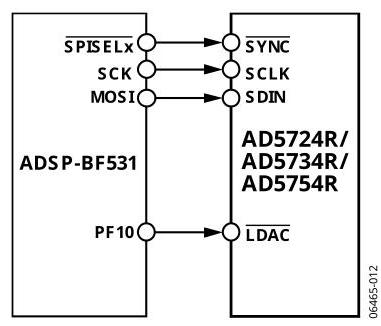

图50. AD5724R/AD5734R/AD5754R至Blackfin接口

## 外形尺寸

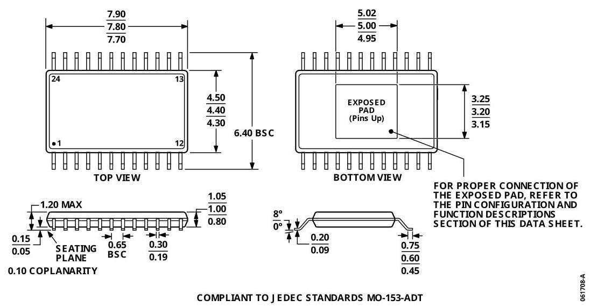

图51.24引脚裸露焊盘、超薄紧缩小型封装[TSSOP_EP] (RE-24) 图示尺寸单位:mm

## 订购指南

| 型号¹ | 分辨率 | 温度范围 | 积分非线性(INL) | 封装描述 | 封装选项 |
|-------|--------|----------|----------------|----------|----------|
| AD5724RBREZ | 12 | -40°C 至 +85°C | ±1 LSB | 24引脚 TSSOP_EP | RE-24 |
| AD5724RBREZ-REEL7 | 12 | -40°C 至 +85°C | ±1 LSB | 24引脚 TSSOP_EP | RE-24 |
| AD5734RBREZ | 14 | -40°C 至 +85°C | ±4 LSB | 24引脚 TSSOP_EP | RE-24 |
| AD5734RBREZ-REEL7 | 14 | -40°C 至 +85°C | ±4 LSB | 24引脚 TSSOP_EP | RE-24 |
| AD5754RBREZ | 16 | -40°C 至 +85°C | ±16 LSB | 24引脚 TSSOP_EP | RE-24 |
| AD5754RBREZ-REEL7 | 16 | -40°C 至 +85°C | ±16 LSB | 24引脚 TSSOP_EP | RE-24 |
| EVAL-AD5754REBZ | | | | 评估板 | |

¹ Z = 符合RoHS标准的器件。
