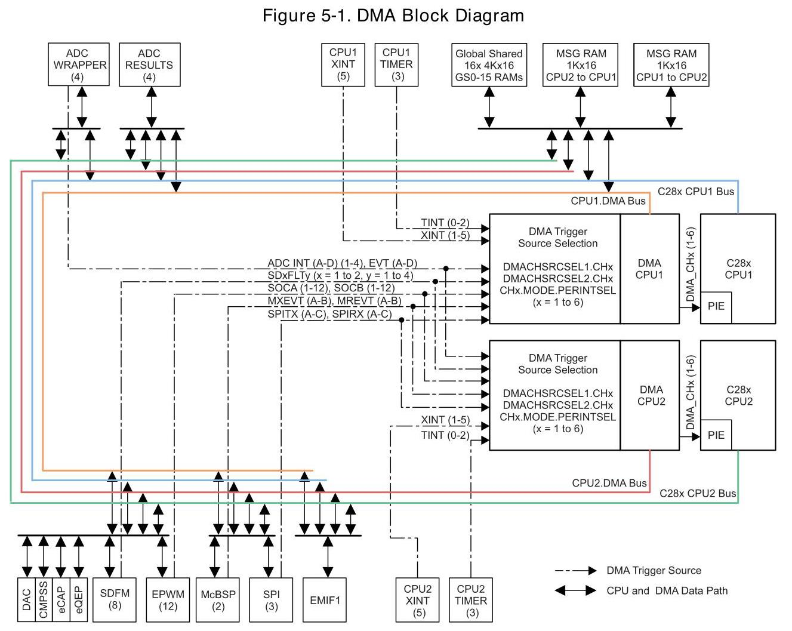
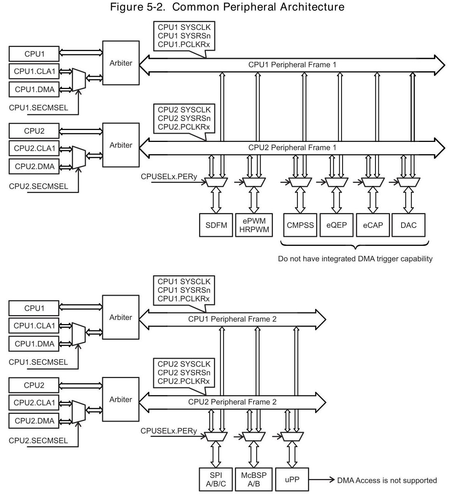
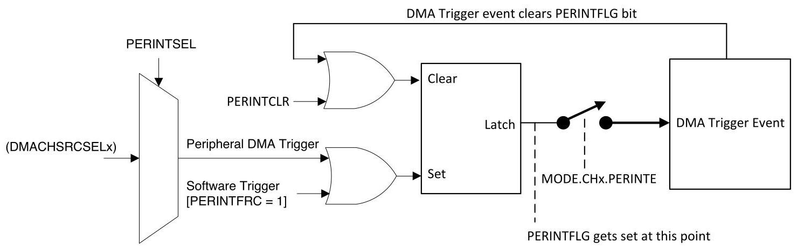
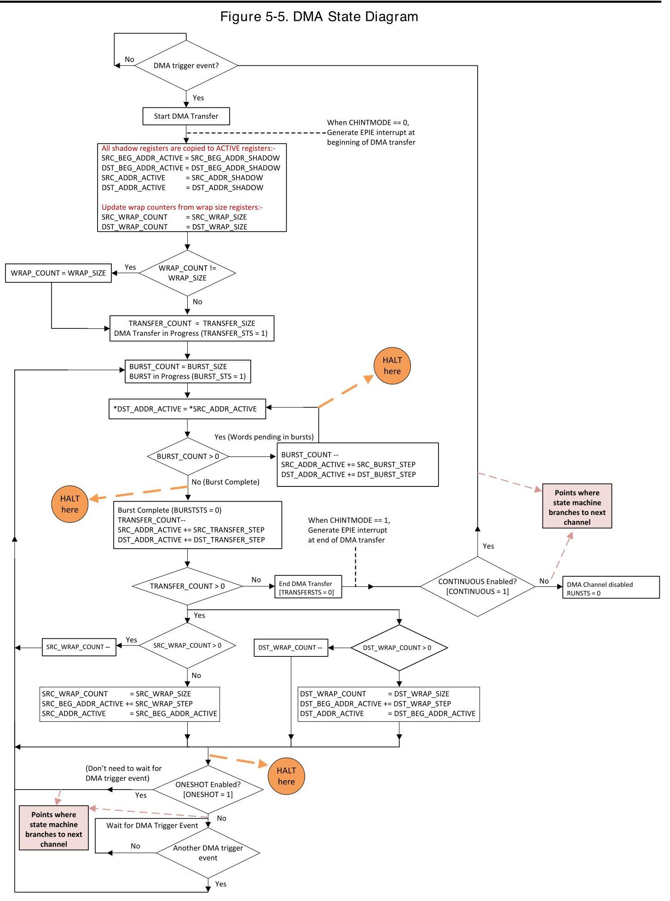
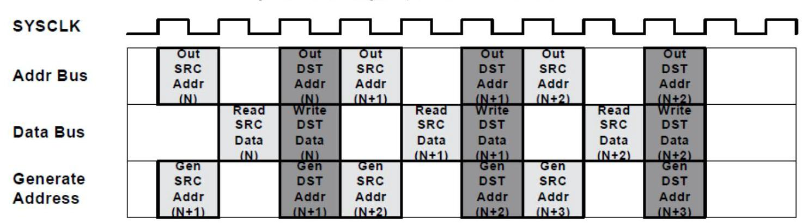
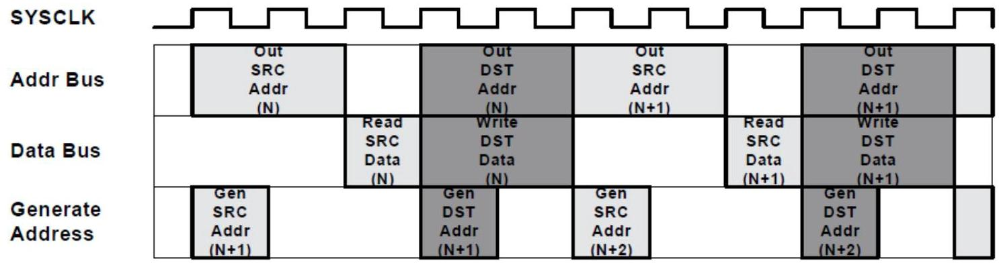
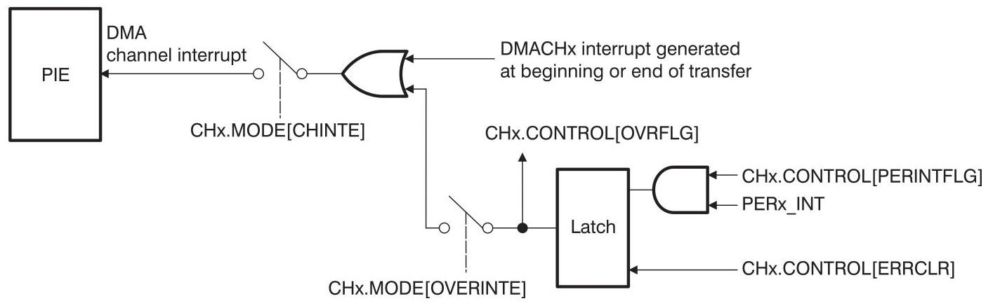
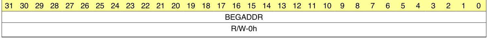
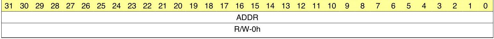

## Direct Memory Access (DMA)

The direct memory access (DMA) module provides a hardware method of transferring data between peripherals and/or memory without intervention from the CPU, thereby freeing up bandwidth for other system functions. Additionally, the DMA has the capability to orthogonally rearrange the data as it is transferred as well as "ping-pong" data between buffers. These features are useful for structuring data into

blocks for optimal CPU processing.直接存储器访问( DMA) 模块提供了一种在外设和/或存储器之间传输数据的硬件方法,从而

释放了对其他系统功能的带宽。此外, DMA还能够在传输数据时正交地重新排列数据,以及

Topic

在缓冲区之间的“乒乓”数据。这些特性有助于将数据构造成块,以实现最佳的CPU处理。

Page

5.1 Introduction 647

5.2 Features 647

5.3 Architecture 648

5.4 Address Pointer and Transfer Control 655

5.5 Pipeline Timing and Throughput 660

5.6 CPU and CLA Arbitration. 661

5.7 Channel Priority 662

5.8 Overrun Detection Feature. 663

5.9 DMA Registers 664

### 5.1 Introduction

The strength of a controller is not measured purely in processor speed, but in total system capabilities. As a part of the equation, any time the CPU bandwidth for a given function can be reduced, the greater the system capabilities. Many times applications spend a significant amount of their bandwidth moving data, whether it is from off-chip memory to on-chip memory, or from a peripheral such as an analog-to-digital converter (ADC) to RAM, or even from one peripheral to another. Furthermore, many times this data comes in a format that is not conducive to the optimum processing powers of the CPU. The DMA module described in this reference guide has the ability to free up CPU bandwidth and rearrange the data into a pattern for more streamlined processing.

The DMA module is an event-based machine, meaning it requires a peripheral or software trigger to start a DMA transfer. Although it can be made into a periodic time-driven machine by configuring a timer as the DMA trigger source, there is no mechanism within the module itself to start memory transfers periodically The DMA module has six independent DMA channels which can be configured separately and each channel contains its own independent PIE interrupt to let the CPU know when a DMA transfer has either started or completed. Five of the six channels are exactly the same, while Channel 1 has the ability to be configured at a higher priority than the others. At the heart of the DMA is a state machine and tightly coupled address control logic. It is this address control logic that allows for rearrangement of the block of data during the transfer as well as the process of ping-ponging data between buffers. Each of these features, along with others, will be discussed in detail in this document.

### 5.2 Features

DMA features include:

- Six channels with independent PIE interrupts

- Each DMA channel can be triggered from multiple peripheral trigger sources independently

- Word Size: 16-bit or 32-bit (SPI limited to 16-bit)

- Throughput: 3 cycles/word without arbitration

### 5.3 Architecture

#### 5.3.1 Block Diagram

Figure 5-1 shows a device-level block diagram of the DMA.

#### 5.3.2 Common Peripheral Architecture

There are two CPU subsystems; the CPU1 subsystem and CPU2 subsystem, with each containing a CLA and a DMA. The architecture allows several peripherals to be common between the two subsystems. Based on application need, these common peripherals can be attached to one of the two subsystems. Figure 5-2 shows how the CPUs and subsystems can be connected to the peripherals on peripheral frames 1 and 2. The clock, clock-enable, and reset muxing for the common peripherals are described in detail in other sections of this document.

Refer to Section 5.6 for more details on the arbitration scheme for all masters.

NOTE: If CPU and DMA make an access to the same peripheral frame in the same cycle, the DMA has priority and the CPU is stalled.

A CPUSEL bit associated with each peripheral defines whether the peripheral belongs to the CPU1 or CPU2 subsystem. If a peripheral belongs to a CPU subsystem, it can be accessed by the CPU and one of the secondary masters (DMA or CLA1). Refer to CPUSELx register definition for more details. The secondary master is statically selected using the SECMSEL register mapped to the respective CPU. Refer to CPUx.SECMSEL register definition for more details. If a secondary master is not selected, all writes from that master are ignored and all reads return 0x0 to any of the peripherals.

Similarly, if a peripheral does not belong to a CPU subsystem (as defined by the associated CPUSEL bit), all writes to that peripheral are ignored and all reads to that peripheral return 0x0 from any of the masters belonging to the unselected CPU subsystem. Note that since the arbiter has no knowledge regarding the ownership of individual peripherals (as can be seen from Figure 5-2), arbitration will still happen even if C28x or the selected secondary master tries to access a peripheral which does not belong to its CPU subsystem. See CPU Arbitration for more information.

5.3.3 Peripheral Interrupt Event Trigger Sources

Each DMA Channel can be configured to trigger by software and other peripheral triggers events. DMACHSRCSELx register can be used to configure DMA Trigger sources for each DMA channel. CHx.MODE.PERINTSEL register bitfield should be set to channel number (CHx.MODE.PERINTSEL = x) as shown in Figure 5-3. Included in these DMA Trigger sources are five external interrupt signals which can be connected to most of the general-purpose input/output (GPIO) pins on the device. This adds significant flexibility to the event trigger capabilities. Upon receipt of a peripheral interrupt event signal, the DMA will automatically send a clear signal to the interrupt source so that subsequent interrupt events will occur.

NOTE: To use the system level DMA Trigger source selection, the DMA internal trigger source selection configuration for each channel should be done using the DMACHSRCSELx register, and the CHx.MODE.PERINTSEL register as shown here. See Table 5-1 or the DMACHSRCSELx register definition for a complete list of DMA trigger sources.

Regardless of the value of the MODE.CHx[PERINTSEL] bit field, software can always force a trigger by using the CONTROL.CHx[PERINTFRC] bit. Likewise, software can always clear a pending DMA trigger using the CONTROL.CHx[PERINTCLR] bit.

Once a particular peripheral trigger event sets a channel's PERINTFLG bit, the bit remains pending until the priority logic of the state machine starts the burst transfer for that channel. Once the burst transfer starts, the flag is cleared. If a new peripheral trigger event is generated while a burst is in progress, the burst will complete before responding to the new peripheral trigger event (after proper prioritization). If a third peripheral trigger event occurs before the pending event is serviced, an error flag is set in the CONTROL.CHx[OVRFLG] bit. If a peripheral trigger event occurs at the same time as the latched flag is being cleared, the trigger event has priority and the PERINTFLG will remain set.

Figure 5-4 shows a diagram of the trigger select circuit. See the DMACHSRCSELx register description for the complete list of peripheral trigger event sources.

Figure 5-4. Peripheral Interrupt Trigger Input Diagram

A See Figure 5-3.

Table 5-1 shows the peripheral trigger source options that are available for each channel.

Table 5-1. DMA Trigger Source Options

<table><tr><td>Select Value (8-bit)</td><td>DMA ChTrigger Source</td></tr><tr><td>0</td><td>No Peripheral</td></tr><tr><td>1</td><td>ADCA.1</td></tr><tr><td>2</td><td>ADCA.2</td></tr><tr><td>3</td><td>ADCA.3</td></tr><tr><td>4</td><td>ADCA.4</td></tr><tr><td>5</td><td>ADCAEVT</td></tr><tr><td>6</td><td>ADCB.1</td></tr><tr><td>7</td><td>ADCB.2</td></tr><tr><td>8</td><td>ADCB.3</td></tr><tr><td>9</td><td>ADCB.4</td></tr><tr><td>10</td><td>ADCBEVT</td></tr><tr><td>11</td><td>ADCC.1</td></tr><tr><td>12</td><td>ADCC.2</td></tr><tr><td>13</td><td>ADCC.3</td></tr><tr><td>14</td><td>ADCC.4</td></tr><tr><td>15</td><td>ADCCEVT</td></tr><tr><td>16</td><td>ADCD.1</td></tr><tr><td>17</td><td>ADCD.2</td></tr><tr><td>18</td><td>ADCD.3</td></tr></table>

Table 5-1. DMA Trigger Source Options (continued)

<table><tr><td>Select Value (8-bit)</td><td>DMA ChTrigger Source</td></tr><tr><td>19</td><td>ADCD.4</td></tr><tr><td>20</td><td>ADCDEVT</td></tr><tr><td>21</td><td>No Peripheral</td></tr><tr><td>22</td><td>No Peripheral</td></tr><tr><td>23</td><td>No Peripheral</td></tr><tr><td>24</td><td>No Peripheral</td></tr><tr><td>25</td><td>No Peripheral</td></tr><tr><td>26</td><td>No Peripheral</td></tr><tr><td>27</td><td>No Peripheral</td></tr><tr><td>28</td><td>No Peripheral</td></tr><tr><td>29</td><td>XINT1</td></tr><tr><td>30</td><td>XINT2</td></tr><tr><td>31</td><td>XINT3</td></tr><tr><td>32</td><td>XINT4</td></tr><tr><td>33</td><td>XINT5</td></tr><tr><td>34</td><td>No Peripheral</td></tr><tr><td>35</td><td>No Peripheral</td></tr><tr><td>36</td><td>EPWM1.SOCA</td></tr><tr><td>37</td><td>EPWM1.SOCB</td></tr><tr><td>38</td><td>EPWM2.SOCA</td></tr><tr><td>39</td><td>EPWM2.SOCB</td></tr><tr><td>40</td><td>EPWM3.SOCA</td></tr><tr><td>41</td><td>EPWM3.SOCB</td></tr><tr><td>42</td><td>EPWM4.SOCA</td></tr><tr><td>43</td><td>EPWM4.SOCB</td></tr><tr><td>44</td><td>EPWM5.SOCA</td></tr><tr><td>45</td><td>EPWM5.SOCB</td></tr><tr><td>46</td><td>EPWM6.SOCA</td></tr><tr><td>47</td><td>EPWM6.SOCB</td></tr><tr><td>48</td><td>EPWM7.SOCA</td></tr><tr><td>49</td><td>EPWM7.SOCB</td></tr><tr><td>50</td><td>EPWM8.SOCA</td></tr><tr><td>51</td><td>EPWM8.SOCB</td></tr><tr><td>52</td><td>EPWM9.SOCA</td></tr><tr><td>53</td><td>EPWM9.SOCB</td></tr><tr><td>54</td><td>EPWM10.SOCA</td></tr><tr><td>55</td><td>EPWM10.SOCB</td></tr><tr><td>56</td><td>EPWM11.SOCA</td></tr><tr><td>57</td><td>EPWM11.SOCB</td></tr><tr><td>58</td><td>EPWM12.SOCA</td></tr><tr><td>59</td><td>EPWM12.SOCB</td></tr><tr><td>60</td><td>No Peripheral</td></tr><tr><td>61</td><td>No Peripheral</td></tr><tr><td>62</td><td>No Peripheral</td></tr><tr><td>63</td><td>No Peripheral</td></tr><tr><td>64</td><td>No Peripheral</td></tr><tr><td>65</td><td>No Peripheral</td></tr></table>

Table 5-1. DMA Trigger Source Options (continued)

<table><tr><td>Select Value (8-bit)</td><td>DMA ChTrigger Source</td></tr><tr><td>66</td><td>No Peripheral</td></tr><tr><td>67</td><td>No Peripheral</td></tr><tr><td>68</td><td>TINTO</td></tr><tr><td>69</td><td>TINT1</td></tr><tr><td>70</td><td>TINT2</td></tr><tr><td>71</td><td>MXEVTA</td></tr><tr><td>72</td><td>MREVTA</td></tr><tr><td>73</td><td>MXEVTB</td></tr><tr><td>74</td><td>MREVTB</td></tr><tr><td>75</td><td>No Peripheral</td></tr><tr><td>76</td><td>No Peripheral</td></tr><tr><td>77</td><td>No Peripheral</td></tr><tr><td>78</td><td>No Peripheral</td></tr><tr><td>79</td><td>No Peripheral</td></tr><tr><td>80</td><td>No Peripheral</td></tr><tr><td>81</td><td>No Peripheral</td></tr><tr><td>82</td><td>No Peripheral</td></tr><tr><td>83</td><td>No Peripheral</td></tr><tr><td>84</td><td>No Peripheral</td></tr><tr><td>85</td><td>No Peripheral</td></tr><tr><td>86</td><td>No Peripheral</td></tr><tr><td>87</td><td>No Peripheral</td></tr><tr><td>88</td><td>No Peripheral</td></tr><tr><td>89</td><td>No Peripheral</td></tr><tr><td>90</td><td>No Peripheral</td></tr><tr><td>91</td><td>No Peripheral</td></tr><tr><td>92</td><td>No Peripheral</td></tr><tr><td>93</td><td>No Peripheral</td></tr><tr><td>94</td><td>No Peripheral</td></tr><tr><td>95</td><td>SD1FLT1</td></tr><tr><td>96</td><td>SD1FLT2</td></tr><tr><td>97</td><td>SD1FLT3</td></tr><tr><td>98</td><td>SD1FLT4</td></tr><tr><td>99</td><td>SD2FLT1</td></tr><tr><td>100</td><td>SD2FLT2</td></tr><tr><td>101</td><td>SD2FLT3</td></tr><tr><td>102</td><td>SD2FLT4</td></tr><tr><td>103</td><td>No Peripheral</td></tr><tr><td>104</td><td>No Peripheral</td></tr><tr><td>105</td><td>No Peripheral</td></tr><tr><td>106</td><td>No Peripheral</td></tr><tr><td>107</td><td>No Peripheral</td></tr><tr><td>108</td><td>No Peripheral</td></tr><tr><td>109</td><td>SPITXDMAA</td></tr><tr><td>110</td><td>SPIRXDMAA</td></tr><tr><td>111</td><td>SPITXDMAB</td></tr><tr><td>112</td><td>SPIRXDMAB</td></tr></table>

Submit Documentation Feedback

Table 5-1. DMA Trigger Source Options (continued)

<table><tr><td>Select Value (8-bit)</td><td>DMA ChTrigger Source</td></tr><tr><td>113</td><td>SPITXDMAC</td></tr><tr><td>114</td><td>SPIRXDMAC</td></tr><tr><td>115</td><td>No Peripheral</td></tr><tr><td>116</td><td>No Peripheral</td></tr><tr><td>117</td><td>No Peripheral</td></tr><tr><td>118</td><td>No Peripheral</td></tr><tr><td>119</td><td>No Peripheral</td></tr><tr><td>120</td><td>No Peripheral</td></tr><tr><td>121</td><td>No Peripheral</td></tr><tr><td>122</td><td>No Peripheral</td></tr><tr><td>123</td><td>No Peripheral</td></tr><tr><td>124</td><td>No Peripheral</td></tr><tr><td>125</td><td>No Peripheral</td></tr><tr><td>126</td><td>No Peripheral</td></tr><tr><td>127</td><td>CLB1INT</td></tr><tr><td>128</td><td>CLB2INT</td></tr><tr><td>129</td><td>CLB3INT</td></tr><tr><td>130</td><td>CLB4INT</td></tr><tr><td>131</td><td>USBA_EPx_RX1</td></tr><tr><td>132</td><td>USBA_EPx_TX1</td></tr><tr><td>133</td><td>USBA_EPx_RX2</td></tr><tr><td>134</td><td>USBA_EPx_TX2</td></tr><tr><td>135</td><td>USBA_EPx_RX3</td></tr><tr><td>136</td><td>USBA_EPx_TX3</td></tr><tr><td>137:255</td><td>No Peripheral</td></tr></table>

#### 5.3.4 DMA Bus

The DMA bus architecture consists of a 32-bit address bus, a 32-bit data read bus, and a 32-bit data write bus. Memories and register locations connected to the DMA bus are via interfaces that sometimes share resources with the CPU memory or peripheral bus. Arbitration rules are defined in Section 5.6.

### 5.4 Address Pointer and Transfer Control

The DMA state machine is, at its most basic level, two nested loops.

Burst (Inner) Loop:-

The burst (inner) loop transfers programmable number of words set by (BURST_SIZE + 1) register when a DMA channel trigger (Peripheral / Software trigger) is received. The BURST_SIZE register allows a maximum of 32 sixteen-bit words to be transferred in one burst. Each DMA channel supports both 16-bit (or) 32-bit word burst which can be controlled by MODE.DATASIZE bit field. Each DMA channel contains a shadowed address pointer for the source (SRC_ADDR_SHADOW) and the destination (DST_ADDR_SHADOW) address. At the beginning of each transfer, the shadowed version of each pointer is copied into its respective active (SRC_ADDR_ACTIVE / DST_ADDR_ACTIVE) register. During the burst loop, after each word is transferred, the signed value contained in the appropriate source or destination BURST_STEP register is added to the active register as shown below

SRC_ADDR_ACTIVE = SRC_ADDR_ACTIVE + SRC_BURST_STEP

DST_ADDR_ACTIVE = DST_ADDR_ACTIVE + DST_BURST_STEP

The burst (inner) loop transfers a burst of data when a DMA Channel Trigger (Peripheral / Software trigger) is received.

Transfer (Outer) Loop:-

The Transfer (outer) loop transfers programmable number of bursts set by (TRANSFER_SIZE + 1) register for each channel. Since TRANSFER_SIZE is a 16-bit register, the total size of a transfer allowed is well beyond any practical requirement. During the transfer loop, after each burst is complete, there are two methods that can be used to modify the active address pointer.

Method 1 (Default): When address wrapping is disabled (SRC_WRAP_SIZE / DST_WRAP_SIZE is greater than TRANSFER_SIZE), active address pointer is updated as shown below

SRC_ADDR_ACTIVE = SRC_ADDR_ACTIVE + SRC_TRANSFER_STEP

DST_ADDR_ACTIVE = DST_ADDR_ACTIVE + DST_TRANSFER_STEP

Method 2: Address wrapping gets enabled when SRC_WRAP_SIZE / DST_WRAP_SIZE is less than TRANSFER_SIZE. This allows the channel to wrap multiple times within a single transfer. When the number of bursts is equal to (SRC/DST_WRAP_SIZE + 1) register, state machine modifies the active address pointers as shown below.

SRC_BEG_ADDR_ACTIVE = SRC_BEG_ADDR_ACTIVE + SRC_WRAP_STEP

DST_BEG_ADDR_ACTIVE = DST_BEG_ADDR_ACTIVE + DST_WRAP_STEP

SRC_ADDR_ACTIVE = SRC_BEG_ADDR_ACTIVE

DST_ADDR_ACTIVE = DST_BEG_ADDR_ACTIVE

At the end of DMA transfer, DMA would have transferred (BURST_SIZE + 1) x (TRANSFER_SIZE + 1) words.

OneShot Mode:-

OneShot mode is disabled by default.

When OneShot mode is disabled (MODE.CHx[ONESHOT] = 0), DMA transfers one burst [(BURST_SIZE + 1) words] of data each time a DMA Channel Trigger is received. After the burst is completed, the state machine moves on to the next pending channel in the priority scheme, even if another trigger for the channel just completed is pending. This feature keeps any single channel from monopolizing the DMA bus.

When OneShot mode is enabled (MODE.CHx[ONESHOT] = 1), DMA transfers all the bursts [(BURST_SIZE + 1) x (TRANSFER_SIZE + 1) words] on a single DMA channel trigger. Be careful when using this mode, since this can create a condition where one trigger uses up the majority of the DMA bandwidth.

Continuos Mode:-

Continuos mode is disabled by default.

When Continuos mode is disabled (MODE.CHx[CONTINUOUS] = 0), DMA state machine disables channel after all bursts in a transfer loop (TRANSFER_COUNT = 0) are complete. The channel must be re-enabled by setting the RUN bit in the CONTROL register before another transfer can be started on that channel.

When Continuos mode is enabled (MODE.CHx[CONTINUOUS] = 1), DMA state machine keep channel active even after all bursts in a transfer loop (TRANSFER_COUNT = 0) are complete.

Each DMA channel can trigger its own EPIE interrupt for each DMA transfer either at start of DMA transfer (or) end of DMA transfer using MODE.CHx[CHINTMODE] bit.

Source/Destination Address Pointers (SRC/DST_ADDR) - The value written into the shadow register is the start address of the first location where data is read or written to.

At the beginning of a transfer the shadow register (SRC/DST_ADDR_SHADOW) is copied into the active register (SRC/DST_ADDR_ACTIVE). The active register performs as the current address pointer.

Source/Destination Begin Address Pointers (SRC/DST_BEG_ADDR) — This is the wrap pointer.

The value written into the shadow register (SRC/DST_BEG_ADDR_SHADOW) will be loaded into the active register (SRC/DST_BEG_ADDR_ACTIVE) at the start of a transfer. On a wrap condition, the active register (SRC/DST_BEG_ADDR_ACTIVE) will be incremented by the signed value in the appropriate SRC/DST_WRAP_STEP register prior to being loaded into the active register ((SRC/DST_ADDR_ACTIVE).

For each channel, the transfer process can be controlled with the following size values:

Source and Destination Burst Size (BURST_SIZE): - This specifies the number of words to be transferred in a burst.

This value is loaded into the BURST_COUNT register at the beginning of each burst. The BURST_COUNT decrements each word that is transferred and when it reaches a zero value, the burst is complete, indicating that the next channel can be serviced. The behavior of the current channel is defined by the ONE_SHOT bit in the MODE register. The maximum size of the burst is dictated by the type of peripheral. For the ADC, the burst size could be all 16 registers (if all 16 registers are used). For RAM the burst size can be up to the maximum allowed by the BURST_SIZE register, which is 32. See Table 5-2 to understand how BURST_SIZE register affects the number of 16-bit words transferred with respect to DATASIZE.

Table 5-2. BURSTSIZE vs DATASIZE Behavior

<table><tr><td></td><td colspan="2">Number of 16-bit words transferred in</td></tr><tr><td>BURSTSIZE</td><td>DataSize = 16-bit data</td><td>DataSize \( = {32} \) -bit data</td></tr><tr><td>0</td><td>1</td><td>2</td></tr><tr><td>1</td><td>2</td><td>2</td></tr><tr><td>2</td><td>3</td><td>4</td></tr><tr><td>3</td><td>4</td><td>4</td></tr><tr><td>4</td><td>5</td><td>6</td></tr><tr><td>5</td><td>6</td><td>6</td></tr><tr><td>6</td><td>7</td><td>8</td></tr><tr><td>7</td><td>8</td><td>8</td></tr><tr><td>8</td><td>9</td><td>10</td></tr><tr><td>9</td><td>10</td><td>10</td></tr><tr><td>10</td><td>11</td><td>12</td></tr><tr><td>11</td><td>12</td><td>12</td></tr><tr><td>\( \star \)</td><td>*</td><td>*</td></tr><tr><td>\( \star \)</td><td>*</td><td>*</td></tr><tr><td>+</td><td>*</td><td>*</td></tr><tr><td>30</td><td>31</td><td>32</td></tr><tr><td>31</td><td>32</td><td>32</td></tr></table>

Source and Destination Transfer Size (TRANSFER_SIZE): - This specifies the number of bursts to be transferred per CPU interrupt (if enabled).

Whether this interrupt is generated at the beginning or the end of the transfer is defined in the CHINTMODE bit in the MODE register. Whether the channel remains enabled or not after the transfer is completed is defined by the CONTINUOUS bit in the MODE register. The TRANSFER_SIZE register is loaded into the TRANSFER_COUNT register at the beginning of each transfer. The TRANSFER_COUNT register keeps track of how many bursts of data the channel has transferred and when it reaches zero, the DMA transfer is complete.

Source/Destination Wrap Size (SRC/DST_WRAP_SIZE) - This specifies the number of bursts to be transferred before the current address pointer wraps around to the beginning.

This feature is used to implement a circular addressing type function. This value is loaded into the appropriate SRC/DST_WRAP_COUNT register at the beginning of each transfer. The SRC/DST_WRAP_COUNT registers keep track of how many bursts of data the channel has transferred and when they reach zero, the wrap procedure is performed on the appropriate source or destination address pointer. A separate size and count register is allocated for source and destination pointers. To disable the wrap function, assign the value of these registers to be larger than the TRANSFER_SIZE.

NOTE: The value written to the SIZE registers is one less than the intended size. So, to transfer three 16-bit words, the value 2 should be placed in the SIZE register.

Regardless of the state of the DATASIZE bit, the value specified in the SIZE registers are for 16-bit addresses. So, to transfer three 32-bit words, the value 5 should be placed in the SIZE register.

For each source/destination pointer, the address changes can be controlled with the following step values:

Source/Destination Burst Step (SRC/DST_BURST_STEP) - Within each burst transfer, the address source and destination step sizes are specified by these registers.

This value is a signed 2's compliment number so that the address pointer can be incremented or decremented as required. If no increment is desired, such as when accessing the data receive or transmit registers in a communication peripheral, the value of these registers should be set to zero.

Source/Destination Transfer Step (SRC/DST_TRANSFER_STEP) - This specifies the address offset to start the next burst transfer after completing the current burst transfer.

This is used in cases where registers or data memory locations are spaced at constant intervals. This value is a signed 2's compliment number so that the address pointer can be incremented or decremented as required.

Source/Destination Wrap Step (SRC/DST_WRAP_STEP): - When the wrap counter reaches zero, this value specifies the number of words to add/subtract from the SRC/DST_BEG_ADDR pointer and hence sets the new start address.

This implements a circular type of addressing mode, useful in many applications. This value is a signed 2's compliment number so that the address pointer can be incremented or decremented as required.

NOTE: Regardless of the state of the DATASIZE bit, the value specified in the STEP registers are for 16-bit addresses. So, to increment one 32-bit address, a value of 2 should be placed in these registers.

Channel Interrupt Mode (CHINTMODE) - This mode bit selects whether the DMA interrupt from the respective channel is generated at the beginning of a new transfer or at the end of the transfer.

If implementing a ping-pong buffer scheme with continuous mode of operation, then the interrupt would be generated at the beginning, just after the working registers are copied to the shadow set. If the DMA does not operate in continuous mode, then the interrupt is typically generated at the end when the transfer is complete.

All of the above features and modes are shown in Figure 5-5.

Submit Documentation Feedback

The following items are in reference to Figure 5-5.

- The HALT points represent where the channel halts operation when interrupted by a high priority channel 1 trigger, or when the HALT command is set, or when an emulation halt is issued and the FREE bit is cleared to 0.

- The SRC/DST_ADDR_ACTIVE registers are not affected by SRC/DST_BEG_ADDR_ACTIVE at the start of a transfer. SRC/DST_BEG_ADDR_ACTIVE only affects the SRC/DST_ADDR_ACTIVE registers on a wrap. Following is what happens when a transfer first starts:

- SRC/DST_BEG_ADDR_SHADOW remains unchanged.

- SRC/DST_ADDR_SHADOW remains unchanged.

- SRC/DST_BEG_ADDR_ACTIVE = SRC/DST_BEG_ADDR_SHADOW

- SRC/DST_ADDR_ACTIVE = SRC/DST_ADDR_SHADOW

- The active registers get updated when a wrap occurs. The shadow registers remain unchanged. Specifically:

- SRC/DST_BEG_ADDR_SHADOW remains unchanged.

- SRC/DST_ADDR_SHADOW remains unchanged.

- SRC/DST_BEG_ADDR_ACTIVE += SRC/DST_WRAP_STEP

- SRC/DST_ADDR_ACTIVE = SRC/DST_BEG_ADDR_ACTIVE

- The best way to remember this is:

- The shadow registers never change except by software.

- The active registers never change except by hardware, and a shadow register is only copied into its own active register, never an active register by another name.

### 5.5 Pipeline Timing and Throughput

In addition to the pipeline there are a few other behaviors of the DMA that affect its total throughput:

- A 1-cycle delay is added at the beginning of each burst

- A 1-cycle delay is added when returning from a CH1 high priority interrupt

- Collisions with the CPU may add delay slots (see Section 5.6)

- 32-bit transfers run at double the speed of a 16-bit transfer (it takes the same amount of time to transfer a 32-bit word as it does a 16-bit word)

For example, to transfer 128 16-bit words from GS0 RAM to GS3 RAM, a channel can be configured to transfer 8 bursts of 16 words/burst. This will give:

8 bursts * [(3 cycles/word * 16 words/burst) + 1] = 392 cycles

If instead the channel were configured to transfer the same amount of data 32 bits at a time (the word size is configured to 32 bits) the transfer would take:

8 bursts * [(3 cycles/word * 8 words/burst) + 1] = 200 cycles

The DMA module consists of a 3-stage pipeline as shown in Figure 5-6 and Figure 5-7.

Figure 5-6. 3-Stage Pipeline DMA Transfer

Figure 5-7. 3-stage Pipeline With One Read Stall

### 5.6 CPU and CLA Arbitration

Typically, DMA activity is independent of CPU and CLA activity. However, when the DMA and CPU (or CLA) try to access the same peripheral at the same time, an arbitration procedure is required to resolve the conflict. All instances of the same peripheral type conflict with each other. For instance, CAN-A and CAN-B conflict, as do the GS0 and GS2 RAMs. Different peripheral types can share a bus interface, which creates further opportunities for conflicts. These bus interfaces are:

- Peripheral frame 1: ePWM, eCAP, eQEP, SDFM, CMPSS, DAC

- Peripheral frame 2: PMBus and SPI

Conflict Example: The CLA is accessing DAC-A while the DMA is simultaneously accessing DAC-B.

Conflict Example: The CPU is accessing an SPI FIFO while the DMA is simultaneously accessing a PMBus register.

Non-conflict Example: The CPU is accessing a shared ePWM while the DMA is accessing an SPI.

The exception to all this is the ADC result registers, which are duplicated for each bus master. The CPU, DMA, and CLA can all simultaneously read these registers with no stalls for any master.

A DMA transfer consists of four phases: send source address, read source data, send destination address, and write destination data (see Section 5.5). Suppose CPU accesses a peripheral / memory causing conflict in middle of a DMA transfer, CPU is stalled till the current DMA access is complete and not until the completion of whole DMA transfer.

The following priority schemes are implemented for the various interfaces on the device.

- The fixed priority scheme for the peripheral frames is:

- CLA/DMA Write

- CLA/DMA Read

- CPU Write

- CPU Read

- The priority scheme for GSx RAM accesses is round-robin.

- All masters can access the ADC result registers simultaneously without delay.

NOTE: If the CPU is performing a read-modify-write operation and the DMA performs a write to the same location, the DMA write may be lost if the operation occurs in between the CPU read and the CPU write. Avoid mixing CPU writes with DMA writes to the same locations.

Arbitration within DMA channels is based on a round robin priority (or) Channel 1 high priority scheme described in Section 5.7.

### 5.7 Channel Priority

Two priority schemes exist when determining channel priority: Round-robin mode and Channel 1 high-priority mode.

#### 5.7.1 Round-Robin Mode

In this mode, all channels have equal priority and each enabled channel is serviced in round-robin fashion as follows:

---

\[
\mathrm{{CH}}1 \rightarrow  \mathrm{{CH}}2 \rightarrow  \mathrm{{CH}}3 \rightarrow  \mathrm{{CH}}4 \rightarrow  \mathrm{{CH}}5 \rightarrow  \mathrm{{CH}}6 \rightarrow  \mathrm{{CH}}1 \rightarrow  \mathrm{{CH}}2 \rightarrow  \ldots
\]

---

In the case above, after each channel has transferred a burst of words, the next channel is serviced. You can specify the size of the burst for each channel. Once CH6 (or the last enabled channel) has been serviced, and no other channels are pending, the round-robin state machine enters an idle state.

From the idle state, channel 1 (if enabled) is always serviced first. However, if the DMA is currently processing another channel \( x \) , all other pending channels between \( x \) and the end of the round are serviced before CH1. It is in this sense that all the channels are of equal priority. For instance, take an example where CH1, CH4, and CH5 are enabled in round-robin mode and CH4 is currently being processed. Then CH1 and CH5 both receive an interrupt trigger from their respective peripherals before CH4 completes. CH1 and CH5 are now both pending. When CH4 completes its burst, CH5 will be serviced next. Only after CH5 completes will CH1 be serviced. Upon completion of CH1, if there are no more channels pending, the round-robin state machine will enter an idle state.

A more complicated example is shown below:

- Assume all channels are enabled, and the DMA is in an idle state,

- Initially a trigger occurs on CH1, CH3, and CH5 on the same cycle,

- When the CH1 burst transfer starts, requests from CH3 and CH5 are pending,

- Before completion of the CH1 burst, the DMA receives a request from CH2. Now the pending requests are from CH2, CH3, and CH5,

- After completing the CH1 burst, CH2 will be serviced since it is next in the round-robin scheme after CH1.

- After the burst from CH2 is finished, the CH3 burst will be serviced, followed by CH5 burst.

- Now while the CH5 burst is being serviced, the DMA receives a request from CH1, CH3, and CH6.

- The burst from CH6 will start after the completion of the CH5 burst since it is the next channel after CH5 in the round-robin scheme.

- This will be followed by the CH1 burst and then the CH3 burst

- After the CH3 burst finishes, assuming no more triggers have occurred, the round-robin state machine will enter an idle state.

The round-robin state machine may be reset to the idle state via the DMACTRL[PRIORITYRESET] bit.

#### 5.7.2 Channel 1 High Priority Mode

In this mode, Channel 1 has high priority over all the other channels. Channel 2 - 6 have equal priority and each enabled channel is serviced in round-robin fashion.

Higher Priority: CH1

Lower priority: \( \;\mathrm{{CH}}2 \rightarrow  \mathrm{{CH}}3 \rightarrow  \mathrm{{CH}}4 \rightarrow  \mathrm{{CH}}5 \rightarrow  \mathrm{{CH}}6 \rightarrow  \mathrm{{CH}}2 \rightarrow  \ldots \)

Given an example where CH1, CH4 and CH5 are enabled in Channel 1 High Priority Mode and CH4 is currently being processed. Then CH1 and CH5 both receive an interrupt trigger from their respective peripherals before CH4 completes. CH1 and CH5 are now both pending. When the current CH4 word transfer is completed, regardless of whether the DMA has completed the entire CH4 burst, CH4 execution will be suspended and CH1 will be serviced. After the CH1 burst completes, CH4 will resume execution.

Upon completion of CH4, CH5 will be serviced. After CH5 completes, if there are no more channels pending, the round-robin state machine will enter an idle state.

Typically Channel 1 would be used in this mode for the ADC, since its data rate is so high. However, Channel 1 High Priority Mode may be used in conjunction with any peripheral.

NOTE: High-priority mode and ONESHOT mode may not be used at the same time on channel 1. Other channels may use ONESHOT mode when channel 1 is in high-priority mode.

### 5.8 Overrun Detection Feature

The DMA contains overrun detection logic. When a peripheral event trigger is received by the DMA, the PERINTFLG bit in the CONTROL register is set, pending the channel to the DMA state machine. When the burst for that channel is started, the PERINTFLG is cleared. If however, between the time that the PERINTFLG bit is set by an event trigger and cleared by the start of the burst, an additional event trigger arrives, the second trigger will be lost. This condition will set the OVRFLG bit in the CONTROL register as in Figure 5-8. If the overrun interrupt is enabled, the channel interrupt will be generated to the PIE module.

Figure 5-8. Overrun Detection Logic

### 5.9 DMA Registers

This section describes the C28x Direct Memory Access Registers.

#### 5.9.1 DMA Base Addresses

Table 5-3. DMA Base Address Table

<table><tr><td>Device Registers</td><td>Register Name</td><td>Start Address</td><td>End Address</td></tr><tr><td>DmaRegs</td><td>DMA_REGS</td><td>0x0000_1000</td><td>0x0000_11FF</td></tr></table>

#### 5.9.2 DMA_REGS Registers

Table 5-4 lists the DMA_REGS registers. All register offset addresses not listed in Table 5-4 should be considered as reserved locations and the register contents should not be modified.

Table 5-4. DMA_REGS Registers

<table><tr><td>Offset</td><td>Acronym</td><td>Register Name</td><td>Write Protection</td><td>Section</td></tr><tr><td>0h</td><td>DMACTRL</td><td>DMA Control Register</td><td>EALLOW</td><td>Go</td></tr><tr><td>1h</td><td>DEBUGCTRL</td><td>Debug Control Register</td><td>EALLOW</td><td>Go</td></tr><tr><td>4h</td><td>PRIORITYCTRL1</td><td>Priority Control 1 Register</td><td>EALLOW</td><td>Go</td></tr><tr><td>6h</td><td>PRIORITYSTAT</td><td>Priority Status Register</td><td>EALLOW</td><td>Go</td></tr></table>

Complex bit access types are encoded to fit into small table cells. Table 5-5 shows the codes that are used for access types in this section.

Table 5-5. DMA_REGS Access Type Codes

<table><tr><td>Access Type</td><td>Code</td><td>Description</td></tr><tr><td colspan="3">Read Type</td></tr><tr><td>R</td><td>R</td><td>Read</td></tr><tr><td>R-0</td><td>R   -0</td><td>Read   Returns 0s</td></tr><tr><td colspan="3">Write Type</td></tr><tr><td>W</td><td>W</td><td>Write</td></tr><tr><td>W1S</td><td>W   1S</td><td>Write   1 to set</td></tr><tr><td colspan="3">Reset or Default Value</td></tr><tr><td>-n</td><td></td><td>Value after reset or the default value</td></tr><tr><td colspan="3">Register Array Variables</td></tr><tr><td>i, j, k, l, m, n</td><td></td><td>When these variables are used in a register name, an offset, or an address, they refer to the value of a register array where the register is part of a group of repeating registers. The register groups form a hierarchical structure and the array is represented with a formula.</td></tr><tr><td>y</td><td></td><td>When this variable is used in a register name, an offset, or an address it refers to the value of a register array.</td></tr></table>

5.9.2.1 DMACTRL Register (Offset = 0h) [reset = 0h]

DMACTRL is shown in Figure 5-9 and described in Table 5-6.

Return to the Summary Table.

DMA Control Register

Figure 5-9. DMACTRL Register

<table><tr><td>15</td><td>14</td><td>13</td><td>12</td><td>11</td><td>10</td><td>9</td><td>8</td></tr><tr><td></td><td></td><td></td><td colspan="2">RESERVED</td><td></td><td></td><td></td></tr><tr><td colspan="8">R-0h</td></tr><tr><td>7</td><td>6</td><td>5</td><td>4</td><td>3</td><td>2</td><td>1</td><td>0</td></tr><tr><td></td><td colspan="4">RESERVED</td><td></td><td>PRIORITYRES ET</td><td>HARDRESET</td></tr><tr><td colspan="6">R-0h</td><td>R-0/W1S-0h</td><td>R-0/W1S-0h</td></tr></table>

Table 5-6. DMACTRL Register Field Descriptions

<table><tr><td>Bit</td><td>Field</td><td>Type</td><td>Reset</td><td>Description</td></tr><tr><td>15-2</td><td>RESERVED</td><td>R</td><td>Oh</td><td>Reserved</td></tr><tr><td>1</td><td>priorityRESET   初始复位</td><td>R-0/W1S</td><td>0h</td><td>The priority reset bit resets the round-robin state machine when a 1 is written. Service starts from the first enabled channel. Writes of 0 are ignored and this bit always reads back a 0.   When a 1 is written to this bit, any pending burst transfer completes before resetting the channel priority machine. If CH1 is configured as a high-priority channel, and this bit is   written to while CH1 is servicing a burst, both the CH1 burst and the next pending low-priority burst are completed before the state machine is reset.   If CH1 is high-priority, the state machine restarts from CH2 (or the next highest enabled channel).   Reset type: SYSRSn</td></tr><tr><td>0</td><td>HARDRESET</td><td>R-0/W1S</td><td>Oh</td><td>Writing a 1 to the hard reset bit resets the whole DMA and aborts any current access (similar to applying a device reset). Writes of 0 are ignored and this bit always reads back a 0.   For a soft reset, a bit is provided for each channel to perform a gentler reset. Refer to the channel control registers.   When writing to this bit, there is a one cycle delay before it takes effect. Hence, a one-cycle delay (such as a NOP instruction) is required in software before attempting to access any other DMA register.   Reset type: SYSRSn</td></tr></table>

5.9.2.2 DEBUGCTRL Register (Offset = 1h) [reset = 0h]

DEBUGCTRL is shown in Figure 5-10 and described in Table 5-7.

Return to the Summary Table.

Debug Control Register

Figure 5-10. DEBUGCTRL Register

<table><tr><td>15</td><td>14</td><td>13</td><td>12</td><td>11</td><td>10</td><td>9</td><td>8</td></tr><tr><td>FREE</td><td></td><td></td><td></td><td>RESERVED</td><td></td><td></td><td></td></tr><tr><td>R/W-0h</td><td></td><td></td><td></td><td>R-0h</td><td></td><td></td><td></td></tr><tr><td>7</td><td>6</td><td>5</td><td>4</td><td>3</td><td>2</td><td>1</td><td>0</td></tr><tr><td></td><td></td><td></td><td colspan="2">RESERVED</td><td></td><td></td><td></td></tr><tr><td colspan="8">R-0h</td></tr></table>

Table 5-7. DEBUGCTRL Register Field Descriptions

<table><tr><td>Bit</td><td>Field</td><td>Type</td><td>Reset</td><td>Description</td></tr><tr><td>15</td><td>FREE</td><td>R/W</td><td>0h</td><td>Emulation Control   This bit specifies the action when an emulation halt event occurs. Reset type: SYSRSn   0h (R/W) = The DMA completes the current read-write operation, then halts.   1h (R/W) = The DMA continues running during an emulation halt.</td></tr><tr><td>14-0</td><td>RESERVED</td><td>R</td><td>Oh</td><td>Reserved</td></tr></table>

5.9.2.3 PRIORITYCTRL1 Register (Offset = 4h) [reset = 0h]

PRIORITYCTRL1 is shown in Figure 5-11 and described in Table 5-8.

Return to the Summary Table.

Priority Control 1 Register

Figure 5-11. PRIORITYCTRL1 Register

<table><tr><td>15</td><td>14</td><td>13</td><td>12</td><td>11</td><td>10 9</td><td>8</td></tr><tr><td></td><td></td><td></td><td colspan="2">RESERVED</td><td></td><td></td></tr><tr><td colspan="7">R-0h</td></tr><tr><td>7</td><td>6</td><td>5</td><td>4</td><td>3</td><td>2 1</td><td>0</td></tr><tr><td></td><td></td><td colspan="3">RESERVED</td><td></td><td>CH1PRIORITY</td></tr><tr><td></td><td></td><td colspan="3">R-0h</td><td colspan="2">R/W-0h</td></tr></table>

Table 5-8. PRIORITYCTRL1 Register Field Descriptions

<table><tr><td>Bit</td><td>Field</td><td>Type</td><td>Reset</td><td>Description</td></tr><tr><td>15-1</td><td>RESERVED</td><td>R</td><td>0h</td><td>Reserved</td></tr><tr><td>0</td><td>CH1PRIORITY</td><td>R/W</td><td>Oh</td><td>DMA Channel 1 Priority   This bit selects whether CH1 has high priority or not. The priority can only be changed when all channels are disabled. A priority reset should be performed before restarting channels after changing priority   Reset type: SYSRSn   0h (R/W) = CH1 has the same priority as the other channels   1h (R/W) = CH1 has a higher priority than the other channels</td></tr></table>

5.9.2.4 PRIORITYSTAT Register (Offset = 6h) [reset = 0h]

PRIORITYSTAT is shown in Figure 5-12 and described in Table 5-9.

Return to the Summary Table.

Priority Status Register

Figure 5-12. PRIORITYSTAT Register

<table><tr><td>15</td><td>14</td><td>13</td><td>12</td><td>11</td><td>10</td><td>9</td><td>8</td></tr><tr><td></td><td></td><td colspan="3">RESERVED</td><td></td><td></td><td></td></tr><tr><td colspan="8">R-0h</td></tr><tr><td>7</td><td>6</td><td>5</td><td>4</td><td>3</td><td>2</td><td>1</td><td>0</td></tr><tr><td>RESERVED</td><td colspan="3">activests_shadow</td><td>RESERVED</td><td colspan="3">ACTIVESTS</td></tr><tr><td>R-0h</td><td colspan="3">R-0h</td><td>R-0h</td><td colspan="3">R-0h</td></tr></table>

Table 5-9. PRIORITYSTAT Register Field Descriptions

<table><tr><td>Bit</td><td>Field</td><td>Type</td><td>Reset</td><td>Description</td></tr><tr><td>15-7</td><td>RESERVED</td><td>R</td><td>0h</td><td>Reserved</td></tr><tr><td>6-4</td><td>ACTIVESTS_SHADOW</td><td>R</td><td>0h</td><td>Active Channel Status Shadow   These bits are only meaningful when CH1 is in high-priority mode. When CH1 is serviced, the ACTIVESTS bits are copied to the shadow bits and indicate which channel was interrupted by CH1. When CH1 service is completed, the shadow bits are copied back to the ACTIVESTS bits. If this bit field is zero or the same as the ACTIVESTS bit field, then no channel is pending due to a CH1 interrupt. When CH1 is not a higher priority channel, these bits should be ignored.   Reset type: SYSRSn   0h (R/W) = No channel is active   1h (R/W) = CH 1   2h (R/W) = CH 2   3h (R/W) = CH 3   4h (R/W) = CH 4   5h (R/W) = CH 5   6h (R/W) = CH 6   7h (R/W) = Reserved</td></tr><tr><td>3</td><td>RESERVED</td><td>R</td><td>0h</td><td>Reserved</td></tr><tr><td>2-0</td><td>ACTIVESTS</td><td>R</td><td>Oh</td><td>Active Channel Status   These bits indicate which channel (if any) is currently active or performing a transfer.   Reset type: SYSRSn   Oh (R/W) = No channel is active   1h (R/W) = CH 1   2h (R/W) = CH 2   3h (R/W) = CH 3   4h (R/W) = CH 4   5h (R/W) = CH 5   6h (R/W) = CH 6   7h (R/W) = Reserved</td></tr></table>

#### 5.9.3 DMA_CH_REGS Registers

Table 5-10 lists the DMA_CH_REGS registers. All register offset addresses not listed in Table 5-10 should be considered as reserved locations and the register contents should not be modified.

Table 5-10. DMA_CH_REGS Registers

<table><tr><td>Offset</td><td>Acronym</td><td>Register Name</td><td>Write Protection</td><td>Section</td></tr><tr><td>0h</td><td>MODE</td><td>Mode Register</td><td>EALLOW</td><td>Go</td></tr><tr><td>1h</td><td>CONTROL</td><td>Control Register</td><td>EALLOW</td><td>Go</td></tr><tr><td>2h</td><td>BURST_SIZE</td><td>Burst Size Register</td><td>EALLOW</td><td>Go</td></tr><tr><td>3h</td><td>BURST_COUNT</td><td>Burst Count Register</td><td>EALLOW</td><td>Go</td></tr><tr><td>4h</td><td>SRC_BURST_STEP</td><td>Source Burst Step Register</td><td>EALLOW</td><td>Go</td></tr><tr><td>5h</td><td>DST_BURST_STEP</td><td>Destination Burst Step Register</td><td>EALLOW</td><td>Go</td></tr><tr><td>6h</td><td>TRANSFER_SIZE</td><td>Transfer Size Register</td><td>EALLOW</td><td>Go</td></tr><tr><td>7h</td><td>TRANSFER_COUNT</td><td>Transfer Count Register</td><td>EALLOW</td><td>Go</td></tr><tr><td>8h</td><td>SRC_TRANSFER_STEP</td><td>Source Transfer Step Register</td><td>EALLOW</td><td>Go</td></tr><tr><td>9h</td><td>DST_TRANSFER_STEP</td><td>Destination Transfer Step Register</td><td>EALLOW</td><td>Go</td></tr><tr><td>Ah</td><td>SRC_WRAP_SIZE</td><td>Source Wrap Size Register</td><td>EALLOW</td><td>Go</td></tr><tr><td>Bh</td><td>SRC_WRAP_COUNT</td><td>Source Wrap Count Register</td><td>EALLOW</td><td>Go</td></tr><tr><td>Ch</td><td>SRC_WRAP_STEP</td><td>Source Wrap Step Register</td><td>EALLOW</td><td>Go</td></tr><tr><td>Dh</td><td>DST_WRAP_SIZE</td><td>Destination Wrap Size Register</td><td>EALLOW</td><td>Go</td></tr><tr><td>Eh</td><td>DST_WRAP_COUNT</td><td>Destination Wrap Count Register</td><td>EALLOW</td><td>Go</td></tr><tr><td>Fh</td><td>DST_WRAP_STEP</td><td>Destination Wrap Step Register</td><td>EALLOW</td><td>Go</td></tr><tr><td>10h</td><td>SRC_BEG_ADDR_SHADOW</td><td>Source Begin Address Shadow Register</td><td>EALLOW</td><td>Go</td></tr><tr><td>12h</td><td>SRC_ADDR_SHADOW</td><td>Source Address Shadow Register</td><td>EALLOW</td><td>Go</td></tr><tr><td>14h</td><td>SRC_BEG_ADDR_ACTIVE</td><td>Source Begin Address Active Register</td><td>EALLOW</td><td>Go</td></tr><tr><td>16h</td><td>SRC_ADDR_ACTIVE</td><td>Source Address Active Register</td><td>EALLOW</td><td>Go</td></tr><tr><td>18h</td><td>DST BEG ADDR SHADOW</td><td>Destination Begin Address Shadow Register</td><td>EALLOW</td><td>Go</td></tr><tr><td>1Ah</td><td>DST_ADDR_SHADOW</td><td>Destination Address Shadow Register</td><td>EALLOW</td><td>Go</td></tr><tr><td>1Ch</td><td>DST_BEG_ADDR_ACTIVE</td><td>Destination Begin Address Active Register</td><td>EALLOW</td><td>Go</td></tr><tr><td>1Eh</td><td>DST_ADDR_ACTIVE</td><td>Destination Address Active Register</td><td>EALLOW</td><td>Go</td></tr></table>

Complex bit access types are encoded to fit into small table cells. Table 5-11 shows the codes that are used for access types in this section.

Table 5-11. DMA_CH_REGS Access Type Codes

<table><tr><td>Access Type</td><td>Code</td><td>Description</td></tr><tr><td colspan="3">Read Type</td></tr><tr><td>R</td><td>R</td><td>Read</td></tr><tr><td>R-0</td><td>R</td><td>Read</td></tr><tr><td></td><td>-0</td><td>Returns 0s</td></tr><tr><td colspan="3">Write Type</td></tr><tr><td>W</td><td>W</td><td>Write</td></tr><tr><td>W1S</td><td>W</td><td>Write</td></tr><tr><td></td><td>1S</td><td>1 to set</td></tr><tr><td colspan="3">Reset or Default Value</td></tr><tr><td>-n</td><td></td><td>Value after reset or the default value</td></tr><tr><td colspan="3">Register Array Variables</td></tr></table>

Table 5-11. DMA_CH_REGS Access Type Codes (continued)

<table><tr><td>Access Type</td><td>Code</td><td>Description</td></tr><tr><td>i, j, k, l, m, n</td><td></td><td>When these variables are used in a register name, an offset, or an address, they refer to the value of a register array where the register is part of a group of repeating registers. The register groups form a hierarchical structure and the array is represented with a formula.</td></tr><tr><td>y</td><td></td><td>When this variable is used in a register name, an offset, or an address it refers to the value of a register array.</td></tr></table>

5.9.3.1 MODE Register (Offset = 0h) [reset = 0h]

MODE is shown in Figure 5-13 and described in Table 5-12.

Return to the Summary Table.

Mode Register

Figure 5-13. MODE Register

<table><tr><td>15</td><td>14</td><td>13</td><td>12</td><td>11</td><td>10</td><td>9</td><td>8</td></tr><tr><td>CHINTE</td><td>DATASIZE</td><td>RESERVED</td><td>RESERVED</td><td>Continuous</td><td>ONESHOT</td><td>CHINTMODE</td><td>PERINTE</td></tr><tr><td>R/W-0h</td><td>R/W-0h</td><td></td><td></td><td>R/W-0h</td><td>R/W-0h</td><td>R/W-0h</td><td>R/W-0h</td></tr><tr><td>7</td><td>6</td><td>5</td><td>4</td><td>3</td><td>2</td><td>1</td><td>0</td></tr><tr><td>OVRINTE</td><td colspan="2">RESERVED</td><td colspan="5">PERINTSEL</td></tr><tr><td>R/W-0h</td><td colspan="3">R-0h</td><td colspan="4">R/W-0h</td></tr></table>

Table 5-12. MODE Register Field Descriptions

<table><tr><td>Bit</td><td>Field</td><td>Type</td><td>Reset</td><td>Description</td></tr><tr><td>15</td><td>CHINTE</td><td>R/W</td><td>0h</td><td>Channel Interrupt Enable Bit   This bit enables the DMA channel's CPU interrupt.   Reset type: SYSRSn   Oh (R/W) = Interrupt disabled   1h (R/W) = Interrupt enabled</td></tr><tr><td>14</td><td>DATASIZE</td><td>R/W</td><td>0h</td><td>Data Size Mode Bit   This bit determines whether the DMA channel transfers 16 bits or 32 bits of data per read/write operation. Regardless of this setting, all data lengths and offsets in other DMA registers refer to 16- bit words. The pointer step increments must be configured to accomodate 32-bit words.   Reset type: SYSRSn   0h (R/W) = 16-bit data transfer size   1h (R/W) = 32-bit data transfer size</td></tr><tr><td>13</td><td>RESERVED</td><td>R/W</td><td>0h</td><td>Reserved</td></tr><tr><td>12</td><td>RESERVED</td><td>R/W</td><td>0h</td><td>Reserved</td></tr><tr><td>11</td><td>CONTINUOUS</td><td>R/W</td><td>0h</td><td>Continuous Mode Bit   If this bit is set to 1, then the channel re-initializes when TRANSFER_COUNT is zero and waits for the next event trigger. Otherwise, the DMA stops and clears the RUNSTS bit.   Reset type: SYSRSn</td></tr><tr><td>10</td><td>ONESHOT</td><td>R/W</td><td>0h</td><td>One Shot Mode   If this bit is set to 1, each peripheral event trigger causes the channe to perform an entire transfer. Otherwise, the channel only performs one burst per trigger.   Reset type: SYSRSn</td></tr><tr><td>9</td><td>CHINTMODE</td><td>R/W</td><td>0h</td><td>Channel Interrupt Generation Mode   This bit specifies when the DMA channel generates a CPU interrupt for a transfer.   Reset type: SYSRSn   Oh (R/W) = Generate interrupt at beginning of new transfer   \( 1\mathrm{\;h}\left( {\mathrm{R}/\mathrm{W}}\right)  = \) Generate interrupt at end of transfer.</td></tr></table>

Table 5-12. MODE Register Field Descriptions (continued)

<table><tr><td>Bit</td><td>Field</td><td>Type</td><td>Reset</td><td>Description</td></tr><tr><td>8</td><td>PERINTE</td><td>R/W</td><td>Oh</td><td>Peripheral Event Trigger Enable   This bit enables peripheral event triggers on the DMA channel. Reset type: SYSRSn   0h (R/W) = Peripheral event trigger disabled. Neither the selected peripheral nor software can start a DMA burst.   1h (R/W) = Peripheral event trigger enabled.</td></tr><tr><td>7</td><td>OVRINTE</td><td>R/W</td><td>Oh</td><td>Overflow Interrupt Enable   The bit determines whether the DMA module generates a CPU interrupt when it detects an overflow event.   Reset type: SYSRSn   0h (R/W) = Overflow interrupt disabled   1h (R/W) = Overflow interrupt enabled</td></tr><tr><td>6-5</td><td>RESERVED</td><td>R</td><td>0h</td><td>Reserved</td></tr><tr><td>4-0</td><td>PERINTSEL</td><td>R/W</td><td>Oh</td><td>Peripheral Event Trigger Source Select   These are legacy bits and should be set to the channel number. The actual source selection is done via the DMACHSRCSELn registers, which are part of the DMA_CLA_SRC_SEL_REGS group.   Reset type: SYSRSn</td></tr></table>

5.9.3.2 CONTROL Register (Offset = 1h) [reset = 0h]

CONTROL is shown in Figure 5-14 and described in Table 5-13.

Return to the Summary Table.

Control Register

Figure 5-14. CONTROL Register

<table><tr><td>15</td><td>14</td><td>13</td><td>12</td><td>11</td><td>10</td><td>9</td><td>8</td></tr><tr><td>RESERVED</td><td>OVRFLG</td><td>RUNSTS</td><td>BURSTSTS</td><td>TRANSFERST S</td><td>RESERVED</td><td>RESERVED</td><td>PERINTFLG</td></tr><tr><td>R-0h</td><td>R-0h</td><td>R-0h</td><td>R-0h</td><td>R-0h</td><td></td><td></td><td>R-0h</td></tr><tr><td>7</td><td>6</td><td>5</td><td>4</td><td>3</td><td>2</td><td>1</td><td>0</td></tr><tr><td>ERRCLR</td><td>RESERVED</td><td>RESERVED</td><td>PERINTCLR</td><td>PERINTFRC</td><td>SOFTRESET</td><td>HALT</td><td>RUN</td></tr><tr><td>R-0/W1S-0h</td><td></td><td></td><td>R-0/W1S-0h</td><td>R-0/W1S-0h</td><td>R-0/W1S-0h</td><td>R-0/W1S-0h</td><td>R-0/W1S-0h</td></tr></table>

Table 5-13. CONTROL Register Field Descriptions

<table><tr><td>Bit</td><td>Field</td><td>Type</td><td>Reset</td><td>Description</td></tr><tr><td>15</td><td>RESERVED</td><td>R</td><td>0h</td><td>Reserved</td></tr><tr><td>14</td><td>OVRFLG</td><td>R</td><td>0h</td><td>Overflow Flag   This bit indicates that a peripheral event trigger was received while PERINTFLG was already set. It can be cleared by writing to the ERRCLR bit.   Reset type: SYSRSn   Oh (R/W) = No overflow detected   1h (R/W) = Overflow detected</td></tr><tr><td>13</td><td>RUNSTS</td><td>R</td><td>0h</td><td>Run Status Flag   This bit indicates that the DMA channel is ready to respond to peripheral event triggers. This bit is set when a 1 is written to the RUN bit. It is cleared when a transfer completes (TRANSFER_COUNT = 0) and continuous mode is disabled, or when the HARDRESET, SOFTRESET, or HALT bit is set.   Reset type: SYSRSn   0h (R/W) = The channel is disabled   1h (R/W) = The channel is enabled</td></tr><tr><td>12</td><td>BURSTSTS</td><td>R</td><td>0h</td><td>Burst Status Flag   This bit is set when a DMA burst begins. The BURST_COUNT is set to the BURST_SIZE. This bit is cleared when BURST_COUNT reaches zero, or when the HARDRESET or SOFTRESET bit is set.   Reset type: SYSRSn   Oh (R/W) = No burst activity   1h (R/W) = The DMA is currently servicing or suspending a burst transfer from this channel</td></tr><tr><td>11</td><td>TRANSFERSTS</td><td>R</td><td>Oh</td><td>Transfer Status Flag   This bit is set when a DMA transfer begins. The address registers are copied to the shadow set and the TRANSFER COUNT is set to the TRANSFER SIZE. This bit is cleared when TRANSFER_COUNT reaches zero, or when the HARDRESET or SOFTRESET bit is set.   Reset type: SYSRSn   0h (R/W) = No transfer activity   1h (R/W) = The channel is currently in the middle of a transfer regardless of whether a burst of data is actively being transferred or not</td></tr><tr><td>10</td><td>RESERVED</td><td>R</td><td>Oh</td><td>Reserved</td></tr><tr><td>9</td><td>RESERVED</td><td>R</td><td>0h</td><td>Reserved</td></tr></table>

Table 5-13. CONTROL Register Field Descriptions (continued)

<table><tr><td>Bit</td><td>Field</td><td>Type</td><td>Reset</td><td>Description</td></tr><tr><td>8</td><td>PERINTFLG</td><td>R</td><td>0h</td><td>Peripheral Event Trigger Flag   This bit indicates whether a peripheral event trigger has arrived. This bit is automatically cleared when the first burst transfer begins.   Reset type: SYSRSn   0h (R/W) = Waiting for event trigger   1h (R/W) = Event trigger pending</td></tr><tr><td>7</td><td>ERRCLR</td><td>R-0/W1S</td><td>0h</td><td>Clear Error   Writing a 1 to this bit will clear the OVRFLG bit. This is normally done when initializing the DMA module or if an overflow condition is detected. If an overflow event occurs at the same time this bit is set, the overrun has priority and the OVRFLG bit is set.   Reset type: SYSRSn</td></tr><tr><td>6</td><td>RESERVED</td><td>R-0/W1S</td><td>0h</td><td>Reserved</td></tr><tr><td>5</td><td>RESERVED</td><td>R-0/W1S</td><td>0h</td><td>Reserved</td></tr><tr><td>4</td><td>PERINTCLR</td><td>R-0/W1S</td><td>Oh</td><td>Clear Peripheral Event Trigger   Writing a 1 to this bit clears PERINTFLG, which cancels a pending event trigger. This is normally done when initializing the DMA module. If an event trigger arrives at the same time this bit is set, the trigger has priority and PERINTFLG is set.   Reset type: SYSRSn</td></tr><tr><td>3</td><td>PERINTFRC</td><td>R-0/W1S</td><td>0h</td><td>Force Peripheral Event Trigger   If the PERINTE bit of the MODE register is set, writing a 1 to this bit sets PERINTFLG, which triggers a DMA burst. This bit can be used to start a DMA transfer in software.   Reset type: SYSRSn</td></tr><tr><td>2</td><td>SOFTRESET</td><td>R-0/W1S</td><td>0h</td><td>Channel Soft Reset   Writing a 1 to this bit places the channel into its default state after the current read/write access has completed:   RUNSTS = 0   TRANSFERSTS = 0   BURSTSTS = 0   BURST_COUNT = 0   TRANSFER_COUNT = 0   SRC_WRAP_COUNT = 0   DST_WRAP_COUNT = 0   When writing to this bit, there is a one cycle delay before it takes effect. Hence, a one-cycle delay (such as a NOP instruction) is required in software before attempting to access any other DMA register.   Reset type: SYSRSn</td></tr><tr><td>1</td><td>HALT</td><td>R-0/W1S</td><td>Oh</td><td>Halt Channel   Writing a 1 to this bit halts the DMA channel in its current state after any ongoing read/write access has completed.   Reset type: SYSRSn</td></tr></table>

Table 5-13. CONTROL Register Field Descriptions (continued)

<table><tr><td>Bit</td><td>Field</td><td>Type</td><td>Reset</td><td>Description</td></tr><tr><td>0</td><td>RUN</td><td>R-0/W1S</td><td>0h</td><td>Run Channel   Writing a 1 to this bit enables the DMA channel and sets the RUNSTS bit to 1. This bit is also used to resume after a channel halt.   The RUN bit is typically used to start the DMA channel after configuration. The channel will then wait for the first peripheral event trigger (PERINTFLG == 1) to start a burst.   Reset type: SYSRSn</td></tr></table>

5.9.3.3 BURST_SIZE Register (Offset = 2h) [reset = 0h]

BURST_SIZE is shown in Figure 5-15 and described in Table 5-14.

Return to the Summary Table.

Burst Size Register

Figure 5-15. BURST_SIZE Register

<table><tr><td>15</td><td>14</td><td>13</td><td>12</td><td>11</td><td>10</td><td>9</td><td>8</td></tr><tr><td></td><td></td><td></td><td colspan="2">RESERVED</td><td></td><td></td><td></td></tr><tr><td colspan="8">R-0h</td></tr><tr><td>7</td><td>6</td><td>5</td><td>4</td><td>3</td><td>2</td><td>1</td><td>0</td></tr><tr><td></td><td>RESERVED</td><td></td><td></td><td></td><td>BURSTSIZE</td><td></td><td></td></tr><tr><td colspan="4">R-0h</td><td></td><td>R/W-0h</td><td></td><td></td></tr></table>

Table 5-14. BURST_SIZE Register Field Descriptions

<table><tr><td>Bit</td><td>Field</td><td>Type</td><td>Reset</td><td>Description</td></tr><tr><td>15-5</td><td>RESERVED</td><td>R</td><td>0h</td><td>Reserved</td></tr><tr><td>4-0</td><td>BURSTSIZE</td><td>R/W</td><td>Oh</td><td>These bits specify the burst size in 16-bit words. The actual size is equal to BURSTSIZE + 1.   Reset type: SYSRSn</td></tr></table>

5.9.3.4 BURST_COUNT Register (Offset = 3h) [reset = 0h]

BURST_COUNT is shown in Figure 5-16 and described in Table 5-15.

Return to the Summary Table.

Burst Count Register

Figure 5-16. BURST_COUNT Register

<table><tr><td>15</td><td>14</td><td>13</td><td>12</td><td>11</td><td>10</td><td>9</td><td>8</td></tr><tr><td></td><td></td><td></td><td colspan="2">RESERVED</td><td></td><td></td><td></td></tr><tr><td colspan="8">R-0h</td></tr><tr><td>7</td><td>6</td><td>5</td><td>4</td><td>3</td><td>2</td><td>1</td><td>0</td></tr><tr><td></td><td>RESERVED</td><td></td><td></td><td></td><td>burstcount</td><td></td><td></td></tr><tr><td colspan="4">R-0h</td><td colspan="4">R-0h</td></tr></table>

Table 5-15. BURST_COUNT Register Field Descriptions

<table><tr><td>Bit</td><td>Field</td><td>Type</td><td>Reset</td><td>Description</td></tr><tr><td>15-5</td><td>RESERVED</td><td>R</td><td>0h</td><td>Reserved</td></tr><tr><td>4-0</td><td>BURSTCOUNT</td><td>R</td><td>Oh</td><td>These bits indicate the number of words left in the current burst. Reset type: SYSRSn   Oh (R/W) = 0 word left in a burst   1h (R/W) = 1 word left in a burst   2h (R/W) = 2 word left in a burst   3h (R/W) = 3 word left in a burst   4h (R/W) = 4 word left in a burst   5h (R/W) = 5 word left in a burst   6h (R/W) = 6 word left in a burst   7h (R/W) = 7 word left in a burst   8h (R/W) = 8 word left in a burst   9h (R/W) = 9 word left in a burst   Ah (R/W) = 10 word left in a burst   Bh (R/W) = 11 word left in a burst   Ch (R/W) = 12 word left in a burst   Dh (R/W) = 13 word left in a burst   Eh (R/W) = 14 word left in a burst   Fh (R/W) = 15 word left in a burst   10h (R/W) = 16 word left in a burst   11h (R/W) = 17 word left in a burst   12h (R/W) = 18 word left in a burst   13h (R/W) = 19 word left in a burst   14h (R/W) = 20 word left in a burst   15h (R/W) = 21 word left in a burst   16h (R/W) = 22 word left in a burst   17h (R/W) = 23 word left in a burst   18h (R/W) = 24 word left in a burst   19h (R/W) = 25 word left in a burst   1Ah (R/W) = 26 word left in a burst   1Bh (R/W) = 27 word left in a burst   1Ch (R/W) = 28 word left in a burst   1Dh (R/W) = 29 word left in a burst   1Eh (R/W) = 30 word left in a burst   1Fh (R/W) = 31 word left in a burst</td></tr></table>

5.9.3.5 SRC_BURST_STEP Register (Offset = 4h) [reset = 0h]

SRC_BURST_STEP is shown in Figure 5-17 and described in Table 5-16.

Return to the Summary Table.

Source Burst Step Register

Figure 5-17. SRC_BURST_STEP Register

<table><tr><td>15</td><td>14</td><td>13</td><td>12</td><td>11</td><td>10</td><td>9</td><td>8</td></tr><tr><td colspan="8">SRCBURSTSTEP</td></tr><tr><td colspan="8">R/W-0h</td></tr><tr><td>7</td><td>6</td><td>5</td><td>4</td><td>3</td><td>2</td><td>1</td><td>0</td></tr><tr><td colspan="8">SRCBURSTSTEP</td></tr><tr><td colspan="8">R/W-Oh</td></tr></table>

Table 5-16. SRC_BURST_STEP Register Field Descriptions

<table><tr><td>Bit</td><td>Field</td><td>Type</td><td>Reset</td><td>Description</td></tr><tr><td>15-0</td><td>SRCBURSTSTEP</td><td>R/W</td><td>0h</td><td>These bits specify the change in the source address after each word in a burst. The size must be a 16-bit two's complement value between -4096 and 4095 (inclusive). This value is added to the source address after each read/write operation in a burst.   Reset type: SYSRSn   0h (R/W) = No address change   1h (R/W) = Add 1 to the address   2h (R/W) = Add 2 to the address   FFEh (R/W) = Add 4094 to the address   FFFh (R/W) = Add 4095 to the address   F000h (R/W) = Subtract 4096 from the address   F001h (R/W) = Subtract 4095 from the address   FFFEh (R/W) = Subtract 2 from the address   FFFFh (R/W) = Subtract 1 from the address</td></tr></table>

5.9.3.6 DST_BURST_STEP Register (Offset = 5h) [reset = 0h]

DST_BURST_STEP is shown in Figure 5-18 and described in Table 5-17.

Return to the Summary Table.

Destination Burst Step Register

Figure 5-18. DST_BURST_STEP Register

<table><tr><td>15</td><td>14</td><td>13</td><td>12</td><td>11</td><td>10</td><td>9</td><td>8</td></tr><tr><td colspan="8">DSTBURSTSTEP</td></tr><tr><td colspan="8">R/W-0h</td></tr><tr><td>7</td><td>6</td><td>5</td><td>4</td><td>3</td><td>2</td><td>1</td><td>0</td></tr><tr><td></td><td></td><td></td><td>DSTBURSTSTEP</td><td></td><td></td><td></td><td></td></tr><tr><td colspan="8">R/W-0h</td></tr></table>

Table 5-17. DST_BURST_STEP Register Field Descriptions

<table><tr><td>Bit</td><td>Field</td><td>Type</td><td>Reset</td><td>Description</td></tr><tr><td>15-0</td><td>DSTBURSTSTEP</td><td>R/W</td><td>0h</td><td>These bits specify the change in the destination address after each word in a burst. The size must be a 16-bit two's complement value between -4096 and 4095 (inclusive). This value is added to the destination address after each read/write operation in a burst.   Reset type: SYSRSn   0h (R/W) = No address change   1h (R/W) = Add 1 to the address   2h (R/W) = Add 2 to the address   FFEh (R/W) = Add 4094 to the address   FFFh (R/W) = Add 4095 to the address   F000h (R/W) = Subtract 4096 from the address   F001h (R/W) = Subtract 4095 from the address   FFFEh (R/W) = Subtract 2 from the address   FFFFh (R/W) = Subtract 1 from the address</td></tr></table>

5.9.3.7 TRANSFER_SIZE Register (Offset = 6h) [reset = 0h]

TRANSFER_SIZE is shown in Figure 5-19 and described in Table 5-18.

Return to the Summary Table.

Transfer Size Register

Figure 5-19. TRANSFER_SIZE Register

<table><tr><td>15</td><td>14</td><td>13</td><td>12</td><td>11</td><td>10</td><td>9</td><td>8</td></tr><tr><td colspan="8">TRANSFERSIZE</td></tr><tr><td colspan="8">R/W-0h</td></tr><tr><td>7</td><td>6</td><td>5</td><td>4</td><td>3</td><td>2</td><td>1</td><td>0</td></tr><tr><td colspan="8">TRANSFERSIZE</td></tr><tr><td colspan="8">R/W-0h</td></tr></table>

Table 5-18. TRANSFER_SIZE Register Field Descriptions

<table><tr><td>Bit</td><td>Field</td><td>Type</td><td>Reset</td><td>Description</td></tr><tr><td>15-0</td><td>TRANSFERSIZE</td><td>R/W</td><td>0h</td><td>These bits specify the transfer size in bursts. The actual size is equal to TRANSFERSIZE + 1.   Reset type: SYSRSn</td></tr></table>

5.9.3.8 TRANSFER_COUNT Register (Offset = 7h) [reset = 0h]

TRANSFER_COUNT is shown in Figure 5-20 and described in Table 5-19.

Return to the Summary Table.

Transfer Count Register

Figure 5-20. TRANSFER_COUNT Register

<table><tr><td>15</td><td>14</td><td>13</td><td>12</td><td>11</td><td>10</td><td>9</td><td>8</td></tr><tr><td colspan="8">TRANSFERCOUNT</td></tr><tr><td colspan="8">R/W-0h</td></tr><tr><td>7</td><td>6</td><td>5</td><td>4</td><td>3</td><td>2</td><td>1</td><td>0</td></tr><tr><td colspan="8">TRANSFERCOUNT</td></tr><tr><td colspan="8">R/W-0h</td></tr></table>

Table 5-19. TRANSFER_COUNT Register Field Descriptions

<table><tr><td>Bit</td><td>Field</td><td>Type</td><td>Reset</td><td>Description</td></tr><tr><td>15-0</td><td>TRANSFERCOUNT</td><td>R/W</td><td>0h</td><td>These bits indicate the number of bursts left in the current transfer. Reset type: SYSRSn</td></tr></table>

5.9.3.9 SRC_TRANSFER_STEP Register (Offset = 8h) [reset = 0h]

SRC_TRANSFER_STEP is shown in Figure 5-21 and described in Table 5-20.

Return to the Summary Table.

Source Transfer Step Register

Figure 5-21. SRC_TRANSFER_STEP Register

<table><tr><td>15</td><td>14</td><td>13</td><td>12</td><td>11</td><td>10</td><td>9</td><td>8</td></tr><tr><td colspan="8">SRCTRANSFERSTEP</td></tr><tr><td colspan="8">R/W-0h</td></tr><tr><td>7</td><td>6</td><td>5</td><td>4</td><td>3</td><td>2</td><td>1</td><td>0</td></tr><tr><td colspan="8">SRCTRANSFERSTEP</td></tr><tr><td colspan="8">R/W-Oh</td></tr></table>

Table 5-20. SRC_TRANSFER_STEP Register Field Descriptions

<table><tr><td>Bit</td><td>Field</td><td>Type</td><td>Reset</td><td>Description</td></tr><tr><td>15-0</td><td>SRCTRANSFERSTEP</td><td>R/W</td><td>0h</td><td>These bits specify the change in the source address after a burst completes. The size must be a 16-bit two's complement value between -4096 and 4095 (inclusive). This value is added to the source address after each burst completes.   Reset type: SYSRSn   0h (R/W) = No address change   1h (R/W) = Add 1 to the address   2h (R/W) = Add 2 to the address   FFEh (R/W) = Add 4094 to the address   FFFh (R/W) = Add 4095 to the address   F000h (R/W) = Subtract 4096 from the address   F001h (R/W) = Subtract 4095 from the address   FFFEh (R/W) = Subtract 2 from the address   FFFFh (R/W) = Subtract 1 from the address</td></tr></table>

5.9.3.10 DST_TRANSFER_STEP Register (Offset = 9h) [reset = 0h]

DST_TRANSFER_STEP is shown in Figure 5-22 and described in Table 5-21.

Return to the Summary Table.

Destination Transfer Step Register

Figure 5-22. DST_TRANSFER_STEP Register

<table><tr><td>15</td><td>14</td><td>13</td><td>12</td><td>11</td><td>10</td><td>9</td><td>8</td></tr><tr><td colspan="8">DSTTRANSFERSTEP</td></tr><tr><td colspan="8">R/W-0h</td></tr><tr><td>7</td><td>6</td><td>5</td><td>4</td><td>3</td><td>2</td><td>1</td><td>0</td></tr><tr><td colspan="8">DSTTRANSFERSTEP</td></tr><tr><td colspan="8">R/W-0h</td></tr></table>

Table 5-21. DST_TRANSFER_STEP Register Field Descriptions

<table><tr><td>Bit</td><td>Field</td><td>Type</td><td>Reset</td><td>Description</td></tr><tr><td>15-0</td><td>DSTTRANSFERSTEP</td><td>R/W</td><td>0h</td><td>These bits specify the change in the destination address after a burst completes. The size must be a 16-bit two's complement value between -4096 and 4095 (inclusive). This value is added to the destination address after each burst completes.   Reset type: SYSRSn   0h (R/W) = No address change   1h (R/W) = Add 1 to the address   2h (R/W) = Add 2 to the address   FFEh (R/W) = Add 4094 to the address   FFFh (R/W) = Add 4095 to the address   F000h (R/W) = Subtract 4096 from the address   F001h (R/W) = Subtract 4095 from the address   FFFEh (R/W) = Subtract 2 from the address   FFFFh (R/W) = Subtract 1 from the address</td></tr></table>

5.9.3.11 SRC_WRAP_SIZE Register (Offset = Ah) [reset = 0h]

SRC_WRAP_SIZE is shown in Figure 5-23 and described in Table 5-22.

Return to the Summary Table.

Source Wrap Size Register

Figure 5-23. SRC_WRAP_SIZE Register

<table><tr><td>15</td><td>14</td><td>13</td><td>12</td><td>11</td><td>10</td><td>9</td><td>8</td></tr><tr><td colspan="8">WRAPSIZE</td></tr><tr><td colspan="8">R/W-0h</td></tr><tr><td>7</td><td>6</td><td>5</td><td>4</td><td>3</td><td>2</td><td>1</td><td>0</td></tr><tr><td></td><td></td><td></td><td>WRAPSIZE</td><td></td><td></td><td></td><td></td></tr><tr><td colspan="8">R/W-0h</td></tr></table>

Table 5-22. SRC_WRAP_SIZE Register Field Descriptions

<table><tr><td>Bit</td><td>Field</td><td>Type</td><td>Reset</td><td>Description</td></tr><tr><td>15-0</td><td>WRAPSIZE</td><td>R/W</td><td>0h</td><td>These bits specify the number of bursts to transfer before the source address wraps around to the beginning address. The actual number is equal to WRAPSIZE + 1. To disable the wrapping function, set WRAPSIZE to a value larger than TRANSFERSIZE.   Reset type: SYSRSn</td></tr></table>

5.9.3.12 SRC_WRAP_COUNT Register (Offset = Bh) [reset = 0h]

SRC_WRAP_COUNT is shown in Figure 5-24 and described in Table 5-23.

Return to the Summary Table.

Source Wrap Count Register

Figure 5-24. SRC_WRAP_COUNT Register

<table><tr><td>15</td><td>14</td><td>13</td><td>12</td><td>11</td><td>10</td><td>9</td><td>8</td></tr><tr><td colspan="8">WRAPSIZE</td></tr><tr><td colspan="8">R/W-0h</td></tr><tr><td>7</td><td>6</td><td>5</td><td>4</td><td>3</td><td>2</td><td>1</td><td>0</td></tr><tr><td></td><td></td><td></td><td>WRAPSIZE</td><td></td><td></td><td></td><td></td></tr><tr><td colspan="8">R/W-0h</td></tr></table>

Table 5-23. SRC_WRAP_COUNT Register Field Descriptions

<table><tr><td>Bit</td><td>Field</td><td>Type</td><td>Reset</td><td>Description</td></tr><tr><td>15-0</td><td>WRAPSIZE</td><td>R/W</td><td>0h</td><td>These bits indicate the number of bursts left before wrapping the source address.   Reset type: SYSRSn</td></tr></table>

5.9.3.13 SRC_WRAP_STEP Register (Offset = Ch) [reset = 0h]

SRC_WRAP_STEP is shown in Figure 5-25 and described in Table 5-24.

Return to the Summary Table.

Source Wrap Step Register

Figure 5-25. SRC_WRAP_STEP Register

<table><tr><td>15</td><td>14</td><td>13</td><td>12</td><td>11</td><td>10</td><td>9</td><td>8</td></tr><tr><td colspan="8">WRAPSTEP</td></tr><tr><td colspan="8">R/W-0h</td></tr><tr><td>7</td><td>6</td><td>5</td><td>4</td><td>3</td><td>2</td><td>1</td><td>0</td></tr><tr><td></td><td></td><td></td><td>WRAPSTEP</td><td></td><td></td><td></td><td></td></tr><tr><td colspan="8">R/W-0h</td></tr></table>

Table 5-24. SRC_WRAP_STEP Register Field Descriptions

<table><tr><td>Bit</td><td>Field</td><td>Type</td><td>Reset</td><td>Description</td></tr><tr><td>15-0</td><td>WRAPSTEP</td><td>R/W</td><td>0h</td><td>These bits specify the change in the source beginning address when the wrap counter reaches zero. The size must be a 16-bit two's complement value between -4096 and 4095 (inclusive). This value is added to the source address when wrapping occurs.   Reset type: SYSRSn   0h (R/W) = No address change   1h (R/W) = Add 1 to the address   2h (R/W) = Add 2 to the address   FFEh (R/W) = Add 4094 to the address   FFFh (R/W) = Add 4095 to the address   F000h (R/W) = Subtract 4096 from the address   F001h (R/W) = Subtract 4095 from the address   FFFEh (R/W) = Subtract 2 from the address   FFFFh (R/W) = Subtract 1 from the address</td></tr></table>

5.9.3.14 DST_WRAP_SIZE Register (Offset = Dh) [reset = 0h]

DST_WRAP_SIZE is shown in Figure 5-26 and described in Table 5-25.

Return to the Summary Table.

Destination Wrap Size Register

Figure 5-26. DST_WRAP_SIZE Register

<table><tr><td>15</td><td>14</td><td>13</td><td>12</td><td>11</td><td>10</td><td>9</td><td>8</td></tr><tr><td colspan="8">WRAPSIZE</td></tr><tr><td colspan="8">R/W-0h</td></tr><tr><td>7</td><td>6</td><td>5</td><td>4</td><td>3</td><td>2</td><td>1</td><td>0</td></tr><tr><td></td><td></td><td></td><td>WRAPSIZE</td><td></td><td></td><td></td><td></td></tr><tr><td colspan="8">R/W-0h</td></tr></table>

Table 5-25. DST_WRAP_SIZE Register Field Descriptions

<table><tr><td>Bit</td><td>Field</td><td>Type</td><td>Reset</td><td>Description</td></tr><tr><td>15-0</td><td>WRAPSIZE</td><td>R/W</td><td>0h</td><td>These bits specify the number of bursts to transfer before the destination address wraps around to the beginning address. The actual number is equal to WRAPSIZE + 1. To disable the wrapping function, set WRAPSIZE to a value larger than TRANSFERSIZE.   Reset type: SYSRSn</td></tr></table>

5.9.3.15 DST_WRAP_COUNT Register (Offset = Eh) [reset = Oh]

DST_WRAP_COUNT is shown in Figure 5-27 and described in Table 5-26.

Return to the Summary Table.

Destination Wrap Count Register

Figure 5-27. DST_WRAP_COUNT Register

<table><tr><td>15</td><td>14</td><td>13</td><td>12</td><td>11</td><td>10</td><td>9</td><td>8</td></tr><tr><td colspan="8">WRAPSIZE</td></tr><tr><td colspan="8">R/W-0h</td></tr><tr><td>7</td><td>6</td><td>5</td><td>4</td><td>3</td><td>2</td><td>1</td><td>0</td></tr><tr><td></td><td></td><td></td><td>WRAPSIZE</td><td></td><td></td><td></td><td></td></tr><tr><td colspan="8">R/W-0h</td></tr></table>

Table 5-26. DST_WRAP_COUNT Register Field Descriptions

<table><tr><td>Bit</td><td>Field</td><td>Type</td><td>Reset</td><td>Description</td></tr><tr><td>15-0</td><td>WRAPSIZE</td><td>R/W</td><td>0h</td><td>These bits indicate the number of bursts left before wrapping the destination address.   Reset type: SYSRSn</td></tr></table>

5.9.3.16 DST_WRAP_STEP Register (Offset = Fh) [reset = 0h]

DST_WRAP_STEP is shown in Figure 5-28 and described in Table 5-27.

Return to the Summary Table.

Destination Wrap Step Register

Figure 5-28. DST_WRAP_STEP Register

<table><tr><td>15</td><td>14</td><td>13</td><td>12</td><td>11</td><td>10</td><td>9</td><td>8</td></tr><tr><td colspan="8">WRAPSTEP</td></tr><tr><td colspan="8">R/W-0h</td></tr><tr><td>7</td><td>6</td><td>5</td><td>4</td><td>3</td><td>2</td><td>1</td><td>0</td></tr><tr><td></td><td></td><td></td><td>WRAPSTEP</td><td></td><td></td><td></td><td></td></tr><tr><td colspan="8">R/W-0h</td></tr></table>

Table 5-27. DST_WRAP_STEP Register Field Descriptions

<table><tr><td>Bit</td><td>Field</td><td>Type</td><td>Reset</td><td>Description</td></tr><tr><td>15-0</td><td>WRAPSTEP</td><td>R/W</td><td>0h</td><td>These bits specify the change in the destination beginning address when the wrap counter reaches zero. The size must be a 16-bit two's complement value between -4096 and 4095 (inclusive). This value is added to the destination address when wrapping occurs.   Reset type: SYSRSn   0h (R/W) = No address change   1h (R/W) = Add 1 to the address   2h (R/W) = Add 2 to the address   FFEh (R/W) = Add 4094 to the address   FFFh (R/W) = Add 4095 to the address   F000h (R/W) = Subtract 4096 from the address   F001h (R/W) = Subtract 4095 from the address   FFFEh (R/W) = Subtract 2 from the address   FFFFh (R/W) = Subtract 1 from the address</td></tr></table>

5.9.3.17 SRC_BEG_ADDR_SHADOW Register (Offset = 10h) [reset = 0h]

SRC_BEG_ADDR_SHADOW is shown in Figure 5-29 and described in Table 5-28.

Return to the Summary Table.

Source Begin Address Shadow Register

Figure 5-29. SRC_BEG_ADDR_SHADOW Register

Table 5-28. SRC_BEG_ADDR_SHADOW Register Field Descriptions

<table><tr><td>Bit</td><td>Field</td><td>Type</td><td>Reset</td><td>Description</td></tr><tr><td>31-0</td><td>BEGADDR</td><td>R/W</td><td>0h</td><td>Shadow Source Beginning Address   At the start of a transfer, the value in this register is loaded into the SRC_BEG_ADDR_ACTIVE register and used as the beginning value for the source address. This register can be safely updated during a transfer.   Reset type: SYSRSn</td></tr></table>

5.9.3.18 SRC_ADDR_SHADOW Register (Offset = 12h) [reset = 0h]

SRC_ADDR_SHADOW is shown in Figure 5-30 and described in Table 5-29.

Return to the Summary Table.

Source Address Shadow Register

Figure 5-30. SRC_ADDR_SHADOW Register

Table 5-29. SRC_ADDR_SHADOW Register Field Descriptions

<table><tr><td>Bit</td><td>Field</td><td>Type</td><td>Reset</td><td>Description</td></tr><tr><td>31-0</td><td>ADDR</td><td>R/W</td><td>0h</td><td>Shadow Source Address   At the start of a transfer, the value in this register is loaded into the SRC_ADDR_ACTIVE register and used as the value of the source address. This register can be safely updated during a transfer.   Reset type: SYSRSn</td></tr></table>

5.9.3.19 SRC_BEG_ADDR_ACTIVE Register (Offset = 14h) [reset = 0h]

SRC_BEG_ADDR_ACTIVE is shown in Figure 5-31 and described in Table 5-30.

Return to the Summary Table.

Source Begin Address Active Register

Figure 5-31. SRC_BEG_ADDR_ACTIVE Register

Table 5-30. SRC_BEG_ADDR_ACTIVE Register Field Descriptions

<table><tr><td>Bit</td><td>Field</td><td>Type</td><td>Reset</td><td>Description</td></tr><tr><td>31-0</td><td>BEGADDR</td><td>R/W</td><td>0h</td><td>Active Source Beginning Address   If a transfer is ongoing, this register holds the current beginning value for the source address. This address may be updated after wrapping.   When a transfer starts, this register is loaded with the shadow address from the SRC_BEG_ADDR_SHADOW register.   Reset type: SYSRSn</td></tr></table>

5.9.3.20 SRC_ADDR_ACTIVE Register (Offset = 16h) [reset = 0h]

SRC_ADDR_ACTIVE is shown in Figure 5-32 and described in Table 5-31.

Return to the Summary Table.

Source Address Active Register

Figure 5-32. SRC_ADDR_ACTIVE Register

Table 5-31. SRC_ADDR_ACTIVE Register Field Descriptions

<table><tr><td>Bit</td><td>Field</td><td>Type</td><td>Reset</td><td>Description</td></tr><tr><td>31-0</td><td>ADDR</td><td>R/W</td><td>0h</td><td>Active Source Address   If a transfer is ongoing, this register holds the current value of the source address. This address may change after a write, a burst, or wrapping.   Reset type: SYSRSn</td></tr></table>

5.9.3.21 DST_BEG_ADDR_SHADOW Register (Offset = 18h) [reset = 0h]

DST_BEG_ADDR_SHADOW is shown in Figure 5-33 and described in Table 5-32.

Return to the Summary Table.

Destination Begin Address Shadow Register

Figure 5-33. DST_BEG_ADDR_SHADOW Register

Table 5-32. DST_BEG_ADDR_SHADOW Register Field Descriptions

<table><tr><td>Bit</td><td>Field</td><td>Type</td><td>Reset</td><td>Description</td></tr><tr><td>31-0</td><td>BEGADDR</td><td>R/W</td><td>0h</td><td>Shadow Destination Beginning Address   At the start of a transfer, the value in this register is loaded into the DST_BEG_ADDR_ACTIVE register and used as the beginning value for the destination address. This register can be safely updated during a transfer.   Reset type: SYSRSn</td></tr></table>

5.9.3.22 DST_ADDR_SHADOW Register (Offset = 1Ah) [reset = 0h]

DST_ADDR_SHADOW is shown in Figure 5-34 and described in Table 5-33.

Return to the Summary Table.

Destination Address Shadow Register

Figure 5-34. DST_ADDR_SHADOW Register

Table 5-33. DST_ADDR_SHADOW Register Field Descriptions

<table><tr><td>Bit</td><td>Field</td><td>Type</td><td>Reset</td><td>Description</td></tr><tr><td>31-0</td><td>ADDR</td><td>R/W</td><td>0h</td><td>Shadow Destination Address   At the start of a transfer, the value in this register is loaded into the DST_ADDR_ACTIVE register and used as the value of the destination address. This register can be safely updated during a transfer.   Reset type: SYSRSn</td></tr></table>

5.9.3.23 DST_BEG_ADDR_ACTIVE Register (Offset = 1Ch) [reset = 0h]

DST_BEG_ADDR_ACTIVE is shown in Figure 5-35 and described in Table 5-34.

Return to the Summary Table.

Destination Begin Address Active Register

Figure 5-35. DST_BEG_ADDR_ACTIVE Register

Table 5-34. DST_BEG_ADDR_ACTIVE Register Field Descriptions

<table><tr><td>Bit</td><td>Field</td><td>Type</td><td>Reset</td><td>Description</td></tr><tr><td>31-0</td><td>BEGADDR</td><td>R/W</td><td>0h</td><td>Active Destination Beginning Address   If a transfer is ongoing, this register holds the current destination value for the source address. This address may be updated after wrapping.   When a transfer starts, this register is loaded with the shadow address from the DST_BEG_ADDR_SHADOW register.   Reset type: SYSRSn</td></tr></table>

5.9.3.24 DST_ADDR_ACTIVE Register (Offset = 1Eh) [reset = 0h]

DST_ADDR_ACTIVE is shown in Figure 5-36 and described in Table 5-35.

Return to the Summary Table.

Destination Address Active Register

Figure 5-36. DST_ADDR_ACTIVE Register

Table 5-35. DST_ADDR_ACTIVE Register Field Descriptions

<table><tr><td>Bit</td><td>Field</td><td>Type</td><td>Reset</td><td>Description</td></tr><tr><td>31-0</td><td>ADDR</td><td>R/W</td><td>0h</td><td>Active Destination Address   If a transfer is ongoing, this register holds the current value of the destination address. This address may change after a write, a burst, or wrapping.   Reset type: SYSRSn</td></tr></table>

#### 5.9.4 Register to Driverlib Function Mapping

Table 5-36. DMA Registers to Driverlib Functions

<table><tr><td>File</td><td>Driverlib Function</td></tr><tr><td colspan="2">CTRL</td></tr><tr><td>dma.h</td><td>DMA_initController</td></tr><tr><td colspan="2">DEBUGCTRL</td></tr><tr><td>dma.h</td><td>DMA_setEmulationMode</td></tr><tr><td colspan="2">PRIORITYCTRL1</td></tr><tr><td>dma.h</td><td>DMA_setPriorityMode</td></tr><tr><td colspan="2">MODE</td></tr><tr><td>dma.c</td><td>DMA_configMode</td></tr><tr><td>dma.h</td><td>DMA_enableTrigger</td></tr><tr><td>dma.h</td><td>DMA_disableTrigger</td></tr><tr><td>dma.h</td><td>DMA_enableInterrupt</td></tr><tr><td>dma.h</td><td>DMA_disableInterrupt</td></tr><tr><td>dma.h</td><td>DMA_enableOverrunInterrupt</td></tr><tr><td>dma.h</td><td>DMA_disableOverrunInterrupt</td></tr><tr><td>dma.h</td><td>DMA_setInterruptMode</td></tr><tr><td colspan="2">CONTROL</td></tr><tr><td>dma.h</td><td>DMA_forceTrigger</td></tr><tr><td>dma.h</td><td>DMA_clearTriggerFlag</td></tr><tr><td>dma.h</td><td>DMA_getTriggerFlagStatus</td></tr><tr><td>dma.h</td><td>DMA_startChannel</td></tr><tr><td>dma.h</td><td>DMA_stopChannel</td></tr><tr><td>dma.h</td><td>DMA_clearErrorFlag</td></tr><tr><td colspan="2">BURST_SIZE</td></tr><tr><td>dma.c</td><td>DMA_configBurst</td></tr><tr><td colspan="2">SRC_BURST_STEP</td></tr><tr><td>dma.c</td><td>DMA_configBurst</td></tr><tr><td colspan="2">DST_BURST_STEP</td></tr><tr><td>dma.c</td><td>DMA_configBurst</td></tr><tr><td colspan="2">TRANSFER_SIZE</td></tr><tr><td>dma.c</td><td>DMA_configTransfer</td></tr><tr><td colspan="2">SRC_TRANSFER_STEP</td></tr><tr><td>dma.c</td><td>DMA_configTransfer</td></tr><tr><td colspan="2">DST_TRANSFER_STEP</td></tr><tr><td>dma.c</td><td>DMA_configTransfer</td></tr><tr><td colspan="2">SRC_WRAP_SIZE</td></tr><tr><td>dma.c</td><td>DMA_configWrap</td></tr><tr><td colspan="2">SRC_WRAP_STEP</td></tr><tr><td>dma.c</td><td>DMA_configWrap</td></tr><tr><td colspan="2">DST_WRAP_SIZE</td></tr><tr><td>dma.c</td><td>DMA_configWrap</td></tr><tr><td colspan="2">DST_WRAP_STEP</td></tr><tr><td>dma.c</td><td>DMA_configWrap</td></tr><tr><td>SRC_BEG_ADDR_SHADOW</td><td></td></tr><tr><td>dma.c</td><td>DMA_configAddresses</td></tr><tr><td>dma.h</td><td>DMA_configSourceAddress</td></tr></table>

SPRUHM8I-December 2013-Revised September 2019

Submit Documentation Feedback

Copyright © 2013-2019, Texas Instruments Incorporated

Table 5-36. DMA Registers to Driverlib Functions (continued)

<table><tr><td>File</td><td>Driverlib Function</td></tr><tr><td colspan="2">SRC_ADDR_SHADOW</td></tr><tr><td>dma.c</td><td>DMA_configAddresses</td></tr><tr><td>dma.h</td><td>DMA_configSourceAddress</td></tr><tr><td colspan="2">DST_BEG_ADDR_SHADOW</td></tr><tr><td>dma.c</td><td>DMA_configAddresses</td></tr><tr><td>dma.h</td><td>DMA_configDestAddress</td></tr><tr><td colspan="2">DST_ADDR_SHADOW</td></tr><tr><td>dma.c</td><td>DMA_configAddresses</td></tr><tr><td>dma.h</td><td>DMA_configDestAddress</td></tr></table>
