Table 15-96. DCAHTRIPSEL Register Field Descriptions (continued)

<table><tr><td>Bit</td><td>Field</td><td>Type</td><td>Reset</td><td>Description</td></tr><tr><td>6</td><td>TRIPINPUT7</td><td>R/W</td><td>0h</td><td>TRIP Input 7   0: Trip Input 7 not selected as combinational ORed input   1: Trip Input 7 selected as combinational ORed input to DCAH mux Reset type: SYSRSn</td></tr><tr><td>5</td><td>TRIPINPUT6</td><td>R/W</td><td>0h</td><td>TRIP Input 6   0: Trip Input 6 not selected as combinational ORed input   1: Trip Input 6 selected as combinational ORed input to DCAH mux Reset type: SYSRSn</td></tr><tr><td>4</td><td>TRIPINPUT5</td><td>R/W</td><td>0h</td><td>TRIP Input 5   0: Trip Input 5 not selected as combinational ORed input   1: Trip Input 5 selected as combinational ORed input to DCAH mux Reset type: SYSRSn</td></tr><tr><td>3</td><td>TRIPINPUT4</td><td>R/W</td><td>0h</td><td>TRIP Input 4   0: Trip Input 4 not selected as combinational ORed input   1: Trip Input 4 selected as combinational ORed input to DCAH mux Reset type: SYSRSn</td></tr><tr><td>2</td><td>TRIPINPUT3</td><td>R/W</td><td>0h</td><td>TRIP Input 3   0: Trip Input 3 not selected as combinational ORed input   1: Trip Input 3 selected as combinational ORed input to DCAH mux Reset type: SYSRSn</td></tr><tr><td>1</td><td>TRIPINPUT2</td><td>R/W</td><td>0h</td><td>TRIP Input 2   0: Trip Input 2 not selected as combinational ORed input   1: Trip Input 2 selected as combinational ORed input to DCAH mux Reset type: SYSRSn</td></tr><tr><td>0</td><td>TRIPINPUT1</td><td>R/W</td><td>0h</td><td>TRIP Input 1   0: Trip Input 1 not selected as combinational ORed input   1: Trip Input 1 selected as combinational ORed input to DCAH mux Reset type: SYSRSn</td></tr></table>

##### 15.15.2.76 DCALTRIPSEL Register (Offset = D3h) [reset = 0h]

DCALTRIPSEL is shown in Figure 15-168 and described in Table 15-97.

Return to the Summary Table.

Digital Compare AL Trip Select

Figure 15-168. DCALTRIPSEL Register

<table><tr><td>15</td><td>14</td><td>13</td><td>12</td><td>11</td><td>10</td><td>9</td><td>8</td></tr><tr><td>RESERVED</td><td>TRIPINPUT15</td><td>TRIPINPUT14</td><td>RESERVED</td><td>TRIPINPUT12</td><td>TRIPINPUT11</td><td>TRIPINPUT10</td><td>TRIPINPUT9</td></tr><tr><td>R-0h</td><td>R/W-0h</td><td>R/W-0h</td><td></td><td>R/W-0h</td><td>R/W-0h</td><td>R/W-0h</td><td>R/W-0h</td></tr><tr><td>7</td><td>6</td><td>5</td><td>4</td><td>3</td><td>2</td><td>1</td><td>0</td></tr><tr><td>TRIPINPUT8</td><td>TRIPINPUT7</td><td>TRIPINPUT6</td><td>TRIPINPUT5</td><td>TRIPINPUT4</td><td>TRIPINPUT3</td><td>TRIPINPUT2</td><td>TRIPINPUT1</td></tr><tr><td>R/W-0h</td><td>R/W-0h</td><td>R/W-0h</td><td>R/W-0h</td><td>R/W-0h</td><td>R/W-0h</td><td>R/W-0h</td><td>R/W-0h</td></tr></table>

Table 15-97. DCALTRIPSEL Register Field Descriptions

<table><tr><td>Bit</td><td>Field</td><td>Type</td><td>Reset</td><td>Description</td></tr><tr><td>15</td><td>RESERVED</td><td>R</td><td>0h</td><td>Reserved</td></tr><tr><td>14</td><td>TRIPINPUT15</td><td>R/W</td><td>Oh</td><td>TRIP Input 15   0: Trip Input 15 not selected as combinational ORed input   1: Trip Input 15 selected as combinational ORed input to DCAL mux Reset type: SYSRSn</td></tr><tr><td>13</td><td>TRIPINPUT14</td><td>R/W</td><td>Oh</td><td>TRIP Input 14   0: Trip Input 14 not selected as combinational ORed input   1: Trip Input 14 selected as combinational ORed input to DCAL mux Reset type: SYSRSn</td></tr><tr><td>12</td><td>RESERVED</td><td>R/W</td><td>Oh</td><td>Reserved</td></tr><tr><td>11</td><td>TRIPINPUT12</td><td>R/W</td><td>Oh</td><td>TRIP Input 12   0: Trip Input 12 not selected as combinational ORed input   1: Trip Input 12 selected as combinational ORed input to DCAL mux Reset type: SYSRSn</td></tr><tr><td>10</td><td>TRIPINPUT11</td><td>R/W</td><td>Oh</td><td>TRIP Input 11   0: Trip Input 11 not selected as combinational ORed input   1: Trip Input 11 selected as combinational ORed input to DCAL mux Reset type: SYSRSn</td></tr><tr><td>9</td><td>TRIPINPUT10</td><td>R/W</td><td>Oh</td><td>TRIP Input 10   0: Trip Input 10 not selected as combinational ORed input   1: Trip Input 10 selected as combinational ORed input to DCAL mux Reset type: SYSRSn</td></tr><tr><td>8</td><td>TRIPINPUT9</td><td>R/W</td><td>Oh</td><td>TRIP Input 9   0: Trip Input 9 not selected as combinational ORed input   1: Trip Input 9 selected as combinational ORed input to DCAL mux Reset type: SYSRSn</td></tr><tr><td>7</td><td>TRIPINPUT8</td><td>R/W</td><td>Oh</td><td>TRIP Input 8   0: Trip Input 8 not selected as combinational ORed input   1: Trip Input 8 selected as combinational ORed input to DCAL mux Reset type: SYSRSn</td></tr></table>

Table 15-97. DCALTRIPSEL Register Field Descriptions (continued)

<table><tr><td>Bit</td><td>Field</td><td>Type</td><td>Reset</td><td>Description</td></tr><tr><td>6</td><td>TRIPINPUT7</td><td>R/W</td><td>0h</td><td>TRIP Input 7   0: Trip Input 7 not selected as combinational ORed input   1: Trip Input 7 selected as combinational ORed input to DCAL mux Reset type: SYSRSn</td></tr><tr><td>5</td><td>TRIPINPUT6</td><td>R/W</td><td>0h</td><td>TRIP Input 6   0: Trip Input 6 not selected as combinational ORed input   1: Trip Input 6 selected as combinational ORed input to DCAL mux Reset type: SYSRSn</td></tr><tr><td>4</td><td>TRIPINPUT5</td><td>R/W</td><td>0h</td><td>TRIP Input 5   0: Trip Input 5 not selected as combinational ORed input   1: Trip Input 5 selected as combinational ORed input to DCAL mux Reset type: SYSRSn</td></tr><tr><td>3</td><td>TRIPINPUT4</td><td>R/W</td><td>0h</td><td>TRIP Input 4   0: Trip Input 4 not selected as combinational ORed input   1: Trip Input 4 selected as combinational ORed input to DCAL mux Reset type: SYSRSn</td></tr><tr><td>2</td><td>TRIPINPUT3</td><td>R/W</td><td>0h</td><td>TRIP Input 3   0: Trip Input 3 not selected as combinational ORed input   1: Trip Input 3 selected as combinational ORed input to DCAL mux Reset type: SYSRSn</td></tr><tr><td>1</td><td>TRIPINPUT2</td><td>R/W</td><td>0h</td><td>TRIP Input 2   0: Trip Input 2 not selected as combinational ORed input   1: Trip Input 2 selected as combinational ORed input to DCAL mux Reset type: SYSRSn</td></tr><tr><td>0</td><td>TRIPINPUT1</td><td>R/W</td><td>0h</td><td>TRIP Input 1   0: Trip Input 1 not selected as combinational ORed input   1: Trip Input 1 selected as combinational ORed input to DCAL mux Reset type: SYSRSn</td></tr></table>

##### 15.15.2.77 DCBHTRIPSEL Register (Offset = D4h) [reset = 0h]

DCBHTRIPSEL is shown in Figure 15-169 and described in Table 15-98.

Return to the Summary Table.

Digital Compare BH Trip Select

Figure 15-169. DCBHTRIPSEL Register

<table><tr><td>15</td><td>14</td><td>13</td><td>12</td><td>11</td><td>10</td><td>9</td><td>8</td></tr><tr><td>RESERVED</td><td>TRIPINPUT15</td><td>TRIPINPUT14</td><td>RESERVED</td><td>TRIPINPUT12</td><td>TRIPINPUT11</td><td>TRIPINPUT10</td><td>TRIPINPUT9</td></tr><tr><td>R-0h</td><td>R/W-0h</td><td>R/W-0h</td><td></td><td>R/W-0h</td><td>R/W-0h</td><td>R/W-0h</td><td>R/W-0h</td></tr><tr><td>7</td><td>6</td><td>5</td><td>4</td><td>3</td><td>2</td><td>1</td><td>0</td></tr><tr><td>TRIPINPUT8</td><td>TRIPINPUT7</td><td>TRIPINPUT6</td><td>TRIPINPUT5</td><td>TRIPINPUT4</td><td>TRIPINPUT3</td><td>TRIPINPUT2</td><td>TRIPINPUT1</td></tr><tr><td>R/W-0h</td><td>R/W-0h</td><td>R/W-0h</td><td>R/W-0h</td><td>R/W-0h</td><td>R/W-0h</td><td>R/W-0h</td><td>R/W-0h</td></tr></table>

Table 15-98. DCBHTRIPSEL Register Field Descriptions

<table><tr><td>Bit</td><td>Field</td><td>Type</td><td>Reset</td><td>Description</td></tr><tr><td>15</td><td>RESERVED</td><td>R</td><td>0h</td><td>Reserved</td></tr><tr><td>14</td><td>TRIPINPUT15</td><td>R/W</td><td>Oh</td><td>TRIP Input 15   0: Trip Input 15 not selected as combinational ORed input   1: Trip Input 15 selected as combinational ORed input to DCBH mux Reset type: SYSRSn</td></tr><tr><td>13</td><td>TRIPINPUT14</td><td>R/W</td><td>Oh</td><td>TRIP Input 14   0: Trip Input 14 not selected as combinational ORed input   1: Trip Input 14 selected as combinational ORed input to DCBH mux Reset type: SYSRSn</td></tr><tr><td>12</td><td>RESERVED</td><td>R/W</td><td>Oh</td><td>Reserved</td></tr><tr><td>11</td><td>TRIPINPUT12</td><td>R/W</td><td>Oh</td><td>TRIP Input 12   0: Trip Input 12 not selected as combinational ORed input   1: Trip Input 12 selected as combinational ORed input to DCBH mux Reset type: SYSRSn</td></tr><tr><td>10</td><td>TRIPINPUT11</td><td>R/W</td><td>Oh</td><td>TRIP Input 11   0: Trip Input 11 not selected as combinational ORed input   1: Trip Input 11 selected as combinational ORed input to DCBH mux Reset type: SYSRSn</td></tr><tr><td>9</td><td>TRIPINPUT10</td><td>R/W</td><td>Oh</td><td>TRIP Input 10   0: Trip Input 10 not selected as combinational ORed input   1: Trip Input 10 selected as combinational ORed input to DCBH mux Reset type: SYSRSn</td></tr><tr><td>8</td><td>TRIPINPUT9</td><td>R/W</td><td>Oh</td><td>TRIP Input 9   0: Trip Input 9 not selected as combinational ORed input   1: Trip Input 9 selected as combinational ORed input to DCBH mux Reset type: SYSRSn</td></tr><tr><td>7</td><td>TRIPINPUT8</td><td>R/W</td><td>Oh</td><td>TRIP Input 8   0: Trip Input 8 not selected as combinational ORed input   1: Trip Input 8 selected as combinational ORed input to DCBH mux Reset type: SYSRSn</td></tr></table>

Table 15-98. DCBHTRIPSEL Register Field Descriptions (continued)

<table><tr><td>Bit</td><td>Field</td><td>Type</td><td>Reset</td><td>Description</td></tr><tr><td>6</td><td>TRIPINPUT7</td><td>R/W</td><td>0h</td><td>TRIP Input 7   0: Trip Input 7 not selected as combinational ORed input   1: Trip Input 7 selected as combinational ORed input to DCBH mux Reset type: SYSRSn</td></tr><tr><td>5</td><td>TRIPINPUT6</td><td>R/W</td><td>0h</td><td>TRIP Input 6   0: Trip Input 6 not selected as combinational ORed input   1: Trip Input 6 selected as combinational ORed input to DCBH mux Reset type: SYSRSn</td></tr><tr><td>4</td><td>TRIPINPUT5</td><td>R/W</td><td>0h</td><td>TRIP Input 5   0: Trip Input 5 not selected as combinational ORed input   1: Trip Input 5 selected as combinational ORed input to DCBH mux Reset type: SYSRSn</td></tr><tr><td>3</td><td>TRIPINPUT4</td><td>R/W</td><td>0h</td><td>TRIP Input 4   0: Trip Input 4 not selected as combinational ORed input   1: Trip Input 4 selected as combinational ORed input to DCBH mux Reset type: SYSRSn</td></tr><tr><td>2</td><td>TRIPINPUT3</td><td>R/W</td><td>0h</td><td>TRIP Input 3   0: Trip Input 3 not selected as combinational ORed input   1: Trip Input 3 selected as combinational ORed input to DCBH mux Reset type: SYSRSn</td></tr><tr><td>1</td><td>TRIPINPUT2</td><td>R/W</td><td>0h</td><td>TRIP Input 2   0: Trip Input 2 not selected as combinational ORed input   1: Trip Input 2 selected as combinational ORed input to DCBH mux Reset type: SYSRSn</td></tr><tr><td>0</td><td>TRIPINPUT1</td><td>R/W</td><td>0h</td><td>TRIP Input 1   0: Trip Input 1 not selected as combinational ORed input   1: Trip Input 1 selected as combinational ORed input to DCBH mux Reset type: SYSRSn</td></tr></table>

##### 15.15.2.78 DCBLTRIPSEL Register (Offset = D5h) [reset = 0h]

DCBLTRIPSEL is shown in Figure 15-170 and described in Table 15-99.

Return to the Summary Table.

Digital Compare BL Trip Select

Figure 15-170. DCBLTRIPSEL Register

<table><tr><td>15</td><td>14</td><td>13</td><td>12</td><td>11</td><td>10</td><td>9</td><td>8</td></tr><tr><td>RESERVED</td><td>TRIPINPUT15</td><td>TRIPINPUT14</td><td>RESERVED</td><td>TRIPINPUT12</td><td>TRIPINPUT11</td><td>TRIPINPUT10</td><td>TRIPINPUT9</td></tr><tr><td>R-0h</td><td>R/W-0h</td><td>R/W-0h</td><td></td><td>R/W-0h</td><td>R/W-0h</td><td>R/W-0h</td><td>R/W-0h</td></tr><tr><td>7</td><td>6</td><td>5</td><td>4</td><td>3</td><td>2</td><td>1</td><td>0</td></tr><tr><td>TRIPINPUT8</td><td>TRIPINPUT7</td><td>TRIPINPUT6</td><td>TRIPINPUT5</td><td>TRIPINPUT4</td><td>TRIPINPUT3</td><td>TRIPINPUT2</td><td>TRIPINPUT1</td></tr><tr><td>R/W-0h</td><td>R/W-0h</td><td>R/W-0h</td><td>R/W-0h</td><td>R/W-0h</td><td>R/W-0h</td><td>R/W-0h</td><td>R/W-0h</td></tr></table>

Table 15-99. DCBLTRIPSEL Register Field Descriptions

<table><tr><td>Bit</td><td>Field</td><td>Type</td><td>Reset</td><td>Description</td></tr><tr><td>15</td><td>RESERVED</td><td>R</td><td>0h</td><td>Reserved</td></tr><tr><td>14</td><td>TRIPINPUT15</td><td>R/W</td><td>Oh</td><td>TRIP Input 15   0: Trip Input 15 not selected as combinational ORed input   1: Trip Input 15 selected as combinational ORed input to DCAL mux Reset type: SYSRSn</td></tr><tr><td>13</td><td>TRIPINPUT14</td><td>R/W</td><td>Oh</td><td>TRIP Input 14   0: Trip Input 14 not selected as combinational ORed input   1: Trip Input 14 selected as combinational ORed input to DCAL mux Reset type: SYSRSn</td></tr><tr><td>12</td><td>RESERVED</td><td>R/W</td><td>Oh</td><td>Reserved</td></tr><tr><td>11</td><td>TRIPINPUT12</td><td>R/W</td><td>Oh</td><td>TRIP Input 12   0: Trip Input 12 not selected as combinational ORed input   1: Trip Input 12 selected as combinational ORed input to DCAL mux Reset type: SYSRSn</td></tr><tr><td>10</td><td>TRIPINPUT11</td><td>R/W</td><td>Oh</td><td>TRIP Input 11   0: Trip Input 11 not selected as combinational ORed input   1: Trip Input 11 selected as combinational ORed input to DCAL mux Reset type: SYSRSn</td></tr><tr><td>9</td><td>TRIPINPUT10</td><td>R/W</td><td>Oh</td><td>TRIP Input 10   0: Trip Input 10 not selected as combinational ORed input   1: Trip Input 10 selected as combinational ORed input to DCAL mux Reset type: SYSRSn</td></tr><tr><td>8</td><td>TRIPINPUT9</td><td>R/W</td><td>Oh</td><td>TRIP Input 9   0: Trip Input 9 not selected as combinational ORed input   1: Trip Input 9 selected as combinational ORed input to DCAL mux Reset type: SYSRSn</td></tr><tr><td>7</td><td>TRIPINPUT8</td><td>R/W</td><td>Oh</td><td>TRIP Input 8   0: Trip Input 8 not selected as combinational ORed input   1: Trip Input 8 selected as combinational ORed input to DCAL mux Reset type: SYSRSn</td></tr></table>

Table 15-99. DCBLTRIPSEL Register Field Descriptions (continued)

<table><tr><td>Bit</td><td>Field</td><td>Type</td><td>Reset</td><td>Description</td></tr><tr><td>6</td><td>TRIPINPUT7</td><td>R/W</td><td>0h</td><td>TRIP Input 7   0: Trip Input 7 not selected as combinational ORed input   1: Trip Input 7 selected as combinational ORed input to DCAL mux Reset type: SYSRSn</td></tr><tr><td>5</td><td>TRIPINPUT6</td><td>R/W</td><td>0h</td><td>TRIP Input 6   0: Trip Input 6 not selected as combinational ORed input   1: Trip Input 6 selected as combinational ORed input to DCAL mux Reset type: SYSRSn</td></tr><tr><td>4</td><td>TRIPINPUT5</td><td>R/W</td><td>0h</td><td>TRIP Input 5   0: Trip Input 5 not selected as combinational ORed input   1: Trip Input 5 selected as combinational ORed input to DCAL mux Reset type: SYSRSn</td></tr><tr><td>3</td><td>TRIPINPUT4</td><td>R/W</td><td>0h</td><td>TRIP Input 4   0: Trip Input 4 not selected as combinational ORed input   1: Trip Input 4 selected as combinational ORed input to DCAL mux Reset type: SYSRSn</td></tr><tr><td>2</td><td>TRIPINPUT3</td><td>R/W</td><td>0h</td><td>TRIP Input 3   0: Trip Input 3 not selected as combinational ORed input   1: Trip Input 3 selected as combinational ORed input to DCAL mux Reset type: SYSRSn</td></tr><tr><td>1</td><td>TRIPINPUT2</td><td>R/W</td><td>0h</td><td>TRIP Input 2   0: Trip Input 2 not selected as combinational ORed input   1: Trip Input 2 selected as combinational ORed input to DCAL mux Reset type: SYSRSn</td></tr><tr><td>0</td><td>TRIPINPUT1</td><td>R/W</td><td>0h</td><td>TRIP Input 1   0: Trip Input 1 not selected as combinational ORed input   1: Trip Input 1 selected as combinational ORed input to DCAL mux Reset type: SYSRSn</td></tr></table>

15.15.2.79 HWVDELVAL Register (Offset = FDh) [reset = 0h]

HWVDELVAL is shown in Figure 15-171 and described in Table 15-100.

Return to the Summary Table.

Hardware Valley Mode Delay Register

Figure 15-171. HWVDELVAL Register

<table><tr><td>15</td><td>14</td><td>13</td><td>12</td><td>11</td><td>10</td><td>9</td><td>8</td></tr><tr><td colspan="8">HWVDELVAL</td></tr><tr><td colspan="8">R-0h</td></tr><tr><td>7</td><td>6</td><td>5</td><td>4</td><td>3</td><td>2</td><td>1</td><td>0</td></tr><tr><td colspan="8">HWVDELVAL</td></tr><tr><td colspan="8">R-0h</td></tr></table>

Table 15-100. HWVDELVAL Register Field Descriptions

<table><tr><td>Bit</td><td>Field</td><td>Type</td><td>Reset</td><td>Description</td></tr><tr><td>15-0</td><td>HWVDELVAL</td><td>R</td><td>0h</td><td>Hardware Valley Delay Value Register   This read only register reflects the hardware delay value calculated by the equations defined in VCAPCTL[VDELAYDIV]. This reflects the latest value from the hardware calculations and can change every time valley capture sequence is triggered and VCAP1 and VCAP2 values are updated.   Reset type: SYSRSn</td></tr></table>

15.15.2.80 VCNTVAL Register (Offset = FEh) [reset = 0h]

VCNTVAL is shown in Figure 15-172 and described in Table 15-101.

Return to the Summary Table.

Hardware Valley Counter Register

Figure 15-172. VCNTVAL Register

<table><tr><td>15</td><td>14</td><td>13</td><td>12</td><td>11</td><td>10</td><td>9</td><td>8</td></tr><tr><td></td><td></td><td></td><td>VCNTVAL</td><td></td><td></td><td></td><td></td></tr><tr><td colspan="8">R-0h</td></tr><tr><td>7</td><td>6</td><td>5</td><td>4</td><td>3</td><td>2</td><td>1</td><td>0</td></tr><tr><td></td><td></td><td></td><td>VCNTVAL</td><td></td><td></td><td></td><td></td></tr><tr><td colspan="8">R-0h</td></tr></table>

Table 15-101. VCNTVAL Register Field Descriptions

<table><tr><td>Bit</td><td>Field</td><td>Type</td><td>Reset</td><td>Description</td></tr><tr><td>15-0</td><td>VCNTVAL</td><td>R</td><td>0h</td><td>Valley Time Base Counter Register   This register reflects the captured VCNT value upon occurrence of STOPEDGE selected in VCNTCFG register.   Reset type: SYSRSn</td></tr></table>

#### 15.15.3 SYNC_SOC_REGS Registers

Table 15-102 lists the SYNC_SOC_REGS registers. All register offset addresses not listed in Table 15- 102 should be considered as reserved locations and the register contents should not be modified.

Table 15-102. SYNC_SOC_REGS Registers

<table><tr><td>Offset</td><td>Acronym</td><td>Register Name</td><td>Write Protection</td><td>Section</td></tr><tr><td>0h</td><td>SYNCSELECT</td><td>Sync Input and Output Select Register</td><td>EALLOW</td><td>Go</td></tr><tr><td>2h</td><td>ADCSOCOUTSELECT</td><td>External ADC (Off Chip) SOC Select Register</td><td>EALLOW</td><td>Go</td></tr><tr><td>4h</td><td>SYNCSOCLOCK</td><td>SYNCSEL and EXTADCSOC Select Lock register</td><td>EALLOW</td><td>Go</td></tr></table>

Complex bit access types are encoded to fit into small table cells. Table 15-103 shows the codes that are used for access types in this section.

Table 15-103. SYNC_SOC_REGS Access Type Codes

<table><tr><td>Access Type</td><td>Code</td><td>Description</td></tr><tr><td colspan="3">Read Type</td></tr><tr><td>R</td><td>R</td><td>Read</td></tr><tr><td>R-0</td><td>R   -0</td><td>Read   Returns 0s</td></tr><tr><td colspan="3">Write Type</td></tr><tr><td>W</td><td>W</td><td>Write</td></tr><tr><td>WSonce</td><td>W   Sonce</td><td>Write   Set once</td></tr><tr><td colspan="3">Reset or Default Value</td></tr><tr><td>-n</td><td></td><td>Value after reset or the default value</td></tr><tr><td colspan="3">Register Array Variables</td></tr><tr><td>i, j, k, l, m, n</td><td></td><td>When these variables are used in a register name, an offset, or an address, they refer to the value of a register array where the register is part of a group of repeating registers. The register groups form a hierarchical structure and the array is represented with a formula.</td></tr><tr><td>y</td><td></td><td>When this variable is used in a register name, an offset, or an address it refers to the value of a register array.</td></tr></table>

15.15.3.1 SYNCSELECT Register (Offset = 0h) [reset = 0h]

SYNCSELECT is shown in Figure 15-173 and described in Table 15-104.

Return to the Summary Table.

Sync Input and Output Select Register

Figure 15-173. SYNCSELECT Register

<table><tr><td>31</td><td>30</td><td>29</td><td>28</td><td>27</td><td>26</td><td>25</td><td>24</td></tr><tr><td colspan="3">RESERVED</td><td colspan="2">SYNCOUT</td><td colspan="2">RESERVED</td><td></td></tr><tr><td colspan="3">R-0-0h</td><td colspan="2">R/W-0h</td><td colspan="3">R-0-0h</td></tr><tr><td>23</td><td>22</td><td>21</td><td>20</td><td>19</td><td>18</td><td>17</td><td>16</td></tr><tr><td></td><td></td><td></td><td colspan="2">RESERVED</td><td></td><td></td><td></td></tr><tr><td colspan="8">R-0-0h</td></tr><tr><td>15</td><td>14</td><td>13</td><td>12</td><td>11</td><td>10</td><td>9</td><td>8</td></tr><tr><td>RESERVED</td><td colspan="3">ECAP4SYNCIN</td><td colspan="3">ECAP1SYNCIN</td><td>EPWM10SYNC IN</td></tr><tr><td>R-0-0h</td><td colspan="3">R/W-0h</td><td colspan="3">R/W-0h</td><td>R/W-0h</td></tr><tr><td>7</td><td>6</td><td>5</td><td>4</td><td>3</td><td>2</td><td>1</td><td>0</td></tr><tr><td colspan="2">EPWM10SYNCIN</td><td colspan="3">EPWM7SYNCIN</td><td colspan="3">EPWM4SYNCIN</td></tr><tr><td colspan="8">R/W-0h R/W-0h R/W-0h</td></tr></table>

Table 15-104. SYNCSELECT Register Field Descriptions

<table><tr><td>Bit</td><td>Field</td><td>Type</td><td>Reset</td><td>Description</td></tr><tr><td>31-29</td><td>RESERVED</td><td>R-0</td><td>0h</td><td>Reserved</td></tr><tr><td>28-27</td><td>SYNCOUT</td><td>R/W</td><td>0h</td><td>Select Syncout Source:   00: EPWM1SYNCOUT selected   01: EPWM4SYNCOUT selected   10: EPPW7SYNCOUT selected   11: EPWM10SYNCOUT selected Reset type: CPU1.SYSRSn</td></tr><tr><td>26-16</td><td>RESERVED</td><td>R-0</td><td>0h</td><td>Reserved</td></tr><tr><td>15</td><td>RESERVED</td><td>R-0</td><td>0h</td><td>Reserved</td></tr><tr><td>14-12</td><td>ECAP4SYNCIN</td><td>R/W</td><td>0h</td><td>Selects Sync Input Source for ECAP4:   000: EPWM1SYNCOUT selected   001: EPWM4SYNCOUT selected   010: EPPW7SYNCOUT selected   011: EPWM10SYNCOUT selected   100: ECAP1SYNCOUT selected   101: EXTSYNCIN1 selected   110: EXTSYNCIN2 selected   111: Reserved   Notes:   [1] Reserved position defaults to 000 selection Reset type: CPU1.SYSRSn</td></tr></table>

Table 15-104. SYNCSELECT Register Field Descriptions (continued)

<table><tr><td>Bit</td><td>Field</td><td>Type</td><td>Reset</td><td>Description</td></tr><tr><td>11-9</td><td>ECAP1SYNCIN</td><td>R/W</td><td>0h</td><td>Selects Sync Input Source for ECAP1:   000: EPWM1SYNCOUT selected   001: EPWM4SYNCOUT selected   010: EPPW7SYNCOUT selected   011: EPWM10SYNCOUT selected   100: ECAP1SYNCOUT selected (Reserved)   101: EXTSYNCIN1 selected   110: EXTSYNCIN2 selected   111: Reserved   Notes:   [1] Reserved position defaults to 000 selection Reset type: CPU1.SYSRSn</td></tr><tr><td>8-6</td><td>EPWM10SYNCIN</td><td>R/W</td><td>0h</td><td>Selects Sync Input Source for EPWM10:   000: EPWM1SYNCOUT selected   001: EPWM4SYNCOUT selected   010: EPPW7SYNCOUT selected   011: EPWM10SYNCOUT selected (Reserved)   100: ECAP1SYNCOUT selected (Reserved)   101: EXTSYNCIN1 selected   110: EXTSYNCIN2 selected   111: Reserved   Notes:   [1] Reserved position defaults to 000 selection Reset type: CPU1.SYSRSn</td></tr><tr><td>5-3</td><td>EPWM7SYNCIN</td><td>R/W</td><td>0h</td><td>Selects Sync Input Source for EPWM7:   000: EPWM1SYNCOUT selected   001: EPWM4SYNCOUT selected   010: EPPW7SYNCOUT selected (Reserved)   011: EPWM10SYNCOUT selected (Reserved)   100: ECAP1SYNCOUT selected (Reserved)   101: EXTSYNCIN1 selected   110: EXTSYNCIN2 selected   111: Reserved   Notes:   [1] Reserved position defaults to 000 selection Reset type: CPU1.SYSRSn</td></tr></table>

Table 15-104. SYNCSELECT Register Field Descriptions (continued)

<table><tr><td>Bit</td><td>Field</td><td>Type</td><td>Reset</td><td>Description</td></tr><tr><td>2-0</td><td>EPWM4SYNCIN</td><td>R/W</td><td>0h</td><td>Selects Sync Input Source for EPWM4:</td></tr><tr><td></td><td></td><td></td><td></td><td>000: EPWM1SYNCOUT selected</td></tr><tr><td></td><td></td><td></td><td></td><td>001: EPWM4SYNCOUT selected (Reserved)</td></tr><tr><td></td><td></td><td></td><td></td><td>010: EPPW7SYNCOUT selected (Reserved)</td></tr><tr><td></td><td></td><td></td><td></td><td>011: EPWM10SYNCOUT selected (Reserved)</td></tr><tr><td></td><td></td><td></td><td></td><td>100: ECAP1SYNCOUT selected (Reserved)</td></tr><tr><td></td><td></td><td></td><td></td><td>101: EXTSYNCIN1 selected</td></tr><tr><td></td><td></td><td></td><td></td><td>110: EXTSYNCIN2 selected</td></tr><tr><td></td><td></td><td></td><td></td><td>111: Reserved   Notes:   [1] Reserved position defaults to 000 selection Reset type: CPU1.SYSRSn</td></tr></table>

##### 15.15.3.2 ADCSOCOUTSELECT Register \( \left( {\text{Offset} = 2\mathrm{\;h}}\right) \) [reset \( = 0\mathrm{\;h} \) ]

ADCSOCOUTSELECT is shown in Figure 15-174 and described in Table 15-105.

Return to the Summary Table.

The ADCSOCAO and ADCSOCBO signals will be active low for 32 SYSCLK cycles. They can be used to trigger a conversion on an external ADC.

Figure 15-174. ADCSOCOUTSELECT Register

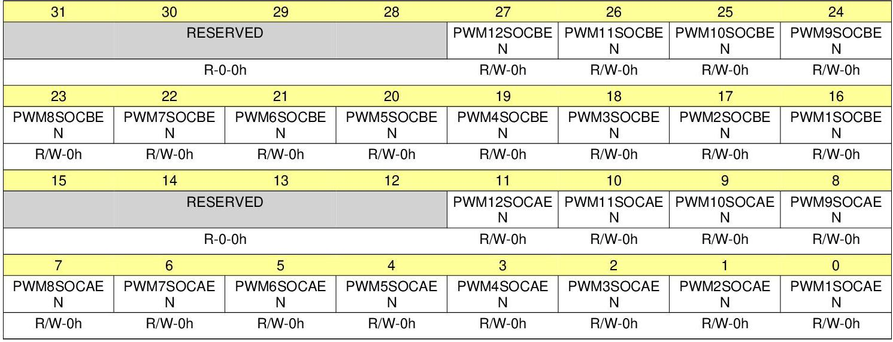

Table 15-105. ADCSOCOUTSELECT Register Field Descriptions

<table><tr><td>Bit</td><td>Field</td><td>Type</td><td>Reset</td><td>Description</td></tr><tr><td>31-28</td><td>RESERVED</td><td>R-0</td><td>0h</td><td>Reserved</td></tr><tr><td>27</td><td>PWM12SOCBEN</td><td>R/W</td><td>0h</td><td>ADCSOCBO source select:   0: Respective EPWM SOCB output is not selected   1: Respective EPWM SOCB output is selected Reset type: CPU1.SYSRSn</td></tr><tr><td>26</td><td>PWM11SOCBEN</td><td>R/W</td><td>0h</td><td>ADCSOCBO source select:   0: Respective EPWM SOCB output is not selected   1: Respective EPWM SOCB output is selected Reset type: CPU1.SYSRSn</td></tr><tr><td>25</td><td>PWM10SOCBEN</td><td>R/W</td><td>0h</td><td>ADCSOCBO source select:   0: Respective EPWM SOCB output is not selected   1: Respective EPWM SOCB output is selected Reset type: CPU1.SYSRSn</td></tr><tr><td>24</td><td>PWM9SOCBEN</td><td>R/W</td><td>0h</td><td>ADCSOCBO source select:   0: Respective EPWM SOCB output is not selected   1: Respective EPWM SOCB output is selected Reset type: CPU1.SYSRSn</td></tr><tr><td>23</td><td>PWM8SOCBEN</td><td>R/W</td><td>0h</td><td>ADCSOCBO source select:   0: Respective EPWM SOCB output is not selected   1: Respective EPWM SOCB output is selected Reset type: CPU1.SYSRSn</td></tr></table>

Table 15-105. ADCSOCOUTSELECT Register Field Descriptions (continued)

<table><tr><td>Bit</td><td>Field</td><td>Type</td><td>Reset</td><td>Description</td></tr><tr><td>22</td><td>PWM7SOCBEN</td><td>R/W</td><td>Oh</td><td>ADCSOCBO source select:   0: Respective EPWM SOCB output is not selected   1: Respective EPWM SOCB output is selected Reset type: CPU1.SYSRSn</td></tr><tr><td>21</td><td>PWM6SOCBEN</td><td>R/W</td><td>Oh</td><td>ADCSOCBO source select:   0: Respective EPWM SOCB output is not selected   1: Respective EPWM SOCB output is selected Reset type: CPU1.SYSRSn</td></tr><tr><td>20</td><td>PWM5SOCBEN</td><td>R/W</td><td>Oh</td><td>ADCSOCBO source select:   0: Respective EPWM SOCB output is not selected   1: Respective EPWM SOCB output is selected Reset type: CPU1.SYSRSn</td></tr><tr><td>19</td><td>PWM4SOCBEN</td><td>R/W</td><td>Oh</td><td>ADCSOCBO source select:   0: Respective EPWM SOCB output is not selected   1: Respective EPWM SOCB output is selected Reset type: CPU1.SYSRSn</td></tr><tr><td>18</td><td>PWM3SOCBEN</td><td>R/W</td><td>Oh</td><td>ADCSOCBO source select:   0: Respective EPWM SOCB output is not selected   1: Respective EPWM SOCB output is selected Reset type: CPU1.SYSRSn</td></tr><tr><td>17</td><td>PWM2SOCBEN</td><td>R/W</td><td>Oh</td><td>ADCSOCBO source select:   0: Respective EPWM SOCB output is not selected   1: Respective EPWM SOCB output is selected Reset type: CPU1.SYSRSn</td></tr><tr><td>16</td><td>PWM1SOCBEN</td><td>R/W</td><td>Oh</td><td>ADCSOCBO source select:   0: Respective EPWM SOCB output is not selected   1: Respective EPWM SOCB output is selected Reset type: CPU1.SYSRSn</td></tr><tr><td>15-12</td><td>RESERVED</td><td>R-0</td><td>Oh</td><td>Reserved</td></tr><tr><td>11</td><td>PWM12SOCAEN</td><td>R/W</td><td>0h</td><td>ADCSOCAO source select:   0: Respective EPWM SOCA output is not selected   1: Respective EPWM SOCA output is selected Reset type: CPU1.SYSRSn</td></tr><tr><td>10</td><td>PWM11SOCAEN</td><td>R/W</td><td>0h</td><td>ADCSOCAO source select:   0: Respective EPWM SOCA output is not selected   1: Respective EPWM SOCA output is selected Reset type: CPU1.SYSRSn</td></tr><tr><td>9</td><td>PWM10SOCAEN</td><td>R/W</td><td>0h</td><td>ADCSOCAO source select:   0: Respective EPWM SOCA output is not selected   1: Respective EPWM SOCA output is selected Reset type: CPU1.SYSRSn</td></tr><tr><td>8</td><td>PWM9SOCAEN</td><td>R/W</td><td>0h</td><td>ADCSOCAO source select:   0: Respective EPWM SOCA output is not selected   1: Respective EPWM SOCA output is selected Reset type: CPU1.SYSRSn</td></tr></table>

Table 15-105. ADCSOCOUTSELECT Register Field Descriptions (continued)

<table><tr><td>Bit</td><td>Field</td><td>Type</td><td>Reset</td><td>Description</td></tr><tr><td>7</td><td>PWM8SOCAEN</td><td>R/W</td><td>0h</td><td>ADCSOCAO source select:   0: Respective EPWM SOCA output is not selected   1: Respective EPWM SOCA output is selected Reset type: CPU1.SYSRSn</td></tr><tr><td>6</td><td>PWM7SOCAEN</td><td>R/W</td><td>0h</td><td>ADCSOCAO source select:   0: Respective EPWM SOCA output is not selected   1: Respective EPWM SOCA output is selected Reset type: CPU1.SYSRSn</td></tr><tr><td>5</td><td>PWM6SOCAEN</td><td>R/W</td><td>0h</td><td>ADCSOCAO source select:   0: Respective EPWM SOCA output is not selected   1: Respective EPWM SOCA output is selected Reset type: CPU1.SYSRSn</td></tr><tr><td>4</td><td>PWM5SOCAEN</td><td>R/W</td><td>0h</td><td>ADCSOCAO source select:   0: Respective EPWM SOCA output is not selected   1: Respective EPWM SOCA output is selected Reset type: CPU1.SYSRSn</td></tr><tr><td>3</td><td>PWM4SOCAEN</td><td>R/W</td><td>0h</td><td>ADCSOCAO source select:   0: Respective EPWM SOCA output is not selected   1: Respective EPWM SOCA output is selected Reset type: CPU1.SYSRSn</td></tr><tr><td>2</td><td>PWM3SOCAEN</td><td>R/W</td><td>0h</td><td>ADCSOCAO source select:   0: Respective EPWM SOCA output is not selected   1: Respective EPWM SOCA output is selected Reset type: CPU1.SYSRSn</td></tr><tr><td>1</td><td>PWM2SOCAEN</td><td>R/W</td><td>0h</td><td>ADCSOCAO source select:   0: Respective EPWM SOCA output is not selected   1: Respective EPWM SOCA output is selected Reset type: CPU1.SYSRSn</td></tr><tr><td>0</td><td>PWM1SOCAEN</td><td>R/W</td><td>Oh</td><td>ADCSOCAO source select:   0: Respective EPWM SOCA output is not selected   1: Respective EPWM SOCA output is selected Reset type: CPU1.SYSRSn</td></tr></table>

##### 15.15.3.3 SYNCSOCLOCK Register (Offset = 4h) [reset = 0h]

SYNCSOCLOCK is shown in Figure 15-175 and described in Table 15-106.

Return to the Summary Table.

SYNCSEL and EXTADCSOC Select Lock register

Figure 15-175. SYNCSOCLOCK Register

<table><tr><td>31</td><td>30</td><td>29</td><td>28</td><td>27</td><td>26</td><td>25</td><td>24</td></tr><tr><td></td><td></td><td></td><td>RESERVED</td><td></td><td></td><td></td><td></td></tr><tr><td colspan="8">R-0-0h</td></tr><tr><td>23</td><td>22</td><td>21</td><td>20</td><td>19</td><td>18</td><td>17</td><td>16</td></tr><tr><td></td><td></td><td></td><td>RESERVED</td><td></td><td></td><td></td><td></td></tr><tr><td colspan="8">R-0-0h</td></tr><tr><td>15</td><td>14</td><td>13</td><td>12</td><td>11</td><td>10</td><td>9</td><td>8</td></tr><tr><td></td><td></td><td></td><td colspan="2">RESERVED</td><td></td><td></td><td></td></tr><tr><td colspan="8">R-0-0h</td></tr><tr><td>7</td><td>6</td><td>5</td><td>4</td><td>3</td><td>2</td><td>1</td><td>0</td></tr><tr><td></td><td colspan="4">RESERVED</td><td></td><td>ADCSOCOUTS ELECT</td><td>SYNCSELECT</td></tr><tr><td colspan="5">R-0-0h</td><td></td><td>R/WSonce-0h</td><td>R/WSonce-0h</td></tr></table>

Table 15-106. SYNCSOCLOCK Register Field Descriptions

<table><tr><td>Bit</td><td>Field</td><td>Type</td><td>Reset</td><td>Description</td></tr><tr><td>31-16</td><td>RESERVED</td><td>R-0</td><td>0h</td><td>Reserved</td></tr><tr><td>15-2</td><td>RESERVED</td><td>R-0</td><td>0h</td><td>Reserved</td></tr><tr><td>1</td><td>ADCSOCOUTSELECT</td><td>R/WSonce</td><td>0h</td><td>ADCSOCOUTSELECT Register Lock bit:   0: Respective register is not locked   1: Respective register is locked.   Notes:   [1] Any bit in this register, once set can only be creaed through a CPU1.SYSRSn. Write of 0 to any bit of this regtister has no effect   [2] The locking mechanism applies to only writes. Reads to the registers which have LOCK protection are always allowed   Reset type: CPU1.SYSRSn</td></tr><tr><td>0</td><td>SYNCSELECT</td><td>R/WSonce</td><td>0h</td><td>SYNCSELECT Register Lock bit:   0: Respective register is not locked   1: Respective register is locked.   Notes:   [1] Any bit in this register, once set can only be creaed through a CPU1.SYSRSn. Write of 0 to any bit of this regtister has no effect   [2] The locking mechanism applies to only writes. Reads to the registers which have LOCK protection are always allowed   Reset type: CPU1.SYSRSn</td></tr></table>

#### 15.15.4 Register to Driverlib Function Mapping

Table 15-107. EPWM Registers to Driverlib Functions

<table><tr><td>File</td><td>Driverlib Function</td></tr><tr><td colspan="2">TBCTL</td></tr><tr><td>epwm.c</td><td>EPWM setEmulationMode</td></tr><tr><td>epwm.h</td><td>EPWM setCountModeAfterSync</td></tr><tr><td>epwm.h</td><td>EPWM setClockPrescaler</td></tr><tr><td>epwm.h</td><td>EPWM forceSyncPulse</td></tr><tr><td>epwm.h</td><td>EPWM setSyncOutPulseMode</td></tr><tr><td>epwm.h</td><td>EPWM setPeriodLoadMode</td></tr><tr><td>epwm.h</td><td>EPWM enablePhaseShiftLoad</td></tr><tr><td>epwm.h</td><td>EPWM disablePhaseShiftLoad</td></tr><tr><td>epwm.h</td><td>EPWM_setTimeBaseCounterMode</td></tr><tr><td>epwm.h</td><td>EPWM selectPeriodLoadEvent</td></tr><tr><td>epwm.h</td><td>EPWM enableOneShotSync</td></tr><tr><td>epwm.h</td><td>EPWM_disableOneShotSync</td></tr><tr><td>epwm.h</td><td>EPWM_startOneShotSync</td></tr><tr><td colspan="2">TBCTL2</td></tr><tr><td>epwm.h</td><td>EPWM_setSyncOutPulseMode</td></tr><tr><td>epwm.h</td><td>EPWM_selectPeriodLoadEvent</td></tr><tr><td>epwm.h</td><td>EPWM_enableOneShotSync</td></tr><tr><td>epwm.h</td><td>EPWM disableOneShotSync</td></tr><tr><td>epwm.h</td><td>EPWM_startOneShotSync</td></tr><tr><td colspan="2">TBCTR</td></tr><tr><td>epwm.h</td><td>EPWM setTimeBaseCounter</td></tr><tr><td>epwm.h</td><td>EPWM_getTimeBaseCounterValue</td></tr><tr><td colspan="2">TBSTS</td></tr><tr><td>epwm.h</td><td>EPWM getTimeBaseCounterOverflowStatus</td></tr><tr><td>epwm.h</td><td>EPWM_clearTimeBaseCounterOverflowEvent</td></tr><tr><td>epwm.h</td><td>EPWM_getSyncStatus</td></tr><tr><td>epwm.h</td><td>EPWM clearSyncEvent</td></tr><tr><td>epwm.h</td><td>EPWM_getTimeBaseCounterDirection</td></tr><tr><td colspan="2">CMPCTL</td></tr><tr><td>epwm.h</td><td>EPWM_setCounterCompareShadowLoadMode</td></tr><tr><td>epwm.h</td><td>EPWM_disableCounterCompareShadowLoadMode</td></tr><tr><td>epwm.h</td><td>EPWM_getCounterCompareShadowStatus</td></tr><tr><td colspan="2">CMPCTL2</td></tr><tr><td>epwm.h</td><td>EPWM_setCounterCompareShadowLoadMode</td></tr><tr><td>epwm.h</td><td>EPWM_disableCounterCompareShadowLoadMode</td></tr><tr><td colspan="2">DBCTL</td></tr><tr><td>epwm.h</td><td>EPWM setDeadBandOutputSwapMode</td></tr><tr><td>epwm.h</td><td>EPWM_setDeadBandDelayMode</td></tr><tr><td>epwm.h</td><td>EPWM_setDeadBandDelayPolarity</td></tr><tr><td>epwm.h</td><td>EPWM_setRisingEdgeDeadBandDelayInput</td></tr><tr><td>epwm.h</td><td>EPWM setFallingEdgeDeadBandDelayInput</td></tr><tr><td>epwm.h</td><td>EPWM_setDeadBandControlShadowLoadMode</td></tr><tr><td>epwm.h</td><td>EPWM disableDeadBandControlShadowLoadMode</td></tr><tr><td>epwm.h</td><td>EPWM_setRisingEdgeDelayCountShadowLoadMode</td></tr><tr><td>epwm.h</td><td>EPWM_disableRisingEdgeDelayCountShadowLoadMode</td></tr></table>

SPRUHM8I-December 2013-Revised September 2019

Submit Documentation Feedback

Table 15-107. EPWM Registers to Driverlib Functions (continued)

<table><tr><td>File</td><td>Driverlib Function</td></tr><tr><td>epwm.h</td><td>EPWM_setFallingEdgeDelayCountShadowLoadMode</td></tr><tr><td>epwm.h</td><td>EPWM_disableFallingEdgeDelayCountShadowLoadMode</td></tr><tr><td>epwm.h</td><td>EPWM setDeadBandCounterClock</td></tr><tr><td colspan="2">DBCTL2</td></tr><tr><td>epwm.h</td><td>EPWM setDeadBandControlShadowLoadMode</td></tr><tr><td>epwm.h</td><td>EPWM disableDeadBandControlShadowLoadMode</td></tr><tr><td colspan="2">AQCTL</td></tr><tr><td>epwm.h</td><td>EPWM setActionQualifierShadowLoadMode</td></tr><tr><td>epwm.h</td><td>EPWM disableActionQualifierShadowLoadMode</td></tr><tr><td>epwm.h</td><td>EPWM setActionQualifierAction</td></tr><tr><td>epwm.h</td><td>EPWM setActionQualifierActionComplete</td></tr><tr><td>epwm.h</td><td>EPWM setAdditionalActionQualifierActionComplete</td></tr><tr><td colspan="2">AQTSRCSEL</td></tr><tr><td>epwm.h</td><td>EPWM_setActionQualifierT1TriggerSource</td></tr><tr><td>epwm.h</td><td>EPWM_setActionQualifierT2TriggerSource</td></tr><tr><td colspan="2">PCCTL</td></tr><tr><td>epwm.h</td><td>EPWM_enableChopper</td></tr><tr><td>epwm.h</td><td>EPWM_disableChopper</td></tr><tr><td>epwm.h</td><td>EPWM_setChopperDutyCycle</td></tr><tr><td>epwm.h</td><td>EPWM setChopperFreq</td></tr><tr><td>epwm.h</td><td>EPWM setChopperFirstPulseWidth</td></tr><tr><td colspan="2">VCAPCTL</td></tr><tr><td>epwm.h</td><td>EPWM_enableValleyCapture</td></tr><tr><td>epwm.h</td><td>EPWM disableValleyCapture</td></tr><tr><td>epwm.h</td><td>EPWM_startValleyCapture</td></tr><tr><td>epwm.h</td><td>EPWM_setValleyTriggerSource</td></tr><tr><td>epwm.h</td><td>EPWM_enableValleyHWDelay</td></tr><tr><td>epwm.h</td><td>EPWM_disableValleyHWDelay</td></tr><tr><td>epwm.h</td><td>EPWM_setValleyDelayDivider</td></tr><tr><td colspan="2">VCNTCFG</td></tr><tr><td>epwm.h</td><td>EPWM_setValleyTriggerEdgeCounts</td></tr><tr><td>epwm.h</td><td>EPWM_getValleyEdgeStatus</td></tr><tr><td colspan="2">GLDCTL</td></tr><tr><td>epwm.h</td><td>EPWM enableGlobalLoad</td></tr><tr><td>epwm.h</td><td>EPWM disableGlobalLoad</td></tr><tr><td>epwm.h</td><td>EPWM setGlobalLoadTrigger</td></tr><tr><td>epwm.h</td><td>EPWM_setGlobalLoadEventPrescale</td></tr><tr><td>epwm.h</td><td>EPWM getGlobalLoadEventCount</td></tr><tr><td>epwm.h</td><td>EPWM_disableGlobalLoadOneShotMode</td></tr><tr><td>epwm.h</td><td>EPWM_enableGlobalLoadOneShotMode</td></tr><tr><td>epwm.h</td><td>EPWM setGlobalLoadOneShotLatch</td></tr><tr><td>epwm.h</td><td>EPWM_forceGlobalLoadOneShotEvent</td></tr><tr><td colspan="2">GLDCFG</td></tr><tr><td>epwm.h</td><td>EPWM_enableGlobalLoadRegisters</td></tr><tr><td>epwm.h</td><td>EPWM disableGlobalLoadRegisters</td></tr><tr><td>XLINK   epwm.h</td><td>EPWM_setupEPWMLinks</td></tr></table>

SPRUHM8I-December 2013-Revised September 2019

Submit Documentation Feedback

Table 15-107. EPWM Registers to Driverlib Functions (continued)

<table><tr><td>File</td><td>Driverlib Function</td></tr><tr><td colspan="2">AQCTLA</td></tr><tr><td>epwm.h</td><td>EPWM setActionQualifierAction</td></tr><tr><td>epwm.h</td><td>EPWM setActionQualifierActionComplete</td></tr><tr><td>epwm.h</td><td>EPWM setAdditionalActionQualifierActionComplete</td></tr><tr><td colspan="2">AQCTLA2</td></tr><tr><td>epwm.h</td><td>EPWM setActionQualifierAction</td></tr><tr><td>epwm.h</td><td>EPWM_setAdditionalActionQualifierActionComplete</td></tr><tr><td colspan="2">AQCTLB</td></tr><tr><td>-</td><td>See AQCTLA</td></tr><tr><td colspan="2">AQCTLB2</td></tr><tr><td>-</td><td>See AQCTLA2</td></tr><tr><td colspan="2">AQSFRC</td></tr><tr><td>epwm.h</td><td>EPWM setActionQualifierContSWForceShadowMode</td></tr><tr><td>epwm.h</td><td>EPWM setActionQualifierSWAction</td></tr><tr><td>epwm.h</td><td>EPWM forceActionQualifierSWAction</td></tr><tr><td colspan="2">AQCSFRC</td></tr><tr><td>epwm.h</td><td>EPWM_setActionQualifierContSWForceAction</td></tr><tr><td colspan="2">DBRED</td></tr><tr><td>epwm.h</td><td>EPWM_setRisingEdgeDelayCount</td></tr><tr><td colspan="2">DBFED</td></tr><tr><td>epwm.h</td><td>EPWM_setFallingEdgeDelayCount</td></tr><tr><td colspan="2">TBPHS</td></tr><tr><td>epwm.h</td><td>EPWM_setPhaseShift</td></tr><tr><td colspan="2">TBPRD</td></tr><tr><td>epwm.h</td><td>EPWM setTimeBasePeriod</td></tr><tr><td>epwm.h</td><td>EPWM_getTimeBasePeriod</td></tr><tr><td colspan="2">CMPA</td></tr><tr><td>epwm.h</td><td>EPWM setCounterCompareValue</td></tr><tr><td>epwm.h</td><td>EPWM getCounterCompareValue</td></tr><tr><td colspan="2">CMPB</td></tr><tr><td>-</td><td>See CMPA</td></tr><tr><td colspan="2">CMPC</td></tr><tr><td>epwm.h</td><td>EPWM setCounterCompareShadowLoadMode</td></tr><tr><td>epwm.h</td><td>EPWM_disableCounterCompareShadowLoadMode</td></tr><tr><td>epwm.h</td><td>EPWM_getCounterCompareShadowStatus</td></tr><tr><td colspan="2">CMPD</td></tr><tr><td>-</td><td>See CMPC</td></tr><tr><td colspan="2">GLDCTL2</td></tr><tr><td>epwm.h</td><td>EPWM setGlobalLoadOneShotLatch</td></tr><tr><td>epwm.h</td><td>EPWM_forceGlobalLoadOneShotEvent</td></tr><tr><td colspan="2">SWVDELVAL</td></tr><tr><td>epwm.h</td><td>EPWM_setValleySWDelayValue</td></tr><tr><td colspan="2">TZSEL</td></tr><tr><td>epwm.h</td><td>EPWM_enableTripZoneSignals</td></tr><tr><td>epwm.h</td><td>EPWM disableTripZoneSignals</td></tr><tr><td>TZDCSEL   epwm.h</td><td>EPWM_setTripZoneDigitalCompareEventCondition</td></tr></table>

Table 15-107. EPWM Registers to Driverlib Functions (continued)

<table><tr><td>File</td><td>Driverlib Function</td></tr><tr><td colspan="2">TZCTL</td></tr><tr><td>epwm.h</td><td>EPWM enableTripZoneAdvAction</td></tr><tr><td>epwm.h</td><td>EPWM disableTripZoneAdvAction</td></tr><tr><td>epwm.h</td><td>EPWM setTripZoneAction</td></tr><tr><td>epwm.h</td><td>EPWM setTripZoneAdvAction</td></tr><tr><td>epwm.h</td><td>EPWM_setTripZoneAdvDigitalCompareActionA</td></tr><tr><td>epwm.h</td><td>EPWM_setTripZoneAdvDigitalCompareActionB</td></tr><tr><td colspan="2">TZCTL2</td></tr><tr><td>epwm.h</td><td>EPWM_enableTripZoneAdvAction</td></tr><tr><td>epwm.h</td><td>EPWM disableTripZoneAdvAction</td></tr><tr><td>epwm.h</td><td>EPWM setTripZoneAdvAction</td></tr><tr><td>epwm.h</td><td>EPWM_setTripZoneAdvDigitalCompareActionA</td></tr><tr><td>epwm.h</td><td>EPWM_setTripZoneAdvDigitalCompareActionB</td></tr><tr><td colspan="2">TZCTLDCA</td></tr><tr><td>epwm.h</td><td>EPWM_setTripZoneAdvDigitalCompareActionA</td></tr><tr><td colspan="2">TZCTLDCB</td></tr><tr><td>epwm.h</td><td>EPWM_setTripZoneAdvDigitalCompareActionB</td></tr><tr><td colspan="2">TZEINT</td></tr><tr><td>epwm.h</td><td>EPWM_enableTripZoneInterrupt</td></tr><tr><td>epwm.h</td><td>EPWM_disableTripZoneInterrupt</td></tr><tr><td colspan="2">TZFLG</td></tr><tr><td>epwm.h</td><td>EPWM_getTripZoneFlagStatus</td></tr><tr><td colspan="2">TZCBCFLG</td></tr><tr><td>epwm.h</td><td>EPWM_getCycleByCycleTripZoneFlagStatus</td></tr><tr><td colspan="2">TZOSTFLG</td></tr><tr><td>epwm.h</td><td>EPWM_getOneShotTripZoneFlagStatus</td></tr><tr><td colspan="2">TZCLR</td></tr><tr><td>epwm.h</td><td>EPWM_selectCycleByCycleTripZoneClearEvent</td></tr><tr><td>epwm.h</td><td>EPWM_clearTripZoneFlag</td></tr><tr><td colspan="2">TZCBCCLR</td></tr><tr><td>epwm.h</td><td>EPWM_clearCycleByCycleTripZoneFlag</td></tr><tr><td colspan="2">TZOSTCLR</td></tr><tr><td>epwm.h</td><td>EPWM_clearOneShotTripZoneFlag</td></tr><tr><td colspan="2">TZFRC</td></tr><tr><td>epwm.h</td><td>EPWM_forceTripZoneEvent</td></tr><tr><td colspan="2">ETSEL</td></tr><tr><td>epwm.h</td><td>EPWM_enableInterrupt</td></tr><tr><td>epwm.h</td><td>EPWM_disableInterrupt</td></tr><tr><td>epwm.h</td><td>EPWM_setInterruptSource</td></tr><tr><td>epwm.h</td><td>EPWM enableADCTrigger</td></tr><tr><td>epwm.h</td><td>EPWM_disableADCTrigger</td></tr><tr><td>epwm.h</td><td>EPWM_setADCTriggerSource</td></tr><tr><td colspan="2">ETPS</td></tr><tr><td>epwm.h</td><td>EPWM_setADCTriggerEventPrescale</td></tr><tr><td>epwm.h</td><td>EPWM_setADCTriggerEventPrescale</td></tr><tr><td>ETFLG   epwm.h</td><td>EPWM_getEventTriggerInterruptStatus</td></tr></table>

SPRUHM8I-December 2013-Revised September 2019

Submit Documentation Feedback

Table 15-107. EPWM Registers to Driverlib Functions (continued)

<table><tr><td>File</td><td>Driverlib Function</td></tr><tr><td>epwm.h</td><td>EPWM_getADCTriggerFlagStatus</td></tr><tr><td colspan="2">ETCLR</td></tr><tr><td>epwm.h</td><td>EPWM_clearEventTriggerInterruptFlag</td></tr><tr><td>epwm.h</td><td>EPWM_clearADCTriggerFlag</td></tr><tr><td colspan="2">ETFRC</td></tr><tr><td>epwm.h</td><td>EPWM_forceEventTriggerInterrupt</td></tr><tr><td>epwm.h</td><td>EPWM forceADCTrigger</td></tr><tr><td colspan="2">ETINTPS</td></tr><tr><td>epwm.h</td><td>EPWM setInterruptEventCount</td></tr><tr><td>epwm.h</td><td>EPWM_getInterruptEventCount</td></tr><tr><td colspan="2">ETSOCPS</td></tr><tr><td>epwm.h</td><td>EPWM_setADCTriggerEventPrescale</td></tr><tr><td>epwm.h</td><td>EPWM getADCTriggerEventCount</td></tr><tr><td colspan="2">ETCNTINITCTL</td></tr><tr><td>epwm.h</td><td>EPWM enableInterruptEventCountInit</td></tr><tr><td>epwm.h</td><td>EPWM disableInterruptEventCountInit</td></tr><tr><td>epwm.h</td><td>EPWM forceInterruptEventCountInit</td></tr><tr><td>epwm.h</td><td>EPWM_enableADCTriggerEventCountInit</td></tr><tr><td>epwm.h</td><td>EPWM_disableADCTriggerEventCountInit</td></tr><tr><td>epwm.h</td><td>EPWM_forceADCTriggerEventCountInit</td></tr><tr><td colspan="2">ETCNTINIT</td></tr><tr><td>epwm.h</td><td>EPWM enableInterruptEventCountInit</td></tr><tr><td>epwm.h</td><td>EPWM disableInterruptEventCountInit</td></tr><tr><td>epwm.h</td><td>EPWM_forceInterruptEventCountInit</td></tr><tr><td>epwm.h</td><td>EPWM_setInterruptEventCountInitValue</td></tr><tr><td>epwm.h</td><td>EPWM_enableADCTriggerEventCountInit</td></tr><tr><td>epwm.h</td><td>EPWM disableADCTriggerEventCountInit</td></tr><tr><td>epwm.h</td><td>EPWM_forceADCTriggerEventCountInit</td></tr><tr><td>epwm.h</td><td>EPWM_setADCTriggerEventCountInitValue</td></tr><tr><td colspan="2">DCTRIPSEL</td></tr><tr><td>epwm.h</td><td>EPWM_selectDigitalCompareTripInput</td></tr><tr><td>epwm.h</td><td>EPWM_enableDigitalCompareTripCombinationInput</td></tr><tr><td colspan="2">DCACTL</td></tr><tr><td>epwm.h</td><td>EPWM_setDigitalCompareEventSource</td></tr><tr><td>epwm.h</td><td>EPWM_setDigitalCompareEventSyncMode</td></tr><tr><td>epwm.h</td><td>EPWM enableDigitalCompareADCTrigger</td></tr><tr><td>epwm.h</td><td>EPWM_disableDigitalCompareADCTrigger</td></tr><tr><td>epwm.h</td><td>EPWM_enableDigitalCompareSyncEvent</td></tr><tr><td>epwm.h</td><td>EPWM_disableDigitalCompareSyncEvent</td></tr><tr><td colspan="2">DCBCTL</td></tr><tr><td>-</td><td>See DCACTL</td></tr><tr><td colspan="2">DCFCTL</td></tr><tr><td>epwm.h</td><td>EPWM_enableDigitalCompareBlankingWindow</td></tr><tr><td>epwm.h</td><td>EPWM_disableDigitalCompareBlankingWindow</td></tr><tr><td>epwm.h</td><td>EPWM enableDigitalCompareWindowInverseMode</td></tr><tr><td>epwm.h</td><td>EPWM_disableDigitalCompareWindowInverseMode</td></tr><tr><td>epwm.h</td><td>EPWM_setDigitalCompareBlankingEvent</td></tr></table>

Table 15-107. EPWM Registers to Driverlib Functions (continued)

<table><tr><td>File</td><td>Driverlib Function</td></tr><tr><td>epwm.h</td><td>EPWM setDigitalCompareFilterInput</td></tr><tr><td>epwm.h</td><td>EPWM enableDigitalCompareEdgeFilter</td></tr><tr><td>epwm.h</td><td>EPWM disableDigitalCompareEdgeFilter</td></tr><tr><td>epwm.h</td><td>EPWM_setDigitalCompareEdgeFilterMode</td></tr><tr><td>epwm.h</td><td>EPWM_setDigitalCompareEdgeFilterEdgeCount</td></tr><tr><td>epwm.h</td><td>EPWM_getDigitalCompareEdgeFilterEdgeCount</td></tr><tr><td>epwm.h</td><td>EPWM_getDigitalCompareEdgeFilterEdgeStatus</td></tr><tr><td colspan="2">DCCAPCTL</td></tr><tr><td>epwm.h</td><td>EPWM_enableDigitalCompareCounterCapture</td></tr><tr><td>epwm.h</td><td>EPWM_disableDigitalCompareCounterCapture</td></tr><tr><td>epwm.h</td><td>EPWM_setDigitalCompareCounterShadowMode</td></tr><tr><td>epwm.h</td><td>EPWM_getDigitalCompareCaptureStatus</td></tr><tr><td colspan="2">DCFOFFSET</td></tr><tr><td>epwm.h</td><td>EPWM setDigitalCompareWindowOffset</td></tr><tr><td>epwm.h</td><td>EPWM_getDigitalCompareBlankingWindowOffsetCount</td></tr><tr><td colspan="2">DCFOFFSETCNT</td></tr><tr><td>epwm.h</td><td>EPWM_getDigitalCompareBlankingWindowOffsetCount</td></tr><tr><td colspan="2">DCFWINDOW</td></tr><tr><td>epwm.h</td><td>EPWM_setDigitalCompareWindowLength</td></tr><tr><td>epwm.h</td><td>EPWM_getDigitalCompareBlankingWindowLengthCount</td></tr><tr><td colspan="2">DCFWINDOWCNT</td></tr><tr><td>epwm.h</td><td>EPWM_getDigitalCompareBlankingWindowLengthCount</td></tr><tr><td colspan="2">DCCAP</td></tr><tr><td>epwm.h</td><td>EPWM_enableDigitalCompareCounterCapture</td></tr><tr><td>epwm.h</td><td>EPWM_disableDigitalCompareCounterCapture</td></tr><tr><td>epwm.h</td><td>EPWM_setDigitalCompareCounterShadowMode</td></tr><tr><td>epwm.h</td><td>EPWM_getDigitalCompareCaptureStatus</td></tr><tr><td>epwm.h</td><td>EPWM_getDigitalCompareCaptureCount</td></tr><tr><td colspan="2">DCAHTRIPSEL</td></tr><tr><td>epwm.h</td><td>EPWM_enableDigitalCompareTripCombinationInput</td></tr><tr><td>epwm.h</td><td>EPWM_disableDigitalCompareTripCombinationInput</td></tr><tr><td colspan="2">DCALTRIPSEL</td></tr><tr><td>-</td><td>See DCAHTRIPSEL</td></tr><tr><td colspan="2">DCBHTRIPSEL</td></tr><tr><td>-</td><td>See DCAHTRIPSEL</td></tr><tr><td colspan="2">DCBLTRIPSEL</td></tr><tr><td>-</td><td>See DCAHTRIPSEL</td></tr><tr><td colspan="2">HWVDELVAL</td></tr><tr><td>epwm.h</td><td>EPWM_getValleyHWDelay</td></tr><tr><td colspan="2">VCNTVAL</td></tr><tr><td>epwm.h</td><td>EPWM_getValleyCount</td></tr></table>

Table 15-108. HRPWM Registers to Driverlib Functions

<table><tr><td>File</td><td>Driverlib Function</td></tr><tr><td colspan="2">HRCNFG</td></tr><tr><td>hrpwm.h</td><td>HRPWM_setMEPEdgeSelect</td></tr></table>

Enhanced Pulse Width Modulator (ePWM)2123

Submit Documentation Feedback

Table 15-108. HRPWM Registers to Driverlib Functions (continued)

<table><tr><td>File</td><td>Driverlib Function</td></tr><tr><td>hrpwm.h</td><td>HRPWM setMEPControlMode</td></tr><tr><td>hrpwm.h</td><td>HRPWM setCounterCompareShadowLoadEvent</td></tr><tr><td>hrpwm.h</td><td>HRPWM setOutputSwapMode</td></tr><tr><td>hrpwm.h</td><td>HRPWM setChannelBOutputPath</td></tr><tr><td>hrpwm.h</td><td>HRPWM enableAutoConversion</td></tr><tr><td>hrpwm.h</td><td>HRPWM disableAutoConversion</td></tr><tr><td>hrpwm.h</td><td>HRPWM setDeadbandMEPEdgeSelect</td></tr><tr><td>hrpwm.h</td><td>HRPWM setRisingEdgeDelayLoadMode</td></tr><tr><td>hrpwm.h</td><td>HRPWM setFallingEdgeDelayLoadMode</td></tr><tr><td colspan="2">HRMSTEP</td></tr><tr><td>hrpwm.h</td><td>HRPWM setMEPStep</td></tr><tr><td colspan="2">HRCNFG2</td></tr><tr><td>hrpwm.h</td><td>HRPWM setDeadbandMEPEdgeSelect</td></tr><tr><td>hrpwm.h</td><td>HRPWM setRisingEdgeDelayLoadMode</td></tr><tr><td>hrpwm.h</td><td>HRPWM setFallingEdgeDelayLoadMode</td></tr><tr><td colspan="2">HRPCTL</td></tr><tr><td>hrpwm.h</td><td>HRPWM enablePeriodControl</td></tr><tr><td>hrpwm.h</td><td>HRPWM disablePeriodControl</td></tr><tr><td>hrpwm.h</td><td>HRPWM enablePhaseShiftLoad</td></tr><tr><td>hrpwm.h</td><td>HRPWM disablePhaseShiftLoad</td></tr><tr><td>hrpwm.h</td><td>HRPWM setSyncPulseSource</td></tr><tr><td colspan="2">TRREM</td></tr><tr><td>hrpwm.h</td><td>HRPWM setTranslatorRemainder</td></tr><tr><td colspan="2">DBREDHR</td></tr><tr><td>hrpwm.h</td><td>HRPWM_setRisingEdgeDelay</td></tr><tr><td>hrpwm.h</td><td>HRPWM_setHiResRisingEdgeDelayOnly</td></tr><tr><td colspan="2">DBRED</td></tr><tr><td>hrpwm.h</td><td>HRPWM setRisingEdgeDelay</td></tr><tr><td>hrpwm.h</td><td>HRPWM setHiResRisingEdgeDelayOnly</td></tr><tr><td colspan="2">DBFEDHR</td></tr><tr><td>hrpwm.h</td><td>HRPWM setFallingEdgeDelay</td></tr><tr><td>hrpwm.h</td><td>HRPWM_setHiResFallingEdgeDelayOnly</td></tr><tr><td colspan="2">DBFED</td></tr><tr><td>hrpwm.h</td><td>HRPWM_setFallingEdgeDelay</td></tr><tr><td>hrpwm.h</td><td>HRPWM_setHiResFallingEdgeDelayOnly</td></tr><tr><td colspan="2">TBPHS</td></tr><tr><td>hrpwm.h</td><td>HRPWM setPhaseShift</td></tr><tr><td>hrpwm.h</td><td>HRPWM setHiResPhaseShiftOnly</td></tr><tr><td colspan="2">TBPRDHR</td></tr><tr><td>hrpwm.h</td><td>HRPWM setTimeBasePeriod</td></tr><tr><td>hrpwm.h</td><td>HRPWM setHiResTimeBasePeriodOnly</td></tr><tr><td>hrpwm.h</td><td>HRPWM getTimeBasePeriod</td></tr><tr><td>hrpwm.h</td><td>HRPWM getHiResTimeBasePeriodOnly</td></tr><tr><td colspan="2">TBPRD</td></tr><tr><td>hrpwm.h</td><td>HRPWM setTimeBasePeriod</td></tr><tr><td>hrpwm.h</td><td>HRPWM setHiResTimeBasePeriodOnly</td></tr><tr><td>hrpwm.h</td><td>HRPWM_getTimeBasePeriod</td></tr></table>

Table 15-108. HRPWM Registers to Driverlib Functions (continued)

<table><tr><td>File</td><td>Driverlib Function</td></tr><tr><td>hrpwm.h</td><td>HRPWM_getHiResTimeBasePeriodOnly</td></tr><tr><td colspan="2">CMPA</td></tr><tr><td>hrpwm.h</td><td>HRPWM_setCounterCompareValue</td></tr><tr><td>hrpwm.h</td><td>HRPWM_setHiResCounterCompareValueOnly</td></tr><tr><td>hrpwm.h</td><td>HRPWM_getCounterCompareValue</td></tr><tr><td>hrpwm.h</td><td>HRPWM_getHiResCounterCompareValueOnly</td></tr><tr><td colspan="2">CMPB</td></tr><tr><td>hrpwm.h</td><td>HRPWM_setCounterCompareValue</td></tr><tr><td>hrpwm.h</td><td>HRPWM_setHiResCounterCompareValueOnly</td></tr><tr><td>hrpwm.h</td><td>HRPWM_getCounterCompareValue</td></tr><tr><td>hrpwm.h</td><td>HRPWM_getHiResCounterCompareValueOnly</td></tr></table>

## Enhanced Capture (eCAP)

This chapter describes the enhanced capture (eCAP) module, which is used in systems where accurate timing of external events is important.

## Topic

Page

16.1 Introduction 2127

16.2 Features 2127

16.3 Description 2127

16.4 Configuring Device Pins for the eCAP 2127

16.5 Capture and APWM Operating Mode 2129

16.6 Capture Mode Description 2130

16.7 Application of the eCAP Module 2139

16.8 Application of the APWM Mode 2143

16.9 eCAP Registers 2144

### 16.1 Introduction

This eCAP module is a Type-0 eCAP. See the TMS320C28xx, 28xxx DSP Peripheral Reference Guide for a list of all devices with an eCAP module of the same type, to determine the differences between the types, and for a list of device-specific differences within a type.

### 16.2 Features

Features for eCAP include:

- Speed measurements of rotating machinery (for example, toothed sprockets sensed via Hall sensors)

- Elapsed time measurements between position sensor pulses

- Period and duty cycle measurements of pulse train signals

- Decoding current or voltage amplitude derived from duty cycle encoded current/voltage sensors

The eCAP module described in this guide includes the following features:

- 4-event time-stamp registers (each 32 bits)

- Edge polarity selection for up to four sequenced time-stamp capture events

- Interrupt on either of the four events

- Single-shot capture of up to four event time-stamps

- Continuous mode capture of time stamps in a four-deep circular buffer

- Absolute time-stamp capture

- Difference (Delta) mode time-stamp capture

- All above resources are dedicated to a single input pin

- When not used in capture mode, the eCAP module can be configured as a single-channel PWM output

### 16.3 Description

The eCAP module represents one complete capture channel that can be instantiated multiple times, depending on the target device. In the context of this guide, one eCAP channel has the following independent key resources:

- Dedicated input capture pin

- Output X-BAR is used to configure output in APWM mode

- 32-bit time base (counter)

- 4 x 32-bit time-stamp capture registers (CAP1-CAP4)

- Four-stage sequencer (modulo 4 counter) that is synchronized to external events, eCAP pin rising/falling edges.

- Independent edge polarity (rising/falling edge) selection for all four events

- Input capture signal prescaling (from 2-62 or bypass)

- One-shot compare register (two bits) to freeze captures after 1-4 time-stamp events

- Control for continuous time-stamp captures using a four-deep circular buffer (CAP1-CAP4) scheme

- Interrupt capabilities on any of the four capture events

### 16.4 Configuring Device Pins for the eCAP

To connect the device input pins to the module, the Input X-BAR must be used. Any GPIO on the device can be configured as an input. The GPIO input qualification can be set to synchronous or asynchronous mode by setting the GPxQSELn register bits. Using synchronized inputs can help with noise immunity but will affect the eCAP's accuracy by \( \pm  2 \) cycles. The internal pull-ups can be configured in the GPyPUD register. Since the GPIO mode is used, the GPylNV register can invert the signals.

The Output X-BAR must be used to connect output signals to the OUTPUTXBARx output locations. The GPIO mux must then be configured to connect the OUTPUTXBARx lines to any of several IO pins with the GPIO mux. To avoid glitches on the pins, the GPyGMUX bits must be configured first (while keeping the corresponding GPyMUX bits at the default of zero), followed by writing the GPyMUX register to the desired value.

See the GPIO Chapter for more details on GPIO mux, GPIO settings, and XBAR configuration.

### 16.5 Capture and APWM Operating Mode

You can use the eCAP module resources to implement a single-channel PWM generator (with 32-bit capabilities) when it is not being used for input captures. The counter operates in count-up mode, providing a time-base for asymmetrical pulse width modulation (PWM) waveforms. The CAP1 and CAP2 registers become the active period and compare registers, respectively, while CAP3 and CAP4 registers become the period and capture shadow registers, respectively. Figure 16-1 is a high-level view of both the capture and auxiliary pulse-width modulator (APWM) modes of operation.

Figure 16-1. Capture and APWM Modes of Operation

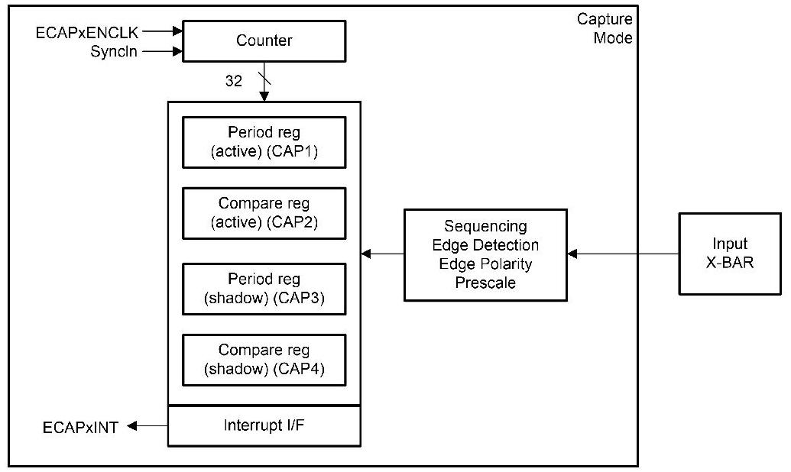

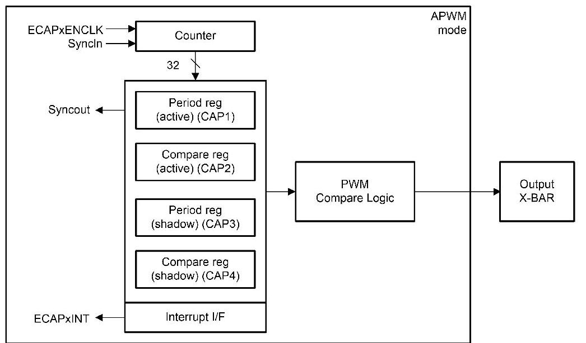

A A single pin is shared between CAP and APWM functions. In capture mode, it is an input; in APWM mode, it is an output.

B In APWM mode, writing any value to CAP1/CAP2 active registers also writes the same value to the corresponding shadow registers CAP3/CAP4. This emulates immediate mode. Writing to the shadow registers CAP3/CAP4 invokes the shadow mode.

Figure 16-2 further descries the output of the eCAP in APWM mode based on the CMP and PRD values.

Figure 16-2. Counter Compare and PRD Effects on the eCAP Output in APWM Mode

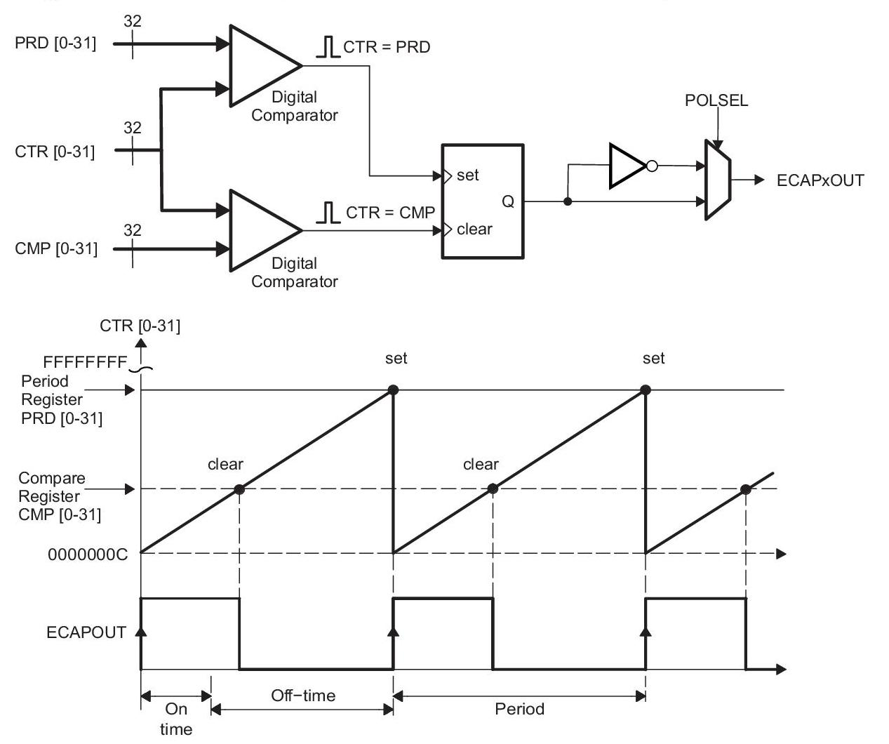

16.6 Capture Mode Description

Figure 16-3 shows the various components that implement the capture function.

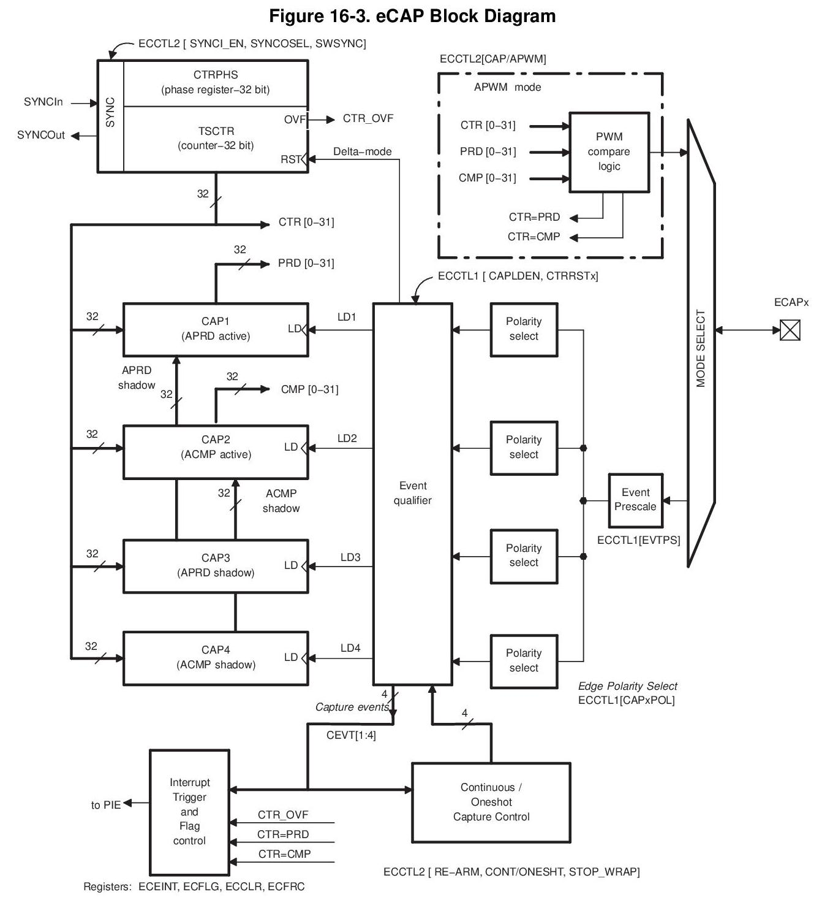

#### 16.6.1 Event Prescaler

- An input capture signal (pulse train) can be prescaled by \( \mathrm{N} = 2 - {62} \) (in multiples of 2) or can bypass the prescaler.

This is useful when very high frequency signals are used as inputs. Figure 16-4 shows a functional diagram and Figure 16-5 shows the operation of the prescale function.

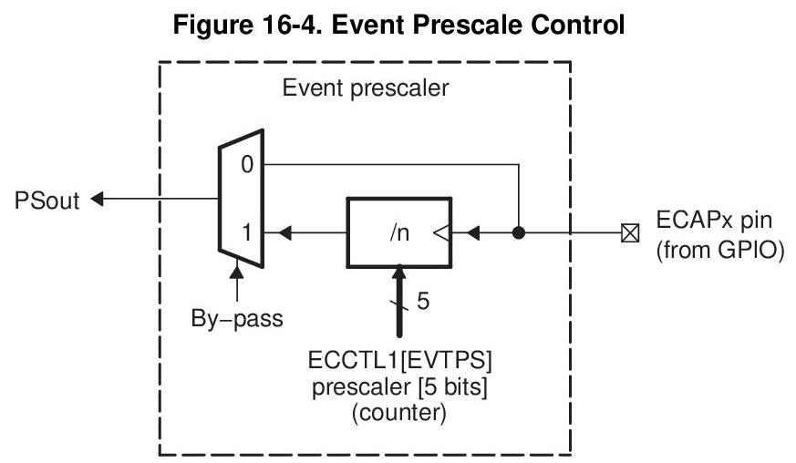

A When a prescale value of 1 is chosen ( ECCTL1[13:9] = 0,0,0,0,0 ), the input capture signal bypasses the prescale logic completely.

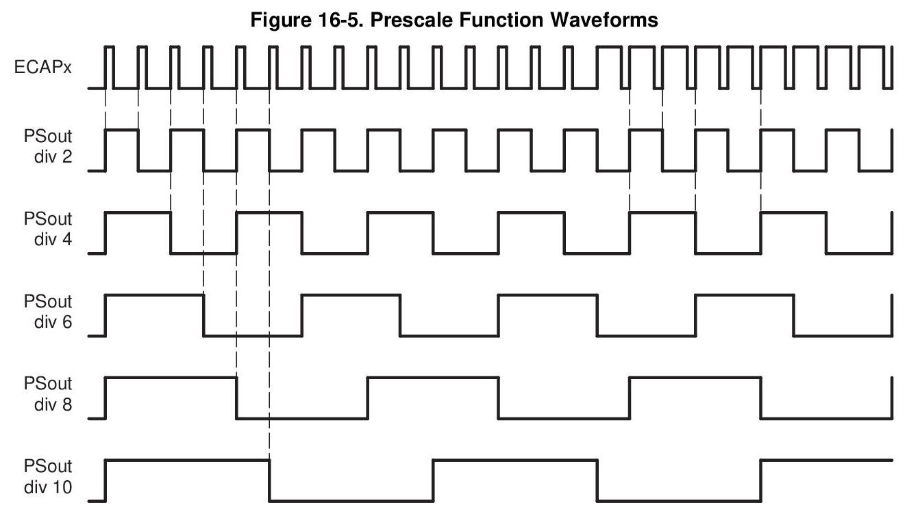

#### 16.6.2 Edge Polarity Select and Qualifier

Functionality and features include:

- Four independent edge polarity (rising edge/falling edge) selection muxes are used, one for each capture event.

- Each edge (up to 4) is event qualified by the Modulo4 sequencer.

- The edge event is gated to its respective CAPx register by the Mod4 counter. The CAPx register is loaded on the falling edge.

#### 16.6.3 Continuous/One-Shot Control

Operation of eCAP in Continuous/One-Shot mode:

- The Mod4 (2-bit) counter is incremented via edge qualified events (CEVT1-CEVT4).

- The Mod4 counter continues counting (0->1->2->3->0) and wraps around unless stopped.

- A 2-bit stop register is used to compare the Mod4 counter output, and when equal, stops the Mod4

counter and inhibits further loads of the CAP1-CAP4 registers. This occurs during one-shot operation.

The continuous/one-shot block controls the start, stop and reset (zero) functions of the Mod4 counter, via a mono-shot type of action that can be triggered by the stop-value comparator and re-armed via software control.

Once armed, the eCAP module waits for 1-4 (defined by stop-value) capture events before freezing both the Mod4 counter and contents of CAP1-4 registers (time stamps).

Re-arming prepares the eCAP module for another capture sequence. Also, re-arming clears (to zero) the Mod4 counter and permits loading of CAP1-4 registers again, providing the CAPLDEN bit is set.

In continuous mode, the Mod4 counter continues to run (0->1->2->3->0, the one-shot action is ignored, and capture values continue to be written to CAP1-4 in a circular buffer sequence.

Figure 16-6. Details of the Continuous/One-shot Block

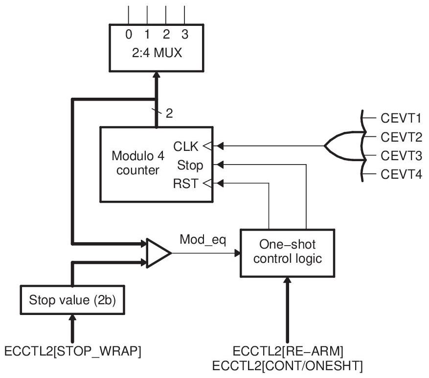

#### 16.6.4 32-Bit Counter and Phase Control

This counter provides the time-base for event captures, and is clocked via the system clock.

A phase register is provided to achieve synchronization with other counters, via a hardware and software forced sync. This is useful in APWM mode when a phase offset between modules is needed.

On any of the four event loads, an option to reset the 32-bit counter is given. This is useful for time difference capture. The 32-bit counter value is captured first, then it is reset to 0 by any of the LD1-LD4 signals.

Figure 16-7. Details of the Counter and Synchronization Block

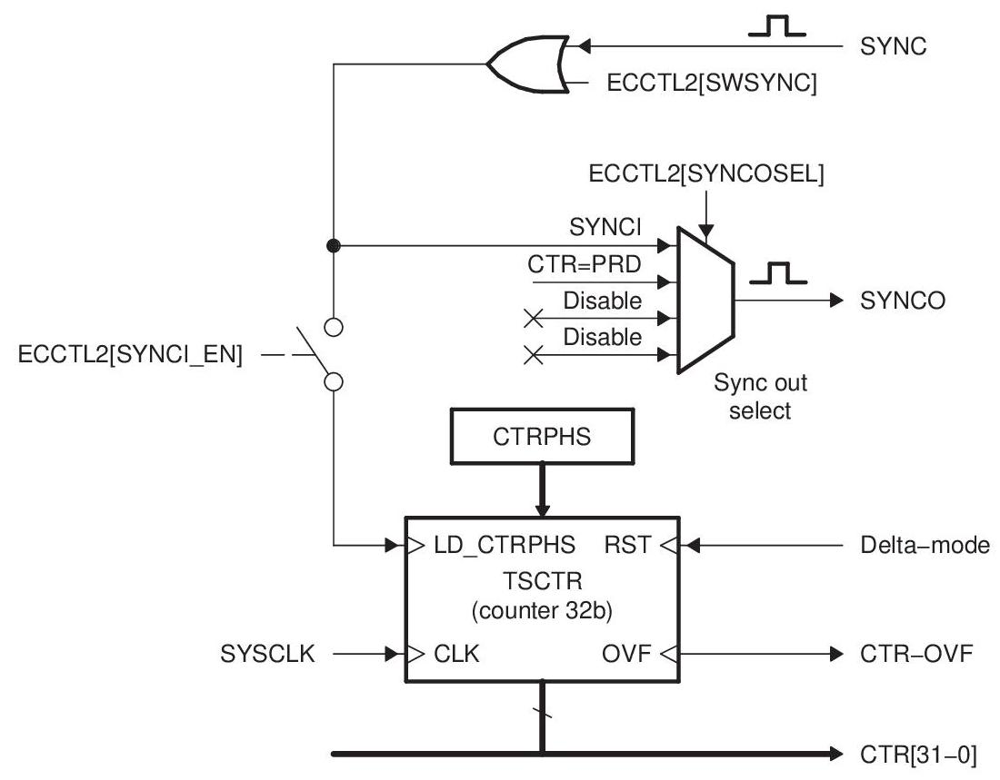

#### 16.6.5 CAP1-CAP4 Registers

These 32-bit registers are fed by the 32-bit counter timer bus, CTR[0-31] and are loaded (capture a timestamp) when their respective LD inputs are strobed.

Control bit CAPLDEN can inhibit loading of the capture registers. During one-shot operation, this bit is cleared (loading is inhibited) automatically when a stop condition occurs, StopValue = Mod4.

CAP1 and CAP2 registers become the active period and compare registers, respectively, in APWM mode.

CAP3 and CAP4 registers become the respective shadow registers (APRD and ACMP) for CAP1 and CAP2 during APWM operation.

#### 16.6.6 eCAP Synchronization

eCAP modules can be synchronized with each other by selecting a common SYNCIN source. SYNCIN source for eCAP can be either software sync-in or external sync-in. The external sync-in signal can come from EPWM or eCAP or X-Bar. The SWSYNC of the eCAP module is logical OR'd with the SYNC signal as shown in Figure 16-7. The SYNC signal is defined by the selection of SYNCSELECT[ECAPxSYNCIN] as shown in Figure 16-8.

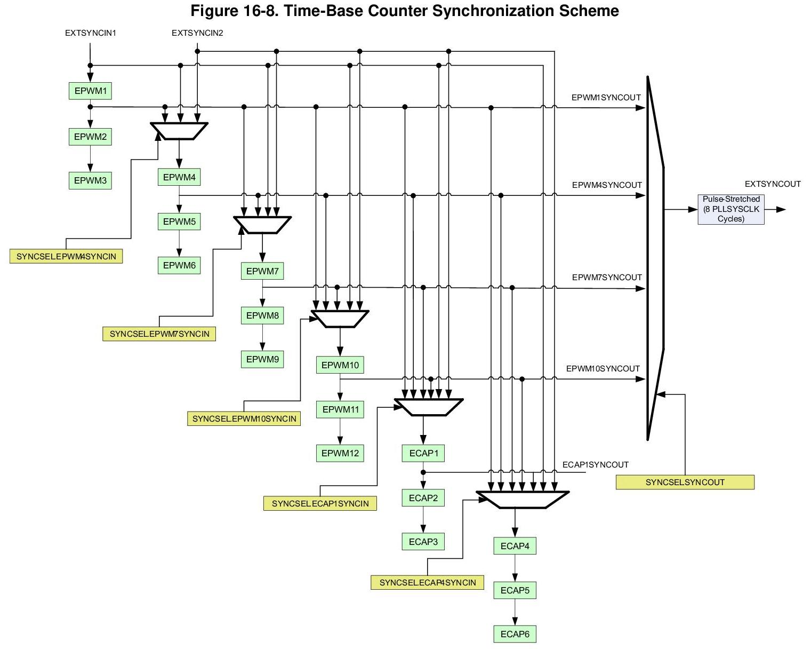

##### 16.6.6.1 Example 1 - Using SWSYNC with ECAP Module

Implement the following steps to use SWSYNC with ECAP1 and ECAP3.

- Configure ECAP[1..3].ECCTL2.SYNCO_SEL = 0x0, to allow the sync-in event to be the sync-out signal pass through.

- Configure ECAP[2..3].ECCTL2.SWSYNC = 0x0, to disable software synchronization for eCAP2 through eCAP3.

- The default sync signal comes from ePWM1, if TBCTL[SYNCOSEL] is not correctly configured this can cause undesired resets of the time-stamp register (TSCTR). Select an unused GPiO in InputXbarRegs.INPUT5SELECT. Configure this GPIO in output mode and Write '0' to GPIO DAT register. By default this is programmed to GPIO0 so any activity on this pin will cause problems with the SWSYNC.

- Program SYNCSEL[ECAP1SYNCIN] = 0x5. This will take ECAPx.EXTSYNCIN to an inactive state.

- Configure ECAP1.ECCTL2.SWSYNC=0x1, this forces Software Synchronization of TSCTR counter

To use SWSYNC with other eCAP modules, ensure that the previous eCAP chain is not generating a SYNCOUT signal which will interfere with the software synchronization.

#### 16.6.7 Interrupt Control

Operation and features of eCAP Interrupt Control include:

- An Interrupt can be generated on capture events (CEVT1-CEVT4, CTROVF) or APWM events (CTR = PRD, CTR = CMP).

- A counter overflow event (FFFFFFFFF->00000000) is also provided as an interrupt source (CTROVF).

- The capture events are edge and sequencer-qualified (ordered in time) by the polarity select and Mod4 gating, respectively.

- One of these events can be selected as the interrupt source (from the eCAPx module) going to the PIE and CLA.

- Seven interrupt events (CEVT1, CEVT2, CEVT3, CEVT4, CNTOVF, CTR=PRD, CTR=CMP) can be generated. The interrupt enable register (ECEINT) is used to enable/disable individual interrupt event sources. The interrupt flag register (ECFLG) indicates if any interrupt event has been latched and contains the global interrupt flag bit (INT). An interrupt pulse is generated to the PIE only if any of the interrupt events are enabled, the flag bit is 1, and the INT flag bit is 0 . The interrupt service routine must clear the global interrupt flag bit and the serviced event via the interrupt clear register (ECCLR) before any other interrupt pulses are generated. You can force an interrupt event via the interrupt force register (ECFRC). This is useful for test purposes.

Note: The CEVT1, CEVT2, CEVT3, CEVT4 flags are only active in capture mode (ECCTL2[CAP/APWM \( =  = 0 \) ]). The CTR=PRD, CTR=CMP flags are only valid in APWM mode (ECCTL2[CAP/APWM == 1]). CNTOVF flag is valid in both modes.

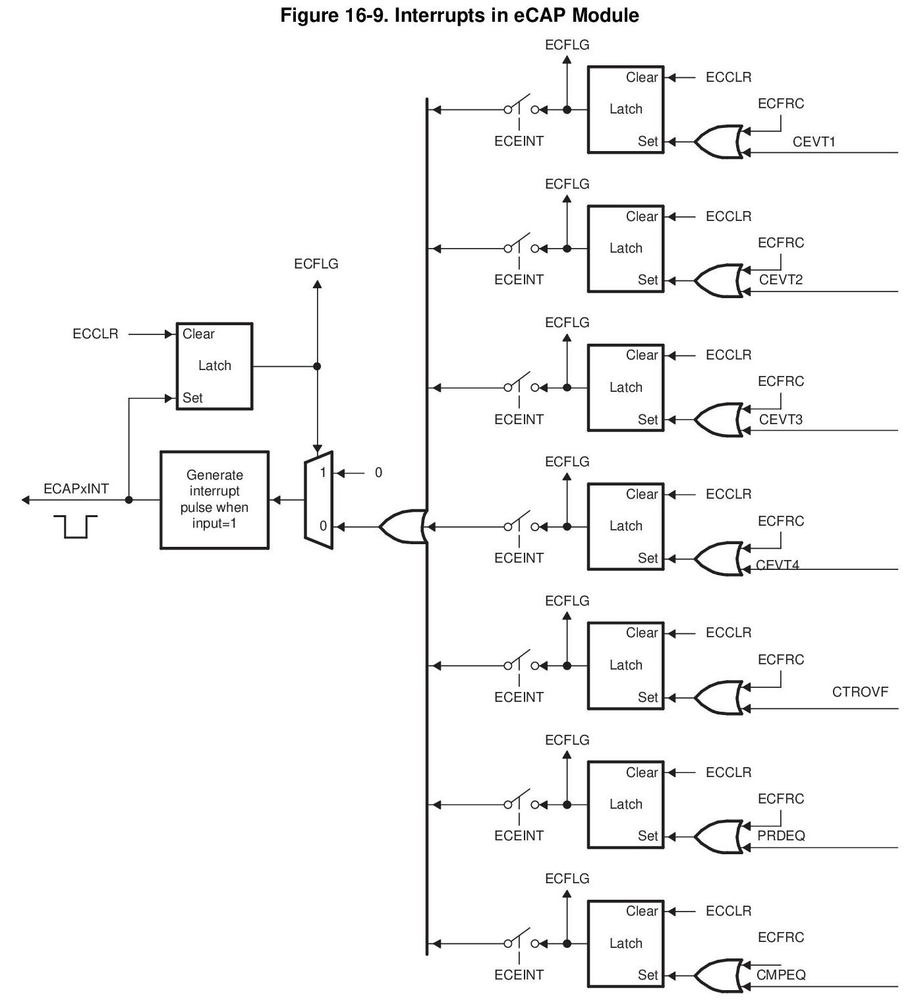

#### 16.6.8 Shadow Load and Lockout Control

In capture mode, this logic inhibits (locks out) any shadow loading of CAP1 or CAP2 from APRD and ACMP registers, respectively.

In APWM mode, shadow loading is active and two choices are permitted:

- Immediate - APRD or ACMP are transferred to CAP1 or CAP2 immediately upon writing a new value.

- On period equal, CTR[31:0] = PRD[31:0].

#### 16.6.9 APWM Mode Operation

Main operating highlights of the APWM section:

- The time-stamp counter bus is made available for comparison via 2 digital (32-bit) comparators.

- When CAP1/2 registers are not used in capture mode, their contents can be used as Period and Compare values in APWM mode.

- Double buffering is achieved via shadow registers APRD and ACMP (CAP3/4). The shadow register contents are transferred over to CAP1/2 registers, either immediately upon a write, or on a CTR = PRD trigger.

- In APWM mode, writing to CAP1/CAP2 active registers will also write the same value to the corresponding shadow registers CAP3/CAP4. This emulates immediate mode. Writing to the shadow registers CAP3/CAP4 will invoke the shadow mode.

- During initialization, you must write to the active registers for both period and compare. This automatically copies the initial values into the shadow values. For subsequent compare updates, during run-time, you only need to use the shadow registers.

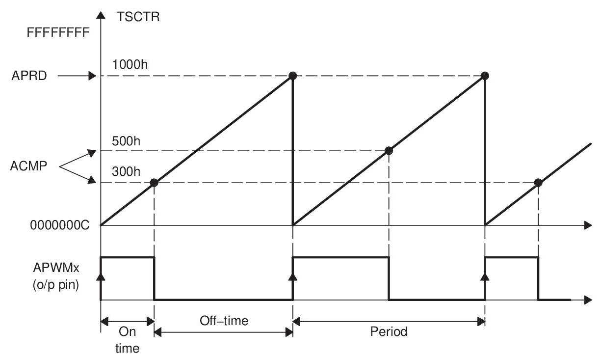

The behavior of APWM active high mode (APWMPOL \( =  = 0 \) ) is as follows:

CMP \( = 0 \times  {00000000} \) , output low for duration of period \( \left( {0\% \text{duty}}\right) \)

CMP = 0x00000001, output high 1 cycle

CMP = 0x00000002, output high 2 cycles

CMP = PERIOD, output high except for 1 cycle (<100% duty)

CMP \( = \) PERIOD+1, output high for complete period (100% duty)

CMP \( > \) PERIOD+1, output high for complete period

The behavior of APWM active low mode (APWMPOL \( =  = 1 \) ) is as follows:

---

CMP \( = 0 \times  {00000000} \) , output high for duration of period \( \left( {0\% \text{ duty }}\right) \)

	CMP \( = 0 \times  {000000001} \) , output low 1 cycle

CMP \( = 0 \times  {000000002} \) , output low 2 cycles

CMP \( = \) PERIOD, output low except for 1 cycle (<100% duty)

CMP \( = \) PERIOD+1, output low for complete period (100% duty)

	CMP > PERIOD+1, output low for complete period

---

Figure 16-11. Time-Base Frequency and Period Calculation

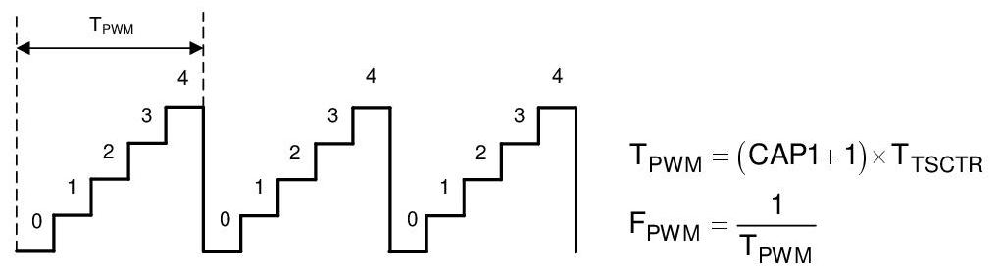

### 16.7 Application of the eCAP Module

The following sections will provide applications examples to show how to operate the eCAP module.

#### 16.7.1 Example 1 - Absolute Time-Stamp Operation Rising Edge Trigger

Figure 16-12 shows an example of continuous capture operation (Mod4 counter wraps around). In this figure, TSCTR counts-up without resetting and capture events are qualified on the rising edge only, this gives period (and frequency) information.

On an event, the TSCTR contents (time-stamp) is first captured, then Mod4 counter is incremented to the next state. When the TSCTR reaches FFFFFFFF (maximum value), it wraps around to 00000000 (not shown in Figure 16-12), if this occurs, the CTROVF (counter overflow) flag is set, and an interrupt (if enabled) occurs, CTROVF (counter overflow) Flag is set, and an Interrupt (if enabled) occurs. Captured Time-stamps are valid at the point indicated by the diagram (after the 4th event), hence event CEVT4 can conveniently be used to trigger an interrupt and the CPU can read data from the CAPx registers.

Figure 16-12. Capture Sequence for Absolute Time-stamp and Rising Edge Detect

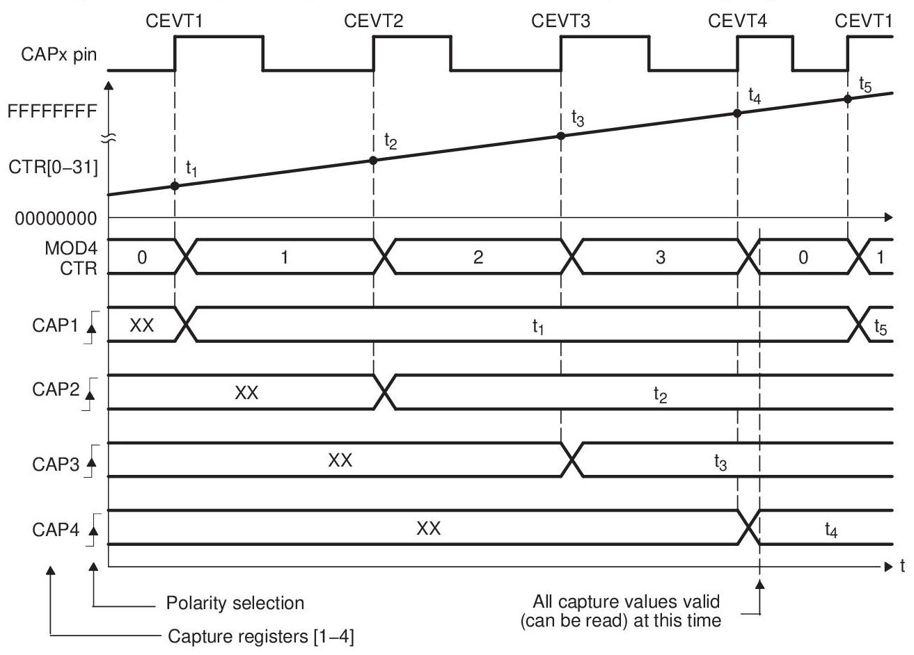

#### 16.7.2 Example 2 - Absolute Time-Stamp Operation Rising and Falling Edge Trigger

In Figure 16-13 the eCAP operating mode is almost the same as in the previous section except capture events are qualified as either rising or falling edge, this now gives both period and duty cycle information, that is: Period1 \( = {t}_{3} - {t}_{1} \) , Period2 \( = {t}_{5} - {t}_{3},\ldots \) and so on. Duty Cycle1 (on-time \( \% \) ) \( = \left( {{t}_{2} - {t}_{1}}\right) / \) Period1 \( \times \) 100%, etc. Duty Cycle 1 (off-time %) = ( \( {t}_{3} - {t}_{2} \) ) / Period1 x 100%, and so on.

Figure 16-13. Capture Sequence for Absolute Time-stamp With Rising and Falling Edge Detect

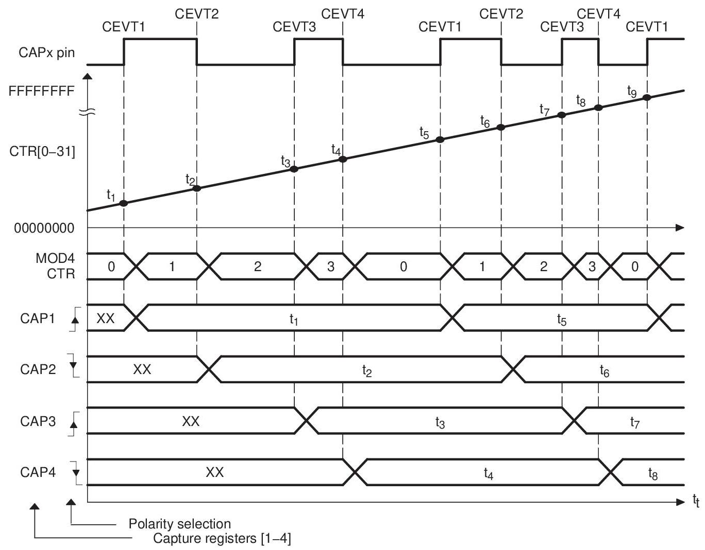

#### 16.7.3 Example 3 - Time Difference (Delta) Operation Rising Edge Trigger

This example Figure 16-14 shows how the eCAP module can be used to collect Delta timing data from pulse train waveforms. Here Continuous Capture mode (TSCTR counts-up without resetting, and Mod4 counter wraps around) is used. In Delta-time mode, TSCTR is Reset back to Zero on every valid event. Here Capture events are qualified as Rising edge only. On an event, TSCTR contents (Time-Stamp) is captured first, and then TSCTR is reset to Zero. The Mod4 counter then increments to the next state. If TSCTR reaches FFFFFFFFF (Max value), before the next event, it wraps around to 00000000 and continues, a CNTOVF (counter overflow) Flag is set, and an Interrupt (if enabled) occurs. The advanta of Delta-time Mode is that the CAPx contents directly give timing data without the need for CPU calculations, that is, Period1 \( = {\mathrm{T}}_{1} \) , Period2 \( = {\mathrm{T}}_{2},\ldots \) etc. As shown in the diagram, the CEVT1 event is a good trigger point to read the timing data, \( {T}_{1},{T}_{2},{T}_{3},{T}_{4} \) are all valid here.

Figure 16-14. Capture Sequence for Delta Mode Time-stamp and Rising Edge Detect

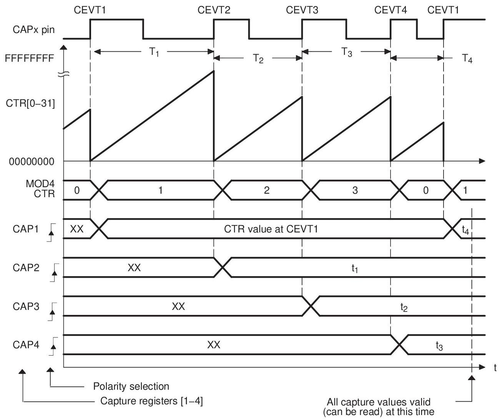

#### 16.7.4 Example 4 - Time Difference (Delta) Operation Rising and Falling Edge Trigger

In Figure 16-15 the eCAP operating mode is almost the same as in previous section except Capture events are qualified as either Rising or Falling edge, this now gives both Period and Duty cycle information, that is: Period1 = \( {\mathrm{T}}_{1} \) + \( {\mathrm{T}}_{2} \) , Period2 = \( {\mathrm{T}}_{3} \) + \( {\mathrm{T}}_{4},\ldots \) and so on, Duty Cycle1 (on-time %) = \( {\mathrm{T}}_{1} \) / Period1 x 100%, Duty Cycle1 (off-time %) \( = {\mathrm{T}}_{2}/ \) Period1 x 100%, and so on.

Figure 16-15. Capture Sequence for Delta Mode Time-stamp With Rising and Falling Edge Detect

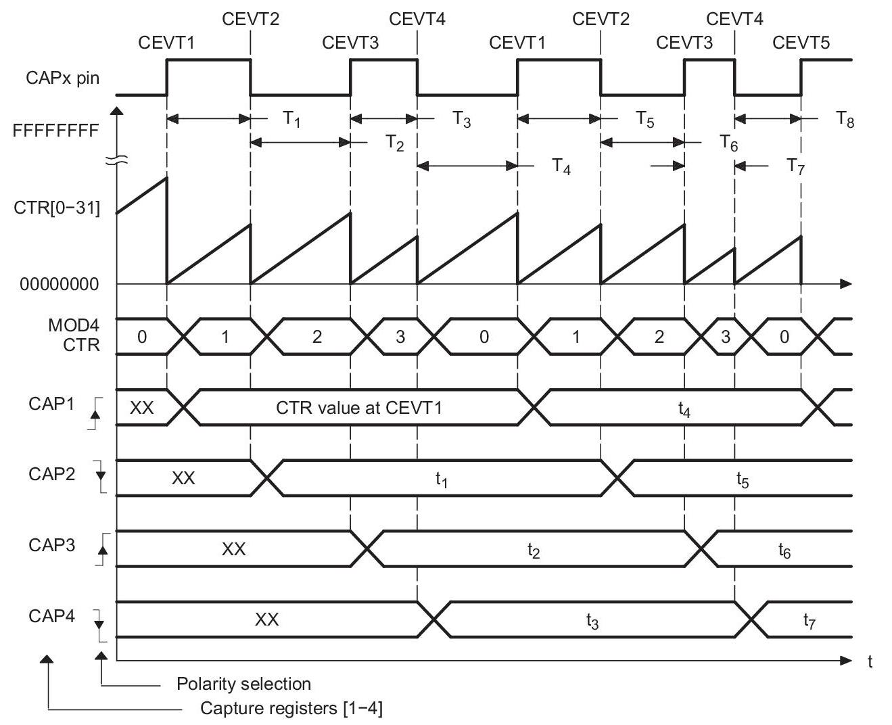

During initialization, you must write to the active registers for both period and compare. This action will automatically copy the init values into the shadow values. For subsequent compare updates during runtime, the shadow registers must be used.

### 16.8 Application of the APWM Mode

In this example, the eCAP module is configured to operate as a PWM generator. Here, a very simple single-channel PWM waveform is generated from the APWMx output pin. The PWM polarity is active high, which means that the compare value (CAP2 reg is now a compare register) represents the on-time (high level) of the period. Alternatively, if the APWMPOL bit is configured for active low, then the compare value represents the off-time.

16.8.1 Example 1 - Simple PWM Generation (Independent Channel/s)

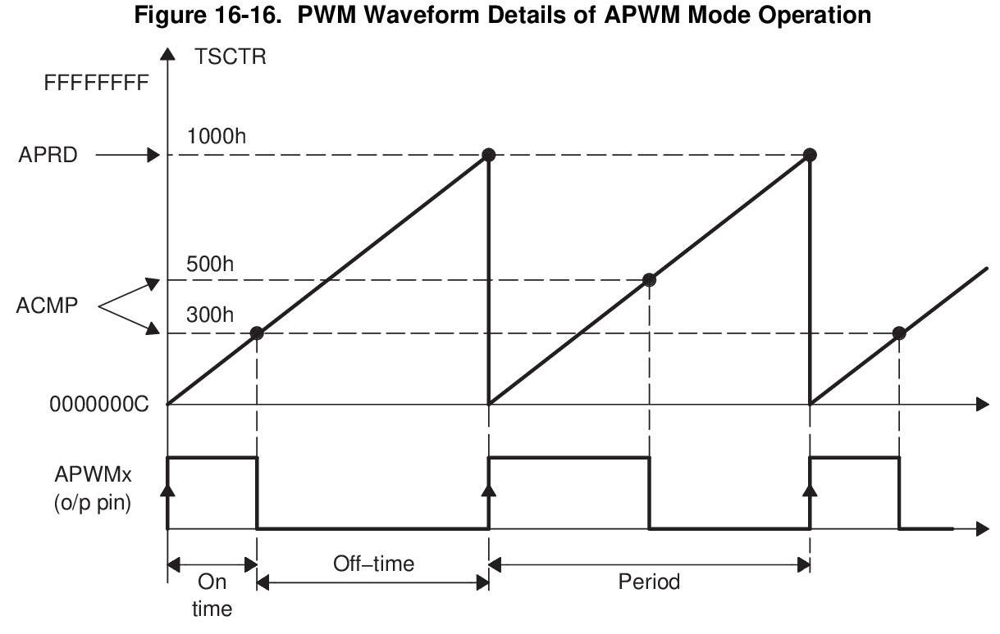

NOTE: Values are in hexadecimal ("h") notation.

### 16.9 eCAP Registers

This section describes the Enhanced Capture Registers.

#### 16.9.1 eCAP Base Addresses

Table 16-1. eCAP Base Address Table

<table><tr><td>Device Register</td><td>Register Name</td><td>Start Address</td><td>End Address</td></tr><tr><td>ECap1Regs</td><td>ECAP_REGS</td><td>0x0000_5000</td><td>0x0000_501F</td></tr><tr><td>ECap2Regs</td><td>ECAP_REGS</td><td>0x0000_5020</td><td>0x0000_503F</td></tr><tr><td>ECap3Regs</td><td>ECAP_REGS</td><td>0x0000_5040</td><td>0x0000_505F</td></tr><tr><td>ECap4Regs</td><td>ECAP_REGS</td><td>0x0000_5060</td><td>0x0000_507F</td></tr><tr><td>ECap5Regs</td><td>ECAP_REGS</td><td>0x0000_5080</td><td>0x0000_509F</td></tr><tr><td>ECap6Regs</td><td>ECAP_REGS</td><td>0x0000_50A0</td><td>0x0000_50BF</td></tr></table>

#### 16.9.2 ECAP_REGS Registers

Table 16-2 lists the ECAP_REGS registers. All register offset addresses not listed in Table 16-2 should be considered as reserved locations and the register contents should not be modified.

Table 16-2. ECAP_REGS Registers

<table><tr><td>Offset</td><td>Acronym</td><td>Register Name</td><td>Write Protection</td><td>Section</td></tr><tr><td>0h</td><td>TSCTR</td><td>Time-Stamp Counter</td><td></td><td>Go</td></tr><tr><td>2h</td><td>CTRPHS</td><td>Counter Phase Offset Value Register</td><td></td><td>Go</td></tr><tr><td>4h</td><td>CAP1</td><td>Capture 1 Register</td><td></td><td>Go</td></tr><tr><td>6h</td><td>CAP2</td><td>Capture 2 Register</td><td></td><td>Go</td></tr><tr><td>8h</td><td>CAP3</td><td>Capture 3 Register</td><td></td><td>Go</td></tr><tr><td>Ah</td><td>CAP4</td><td>Capture 4 Register</td><td></td><td>Go</td></tr><tr><td>14h</td><td>ECCTL1</td><td>Capture Control Register 1</td><td></td><td>Go</td></tr><tr><td>15h</td><td>ECCTL2</td><td>Capture Control Register 2</td><td></td><td>Go</td></tr><tr><td>16h</td><td>ECEINT</td><td>Capture Interrupt Enable Register</td><td></td><td>Go</td></tr><tr><td>17h</td><td>ECFLG</td><td>Capture Interrupt Flag Register</td><td></td><td>Go</td></tr><tr><td>18h</td><td>ECCLR</td><td>Capture Interrupt Clear Register</td><td></td><td>Go</td></tr><tr><td>19h</td><td>ECFRC</td><td>Capture Interrupt Force Register</td><td></td><td>Go</td></tr></table>

Complex bit access types are encoded to fit into small table cells. Table 16-3 shows the codes that are used for access types in this section.

Table 16-3. ECAP_REGS Access Type Codes

<table><tr><td>Access Type</td><td>Code</td><td>Description</td></tr><tr><td colspan="3">Read Type</td></tr><tr><td>R</td><td>R</td><td>Read</td></tr><tr><td>R-0</td><td>R   -0</td><td>Read   Returns 0s</td></tr><tr><td colspan="3">Write Type</td></tr><tr><td>W</td><td>W</td><td>Write</td></tr><tr><td>W1C</td><td>W   1C</td><td>Write   1 to clear</td></tr><tr><td>W1S</td><td>W   1S</td><td>Write   1 to set</td></tr><tr><td colspan="3">Reset or Default Value</td></tr><tr><td>-n</td><td></td><td>Value after reset or the default value</td></tr><tr><td colspan="3">Register Array Variables</td></tr><tr><td>i, j, k, l, m, n</td><td></td><td>When these variables are used in a register name, an offset, or an address, they refer to the value of a register array where the register is part of a group of repeating registers. The register groups form a hierarchical structure and the array is represented with a formula.</td></tr><tr><td>y</td><td></td><td>When this variable is used in a register name, an offset, or an address it refers to the value of a register array.</td></tr></table>

16.9.2.1 TSCTR Register (Offset = 0h) [reset = 0h]

TSCTR is shown in Figure 16-17 and described in Table 16-4.

Return to the Summary Table.

Time-Stamp Counter

Figure 16-17. TSCTR Register

<table><tr><td>31</td><td>30</td><td>29</td><td>28</td><td>27</td><td>26</td><td>25</td><td>24</td><td>23</td><td>22</td><td>21</td><td>20</td><td>19</td><td>18</td><td>17</td><td>16</td><td>15</td><td>14</td><td>13</td><td>12</td><td>11</td><td>10</td><td>9 8</td><td>7</td><td>6</td><td>5</td><td>4</td><td>3</td><td>2</td><td>1</td><td>0</td></tr><tr><td></td><td></td><td></td><td></td><td></td><td></td><td></td><td></td><td></td><td></td><td></td><td></td><td></td><td></td><td></td><td>TSCTR</td><td></td><td></td><td></td><td></td><td></td><td></td><td></td><td></td><td></td><td></td><td></td><td></td><td></td><td></td><td></td></tr><tr><td colspan="31">R/W-0h</td></tr></table>

Table 16-4. TSCTR Register Field Descriptions

<table><tr><td>Bit</td><td>Field</td><td>Type</td><td>Reset</td><td>Description</td></tr><tr><td>31-0</td><td>TSCTR</td><td>R/W</td><td>0h</td><td>Active 32-bit counter register that is used as the capture time-base Reset type: SYSRSn</td></tr></table>

16.9.2.2 CTRPHS Register (Offset = 2h) [reset = 0h]

CTRPHS is shown in Figure 16-18 and described in Table 16-5.

Return to the Summary Table.

Counter Phase Offset Value Register

Figure 16-18. CTRPHS Register

<table><tr><td></td><td></td><td></td><td></td><td></td><td></td><td></td><td>24</td><td>23</td><td>22</td><td>21</td><td>20 19</td><td>18</td><td>17</td><td>16</td><td>15</td><td>14</td><td>13</td><td>12</td><td>11</td><td>10</td><td>9</td><td>8</td><td></td><td></td><td>5</td><td></td><td></td><td>2</td><td>1</td><td>0</td></tr><tr><td></td><td></td><td></td><td></td><td></td><td></td><td></td><td></td><td></td><td></td><td></td><td></td><td></td><td></td><td>CTRPHS</td><td></td><td></td><td></td><td></td><td></td><td></td><td></td><td></td><td></td><td></td><td></td><td></td><td></td><td></td><td></td><td></td></tr><tr><td colspan="31">R/W-0h</td></tr></table>

Table 16-5. CTRPHS Register Field Descriptions

<table><tr><td>Bit</td><td>Field</td><td>Type</td><td>Reset</td><td>Description</td></tr><tr><td>31-0</td><td>CTRPHS</td><td>R/W</td><td>0h</td><td>Counter phase value register that can be programmed for phase lag/lead. This register CTRPHS is loaded into TSCTR upon either a SYNCI event or S/W force via a control bit. Used to achieve phase control synchronization with respect to other eCAP and EPWM timebases.   Reset type: SYSRSn</td></tr></table>

16.9.2.3 CAP1 Register (Offset = 4h) [reset = 0h]

CAP1 is shown in Figure 16-19 and described in Table 16-6.

Return to the Summary Table.

Capture 1 Register

Figure 16-19. CAP1 Register

<table><tr><td>31</td><td>30</td><td>29</td><td>28</td><td>27</td><td>26</td><td>25</td><td>24</td><td>23</td><td>22</td><td>21</td><td>20</td><td>19</td><td>18</td><td>17</td><td>16</td><td>15</td><td>14</td><td>13</td><td>12</td><td>11</td><td>10</td><td>9</td><td>8</td><td>7</td><td>6</td><td>5</td><td>4</td><td>3</td><td>2</td><td>1</td><td>0</td></tr><tr><td></td><td></td><td></td><td></td><td></td><td></td><td></td><td></td><td></td><td></td><td></td><td></td><td></td><td></td><td></td><td>CAP1</td><td></td><td></td><td></td><td></td><td></td><td></td><td></td><td></td><td></td><td></td><td></td><td></td><td></td><td></td><td></td><td></td></tr><tr><td colspan="32">R/W-0h</td></tr></table>

Table 16-6. CAP1 Register Field Descriptions

<table><tr><td>Bit</td><td>Field</td><td>Type</td><td>Reset</td><td>Description</td></tr><tr><td>31-0</td><td>CAP1</td><td>R/W</td><td>0h</td><td>This register can be loaded (written) by:   - Time-Stamp counter value (TSCTR) during a capture event   - Software - may be useful for test purposes or initialization   - ARPD shadow register (CAP3) when used in APWM mode Reset type: SYSRSn</td></tr></table>

16.9.2.4 CAP2 Register (Offset = 6h) [reset = 0h]

CAP2 is shown in Figure 16-20 and described in Table 16-7.

Return to the Summary Table.

Capture 2 Register

Figure 16-20. CAP2 Register

<table><tr><td>31</td><td></td><td></td><td></td><td>27</td><td>26</td><td>25</td><td>24</td><td>23</td><td>22</td><td>21</td><td>20</td><td>19</td><td>18</td><td>17</td><td>16</td><td>15</td><td>14</td><td>13</td><td>12</td><td>11</td><td>10</td><td>9</td><td>8</td><td>7</td><td>6</td><td>5</td><td>4</td><td>3</td><td>2</td><td>1</td><td>0</td></tr><tr><td></td><td></td><td></td><td></td><td></td><td></td><td></td><td></td><td></td><td></td><td></td><td></td><td></td><td></td><td></td><td>CAP2</td><td></td><td></td><td></td><td></td><td></td><td></td><td></td><td></td><td></td><td></td><td></td><td></td><td></td><td></td><td></td><td></td></tr><tr><td colspan="32">R/W-0h</td></tr></table>

Table 16-7. CAP2 Register Field Descriptions

<table><tr><td>Bit</td><td>Field</td><td>Type</td><td>Reset</td><td>Description</td></tr><tr><td>31-0</td><td>CAP2</td><td>R/W</td><td>0h</td><td>This register can be loaded (written) by:   - Time-Stamp ( counter value) during a capture event   - Software - may be useful for test purposes   - ACMP shadow register (CAP4) when used in APWM mode Reset type: SYSRSn</td></tr></table>

16.9.2.5 CAP3 Register (Offset = 8h) [reset = 0h]

CAP3 is shown in Figure 16-21 and described in Table 16-8.

Return to the Summary Table.

Capture 3 Register

Figure 16-21. CAP3 Register

<table><tr><td>31</td><td>30</td><td>29</td><td>28</td><td>27</td><td>26</td><td>25</td><td>24</td><td>23</td><td>22</td><td>21 20</td><td>19</td><td>18</td><td>17 16</td><td>15</td><td>14</td><td>13</td><td>12</td><td>11</td><td>10</td><td>9</td><td>8</td><td>7</td><td>6</td><td>5</td><td>4</td><td>3</td><td>2</td><td>1</td><td>0</td></tr><tr><td></td><td></td><td></td><td></td><td></td><td></td><td></td><td></td><td></td><td></td><td></td><td></td><td></td><td></td><td>CAP3</td><td></td><td></td><td></td><td></td><td></td><td></td><td></td><td></td><td></td><td></td><td></td><td></td><td></td><td></td><td></td></tr><tr><td colspan="30">R/W-0h</td></tr></table>

Table 16-8. CAP3 Register Field Descriptions

<table><tr><td>Bit</td><td>Field</td><td>Type</td><td>Reset</td><td>Description</td></tr><tr><td>31-0</td><td>CAP3</td><td>R/W</td><td>0h</td><td>In CMP mode, this is a time-stamp capture register.   In APWM mode, this is the period shadow (APRD) register. You can update the PWM period value through this register. CAP3 (APRD) shadows CAP1 in this mode.   Reset type: SYSRSn</td></tr></table>

16.9.2.6 CAP4 Register (Offset = Ah) [reset = 0h]

CAP4 is shown in Figure 16-22 and described in Table 16-9.

Return to the Summary Table.

Capture 4 Register

Figure 16-22. CAP4 Register

<table><tr><td>31</td><td>30</td><td>29</td><td>28</td><td>27</td><td>26</td><td>25</td><td>24</td><td>23</td><td>22</td><td>21</td><td>20</td><td>19</td><td>18</td><td>17</td><td>16</td><td>15 14</td><td>13</td><td>12</td><td>11</td><td>10</td><td>9</td><td>8</td><td>7</td><td>6</td><td>5</td><td>4</td><td>3</td><td>2</td><td>1</td><td>0</td></tr><tr><td></td><td></td><td></td><td></td><td></td><td></td><td></td><td></td><td></td><td></td><td></td><td></td><td></td><td></td><td></td><td>CAP4</td><td></td><td></td><td></td><td></td><td></td><td></td><td></td><td></td><td></td><td></td><td></td><td></td><td></td><td></td><td></td></tr><tr><td colspan="31">R/W-0h</td></tr></table>

Table 16-9. CAP4 Register Field Descriptions

<table><tr><td>Bit</td><td>Field</td><td>Type</td><td>Reset</td><td>Description</td></tr><tr><td>31-0</td><td>CAP4</td><td>R/W</td><td>0h</td><td>In CMP mode, this is a time-stamp capture register.   In APWM mode, this is the compare shadow (ACMP) register. You can update the PWM compare value via this register. CAP4 (ACMP) shadows CAP2 in this mode.   Reset type: SYSRSn</td></tr></table>

16.9.2.7 ECCTL1 Register (Offset = 14h) [reset = 0h]

ECCTL1 is shown in Figure 16-23 and described in Table 16-10.

Return to the Summary Table.

Capture Control Register 1

Figure 16-23. ECCTL1 Register

<table><tr><td>15</td><td>14</td><td>13</td><td>12</td><td>11</td><td>10</td><td>9</td><td>8</td></tr><tr><td colspan="2">FREE_SOFT</td><td colspan="5">PRESCALE</td><td>CAPLDEN</td></tr><tr><td colspan="3">R/W-0h</td><td colspan="3">R/W-0h</td><td></td><td>R/W-0h</td></tr><tr><td>7</td><td>6</td><td>5</td><td>4</td><td>3</td><td>2</td><td>1</td><td>0</td></tr><tr><td>CTRRST4</td><td>CAP4POL</td><td>CTRRST3</td><td>CAP3POL</td><td>CTRRST2</td><td>CAP2POL</td><td>CTRRST1</td><td>CAP1POL</td></tr><tr><td>R/W-0h</td><td>R/W-0h</td><td>R/W-0h</td><td>R/W-0h</td><td>R/W-0h</td><td>R/W-0h</td><td>R/W-0h</td><td>R/W-0h</td></tr></table>

Table 16-10. ECCTL1 Register Field Descriptions

<table><tr><td>Bit</td><td>Field</td><td>Type</td><td>Reset</td><td>Description</td></tr><tr><td>15-14</td><td>FREE_SOFT</td><td>R/W</td><td>0h</td><td>Emulation Control   Reset type: SYSRSn   0h (R/W) = TSCTR counter stops immediately on emulation suspend   1h (R/W) = TSCTR counter runs until = 0   2h (R/W) = TSCTR counter is unaffected by emulation suspend (Run Free)   3h (R/W) = TSCTR counter is unaffected by emulation suspend (Run Free)</td></tr><tr><td>13-9</td><td>PRESCALE</td><td>R/W</td><td>0h</td><td>Event Filter prescale select   Reset type: SYSRSn   Oh (R/W) = Divide by 1 (i.e., no prescale, by-pass the prescaler)   1h (R/W) = Divide by 2   2h (R/W) = Divide by 4   3h (R/W) = Divide by 6   4h (R/W) = Divide by 8   5h (R/W) = Divide by 10   1Eh (R/W) = Divide by 60   1Fh (R/W) = Divide by 62</td></tr><tr><td>8</td><td>CAPLDEN</td><td>R/W</td><td>0h</td><td>Enable Loading of CAP1-4 registers on a capture event. Note that this bit does not disable CEVTn events from being generated.   Reset type: SYSRSn   0h (R/W) = Disable CAP1-4 register loads at capture event time.   1h (R/W) = Enable CAP1-4 register loads at capture event time.</td></tr><tr><td>7</td><td>CTRRST4</td><td>R/W</td><td>0h</td><td>Counter Reset on Capture Event 4   Reset type: SYSRSn   0h (R/W) = Do not reset counter on Capture Event 4 (absolute time stamp operation)   1h (R/W) = Reset counter after Capture Event 4 time-stamp has been captured (used in difference mode operation)</td></tr><tr><td>6</td><td>CAP4POL</td><td>R/W</td><td>0h</td><td>Capture Event 4 Polarity select   Reset type: SYSRSn   0h (R/W) = Capture Event 4 triggered on a rising edge (RE)   1h (R/W) = Capture Event 4 triggered on a falling edge (FE)</td></tr></table>

Table 16-10. ECCTL1 Register Field Descriptions (continued)

<table><tr><td>Bit</td><td>Field</td><td>Type</td><td>Reset</td><td>Description</td></tr><tr><td>5</td><td>CTRRST3</td><td>R/W</td><td>0h</td><td>Counter Reset on Capture Event 3   Reset type: SYSRSn   0h (R/W) = Do not reset counter on Capture Event 3 (absolute time stamp)   1h (R/W) = Reset counter after Event 3 time-stamp has been captured (used in difference mode operation)</td></tr><tr><td>4</td><td>CAP3POL</td><td>R/W</td><td>0h</td><td>Capture Event 3 Polarity select   Reset type: SYSRSn   0h (R/W) = Capture Event 3 triggered on a rising edge (RE)   1h (R/W) = Capture Event 3 triggered on a falling edge (FE)</td></tr><tr><td>3</td><td>CTRRST2</td><td>R/W</td><td>0h</td><td>Counter Reset on Capture Event 2   Reset type: SYSRSn   0h (R/W) = Do not reset counter on Capture Event 2 (absolute time stamp)   1h (R/W) = Reset counter after Event 2 time-stamp has been captured (used in difference mode operation)</td></tr><tr><td>2</td><td>CAP2POL</td><td>R/W</td><td>0h</td><td>Capture Event 2 Polarity select   Reset type: SYSRSn   0h (R/W) = Capture Event 2 triggered on a rising edge (RE)   1h (R/W) = Capture Event 2 triggered on a falling edge (FE)</td></tr><tr><td>1</td><td>CTRRST1</td><td>R/W</td><td>0h</td><td>Counter Reset on Capture Event 1   Reset type: SYSRSn   0h (R/W) = Do not reset counter on Capture Event 1 (absolute time stamp)   1h (R/W) = Reset counter after Event 1 time-stamp has been captured (used in difference mode operation)</td></tr><tr><td>0</td><td>CAP1POL</td><td>R/W</td><td>Oh</td><td>Capture Event 1 Polarity select   Reset type: SYSRSn   0h (R/W) = Capture Event 1 triggered on a rising edge (RE)   1h (R/W) = Capture Event 1 triggered on a falling edge (FE)</td></tr></table>

16.9.2.8 ECCTL2 Register (Offset = 15h) [reset = 6h]

ECCTL2 is shown in Figure 16-24 and described in Table 16-11.

Return to the Summary Table.

Capture Control Register 2

Figure 16-24. ECCTL2 Register

<table><tr><td>15</td><td>14</td><td>13</td><td>12</td><td>11</td><td>10</td><td>9</td><td>8</td></tr><tr><td></td><td></td><td>RESERVED</td><td></td><td></td><td>APWMPOL</td><td>CAP_APWM</td><td>SWSYNC</td></tr><tr><td colspan="5">R-0h</td><td>R/W-0h</td><td>R/W-0h</td><td>R-0/W1S-0h</td></tr><tr><td>7</td><td>6</td><td>5</td><td>4</td><td>3</td><td>2</td><td>1</td><td>0</td></tr><tr><td colspan="2">SYNCO_SEL</td><td>SYNCI_EN</td><td>TSCTRSTOP</td><td>REARM</td><td colspan="2">STOP_WRAP</td><td>CONT ONESH T</td></tr><tr><td colspan="2">R/W-0h</td><td>R/W-0h</td><td>R/W-0h</td><td>R-0/W1S-0h</td><td colspan="2">R/W-3h</td><td>R/W-0h</td></tr></table>

Table 16-11. ECCTL2 Register Field Descriptions

<table><tr><td>Bit</td><td>Field</td><td>Type</td><td>Reset</td><td>Description</td></tr><tr><td>15-11</td><td>RESERVED</td><td>R</td><td>0h</td><td>Reserved</td></tr><tr><td>10</td><td>APWMPOL</td><td>R/W</td><td>0h</td><td>APWM output polarity select. This is applicable only in APWM operating mode.   Reset type: SYSRSn   0h (R/W) = Output is active high (Compare value defines high time)   1h (R/W) = Output is active low (Compare value defines low time)</td></tr><tr><td>9</td><td>CAP_APWM</td><td>R/W</td><td>0h</td><td>CAP/APWM operating mode select   Reset type: SYSRSn   0h (R/W) = ECAP module operates in capture mode. This mode forces the following configuration:   - Inhibits TSCTR resets via CTR = PRD event   - Inhibits shadow loads on CAP1 and 2 registers   - Permits user to enable CAP1-4 register load   - CAPx/APWMx pin operates as a capture input   1h (R/W) = ECAP module operates in APWM mode. This mode forces the following configuration:   - Resets TSCTR on CTR = PRD event (period boundary   - Permits shadow loading on CAP1 and 2 registers   - Disables loading of time-stamps into CAP1-4 registers   - CAPx/APWMx pin operates as a APWM output</td></tr><tr><td>8</td><td>SWSYNC</td><td>R-0/W1S</td><td>0h</td><td>Software-forced Counter (TSCTR) Synchronizer. This provides the user a method to generate a synchronization pulse through software. In APWM mode, the synchronization pulse can also be sourced from the CTR = PRD event.   Reset type: SYSRSn   0h (R/W) = Writing a zero has no effect. Reading always returns a zero   1h (R/W) = Writing a one forces a TSCTR shadow load of current ECAP module and any ECAP modules down-stream providing the SYNCO_SEL bits are 0,0. After writing a 1, this bit returns to a zero.   Note: Selection CTR = PRD is meaningful only in APWM mode however, you can choose it in CAP mode if you find doing so useful.</td></tr><tr><td>7-6</td><td>SYNCO_SEL</td><td>R/W</td><td>0h</td><td>Sync-Out Select   Reset type: SYSRSn   0h (R/W) = Select sync-in event to be the sync-out signal (pass through)   1h (R/W) = Select CTR = PRD event to be the sync-out signal   2h (R/W) = Disable sync out signal   3h (R/W) = Disable sync out signal</td></tr></table>

Table 16-11. ECCTL2 Register Field Descriptions (continued)

<table><tr><td>Bit</td><td>Field</td><td>Type</td><td>Reset</td><td>Description</td></tr><tr><td>5</td><td>SYNCI_EN</td><td>R/W</td><td>0h</td><td>Counter (TSCTR) Sync-In select mode   Reset type: SYSRSn   0h (R/W) = Disable sync-in option   1h (R/W) = Enable counter (TSCTR) to be loaded from CTRPHS register upon either a SYNCI signal or a S/W force event.</td></tr><tr><td>4</td><td>TSCTRSTOP</td><td>R/W</td><td>0h</td><td>Time Stamp (TSCTR) Counter Stop (freeze) Control   Reset type: SYSRSn   0h (R/W) = TSCTR stopped   1h (R/W) = TSCTR free-running</td></tr><tr><td>3</td><td>REARM</td><td>R-0/W1S</td><td>0h</td><td>Re-Arming Control. Note: The re-arm function is valid in one shot or continuous mode.   Reset type: SYSRSn   0h (R/W) = Has no effect (reading always returns a 0)   1h (R/W) = Arms the one-shot sequence as follows:   1) Resets the Mod4 counter to zero   2) Unfreezes the Mod4 counter   3) Enables capture register loads</td></tr><tr><td>2-1</td><td>STOP_WRAP</td><td>R/W</td><td>3h</td><td>Stop value for one-shot mode. This is the number (between 1-4) of captures allowed to occur before the CAP(1-4) registers are frozen, that is, capture sequence is stopped.   Wrap value for continuous mode. This is the number (between 1-4) of the capture register in which the circular buffer wraps around and starts again.   Notes: STOP WRAP is compared to Mod4 counter and, when equal, 2 actions occur:   - Mod4 counter is stopped (frozen)   - Capture register loads are inhibited   In one-shot mode, further interrupt events are blocked until rearmed.   Reset type: SYSRSn   0h (R/W) = Stop after Capture Event 1 in one-shot mode Wrap after Capture Event 1 in continuous mode.   1h (R/W) = Stop after Capture Event 2 in one-shot mode Wrap after Capture Event 2 in continuous mode.   2h (R/W) = Stop after Capture Event 3 in one-shot mode Wrap after Capture Event 3 in continuous mode.   3h (R/W) = Stop after Capture Event 4 in one-shot mode Wrap after Capture Event 4 in continuous mode.</td></tr><tr><td>0</td><td>CONT ONESHT</td><td>R/W</td><td>0h</td><td>Continuous or one-shot mode control (applicable only in capture mode)   Reset type: SYSRSn   0h (R/W) = Operate in continuous mode   1h (R/W) = Operate in one-Shot mode</td></tr></table>

##### 16.9.2.9 ECEINT Register (Offset = 16h) [reset = 0h]

ECEINT is shown in Figure 16-25 and described in Table 16-12.

Return to the Summary Table.

The interrupt enable bits (CEVT1, ...) block any of the selected events from generating an interrupt. Events will still be latched into the flag bit (ECFLG register) and can be forced/cleared via the ECFRC/ECCLR registers.

The proper procedure for configuring peripheral modes and interrupts is as follows:

- Disable global interrupts

- Stop eCAP counter

- Disable eCAP interrupts

- Configure peripheral registers

- Clear spurious eCAP interrupt flags

- Enable eCAP interrupts

- Start eCAP counter

- Enable global interrupts

Figure 16-25. ECEINT Register

<table><tr><td>15</td><td>14</td><td>13</td><td>12</td><td>11</td><td>10</td><td>9</td><td>8</td></tr><tr><td></td><td></td><td></td><td colspan="2">RESERVED</td><td></td><td></td><td></td></tr><tr><td colspan="8">R-0h</td></tr><tr><td>7</td><td>6</td><td>5</td><td>4</td><td>3</td><td>2</td><td>1</td><td>0</td></tr><tr><td>CTR_EQ_CMP</td><td>CTR_EQ_PRD</td><td>CTROVF</td><td>CEVT4</td><td>CEVT3</td><td>CEVT2</td><td>CEVT1</td><td>RESERVED</td></tr><tr><td>R/W-0h</td><td>R/W-0h</td><td>R/W-0h</td><td>R/W-0h</td><td>R/W-0h</td><td>R/W-0h</td><td>R/W-0h</td><td>R-0h</td></tr></table>

Table 16-12. ECEINT Register Field Descriptions

<table><tr><td>Bit</td><td>Field</td><td>Type</td><td>Reset</td><td>Description</td></tr><tr><td>15-8</td><td>RESERVED</td><td>R</td><td>Oh</td><td>Reserved</td></tr><tr><td>7</td><td>CTR_EQ_CMP</td><td>R/W</td><td>Oh</td><td>Counter Equal Compare Interrupt Enable   Reset type: SYSRSn   0h (R/W) = Disable Compare Equal as an Interrupt source   1h (R/W) = Enable Compare Equal as an Interrupt source</td></tr><tr><td>6</td><td>CTR_EQ_PRD</td><td>R/W</td><td>Oh</td><td>Counter Equal Period Interrupt Enable   Reset type: SYSRSn   0h (R/W) = Disable Period Equal as an Interrupt source   1h (R/W) = Enable Period Equal as an Interrupt source</td></tr><tr><td>5</td><td>CTROVF</td><td>R/W</td><td>Oh</td><td>Counter Overflow Interrupt Enable   Reset type: SYSRSn   0h (R/W) = Disabled counter Overflow as an Interrupt source   1h (R/W) = Enable counter Overflow as an Interrupt source</td></tr><tr><td>4</td><td>CEVT4</td><td>R/W</td><td>Oh</td><td>Capture Event 4 Interrupt Enable   Reset type: SYSRSn   0h (R/W) = Disable Capture Event 4 as an Interrupt source   1h (R/W) = Capture Event 4 Interrupt Enable</td></tr><tr><td>3</td><td>CEVT3</td><td>R/W</td><td>Oh</td><td>Capture Event 3 Interrupt Enable   Reset type: SYSRSn   0h (R/W) = Disable Capture Event 3 as an Interrupt source   1h (R/W) = Enable Capture Event 3 as an Interrupt source</td></tr><tr><td>2</td><td>CEVT2</td><td>R/W</td><td>Oh</td><td>Capture Event 2 Interrupt Enable   Reset type: SYSRSn   0h (R/W) = Disable Capture Event 2 as an Interrupt source   1h (R/W) = Enable Capture Event 2 as an Interrupt source</td></tr></table>

Table 16-12. ECEINT Register Field Descriptions (continued)

<table><tr><td>Bit</td><td>Field</td><td>Type</td><td>Reset</td><td>Description</td></tr><tr><td>1</td><td>CEVT1</td><td>R/W</td><td>0h</td><td>Capture Event 1 Interrupt Enable   Reset type: SYSRSn   0h (R/W) = Disable Capture Event 1 as an Interrupt source   1h (R/W) = Enable Capture Event 1 as an Interrupt source</td></tr><tr><td>0</td><td>RESERVED</td><td>R</td><td>0h</td><td>Reserved</td></tr></table>

16.9.2.10 ECFLG Register (Offset = 17h) [reset = 0h]

ECFLG is shown in Figure 16-26 and described in Table 16-13.

Return to the Summary Table.

Capture Interrupt Flag Register

Figure 16-26. ECFLG Register

<table><tr><td>15</td><td>14</td><td>13</td><td>12</td><td>11</td><td>10</td><td>9</td><td>8</td></tr><tr><td></td><td></td><td></td><td colspan="2">RESERVED</td><td></td><td></td><td></td></tr><tr><td colspan="8">R-0h</td></tr><tr><td>7</td><td>6</td><td>5</td><td>4</td><td>3</td><td>2</td><td>1</td><td>0</td></tr><tr><td>CTR_CMP</td><td>CTR_PRD</td><td>CTROVF</td><td>CEVT4</td><td>CEVT3</td><td>CEVT2</td><td>CEVT1</td><td>INT</td></tr><tr><td>R-0h</td><td>R-0h</td><td>R-0h</td><td>R-0h</td><td>R-0h</td><td>R-0h</td><td>R-0h</td><td>R-0h</td></tr></table>

Table 16-13. ECFLG Register Field Descriptions

<table><tr><td>Bit</td><td>Field</td><td>Type</td><td>Reset</td><td>Description</td></tr><tr><td>15-8</td><td>RESERVED</td><td>R</td><td>0h</td><td>Reserved</td></tr><tr><td>7</td><td>CTR_CMP</td><td>R</td><td>0h</td><td>Compare Equal Compare Status Flag. This flag is active only in APWM mode.   Reset type: SYSRSn   0h (R/W) = Indicates no event occurred   1h (R/W) = Indicates the counter (TSCTR) reached the compare register value (ACMP)</td></tr><tr><td>6</td><td>CTR_PRD</td><td>R</td><td>0h</td><td>Counter Equal Period Status Flag. This flag is only active in APWM mode.   Reset type: SYSRSn   0h (R/W) = Indicates no event occurred   1h (R/W) = Indicates the counter (TSCTR) reached the period register value (APRD) and was reset.</td></tr><tr><td>5</td><td>CTROVF</td><td>R</td><td>0h</td><td>Counter Overflow Status Flag. This flag is active in CAP and APWM mode.   Reset type: SYSRSn   0h (R/W) = Indicates no event occurred   1h (R/W) = Indicates the counter (TSCTR) has made the transition from FFFFFFFFF " 00000000</td></tr><tr><td>4</td><td>CEVT4</td><td>R</td><td>0h</td><td>Capture Event 4 Status Flag This flag is only active in CAP mode. Reset type: SYSRSn   0h (R/W) = Indicates no event occurred   1h (R/W) = Indicates the fourth event occurred at ECAPx pin</td></tr><tr><td>3</td><td>CEVT3</td><td>R</td><td>0h</td><td>Capture Event 3 Status Flag. This flag is active only in CAP mode. Reset type: SYSRSn   0h (R/W) = Indicates no event occurred   1h (R/W) = Indicates the third event occurred at ECAPx pin.</td></tr><tr><td>2</td><td>CEVT2</td><td>R</td><td>0h</td><td>Capture Event 2 Status Flag. This flag is only active in CAP mode. Reset type: SYSRSn   0h (R/W) = Indicates no event occurred   1h (R/W) = Indicates the second event occurred at ECAPx pin.</td></tr><tr><td>1</td><td>CEVT1</td><td>R</td><td>0h</td><td>Capture Event 1 Status Flag. This flag is only active in CAP mode. Reset type: SYSRSn   0h (R/W) = Indicates no event occurred   1h (R/W) = Indicates the first event occurred at ECAPx pin.</td></tr></table>

Table 16-13. ECFLG Register Field Descriptions (continued)

<table><tr><td>Bit</td><td>Field</td><td>Type</td><td>Reset</td><td>Description</td></tr><tr><td>0</td><td>INT</td><td>R</td><td>0h</td><td>Global Interrupt Status Flag   Reset type: SYSRSn   0h (R/W) = Indicates no event occurred   1h (R/W) = Indicates that an interrupt was generated.</td></tr></table>

16.9.2.11 ECCLR Register (Offset = 18h) [reset = 0h]

ECCLR is shown in Figure 16-27 and described in Table 16-14.

Return to the Summary Table.

Capture Interrupt Clear Register

Figure 16-27. ECCLR Register

<table><tr><td>15</td><td>14</td><td>13</td><td>12</td><td>11</td><td>10</td><td>9</td><td>8</td></tr><tr><td></td><td></td><td></td><td colspan="2">RESERVED</td><td></td><td></td><td></td></tr><tr><td colspan="8">R-0h</td></tr><tr><td>7</td><td>6</td><td>5</td><td>4</td><td>3</td><td>2</td><td>1</td><td>0</td></tr><tr><td>CTR_CMP</td><td>CTR_PRD</td><td>CTROVF</td><td>CEVT4</td><td>CEVT3</td><td>CEVT2</td><td>CEVT1</td><td>INT</td></tr><tr><td>R-0/W1C-0h</td><td>R-0/W1C-0h</td><td>R-0/W1C-0h</td><td>R-0/W1C-0h</td><td>R-0/W1C-0h</td><td>R-0/W1C-0h</td><td>R-0/W1C-0h</td><td>R-0/W1C-0h</td></tr></table>

Table 16-14. ECCLR Register Field Descriptions

<table><tr><td>Bit</td><td>Field</td><td>Type</td><td>Reset</td><td>Description</td></tr><tr><td>15-8</td><td>RESERVED</td><td>R</td><td>0h</td><td>Reserved</td></tr><tr><td>7</td><td>CTR_CMP</td><td>R-0/W1C</td><td>Oh</td><td>Counter Equal Compare Status Clear   Reset type: SYSRSn   Oh (R/W) = Writing a 0 has no effect. Always reads back a 0   1h (R/W) = Writing a 1 clears the CTR=CMP flag.</td></tr><tr><td>6</td><td>CTR_PRD</td><td>R-0/W1C</td><td>Oh</td><td>Counter Equal Period Status Clear   Reset type: SYSRSn   0h (R/W) = Writing a 0 has no effect. Always reads back a 0   1h (R/W) = Writing a 1 clears the CTR=PRD flag.</td></tr><tr><td>5</td><td>CTROVE</td><td>R-0/W1C</td><td>Oh</td><td>Counter Overflow Status Clear   Reset type: SYSRSn   0h (R/W) = Writing a 0 has no effect. Always reads back a 0   1h (R/W) = Writing a 1 clears the CTROVF flag.</td></tr><tr><td>4</td><td>CEVT4</td><td>R-0/W1C</td><td>Oh</td><td>Capture Event 4 Status Clear   Reset type: SYSRSn   0h (R/W) = Writing a 0 has no effect. Always reads back a 0   1h (R/W) = Writing a 1 clears the CEVT4 flag.</td></tr><tr><td>3</td><td>CEVT3</td><td>R-0/W1C</td><td>Oh</td><td>Capture Event 3 Status Clear   Reset type: SYSRSn   0h (R/W) = Writing a 0 has no effect. Always reads back a 0   1h (R/W) = Writing a 1 clears the CEVT3 flag.</td></tr><tr><td>2</td><td>CEVT2</td><td>R-0/W1C</td><td>Oh</td><td>Capture Event 2 Status Clear   Reset type: SYSRSn   0h (R/W) = Writing a 0 has no effect. Always reads back a 0   1h (R/W) = Writing a 1 clears the CEVT2 flag.</td></tr><tr><td>1</td><td>CEVT1</td><td>R-0/W1C</td><td>Oh</td><td>Capture Event 1 Status Clear   Reset type: SYSRSn   0h (R/W) = Writing a 0 has no effect. Always reads back a 0   1h (R/W) = Writing a 1 clears the CEVT1 flag.</td></tr><tr><td>0</td><td>INT</td><td>R-0/W1C</td><td>Oh</td><td>ECAP Global Interrupt Status Clear   Reset type: SYSRSn   0h (R/W) = Writing a 0 has no effect. Always reads back a 0   1h (R/W) = Writing a 1 clears the INT flag and enable further interrupts to be generated if any of the event flags are set to 1</td></tr></table>

16.9.2.12 ECFRC Register (Offset = 19h) [reset = 0h]

ECFRC is shown in Figure 16-28 and described in Table 16-15.

Return to the Summary Table.

Capture Interrupt Force Register

Figure 16-28. ECFRC Register

<table><tr><td>15</td><td>14</td><td>13</td><td>12</td><td>11</td><td>10</td><td>9</td><td>8</td></tr><tr><td></td><td></td><td></td><td>RESERVED</td><td></td><td></td><td></td><td></td></tr><tr><td colspan="8">R-0h</td></tr><tr><td>7</td><td>6</td><td>5</td><td>4</td><td>3</td><td>2</td><td>1</td><td>0</td></tr><tr><td>CTR_CMP</td><td>CTR_PRD</td><td>CTROVF</td><td>CEVT4</td><td>CEVT3</td><td>CEVT2</td><td>CEVT1</td><td>RESERVED</td></tr><tr><td>R-0/W1S-0h</td><td>R-0/W1S-0h</td><td>R-0/W1S-0h</td><td>R-0/W1S-0h</td><td>R-0/W1S-0h</td><td>R-0/W1S-0h</td><td>R-0/W1S-0h</td><td>R-0h</td></tr></table>

Table 16-15. ECFRC Register Field Descriptions

<table><tr><td>Bit</td><td>Field</td><td>Type</td><td>Reset</td><td>Description</td></tr><tr><td>15-8</td><td>RESERVED</td><td>R</td><td>0h</td><td>Reserved</td></tr><tr><td>7</td><td>CTR_CMP</td><td>R-0/W1S</td><td>0h</td><td>Force Counter Equal Compare Interrupt. This event is only active in APWM mode.   Reset type: SYSRSn   0h (R/W) = No effect. Always reads back a 0.   1h (R/W) = Writing a 1 sets the CTR=CMP flag.</td></tr><tr><td>6</td><td>CTR_PRD</td><td>R-0/W1S</td><td>0h</td><td>Force Counter Equal Period Interrupt. This event is only active in APWM mode.   Reset type: SYSRSn   0h (R/W) = No effect. Always reads back a 0.   1h (R/W) = Writing a 1 sets the CTR=PRD flag.</td></tr><tr><td>5</td><td>CTROVE</td><td>R-0/W1S</td><td>0h</td><td>Force Counter Overflow.   Reset type: SYSRSn   0h (R/W) = No effect. Always reads back a 0.   1h (R/W) = Writing a 1 to this bit sets the CTROVF flag.</td></tr><tr><td>4</td><td>CEVT4</td><td>R-0/W1S</td><td>0h</td><td>Force Capture Event 4. This event is only active in CAP mode.   Reset type: SYSRSn   0h (R/W) = No effect. Always reads back a 0.   1h (R/W) = Writing a 1 sets the CEVT4 flag.</td></tr><tr><td>3</td><td>CEVT3</td><td>R-0/W1S</td><td>0h</td><td>Force Capture Event 3. This event is only active in CAP mode.   Reset type: SYSRSn   0h (R/W) = No effect. Always reads back a 0.   1h (R/W) = Writing a 1 sets the CEVT3 flag.</td></tr><tr><td>2</td><td>CEVT2</td><td>R-0/W1S</td><td>0h</td><td>Force Capture Event 2. This event is only active in CAP mode.   Reset type: SYSRSn   0h (R/W) = No effect. Always reads back a 0.   1h (R/W) = Writing a 1 sets the CEVT2 flag.</td></tr><tr><td>1</td><td>CEVT1</td><td>R-0/W1S</td><td>0h</td><td>Force Capture Event 1. This event is only active in CAP mode.   Reset type: SYSRSn   0h (R/W) = No effect. Always reads back a 0.   1h (R/W) = Sets the CEVT1 flag.</td></tr><tr><td>0</td><td>RESERVED</td><td>R</td><td>0h</td><td>Reserved</td></tr></table>

#### 16.9.3 Register to Driverlib Function Mapping

Table 16-16. ECAP Registers to Driverlib Functions

<table><tr><td>File</td><td>Driverlib Function</td></tr><tr><td colspan="2">TSCTR</td></tr><tr><td>ecap.h</td><td>ECAP_getTimeBaseCounter</td></tr><tr><td colspan="2">CTRPHS</td></tr><tr><td>ecap.h</td><td>ECAP_setPhaseShiftCount</td></tr><tr><td colspan="2">CAP1</td></tr><tr><td>ecap.h</td><td>ECAP setAPWMPeriod</td></tr><tr><td>ecap.h</td><td>ECAP_getEventTimeStamp</td></tr><tr><td colspan="2">CAP2</td></tr><tr><td>ecap.h</td><td>ECAP_setAPWMCompare</td></tr><tr><td>ecap.h</td><td>ECAP_getEventTimeStamp</td></tr><tr><td colspan="2">CAP3</td></tr><tr><td>ecap.h</td><td>ECAP_setAPWMShadowPeriod</td></tr><tr><td>ecap.h</td><td>ECAP_getEventTimeStamp</td></tr><tr><td colspan="2">CAP4</td></tr><tr><td>ecap.h</td><td>ECAP_setAPWMShadowCompare</td></tr><tr><td>ecap.h</td><td>ECAP_getEventTimeStamp</td></tr><tr><td colspan="2">ECCTL1</td></tr><tr><td>есар.с</td><td>ECAP_setEmulationMode</td></tr><tr><td>ecap.h</td><td>ECAP_setEventPrescaler</td></tr><tr><td>ecap.h</td><td>ECAP_setEventPolarity</td></tr><tr><td>ecap.h</td><td>ECAP_enableCounterResetOnEvent</td></tr><tr><td>ecap.h</td><td>ECAP_disableCounterResetOnEvent</td></tr><tr><td>ecap.h</td><td>ECAP_enableTimeStampCapture</td></tr><tr><td>ecap.h</td><td>ECAP_disableTimeStampCapture</td></tr><tr><td colspan="2">ECCTL2</td></tr><tr><td>ecap.h</td><td>ECAP_setCaptureMode</td></tr><tr><td>ecap.h</td><td>ECAP_reArm</td></tr><tr><td>ecap.h</td><td>ECAP_enableCaptureMode</td></tr><tr><td>ecap.h</td><td>ECAP_enableAPWMMode</td></tr><tr><td>ecap.h</td><td>ECAP_enableLoadCounter</td></tr><tr><td>ecap.h</td><td>ECAP_disableLoadCounter</td></tr><tr><td>ecap.h</td><td>ECAP_loadCounter</td></tr><tr><td>ecap.h</td><td>ECAP_setSyncOutMode</td></tr><tr><td>ecap.h</td><td>ECAP_stopCounter</td></tr><tr><td>ecap.h</td><td>ECAP_startCounter</td></tr><tr><td>ecap.h</td><td>ECAP_setAPWMPolarity</td></tr><tr><td colspan="2">ECEINT</td></tr><tr><td>ecap.h</td><td>ECAP_enableInterrupt</td></tr><tr><td>ecap.h</td><td>ECAP_disableInterrupt</td></tr><tr><td colspan="2">ECFLG</td></tr><tr><td>ecap.h</td><td>ECAP_getInterruptSource</td></tr><tr><td>ecap.h</td><td>ECAP_getGlobalInterruptStatus</td></tr><tr><td colspan="2">ECCLR</td></tr><tr><td>ecap.h</td><td>ECAP_clearInterrupt</td></tr><tr><td>ecap.h</td><td>ECAP clearGlobalInterrupt</td></tr></table>

Table 16-16. ECAP Registers to Driverlib Functions (continued)

<table><tr><td>File</td><td>Driverlib Function</td></tr><tr><td colspan="2">ECFRC</td></tr><tr><td>ecap.h</td><td>ECAP_forceInterrupt</td></tr></table>

## Enhanced Quadrature Encoder Pulse (eQEP)

The enhanced Quadrature Encoder Pulse (eQEP) module described here is a Type-0 eQEP. See the TMS320x28xx, 28xxx DSP Peripheral Reference Guide (SPRU566) for a list of all devices with a module of the same type to determine the differences between types and for a list of device-specific differences within a type.

The enhanced quadrature encoder pulse (eQEP) module is used for direct interface with a linear or rotary incremental encoder to get position, direction, and speed information from a rotating machine for use in a high-performance motion and position-control system.

## Topic

Page

17.1 Introduction 2165

17.2 Configuring Device Pins 2167

17.3 Description 2167

17.4 Quadrature Decoder Unit (QDU). 2170

17.5 Position Counter and Control Unit (PCCU) 2173

17.6 eQEP Edge Capture Unit 2179

17.7 eQEP Watchdog. 2183

17.8 Unit Timer Base 2183

17.9 eQEP Interrupt Structure 2184

17.10 eQEP Registers 2185

### 17.1 Introduction

An incremental encoder disk is patterned with a track of slots along its periphery, as shown in Figure 17-1. These slots create an alternating pattern of dark and light lines. The disk count is defined as the number of dark and light line pairs that occur per revolution (lines per revolution). As a rule, a second track is added to generate a signal that occurs once per revolution (index signal: QEPI), which can be used to indicate an absolute position. Encoder manufacturers identify the index pulse using different terms such as index, marker, home position, and zero reference

Figure 17-1. Optical Encoder Disk

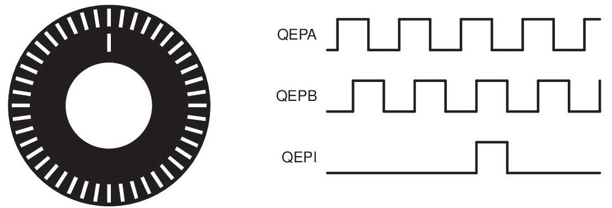

To derive direction information, the lines on the disk are read out by two different photo-elements that "look" at the disk pattern with a mechanical shift of 1/4 the pitch of a line pair between them. This shift is detected with a reticle or mask that restricts the view of the photo-element to the desired part of the disk lines. As the disk rotates, the two photo-elements generate signals that are shifted \( {90}^{ \circ  } \) out of phase from each other. These are commonly called the quadrature QEPA and QEPB signals. The clockwise direction for most encoders is defined as the QEPA channel going positive before the QEPB channel and vise versa as shown in Figure 17-2.

Figure 17-2. QEP Encoder Output Signal for Forward/Reverse Movement

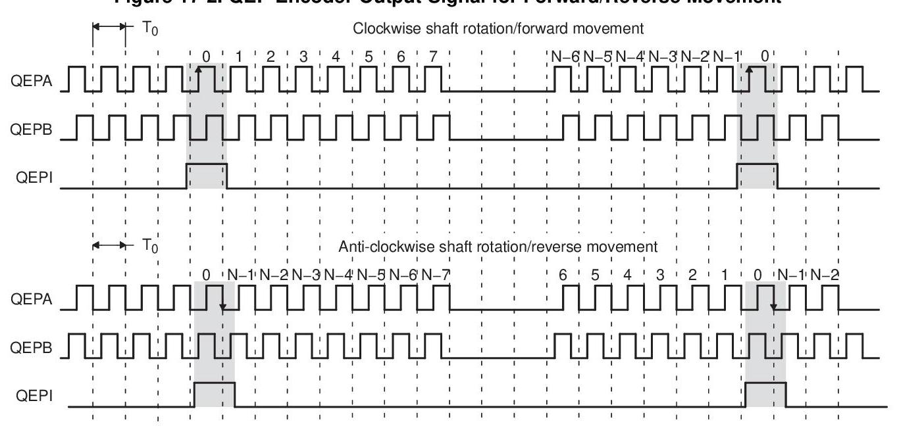

Legend: \( \mathrm{N} = \) lines per revolution

The encoder wheel typically makes one revolution for every revolution of the motor, or the wheel may be at a geared rotation ratio with respect to the motor. Therefore, the frequency of the digital signal coming from the QEPA and QEPB outputs varies proportionally with the velocity of the motor. For example, a 2000-line encoder directly coupled to a motor running at 5000 revolutions per minute (rpm) results in a frequency of 166.6 KHz, so by measuring the frequency of either the QEPA or QEPB output, the processor can determine the velocity of the motor.

Quadrature encoders from different manufacturers come with two forms of index pulse (gated index pulse or ungated index pulse) as shown in Figure 17-3. A nonstandard form of index pulse is ungated. In the ungated configuration, the index edges are not necessarily coincident with A and B signals. The gated index pulse is aligned to any of the four quadrature edges and width of the index pulse and can be equal to a quarter, half, or full period of the quadrature signal.

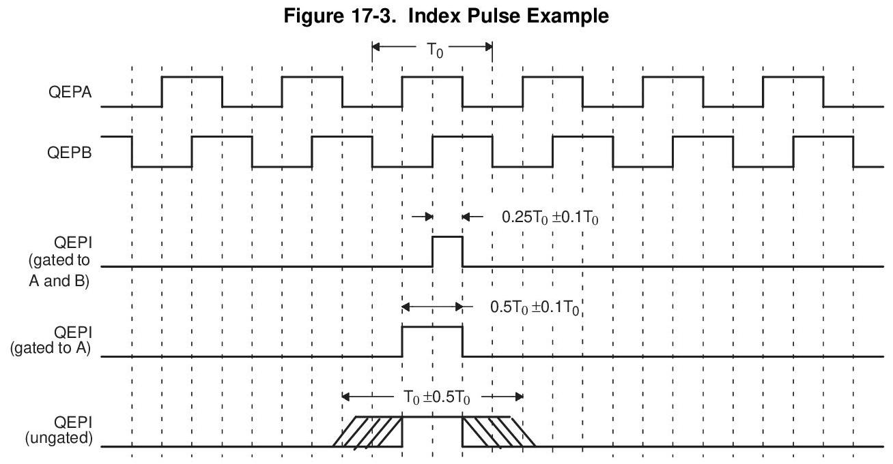

Some typical applications of shaft encoders include robotics and computer input in the form of a mouse. Inside your mouse you can see where the mouse ball spins a pair of axles (a left/right, and an up/down axle). These axles are connected to optical shaft encoders that effectively tell the computer how fast and in what direction the mouse is moving.

General Issues: Estimating velocity from a digital position sensor is a cost-effective strategy in motor control. Two different first order approximations for velocity may be written as:

\[
\begin{aligned}  & v\left( k\right)  \approx  \frac{x\left( k\right)  - x\left( {k - 1}\right) }{T} = \frac{\Delta X}{T} \\  & v\left( k\right)  \approx  \frac{X}{t\left( k\right)  - t\left( {k - 1}\right) } = \frac{X}{\Delta T} \end{aligned}
\]

(2) (3)

where

v(k): Velocity at time instant k

x(k): Position at time instant k

x(k-1): Position at time instant k-1

T: Fixed unit time or inverse of velocity calculation rate

\( \Delta \mathrm{X} \) : Incremental position movement in unit time

t(k): Time instant "k"

t(k-1): Time instant "k-1"

X: Fixed unit position

\( \Delta \mathrm{T} \) : Incremental time elapsed for unit position movement.

Equation 2 is the conventional approach to velocity estimation and it requires a time base to provide a unit time event for velocity calculation. Unit time is basically the inverse of the velocity calculation rate.

The encoder count (position) is read once during each unit time event. The quantity [x(k) - x(k-1)] is formed by subtracting the previous reading from the current reading. Then the velocity estimate is computed by multiplying by the known constant 1/T (where T is the constant time between unit time events and is known in advance).

Estimation based on Equation 2 has an inherent accuracy limit directly related to the resolution of the position sensor and the unit time period T. For example, consider a 500-line per revolution quadrature encoder with a velocity calculation rate of 400 Hz. When used for position, the quadrature encoder gives a four-fold increase in resolution; in this case, 2000 counts per revolution. The minimum rotation that can be detected is therefore 0.0005 revolutions, which gives a velocity resolution of 12 rpm when sampled at 400 Hz. While this resolution may be satisfactory at moderate or high speeds, for example 1% error at 1200 rpm, it would clearly prove inadequate at low speeds. In fact, at speeds below 12 rpm, the speed estimate would erroneously be zero much of the time.

At low speed, Equation 3 provides a more accurate approach. It requires a position sensor that outputs a fixed interval pulse train, such as the aforementioned quadrature encoder. The width of each pulse is defined by motor speed for a given sensor resolution. Equation 3 can be used to calculate motor speed by measuring the elapsed time between successive quadrature pulse edges. However, this method suffers from the opposite limitation, as does Equation 2. A combination of relatively large motor speeds and high sensor resolution makes the time interval \( \Delta \mathrm{T} \) small, and thus more greatly influenced by the timer resolution. This can introduce considerable error into high-speed estimates.

For systems with a large speed range (that is, speed estimation is needed at both low and high speeds), one approach is to use Equation 3 at low speed and have the DSP software switch over to Equation 2 when the motor speed rises above some specified threshold.

### 17.2 Configuring Device Pins

The GPIO mux registers must be configured to connect this peripheral to the device pins. To avoid glitches on the pins, the GPyGMUX bits must be configured first (while keeping the corresponding GPyMUX bits at the default of zero), followed by writing the GPyMUX register to the desired value.

For proper operation of the eQEP module, input GPIO pins must be configured via the GPxQSELn registers for synchronous input mode (with or without qualification). The asynchronous mode should not be used for eQEP input pins. The internal pullups can be configured in the GPyPUD register.

See the GPIO chapter for more details on GPIO mux and settings.

### 17.3 Description

This section provides the eQEP inputs, memory map, and functional description.

#### 17.3.1 EQEP Inputs

The eQEP inputs include two pins for quadrature-clock mode or direction-count mode, an index (or 0 marker), and a strobe input. The eQEP module requires that the QEPA, QEPB, and QEPI inputs are synchronized to SYSCLK prior to entering the module. The application code should enable the synchronous GPIO input feature on any eQEP-enabled GPIO pins (see the General-Purpose Input/Output (GPIO) chapter for more details).

- QEPA/XCLK and QEPB/XDIR

These two pins can be used in quadrature-clock mode or direction-count mode.

- Quadrature-clock Mode

The eQEP encoders provide two square wave signals (A and B) 90 electrical degrees out of phase. This phase relationship is used to determine the direction of rotation of the input shaft and number of eQEP pulses from the index position to derive the relative position information. For forward or clockwise rotation, QEPA signal leads QEPB signal and vice versa. The quadrature decoder uses these two inputs to generate quadrature-clock and direction signals.

- Direction-count Mode

In direction-count mode, direction and clock signals are provided directly from the external source. Some position encoders have this type of output instead of quadrature output. The QEPA pin provides the clock input and the QEPB pin provides the direction input.

- QEPI: Index or Zero Marker

The eQEP encoder uses an index signal to assign an absolute start position from which position information is incrementally encoded using quadrature pulses. This pin is connected to the index output of the eQEP encoder to optionally reset the position counter for each revolution. This signal can be used to initialize or latch the position counter on the occurrence of a desired event on the index pin.

- QEPS: Strobe Input

This general-purpose strobe signal can initialize or latch the position counter on the occurrence of a desired event on the strobe pin. This signal is typically connected to a sensor or limit switch to notify that the motor has reached a defined position.

#### 17.3.2 Functional Description

The eQEP peripheral contains the following major functional units (as shown in Figure 17-4):

- Programmable input qualification for each pin (part of the GPIO MUX)

- Quadrature decoder unit (QDU)

- Position counter and control unit for position measurement (PCCU)

- Quadrature edge-capture unit for low-speed measurement (QCAP)

- Unit time base for speed/frequency measurement (UTIME)

- Watchdog timer for detecting stalls (QWDOG)

Figure 17-4. Functional Block Diagram of the eQEP Peripheral

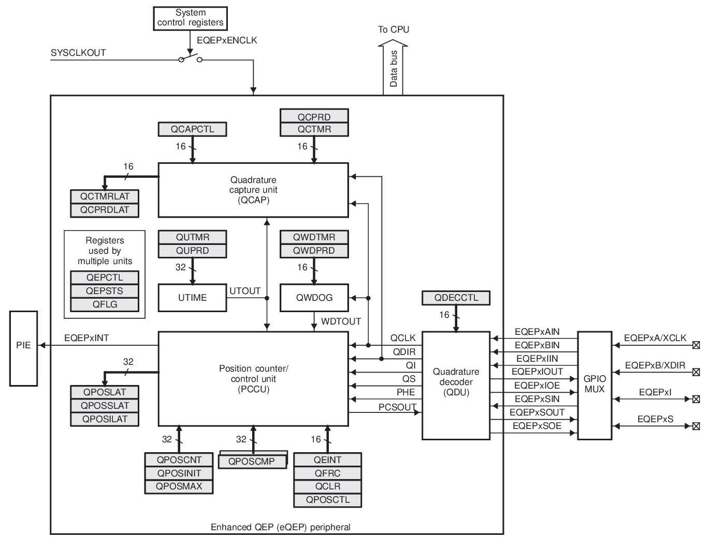

#### 17.3.3 eQEP Memory Map

Table 17-1 lists the registers with their memory locations, sizes, and reset values.

Table 17-1. EQEP Memory Map

<table><tr><td>Name</td><td>Offset</td><td>Size(x16)/ #shadow</td><td>Reset</td><td>Register Description</td></tr><tr><td>QPOSCNT</td><td>0x00</td><td>2/0</td><td>0x00000000</td><td>eQEP Position Counter</td></tr><tr><td>QPOSINIT</td><td>0x02</td><td>2/0</td><td>0x00000000</td><td>eQEP Initialization Position Count</td></tr><tr><td>QPOSMAX</td><td>0x04</td><td>2/0</td><td>0x00000000</td><td>eQEP Maximum Position Count</td></tr><tr><td>QPOSCMP</td><td>0x06</td><td>2/1</td><td>0x00000000</td><td>eQEP Position-compare</td></tr><tr><td>QPOSILAT</td><td>0x08</td><td>2/0</td><td>0x00000000</td><td>eQEP Index Position Latch</td></tr><tr><td>QPOSSLAT</td><td>0x0A</td><td>2/0</td><td>0x00000000</td><td>eQEP Strobe Position Latch</td></tr><tr><td>QPOSLAT</td><td>0x0C</td><td>2/0</td><td>0x00000000</td><td>eQEP Position Latch</td></tr><tr><td>QUTMR</td><td>0x0E</td><td>2/0</td><td>0x00000000</td><td>QEP Unit Timer</td></tr><tr><td>QUPRD</td><td>0x10</td><td>2/0</td><td>0x00000000</td><td>eQEP Unit Period Register</td></tr><tr><td>QWDTMR</td><td>0x12</td><td>1/0</td><td>0x0000</td><td>eQEP Watchdog Timer</td></tr><tr><td>QWDPRD</td><td>0x13</td><td>1/0</td><td>0x0000</td><td>eQEP Watchdog Period Register</td></tr><tr><td>QDECCTL</td><td>0x14</td><td>1/0</td><td>0x0000</td><td>eQEP Decoder Control Register</td></tr><tr><td>QEPCTL</td><td>0x15</td><td>1/0</td><td>0x0000</td><td>eQEP Control Register</td></tr><tr><td>QCAPCTL</td><td>0x16</td><td>1/0</td><td>0x0000</td><td>eQEP Capture Control Register</td></tr><tr><td>QPOSCTL</td><td>0x17</td><td>1/0</td><td>0x00000</td><td>eQEP Position-compare Control Register</td></tr><tr><td>QEINT</td><td>0x18</td><td>1/0</td><td>0x0000</td><td>eQEP Interrupt Enable Register</td></tr><tr><td>QFLG</td><td>0x19</td><td>1/0</td><td>0x0000</td><td>eQEP Interrupt Flag Register</td></tr><tr><td>QCLR</td><td>0x1A</td><td>1/0</td><td>0x0000</td><td>eQEP Interrupt Clear Register</td></tr><tr><td>QFRC</td><td>0x1B</td><td>1/0</td><td>0x0000</td><td>eQEP Interrupt Force Register</td></tr><tr><td>QEPSTS</td><td>0x1C</td><td>1/0</td><td>0x0000</td><td>eQEP Status Register</td></tr><tr><td>QCTMR</td><td>0x1D</td><td>1/0</td><td>0x0000</td><td>eQEP Capture Timer</td></tr><tr><td>QCPRD</td><td>0x1E</td><td>1/0</td><td>0x0000</td><td>eQEP Capture Period Register</td></tr><tr><td>QCTMRLAT</td><td>0x1F</td><td>1/0</td><td>0x0000</td><td>eQEP Capture Timer Latch</td></tr><tr><td>QCPRDLAT</td><td>0x20</td><td>1/0</td><td>0x0000</td><td>eQEP Capture Period Latch</td></tr><tr><td>reserved</td><td>0x21 to 0x3F</td><td>31/0</td><td></td><td></td></tr></table>

### 17.4 Quadrature Decoder Unit (QDU)

Figure 17-5 shows a functional block diagram of the QDU.

Figure 17-5. Functional Block Diagram of Decoder Unit

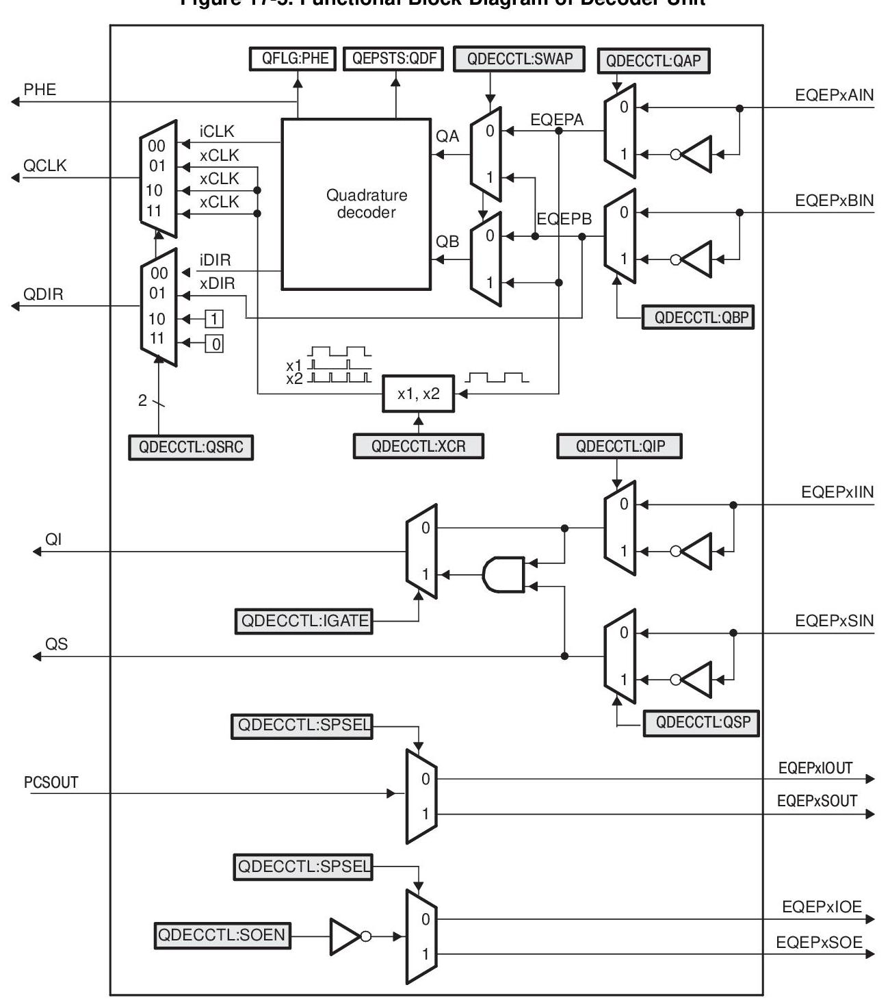

#### 17.4.1 Position Counter Input Modes

Clock and direction input to the position counter is selected using QDECCTL[QSRC] bits, based on interface input requirement as follows:

- Quadrature-count mode

- Direction-count mode

- UP-count mode

- DOWN-count mode

##### 17.4.1.1 Quadrature Count Mode

The quadrature decoder generates the direction and clock to the position counter in quadrature count mode.

Direction Decoding- The direction decoding logic of the eQEP circuit determines which one of the sequences (QEPA, QEPB) is the leading sequence and accordingly updates the direction information in the QEPSTS[QDF] bit. Table 17-2 and Figure 17-6 show the direction decoding logic in truth table and state machine form. Both edges of the QEPA and QEPB signals are sensed to generate count pulses for the position counter. Therefore, the frequency of the clock generated by the eQEP logic is four times that of each input sequence. Figure 17-7 shows the direction decoding and clock generation from the eQEP input signals.

Table 17-2. Quadrature Decoder Truth Table

<table><tr><td colspan="4">.</td></tr><tr><td>Previous Edge</td><td>Present Edge</td><td>QDIR</td><td>QPOSCNT</td></tr><tr><td>QA↑</td><td>QB↑</td><td>UP</td><td>Increment</td></tr><tr><td></td><td>QB↓</td><td>DOWN</td><td>Decrement</td></tr><tr><td></td><td>QA↓</td><td>TOGGLE</td><td>Increment or Decrement</td></tr><tr><td>QA!</td><td>QB↓</td><td>UP</td><td>Increment</td></tr><tr><td></td><td>QB↑</td><td>DOWN</td><td>Decrement</td></tr><tr><td></td><td>QA↑</td><td>TOGGLE</td><td>Increment or Decrement</td></tr><tr><td>QB↑</td><td>QA↑</td><td>DOWN</td><td>Increment</td></tr><tr><td></td><td>QA↓</td><td>UP</td><td>Decrement</td></tr><tr><td></td><td>QB↓</td><td>TOGGLE</td><td>Increment or Decrement</td></tr><tr><td>QB↓</td><td>QA!</td><td>DOWN</td><td>Increment</td></tr><tr><td></td><td>QA↑</td><td>UP</td><td>Decrement</td></tr><tr><td></td><td>QB↑</td><td>TOGGLE</td><td>Increment or Decrement</td></tr></table>

Figure 17-6. Quadrature Decoder State Machine

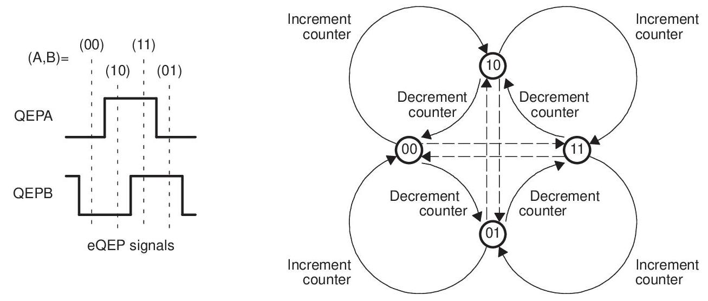

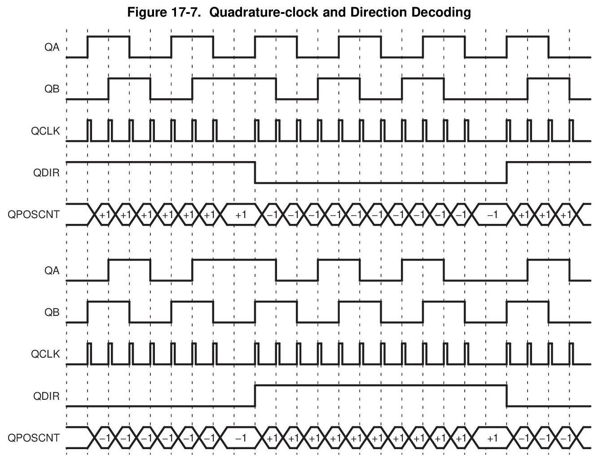

Phase Error Flag- In normal operating conditions, quadrature inputs QEPA and QEPB will be 90 degrees out of phase. The phase error flag (PHE) is set in the QFLG register and the QPOSCNT value can be incorrect and offset by multiples of 1 or 3 . That is, when edge transition is detected simultaneously on the QEPA and QEPB signals to optionally generate interrupts. State transitions marked by dashed lines in Figure 17-6 are invalid transitions that generate a phase error.

Count Multiplication- The eQEP position counter provides 4x times the resolution of an input clock by generating a quadrature-clock (QCLK) on the rising/falling edges of both eQEP input clocks (QEPA and QEPB) as shown in Figure 17-7 .

Reverse Count- In normal quadrature count operation, QEPA input is fed to the QA input of the quadrature decoder and the QEPB input is fed to the QB input of the quadrature decoder. Reverse counting is enabled by setting the SWAP bit in the QDECCTL register. This will swap the input to the quadrature decoder, thereby reversing the counting direction.

##### 17.4.1.2 Direction-Count Mode

Some position encoders provide direction and clock outputs, instead of quadrature outputs. In such cases, direction-count mode can be used. QEPA input will provide the clock for the position counter and the QEPB input will have the direction information. The position counter is incremented on every rising edge of a QEPA input when the direction input is high, and decremented when the direction input is low.

##### 17.4.1.3 Up-Count Mode

The counter direction signal is hard-wired for up-count and the position counter is used to measure the frequency of the QEPA input. Clearing the QDECCTL[XCR] bit enables clock generation to the position counter on both edges of the QEPA input, thereby increasing the measurement resolution by a factor of 2x. In up-count mode, it is recommended that the application not configure QEPB as a GPIO mux option, or ensure that a signal edge is not generated on the QEPB input.

##### 17.4.1.4 Down-Count Mode

The counter direction signal is hardwired for a down-count and the position counter is used to measure the frequency of the QEPA input. Setting the QDECCTL[XCR] bit enables clock generation to the position counter on both edges of a QEPA input, thereby increasing the measurement resolution by a factor of 2x. In down-count mode, it is recommended that the application not configure QEPB as a GPIO mux option, or ensure that a signal edge is not generated on the QEPB input.

#### 17.4.2 eQEP Input Polarity Selection

Each eQEP input can be inverted using QDECCTL[8:5] control bits. As an example, setting the QDECCTL[QIP] bit will invert the index input.

#### 17.4.3 Position-Compare Sync Output

The enhanced eQEP peripheral includes a position-compare unit that is used to generate the position-compare sync signal on compare match between the position-counter register (QPOSCNT) and the position- compare register (QPOSCMP). This sync signal can be output using an index pin or strobe pin of the EQEP peripheral.

Setting the QDECCTL[SOEN] bit enables the position-compare sync output and the QDECCTL[SPSEL] bit selects either an eQEP index pin or an eQEP strobe pin.

### 17.5 Position Counter and Control Unit (PCCU)

The position-counter and control unit provides two configuration registers (QEPCTL and QPOSCTL) for setting up position-counter operational modes, position-counter initialization/latch modes and position-compare logic for sync signal generation.

#### 17.5.1 Position Counter Operating Modes

Position-counter data may be captured in different manners. In some systems, the position counter is accumulated continuously for multiple revolutions and the position-counter value provides the position information with respect to the known reference. An example of this is the quadrature encoder mounted on the motor controlling the print head in the printer. Here the position counter is reset by moving the print head to the home position and then the position counter provides absolute position information with respect to home position.

In other systems, the position counter is reset on every revolution using index pulse, and the position counter provides a rotor angle with respect to the index pulse position.

The position counter can be configured to operate in following four modes

- Position-Counter Reset on Index Event

- Position-Counter Reset on Maximum Position

- Position-Counter Reset on the first Index Event

- Position-Counter Reset on Unit Time Out Event (Frequency Measurement)

In all the above operating modes, the position counter is reset to 0 on overflow and to the QPOSMAX register value on underflow. Overflow occurs when the position counter counts up after the QPOSMAX value. Underflow occurs when the position counter counts down after "0". The Interrupt flag is set to indicate overflow/underflow in QFLG register.

##### 17.5.1.1 Position Counter Reset on Index Event (QEPCTL[PCRM]=00)

If the index event occurs during the forward movement, then the position counter is reset to 0 on the next eQEP. If the index event occurs during the reverse movement, then the position counter is reset to the value in the QPOSMAX register on the next eQEP clock.

First index marker is defined as the quadrature edge following the first index edge. The eQEP peripheral records the occurrence of the first index marker (QEPSTS[FIMF]) and direction on the first index event marker (QEPSTS[FIDF]) in QEPSTS registers, it also remembers the quadrature edge on the first index marker so that same relative quadrature transition is used for index event reset operation.

For example, if the first reset operation occurs on the falling edge of QEPB during the forward direction, then all the subsequent reset must be aligned with the falling edge of QEPB for the forward rotation and on the rising edge of QEPB for the reverse rotation as shown in Figure 17-8.

The position-counter value is latched to the QPOSILAT register and direction information is recorded in the QEPSTS[QDLF] bit on every index event marker. The position-counter error flag (QEPSTS[PCEF]) and error interrupt flag (QFLG[PCE]) are set if the latched value is not equal to 0 or QPOSMAX. The position-counter error flag (QEPSTS[PCEF]) is updated on every index event marker and an interrupt flag (QFLG[PCE]) will be set on error that can be cleared only through software.

The index event latch configuration QEPCTL[IEL] must be configured to '00' or '11' when pcrm=0 and the position counter error flag/interrupt flag are generated only in index event reset mode. The position counter value is latched into the IPOSLAT register on every index marker.

Figure 17-8. Position Counter Reset by Index Pulse for 1000 Line Encoder (QPOSMAX = 3999 or 0xF9F)

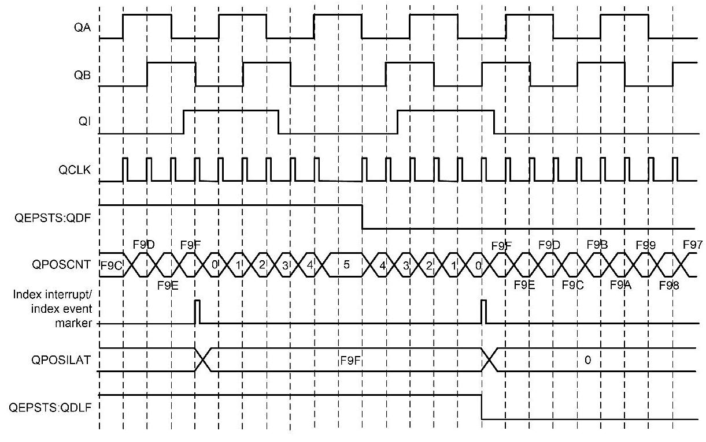

NOTE: In case of boundary condition where time period between Index Event and previous QCLK edge is less than SYSCLK period, then QPOSCNT gets reset to zero or QPOSMAX in the same SYSCLK cycle and does not wait for next QCLK edge to occur.

##### 17.5.1.2 Position Counter Reset on Maximum Position (QEPCTL[PCRM]=01)

If the position counter is equal to QPOSMAX, then the position counter is reset to 0 on the next eQEP clock for forward movement and position counter overflow flag is set. If the position counter is equal to ZERO, then the position counter is reset to QPOSMAX on the next QEP clock for reverse movement and position-counter underflow flag is set. Figure 17-9 shows the position-counter reset operation in this mode.

The first index marker fields (QEPSTS[FIDF] and QEPSTS[FIMF]) are not applicable in this mode.

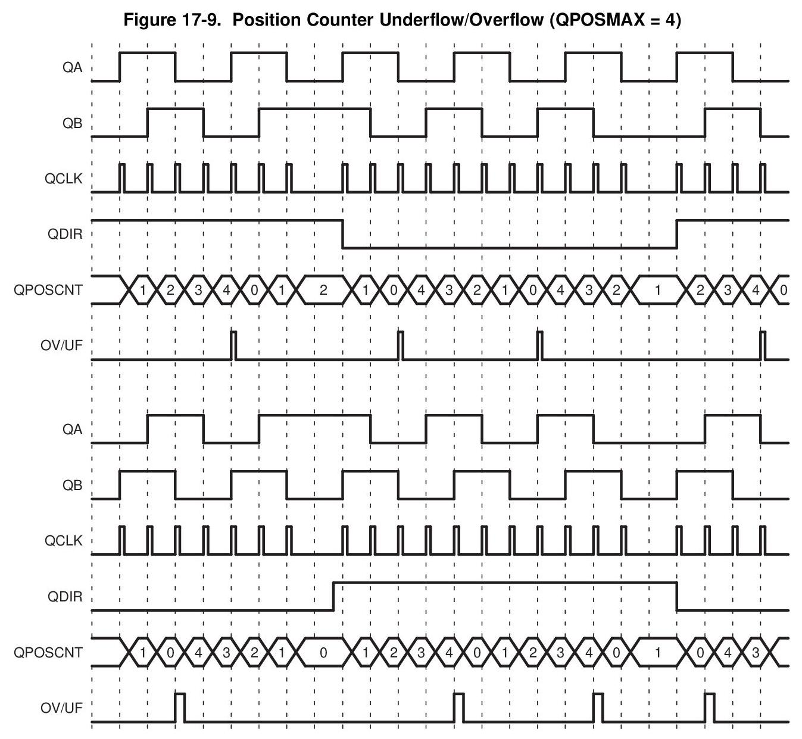

##### 17.5.1.3 Position Counter Reset on the First Index Event (QEPCTL[PCRM] = 10)

If the index event occurs during forward movement, then the position counter is reset to 0 on the next eQEP clock. If the index event occurs during the reverse movement, then the position counter is reset to the value in the QPOSMAX register on the next eQEP clock. Note that this is done only on the first occurrence and subsequently the position-counter value is not reset on an index event; rather, it is reset based on maximum position as described in Section 17.5.1.2.

The first index marker fields (QEPSTS[FIDF] and QEPSTS[FIMF]) are not applicable in this mode.

##### 17.5.1.4 Position Counter Reset on Unit Time out Event (QEPCTL[PCRM] = 11)

In this mode, QPOSCNT is set to 0 or QPOMAX, depending on the direction mode selected by QDECCTL[QSRC] bits on a unit time event. This is useful for frequency measurement.

#### 17.5.2 Position Counter Latch

The eQEP index and strobe input can be configured to latch the position counter (QPOSCNT) into QPOSILAT and QPOSSLAT, respectively, on occurrence of a definite event on these pins.

##### 17.5.2.1 Index Event Latch

In some applications, it may not be desirable to reset the position counter on every index event and instead it may be required to operate the position counter in full 32-bit mode (QEPCTL[PCRM] = 01 and QEPCTL[PCRM] = 10 modes).

In such cases, the eQEP position counter can be configured to latch on the following events and direction information is recorded in the QEPSTS[QDLF] bit on every index event marker.

- Latch on Rising edge (QEPCTL[IEL]=01)

- Latch on Falling edge (QEPCTL[IEL]=10)

- Latch on Index Event Marker (QEPCTL[IEL]=11)

This is particularly useful as an error checking mechanism to check if the position counter accumulated the correct number of counts between index events. As an example, the 1000-line encoder must count 4000 times when moving in the same direction between the index events.

The index event latch interrupt flag (QFLG[IEL]) is set when the position counter is latched to the QPOSILAT register. The index event latch configuration bits (QEPCTZ[IEL]) are ignored when QEPCTL[PCRM] = 00.

Latch on Rising Edge (QEPCTL[IEL]=01)— The position-counter value (QPOSCNT) is latched to the QPOSILAT register on every rising edge of an index input.

Latch on Falling Edge (QEPCTL[IEL] = 10)— The position-counter value (QPOSCNT) is latched to the QPOSILAT register on every falling edge of index input.

Latch on Index Event Marker/Software Index Marker (QEPCTL[IEL] = 11- The first index marker is defined as the quadrature edge following the first index edge. The eQEP peripheral records the occurrence of the first index marker (QEPSTS[FIMF]) and direction on the first index event marker (QEPSTS[FIDF]) in the QEPSTS registers. It also remembers the quadrature edge on the first index marker so that same relative quadrature transition is used for latching the position counter (QEPCTL[IEL]=11).

Figure 17-10 shows the position counter latch using an index event marker.

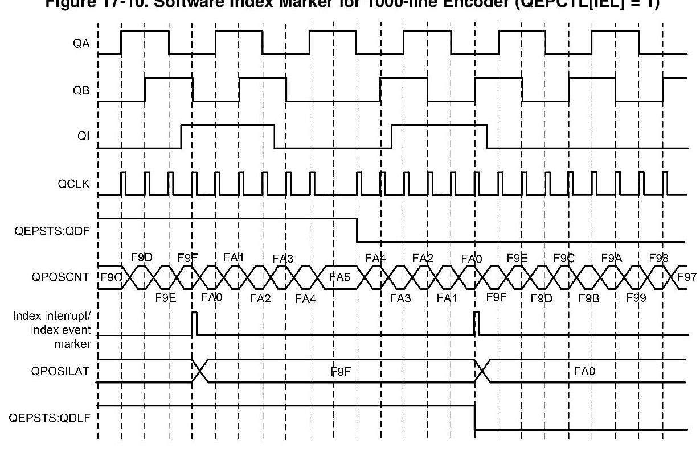

Figure 17-10. Software Index Marker for 1000-line Encoder (QEPCTL[IEL] = 1)

##### 17.5.2.2 Strobe Event Latch

The position-counter value is latched to the QPOSSLAT register on the rising edge of the strobe input by clearing the QEPCTL[SEL] bit.

If the QEPCTL[SEL] bit is set, then the position-counter value is latched to the QPOSSLAT register on the rising edge of the strobe input for forward direction, and on the falling edge of the strobe input for reverse direction as shown in Figure 17-11.

The strobe event latch interrupt flag (QFLG[SEL) is set when the position counter is latched to the QPOSSLAT register.

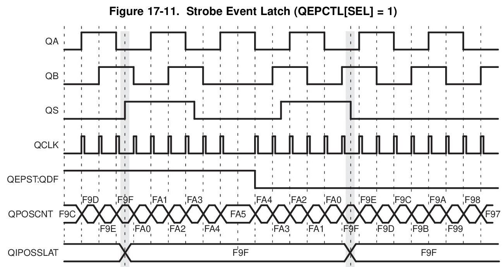

#### 17.5.3 Position Counter Initialization

The position counter can be initialized using following events:

- Index event

- Strobe event

- Software initialization

Index Event Initialization (IEI) The QEPI index input can be used to trigger the initialization of the position counter at the rising or falling edge of the index input. If the QEPCTL[IEI] bits are 10, then the position counter (QPOSCNT) is initialized with a value in the QPOSINIT register on the rising edge of index input. Conversely, if the QEPCTL[IEI] bits are 11, initialization will be on the falling edge of the index input.

Strobe Event Initialization (SEI)— If the QEPCTL[SEI] bits are 10, then the position counter is initialized with a value in the QPOSINIT register on the rising edge of strobe input.

If QEPCTL[SEL] bits are 11, then the position counter is initialized with a value in the QPOSINIT register on the rising edge of strobe input for forward direction and on the falling edge of strobe input for reverse direction.

Software Initialization (SWI) - The position counter can be initialized in software by writing a 1 to the QEPCTL[SWI] bit. This bit is not automatically cleared. While the bit is still set, if a 1 is written to it again, the position counter will be re-initialized.

#### 17.5.4 eQEP Position-compare Unit

The eQEP peripheral includes a position-compare unit that is used to generate a sync output and/or interrupt on a position-compare match. Figure 17-12 shows a diagram. The position-compare (QPOSCMP) register is shadowed and shadow mode can be enabled or disabled using the QPOSCTL[PSSHDW] bit. If the shadow mode is not enabled, the CPU writes directly to the active position compare register.

Figure 17-12. eQEP Position-compare Unit

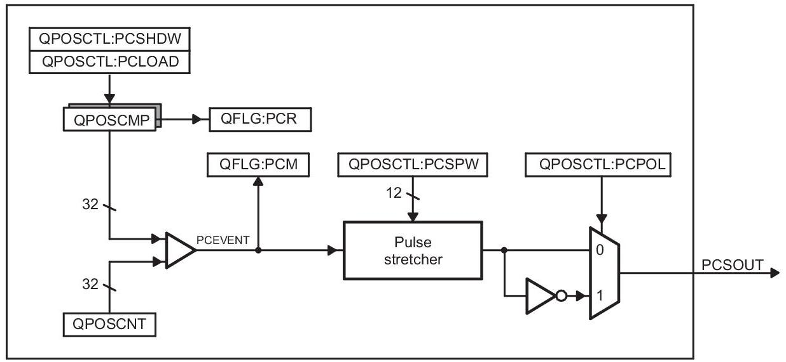

In shadow mode, you can configure the position-compare unit (QPOSCTL[PCLOAD]) to load the shadow register value into the active register on the following events, and to generate the position-compare ready (QFLG[PCR]) interrupt after loading.

- Load on compare match

- Load on position-counter zero event

The position-compare match (QFLG[PCM]) is set when the position-counter value (QPOSCNT) matches with the active position-compare register (QPOSCMP) and the position-compare sync output of the programmable pulse width is generated on compare-match to trigger an external device.

For example, if QPOSCMP = 2, the position-compare unit generates a position-compare event on 1 to 2 transitions of the eQEP position counter for forward counting direction and on 3 to 2 transitions of the eQEP position counter for reverse counting direction (see Figure 17-13).

See the register section for the layout of the eQEP Position-Compare Control Register (QPOSCTL) and description of the QPOSCTL bit fields.

Figure 17-13. eQEP Position-compare Event Generation Points

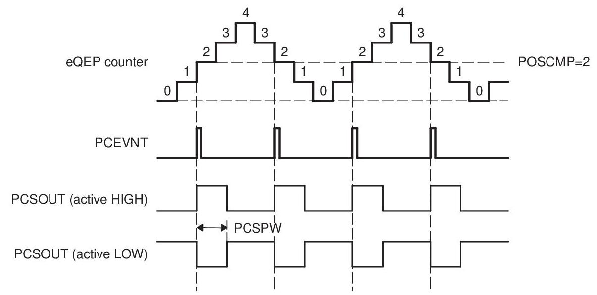

The pulse stretcher logic in the position-compare unit generates a programmable position-compare sync pulse output on the position-compare match. In the event of a new position-compare match while a previous position-compare pulse is still active, then the pulse stretcher generates a pulse of specified duration from the new position-compare event as shown in Figure 17-14.

Figure 17-14. eQEP Position-compare Sync Output Pulse Stretcher

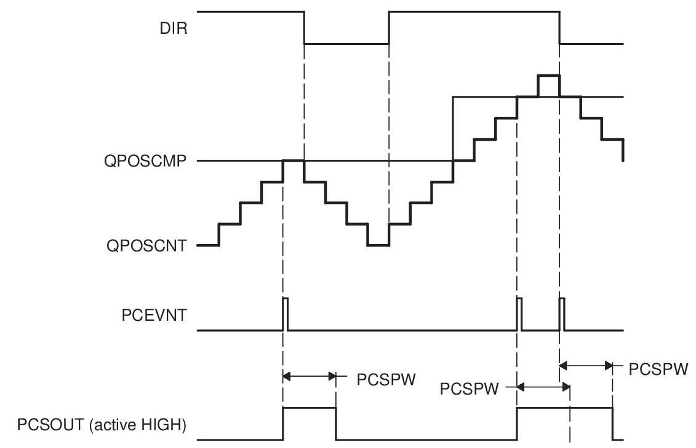

### 17.6 eQEP Edge Capture Unit

The eQEP peripheral includes an integrated edge capture unit to measure the elapsed time between the unit position events as shown in Figure 17-15. This feature is typically used for low speed measurement using the following equation:

\[
v\left( k\right)  = \frac{X}{t\left( k\right)  - t\left( {k - 1}\right) } = \frac{X}{\Delta T} \tag{4}
\]

where,

- X - Unit position is defined by integer multiple of quadrature edges (see Figure 17-16)

- \( \Delta \mathrm{T} \) - Elapsed time between unit position events

- v(k) - Velocity at time instant "k"

The eQEP capture timer (QCTMR) runs from prescaled SYSCLKOUT and the prescaler is programmed by the QCAPCTL[CCPS] bits. The capture timer (QCTMR) value is latched into the capture period register (QCPRD) on every unit position event and then the capture timer is reset, a flag is set in QEPSTS:UPEVNT to indicate that new value is latched into the QCPRD register. Software can check this status flag before reading the period register for low speed measurement, and clear the flag by writing 1.

Time measurement (ΔT) between unit position events will be correct if the following conditions are met:

- No more than 65,535 counts have occurred between unit position events.

- No direction change between unit position events.

The capture unit sets the eQEP overflow error flag (QEPSTS[COEF]) in the event of capture timer overflow between unit position events. If a direction change occurs between the unit position events, then an error flag is set in the status register (QEPSTS[CDEF]).

The Capture Timer (QCTMR) and Capture Period register (QCPRD) can be configured to latch on following events.

- CPU read of QPOSCNT register

- Unit time-out event

If the QEPCTL[QCLM] bit is cleared, then the capture timer and capture period values are latched into the QCTMRLAT and QCPRDLAT registers, respectively, when the CPU reads the position counter (QPOSCNT).

If the QEPCTL[QCLM] bit is set, then the position counter, capture timer, and capture period values are latched into the QPOSLAT, QCTMRLAT and QCPRDLAT registers, respectively, on unit time out.

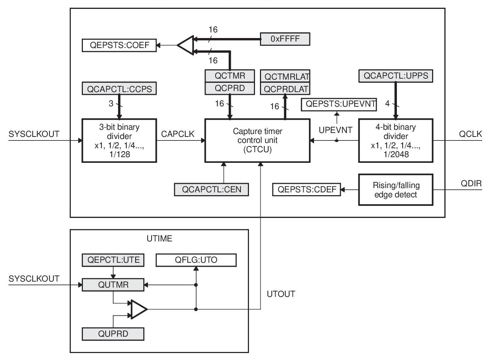

NOTE: The QCAPCTL[UPPS] prescaler should not be modified dynamically (such as switching the unit event prescaler from QCLK/4 to QCLK/8). Doing so may result in undefined behavior. The QCAPCTL[CPPS] prescaler can be modified dynamically (such as switching CAPCLK prescaling mode from SYSCLK/4 to SYSCLK/8) only after the capture unit is disabled.

Figure 17-16. Unit Position Event for Low Speed Measurement (QCAPCTL[UPPS] = 0010)

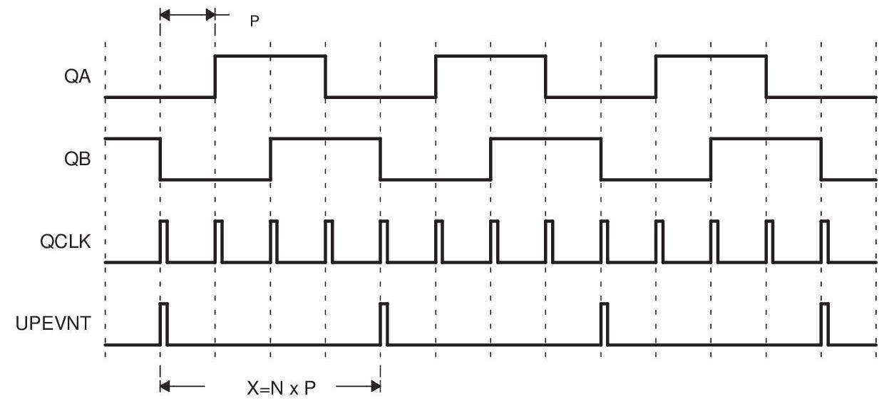

A N - Number of quadrature periods selected using QCAPCTL[UPPS] bits

Figure 17-17. eQEP Edge Capture Unit - Timing Details

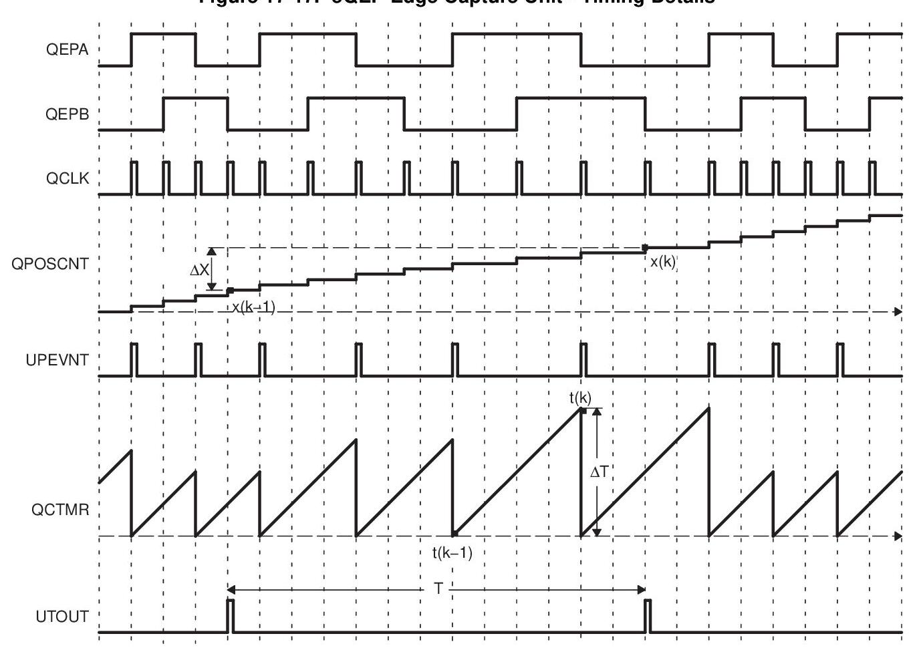

Velocity calculation equations:

\[
v\left( k\right)  = \frac{x\left( k\right)  - x\left( {k - 1}\right) }{T} = \frac{\Delta X}{T}o \tag{5}
\]

where

v(k): Velocity at time instant k

x(k): Position at time instant k

x(k-1): Position at time instant k-1

T: Fixed unit time or inverse of velocity calculation rate

\( \Delta \mathrm{X} \) : Incremental position movement in unit time

X: Fixed unit position

ΔT: Incremental time elapsed for unit position movement

t(k): Time instant "k"

t(k-1): Time instant "k-1"

Unit time (T) and unit period(X) are configured using the QUPRD and QCAPCTL[UPPS] registers. Incremental position output and incremental time output is available in the QPOSLAT and QCPRDLAT registers.

<table><tr><td>Parameter</td><td>Relevant Register to Configure or Read the Information</td></tr><tr><td>T</td><td>Unit Period Register (QUPRD)</td></tr><tr><td>\( \Delta \mathrm{X} \)</td><td>Incremental Position = QPOSLAT(k) - QPOSLAT(K-1)</td></tr><tr><td>X</td><td>Fixed unit position defined by sensor resolution and ZCAPCTL[UPPS] bits</td></tr><tr><td>\( \Delta \mathrm{T} \)</td><td>Capture Period Latch (QCPRDLAT)</td></tr></table>

### 17.7 eQEP Watchdog

The eQEP peripheral contains a 16-bit watchdog timer that monitors the quadrature-clock to indicate proper operation of the motion-control system. The eQEP watchdog timer is clocked from SYSCLKOUT/64 and the quadrate clock event (pulse) resets the watchdog timer. If no quadrature-clock event is detected until a period match (QWDPRD = QWDTMR), then the watchdog timer will time out and the watchdog interrupt flag will be set (QFLG[WTO]). The time-out value is programmable through the watchdog period register (QWDPRD).

Figure 17-18. eQEP Watchdog Timer

### 17.8 Unit Timer Base

The eQEP peripheral includes a 32-bit timer (QUTMR) that is clocked by SYSCLKOUT to generate periodic interrupts for velocity calculations. Whenever the unit timer (QUTMR) matches the unit period register (QUPRD), it resets the unit timer (QUPRD) it resets the unit timer (QUTMR) and also generates the unit time out interrupt flag (QFLG[UTO]). The unit timer gets reset whenever timer value equals to configured period value.

The eQEP peripheral can be configured to latch the position counter, capture timer, and capture period values on a unit time out event so that latched values are used for velocity calculation as described in Section 17.6.

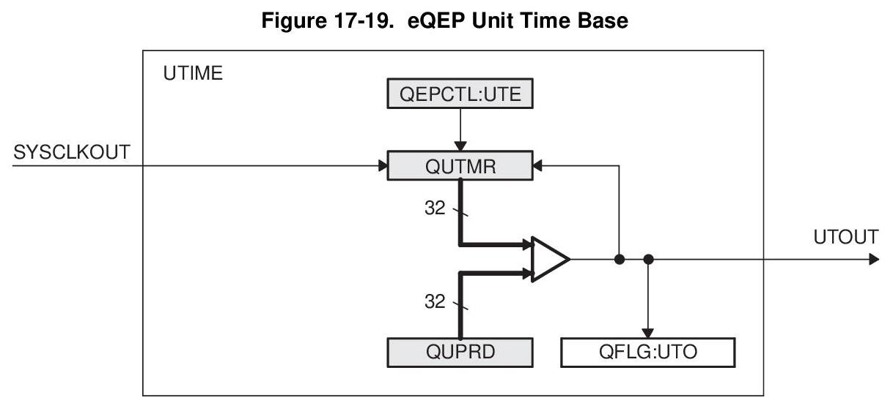

### 17.9 eQEP Interrupt Structure

Figure 17-20 shows how the interrupt mechanism works in the EQEP module.

Figure 17-20. EQEP Interrupt Generation

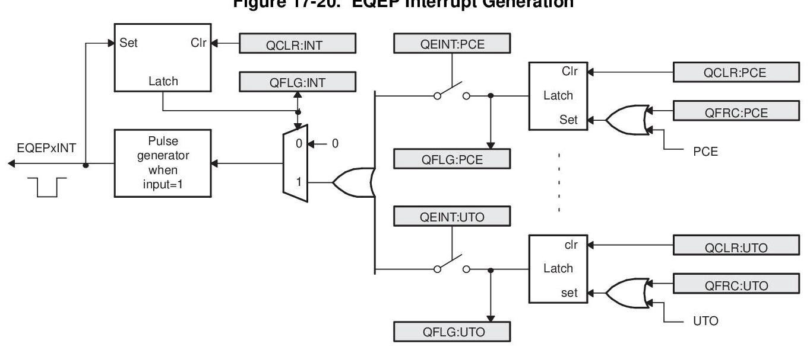

Eleven interrupt events (PCE, PHE, QDC, WTO, PCU, PCO, PCR, PCM, SEL, IEL and UTO) can be generated. The interrupt control register (QEINT) is used to enable/disable individual interrupt event sources. The interrupt flag register (QFLG) indicates if any interrupt event has been latched and contains the global interrupt flag bit (INT).

An Interrupt pulse is generated to PIE when:

a. Interrupt is enabled for eQEP event inside QEINT register

b. Interrupt flag for eQEP event inside QFLG register is set, and

c. Global interrupt status flag bit QFLG[INT] had been cleared for previously generated interrupt event. The interrupt service routine will need to clear the global interrupt flag bit and the serviced event, via the interrupt clear register (QCLR), before any other interrupt pulses are generated.If either flags inside the QFLG register are not cleared, further interrupt event will not generate interrupt to PIE. You can force an interrupt event by way of the interrupt force register (QFRC), which is useful for test purposes.

### 17.10 eQEP Registers

This section describes the Enhanced Quadrature Encoder Pulse Registers.

#### 17.10.1 eQEP Base Addresses

<table><tr><td>Device Registers</td><td>Register Name</td><td>Start Address</td><td>End Address</td></tr><tr><td>EQep1Regs</td><td>EQEP_REGS</td><td>0x0000_5100</td><td>0x0000_513F</td></tr><tr><td>EQep2Regs</td><td>EQEP_REGS</td><td>0x0000_5140</td><td>0x0000_51BF</td></tr><tr><td>EQep3Regs</td><td>EQEP_REGS</td><td>0x0000_5180</td><td>0x0000_51BF</td></tr></table>

#### 17.10.2 EQEP_REGS Registers

Table 17-3 lists the EQEP_REGS registers. All register offset addresses not listed in Table 17-3 should be considered as reserved locations and the register contents should not be modified.

Table 17-3. EQEP_REGS Registers

<table><tr><td>Offset</td><td>Acronym</td><td>Register Name</td><td>Write Protection</td><td>Section</td></tr><tr><td>0h</td><td>QPOSCNT</td><td>Position Counter</td><td></td><td>Go</td></tr><tr><td>2h</td><td>QPOSINIT</td><td>Position Counter Init</td><td></td><td>Go</td></tr><tr><td>4h</td><td>QPOSMAX</td><td>Maximum Position Count</td><td></td><td>Go</td></tr><tr><td>6h</td><td>QPOSCMP</td><td>Position Compare</td><td></td><td>Go</td></tr><tr><td>8h</td><td>QPOSILAT</td><td>Index Position Latch</td><td></td><td>Go</td></tr><tr><td>Ah</td><td>QPOSSLAT</td><td>Strobe Position Latch</td><td></td><td>Go</td></tr><tr><td>Ch</td><td>QPOSLAT</td><td>Position Latch</td><td></td><td>Go</td></tr><tr><td>Eh</td><td>QUTMR</td><td>QEP Unit Timer</td><td></td><td>Go</td></tr><tr><td>10h</td><td>QUPRD</td><td>QEP Unit Period</td><td></td><td>Go</td></tr><tr><td>12h</td><td>QWDTMR</td><td>QEP Watchdog Timer</td><td></td><td>Go</td></tr><tr><td>13h</td><td>QWDPRD</td><td>QEP Watchdog Period</td><td></td><td>Go</td></tr><tr><td>14h</td><td>QDECCTL</td><td>Quadrature Decoder Control</td><td></td><td>Go</td></tr><tr><td>15h</td><td>QEPCTL</td><td>QEP Control</td><td></td><td>Go</td></tr><tr><td>16h</td><td>QCAPCTL</td><td>Qaudrature Capture Control</td><td></td><td>Go</td></tr><tr><td>17h</td><td>QPOSCTL</td><td>Position Compare Control</td><td></td><td>Go</td></tr><tr><td>18h</td><td>QEINT</td><td>QEP Interrupt Control</td><td></td><td>Go</td></tr><tr><td>19h</td><td>QFLG</td><td>QEP Interrupt Flag</td><td></td><td>Go</td></tr><tr><td>1Ah</td><td>QCLR</td><td>QEP Interrupt Clear</td><td></td><td>Go</td></tr><tr><td>1Bh</td><td>QFRC</td><td>QEP Interrupt Force</td><td></td><td>Go</td></tr><tr><td>1Ch</td><td>QEPSTS</td><td>QEP Status</td><td></td><td>Go</td></tr><tr><td>1Dh</td><td>QCTMR</td><td>QEP Capture Timer</td><td></td><td>Go</td></tr><tr><td>1Eh</td><td>QCPRD</td><td>QEP Capture Period</td><td></td><td>Go</td></tr><tr><td>1Fh</td><td>QCTMRLAT</td><td>QEP Capture Latch</td><td></td><td>Go</td></tr><tr><td>20h</td><td>QCPRDLAT</td><td>QEP Capture Period Latch</td><td></td><td>Go</td></tr></table>

Complex bit access types are encoded to fit into small table cells. Table 17-4 shows the codes that are used for access types in this section.

Table 17-4. EQEP_REGS Access Type Codes

<table><tr><td>Access Type</td><td>Code</td><td>Description</td></tr><tr><td colspan="3">Read Type</td></tr><tr><td>R</td><td>R</td><td>Read</td></tr><tr><td>R-0</td><td>R   -0</td><td>Read   Returns 0s</td></tr><tr><td colspan="3">Write Type</td></tr><tr><td>W</td><td>W</td><td>Write</td></tr><tr><td>W1S</td><td>W</td><td>Write</td></tr><tr><td></td><td>1S</td><td>1 to set</td></tr><tr><td colspan="3">Reset or Default Value</td></tr><tr><td>-n</td><td></td><td>Value after reset or the default value</td></tr><tr><td colspan="3">Register Array Variables</td></tr></table>

Table 17-4. EQEP_REGS Access Type Codes (continued)

<table><tr><td>Access Type</td><td>Code</td><td>Description</td></tr><tr><td>i, j, k, l, m, n</td><td></td><td>When these variables are used in a register name, an offset, or an address, they refer to the value of a register array where the register is part of a group of repeating registers. The register groups form a hierarchical structure and the array is represented with a formula.</td></tr><tr><td>y</td><td></td><td>When this variable is used in a register name, an offset, or an address it refers to the value of a register array.</td></tr></table>

17.10.2.1 QPOSCNT Register (Offset = 0h) [reset = 0h]

QPOSCNT is shown in Figure 17-21 and described in Table 17-5.

Return to the Summary Table.

Position Counter

Figure 17-21. QPOSCNT Register

Table 17-5. QPOSCNT Register Field Descriptions

<table><tr><td>Bit</td><td>Field</td><td>Type</td><td>Reset</td><td>Description</td></tr><tr><td>31-0</td><td>QPOSCNT</td><td>R/W</td><td>0h</td><td>Position Counter   This 32-bit position counter register counts up/down on every eQEP pulse based on direction input. This counter acts as a position integrator whose count value is proportional to position from a give reference point. This Register acts as a Read ONLY register while counter is counting up/down.   Note: It is recommended to only write to the position counter register (QPOSCNT) during initialization, i.e. when the eQEP position counter is disabled (QPEN bit of QEPCTL is zero). Once the position counter is enabled (QPEN bit is one), writing to the eQEP position counter register (QPOSCNT) may cause unexpected results.   Reset type: SYSRSn</td></tr></table>

17.10.2.2 QPOSINIT Register (Offset = 2h) [reset = 0h]

QPOSINIT is shown in Figure 17-22 and described in Table 17-6.

Return to the Summary Table.

Position Counter Init

Figure 17-22. QPOSINIT Register

Table 17-6. QPOSINIT Register Field Descriptions

<table><tr><td>Bit</td><td>Field</td><td>Type</td><td>Reset</td><td>Description</td></tr><tr><td>31-0</td><td>QPOSINIT</td><td>R/W</td><td>0h</td><td>Position Counter Init   This register contains the position value that is used to initialize the position counter based on external strobe or index event. The position counter can be initialized through software. Writes to this register should always be full 32-bit writes.   Reset type: SYSRSn</td></tr></table>

17.10.2.3 QPOSMAX Register (Offset = 4h) [reset = 0h]

QPOSMAX is shown in Figure 17-23 and described in Table 17-7.

Return to the Summary Table.

Maximum Position Count

Figure 17-23. QPOSMAX Register

Table 17-7. QPOSMAX Register Field Descriptions

<table><tr><td>Bit</td><td>Field</td><td>Type</td><td>Reset</td><td>Description</td></tr><tr><td>31-0</td><td>QPOSMAX</td><td>R/W</td><td>0h</td><td>Maximum Position Count   This register contains the maximum position counter value. Writes to this register should always be full 32-bit writes.   Reset type: SYSRSn</td></tr></table>

17.10.2.4 QPOSCMP Register (Offset = 6h) [reset = 0h]

QPOSCMP is shown in Figure 17-24 and described in Table 17-8.

Return to the Summary Table.

Position Compare

Figure 17-24. QPOSCMP Register

Table 17-8. QPOSCMP Register Field Descriptions

<table><tr><td>Bit</td><td>Field</td><td>Type</td><td>Reset</td><td>Description</td></tr><tr><td>31-0</td><td>QPOSCMP</td><td>R/W</td><td>0h</td><td>Position Compare   The position-compare value in this register is compared with the position counter (QPOSCNT) to generate sync output and/or interrupt on compare match.   Reset type: SYSRSn</td></tr></table>

17.10.2.5 QPOSILAT Register (Offset = 8h) [reset = 0h]

QPOSILAT is shown in Figure 17-25 and described in Table 17-9.

Return to the Summary Table.

Index Position Latch

Figure 17-25. QPOSILAT Register

Table 17-9. QPOSILAT Register Field Descriptions

<table><tr><td>Bit</td><td>Field</td><td>Type</td><td>Reset</td><td>Description</td></tr><tr><td>31-0</td><td>QPOSILAT</td><td>R</td><td>0h</td><td>Index Position Latch   The position-counter value is latched into this register on an index event as defined by the QEPCTL[IEL] bits.   Reset type: SYSRSn</td></tr></table>

17.10.2.6 QPOSSLAT Register (Offset = Ah) [reset = 0h]

QPOSSLAT is shown in Figure 17-26 and described in Table 17-10.

Return to the Summary Table.

Strobe Position Latch

Figure 17-26. QPOSSLAT Register

Table 17-10. QPOSSLAT Register Field Descriptions

<table><tr><td>Bit</td><td>Field</td><td>Type</td><td>Reset</td><td>Description</td></tr><tr><td>31-0</td><td>QPOSSLAT</td><td>R</td><td>0h</td><td>Strobe Position Latch   The position-counter value is latched into this register on a strobe event as defined by the QEPCTL[SEL] bits.   Reset type: SYSRSn</td></tr></table>

17.10.2.7 QPOSLAT Register (Offset = Ch) [reset = 0h]

QPOSLAT is shown in Figure 17-27 and described in Table 17-11.

Return to the Summary Table.

Position Latch

Figure 17-27. QPOSLAT Register

Table 17-11. QPOSLAT Register Field Descriptions

<table><tr><td>Bit</td><td>Field</td><td>Type</td><td>Reset</td><td>Description</td></tr><tr><td>31-0</td><td>QPOSLAT</td><td>R</td><td>0h</td><td>Position Latch   The position-counter value is latched into this register on a unit time out event.   Reset type: SYSRSn</td></tr></table>

17.10.2.8 QUTMR Register (Offset = Eh) [reset = 0h]

QUTMR is shown in Figure 17-28 and described in Table 17-12.

Return to the Summary Table.

QEP Unit Timer

Figure 17-28. QUTMR Register

<table><tr><td>31</td><td>30</td><td>29</td><td>28</td><td>27</td><td>26</td><td>25</td><td>24</td><td>23</td><td>22</td><td>21</td><td>20</td><td>19</td><td>18</td><td>17</td><td>16</td><td>15</td><td>14</td><td>13</td><td>12</td><td>11</td><td>10</td><td>9</td><td>8</td><td>7</td><td>6</td><td>5</td><td>4</td><td>3</td><td>2</td><td>1</td><td>0</td></tr><tr><td></td><td></td><td></td><td></td><td></td><td></td><td></td><td></td><td></td><td></td><td></td><td></td><td></td><td></td><td></td><td>QUTMR</td><td></td><td></td><td></td><td></td><td></td><td></td><td></td><td></td><td></td><td></td><td></td><td></td><td></td><td></td><td></td><td></td></tr><tr><td colspan="32">R/W-0h</td></tr></table>

Table 17-12. QUTMR Register Field Descriptions

<table><tr><td>Bit</td><td>Field</td><td>Type</td><td>Reset</td><td>Description</td></tr><tr><td>31-0</td><td>QUTMR</td><td>R/W</td><td>0h</td><td>QEP Unit Timer   This register acts as time base for unit time event generation. When this timer value matches the unit time period value a unit time event is generated.   Reset type: SYSRSn</td></tr></table>

17.10.2.9 QUPRD Register (Offset = 10h) [reset = 0h]

QUPRD is shown in Figure 17-29 and described in Table 17-13.

Return to the Summary Table.

QEP Unit Period

Figure 17-29. QUPRD Register

<table><tr><td>31</td><td>30</td><td>29</td><td>28</td><td>27</td><td>26</td><td>25</td><td>24</td><td>23</td><td>22</td><td>21 20</td><td>19</td><td>18</td><td>17</td><td>16</td><td>15</td><td>14</td><td>13</td><td>12</td><td>11</td><td>10</td><td>9</td><td>8</td><td>7</td><td>6</td><td>5</td><td>4</td><td>3</td><td>2</td><td>1 0</td></tr><tr><td></td><td></td><td></td><td></td><td></td><td></td><td></td><td></td><td></td><td></td><td></td><td></td><td></td><td></td><td>QUPRD</td><td></td><td></td><td></td><td></td><td></td><td></td><td></td><td></td><td></td><td></td><td></td><td></td><td></td><td></td><td></td></tr><tr><td colspan="30">R/W-0h</td></tr></table>

Table 17-13. QUPRD Register Field Descriptions

<table><tr><td>Bit</td><td>Field</td><td>Type</td><td>Reset</td><td>Description</td></tr><tr><td>31-0</td><td>QUPRD</td><td>R/W</td><td>0h</td><td>QEP Unit Period   This register contains the period count for the unit timer to generate periodic unit time events. These events latch the eQEP position information at periodic intervals and optionally generate an interrupt. Writes to this register should always be full 32-bit writes.   Reset type: SYSRSn</td></tr></table>

17.10.2.10 QWDTMR Register (Offset = 12h) [reset = 0h]

QWDTMR is shown in Figure 17-30 and described in Table 17-14.

Return to the Summary Table.

QEP Watchdog Timer

Figure 17-30. QWDTMR Register

<table><tr><td>15</td><td>14</td><td>13</td><td>12</td><td>11</td><td>10</td><td>9</td><td>8</td></tr><tr><td></td><td></td><td></td><td>QWDTMR</td><td></td><td></td><td></td><td></td></tr><tr><td colspan="8">R/W-0h</td></tr><tr><td>7</td><td>6</td><td>5</td><td>4</td><td>3</td><td>2</td><td>1</td><td>0</td></tr><tr><td></td><td></td><td></td><td>QWDTMR</td><td></td><td></td><td></td><td></td></tr><tr><td colspan="8">R/W-0h</td></tr></table>

Table 17-14. QWDTMR Register Field Descriptions

<table><tr><td>Bit</td><td>Field</td><td>Type</td><td>Reset</td><td>Description</td></tr><tr><td>15-0</td><td>QWDTMR</td><td>R/W</td><td>0h</td><td>QEP Watchdog Timer   This register acts as time base for the watchdog to detect motor stalls. When this timer value matches with the watchdog's perioc value a watchdog timeout interrupt is generated. This register is reset upon edge transition in quadrature-clock indicating the motion.   Reset type: SYSRSn</td></tr></table>

17.10.2.11 QWDPRD Register (Offset = 13h) [reset = 0h]

QWDPRD is shown in Figure 17-31 and described in Table 17-15.

Return to the Summary Table.

QEP Watchdog Period

Figure 17-31. QWDPRD Register

<table><tr><td>15</td><td>14</td><td>13</td><td>12</td><td>11</td><td>10</td><td>9</td><td>8</td></tr><tr><td></td><td></td><td></td><td>QWDPRD</td><td></td><td></td><td></td><td></td></tr><tr><td colspan="8">R/W-0h</td></tr><tr><td>7</td><td>6</td><td>5</td><td>4</td><td>3</td><td>2</td><td>1</td><td>0</td></tr><tr><td></td><td></td><td></td><td>QWDPRD</td><td></td><td></td><td></td><td></td></tr><tr><td colspan="8">R/W-0h</td></tr></table>

Table 17-15. QWDPRD Register Field Descriptions

<table><tr><td>Bit</td><td>Field</td><td>Type</td><td>Reset</td><td>Description</td></tr><tr><td>15-0</td><td>QWDPRD</td><td>R/W</td><td>0h</td><td>QEP Watchdog Period   This register contains the time-out count for the eQEP peripheral watch dog timer.   When the watchdog timer value matches the watchdog period value, a watchdog timeout interrupt is generated.   Reset type: SYSRSn</td></tr></table>

17.10.2.12 QDECCTL Register (Offset = 14h) [reset = 0h]

QDECCTL is shown in Figure 17-32 and described in Table 17-16.

Return to the Summary Table.

Quadrature Decoder Control

Figure 17-32. QDECCTL Register

<table><tr><td>15</td><td>14</td><td>13</td><td>12</td><td>11</td><td>10</td><td>9</td><td>8</td></tr><tr><td colspan="2">QSRC</td><td>SOEN</td><td>SPSEL</td><td>XCR</td><td>SWAP</td><td>IGATE</td><td>QAP</td></tr><tr><td colspan="2">R/W-0h</td><td>R/W-0h</td><td>R/W-0h</td><td>R/W-0h</td><td>R/W-0h</td><td>R/W-0h</td><td>R/W-0h</td></tr><tr><td>7</td><td>6</td><td>5</td><td>4</td><td>3</td><td>2</td><td>1</td><td>0</td></tr><tr><td>QBP</td><td>QIP</td><td>QSP</td><td></td><td></td><td>RESERVED</td><td></td><td></td></tr><tr><td>R/W-0h</td><td>R/W-0h</td><td>R/W-0h</td><td colspan="5">R-0h</td></tr></table>

Table 17-16. QDECCTL Register Field Descriptions

<table><tr><td>Bit</td><td>Field</td><td>Type</td><td>Reset</td><td>Description</td></tr><tr><td>15-14</td><td>QSRC</td><td>R/W</td><td>0h</td><td>Position-counter source selection   Reset type: SYSRSn   Oh (R/W) = Quadrature count mode (QCLK = iCLK, QDIR = iDIR)   \( 1\mathrm{\;h}\left( {\mathrm{R}/\mathrm{W}}\right)  = \) Direction-count mode (QCLK \( = \) xCLK, QDIR \( = \) xDIR)   \( 2\mathrm{\;h}\left( {\mathrm{R}/\mathrm{W}}\right)  = \mathrm{{UP}} \) count mode for frequency measurement \( (\mathrm{{QCLK}} = \) xCLK, QDIR = 1)   3h (R/W) = DOWN count mode for frequency measurement (QCLK = xCLK, QDIR = 0)</td></tr><tr><td>13</td><td>SOEN</td><td>R/W</td><td>0h</td><td>Sync output-enable   Reset type: SYSRSn   0h (R/W) = Disable position-compare sync output   1h (R/W) = Enable position-compare sync output</td></tr><tr><td>12</td><td>SPSEL</td><td>R/W</td><td>0h</td><td>Sync output pin selection   Reset type: SYSRSn   0h (R/W) = Index pin is used for sync output   1h (R/W) = Strobe pin is used for sync output</td></tr><tr><td>11</td><td>XCR</td><td>R/W</td><td>0h</td><td>External Clock Rate   Reset type: SYSRSn   0h (R/W) = 2x resolution: Count the rising/falling edge   \( 1\mathrm{\;h}\left( {\mathrm{R}/\mathrm{W}}\right)  = 1\mathrm{x} \) resolution: Count the rising edge only</td></tr><tr><td>10</td><td>SWAP</td><td>R/W</td><td>0h</td><td>CLK/DIR Signal Source for Position Counter   Reset type: SYSRSn   0h (R/W) = Quadrature-clock inputs are not swapped   1h (R/W) = Quadrature-clock inputs are swapped</td></tr><tr><td>9</td><td>IGATE</td><td>R/W</td><td>0h</td><td>Index pulse gating option   Reset type: SYSRSn   0h (R/W) = Disable gating of Index pulse   1h (R/W) = Gate the index pin with strobe</td></tr><tr><td>8</td><td>QAP</td><td>R/W</td><td>0h</td><td>QEPA input polarity   Reset type: SYSRSn   0h (R/W) = No effect   1h (R/W) = Negates QEPA input</td></tr><tr><td>7</td><td>QBP</td><td>R/W</td><td>Oh</td><td>QEPB input polarity   Reset type: SYSRSn   0h (R/W) = No effect   1h (R/W) = Negates QEPB input</td></tr></table>

Table 17-16. QDECCTL Register Field Descriptions (continued)

<table><tr><td>Bit</td><td>Field</td><td>Type</td><td>Reset</td><td>Description</td></tr><tr><td>6</td><td>QIP</td><td>R/W</td><td>0h</td><td>QEPI input polarity   Reset type: SYSRSn   0h (R/W) = No effect   1h (R/W) = Negates QEPI input</td></tr><tr><td>5</td><td>QSP</td><td>R/W</td><td>0h</td><td>QEPS input polarity   Reset type: SYSRSn   0h (R/W) = No effect   1h (R/W) = Negates QEPS input</td></tr><tr><td>4-0</td><td>RESERVED</td><td>R</td><td>0h</td><td>Reserved</td></tr></table>

17.10.2.13 QEPCTL Register (Offset = 15h) [reset = 0h]

QEPCTL is shown in Figure 17-33 and described in Table 17-17.

Return to the Summary Table.

QEP Control

Figure 17-33. QEPCTL Register

<table><tr><td>15</td><td>14</td><td>13</td><td>12</td><td>11</td><td>10</td><td>9</td><td>8</td></tr><tr><td colspan="2">FREE_SOFT</td><td colspan="2">PCRM</td><td colspan="2">SEI</td><td colspan="2">IEI</td></tr><tr><td colspan="2">R/W-0h</td><td colspan="2">R/W-0h</td><td colspan="2">R/W-0h</td><td colspan="2">R/W-0h</td></tr><tr><td>7</td><td>6</td><td>5</td><td>4</td><td>3</td><td>2</td><td>1</td><td>0</td></tr><tr><td>SWI</td><td>SEL</td><td colspan="2">IEL</td><td>QPEN</td><td>QCLM</td><td>UTE</td><td>WDE</td></tr><tr><td>R/W-0h</td><td>R/W-0h</td><td colspan="2">R/W-0h</td><td>R/W-0h</td><td>R/W-0h</td><td>R/W-0h</td><td>R/W-0h</td></tr></table>

Table 17-17. QEPCTL Register Field Descriptions

<table><tr><td>Bit</td><td>Field</td><td>Type</td><td>Reset</td><td>Description</td></tr><tr><td>15-14</td><td>FREE_SOFT</td><td>R/W</td><td>0h</td><td>Emulation mode   Reset type: SYSRSn   0h (R/W) = QPOSCNT behavior   Position counter stops immediately on emulation suspend   0h (R/W) = QWDTMR behavior   Watchdog counter stops immediately   0h (R/W) = QUTMR behavior   Unit timer stops immediately   0h (R/W) = QCTMR behavior   Capture Timer stops immediately   1h (R/W) = QPOSCNT behavior   Position counter continues to count until the rollover   1h (R/W) = QWDTMR behavior   Watchdog counter counts until WD period match roll over   1h (R/W) = QUTMR behavior   Unit timer counts until period rollover   1h (R/W) = QCTMR behavior   Capture Timer counts until next unit period event   2h (R/W) = QPOSCNT behavior   Position counter is unaffected by emulation suspend   2h (R/W) = QWDTMR behavior   Watchdog counter is unaffected by emulation suspend   2h (R/W) = QUTMR behavior   Unit timer is unaffected by emulation suspend   2h (R/W) = QCTMR behavior   Capture Timer is unaffected by emulation suspend   3h (R/W) = Same as FREE_SOFT_2</td></tr><tr><td>13-12</td><td>PCRM</td><td>R/W</td><td>0h</td><td>Postion counter reset   Reset type: SYSRSn   0h (R/W) = Position counter reset on an index event   1h (R/W) = Position counter reset on the maximum position   \( 2\mathrm{\;h}\left( {\mathrm{R}/\mathrm{W}}\right)  = \) Position counter reset on the first index event   3h (R/W) = Position counter reset on a unit time event</td></tr><tr><td>11-10</td><td>SEI</td><td>R/W</td><td>0h</td><td>Strobe event initialization of position counter   Reset type: SYSRSn   Oh (R/W) = Does nothing (action disabled)   1h (R/W) = Does nothing (action disabled)   \( 2\mathrm{\;h}\left( {\mathrm{R}/\mathrm{W}}\right)  = \) Initializes the position counter on rising edge of the QEPS signal   3h (R/W) = Clockwise Direction:   Initializes the position counter on the rising edge of QEPS strobe   Counter Clockwise Direction:   Initializes the position counter on the falling edge of QEPS strobe</td></tr></table>

Table 17-17. QEPCTL Register Field Descriptions (continued)

<table><tr><td>Bit</td><td>Field</td><td>Type</td><td>Reset</td><td>Description</td></tr><tr><td>9-8</td><td>IEI</td><td>R/W</td><td>0h</td><td>Index event init of position count   Reset type: SYSRSn   Oh (R/W) = Do nothing (action disabled)   1h (R/W) = Do nothing (action disabled)   \( 2\mathrm{\;h}\left( {\mathrm{R}/\mathrm{W}}\right)  = \) Initializes the position counter on the rising edge of the QEPI signal (QPOSCNT = QPOSINIT)   3h (R/W) = Initializes the position counter on the falling edge of QEPI signal (QPOSCNT = QPOSINIT)</td></tr><tr><td>7</td><td>SWI</td><td>R/W</td><td>0h</td><td>Software init position counter   Reset type: SYSRSn   0h (R/W) = Do nothing (action disabled)   1h (R/W) = Initialize position counter (QPOSCNT=QPOSINIT). This bit is not cleared automatically</td></tr><tr><td>6</td><td>SEL</td><td>R/W</td><td>0h</td><td>Strobe event latch of position counter   Reset type: SYSRSn   0h (R/W) = The position counter is latched on the rising edge of QEPS strobe (QPOSSLAT = POSCCNT). Latching on the falling edge can be done by inverting the strobe input using the QSP bit in the QDECCTL register   1h (R/W) = Clockwise Direction:   Position counter is latched on rising edge of QEPS strobe Counter Clockwise Direction:   Position counter is latched on falling edge of QEPS strobe</td></tr><tr><td>5-4</td><td>IEL</td><td>R/W</td><td>0h</td><td>Index event latch of position counter (software index marker)   Reset type: SYSRSn   0h (R/W) = Reserved   1h (R/W) = Latches position counter on rising edge of the index signal   2h (R/W) = Latches position counter on falling edge of the index signal   3h (R/W) = Software index marker. Latches the position counter and quadrature direction flag on index event marker. The position counter is latched to the QPOSILAT register and the direction flag is latched in the QEPSTS[QDLF] bit. This mode is useful for software index marking.</td></tr><tr><td>3</td><td>QPEN</td><td>R/W</td><td>0h</td><td>Quadrature position counter enable/software reset   Reset type: SYSRSn   0h (R/W) = Reset the eQEP peripheral internal operating flags/read-only registers. Control/configuration registers are not disturbed by a software reset.   When QPEN is disabled, some flags in the QFLG register do not get reset or cleared and show the actual state of that flag.   1h (R/W) = eQEP position counter is enabled</td></tr><tr><td>2</td><td>QCLM</td><td>R/W</td><td>0h</td><td>QEP capture latch mode   Reset type: SYSRSn   0h (R/W) = Latch on position counter read by CPU. Capture timer and capture period values are latched into QCTMRLAT and QCPRDLAT registers when CPU reads the QPOSCNT register.   1h (R/W) = Latch on unit time out. Position counter, capture timer and capture period values are latched into QPOSLAT, QCTMRLAT and QCPRDLAT registers on unit time out.</td></tr><tr><td>1</td><td>UTE</td><td>R/W</td><td>0h</td><td>QEP unit timer enable   Reset type: SYSRSn   0h (R/W) = Disable eQEP unit timer   1h (R/W) = Enable unit timer</td></tr></table>

Table 17-17. QEPCTL Register Field Descriptions (continued)

<table><tr><td>Bit</td><td>Field</td><td>Type</td><td>Reset</td><td>Description</td></tr><tr><td>0</td><td>WDE</td><td>R/W</td><td>0h</td><td>QEP watchdog enable   Reset type: SYSRSn   0h (R/W) = Disable the eQEP watchdog timer   1h (R/W) = Enable the eQEP watchdog timer</td></tr></table>

17.10.2.14 QCAPCTL Register (Offset = 16h) [reset = 0h]

QCAPCTL is shown in Figure 17-34 and described in Table 17-18.

Return to the Summary Table.

Qaudrature Capture Control

Figure 17-34. QCAPCTL Register

<table><tr><td>15</td><td>14</td><td>13</td><td>12</td><td>11</td><td>10</td><td>9</td><td>8</td></tr><tr><td>CEN</td><td></td><td></td><td></td><td>RESERVED</td><td></td><td></td><td></td></tr><tr><td colspan="3">R/W-0h</td><td></td><td>R-0h</td><td></td><td></td><td></td></tr><tr><td>7</td><td>6</td><td>5</td><td>4</td><td>3</td><td>2</td><td>1</td><td>0</td></tr><tr><td>RESERVED</td><td></td><td>CCPS</td><td></td><td colspan="4">UPPS</td></tr><tr><td>R-0h</td><td></td><td>R/W-0h</td><td></td><td colspan="4">R/W-0h</td></tr></table>

Table 17-18. QCAPCTL Register Field Descriptions

<table><tr><td>Bit</td><td>Field</td><td>Type</td><td>Reset</td><td>Description</td></tr><tr><td>15</td><td>CEN</td><td>R/W</td><td>0h</td><td>Enable eQEP capture   Reset type: SYSRSn   Oh (R/W) = eQEP capture unit is disabled   1h (R/W) = eQEP capture unit is enabled</td></tr><tr><td>14-7</td><td>RESERVED</td><td>R</td><td>0h</td><td>Reserved</td></tr><tr><td>6-4</td><td>CCPS</td><td>R/W</td><td>0h</td><td>eQEP capture timer clock prescaler   Reset type: SYSRSn   Oh (R/W) = CAPCLK = SYSCLKOUT/1   1h (R/W) = CAPCLK = SYSCLKOUT/2   2h (R/W) = CAPCLK = SYSCLKOUT/4   3h (R/W) = CAPCLK = SYSCLKOUT/8   4h (R/W) = CAPCLK = SYSCLKOUT/16   5h (R/W) = CAPCLK = SYSCLKOUT/32   6h (R/W) = CAPCLK = SYSCLKOUT/64   7h (R/W) = CAPCLK = SYSCLKOUT/128</td></tr><tr><td>3-0</td><td>UPPS</td><td>R/W</td><td>0h</td><td>Unit position event prescaler   Reset type: SYSRSn   0h (R/W) = UPEVNT = QCLK/1   1h (R/W) = UPEVNT = QCLK/2   2h (R/W) = UPEVNT = QCLK/4   3h (R/W) = UPEVNT = QCLK/8   4h (R/W) = UPEVNT = QCLK/16   5h (R/W) = UPEVNT = QCLK/32   6h (R/W) = UPEVNT = QCLK/64   7h (R/W) = UPEVNT = QCLK/128   8h (R/W) = UPEVNT = QCLK/256   9h (R/W) = UPEVNT = QCLK/512   Ah (R/W) = UPEVNT = QCLK/1024   Bh (R/W) = UPEVNT = QCLK/2048   Ch (R/W) = Reserved   Dh (R/W) = Reserved   Eh (R/W) = Reserved   Fh (R/W) = Reserved</td></tr></table>

17.10.2.15 QPOSCTL Register (Offset = 17h) [reset = 0h]

QPOSCTL is shown in Figure 17-35 and described in Table 17-19.

Return to the Summary Table.

Position Compare Control

Figure 17-35. QPOSCTL Register

<table><tr><td>15</td><td>14</td><td>13</td><td>12</td><td>11</td><td>10</td><td>9</td><td>8</td></tr><tr><td>PCSHDW</td><td>PCLOAD</td><td>PCPOL</td><td>PCE</td><td colspan="4">PCSPW</td></tr><tr><td>R/W-0h</td><td>R/W-0h</td><td>R/W-0h</td><td>R/W-0h</td><td></td><td colspan="2">R/W-0h</td><td></td></tr><tr><td>7</td><td>6</td><td>5</td><td>4</td><td>3</td><td>2</td><td>1</td><td>0</td></tr><tr><td></td><td></td><td colspan="3">PCSPW</td><td></td><td></td><td></td></tr><tr><td colspan="8">R/W-0h</td></tr></table>

Table 17-19. QPOSCTL Register Field Descriptions

<table><tr><td>Bit</td><td>Field</td><td>Type</td><td>Reset</td><td>Description</td></tr><tr><td>15</td><td>PCSHDW</td><td>R/W</td><td>0h</td><td>Position compare of shadow enable   Reset type: SYSRSn   0h (R/W) = Shadow disabled, load Immediate   1h (R/W) = Shadow enabled</td></tr><tr><td>14</td><td>PCLOAD</td><td>R/W</td><td>0h</td><td>Position compare of shadow load   Reset type: SYSRSn   0h (R/W) = Load on QPOSCNT = 0   1h (R/W) = Load when QPOSCNT = QPOSCMP</td></tr><tr><td>13</td><td>PCPOL</td><td>R/W</td><td>0h</td><td>Polarity of sync output   Reset type: SYSRSn   0h (R/W) = Active HIGH pulse output   1h (R/W) = Active LOW pulse output</td></tr><tr><td>12</td><td>PCE</td><td>R/W</td><td>0h</td><td>Position compare enable/disable   Reset type: SYSRSn   0h (R/W) = Disable position compare unit   1h (R/W) = Enable position compare unit</td></tr><tr><td>11-0</td><td>PCSPW</td><td>R/W</td><td>0h</td><td>Select-position-compare sync output pulse width   Reset type: SYSRSn   0h (R/W) = 1 * 4 * SYSCLKOUT cycles   1h (R/W) = 2 * 4 * SYSCLKOUT cycles   FFFh (R/W) = 4096 * 4 * SYSCLKOUT cycles</td></tr></table>

17.10.2.16 QEINT Register (Offset = 18h) [reset = 0h]

QEINT is shown in Figure 17-36 and described in Table 17-20.

Return to the Summary Table.

QEP Interrupt Control

Figure 17-36. QEINT Register

<table><tr><td>15</td><td>14</td><td>13</td><td>12</td><td>11</td><td>10</td><td>9</td><td>8</td></tr><tr><td></td><td colspan="2">RESERVED</td><td></td><td>UTO</td><td>IEL</td><td>SEL</td><td>PCM</td></tr><tr><td></td><td colspan="2">R-0h</td><td></td><td>R/W-0h</td><td>R/W-0h</td><td>R/W-0h</td><td>R/W-0h</td></tr><tr><td>7</td><td>6</td><td>5</td><td>4</td><td>3</td><td>2</td><td>1</td><td>0</td></tr><tr><td>PCR</td><td>PCO</td><td>PCU</td><td>WTO</td><td>QDC</td><td>QPE</td><td>PCE</td><td>RESERVED</td></tr><tr><td>R/W-0h</td><td>R/W-0h</td><td>R/W-0h</td><td>R/W-0h</td><td>R/W-0h</td><td>R/W-0h</td><td>R/W-0h</td><td>R-0h</td></tr></table>

Table 17-20. QEINT Register Field Descriptions

<table><tr><td>Bit</td><td>Field</td><td>Type</td><td>Reset</td><td>Description</td></tr><tr><td>15-12</td><td>RESERVED</td><td>R</td><td>0h</td><td>Reserved</td></tr><tr><td>11</td><td>UTO</td><td>R/W</td><td>Oh</td><td>Unit time out interrupt enable   Reset type: SYSRSn   0h (R/W) = Interrupt is disabled   1h (R/W) = Interrupt is enabled</td></tr><tr><td>10</td><td>IEL</td><td>R/W</td><td>Oh</td><td>Index event latch interrupt enable   Reset type: SYSRSn   0h (R/W) = Interrupt is disabled   1h (R/W) = Interrupt is enabled</td></tr><tr><td>9</td><td>SEL</td><td>R/W</td><td>Oh</td><td>Strobe event latch interrupt enable   Reset type: SYSRSn   Oh (R/W) = Interrupt is disabled   1h (R/W) = Interrupt is enabled</td></tr><tr><td>8</td><td>PCM</td><td>R/W</td><td>Oh</td><td>Position-compare match interrupt enable   Reset type: SYSRSn   0h (R/W) = Interrupt is disabled   1h (R/W) = Interrupt is enabled</td></tr><tr><td>7</td><td>PCR</td><td>R/W</td><td>Oh</td><td>Position-compare ready interrupt enable   Reset type: SYSRSn   0h (R/W) = Interrupt is disabled   1h (R/W) = Interrupt is enabled</td></tr><tr><td>6</td><td>PCO</td><td>R/W</td><td>Oh</td><td>Position counter overflow interrupt enable   Reset type: SYSRSn   0h (R/W) = Interrupt is disabled   1h (R/W) = Interrupt is enabled</td></tr><tr><td>5</td><td>PCU</td><td>R/W</td><td>Oh</td><td>Position counter underflow interrupt enable   Reset type: SYSRSn   0h (R/W) = Interrupt is disabled   1h (R/W) = Interrupt is enabled</td></tr><tr><td>4</td><td>WTO</td><td>R/W</td><td>Oh</td><td>Watchdog time out interrupt enable   Reset type: SYSRSn   0h (R/W) = Interrupt is disabled   1h (R/W) = Interrupt is enabled</td></tr></table>

Table 17-20. QEINT Register Field Descriptions (continued)

<table><tr><td>Bit</td><td>Field</td><td>Type</td><td>Reset</td><td>Description</td></tr><tr><td>3</td><td>QDC</td><td>R/W</td><td>0h</td><td>Quadrature direction change interrupt enable   Reset type: SYSRSn   0h (R/W) = Interrupt is disabled   1h (R/W) = Interrupt is enabled</td></tr><tr><td>2</td><td>QPE</td><td>R/W</td><td>0h</td><td>Quadrature phase error interrupt enable   Reset type: SYSRSn   0h (R/W) = Interrupt is disabled   1h (R/W) = Interrupt is enabled</td></tr><tr><td>1</td><td>PCE</td><td>R/W</td><td>0h</td><td>Position counter error interrupt enable   Reset type: SYSRSn   0h (R/W) = Interrupt is disabled   1h (R/W) = Interrupt is enabled</td></tr><tr><td>0</td><td>RESERVED</td><td>R</td><td>Oh</td><td>Reserved</td></tr></table>

17.10.2.17 QFLG Register (Offset = 19h) [reset = 0h]

QFLG is shown in Figure 17-37 and described in Table 17-21.

Return to the Summary Table.

QEP Interrupt Flag

Figure 17-37. QFLG Register

<table><tr><td>15</td><td>14</td><td>13</td><td>12</td><td>11</td><td>10</td><td>9</td><td>8</td></tr><tr><td></td><td colspan="2">RESERVED</td><td></td><td>UTO</td><td>IEL</td><td>SEL</td><td>PCM</td></tr><tr><td colspan="3">R-0h</td><td></td><td>R-0h</td><td>R-0h</td><td>R-0h</td><td>R-0h</td></tr><tr><td>7</td><td>6</td><td>5</td><td>4</td><td>3</td><td>2</td><td>1</td><td>0</td></tr><tr><td>PCR</td><td>PCO</td><td>PCU</td><td>WTO</td><td>QDC</td><td>PHE</td><td>PCE</td><td>INT</td></tr><tr><td>R-0h</td><td>R-0h</td><td>R-0h</td><td>R-0h</td><td>R-0h</td><td>R-0h</td><td>R-0h</td><td>R-0h</td></tr></table>

Table 17-21. QFLG Register Field Descriptions

<table><tr><td>Bit</td><td>Field</td><td>Type</td><td>Reset</td><td>Description</td></tr><tr><td>15-12</td><td>RESERVED</td><td>R</td><td>0h</td><td>Reserved</td></tr><tr><td>11</td><td>UTO</td><td>R</td><td>Oh</td><td>Unit time out interrupt flag   Reset type: SYSRSn   Oh (R/W) = No interrupt generated   1h (R/W) = Interrupt was generated</td></tr><tr><td>10</td><td>IEL</td><td>R</td><td>Oh</td><td>Index event latch interrupt flag   Reset type: SYSRSn   0h (R/W) = No interrupt generated   1h (R/W) = Interrupt was generated</td></tr><tr><td>9</td><td>SEL</td><td>R</td><td>Oh</td><td>Strobe event latch interrupt flag   Reset type: SYSRSn   0h (R/W) = No interrupt generated   1h (R/W) = Interrupt was generated</td></tr><tr><td>8</td><td>PCM</td><td>R</td><td>Oh</td><td>eQEP compare match event interrupt flag   Reset type: SYSRSn   0h (R/W) = No interrupt generated   1h (R/W) = Interrupt was generated</td></tr><tr><td>7</td><td>PCR</td><td>R</td><td>Oh</td><td>Position-compare ready interrupt flag   Reset type: SYSRSn   0h (R/W) = No interrupt generated   1h (R/W) = Interrupt was generated</td></tr><tr><td>6</td><td>PCO</td><td>R</td><td>Oh</td><td>Position counter overflow interrupt flag   Reset type: SYSRSn   0h (R/W) = No interrupt generated   1h (R/W) = Interrupt was generated</td></tr><tr><td>5</td><td>PCU</td><td>R</td><td>Oh</td><td>Position counter underflow interrupt flag   Reset type: SYSRSn   Oh (R/W) = No interrupt generated   1h (R/W) = Interrupt was generated</td></tr><tr><td>4</td><td>WTO</td><td>R</td><td>Oh</td><td>Watchdog timeout interrupt flag   Reset type: SYSRSn   0h (R/W) = No interrupt generated   1h (R/W) = Interrupt was generated</td></tr></table>

Table 17-21. QFLG Register Field Descriptions (continued)

<table><tr><td>Bit</td><td>Field</td><td>Type</td><td>Reset</td><td>Description</td></tr><tr><td>3</td><td>QDC</td><td>R</td><td>0h</td><td>Quadrature direction change interrupt flag   Reset type: SYSRSn   0h (R/W) = No interrupt generated   1h (R/W) = Interrupt was generated</td></tr><tr><td>2</td><td>PHE</td><td>R</td><td>0h</td><td>Quadrature phase error interrupt flag   Reset type: SYSRSn   0h (R/W) = No interrupt generated   1h (R/W) = Interrupt was generated</td></tr><tr><td>1</td><td>PCE</td><td>R</td><td>0h</td><td>Position counter error interrupt flag   Reset type: SYSRSn   0h (R/W) = No interrupt generated   1h (R/W) = Interrupt was generated</td></tr><tr><td>0</td><td>INT</td><td>R</td><td>0h</td><td>Global interrupt status flag   Reset type: SYSRSn   0h (R/W) = No interrupt generated   1h (R/W) = Interrupt was generated</td></tr></table>

17.10.2.18 QCLR Register (Offset = 1Ah) [reset = 0h]

QCLR is shown in Figure 17-38 and described in Table 17-22.

Return to the Summary Table.

QEP Interrupt Clear

Figure 17-38. QCLR Register

<table><tr><td>15</td><td>14</td><td>13</td><td>12</td><td>11</td><td>10</td><td>9</td><td>8</td></tr><tr><td></td><td colspan="2">RESERVED</td><td></td><td>UTO</td><td>IEL</td><td>SEL</td><td>PCM</td></tr><tr><td></td><td colspan="2">R-0h</td><td></td><td>R-0/W1S-0h</td><td>R-0/W1S-0h</td><td>R-0/W1S-0h</td><td>R-0/W1S-0h</td></tr><tr><td>7</td><td>6</td><td>5</td><td>4</td><td>3</td><td>2</td><td>1</td><td>0</td></tr><tr><td>PCR</td><td>PCO</td><td>PCU</td><td>WTO</td><td>QDC</td><td>PHE</td><td>PCE</td><td>INT</td></tr><tr><td>R-0/W1S-0h</td><td>R-0/W1S-0h</td><td>R-0/W1S-0h</td><td>R-0/W1S-0h</td><td>R-0/W1S-0h</td><td>R-0/W1S-0h</td><td>R-0/W1S-0h</td><td>R-0/W1S-0h</td></tr></table>

Table 17-22. QCLR Register Field Descriptions

<table><tr><td>Bit</td><td>Field</td><td>Type</td><td>Reset</td><td>Description</td></tr><tr><td>15-12</td><td>RESERVED</td><td>R</td><td>0h</td><td>Reserved</td></tr><tr><td>11</td><td>UTO</td><td>R-0/W1S</td><td>Oh</td><td>Clear unit time out interrupt flag   Reset type: SYSRSn   Oh (R/W) = No effect   1h (R/W) = Clears the interrupt flag</td></tr><tr><td>10</td><td>IEL</td><td>R-0/W1S</td><td>Oh</td><td>Clear index event latch interrupt flag   Reset type: SYSRSn   0h (R/W) = No effect   1h (R/W) = Clears the interrupt flag</td></tr><tr><td>9</td><td>SEL</td><td>R-0/W1S</td><td>Oh</td><td>Clear strobe event latch interrupt flag   Reset type: SYSRSn   Oh (R/W) = No effect   1h (R/W) = Clears the interrupt flag</td></tr><tr><td>8</td><td>PCM</td><td>R-0/W1S</td><td>Oh</td><td>Clear eQEP compare match event interrupt flag   Reset type: SYSRSn   0h (R/W) = No effect   1h (R/W) = Clears the interrupt flag</td></tr><tr><td>7</td><td>PCR</td><td>R-0/W1S</td><td>Oh</td><td>Clear position-compare ready interrupt flag   Reset type: SYSRSn   0h (R/W) = No effect   1h (R/W) = Clears the interrupt flag</td></tr><tr><td>6</td><td>PCO</td><td>R-0/W1S</td><td>Oh</td><td>Clear position counter overflow interrupt flag   Reset type: SYSRSn   0h (R/W) = No effect   1h (R/W) = Clears the interrupt flag</td></tr><tr><td>5</td><td>PCU</td><td>R-0/W1S</td><td>Oh</td><td>Clear position counter underflow interrupt flag   Reset type: SYSRSn   0h (R/W) = No effect   1h (R/W) = Clears the interrupt flag</td></tr><tr><td>4</td><td>WTO</td><td>R-0/W1S</td><td>Oh</td><td>Clear watchdog timeout interrupt flag   Reset type: SYSRSn   0h (R/W) = No effect   1h (R/W) = Clears the interrupt flag</td></tr></table>

Table 17-22. QCLR Register Field Descriptions (continued)

<table><tr><td>Bit</td><td>Field</td><td>Type</td><td>Reset</td><td>Description</td></tr><tr><td>3</td><td>QDC</td><td>R-0/W1S</td><td>0h</td><td>Clear quadrature direction change interrupt flag   Reset type: SYSRSn   0h (R/W) = No effect   1h (R/W) = Clears the interrupt flag</td></tr><tr><td>2</td><td>PHE</td><td>R-0/W1S</td><td>0h</td><td>Clear quadrature phase error interrupt flag   Reset type: SYSRSn   0h (R/W) = No effect   1h (R/W) = Clears the interrupt flag</td></tr><tr><td>1</td><td>PCE</td><td>R-0/W1S</td><td>0h</td><td>Clear position counter error interrupt flag   Reset type: SYSRSn   0h (R/W) = No effect   1h (R/W) = Clears the interrupt flag</td></tr><tr><td>0</td><td>INT</td><td>R-0/W1S</td><td>0h</td><td>Global interrupt clear flag   Reset type: SYSRSn   0h (R/W) = No effect   1h (R/W) = Clears the interrupt flag</td></tr></table>

17.10.2.19 QFRC Register (Offset = 1Bh) [reset = 0h]

QFRC is shown in Figure 17-39 and described in Table 17-23.

Return to the Summary Table.

QEP Interrupt Force

Figure 17-39. QFRC Register

<table><tr><td>15</td><td>14</td><td>13</td><td>12</td><td>11</td><td>10</td><td>9</td><td>8</td></tr><tr><td></td><td colspan="2">RESERVED</td><td></td><td>UTO</td><td>IEL</td><td>SEL</td><td>PCM</td></tr><tr><td></td><td colspan="2">R-0h</td><td></td><td>R/W-0h</td><td>R/W-0h</td><td>R/W-0h</td><td>R/W-0h</td></tr><tr><td>7</td><td>6</td><td>5</td><td>4</td><td>3</td><td>2</td><td>1</td><td>0</td></tr><tr><td>PCR</td><td>PCO</td><td>PCU</td><td>WTO</td><td>QDC</td><td>PHE</td><td>PCE</td><td>RESERVED</td></tr><tr><td>R/W-Oh</td><td>R/W-0h</td><td>R/W-0h</td><td>R/W-0h</td><td>R/W-0h</td><td>R/W-0h</td><td>R/W-0h</td><td>R-0h</td></tr></table>

Table 17-23. QFRC Register Field Descriptions

<table><tr><td>Bit</td><td>Field</td><td>Type</td><td>Reset</td><td>Description</td></tr><tr><td>15-12</td><td>RESERVED</td><td>R</td><td>0h</td><td>Reserved</td></tr><tr><td>11</td><td>UTO</td><td>R/W</td><td>Oh</td><td>Force unit time out interrupt   Reset type: SYSRSn   Oh (R/W) = No effect   1h (R/W) = Force the interrupt</td></tr><tr><td>10</td><td>IEL</td><td>R/W</td><td>Oh</td><td>Force index event latch interrupt   Reset type: SYSRSn   0h (R/W) = No effect   1h (R/W) = Force the interrupt</td></tr><tr><td>9</td><td>SEL</td><td>R/W</td><td>Oh</td><td>Force strobe event latch interrupt   Reset type: SYSRSn   0h (R/W) = No effect   1h (R/W) = Force the interrupt</td></tr><tr><td>8</td><td>PCM</td><td>R/W</td><td>Oh</td><td>Force position-compare match interrupt   Reset type: SYSRSn   0h (R/W) = No effect   1h (R/W) = Force the interrupt</td></tr><tr><td>7</td><td>PCR</td><td>R/W</td><td>Oh</td><td>Force position-compare ready interrupt   Reset type: SYSRSn   0h (R/W) = No effect   1h (R/W) = Force the interrupt</td></tr><tr><td>6</td><td>PCO</td><td>R/W</td><td>Oh</td><td>Force position counter overflow interrupt   Reset type: SYSRSn   0h (R/W) = No effect   1h (R/W) = Force the interrupt</td></tr><tr><td>5</td><td>PCU</td><td>R/W</td><td>Oh</td><td>Force position counter underflow interrupt   Reset type: SYSRSn   Oh (R/W) = No effect   1h (R/W) = Force the interrupt</td></tr><tr><td>4</td><td>WTO</td><td>R/W</td><td>Oh</td><td>Force watchdog time out interrupt   Reset type: SYSRSn   0h (R/W) = No effect   1h (R/W) = Force the interrupt</td></tr></table>

Table 17-23. QFRC Register Field Descriptions (continued)

<table><tr><td>Bit</td><td>Field</td><td>Type</td><td>Reset</td><td>Description</td></tr><tr><td>3</td><td>QDC</td><td>R/W</td><td>0h</td><td>Force quadrature direction change interrupt   Reset type: SYSRSn   0h (R/W) = No effect   1h (R/W) = Force the interrupt</td></tr><tr><td>2</td><td>PHE</td><td>R/W</td><td>0h</td><td>Force quadrature phase error interrupt   Reset type: SYSRSn   0h (R/W) = No effect   1h (R/W) = Force the interrupt</td></tr><tr><td>1</td><td>PCE</td><td>R/W</td><td>0h</td><td>Force position counter error interrupt   Reset type: SYSRSn   0h (R/W) = No effect   1h (R/W) = Force the interrupt</td></tr><tr><td>0</td><td>RESERVED</td><td>R</td><td>Oh</td><td>Reserved</td></tr></table>

17.10.2.20 QEPSTS Register (Offset = 1Ch) [reset = 0h]

QEPSTS is shown in Figure 17-40 and described in Table 17-24.

Return to the Summary Table.

QEP Status

Figure 17-40. QEPSTS Register

<table><tr><td>15</td><td>14</td><td>13</td><td>12</td><td>11</td><td>10</td><td>9</td><td>8</td></tr><tr><td></td><td></td><td></td><td colspan="2">RESERVED</td><td></td><td></td><td></td></tr><tr><td colspan="8">R-0h</td></tr><tr><td>7</td><td>6</td><td>5</td><td>4</td><td>3</td><td>2</td><td>1</td><td>0</td></tr><tr><td>UPEVNT</td><td>FIDF</td><td>QDF</td><td>QDLF</td><td>COEF</td><td>CDEF</td><td>FIMF</td><td>PCEF</td></tr><tr><td>R/W-0h</td><td>R-0h</td><td>R-0h</td><td>R-0h</td><td>R/W-0h</td><td>R/W-0h</td><td>R/W-0h</td><td>R-0h</td></tr></table>

Table 17-24. QEPSTS Register Field Descriptions

<table><tr><td>Bit</td><td>Field</td><td>Type</td><td>Reset</td><td>Description</td></tr><tr><td>15-8</td><td>RESERVED</td><td>R</td><td>0h</td><td>Reserved</td></tr><tr><td>7</td><td>UPEVNT</td><td>R/W</td><td>0h</td><td>Unit position event flag   Reset type: SYSRSn   0h (R/W) = No unit position event detected   1h (R/W) = Unit position event detected. Write 1 to clear</td></tr><tr><td>6</td><td>FIDF</td><td>R</td><td>0h</td><td>Direction on the first index marker   Status of the direction is latched on the first index event marker.   Reset type: SYSRSn   0h (R/W) = Counter-clockwise rotation (or reverse movement) on the first index event   1h (R/W) = Clockwise rotation (or forward movement) on the first index event</td></tr><tr><td>5</td><td>QDF</td><td>R</td><td>0h</td><td>Quadrature direction flag   Reset type: SYSRSn   0h (R/W) = Counter-clockwise rotation (or reverse movement)   1h (R/W) = Clockwise rotation (or forward movement)</td></tr><tr><td>4</td><td>QDLF</td><td>R</td><td>0h</td><td>eQEP direction latch flag   Reset type: SYSRSn   0h (R/W) = Counter-clockwise rotation (or reverse movement) on index event marker   1h (R/W) = Clockwise rotation (or forward movement) on index event marker</td></tr><tr><td>3</td><td>COEF</td><td>R/W</td><td>0h</td><td>Capture overflow error flag   Reset type: SYSRSn   0h (R/W) = Overflow has not occurred.   1h (R/W) = Overflow occurred in eQEP Capture timer (QEPCTMR).</td></tr><tr><td>2</td><td>CDEF</td><td>R/W</td><td>0h</td><td>Capture direction error flag   Reset type: SYSRSn   0h (R/W) = Capture direction error has not occurred.   1h (R/W) = Direction change occurred between the capture position event.</td></tr><tr><td>1</td><td>FIMF</td><td>R/W</td><td>0h</td><td>First index marker flag   Note: Once this flag has been set, if the flag is cleared the flag will not be set again until the module is reset by a peripheral or system reset.   Reset type: SYSRSn   0h (R/W) = First index pulse has not occurred.   1h (R/W) = Set by first occurrence of index pulse.</td></tr></table>

Table 17-24. QEPSTS Register Field Descriptions (continued)

<table><tr><td>Bit</td><td>Field</td><td>Type</td><td>Reset</td><td>Description</td></tr><tr><td>0</td><td>PCEF</td><td>R</td><td>0h</td><td>Position counter error flag.   This bit is not sticky and it is updated for every index event. Reset type: SYSRSn   0h \( \left( {R/W}\right)  = \) No error occurred during the last index transition   1h (R/W) = Position counter error</td></tr></table>

17.10.2.21 QCTMR Register (Offset = 1Dh) [reset = 0h]

QCTMR is shown in Figure 17-41 and described in Table 17-25.

Return to the Summary Table.

QEP Capture Timer

Figure 17-41. QCTMR Register

<table><tr><td>15</td><td>14</td><td>13</td><td>12</td><td>11</td><td>10</td><td>9</td><td>8</td></tr><tr><td></td><td></td><td></td><td>QCTMR</td><td></td><td></td><td></td><td></td></tr><tr><td colspan="8">R/W-0h</td></tr><tr><td>7</td><td>6</td><td>5</td><td>4</td><td>3</td><td>2</td><td>1</td><td>0</td></tr><tr><td></td><td></td><td></td><td>QCTMR</td><td></td><td></td><td></td><td></td></tr><tr><td></td><td></td><td colspan="4">R/W-0h</td><td></td><td></td></tr></table>

Table 17-25. QCTMR Register Field Descriptions

<table><tr><td>Bit</td><td>Field</td><td>Type</td><td>Reset</td><td>Description</td></tr><tr><td>15-0</td><td>QCTMR</td><td>R/W</td><td>0h</td><td>This register provides time base for edge capture unit. Reset type: SYSRSn</td></tr></table>

17.10.2.22 QCPRD Register (Offset = 1Eh) [reset = 0h]

QCPRD is shown in Figure 17-42 and described in Table 17-26.

Return to the Summary Table.

QEP Capture Period

Figure 17-42. QCPRD Register

<table><tr><td>15</td><td>14</td><td>13</td><td>12</td><td>11</td><td>10</td><td>9</td><td>8</td></tr><tr><td></td><td></td><td></td><td></td><td>QCPRD</td><td></td><td></td><td></td></tr><tr><td colspan="8">R/W-0h</td></tr><tr><td>7</td><td>6</td><td>5</td><td>4</td><td>3</td><td>2</td><td>1</td><td>0</td></tr><tr><td></td><td></td><td></td><td></td><td>QCPRD</td><td></td><td></td><td></td></tr><tr><td></td><td></td><td></td><td></td><td>R/W-0h</td><td></td><td></td><td></td></tr></table>

Table 17-26. QCPRD Register Field Descriptions

<table><tr><td>Bit</td><td>Field</td><td>Type</td><td>Reset</td><td>Description</td></tr><tr><td>15-0</td><td>QCPRD</td><td>R/W</td><td>0h</td><td>This register holds the period count value between the last successive eQEP position events   Reset type: SYSRSn</td></tr></table>

17.10.2.23 QCTMRLAT Register (Offset = 1Fh) [reset = 0h]

QCTMRLAT is shown in Figure 17-43 and described in Table 17-27.

Return to the Summary Table.

QEP Capture Latch

Figure 17-43. QCTMRLAT Register

<table><tr><td>15</td><td>14</td><td>13</td><td>12</td><td>11</td><td>10</td><td>9</td><td>8</td></tr><tr><td colspan="8">QCTMRLAT</td></tr><tr><td colspan="8">R-0h</td></tr><tr><td>7</td><td>6</td><td>5</td><td>4</td><td>3</td><td>2</td><td>1</td><td>0</td></tr><tr><td></td><td></td><td></td><td>QCTMRLAT</td><td></td><td></td><td></td><td></td></tr><tr><td colspan="8">R-0h</td></tr></table>

Table 17-27. QCTMRLAT Register Field Descriptions

<table><tr><td>Bit</td><td>Field</td><td>Type</td><td>Reset</td><td>Description</td></tr><tr><td>15-0</td><td>QCTMRLAT</td><td>R</td><td>0h</td><td>The eQEP capture timer value can be latched into this register on two events viz., unit timeout event, reading the eQEP position counter.   Reset type: SYSRSn</td></tr></table>

17.10.2.24 QCPRDLAT Register (Offset = 20h) [reset = 0h]

QCPRDLAT is shown in Figure 17-44 and described in Table 17-28.

Return to the Summary Table.

QEP Capture Period Latch

Figure 17-44. QCPRDLAT Register

<table><tr><td>15</td><td>14</td><td>13</td><td>12</td><td>11</td><td>10</td><td>9</td><td>8</td></tr><tr><td colspan="8">QCPRDLAT</td></tr><tr><td colspan="8">R-0h</td></tr><tr><td>7</td><td>6</td><td>5</td><td>4</td><td>3</td><td>2</td><td>1</td><td>0</td></tr><tr><td></td><td></td><td></td><td>QCPRDLAT</td><td></td><td></td><td></td><td></td></tr><tr><td colspan="8">R-0h</td></tr></table>

Table 17-28. QCPRDLAT Register Field Descriptions

<table><tr><td>Bit</td><td>Field</td><td>Type</td><td>Reset</td><td>Description</td></tr><tr><td>15-0</td><td>QCPRDLAT</td><td>R</td><td>0h</td><td>eQEP capture period value can be latched into this register on two events viz., unit timeout event, reading the eQEP position counter.   Reset type: SYSRSn</td></tr></table>

#### 17.10.3 Register to Driverlib Function Mapping

Table 17-29. EQEP Registers to Driverlib Functions

<table><tr><td>File</td><td>Driverlib Function</td></tr><tr><td colspan="2">QPOSCNT</td></tr><tr><td>eqep.h</td><td>EQEP_getPosition</td></tr><tr><td>eqep.h</td><td>EQEP_setPosition</td></tr><tr><td colspan="2">QPOSINIT</td></tr><tr><td>eqep.h</td><td>EQEP_setInitialPosition</td></tr><tr><td colspan="2">QPOSMAX</td></tr><tr><td>eqep.h</td><td>EQEP_setPositionCounterConfig</td></tr><tr><td colspan="2">QPOSCMP</td></tr><tr><td>eqep.c</td><td>EQEP_setCompareConfig</td></tr><tr><td colspan="2">QPOSILAT</td></tr><tr><td>eqep.h</td><td>EQEP_getIndexPositionLatch</td></tr><tr><td colspan="2">QPOSSLAT</td></tr><tr><td>eqep.h</td><td>EQEP_getStrobePositionLatch</td></tr><tr><td colspan="2">QPOSLAT</td></tr><tr><td>eqep.h</td><td>EQEP_getPositionLatch</td></tr><tr><td colspan="2">QUPRD</td></tr><tr><td>eqep.h</td><td>EQEP_loadUnitTimer</td></tr><tr><td>eqep.h</td><td>EQEP_enableUnitTimer</td></tr><tr><td colspan="2">QWDTMR</td></tr><tr><td>eqep.h</td><td>EQEP_setWatchdogTimerValue</td></tr><tr><td>eqep.h</td><td>EQEP_getWatchdogTimerValue</td></tr><tr><td colspan="2">QWDPRD</td></tr><tr><td>eqep.h</td><td>EQEP_enableWatchdog</td></tr><tr><td colspan="2">QDECCTL</td></tr><tr><td>eqep.c</td><td>EQEP_setCompareConfig</td></tr><tr><td>eqep.c</td><td>EQEP_setInputPolarity</td></tr><tr><td>eqep.h</td><td>EQEP_setDecoderConfig</td></tr><tr><td colspan="2">QEPCTL</td></tr><tr><td>egep.h</td><td>EQEP_enableModule</td></tr><tr><td>egep.h</td><td>EQEP_disableModule</td></tr><tr><td>eqep.h</td><td>EQEP_setPositionCounterConfig</td></tr><tr><td>eqep.h</td><td>EQEP_enableUnitTimer</td></tr><tr><td>eqep.h</td><td>EQEP_disableUnitTimer</td></tr><tr><td>eqep.h</td><td>EQEP_enableWatchdog</td></tr><tr><td>eqep.h</td><td>EQEP_disableWatchdog</td></tr><tr><td>eqep.h</td><td>EQEP_setPositionInitMode</td></tr><tr><td>eqep.h</td><td>EQEP_setSWPositionInit</td></tr><tr><td>eqep.h</td><td>EQEP_setLatchMode</td></tr><tr><td>eqep.h</td><td>EQEP_setEmulationMode</td></tr><tr><td colspan="2">QCAPCTL</td></tr><tr><td>eqep.h</td><td>EQEP_setCaptureConfig</td></tr><tr><td>eqep.h</td><td>EQEP_enableCapture</td></tr><tr><td>eqep.h</td><td>EQEP_disableCapture</td></tr><tr><td colspan="2">QPOSCTL</td></tr><tr><td>eqep.c</td><td>EQEP_setCompareConfig</td></tr><tr><td>eqep.h</td><td>EQEP_enableCompare</td></tr></table>

2220 Enhanced Quadrature Encoder Pulse (eQEP) SPRUHM8I-December 2013-Revised September 2019

Submit Documentation Feedback

Copyright © 2013-2019, Texas Instruments Incorporated

Table 17-29. EQEP Registers to Driverlib Functions (continued)

<table><tr><td>File</td><td>Driverlib Function</td></tr><tr><td>eqep.h</td><td>EQEP_disableCompare</td></tr><tr><td>eqep.h</td><td>EQEP_setComparePulseWidth</td></tr><tr><td colspan="2">QEINT</td></tr><tr><td>eqep.h</td><td>EQEP_enableInterrupt</td></tr><tr><td>eqep.h</td><td>EQEP_disableInterrupt</td></tr><tr><td colspan="2">QFLG</td></tr><tr><td>eqep.h</td><td>EQEP_getInterruptStatus</td></tr><tr><td>eqep.h</td><td>EQEP_getError</td></tr><tr><td colspan="2">QCLR</td></tr><tr><td>eqep.h</td><td>EQEP_clearInterruptStatus</td></tr><tr><td colspan="2">QFRC</td></tr><tr><td>eqep.h</td><td>EQEP_forceInterrupt</td></tr><tr><td colspan="2">QEPSTS</td></tr><tr><td>eqep.h</td><td>EQEP_getDirection</td></tr><tr><td>eqep.h</td><td>EQEP_getStatus</td></tr><tr><td>eqep.h</td><td>EQEP_clearStatus</td></tr><tr><td colspan="2">QCTMR</td></tr><tr><td>eqep.h</td><td>EQEP_getCaptureTimer</td></tr><tr><td>eqep.h</td><td>EQEP_getCaptureTimerLatch</td></tr><tr><td colspan="2">QCPRD</td></tr><tr><td>egep.h</td><td>EQEP_getCapturePeriod</td></tr><tr><td>eqep.h</td><td>EQEP_getCapturePeriodLatch</td></tr><tr><td colspan="2">QCTMRLAT</td></tr><tr><td>egep.h</td><td>EQEP getCaptureTimerLatch</td></tr><tr><td colspan="2">QCPRDLAT</td></tr><tr><td>eqep.h</td><td>EQEP_getCapturePeriodLatch</td></tr></table>

## Serial Peripheral Interface (SPI)

This chapter describes the serial peripheral interface (SPI) which is a high-speed synchronous serial input and output (I/O) port that allows a serial bit stream of programmed length (one to 16 bits) to be shifted into and out of the device at a programmed bit-transfer rate. The SPI is normally used for communications between the MCU controller and external peripherals or another controller. Typical applications include external I/O or peripheral expansion via devices such as shift registers, display drivers, and analog-to-digital converters (ADCs). Multi-device communications are supported by the master or slave operation of the SPI. The port supports a 16-level, receive and transmit FIFO for reducing CPU servicing overhead.

## Topic

Page

18.1 Introduction 2223

18.2 System-Level Integration 2224

18.3 SPI Operation 2227

18.4 Programming Procedure 2237

18.5 SPI Registers. 2242

### 18.1 Introduction

#### 18.1.1 Features

The SPI module features include:

- SPISOMI: SPI slave-output/master-input pin

- SPISIMO: SPI slave-input/master-output pin

- SPISTE: SPI slave transmit-enable pin

- SPICLK: SPI serial-clock pin

NOTE: All four pins can be used as GPIO if the SPI module is not used.

- Two operational modes: Master and Slave

- Baud rate: 125 different programmable rates. The maximum baud rate that can be employed is limited by the maximum speed of the I/O buffers used on the SPI pins. See the device-specific data manual for more details.

- Data word length: one to sixteen data bits

- Four clocking schemes (controlled by clock polarity and clock phase bits) include:

- Falling edge without phase delay: SPICLK active-high. SPI transmits data on the falling edge of the SPICLK signal and receives data on the rising edge of the SPICLK signal.

- Falling edge with phase delay: SPICLK active-high. SPI transmits data one half-cycle ahead of the falling edge of the SPICLK signal and receives data on the falling edge of the SPICLK signal.

- Rising edge without phase delay: SPICLK inactive-low. SPI transmits data on the rising edge of the SPICLK signal and receives data on the falling edge of the SPICLK signal.

- Rising edge with phase delay: SPICLK inactive-low. SPI transmits data one half-cycle ahead of the rising edge of the SPICLK signal and receives data on the rising edge of the SPICLK signal.

- Simultaneous receive and transmit operation (transmit function can be disabled in software)

- Transmitter and receiver operations are accomplished through either interrupt- driven or polled algorithm

- 16-level transmit/receive FIFO

- DMA support

- High-speed mode

- Delayed transmit control

- 3-wire SPI mode

- SPISTE inversion for digital audio interface receive mode on devices with two SPI modules

#### 18.1.2 Block Diagram

Figure 18-1 shows the SPI CPU interfaces.

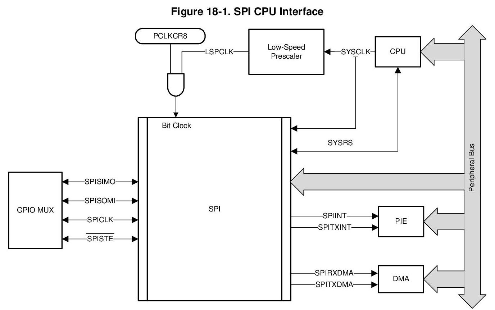

### 18.2 System-Level Integration

This section describes the various functionality that is applicable to the device integration. These features require configuration of other modules in the device that are not within the scope of this chapter.

#### 18.2.1 SPI Module Signals

Table 18-1 classifies and provides a summary of the SPI module signals.

Table 18-1. SPI Module Signal Summary

<table><tr><td>Signal Name</td><td>Description</td></tr><tr><td colspan="2">External Signals</td></tr><tr><td>SPICLK</td><td>SPI clock</td></tr><tr><td>SPISIMO</td><td>SPI slave in, master out</td></tr><tr><td>SPISOMI</td><td>SPI slave out, master in</td></tr><tr><td>SPISTE</td><td>SPI slave transmit enable</td></tr><tr><td colspan="2">Control</td></tr><tr><td>SPI Clock Rate</td><td>LSPCLK</td></tr><tr><td colspan="2">Interrupt Signals</td></tr><tr><td>SPIINT/SPIRXINT</td><td>Transmit interrupt/ Receive Interrupt in non FIFO mode (referred to as SPIINT)</td></tr><tr><td></td><td>Receive interrupt in FIFO mode</td></tr><tr><td>SPITXINT</td><td>Transmit interrupt in FIFO mode</td></tr><tr><td colspan="2">DMA Triggers</td></tr><tr><td>SPITXDMA</td><td>Transmit request to DMA</td></tr><tr><td>SPIRXDMA</td><td>Receive request to DMA</td></tr></table>

## Special Considerations

The SPISTE signal provides the ability to gate any spurious clock and data pulses when the SPI is in slave mode. An active SPISTE will not allow the slave to receive data. This prevents the SPI slave from losing synchronization with the master. It is this reason that TI does not recommend that the SPISTE always be tied to the active state.

If the SPI slave does ever lose synchronization with the master, toggling SPISWRESET will reset internal bit counter as well as the various status flags in the module. By resetting the bit counter, the SPI will interpret the next clock transition as the first bit of a new transmission. The register bit fields which are reset by SPISWRESET can be found in Section 18.5

## Configuring a GPIO to emulate SPISTE

In many systems, a SPI master may be connected to multiple SPI slaves using multiple instances of SPISTE. Though this SPI module does not natively support multiple SPISTE signals, it is possible to emulate this behavior in software using GPIOs. In this configuration, the SPI must be configured as the master. Rather than using the GPIO Mux to select SPISTE, the application would configure pins to be GPIO outputs, one GPIO per SPI slave. Before transmitting any data, the application would drive the desired GPIO to the active state. Immediately after the transmission has been completed, the GPIO chip select would be driven to the inactive state. This process can be repeated for many slaves which share the SPICLK, SPISIMO, and SPISOMI lines.

#### 18.2.2 Configuring Device Pins

The GPIO mux registers must be configured to connect this peripheral to the device pins. To avoid glitches on the pins, the GPyGMUX bits must be configured first (while keeping the corresponding GPyMUX bits at the default of zero), followed by writing the GPyMUX register to the desired value.

Some IO functionality is defined by GPIO register settings independent of this peripheral. For input signals, the GPIO input qualification should be set to asynchronous mode by setting the appropriate GPxQSELn register bits to 11b. The internal pullups can be configured in the GPyPUD register.

See the GPIO chapter for more details on GPIO mux and settings.

##### 18.2.2.1 GPIOs Required for High-Speed Mode

The high-speed mode of the SPI is available on the specified GPIO mux options in the device datasheet. To enable the high-speed enhancements, set SPICCR.HS_MODE to 1. Ensure that the capacitive loading on the pin does not exceed the value stated in the device Data Manual.

When not operating in high-speed mode, or if the capacitive loading on the pins exceed the value stated in the device Data Manual, SPICCR.HS_MODE should be set to 0.

#### 18.2.3 SPI Interrupts

This section includes information on the available interrupts present in the SPI module.

The SPI module contains two interrupt lines: SPIINT/SPIRXINT and SPITXINT. When the SPI is operating in non-FIFO mode, all available interrupts are routed together to generate the single SPIINT interrupt. When FIFO mode is used, both SPIRXINT and SPITXINT can be generated.

## SPIINT/SPIRXINT

When the SPI is operating in non-FIFO mode, the interrupt generated is called SPIINT. If FIFO enhancements are enabled, the interrupt is called SPIRXINT. These interrupts share the same interrupt vector in the Peripheral Interrupt Expansion (PIE) block.

In non-FIFO mode, two conditions can trigger an interrupt: a transmission is complete (INT_FLAG), or there is overrun in the receiver (OVERRUN_FLAG). Both of these conditions share the same interrupt vector: SPIINT.

The transmission complete flag (INT_FLAG) indicates that the SPI has completed sending or receiving the last bit and is ready to be serviced. At the same time this bit is set, the received character is placed in the receiver buffer (SPIRXBUF). The INT_FLAG will generate an interrupt on the SPIINT vector if the SPIINTENA bit is set.

The receiver overrun flag (OVERRUN_FLAG) indicates that a transmit or receive operation has completed before the previous character has been read from the buffer. The OVERRUN_FLAG will generate an interrupt on the SPIINT vector if the OVERRUNINTENA bit is set and OVERRUN_FLAG was previously cleared.

In FIFO mode, the SPI can interrupt the CPU upon a match condition between the current receive FIFO status (RXFFST) and the receive FIFO interrupt level (RXFFIL). If RXFFST is greater than or equal to RXFFIL, the receive FIFO interrupt flag (RXFFINT) will be set. SPIRXINT will be triggered in the PIE block if RXFFINT is set and the receive FIFO interrupt is enabled (RXFFIENA = 1).

## SPITXINT

The SPITXINT interrupt is not available when the SPI is operating in non-FIFO mode.

In FIFO mode, the SPITXINT behavior is similar to the SPIRXINT. SPITXINT is generated upon a match condition between the current transmit FIFO status (TXFFST) and the transmit FIFO interrupt level (TXFFIL). If TXFFST is less than or equal to TXFFIL, the transmit FIFO interrupt flag (TXFFINT) will be set. SPITXINT will be triggered in the PIE block if TXFFINT is set and the transmit FIFO interrupt is enabled in the SPI module (TXFFIENA = 1).

Figure 18-2 and Table 18-2 show how these control bits influence the SPI interrupt generation.

Figure 18-2. SPI Interrupt Flags and Enable Logic Generation

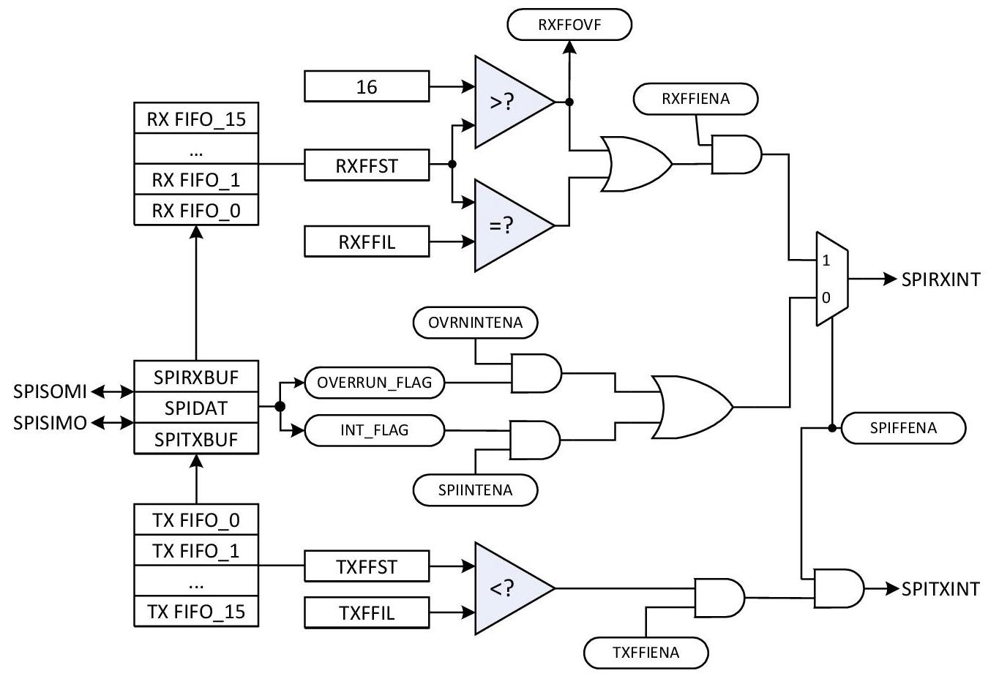

Table 18-2. SPI Interrupt Flag Modes

<table><tr><td>FIFO Options</td><td>SPI interrupt Source</td><td>Interrupt Flags</td><td>Interrupt Enables</td><td>FIFO Enable (SPIFFENA)</td><td>Interrupt \( {}^{\left( 1\right) } \) Line</td></tr><tr><td rowspan="3">SPI without FIFO</td><td>Receive overrun</td><td>RXOVRN</td><td>OVRNINTENA</td><td>0</td><td>SPIRXINT</td></tr><tr><td>Data receive</td><td>SPIINT</td><td>SPIINTENA</td><td>0</td><td>SPIRXINT</td></tr><tr><td>Transmit empty</td><td>SPIINT</td><td>SPIINTENA</td><td>0</td><td>SPIRXINT</td></tr><tr><td rowspan="2">SPI FIFO mode</td><td>FIFO receive</td><td>RXFFIL</td><td>RXFFIENA</td><td>1</td><td>SPIRXINT</td></tr><tr><td>Transmit empty</td><td>TXFFIL</td><td>TXFFIENA</td><td>1</td><td>SPITXINT</td></tr></table>

(1) In non-FIFO mode, SPIRXINT is the same name as the SPIINT interrupt in 28x devices.

#### 18.2.4 DMA Support

Both the CPU and DMA have access to the SPI data registers via the internal peripheral bus. This access is limited to 16-bit register read/writes. Each SPI module can generate two DMA events, SPITXDMA and SPIRXDMA. The DMA events are controlled by configuring the SPIFFTX.TXFFIL and SPIFFRX.RXFFIL appropriately. SPITXDMA activates when TXFFST is less than the interrupt level (TXFFIL). SPIRXDMA activates when RXFFST is greater than or equal to the interrupt level (RXFFIL).

The SPI must have FIFO enhancements enabled in order for the DMA triggers to be generated.

For more information on configuring the SPI for DMA transfers refer to Section 18.3.8.

Figure 18-3 is a block diagram showing the DMA trigger generation from the SPI module.

Figure 18-3. SPI DMA Trigger Diagram

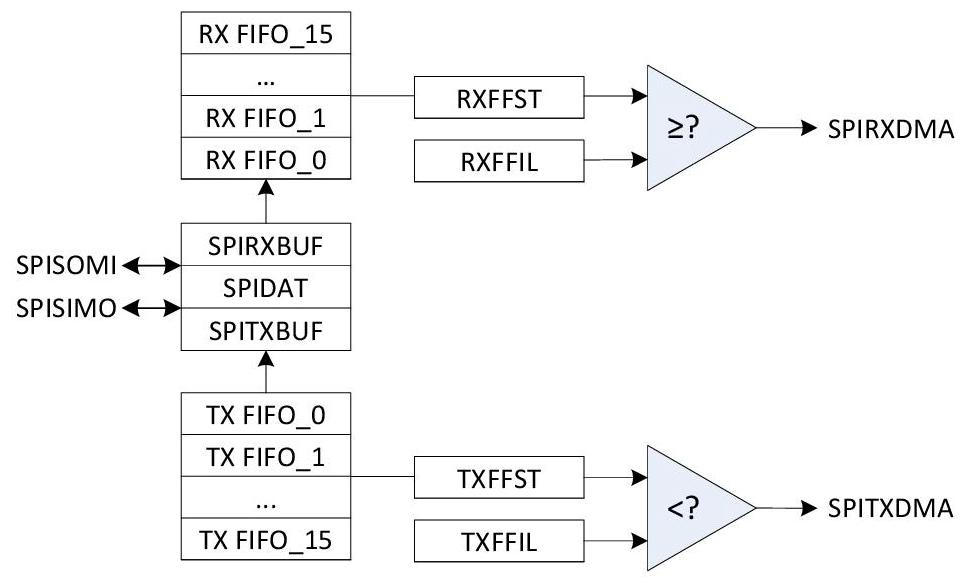

### 18.3 SPI Operation

This section describes the various modes of operation of the SPI. Included are explanations of the operational modes, interrupts, data format, clock sources, and initialization. Typical timing diagrams for data transfers are given.

#### 18.3.1 Introduction to Operation

Figure 18-4 shows typical connections of the SPI for communications between two controllers: a master and a slave.

The master transfers data by sending the SPICLK signal. For both the slave and the master, data is shifted out of the shift registers on one edge of the SPICLK and latched into the shift register on the opposite SPICLK clock edge. If the CLK_PHASE bit is high, data is transmitted and received a half-cycle before the SPICLK transition. As a result, both controllers send and receive data simultaneously. The application software determines whether the data is meaningful or dummy data. There are three possible methods for data transmission:

- Master sends data; slave sends dummy data.

- Master sends data; slave sends data.

- Master sends dummy data; slave sends data.

The master can initiate data transfer at any time because it controls the SPICLK signal. The software, however, determines how the master detects when the slave is ready to broadcast data.

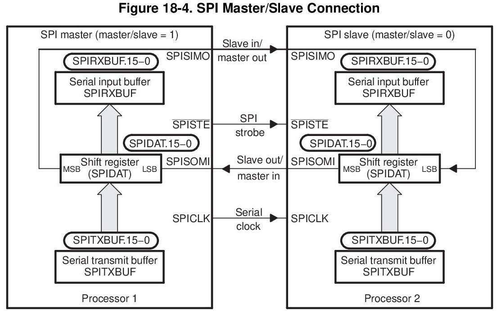

The SPI can operate in master or slave mode. The MASTER_SLAVE bit selects the operating mode and the source of the SPICLK signal.

#### 18.3.2 Master Mode

In master mode (MASTER_SLAVE = 1), the SPI provides the serial clock on the SPICLK pin for the entire serial communications network. Data is output on the SPISIMO pin and latched from the SPISOMI pin.

The SPIBRR register determines both the transmit and receive bit transfer rate for the network. SPIBRR can select 125 different data transfer rates.

Data written to SPIDAT or SPITXBUF initiates data transmission on the SPISIMO pin, MSB (most significant bit) first. Simultaneously, received data is shifted through the SPISOMI pin into the LSB (least significant bit) of SPIDAT. When the selected number of bits has been transmitted, the received data is transferred to the SPIRXBUF (buffered receiver) for the CPU to read. Data is stored right-justified in SPIRXBUF.

When the specified number of data bits has been shifted through SPIDAT, the following events occur:

- SPIDAT contents are transferred to SPIRXBUF.

- INT_FLAG bit is set to 1.

- If there is valid data in the transmit buffer SPITXBUF, as indicated by the Transmit Buffer Full Flag (BUFFULL_FLAG), this data is transferred to SPIDAT and is transmitted; otherwise, SPICLK stops after all bits have been shifted out of SPIDAT.

- If the SPIINTENA bit is set to 1, an interrupt is asserted.

In a typical application, the SPISTE pin serves as a chip-enable pin for a slave SPI device. This pin is driven low by the master before transmitting data to the slave and is taken high after the transmission is complete.

Figure 18-5 is a block diagram of the SPI in master mode. It shows the basic control blocks available in SPI master mode.

Figure 18-5. SPI Module Master Configuration

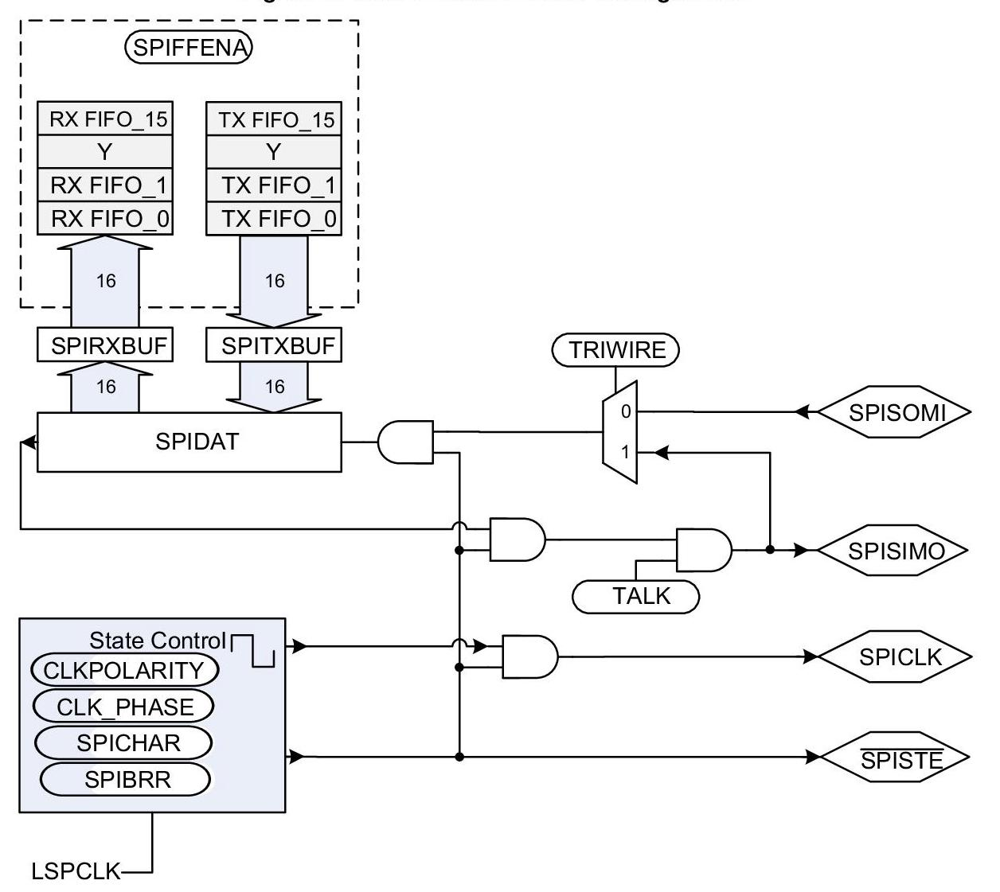

#### 18.3.3 Slave Mode

In slave mode (MASTER_SLAVE = 0), data shifts out on the SPISOMI pin and in on the SPISIMO pin. The SPICLK pin is used as the input for the serial shift clock, which is supplied from the external network master. The transfer rate is defined by this clock. The SPICLK input frequency should be no greater than the LSPCLK frequency divided by 4.

Data written to SPIDAT or SPITXBUF is transmitted to the network when appropriate edges of the SPICLK signal are received from the network master. Data written to the SPITXBUF register will be transferred to the SPIDAT register when all bits of the character to be transmitted have been shifted out of SPIDAT. If no character is currently being transmitted when SPITXBUF is written to, the data will be transferred immediately to SPIDAT. To receive data, the SPI waits for the network master to send the SPICLK signal and then shifts the data on the SPISIMO pin into SPIDAT. If data is to be transmitted by the slave simultaneously, and SPITXBUF has not been previously loaded, the data must be written to SPITXBUF or SPIDAT before the beginning of the SPICLK signal.

When the TALK bit is cleared, data transmission is disabled, and the output line (SPISOMI) is put into the high-impedance state. If this occurs while a transmission is active, the current character is completely transmitted even though SPISOMI is forced into the high-impedance state. This ensures that the SPI is still able to receive incoming data correctly. This TALK bit allows many slave devices to be tied together on the network, but only one slave at a time is allowed to drive the SPISOMI line.

The SPISTE pin operates as the slave-select pin. An active-low signal on the SPISTE pin allows the slave SPI to transfer data to the serial data line; an inactive- high signal causes the slave SPI serial shift register to stop and its serial output pin to be put into the high-impedance state. This allows many slave devices to be tied together on the network, although only one slave device is selected at a time.

Figure 18-6 is a block diagram of the SPI in slave mode. It shows the basic control blocks available in SPI slave mode.

Figure 18-6. SPI Module Slave Configuration

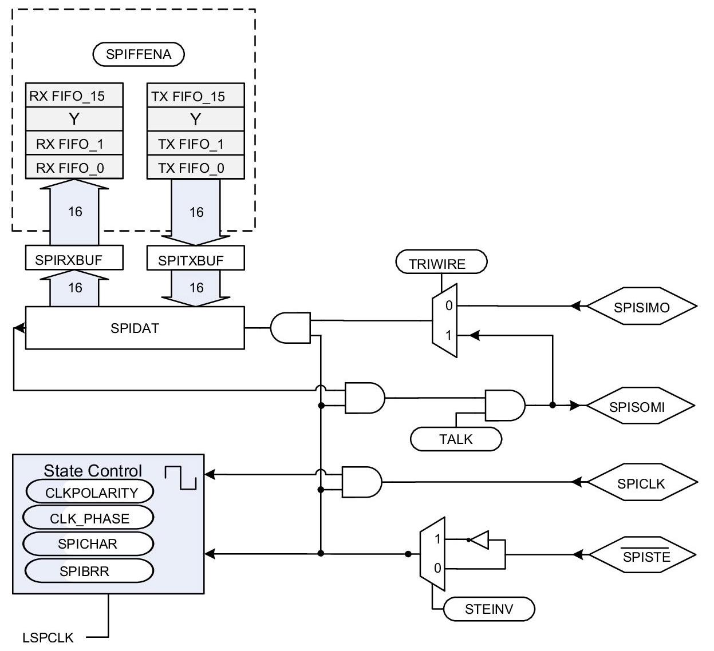

#### 18.3.4 Data Format

The four-bit SPICHAR register field specifies the number of bits in the data character (1 to 16). This information directs the state control logic to count the number of bits received or transmitted to determine when a complete character has been processed.

The following statements apply to characters with fewer than 16 bits:

- Data must be left-justified when written to SPIDAT and SPITXBUF.

- Data read back from SPIRXBUF is right-justified.

- SPIRXBUF contains the most recently received character, right-justified, plus any bits that remain from

previous transmission(s) that have been shifted to the left (shown in Example 18-1).

## Example 18-1. Transmission of Bit From SPIRXBUF

Conditions:

1. Transmission character length \( = 1 \) bit (specified in bits SPICHAR)

2. The current value of SPIDAT \( = {737}\mathrm{\;{Bh}} \)

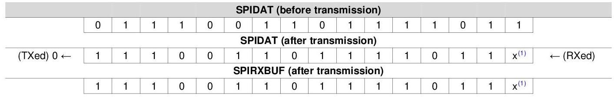

(1) \( \mathrm{x} = 1 \) if SPISOMI data is high; \( \mathrm{x} = 0 \) if SPISOMI data is low; master mode is assumed.

#### 18.3.5 Baud Rate Selection

The SPI module supports 125 different baud rates and four different clock schemes. Depending on whether the SPI clock is in slave or master mode, the SPICLK pin can receive an external SPI clock signa or provide the SPI clock signal, respectively.

- In the slave mode, the SPI clock is received on the SPICLK pin from the external source, and can be no greater than the LSPCLK frequency divided by 4.

- In the master mode, the SPI clock is generated by the SPI and is output on the SPICLK pin, and can be no greater than the LSPCLK frequency divided by 4.

NOTE: The baud rate should be configured to not exceed the maximum rated GPIO toggle frequency. Refer to the device Data Manual for the maximum GPIO toggle frequency

Example 18-2 shows how to determine the SPI baud rates.

## Example 18-2. Baud Rate Determination

For SPIBRR = 3 to 127:

SPI Baud Rate \( = \frac{\text{ LSPCLK }}{\left( \text{ SPIBRR } + 1\right) } \)(6)

For SPIBRR = 0, 1, or 2:

SPI Baud Rate \( = \frac{\text{ LSPCLK }}{4} \)(7)

where:

LSPCLK = Low-speed peripheral clock frequency of the device

SPIBRR = Contents of the SPIBRR in the master SPI device

To determine what value to load into SPIBRR, you must know the device system clock (LSPCLK) frequency (which is device-specific) and the baud rate at which you will be operating.

The following example shows how to calculate the baud rate of the SPI module in standard SPI mode (HS_MODE=0).

Example 18-3. Baud Rate Calculation in Non-High Speed Mode (HS_MODE=0)

\[
\begin{aligned}  & = \frac{{50} \times  {10}^{6}}{3 + 1} \\  & = {12.5}\mathrm{{Mbps}} \end{aligned} \tag{8}
\]

#### 18.3.6 SPI Clocking Schemes

The clock polarity select bit (CLKPOLARITY) and the clock phase select bit (CLK_PHASE) control four different clocking schemes on the SPICLK pin. CLKPOLARITY selects the active edge, either rising or falling, of the clock. CLK_PHASE selects a half-cycle delay of the clock. The four different clocking schemes are as follows:

- Falling Edge Without Delay. The SPI transmits data on the falling edge of the SPICLK and receives data on the rising edge of the SPICLK.

- Falling Edge With Delay. The SPI transmits data one half-cycle ahead of the falling edge of the SPICLK signal and receives data on the falling edge of the SPICLK signal.

- Rising Edge Without Delay. The SPI transmits data on the rising edge of the SPICLK signal and receives data on the falling edge of the SPICLK signal.

- Rising Edge With Delay. The SPI transmits data one half-cycle ahead of the rising edge of the SPICLK signal and receives data on the rising edge of the SPICLK signal.

The selection procedure for the SPI clocking scheme is shown in Table 18-3. Examples of these four clocking schemes relative to transmitted and received data are shown in Figure 18-7.

Table 18-3. SPI Clocking Scheme Selection Guide

<table><tr><td>SPICLK Scheme</td><td>CLKPOLARITY</td><td>CLK_PHASE (1)</td></tr><tr><td>Rising edge without delay</td><td>0</td><td>0</td></tr><tr><td>Rising edge with delay</td><td>0</td><td>1</td></tr><tr><td>Falling edge without delay</td><td>1</td><td>0</td></tr><tr><td>Falling edge with delay</td><td>1</td><td>1</td></tr></table>

(1) The description of CLK_PHASE and CLKPOLARITY differs between manufacturers. For proper operation, select the desired waveform to determine the clock phase and clock polarity settings.

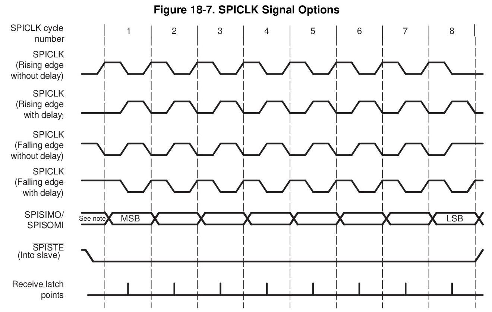

Note: Previous data bit

SPICLK symmetry is retained only when the result of (SPIBRR+1) is an even value. When (SPIBRR + 1) is an odd value and SPIBRR is greater than 3, SPICLK becomes asymmetrical. The low pulse of SPICLK is one LSPCLK cycle longer than the high pulse when CLKPOLARITY bit is clear (0). When CLKPOLARITY bit is set to 1, the high pulse of the SPICLK is one LSPCLK cycle longer than the pulse, as shown in Figure 18-8.

Figure 18-8. SPI: SPICLK-LSPCLK Characteristic When (BRR + 1) is Odd, BRR > 3, and CLKPOLARITY =

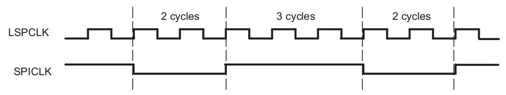

#### 18.3.7 SPI FIFO Description

The following steps explain the FIFO features and help with programming the SPI FIFOs:

1. Reset. At reset the SPI powers up in standard SPI mode and the FIFO function is disabled. The FIFO registers SPIFFTX, SPIFFRX and SPIFFCT remain inactive.

2. Standard SPI. The standard 28x SPI mode will work with SPIINT/SPIRXINT as the interrupt source.

3. Mode change. FIFO mode is enabled by setting the SPIFFENA bit to 1 in the SPIFFTX register. SPIRST can reset the FIFO mode at any stage of its operation.

4. Active registers. All the SPI registers and SPI FIFO registers SPIFFTX, SPIFFRX, and SPIFFCT will be active.

5. Interrupts. FIFO mode has two interrupts one for the transmit FIFO, SPITXINT and one for the receive FIFO, SPIRXINT. SPIRXINT is the common interrupt for SPI FIFO receive, receive error and receive FIFO overflow conditions. The single SPIINT for both transmit and receive sections of the standard SPI will be disabled and this interrupt will service as SPI receive FIFO interrupt. For more information, refer to Section 18.2.3

6. Buffers. Transmit and receive buffers are each supplemented with a 16 word FIFO. The one-word transmit buffer (SPITXBUF) of the standard SPI functions as a transition buffer between the transmit FIFO and shift register. The one-word transmit buffer will be loaded from transmit FIFO only after the last bit of the shift register is shifted out.

7. Delayed transfer. The rate at which transmit words in the FIFO are transferred to transmit shift register is programmable. The SPIFFCT register bits (7-0) FFTXDLY7-FFTXDLY0 define the delay between the word transfer. The delay is defined in number SPI serial clock cycles. The 8-bit register could define a minimum delay of 0 SPICLK cycles and a maximum of 255 SPICLK cycles. With zero delay, the SPI module can transmit data in continuous mode with the FIFO words shifting out back to back. With the 255 clock delay, the SPI module can transmit data in a maximum delayed mode with the FIFO words shifting out with a delay of 255 SPICLK cycles between each words. The programmable delay facilitates glueless interface to various slow SPI peripherals, such as EEPROMs, ADC, DAC, and so on.

8. FIFO status bits. Both transmit and receive FIFOs have status bits TXFFST or RXFFST that define the number of words available in the FIFOs at any time. The transmit FIFO reset bit (TXFIFO) and receive reset bit (RXFIFO) will reset the FIFO pointers to zero when these bits are set to 1. The FIFOs will resume operation from start once these bits are cleared to zero.

9. Programmable interrupt levels. Both transmit and receive FIFOs can generate CPU interrupts and DMA triggers. The transmit interrupt (SPITXINT) is generated whenever the transmit FIFO status bits (TXFFST) match (less than or equal to) the interrupt trigger level bits (TXFFIL). The receive interrupt (SPIRXINT) is generated whenever the receive FIFO status bits (RXFFST) match (greater than or equal to) the interrupt trigger level RXFFIL. This provides a programmable interrupt trigger for transmit and receive sections of the SPI. The default value for these trigger level bits will be 0x11111 for receive FIFO and 0x00000 for transmit FIFO, respectively.

#### 18.3.8 SPI DMA Transfers

##### 18.3.8.1 Transmitting Data Using SPI with DMA

When using the DMA with the TX FIFO, the DMA Burst Size (DMA_BURST_SIZE) should be no greater than 16 - TXFFIL in order to prevent the DMA from writing to an already full FIFO. This will lead to data loss and is not recommended.

For complete data transmission, please follow these steps:

1. Calculate the total number or words to be transmitted. [NUM_WORDS]

2. Decide the transmit FIFO level. [TXFFIL]

3. Calculate the number of DMA transfers. [DMA_TRANSFER_SIZE]

4. Calculate the size of the DMA Burst. [DMA_BURST_SIZE]

5. Configure DMA using calculated values.

6. Configure SPI with FIFO using the calculated values.

To transfer 128 words to SPI using the DMA:

NUM_WORDS: 128

TXFFIL: 8

DMA_TRANSFER_SIZE: (NUM_WORDS /TXFFIL) - 1 = (128/8) - 1 = 15 (16 transfers)

DMA_BURST_SIZE: (16 - TXFFIL) - 1 = (16 - 8) - 1 = 7 (8 words per burst)

NOTE: Avoid setting TXFFIL to 0h or 10h to ensure proper DMA configuration.

##### 18.3.8.2 Receiving Data Using SPI with DMA

When using the DMA with the RX FIFO, the DMA Burst Size (BURST_SIZE) should be no greater than RXFFIL in order to prevent the DMA from reading from an empty FIFO. To ensure that the DMA correctly receives all data from the RX FIFO, the DMA Burst Size should equal RXFFIL and also be an integer divisor of the total number of SPI transmissions.

www.ti.com

---

For complete data reception, please follow these steps:

1. Calculate the number of words to be received. [NUM_WORDS]

2. Calculate the necessary FIFO level [RXFFIL]

3. Calculate the total number of DMA transfers. [DMA_TRANSFER_SIZE]

4. Calculate the size of the DMA Burst. [DMA_BURST_SIZE]

5. Configure DMA using the calculated values.

6. Configure SPI with FIFO using the calculated values.

To receive 200 words from SPI using the DMA:

	NUM_WORDS = 200

	RXFFIL: 4

	DMA_TRANSFER_SIZE: (NUM_WORDS /RXFFIL) - 1 = (200/4) - 1 = 49 (50 transfers)

	DMA_BURST_SIZE = RXFFIL-1 = 3 (4 words per burst)

---

NOTE: Avoid setting RXFFIL to 0h to ensure proper DMA configuration.

#### 18.3.9 SPI High-Speed Mode

The SPI module is capable of reaching full-duplex communication speeds up to LSPCLK/4 (where LSPCLK equals SYSCLK). For the maximum rated speed, refer the device Data Manual.

In order to achieve the maximum full-duplex speeds, the following restrictions are placed on the design:

- Single master to single slave configuration is supported.

- Loading on the pins must not exceed the value stated in the device Data Manual.

When configuring the GPIOs to support High-Speed mode, refer to Section 18.2.2.1 for more information.

#### 18.3.10 SPI 3-Wire Mode Description

SPI 3-wire mode allows for SPI communication over three pins instead of the normal four pins.

In master mode, if the TRIWIRE bit is set, enabling 3-wire SPI mode, SPISIMOx becomes the bidirectional SPIMOMIx (SPI master out, master in) pin, and SPISOMIx is no longer used by the SPI. In slave mode, if the TRIWIRE bit is set, SPISOMIx becomes the bi-directional SPISISOx (SPI slave in, slave out) pin, and SPISIMOx is no longer used by the SPI.

Table 18-4 indicates the pin function differences between 3-wire and 4-wire SPI mode for a master and slave SPI.

Table 18-4. 4-wire vs. 3-wire SPI Pin Functions

<table><tr><td>4-wire SPI</td><td>3-wire SPI (Master)</td><td>3-wire SPI(Slave)</td></tr><tr><td>SPICLKx</td><td>SPICLKx</td><td>SPICLKx</td></tr><tr><td>SPISTEx</td><td>SPISTEx</td><td>SPISTEx</td></tr><tr><td>SPISIMOx</td><td>SPIMOMIx</td><td>Free</td></tr><tr><td>SPISOMIx</td><td>Free</td><td>SPISISOx</td></tr></table>

Because in 3-wire mode, the receive and transmit paths within the SPI are connected, any data transmitted by the SPI module is also received by itself. The application software must take care to perform a dummy read to clear the SPI data register of the additional received data.

The TALK bit plays an important role in 3-wire SPI mode. The bit must be set to transmit data and clear prior to reading data. In master mode, in order to initiate a read, the application software must write dummy data to the SPI data register (SPIDAT or SPIRXBUF) while the TALK bit is cleared (no data is transmitted out the SPIMOMI pin) before reading from the data register.

Figure 18-9 and Figure 18-10 illustrate 3-wire master and slave mode.

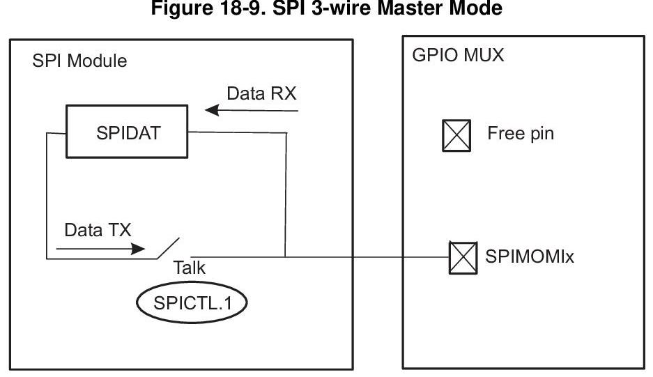

Figure 18-10. SPI 3-wire Slave Mode

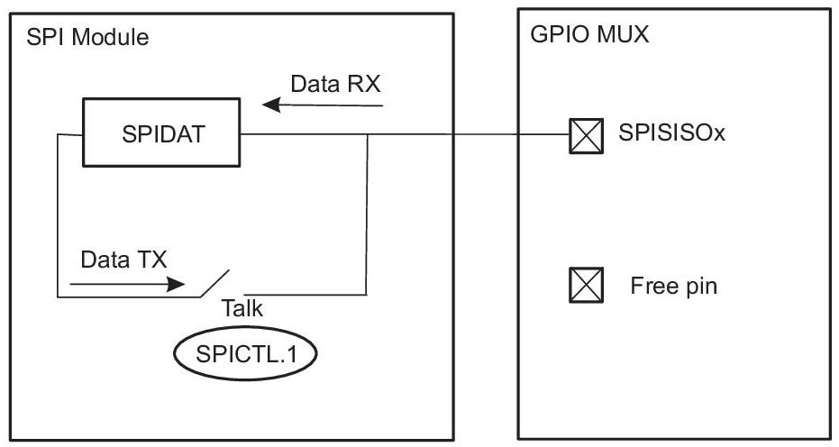

Table 18-5 indicates how data is received or transmitted in the various SPI modes while the TALK bit is set or cleared.

Table 18-5. 3-Wire SPI Pin Configuration

<table><tr><td>Pin Mode</td><td>SPIPRI[TRIWIRE]</td><td>spictL[talk]</td><td>SPISIMO</td><td>SPISOMI</td></tr><tr><td colspan="5">Master Mode</td></tr><tr><td>4-wire</td><td>0</td><td>X</td><td>TX</td><td>RX</td></tr><tr><td>3-pin mode</td><td>1</td><td>0</td><td>RX</td><td>Disconnect from SPI</td></tr><tr><td></td><td></td><td>1</td><td>TX/RX</td><td></td></tr><tr><td colspan="5">Slave Mode</td></tr><tr><td>4-wire</td><td>0</td><td>X</td><td>RX</td><td>TX</td></tr><tr><td>3-pin mode</td><td>1</td><td>0</td><td>Disconnect from SPI</td><td>RX</td></tr><tr><td></td><td></td><td>1</td><td></td><td>TX/RX</td></tr></table>

### 18.4 Programming Procedure

This section describes the procedure for configuring the SPI for the various modes of operation.

#### 18.4.1 Initialization Upon Reset

A system reset forces the SPI peripheral into the following default configuration:

- Unit is configured as a slave module (MASTER_SLAVE = 0)

- Transmit capability is disabled (TALK = 0)

- Data is latched at the input on the falling edge of the SPICLK signal

- Character length is assumed to be one bit

- SPI interrupts are disabled

- Data in SPIDAT is reset to 0000h

#### 18.4.2 Configuring the SPI

This section describes the procedure in which to configure the SPI module for operation. To prevent unwanted and unforeseen events from occurring during or as a result of initialization changes, clear the SPISWRESET bit before making initialization changes, and then set this bit after initialization is complete. While the SPI is held in reset (SPISWRESET = 0), configuration may be changed in any order. The following list shows the SPI configuration procedure in a logical order. However, the SPI registers can be written with single 16-bit writes, so the order is not required with the exception of SPISWRESET.

To change the SPI configuration:

Step 1. Clear the SPI Software Reset bit (SPISWRESET) to 0 to force the SPI to the reset state.

Step 2. Configure the SPI as desired:

- Select either master or slave mode (MASTER_SLAVE).

- Choose SPICLK polarity and phase (CLKPOLARITY and CLK_PHASE).

- Set the desired baud rate (SPIBRR).

- Enable high speed mode if desired (HS_MODE).

- Set the SPI character length (SPICHAR).

- Clear the SPI Flags (OVERRUN_FLAG, INT_FLAG).

- Enable SPISTE inversion (STEINV) if needed.

- Enable 3-wire mode (TRIWIRE) if needed.

- If using FIFO enhancements:

- Enable the FIFO enhancements (SPIFFENA).

- Clear the FIFO Flags (TXFFINTCLR, RXFFOVFCLR, and RXFFINTCLR).

- Release transmit and receive FIFO resets (TXFIFO and RXFIFORESET).

- Release SPI FIFO channels from reset (SPIRST).

Step 3. If interrupts are used:

- In non-FIFO mode, enable the receiver overrun and/or SPI interrupts (OVERRUNINTENA and SPIINTENA).

- In FIFO mode, set the transmit and receive interrupt levels (TXFFIL and RXFFIL) then enable the interrupts (TXFFIENA and RXFFIENA).

Step 4. Set SPISWRESET to 1 to release the SPI from the reset state.

NOTE: Do not change the SPI configuration when communication is in progress.

#### 18.4.3 Configuring the SPI for High-Speed Mode

In order to achieve the maximum rated speeds, the following settings must be made. This example assumes that the device is operating at 100 MHz.

Set LSPCLK equal to SYSCLK:

---

ClkCfgRegs.LOSPCP.bit.LSPCLKDIV = 0;

---

Select the appropriate Pin Mux options in GPIO_CTRL_REGS.

During the SPI configuration procedure:

Set HS_MODE to 1.

---

SpiaRegs.SPICCR.bit.HS_MODE = 0x1;

---

Set SPIBRR to 3. SPICLK = LSPCLK/(SPIBRR+1) = 25MHz

---

SpiaRegs.SPIBRR = 0x3;

---

There are no other differences in the configuration from normal SPI operation. Sending and receiving data, interrupts, and DMA operation will operate without change.

#### 18.4.4 Data Transfer Example

The timing diagram shown in Figure 18-11 illustrates an SPI data transfer between two devices using a character length of five bits with the SPICLK being symmetrical.

The timing diagram with SPICLK asymmetrical (Figure 18-8) shares similar characterizations with Figure 18-11 except that the data transfer is one LSPCLK cycle longer per bit during the low pulse (CLKPOLARITY = 0) or during the high pulse (CLKPOLARITY = 1) of the SPICLK.

Figure 18-11 is applicable for 8-bit SPI only and is not for C28x devices that are capable of working with 16-bit data. The figure is shown for illustrative purposes only.

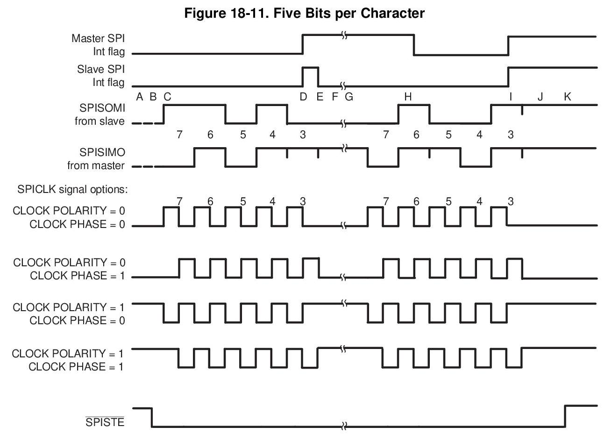

Slave writes 0D0h to SPIDAT and waits for the master to shift out the data.

Master sets the slave SPISTE signal low (active).

Master writes 058h to SPIDAT, which starts the transmission procedure.

First byte is finished and sets the interrupt flags.

Slave reads 0Bh from its SPIRXBUF (right-justified).

Slave writes 04Ch to SPIDAT and waits for the master to shift out the data.

G Master writes 06Ch to SPIDAT, which starts the transmission procedure.

H Master reads 01Ah from the SPIRXBUF (right-justified).

Second byte is finished and sets the interrupt flags.

J Master reads 89h and the slave reads 8Dh from their respective SPIRXBUF. After the user's software masks off the unused bits, the master receives 09h and the slave receives 0Dh.

K Master clears the slave SPISTE signal high (inactive).

#### 18.4.5 SPI 3-Wire Mode Code Examples

In addition to the normal SPI initialization, to configure the SPI module for 3-wire mode, the TRIWIRE bit (SPIPRI.0) must be set to 1. After initialization, there are several considerations to take into account when transmitting and receiving data in 3-wire master and slave mode. The following examples demonstrate these considerations.

In 3-wire master mode, SPICLKx, SPISTEx, and SPISIMOx pins must be configured as SPI pins (SPISOMIx pin can be configured as non-SPI pin). When the master transmits, it receives the data it transmits (because SPISIMOx and SPISOMIx are connected internally in 3-wire mode). Therefore, the junk data received must be cleared from the receive buffer every time data is transmitted.

## Example 18-4. 3-Wire Master Mode Transmit

---

Uint16 data;

Uint16 dummy;

---

Example 18-4. 3-Wire Master Mode Transmit (continued)

---

SpiaRegs.SPICTL.bit.TALK = 1; 	// Enable Transmit path

SpiaRegs.SPITXBUF = data; // Master transmits data

while (SpiaRegs.SPISTS.bit.INT_FLAG !=1) \{ \} // Waits until data r \( {x}^{\prime }d \)

dummy = SpiaRegs.SPIRXBUF; 	// Clears junk data from itself

	// bc it rx'd same data tx'd

---

To receive data in 3-wire master mode, the master must clear the TALK (SPICTL.1) bit to 0 to close the transmit path and then transmit dummy data in order to initiate the transfer from the slave. Because the TALK bit is 0, unlike in transmit mode, the master dummy data does not appear on the SPISIMOx pin, and the master does not receive its own dummy data. Instead, the data from the slave is received by the master.

## Example 18-5. 3-Wire Master Mode Receive

---

Uint16 rdata;

Uint16 dummy;

	SpiaRegs.SPICTL.bit.TALK = 0; 										// Disable Transmit path

	SpiaRegs.SPITXBUF = dummy; 										// Send dummy to start tx

	// NOTE: because TALK = 0, data does not tx onto SPISIMOA pin

	while (SpiaRegs.SPISTS.bit.INT_FLAG !=1) \{\} // Wait until data received

	rdata = SpiaRegs.SPIRXBUF; 										// Master reads data

---

In 3-wire slave mode, SPICLKx, SPISTEx, and SPISOMIx pins must be configured as SPI pins (SPISIMOx pin can be configured as non-SPI pin). Like in master mode, when transmitting, the slave receives the data it transmits and must clear this junk data from its receive buffer.

Example 18-6. 3-Wire Slave Mode Transmit

---

Uint16 data;

Uint16 dummy;

		SpiaRegs.SPICTL.bit.TALK = 1; 																		// Enable Transmit path

		SpiaRegs.SPITXBUF = data; 																		// Slave transmits data

		while (SpiaRegs.SPISTS.bit.INT_FLAG !=1) \{\} 																	\{\} // Wait until data rx'd

		dummy = SpiaRegs.SPIRXBUF; 																		// Clears junk data from itself

---

As in 3-wire master mode, the TALK bit must be cleared to 0. Otherwise, the slave receives data normally.

## Example 18-7. - 3-Wire Slave Mode Receive

---

Uint16 rdata;

		SpiaRegs.SPICTL.bit.TALK = 0; 																		// Disable Transmit path

		while (SpiaRegs.SPISTS.bit.INT_FLAG ! = 1) \{ 																	\{\} // Waits until data rx' d

		rdata = SpiaRegs.SPIRXBUF; 																		// Slave reads data

---

#### 18.4.6 SPI STEINV Bit in Digital Audio Transfers

On those devices with two SPI modules, enabling the STEINV bit on one of the SPI modules allows the pair of SPIs to receive both left and right-channel digital audio data in slave mode. The SPI module that receives a normal active-low SPISTE signal stores right-channel data, and the SPI module that receives an inverted active-high SPISTE signal stores left-channel data from the master. To receive digital audio data from a digital audio interface receiver, the SPI modules can be connected as shown in Figure 18-12.

NOTE: This configuration is only applicable to slave mode (MASTER_SLAVE = 0). When the SPI is configured as master (MASTER_SLAVE = 1), the STEINV bit will have no effect on the SPISTE pin.

Figure 18-12. SPI Digital Audio Receiver Configuration Using Two SPIs

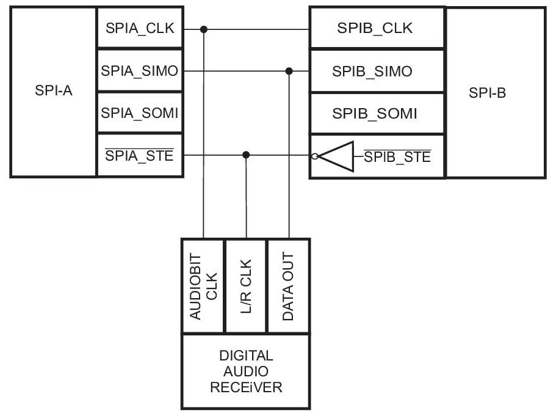

Standard C28x SPI timing requirements limit the number of digital audio interface formats supported using the 2-SPI configuration with the STEINV bit. See your device-specific data sheet electrical specifications for SPI timing requirements. With the SPI clock phase configured such that the CLKPOLARITY bit is 0 and the CLK_PHASE bit is 1 (data latched on rising edge of clock), standard right-justified digital audio interface data format is supported as shown in Figure 18-13.

Figure 18-13. Standard Right-Justified Digital Audio Data Format

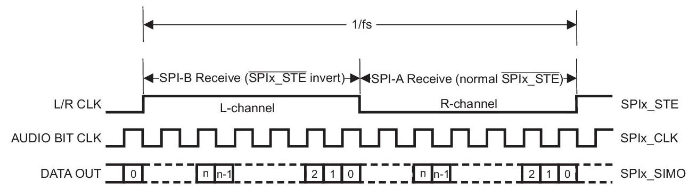

### 18.5 SPI Registers

This section describes the Serial Peripheral Interface registers. It is important to note that the SPI registers only allow 16-bit accesses.

#### 18.5.1 SPI Base Addresses

Table 18-6. SPI Base Address Table

<table><tr><td>Device Registers</td><td>Register Name</td><td>Start Address</td><td>End Address</td></tr><tr><td>SpiaRegs</td><td>SPI_REGS</td><td>0x0000_6100</td><td>0x0000_610F</td></tr><tr><td>SpibRegs</td><td>SPI_REGS</td><td>0x0000_6110</td><td>0x0000_611F</td></tr><tr><td>SpicRegs</td><td>SPI_REGS</td><td>0x0000_6120</td><td>0x0000_612F</td></tr></table>

#### 18.5.2 SPI_REGS Registers

Table 18-7 lists the SPI_REGS registers. All register offset addresses not listed in Table 18-7 should be considered as reserved locations and the register contents should not be modified.

Table 18-7. SPI_REGS Registers

<table><tr><td>Offset</td><td>Acronym</td><td>Register Name</td><td>Write Protection</td><td>Section</td></tr><tr><td>0h</td><td>SPICCR</td><td>SPI Configuration Control Register</td><td></td><td>Go</td></tr><tr><td>1h</td><td>SPICTL</td><td>SPI Operation Control Register</td><td></td><td>Go</td></tr><tr><td>2h</td><td>SPISTS</td><td>SPI Status Register</td><td></td><td>Go</td></tr><tr><td>4h</td><td>SPIBRR</td><td>SPI Baud Rate Register</td><td></td><td>Go</td></tr><tr><td>6h</td><td>SPIRXEMU</td><td>SPI Emulation Buffer Register</td><td></td><td>Go</td></tr><tr><td>7h</td><td>SPIRXBUF</td><td>SPI Serial Input Buffer Register</td><td></td><td>Go</td></tr><tr><td>8h</td><td>SPITXBUF</td><td>SPI Serial Output Buffer Register</td><td></td><td>Go</td></tr><tr><td>9h</td><td>SPIDAT</td><td>SPI Serial Data Register</td><td></td><td>Go</td></tr><tr><td>Ah</td><td>SPIFFTX</td><td>SPI FIFO Transmit Register</td><td></td><td>Go</td></tr><tr><td>Bh</td><td>SPIFFRX</td><td>SPI FIFO Receive Register</td><td></td><td>Go</td></tr><tr><td>Ch</td><td>SPIFFCT</td><td>SPI FIFO Control Register</td><td></td><td>Go</td></tr><tr><td>Fh</td><td>SPIPRI</td><td>SPI Priority Control Register</td><td></td><td>Go</td></tr></table>

Complex bit access types are encoded to fit into small table cells. Table 18-8 shows the codes that are used for access types in this section.

Table 18-8. SPI_REGS Access Type Codes

<table><tr><td>Access Type</td><td>Code</td><td>Description</td></tr><tr><td colspan="3">Read Type</td></tr><tr><td>R</td><td>R</td><td>Read</td></tr><tr><td>RC</td><td>R   C</td><td>Read   to Clear</td></tr><tr><td colspan="3">Write Type</td></tr><tr><td>W</td><td>W</td><td>Write</td></tr><tr><td>W1C</td><td>W   1C</td><td>Write   1 to clear</td></tr><tr><td colspan="3">Reset or Default Value</td></tr><tr><td>-n</td><td></td><td>Value after reset or the default value</td></tr><tr><td colspan="3">Register Array Variables</td></tr><tr><td>i, j, k, l, m, n</td><td></td><td>When these variables are used in a register name, an offset, or an address, they refer to the value of a register array where the register is part of a group of repeating registers. The register groups form a hierarchical structure and the array is represented with a formula.</td></tr><tr><td>y</td><td></td><td>When this variable is used in a register name, an offset, or an address it refers to the value of a register array.</td></tr></table>

##### 18.5.2.1 SPICCR Register (Offset = 0h) [reset = 0h]

SPICCR is shown in Figure 18-14 and described in Table 18-9.

Return to the Summary Table.

SPICCR controls the setup of the SPI for operation.

Figure 18-14. SPICCR Register

<table><tr><td>15</td><td>14</td><td>13</td><td>12</td><td>11</td><td>10</td><td>9</td><td>8</td></tr><tr><td></td><td></td><td></td><td colspan="2">RESERVED</td><td></td><td></td><td></td></tr><tr><td colspan="8">R-0h</td></tr><tr><td>7</td><td>6</td><td>5</td><td>4</td><td>3</td><td>2</td><td>1</td><td>0</td></tr><tr><td>SPISWRESET</td><td>CLKPOLARITY</td><td>HS_MODE</td><td>SPILBK</td><td colspan="4">SPICHAR</td></tr><tr><td>R/W-0h</td><td>R/W-0h</td><td>R/W-0h</td><td>R/W-0h</td><td colspan="4">R/W-0h</td></tr></table>

Table 18-9. SPICCR Register Field Descriptions

<table><tr><td>Bit</td><td>Field</td><td>Type</td><td>Reset</td><td>Description</td></tr><tr><td>15-8</td><td>RESERVED</td><td>R</td><td>0h</td><td>Reserved</td></tr><tr><td>7</td><td>SPISWRESET</td><td>R/W</td><td>0h</td><td>SPI Software Reset   When changing configuration, you should clear this bit before the changes and set this bit before resuming operation.   Reset type: SYSRSn   0h (R/W) = Initializes the SPI operating flags to the reset condition. Specifically, the RECEIVER OVERRUN Flag bit (SPISTS.7), the SPI INT FLAG bit (SPISTS.6), and the TXBUF FULL Flag bit (SPISTS.5) are cleared. SPISTE will become inactive. SPICLK will be immediately driven to 0 regardless of the clock polarity. The SPI configuration remains unchanged.   1h (R/W) = SPI is ready to transmit or receive the next character. When the SPI SW RESET bit is a 0, a character written to the transmitter will not be shifted out when this bit is set. A new character must be written to the serial data register. SPICLK will be returned to its inactive state one SPICLK cycle after this bit is set.</td></tr><tr><td>6</td><td>CLKPOLARITY</td><td>R/W</td><td>0h</td><td>Shift Clock Polarity   This bit controls the polarity of the SPICLK signal. CLOCK POLARITY and POLARITY CLOCK PHASE (SPICTL.3) control four clocking schemes on the SPICLK pin.   Reset type: SYSRSn   0h (R/W) = Data is output on rising edge and input on falling edge. When no SPI data is sent, SPICLK is at low level. The data input and output edges depend on the value of the CLOCK PHASE bit (SPICTL.3) as follows:   - CLOCK PHASE = 0: Data is output on the rising edge of the SPICLK signal. Input data is latched on the falling edge of the SPICLK signal.   - CLOCK PHASE = 1: Data is output one half-cycle before the first rising edge of the SPICLK signal and on subsequent falling edges of the SPICLK signal. Input data is latched on the rising edge of the SPICLK signal.   1h (R/W) = Data is output on falling edge and input on rising edge. When no SPI data is sent, SPICLK is at high level. The data input and output edges depend on the value of the CLOCK PHASE bit (SPICTL.3) as follows:   - CLOCK PHASE = 0: Data is output on the falling edge of the SPICLK signal. Input data is latched on the rising edge of the SPICLK signal.   - CLOCK PHASE = 1: Data is output one half-cycle before the first falling edge of the SPICLK signal and on subsequent rising edges of the SPICLK signal. Input data is latched on the falling edge of the SPICLK signal.</td></tr></table>

Table 18-9. SPICCR Register Field Descriptions (continued)

<table><tr><td>Bit</td><td>Field</td><td>Type</td><td>Reset</td><td>Description</td></tr><tr><td>5</td><td>HS_MODE</td><td>R/W</td><td>0h</td><td>High Speed Mode Enable Bits   This bit determines if the High Speed mode is enabled. The correct GPIOs should be selected in the GPxGMUX/GPxMUX registers.   Reset type: SYSRSn   0h (R/W) = SPI High Speed mode disabled. This is the default value after reset.   1h (R/W) = SPI High Speed mode enabled,</td></tr><tr><td>4</td><td>SPILBK</td><td>R/W</td><td>0h</td><td>SPI Loopback Mode Select   Loopback mode allows module validation during device testing. This mode is valid only in master mode of the SPI.   Reset type: SYSRSn   0h (R/W) = SPI loopback mode disabled. This is the default value after reset.   1h (R/W) = SPI loopback mode enabled, SIMO/SOMI lines are connected internally. Used for module self-tests.</td></tr><tr><td>3-0</td><td>SPICHAR</td><td>R/W</td><td>0h</td><td>Character Length Control Bits   These four bits determine the number of bits to be shifted in or SPI CHAR0 out as a single character during one shift sequence.   SPICHAR = Word length - 1   Reset type: SYSRSn   0h (R/W) = 1-bit word   1h (R/W) = 2-bit word   7h (R/W) = 8-bit word   Fh \( \left( {\mathrm{R}/\mathrm{W}}\right)  = {16} \) -bit word</td></tr></table>

##### 18.5.2.2 SPICTL Register \( \left( {\text{Offset} = 1\mathrm{\;h}}\right) \) [reset \( = 0\mathrm{\;h} \) ]

SPICTL is shown in Figure 18-15 and described in Table 18-10.

Return to the Summary Table.

SPICTL controls data transmission, the SPI's ability to generate interrupts, the SPICLK phase, and the operational mode (slave or master).

Figure 18-15. SPICTL Register

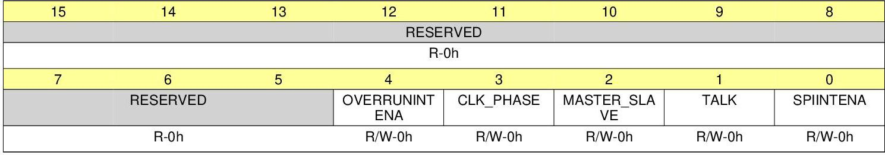

Table 18-10. SPICTL Register Field Descriptions

<table><tr><td>Bit</td><td>Field</td><td>Type</td><td>Reset</td><td>Description</td></tr><tr><td>15-5</td><td>RESERVED</td><td>R</td><td>0h</td><td>Reserved</td></tr><tr><td>4</td><td>OVERRUNINTENA</td><td>R/W</td><td>0h</td><td>Overrun Interrupt Enable   Overrun Interrupt Enable. Setting this bit causes an interrupt to be generated when the RECEIVER OVERRUN Flag bit (SPISTS.7) is set by hardware. Interrupts generated by the RECEIVER OVERRUN Flag bit and the SPI INT FLAG bit (SPISTS.6) share the same interrupt vector.   Reset type: SYSRSn   0h (R/W) = Disable RECEIVER OVERRUN interrupts.   1h (R/W) = Enable RECEIVER_OVERRUN interrupts.</td></tr><tr><td>3</td><td>CLK_PHASE</td><td>R/W</td><td>0h</td><td>SPI Clock Phase Select   This bit controls the phase of the SPICLK signal. CLOCK PHASE and CLOCK POLARITY (SPICCR.6) make four different clocking schemes possible (see clocking figures in SPI chapter). When operating with CLOCK PHASE high, the SPI (master or slave) makes the first bit of data available after SPIDAT is written and before the first edge of the SPICLK signal, regardless of which SPI mode is being used.   Reset type: SYSRSn   0h (R/W) = Normal SPI clocking scheme, depending on the CLOCK POLARITY bit (SPICCR.6).   1h (R/W) = SPICLK signal delayed by one half-cycle. Polarity determined by the CLOCK POLARITY bit.</td></tr><tr><td>2</td><td>MASTER_SLAVE</td><td>R/W</td><td>Oh</td><td>SPI Network Mode Control   This bit determines whether the SPI is a network master or slave. SLAVE During reset initialization, the SPI is automatically configured as a network slave.   Reset type: SYSRSn   0h (R/W) = SPI is configured as a slave.   1h (R/W) = SPI is configured as a master.</td></tr></table>

Table 18-10. SPICTL Register Field Descriptions (continued)

<table><tr><td>Bit</td><td>Field</td><td>Type</td><td>Reset</td><td>Description</td></tr><tr><td>1</td><td>TALK</td><td>R/W</td><td>0h</td><td>Transmit Enable   The TALK bit can disable data transmission (master or slave) by placing the serial data output in the high-impedance state. If this bit is disabled during a transmission, the transmit shift register continues to operate until the previous character is shifted out. Wh the TALK bit is disabled, the SPI is still able to receive characters and update the status flags. TALK is cleared (disabled) by a system reset.   Reset type: SYSRSn   0h (R/W) = Disables transmission:   - Slave mode operation: If not previously configured as a general-purpose I/O pin, the SPISOMI pin will be put in the high-impedance state.   - Master mode operation: If not previously configured as a general-purpose I/O pin, the SPISIMO pin will be put in the high-impedance state.   1h (R/W) = Enables transmission For the 4-pin option, ensure to enable the receiver's SPISTEn input pin.</td></tr><tr><td>0</td><td>SPIINTENA</td><td>R/W</td><td>0h</td><td>SPI Interrupt Enable   This bit controls the SPI's ability to generate a transmit/receive interrupt. The SPI INT FLAG bit (SPISTS.6) is unaffected by this bit.   Reset type: SYSRSn   0h (R/W) = Disables the interrupt.   1h (R/W) = Enables the interrupt.</td></tr></table>

18.5.2.3 SPISTS Register (Offset = 2h) [reset = 0h]

SPISTS is shown in Figure 18-16 and described in Table 18-11.

Return to the Summary Table.

SPISTS contrains interrupt and status bits.

Figure 18-16. SPISTS Register

<table><tr><td>15</td><td>14</td><td>13</td><td>12</td><td>11</td><td>10</td><td>9</td><td>8</td></tr><tr><td></td><td></td><td></td><td colspan="2">RESERVED</td><td></td><td></td><td></td></tr><tr><td colspan="8">R-0h</td></tr><tr><td>7</td><td>6</td><td>5</td><td>4</td><td>3</td><td>2</td><td>1</td><td>0</td></tr><tr><td>OVERRUN FL AG</td><td>INT_FLAG</td><td>BUFFULL FLA G</td><td></td><td></td><td>RESERVED</td><td></td><td></td></tr><tr><td>W1C-0h</td><td>RC-0h</td><td>R-0h</td><td></td><td></td><td>R-0h</td><td></td><td></td></tr></table>

Table 18-11. SPISTS Register Field Descriptions

<table><tr><td>Bit</td><td>Field</td><td>Type</td><td>Reset</td><td>Description</td></tr><tr><td>15-8</td><td>RESERVED</td><td>R</td><td>0h</td><td>Reserved</td></tr><tr><td>7</td><td>OVERRUN_FLAG</td><td>W1C</td><td>0h</td><td>SPI Receiver Overrun Flag   This bit is a read/clear-only flag. The SPI hardware sets this bit when a receive or transmit operation completes before the previous character has been read from the buffer. The bit is cleared in one of three ways:   - Writing a 1 to this bit   - Writing a 0 to SPI SW RESET (SPICCR.7)   - Resetting the system   If the OVERRUN INT ENA bit (SPICTL.4) is set, the SPI requests only one interrupt upon the first occurrence of setting the RECEIVER OVERRUN Flag bit. Subsequent overruns will not request additional interrupts if this flag bit is already set. This means that in order to allow new overrun interrupt requests the user must clear this flag bit by writing a 1 to SPISTS.7 each time an overrun condition occurs. In other words, if the RECEIVER OVERRUN Flag bit is left set (not cleared) by the interrupt service routine, another overrun interrupt will not be immediately re-entered when the interrupt service routine is exited.   Reset type: SYSRSn   0h (R/W) = A receive overrun condition has not occurred.   1h (R/W) = The last received character has been overwritten and therefore lost (when the SPIRXBUF was overwritten by the SPI module before the previous character was read by the user application).   Writing a '1' will clear this bit. The RECEIVER OVERRUN Flag bit should be cleared during the interrupt service routine because the RECEIVER OVERRUN Flag bit and SPI INT FLAG bit (SPISTS.6) share the same interrupt vector. This will alleviate any possible doubt as to the source of the interrupt when the next byte is received.</td></tr></table>

Table 18-11. SPISTS Register Field Descriptions (continued)

<table><tr><td>Bit</td><td>Field</td><td>Type</td><td>Reset</td><td>Description</td></tr><tr><td>6</td><td>INT_FLAG</td><td>RC</td><td>0h</td><td>SPI Interrupt Flag   SPI INT FLAG is a read-only flag. Hardware sets this bit to indicate that the SPI has completed sending or receiving the last bit and is ready to be serviced. This flag causes an interrupt to be requested if the SPI INT ENA bit (SPICTL.0) is set. The received character is placed in the receiver buffer at the same time this bit is set. This bit is cleared in one of three ways:   - Reading SPIRXBUF   - Writing a 0 to SPI SW RESET (SPICCR.7)   - Resetting the system   Note: This bit should not be used if FIFO mode is enabled. The internal process of copying the received word from SPIRXBUF to the Receive FIFO will clear this bit. Use the FIFO status, or FIFO interrupt bits for similar functionality.   Reset type: SYSRSn   0h (R/W) = No full words have been received or transmitted.   1h (R/W) = Indicates that the SPI has completed sending or receiving the last bit and is ready to be serviced.</td></tr><tr><td>5</td><td>BUFFULL_FLAG</td><td>R</td><td>0h</td><td>SPI Transmit Buffer Full Flag   This read-only bit gets set to 1 when a character is written to the SPI Transmit buffer SPITXBUF. It is cleared when the character is automatically loaded into SPIDAT when the shifting out of a previous character is complete.   Reset type: SYSRSn   0h (R/W) = Transmit buffer is not full.   1h (R/W) = Transmit buffer is full.</td></tr><tr><td>4-0</td><td>RESERVED</td><td>R</td><td>0h</td><td>Reserved</td></tr></table>

18.5.2.4 SPIBRR Register (Offset = 4h) [reset = 0h]

SPIBRR is shown in Figure 18-17 and described in Table 18-12.

Return to the Summary Table.

SPIBRR contains the bits used for baud-rate selection.

Figure 18-17. SPIBRR Register

<table><tr><td>15</td><td>14</td><td>13</td><td>12</td><td>11</td><td>10</td><td>9</td><td>8</td></tr><tr><td></td><td></td><td></td><td colspan="2">RESERVED</td><td></td><td></td><td></td></tr><tr><td colspan="8">R-0h</td></tr><tr><td>7</td><td>6</td><td>5</td><td>4</td><td>3</td><td>2</td><td>1</td><td>0</td></tr><tr><td>RESERVED</td><td colspan="7">SPI_BIT_RATE</td></tr><tr><td colspan="3">R-0h</td><td colspan="4">R/W-0h</td><td></td></tr></table>

Table 18-12. SPIBRR Register Field Descriptions

<table><tr><td>Bit</td><td>Field</td><td>Type</td><td>Reset</td><td>Description</td></tr><tr><td>15-7   6-0</td><td>RESERVED   SPI_BIT_RATE</td><td>R   R/W</td><td>0h   0h</td><td>Reserved   SPI Baud Rate Control   These bits determine the bit transfer rate if the SPI is the network SPI BIT RATE 0 master. There are 125 data-transfer rates (each a function of the CPU clock, LSPCLK) that can be selected. One data bit is shifted per SPICLK cycle. (SPICLK is the baud rate clock output on the SPICLK pin.)   If the SPI is a network slave, the module receives a clock on the SPICLK pin from the network master. Therefore, these bits have no effect on the SPICLK signal. The frequency of the input clock from the master should not exceed the slave SPI's LSPCLK signal divided by 4.   In master mode, the SPI clock is generated by the SPI and is output on the SPICLK pin. The SPI baud rates are determined by the following formula:   For SPIBRR = 3 to 127: SPI Baud Rate = LSPCLK / (SPIBRR + 1)   For SPIBRR = 0, 1, or 2: SPI Baud Rate = LSPCLK / 4 Reset type: SYSRSn   3h (R/W) = SPI Baud Rate = LSPCLK/4   4h (R/W) = SPI Baud Rate = LSPCLK/5   7Eh (R/W) = SPI Baud Rate = LSPCLK/127   7Fh (R/W) = SPI Baud Rate = LSPCLK/128</td></tr></table>

##### 18.5.2.5 SPIRXEMU Register (Offset = 6h) [reset = 0h]

SPIRXEMU is shown in Figure 18-18 and described in Table 18-13.

Return to the Summary Table.

SPIRXEMU contains the received data. Reading SPIRXEMU does not clear the SPI INT FLAG bit of SPISTS. This is not a real register but a dummy address from which the contents of SPIRXBUF can be read by the emulator without clearing the SPI INT FLAG.

Figure 18-18. SPIRXEMU Register

<table><tr><td>15</td><td>14</td><td>13</td><td>12</td><td>11</td><td>10</td><td>9</td><td>8</td></tr><tr><td colspan="8">ERXBn</td></tr><tr><td colspan="8">R-0h</td></tr><tr><td>7</td><td>6</td><td>5</td><td>4</td><td>3</td><td>2</td><td>1</td><td>0</td></tr><tr><td colspan="8">ERXBn</td></tr><tr><td colspan="8">R-0h</td></tr></table>

Table 18-13. SPIRXEMU Register Field Descriptions

<table><tr><td>Bit</td><td>Field</td><td>Type</td><td>Reset</td><td>Description</td></tr><tr><td>15-0</td><td>ERXBn</td><td>R</td><td>0h</td><td>Emulation Buffer Received Data   SPIRXEMU functions almost identically to SPIRXBUF, except that reading SPIRXEMU does not clear the SPI INT FLAG bit (SPISTS.6). Once the SPIDAT has received the complete character. the character is transferred to SPIRXEMU and SPIRXBUF, where it can be read. At the same time, SPI INT FLAG is set.   This mirror register was created to support emulation. Reading SPIRXBUF clears the SPI INT FLAG bit (SPISTS.6). In the normal operation of the emulator, the control registers are read to continually update the contents of these registers on the display screen. SPIRXEMU was created so that the emulator can read this register and properly update the contents on the display screen. Reading SPIRXEMU does not clear the SPI INT FLAG bit, but reading SPIRXBUF clears this flag. In other words, SPIRXEMU enables the emulator to emulate the true operation of the SPI more accurately.   It is recommended that you view SPIRXEMU in the normal emulator run mode.   Reset type: SYSRSn</td></tr></table>

##### 18.5.2.6 SPIRXBUF Register (Offset = 7h) [reset = 0h]

SPIRXBUF is shown in Figure 18-19 and described in Table 18-14.

Return to the Summary Table.

SPIRXBUF contains the received data. Reading SPIRXBUF clears the SPI INT FLAG bit in SPISTS. If FIFO mode is enabled, reading this register will also decrement the RXFFST counter in SPIFFRX.

Figure 18-19. SPIRXBUF Register

<table><tr><td>15</td><td>14</td><td>13</td><td>12</td><td>11</td><td>10</td><td>9</td><td>8</td></tr><tr><td colspan="8">RXBn</td></tr><tr><td colspan="8">R-0h</td></tr><tr><td>7</td><td>6</td><td>5</td><td>4</td><td>3</td><td>2</td><td>1</td><td>0</td></tr><tr><td></td><td></td><td></td><td>RXBn</td><td></td><td></td><td></td><td></td></tr><tr><td colspan="8">R-0h</td></tr></table>

Table 18-14. SPIRXBUF Register Field Descriptions

<table><tr><td>Bit</td><td>Field</td><td>Type</td><td>Reset</td><td>Description</td></tr><tr><td>15-0</td><td>RXBn</td><td>R</td><td>0h</td><td>Received Data   Once SPIDAT has received the complete character, the character is transferred to SPIRXBUF, where it can be read. At the same time, the SPI INT FLAG bit (SPISTS.6) is set. Since data is shifted into the SPI's most significant bit first, it is stored right-justified in this register.   Reset type: SYSRSn</td></tr></table>

##### 18.5.2.7 SPITXBUF Register (Offset = 8h) [reset = 0h]

SPITXBUF is shown in Figure 18-20 and described in Table 18-15.

Return to the Summary Table.

SPITXBUF stores the next character to be tranmitted. Writing to this register sets the TX BUF FULL Flag bit in SPISTS. When the transmission of the current character is complete, the contents of this register are automatically loaded in SPIDAT and the TX BUF FULL Flag is cleared. If no tranmission is currently active, data written to this register falls through into the SPIDAT register and the TX BUF FULL Flag is not set.

In master mode, if no tranmission is currently active, writing to this register initiates a transmission in the same manner that writing to SPIDAT does.

Figure 18-20. SPITXBUF Register

<table><tr><td>15</td><td>14</td><td>13</td><td>12</td><td>11</td><td>10</td><td>9</td><td>8</td></tr><tr><td></td><td></td><td></td><td>TXBn</td><td></td><td></td><td></td><td></td></tr><tr><td colspan="8">R/W-0h</td></tr><tr><td>7</td><td>6</td><td>5</td><td>4</td><td>3</td><td>2</td><td>1</td><td>0</td></tr><tr><td></td><td></td><td></td><td>TXBn</td><td></td><td></td><td></td><td></td></tr><tr><td colspan="8">R/W-0h</td></tr></table>

Table 18-15. SPITXBUF Register Field Descriptions

<table><tr><td>Bit</td><td>Field</td><td>Type</td><td>Reset</td><td>Description</td></tr><tr><td>15-0</td><td>TXBn</td><td>R/W</td><td>0h</td><td>Transmit Data Buffer   This is where the next character to be transmitted is stored. When the transmission of the current character has completed, if the TX BUF FULL Flag bit is set, the contents of this register is automatically transferred to SPIDAT, and the TX BUF FULL Flag is cleared. Writes to SPITXBUF must be left-justified.   Reset type: SYSRSn</td></tr></table>

##### 18.5.2.8 SPIDAT Register (Offset = 9h) [reset = 0h]

SPIDAT is shown in Figure 18-21 and described in Table 18-16.

Return to the Summary Table.

SPIDAT is the transmit and receive shift register. Data written to SPIDAT is shifted out (MSB) on subsequent SPICLK cycles. For every bit (MSB) shifted out of the SPI, a bit is shifted into the LSB end of the shift register.

Figure 18-21. SPIDAT Register

<table><tr><td>15</td><td>14</td><td>13</td><td>12</td><td>11</td><td>10</td><td>9</td><td>8</td></tr><tr><td></td><td></td><td></td><td>SDATn</td><td></td><td></td><td></td><td></td></tr><tr><td colspan="8">R/W-0h</td></tr><tr><td>7</td><td>6</td><td>5</td><td>4</td><td>3</td><td>2</td><td>1</td><td>0</td></tr><tr><td></td><td></td><td></td><td>SDATn</td><td></td><td></td><td></td><td></td></tr><tr><td colspan="8">R/W-0h</td></tr></table>

Table 18-16. SPIDAT Register Field Descriptions

<table><tr><td>Bit</td><td>Field</td><td>Type</td><td>Reset</td><td>Description</td></tr><tr><td>15-0</td><td>SDATn</td><td>R/W</td><td>0h</td><td>Serial Data Shift Register   - It provides data to be output on the serial output pin if the TALK bit (SPICTL.1) is set.   - When the SPI is operating as a master, a data transfer is initiated. When initiating a transfer, check the CLOCK POLARITY bit (SPICCR.6) described in Section 10.2.1.1 and the CLOCK PHASE bit (SPICTL.3) described in Section 10.2.1.2, for the requirements.   In master mode, writing dummy data to SPIDAT initiates a receiver sequence. Since the data is not hardware-justified for characters shorter than sixteen bits, transmit data must be written in left-justified form, and received data read in right-justified form.   Reset type: SYSRSn</td></tr></table>

##### 18.5.2.9 SPIFFTX Register (Offset = Ah) [reset = A000h]

SPIFFTX is shown in Figure 18-22 and described in Table 18-17.

Return to the Summary Table.

SPIFFTX contains both control and status bits related to the output FIFO buffer. This includes FIFO reset control, FIFO interrupt level control, FIFO level status, as well as FIFO interrupt enable and clear bits.

Figure 18-22. SPIFFTX Register

<table><tr><td>15</td><td>14</td><td>13</td><td>12</td><td>11</td><td>10</td><td>9</td><td>8</td></tr><tr><td>SPIRST</td><td>SPIFFENA</td><td>TXFIFO</td><td colspan="5">TXFFST</td></tr><tr><td>R/W-1h</td><td>R/W-0h</td><td>R/W-1h</td><td></td><td></td><td>R-0h</td><td></td><td></td></tr><tr><td>7</td><td>6</td><td>5</td><td>4</td><td>3</td><td>2</td><td>1</td><td>0</td></tr><tr><td>TXFFINT</td><td>TXFFINTCLR</td><td>TXFFIENA</td><td colspan="5">TXFFIL</td></tr><tr><td>R-0h</td><td>W-0h</td><td>R/W-0h</td><td></td><td></td><td>R/W-0h</td><td></td><td></td></tr></table>

Table 18-17. SPIFFTX Register Field Descriptions

<table><tr><td>Bit</td><td>Field</td><td>Type</td><td>Reset</td><td>Description</td></tr><tr><td>15</td><td>SPIRST</td><td>R/W</td><td>1h</td><td>SPI Reset   Reset type: SYSRSn   Oh (R/W) = Write 0 to reset the SPI transmit and receive channels. The SPI FIFO register configuration bits will be left as is.   1h (R/W) = SPI FIFO can resume transmit or receive. No effect to the SPI registers bits.</td></tr><tr><td>14</td><td>SPIFFENA</td><td>R/W</td><td>0h</td><td>SPI FIFO Enhancements Enable   Reset type: SYSRSn   0h (R/W) = SPI FIFO enhancements are disabled.   1h (R/W) = SPI FIFO enhancements are enabled.</td></tr><tr><td>13</td><td>TXFIFO</td><td>R/W</td><td>1h</td><td>TX FIFO Reset   Reset type: SYSRSn   0h (R/W) = Write 0 to reset the FIFO pointer to zero, and hold in reset.   1h (R/W) = Release transmit FIFO from reset.</td></tr><tr><td>12-8</td><td>TXFFST</td><td>R</td><td>0h</td><td>Transmit FIFO Status   Reset type: SYSRSn   0h (R/W) = Transmit FIFO is empty.   1h (R/W) = Transmit FIFO has 1 word.   2h (R/W) = Transmit FIFO has 2 words.   10h (R/W) = Transmit FIFO has 16 words, which is the maximum.   1Fh (R/W) = Reserved.</td></tr><tr><td>7</td><td>TXFFINT</td><td>R</td><td>0h</td><td>TX FIFO Interrupt Flag   Reset type: SYSRSn   0h (R/W) = TXFIFO interrupt has not occurred, This is a read-only bit.   1h (R/W) = TXFIFO interrupt has occurred, This is a read-only bit.</td></tr><tr><td>6</td><td>TXFFINTCLR</td><td>W</td><td>0h</td><td>TXFIFO Interrupt Clear   Reset type: SYSRSn   0h (R/W) = Write 0 has no effect on TXFIFINT flag bit, Bit reads back a zero.   1h (R/W) = Write 1 to clear SPIFFTX[TXFFINT] flag.</td></tr><tr><td>5</td><td>TXFFIENA</td><td>R/W</td><td>0h</td><td>TX FIFO Interrupt Enable   Reset type: SYSRSn   0h (R/W) = TX FIFO interrupt based on TXFFIL match (less than or equal to) will be disabled.   1h (R/W) = TX FIFO interrupt based on TXFFIL match (less than or equal to) will be enabled.</td></tr></table>

Table 18-17. SPIFFTX Register Field Descriptions (continued)

<table><tr><td>Bit</td><td>Field</td><td>Type</td><td>Reset</td><td>Description</td></tr><tr><td>4-0</td><td>TXFFIL</td><td>R/W</td><td>0h</td><td>Transmit FIFO Interrupt Level Bits   Transmit FIFO will generate interrupt when the FIFO status bits (TXFFST4-0) and FIFO level bits (TXFFIL4-0 ) match (less than or equal to).   Reset type: SYSRSn   0h (R/W) = A TX FIFO interrupt request is generated when there are no words remaining in the TX buffer.   1h (R/W) = A TX FIFO interrupt request is generated when there is 1 word or no words remaining in the TX buffer.   2h (R/W) = A TX FIFO interrupt request is generated when there is 2 words or fewer remaining in the TX buffer.   10h (R/W) = A TX FIFO interrupt request is generated when there are 16 words or fewer remaining in the TX buffer.   1Fh (R/W) = Reserved.</td></tr></table>

##### 18.5.2.10 SPIFFRX Register (Offset = Bh) [reset = 201Fh]

SPIFFRX is shown in Figure 18-23 and described in Table 18-18.

Return to the Summary Table.

SPIFFRX contains both control and status bits related to the input FIFO buffer. This includes FIFO reset control, FIFO interrupt level control, FIFO level status, as well as FIFO interrupt enable and clear bits.

Figure 18-23. SPIFFRX Register

<table><tr><td>15</td><td>14</td><td>13</td><td>12</td><td>11</td><td>10</td><td>9</td><td>8</td></tr><tr><td>RXFFOVF</td><td>RXFFOVFCLR</td><td>RXFIFORESET</td><td colspan="5">RXFFST</td></tr><tr><td>R-0h</td><td>W-0h</td><td>R/W-1h</td><td></td><td></td><td>R-0h</td><td></td><td></td></tr><tr><td>7</td><td>6</td><td>5</td><td>4</td><td>3</td><td>2</td><td>1</td><td>0</td></tr><tr><td>RXFFINT</td><td>RXFFINTCLR</td><td>RXFFIENA</td><td colspan="5">RXFFIL</td></tr><tr><td>R-0h</td><td>W-0h</td><td>R/W-0h</td><td colspan="5">R/W-1Fh</td></tr></table>

Table 18-18. SPIFFRX Register Field Descriptions

<table><tr><td>Bit</td><td>Field</td><td>Type</td><td>Reset</td><td>Description</td></tr><tr><td>15</td><td>RXFFOVF</td><td>R</td><td>0h</td><td>Receive FIFO Overflow Flag   Reset type: SYSRSn   0h (R/W) = Receive FIFO has not overflowed. This is a read-only bit.   1h (R/W) = Receive FIFO has overflowed, read-only bit. More than 16 words have been received in to the FIFO, and the first received word is lost.</td></tr><tr><td>14</td><td>RXFFOVFCLR</td><td>W</td><td>0h</td><td>Receive FIFO Overflow Clear   Reset type: SYSRSn   0h (R/W) = Write 0 does not affect RXFFOVF flag bit, Bit reads back a zero.   1h (R/W) = Write 1 to clear SPIFFRX[RXFFOVF].</td></tr><tr><td>13</td><td>RXFIFORESET</td><td>R/W</td><td>1h</td><td>Receive FIFO Reset   Reset type: SYSRSn   0h (R/W) = Write 0 to reset the FIFO pointer to zero, and hold in reset.   1h (R/W) = Re-enable receive FIFO operation.</td></tr><tr><td>12-8</td><td>RXFFST</td><td>R</td><td>0h</td><td>Receive FIFO Status   Reset type: SYSRSn   0h (R/W) = Receive FIFO is empty.   1h (R/W) = Receive FIFO has 1 word.   2h (R/W) = Receive FIFO has 2 words.   10h (R/W) = Receive FIFO has 16 words, which is the maximum.   1Fh (R/W) = Reserved.</td></tr><tr><td>7</td><td>RXFFINT</td><td>R</td><td>0h</td><td>Receive FIFO Interrupt Flag   Reset type: SYSRSn   0h (R/W) = RXFIFO interrupt has not occurred. This is a read-only bit.   1h (R/W) = RXFIFO interrupt has occurred. This is a read-only bit.</td></tr><tr><td>6</td><td>RXFFINTCLR</td><td>W</td><td>0h</td><td>Receive FIFO Interrupt Clear   Reset type: SYSRSn   0h (R/W) = Write 0 has no effect on RXFIFINT flag bit, Bit reads back a zero.   1h (R/W) = Write 1 to clear SPIFFRX[RXFFINT] flag</td></tr></table>

Table 18-18. SPIFFRX Register Field Descriptions (continued)

<table><tr><td>Bit</td><td>Field</td><td>Type</td><td>Reset</td><td>Description</td></tr><tr><td>5</td><td>RXFFIENA</td><td>R/W</td><td>0h</td><td>RX FIFO Interrupt Enable   Reset type: SYSRSn   0h (R/W) = RX FIFO interrupt based on RXFFIL match (greater than or equal to) will be disabled.   1h (R/W) = RX FIFO interrupt based on RXFFIL match (greater than or equal to) will be enabled.</td></tr><tr><td>4-0</td><td>RXFFIL</td><td>R/W</td><td>1Fh</td><td>Receive FIFO Interrupt Level Bits   Receive FIFO generates an interrupt when the FIFO status bits (RXFFST4-0) are greater than or equal to the FIFO level bits (RXFFIL4-0). The default value of these bits after reset is 11111. This avoids frequent interrupts after reset, as the receive FIFO will be empty most of the time.   Reset type: SYSRSn   0h (R/W) = A RX FIFO interrupt request is generated when there is 0 or more words in the RX buffer.   1h (R/W) = A RX FIFO interrupt request is generated when there are 1 or more words in the RX buffer.   2h (R/W) = A RX FIFO interrupt request is generated when there are 2 or more words in the RX buffer.   10h (R/W) = A RX FIFO interrupt request is generated when there are 16 words in the RX buffer.   1Fh (R/W) = Reserved.</td></tr></table>

18.5.2.11 SPIFFCT Register (Offset = Ch) [reset = 0h]

SPIFFCT is shown in Figure 18-24 and described in Table 18-19.

Return to the Summary Table.

SPIFFCT controls the FIFO transmit delay bits.

Figure 18-24. SPIFFCT Register

<table><tr><td>15</td><td>14</td><td>13</td><td>12</td><td>11</td><td>10</td><td>9</td><td>8</td></tr><tr><td></td><td></td><td></td><td colspan="2">RESERVED</td><td></td><td></td><td></td></tr><tr><td colspan="8">R-0h</td></tr><tr><td>7</td><td>6</td><td>5</td><td>4</td><td>3</td><td>2</td><td>1</td><td>0</td></tr><tr><td></td><td></td><td></td><td>TXDLY</td><td></td><td></td><td></td><td></td></tr><tr><td></td><td></td><td></td><td>R/W-0h</td><td></td><td></td><td></td><td></td></tr></table>

Table 18-19. SPIFFCT Register Field Descriptions

<table><tr><td>Bit</td><td>Field</td><td>Type</td><td>Reset</td><td>Description</td></tr><tr><td>15-8</td><td>RESERVED</td><td>R</td><td>0h</td><td>Reserved</td></tr><tr><td>7-0</td><td>TXDLY</td><td>R/W</td><td>0h</td><td>FIFO Transmit Delay Bits   These bits define the delay between every transfer from FIFO transmit buffer to transmit shift register. The delay is defined in number SPI serial clock cycles. The 8-bit register could define a minimum delay of 0 serial clock cycles and a maximum of 255 serial clock cycles. In FIFO mode, the buffer (TXBUF) between the shift register and the FIFO should be filled only after the shift register has completed shifting of the last bit. This is required to pass on the delay between transfers to the data stream. In the FIFO mode TXBUF should not be treated as one additional level of buffer.   Reset type: SYSRSn   0h (R/W) = The next word in the TX FIFO buffer is transferred to SPITXBUF immediately upon completion of transmission of the previous word.   1h (R/W) = The next word in the TX FIFO buffer is transferred to SPITXBUF1 serial clock cycle after completion of transmission of the previous word.   2h (R/W) = The next word in the TX FIFO buffer is transferred to SPITXBUF 2 serial clock cycles after completion of transmission of the previous word.   FFh (R/W) = The next word in the TX FIFO buffer is transferred to SPITXBUF 255 serial clock cycles after completion of transmission of the previous word.</td></tr></table>

##### 18.5.2.12 SPIPRI Register (Offset = Fh) [reset = 0h]

SPIPRI is shown in Figure 18-25 and described in Table 18-20.

Return to the Summary Table.

SPIPRI controls auxillary functions for the SPI including emulation control, SPISTE inversion, and 3-wire control.

Figure 18-25. SPIPRI Register

<table><tr><td>15</td><td>14</td><td>13</td><td>12</td><td>11</td><td>10</td><td>9</td><td>8</td></tr><tr><td></td><td></td><td></td><td colspan="2">RESERVED</td><td></td><td></td><td></td></tr><tr><td colspan="8">R-0h</td></tr><tr><td>7</td><td>6</td><td>5</td><td>4</td><td>3</td><td>2</td><td>1</td><td>0</td></tr><tr><td>RESERVED</td><td>RESERVED</td><td>SOFT</td><td>FREE</td><td colspan="2">RESERVED</td><td>STEINV</td><td>TRIWIRE</td></tr><tr><td>R-0h</td><td></td><td>R/W-0h</td><td>R/W-0h</td><td colspan="2">R-0h</td><td>R/W-0h</td><td>R/W-0h</td></tr></table>

Table 18-20. SPIPRI Register Field Descriptions

<table><tr><td>Bit</td><td>Field</td><td>Type</td><td>Reset</td><td>Description</td></tr><tr><td>15-7</td><td>RESERVED</td><td>R</td><td>0h</td><td>Reserved</td></tr><tr><td>6</td><td>RESERVED</td><td>R/W</td><td>0h</td><td>Reserved</td></tr><tr><td>5</td><td>SOFT</td><td>R/W</td><td>0h</td><td>Emulation Soft Run   This bit only has an effect when the FREE bit is 0.   Reset type: SYSRSn   0h (R/W) = Transmission stops midway in the bit stream while TSUSPEND is asserted. Once TSUSPEND is deasserted without a system reset, the remainder of the bits pending in the DATBUF are shifted. Example: If SPIDAT has shifted 3 out of 8 bits, the communication freezes right there. However, if TSUSPEND is later deasserted without resetting the SPI, SPI starts transmitting from where it had stopped (fourth bit in this case) and will transmit 8 bits from that point.   1h (R/W) = If the emulation suspend occurs before the start of a transmission, (that is, before the first SPICLK pulse) then the transmission will not occur. If the emulation suspend occurs after the start of a transmission, then the data will be shifted out to completion. When the start of transmission occurs is dependent on the baud rate used.   Standard SPI mode: Stop after transmitting the words in the shift register and buffer. That is, after TXBUF and SPIDAT are empty. In FIFO mode: Stop after transmitting the words in the shift register and buffer. That is, after TX FIFO and SPIDAT are empty.</td></tr><tr><td>4</td><td>FREE</td><td>R/W</td><td>0h</td><td>Emulation Free Run   These bits determine what occurs when an emulation suspend occurs (for example, when the debugger hits a breakpoint). The peripheral can continue whatever it is doing (free-run mode) or, if in stop mode, it can either stop immediately or stop when the current operation (the current receive/transmit sequence) is complete.   Reset type: SYSRSn   0h (R/W) = Emulation mode is selected by the SOFT bit   1h (R/W) = Free run, continue SPI operation regardless of suspend or when the suspend occurred.</td></tr><tr><td>3-2</td><td>RESERVED</td><td>R</td><td>0h</td><td>Reserved</td></tr></table>

Table 18-20. SPIPRI Register Field Descriptions (continued)

<table><tr><td>Bit</td><td>Field</td><td>Type</td><td>Reset</td><td>Description</td></tr><tr><td>1</td><td>STEINV</td><td>R/W</td><td>0h</td><td>SPISTEn Inversion Bit   On devices with 2 SPI modules, inverting the SPISTE signal on one of the modules allows the device to receive left and right- channel digital audio data.   This bit is only applicable to slave mode. Writing to this bit while configured as master (MASTER_SLAVE = 1) has no effect   Reset type: SYSRSn   Oh (R/W) = SPISTEn is active low (normal)   1h (R/W) = SPISTE is active high (inverted)</td></tr><tr><td>0</td><td>TRIWIRE</td><td>R/W</td><td>0h</td><td>SPI 3-wire Mode Enable   Reset type: SYSRSn   0h (R/W) = Normal 4-wire SPI mode.   1h (R/W) = 3-wire SPI mode enabled. The unused pin becomes a GPIO pin. In master mode, the SPISIMO pin becomes the SPIMOMI (master receive and transmit) pin and SPISOMI is free for non-SPI use. In slave mode, the SPISOMI pin becomes the SPISISO (slave receive and transmit) pin and SPISIMO is free for non-SPI use.</td></tr></table>

#### 18.5.3 Register to Driverlib Function Mapping

Table 18-21. SPI Registers to Driverlib Functions

<table><tr><td>File</td><td>Driverlib Function</td></tr><tr><td colspan="2">CCR</td></tr><tr><td>spi.c</td><td>SPI_setConfig</td></tr><tr><td>spi.c</td><td>SPI_clearInterruptStatus</td></tr><tr><td>spi.h</td><td>SPI_enableModule</td></tr><tr><td>spi.h</td><td>SPI disableModule</td></tr><tr><td>spi.h</td><td>SPI enableLoopback</td></tr><tr><td>spi.h</td><td>SPI_disableLoopback</td></tr><tr><td>spi.h</td><td>SPI_enableHighSpeedMode</td></tr><tr><td>spi.h</td><td>SPI_disableHighSpeedMode</td></tr><tr><td colspan="2">CTL</td></tr><tr><td>spi.c</td><td>SPI_setConfig</td></tr><tr><td>spi.c</td><td>SPI_enableInterrupt</td></tr><tr><td>spi.c</td><td>SPI_disableInterrupt</td></tr><tr><td>spi.h</td><td>SPI enableTalk</td></tr><tr><td>spi.h</td><td>SPI disableTalk</td></tr><tr><td colspan="2">STS</td></tr><tr><td>spi.c</td><td>SPI_getInterruptStatus</td></tr><tr><td>spi.c</td><td>SPI clearInterruptStatus</td></tr><tr><td>spi.h</td><td>SPI writeDataBlockingNonFIFO</td></tr><tr><td>spi.h</td><td>SPI readDataBlockingNonFIFO</td></tr><tr><td colspan="2">BRR</td></tr><tr><td>spi.c</td><td>SPI_setConfig</td></tr><tr><td>spi.c</td><td>SPI_setBaudRate</td></tr><tr><td colspan="2">RXEMU</td></tr><tr><td>spi.h</td><td>SPI_readRxEmulationBuffer</td></tr><tr><td colspan="2">RXBUF</td></tr><tr><td>spi.h</td><td>SPI_readDataNonBlocking</td></tr><tr><td>spi.h</td><td>SPI_readDataBlockingFIFO</td></tr><tr><td>spi.h</td><td>SPI_readDataBlockingNonFIFO</td></tr><tr><td colspan="2">TXBUF</td></tr><tr><td>spi.h</td><td>SPI_writeDataNonBlocking</td></tr><tr><td>spi.h</td><td>SPI writeDataBlockingFIFO</td></tr><tr><td>spi.h</td><td>SPI writeDataBlockingNonFIFO</td></tr><tr><td colspan="2">FFTX</td></tr><tr><td>spi.c</td><td>SPI_enableInterrupt</td></tr><tr><td>spi.c</td><td>SPI disableInterrupt</td></tr><tr><td>spi.c</td><td>SPI getInterruptStatus</td></tr><tr><td>spi.c</td><td>SPI clearInterruptStatus</td></tr><tr><td>spi.h</td><td>SPI enableFIFO</td></tr><tr><td>spi.h</td><td>SPI disableFIFO</td></tr><tr><td>spi.h</td><td>SPI resetTxFIFO</td></tr><tr><td>spi.h</td><td>SPI setFIFOInterruptLevel</td></tr><tr><td>spi.h</td><td>SPI getFIFOInterruptLevel</td></tr><tr><td>spi.h</td><td>SPI getTxFIFOStatus</td></tr><tr><td>spi.h</td><td>SPI_isBusy</td></tr></table>

Table 18-21. SPI Registers to Driverlib Functions (continued)

<table><tr><td>File</td><td>Driverlib Function</td></tr><tr><td colspan="2">FFRX</td></tr><tr><td>spi.c</td><td>SPI_enableInterrupt</td></tr><tr><td>spi.c</td><td>SPI_disableInterrupt</td></tr><tr><td>spi.c</td><td>SPI_dealnterruptStatus</td></tr><tr><td>spi.c</td><td>SPI_clearInterruptStatus</td></tr><tr><td>spi.h</td><td>SPI_enableFIFO</td></tr><tr><td>spi.h</td><td>SPI_disableFIFO</td></tr><tr><td>spi.h</td><td>SPI_resetRxFIFO</td></tr><tr><td>spi.h</td><td>SPI_setFIFOInterruptLevel</td></tr><tr><td>spi.h</td><td>SPI_getFIFOInterruptLevel</td></tr><tr><td>spi.h</td><td>SPI_getRxFIFOStatus</td></tr><tr><td colspan="2">FFCT</td></tr><tr><td>spi.h</td><td>SPI_setTxFifoTransmitDelay</td></tr><tr><td colspan="2">PRI</td></tr><tr><td>spi.h</td><td>SPI_enableTriWire</td></tr><tr><td>spi.h</td><td>SPI_disableTriWire</td></tr><tr><td>spi.h</td><td>SPI_setSTESignalPolarity</td></tr><tr><td>spi.h</td><td>SPI_setEmulationMode</td></tr></table>

## Serial Communications Interface (SCI)

This chapter describes the features and operation of the serial communication interface (SCI) module. SCI is a two-wire asynchronous serial port, commonly known as a UART. The SCI modules support digital communications between the CPU and other asynchronous peripherals that use the standard non-return-to-zero (NRZ) format. The SCI receiver and transmitter each have a 16-level deep FIFO for reducing servicing overhead, and each has its own separate enable and interrupt bits. Both can be operated independently for half-duplex communication, or simultaneously for full-duplex communication.

To specify data integrity, the SCI checks received data for break detection, parity, overrun, and framing errors. The bit rate is programmable to different speeds through a 16-bit baud-select register.

## Topic

Page

19.1 Introduction 2265

19.2 Architecture 2267

19.3 SCI Module Signal Summary 2267

19.4 Configuring Device Pins 2267

19.5 Multiprocessor and Asynchronous Communication Modes 2267

19.6 SCI Programmable Data Format. 2268

19.7 SCI Multiprocessor Communication 2268

19.8 Idle-Line Multiprocessor Mode 2269

19.9 Address-Bit Multiprocessor Mode 2271

19.10 SCI Communication Format 2272

19.11 SCI Port Interrupts 2274

19.12 SCI Baud Rate Calculations 2275

19.13 SCI Enhanced Features 2275

19.14 SCI Registers 2278

### 19.1 Introduction

The SCI interfaces are shown in Figure 19-1.

Features of the SCI module include:

- Two external pins:

- SCITXD: SCI transmit-output pin

- SCIRXD: SCI receive-input pin

Both pins can be used as GPIO if not used for SCI.

- Baud rate programmable to \( {64}\mathrm{\;K} \) different rates

- Data-word format

- One start bit

- Data-word length programmable from one to eight bits

- Optional even/odd/no parity bit

- One or two stop bits

- An extra bit to distinguish addresses from data (address bit mode only)

- Four error-detection flags: parity, overrun, framing, and break detection

- Two wake-up multiprocessor modes: idle-line and address bit

- Half- or full-duplex operation

- Double-buffered receive and transmit functions

- Transmitter and receiver operations can be accomplished through interrupt-driven or polled algorithms with status flags.

- Separate enable bits for transmitter and receiver interrupts (except BRKDT)

- NRZ (non-return-to-zero) format

Enhanced features include:

- Auto-baud-detect hardware logic

- 16-level transmit/receive FIFO

Figure 19-2 shows the SCI module block diagram. The SCI port operation is configured and controlled by the registers listed in Section 19.14 of this chapter.

Figure 19-2. Serial Communications Interface (SCI) Module Block Diagram

### 19.2 Architecture

The major elements used in full-duplex operation are shown in Figure 19-2 and include:

- A transmitter (TX) and its major registers (upper half of Figure 19-2)

- SCITXBUF - transmitter data buffer register. Contains data (loaded by the CPU) to be transmitted

- TXSHF register - transmitter shift register. Accepts data from register SCITXBUF and shifts data onto the SCITXD pin, one bit at a time

- A receiver (RX) and its major registers (lower half of Figure 19-2)

- RXSHF register - receiver shift register. Shifts data in from SCIRXD pin, one bit at a time

- SCIRXBUF - receiver data buffer register. Contains data to be read by the CPU. Data from a remote processor is loaded into register RXSHF and then into registers SCIRXBUF and SCIRXEMU

- A programmable baud generator

- Control and status registers

The SCI receiver and transmitter can operate either independently or simultaneously.

### 19.3 SCI Module Signal Summary

A summarized description of each SCI signal name is shown in Table 19-1.

Table 19-1. SCI Module Signal Summary

<table><tr><td></td><td>Signal Name</td><td>Description</td></tr><tr><td colspan="3">External signals</td></tr><tr><td></td><td>SCIRXD</td><td>SCI Asynchronous Serial Port receive data</td></tr><tr><td></td><td>SCITXD</td><td>SCI Asynchronous Serial Port transmit data   Control</td></tr><tr><td></td><td>Baud clock</td><td>LSPCLK Prescaled clock</td></tr><tr><td colspan="3">Interrupt signals</td></tr><tr><td></td><td>TXINT</td><td>Transmit interrupt</td></tr><tr><td></td><td>RXINT</td><td>Receive Interrupt</td></tr></table>

### 19.4 Configuring Device Pins

The GPIO mux registers must be configured to connect this peripheral to the device pins. To avoid glitches on the pins, the GPyGMUX bits must be configured first (while keeping the corresponding GPyMUX bits at the default of zero), followed by writing the GPyMUX register to the desired value.

Some IO functionality is defined by GPIO register settings independent of this peripheral. For input signals, the GPIO input qualification should be set to asynchronous mode by setting the appropriate GPxQSELn register bits to 11b. The internal pullups can be configured in the GPyPUD register.

See the GPIO chapter for more details on GPIO mux and settings.

### 19.5 Multiprocessor and Asynchronous Communication Modes

The SCI has two multiprocessor protocols, the idle-line multiprocessor mode (see Section 19.8) and the address-bit multiprocessor mode (see Section 19.9). These protocols allow efficient data transfer between multiple processors.

The SCI offers the universal asynchronous receiver/transmitter (UART) communications mode for interfacing with many popular peripherals. The asynchronous mode (see Section 19.10) requires two lines to interface with many standard devices such as terminals and printers that use RS-232-C formats. Data transmission characteristics include:

- One start bit

- One to eight data bits

- An even/odd parity bit or no parity bit

- One or two stop bits

### 19.6 SCI Programmable Data Format

SCI data, both receive and transmit, is in NRZ (non-return-to-zero) format. The NRZ data format, shown in Figure 19-3, consists of:

- One start bit

- One to eight data bits

- An even/odd parity bit (optional)

- One or two stop bits

- An extra bit to distinguish addresses from data (address-bit mode only)

The basic unit of data is called a character and is one to eight bits in length. Each character of data is formatted with a start bit, one or two stop bits, and optional parity and address bits. A character of data with its formatting information is called a frame and is shown in Figure 19-3.

Figure 19-3. Typical SCI Data Frame Formats

To program the data format, use the SCICCR register. The bits used to program the data format are shown in Table 19-2.

Table 19-2. Programming the Data Format Using SCICCR

<table><tr><td>Bit(s)</td><td>Bit Name</td><td>Designation</td><td>Functions</td></tr><tr><td>2-0</td><td>SCI CHAR2-0</td><td>SCICCR.2:0</td><td>Select the character (data) length (one to eight bits).</td></tr><tr><td>5</td><td>PARITY ENABLE</td><td>SCICCR.5</td><td>Enables the parity function if set to 1 , or disables the parity function if cleared to 0 .</td></tr><tr><td>6</td><td>EVEN/ODD PARITY</td><td>SCICCR.6</td><td>If parity is enabled, selects odd parity if cleared to 0 or even parity if set to 1.</td></tr><tr><td>7</td><td>STOP BITS</td><td>SCICCR.7</td><td>Determines the number of stop bits transmitted—one stop bit if cleared to 0 or two stop bits if set to 1 .</td></tr></table>

### 19.7 SCI Multiprocessor Communication

The multiprocessor communication format allows one processor to efficiently send blocks of data to other processors on the same serial link. On one serial line, there should be only one transfer at a time. In other words, there can be only one talker on a serial line at a time.

## Address Byte

The first byte of a block of information that the talker sends contains an address byte that is read by all listeners. Only listeners with the correct address can be interrupted by the data bytes that follow the address byte. The listeners with an incorrect address remain uninterrupted until the next address byte.

## Sleep Bit

All processors on the serial link set the SCI SLEEP bit (bit 2 of SCICTL1) to 1 so that they are interrupted only when the address byte is detected. When a processor reads a block address that corresponds to the CPU device address as set by your application software, your program must clear the SLEEP bit to enable the SCI to generate an interrupt on receipt of each data byte.

Although the receiver still operates when the SLEEP bit is 1, it does not set RXRDY, RXINT, or any of the receiver error status bits to 1 unless the address byte is detected and the address bit in the received frame is a 1 (applicable to address-bit mode). The SCI does not alter the SLEEP bit; your software must alter the SLEEP bit.

#### 19.7.1 Recognizing the Address Byte

A processor recognizes an address byte differently, depending on the multiprocessor mode used. For example:

- The idle-line mode (Section 19.8) leaves a quiet space before the address byte. This mode does not have an extra address/data bit and is more efficient than the address-bit mode for handling blocks that contain more than ten bytes of data. The idle-line mode should be used for typical non-multiprocessor SCI communication.

- The address-bit mode (Section 19.9) adds an extra bit (that is, an address bit) into every byte to distinguish addresses from data. This mode is more efficient in handling many small blocks of data because, unlike the idle mode, it does not have to wait between blocks of data. However, at a high transmit speed, the program is not fast enough to avoid a 10-bit idle in the transmission stream.

#### 19.7.2 Controlling the SCI TX and RX Features

The multiprocessor mode is software selectable via the ADDR/IDLE MODE bit (SCICCR, bit 3). Both modes use the TXWAKE flag bit (SCICTL1, bit 3), RXWAKE flag bit (SCIRXST, bit1), and the SLEEP flag bit (SCICTL1, bit 2) to control the SCI transmitter and receiver features of these modes.

#### 19.7.3 Receipt Sequence

In both multiprocessor modes, the receive sequence is as follows:

1. At the receipt of an address block, the SCI port wakes up and requests an interrupt (bit number 1 RX/BK INT ENA-of SCICTL2 must be enabled to request an interrupt). It reads the first frame of the block, which contains the destination address.

2. A software routine is entered through the interrupt and checks the incoming address. This address byte is checked against its device address byte stored in memory.

3. If the check shows that the block is addressed to the device CPU, the CPU clears the SLEEP bit and reads the rest of the block. If not, the software routine exits with the SLEEP bit still set, and does not receive interrupts until the next block start.

### 19.8 Idle-Line Multiprocessor Mode

In the idle-line multiprocessor protocol (ADDR/IDLE MODE bit=0), blocks are separated by having a longer idle time between the blocks than between frames in the blocks. An idle time of ten or more high-level bits after a frame indicates the start of a new block. The time of a single bit is calculated directly from the baud value (bits per second). The idle-line multiprocessor communication format is shown in Figure 19-4 (ADDR/IDLE MODE bit is bit 3 of SCICCR).

#### 19.8.1 Idle-Line Mode Steps

The steps followed by the idle-line mode:

Step 1. SCI wakes up after receipt of the block-start signal.

Step 2. The processor recognizes the next SCI interrupt.

Step 3. The interrupt service routine compares the received address (sent by a remote transmitter) to its own.

Step 4. If the CPU is being addressed, the service routine clears the SLEEP bit and receives the rest of the data block.

Step 5. If the CPU is not being addressed, the SLEEP bit remains set. This lets the CPU continue to execute its main program without being interrupted by the SCI port until the next detection of a block start.

#### 19.8.2 Block Start Signal

There are two ways to send a block-start signal:

1. Method 1: Deliberately leave an idle time of ten bits or more by delaying the time between the transmission of the last frame of data in the previous block and the transmission of the address frame of the new block.

2. Method 2: The SCI port first sets the TXWAKE bit (SCICTL1, bit 3) to 1 before writing to the SCITXBUF register. This sends an idle time of exactly 11 bits. In this method, the serial communications line is not idle any longer than necessary. (A don't care byte has to be written to SCITXBUF after setting TXWAKE, and before sending the address, so as to transmit the idle time.)

#### 19.8.3 Wake-UP Temporary (WUT) Flag

Associated with the TXWAKE bit is the wake-up temporary (WUT) flag. WUT is an internal flag, double-buffered with TXWAKE. When TXSHF is loaded from SCITXBUF, WUT is loaded from TXWAKE, and the TXWAKE bit is cleared to 0. This arrangement is shown in Figure 19-5.

Figure 19-5. Double-Buffered WUT and TXSHF

##### 19.8.3.1 Sending a Block Start Signal

To send out a block-start signal of exactly one frame time during a sequence of block transmissions:

1. Write a 1 to the TXWAKE bit.

2. Write a data word (content not important: a don't care) to the SCITXBUF register (transmit data buffer) to send a block-start signal. (The first data word written is suppressed while the block-start signal is sent out and ignored after that.) When the TXSHF (transmit shift register) is free again, SCITXBUF contents are shifted to TXSHF, the TXWAKE value is shifted to WUT, and then TXWAKE is cleared.

Because TXWAKE was set to a 1, the start, data, and parity bits are replaced by an idle period of 11 bits transmitted following the last stop bit of the previous frame.

## 3. Write a new address value to SCITXBUF

A don't-care data word must first be written to register SCITXBUF so that the TXWAKE bit value can be shifted to WUT. After the don't-care data word is shifted to the TXSHF register, the SCITXBUF (and TXWAKE if necessary) can be written to again because TXSHF and WUT are both double-buffered.

#### 19.8.4 Receiver Operation

The receiver operates regardless of the SLEEP bit. However, the receiver neither sets RXRDY nor the error status bits, nor does it request a receive interrupt until an address frame is detected.

### 19.9 Address-Bit Multiprocessor Mode

In the address-bit protocol (ADDR/IDLE MODE bit=1), frames have an extra bit called an address bit that immediately follows the last data bit. The address bit is set to 1 in the first frame of the block and to 0 in all other frames. The idle period timing is irrelevant (see Figure 19-6).

#### 19.9.1 Sending an Address

The TXWAKE bit value is placed in the address bit. During transmission, when the SCITXBUF register and TXWAKE are loaded into the TXSHF register and WUT respectively, TXWAKE is reset to 0 and WUT becomes the value of the address bit of the current frame. Thus, to send an address:

1. Set the TXWAKE bit to 1 and write the appropriate address value to the SCITXBUF register. When this address value is transferred to the TXSHF register and shifted out, its address bit is sent as a 1. This flags the other processors on the serial link to read the address.

2. Write to SCITXBUF and TXWAKE after TXSHF and WUT are loaded. (Can be written to immediately since both TXSHF and WUT are both double-buffered.

3. Leave the TXWAKE bit set to 0 to transmit non-address frames in the block.

NOTE: As a general rule, the address-bit format is typically used for data frames of 11 bytes or less. This format adds one bit value (1 for an address frame, 0 for a data frame) to all data bytes transmitted. The idle-line format is typically used for data frames of 12 bytes or more.

Figure 19-6. Address-Bit Multiprocessor Communication Format

### 19.10 SCI Communication Format

The SCI asynchronous communication format uses either single line (one way) or two line (two way) communications. In this mode, the frame consists of a start bit, one to eight data bits, an optional even/odd parity bit, and one or two stop bits (shown in Figure 19-7). There are eight SCICLK periods per data bit.

The receiver begins operation on receipt of a valid start bit. A valid start bit is identified by four consecutive internal SCICLK periods of zero bits as shown in Figure 19-7. If any bit is not zero, then the processor starts over and begins looking for another start bit.

For the bits following the start bit, the processor determines the bit value by making three samples in the middle of the bits. These samples occur on the fourth, fifth, and sixth SCICLK periods, and bit-value determination is on a majority (two out of three) basis. Figure 19-7 illustrates the asynchronous communication format for this with a start bit showing where a majority vote is taken.

Since the receiver synchronizes itself to frames, the external transmitting and receiving devices do not have to use a synchronized serial clock. The clock can be generated locally.

#### 19.10.1 Receiver Signals in Communication Modes

Figure 19-8 illustrates an example of receiver signal timing that assumes the following conditions:

- Address-bit wake-up mode (address bit does not appear in idle-line mode)

- Six bits per character

(1) Data arrives on the SCIRXD pin, start bit detected.

(2) Bit RXENA is brought low to disable the receiver. Data continues to be assembled in RXSHF but is not transferred to the receiver buffer register.

Notes:

1. Flag bit RXENA (SCICTL1, bit 0) goes high to enable the receiver.

2. Data arrives on the SCIRXD pin, start bit detected.

3. Data is shifted from RXSHF to the receiver buffer register (SCIRXBUF); an interrupt is requested. Flag bit RXRDY (SCIRXST, bit 6) goes high to signal that a new character has been received.

4. The program reads SCIRXBUF; flag RXRDY is automatically cleared.

5. The next byte of data arrives on the SCIRXD pin; the start bit is detected, then cleared.

6. Bit RXENA is brought low to disable the receiver. Data continues to be assembled in RXSHF but is not transferred to the receiver buffer register.

#### 19.10.2 Transmitter Signals in Communication Modes

Figure 19-9 illustrates an example of transmitter signal timing that assumes the following conditions:

- Address-bit wake-up mode (address bit does not appear in idle-line mode)

- Three bits per character

Notes:

1. Bit TXENA (SCICTL1, bit 1) goes high, enabling the transmitter to send data.

2. SCITXBUF is written to; thus, (1) the transmitter is no longer empty, and (2) TXRDY goes low.

3. The SCI transfers data to the shift register (TXSHF). The transmitter is ready for a second character (TXRDY goes high), and it requests an interrupt (to enable an interrupt, bit TX INT ENA — SCICTL2, bit 0 — must be set).

4. The program writes a second character to SCITXBUF after TXRDY goes high (item 3). (TXRDY goes low again after the second character is written to SCITXBUF.)

5. Transmission of the first character is complete. Transfer of the second character to shift register TXSHF begins.

6. Bit TXENA goes low to disable the transmitter; the SCI finishes transmitting the current character.

7. Transmission of the second character is complete; transmitter is empty and ready for new character.

### 19.11 SCI Port Interrupts

The SCI receiver and transmitter can be interrupt controlled. The SCICTL2 register has one flag bit (TXRDY) that indicates active interrupt conditions, and the SCIRXST register has two interrupt flag bits (RXRDY and BRKDT), plus the RX ERROR interrupt flag which is a logical OR of the FE, OE, BRKDT, and PE conditions. The transmitter and receiver have separate interrupt-enable bits. When not enabled, the interrupts are not asserted; however, the condition flags remain active, reflecting transmission and receipt status.

The SCI has independent peripheral interrupt vectors for the receiver and transmitter. Peripheral interrupt requests can be either high priority or low priority. This is indicated by the priority bits which are output from the peripheral to the PIE controller. When both RX and TX interrupt requests are made at the same priority level, the receiver always has higher priority than the transmitter, reducing the possibility of receiver overrun.

The operation of peripheral interrupts is described in the peripheral interrupt expansion controller section of the External Peripheral Interface (ePIE) chapter.

- If the RX/BK INT ENA bit (SCICTL2, bit 1) is set, the receiver peripheral interrupt request is asserted when one of the following events occurs:

- The SCI receives a complete frame and transfers the data in the RXSHF register to the SCIRXBUF register. This action sets the RXRDY flag (SCIRXST, bit 6) and initiates an interrupt.

- A break detect condition occurs (the SCIRXD is low for ten bit periods following a missing stop bit). This action sets the BRKDT flag bit (SCIRXST, bit 5) and initiates an interrupt.

- If the TX INT ENA bit (SCICTL2.0) is set, the transmitter peripheral interrupt request is asserted whenever the data in the SCITXBUF register is transferred to the TXSHF register, indicating that the CPU can write to SCITXBUF; this action sets the TXRDY flag bit (SCICTL2, bit 7) and initiates an interrupt.

NOTE: Interrupt generation due to the RXRDY and BRKDT bits is controlled by the RX/BK INT ENA bit (SCICTL2, bit 1). Interrupt generation due to the RX ERROR bit is controlled by the RX ERR INT ENA bit (SCICTL1, bit 6).

### 19.12 SCI Baud Rate Calculations

The internally generated serial clock is determined by the low-speed peripheral clock LSPCLK) and the baud-select registers. The SCI uses the 16-bit value of the baud-select registers to select one of the 64K different serial clock rates possible for a given LSPCLK.

See the bit descriptions in the baud-select registers, for the formula to use when calculating the SCI asynchronous baud. Table 19-3 shows the baud-select values for common SCI bit rates.

Table 19-3. Asynchronous Baud Register Values for Common SCI Bit Rates

<table><tr><td rowspan="2">Ideal Baud</td><td colspan="3">LSPCLK Clock Frequency, 100 MHz</td></tr><tr><td>BRR</td><td>Actual Baud</td><td>% Error</td></tr><tr><td>2400</td><td>5207 (1457h)</td><td>2400</td><td>0</td></tr><tr><td>4800</td><td>2603 (A2Bh)</td><td>4800</td><td>0</td></tr><tr><td>9600</td><td>1301 (515h)</td><td>9601</td><td>0.01</td></tr><tr><td>19200</td><td>650 (28Ah)</td><td>19201</td><td>0.01</td></tr><tr><td>38400</td><td>324 (144h)</td><td>38462</td><td>0.16</td></tr></table>

LSPCLK/16 is the maximum baud rate. For example, if LSPCLK is 100MHz, then the maximum baud rate is 6.25Mbps.

### 19.13 SCI Enhanced Features

The 28x SCI features autobaud detection and transmit/receive FIFO. The following section explains the FIFO operation.

#### 19.13.1 SCI FIFO Description

The following steps explain the FIFO features and help with programming the SCI with FIFOs.

1. Reset. At reset the SCI powers up in standard SCI mode and the FIFO function is disabled. The FIFO registers SCIFFTX, SCIFFRX, and SCIFFCT remain inactive.

2. Standard SCI. The standard SCI modes will work normally with TXINT/RXINT interrupts as the interrupt source for the module.

3. FIFO enable. FIFO mode is enabled by setting the SCIFFEN bit in the SCIFFTX register. SCIRST can reset the FIFO mode at any stage of its operation.

4. Active registers. All the SCI registers and SCI FIFO registers (SCIFFTX, SCIFFRX, and SCIFFCT) are active.

5. Interrupts. FIFO mode has two interrupts; one for transmit FIFO, TXINT and one for receive FIFO, RXINT. RXINT is the common interrupt for SCI FIFO receive, receive error, and receive FIFO overflow conditions. The TXINT of the standard SCI will be disabled and this interrupt will service as SCI transmit FIFO interrupt.

6. Buffers. Transmit and receive buffers are supplemented with two 16-level FIFOs. The transmit FIFO registers are 8 bits wide and receive FIFO registers are 10 bits wide. The one-word transmit buffer of the standard SCI functions as a transition buffer between the transmit FIFO and shift register. The one-word transmit buffer is loaded from the transmit FIFO only after the last bit of the shift register is shifted out. With the FIFO enabled, TXSHF is directly loaded after an optional delay value (SCIFFCT), TXBUF is not used. When FIFO mode is enabled for SCI, characters written to SCITXBUF are queued in to SCI-TXFIFO and the characters received in SCI-RXFIFO can be read using SCIRXBUF.

7. Delayed transfer. The rate at which words in the FIFO are transferred to the transmit shift register is programmable. The SCIFFCT register bits (7-0) FFTXDLY7-FFTXDLY0 define the delay between the word transfer. The delay is defined in the number SCI baud clock cycles. The 8 bit register can define a minimum delay of 0 baud clock cycles and a maximum of 256-baud clock cycles. With zero delay, the SCI module can transmit data in continuous mode with the FIFO words shifting out back to back. With the 256 clock delay the SCI module can transmit data in a maximum delayed mode with the FIFO words shifting out with a delay of 256 baud clocks between each words. The programmable delay facilitates communication with slow SCI/UARTs with little CPU intervention.

8. FIFO status bits. Both the transmit and receive FIFOs have status bits TXFFST or RXFFST (bits 12- that define the number of words available in the FIFOs at any time. The transmit FIFO reset bit TXFIFO and receive reset bit RXFIFO reset the FIFO pointers to zero when these bits are cleared to 0. The FIFOs resumes operation from start once these bits are set to one.

9. Programmable interrupt levels. Both transmit and receive FIFO can generate CPU interrupts. The interrupt trigger is generated whenever the transmit FIFO status bits TXFFST (bits 12-8) match (less than or equal to) the interrupt trigger level bits TXFFIL (bits 4-0 ). This provides a programmable interrupt trigger for transmit and receive sections of the SCI. Default value for these trigger level bits will be 0x1111 for receive FIFO and 0x00000 for transmit FIFO, respectively.

Figure 19-10 and Table 19-4 explain the operation/configuration of SCI interrupts in nonFIFO/FFO mode.

Figure 19-10. SCI FIFO Interrupt Flags and Enable Logic

www.ti.com

Table 19-4. SCI Interrupt Flags

<table><tr><td>FIFO Options(1)</td><td>SCI Interrupt Source</td><td>Interrupt Flags</td><td>Interrupt Enables</td><td>FIFO Enable SCIFFENA</td><td>Interrupt Line</td></tr><tr><td rowspan="4">SCI without FIFO</td><td>Receive error</td><td>RXERR (2)</td><td>RXERRINTENA</td><td>0</td><td>RXINT</td></tr><tr><td>Receive break</td><td>BRKDT</td><td>RX/BKINTENA</td><td>0</td><td>RXINT</td></tr><tr><td>Data receive</td><td>RXRDY</td><td>RX/BKINTENA</td><td>0</td><td>RXINT</td></tr><tr><td>Transmit empty</td><td>TXRDY</td><td>TXINTENA</td><td>0</td><td>TXINT</td></tr><tr><td rowspan="3">SCI with FIFO</td><td>Receive error and receive break</td><td>RXERR</td><td>RXERRINTENA</td><td>1</td><td>RXINT</td></tr><tr><td>FIFO receive</td><td>RXFFIL</td><td>RXFFIENA</td><td>1</td><td>RXINT</td></tr><tr><td>Transmit empty</td><td>TXFFIL</td><td>TXFFIENA</td><td>1</td><td>TXINT</td></tr><tr><td>Auto-baud</td><td>Auto-baud detected</td><td>ABD</td><td>Don't care</td><td>✘</td><td>TXINT</td></tr></table>

(1) FIFO mode TXSHF is directly loaded after delay value, TXBUF is not used.

(2) RXERR can be set by BRKDT, FE, OE, PE flags. In FIFO mode, BRKDT interrupt is only through RXERR flag

#### 19.13.2 SCI Auto-Baud

Most SCI modules do not have an auto-baud detect logic built-in hardware. These SCI modules are integrated with embedded controllers whose clock rates are dependent on PLL reset values. Often embedded controller clocks change after final design. In the enhanced feature set this module supports ar autobaud-detect logic in hardware. The following section explains the enabling sequence for autobaud-detect feature.

#### 19.13.3 Autobaud-Detect Sequence

Bits ABD and CDC in SCIFFCT control the autobaud logic. The SCIRST bit should be enabled to make autobaud logic work.

If ABD is set while CDC is 1, which indicates auto-baud alignment, SCI transmit FIFO interrupt will occur (TXINT). After the interrupt service CDC bit has to be cleared by software. If CDC remains set even after interrupt service, there should be no repeat interrupts.

1. Enable autobaud-detect mode for the SCI by setting the CDC bit (bit 13) in SCIFFCT and clearing the ABD bit (Bit 15) by writing a 1 to ABDCLR bit (bit 14).

2. Initialize the baud register to be 1 or less than a baud rate limit of 500 Kbps.

3. Allow SCI to receive either character "A" or "a" from a host at the desired baud rate. If the first character is either "A" or "a", the autobaud- detect hardware will detect the incoming baud rate and set the ABD bit.

4. The auto-detect hardware will update the baud rate register with the equivalent baud value hex. The logic will also generate an interrupt to the CPU.

5. Respond to the interrupt clear ADB bit by writing a 1 to ABD CLR (bit 14) of SCIFFCT register and disable further autobaud locking by clearing CDC bit by writing a 0.

6. Read the receive buffer for character "A" or "a" to empty the buffer and buffer status.

7. If ABD is set while CDC is 1, which indicates autobaud alignment, the SCI transmit FIFO interrupt will occur (TXINT). After the interrupt service CDC bit must be cleared by software.

NOTE: At higher baud rates, the slew rate of the incoming data bits can be affected by transceiver and connector performance. While normal serial communications may work well, this slew rate may limit reliable autobaud detection at higher baud rates (typically beyond 100k baud) and cause the auto-baudlock feature to fail.

To avoid this, the following is recommended:

- Achieve a baud-lock between the host and 28x SCI boot loader using a lower baud rate.

- The host may then handshake with the loaded 28x application to set the SCI baud rate register to the desired higher baud rate.

### 19.14 SCI Registers

The section describes the Serial Communication Interface module Registers.

#### 19.14.1 SCI Base Addresses

Table 19-5. SCI Base Address Table

<table><tr><td>Device Registers</td><td>Register Name</td><td>Start Address</td><td>End Address</td></tr><tr><td>SciaRegs</td><td>SCI_REGS</td><td>0x0000_7200</td><td>0x0000_720F</td></tr><tr><td>ScibRegs</td><td>SCI_REGS</td><td>0x0000_7210</td><td>0x0000_721F</td></tr><tr><td>ScicRegs</td><td>SCI_REGS</td><td>0x0000_7220</td><td>0x0000_722F</td></tr><tr><td>ScidRegs</td><td>SCI REGS</td><td>0x0000_7230</td><td>0x0000_723F</td></tr></table>

#### 19.14.2 SCL_REGS Registers

Table 19-6 lists the SCI_REGS registers. All register offset addresses not listed in Table 19-6 should be considered as reserved locations and the register contents should not be modified.

Table 19-6. SCI_REGS Registers

<table><tr><td>Offset</td><td>Acronym</td><td>Register Name</td><td>Write Protection</td><td>Section</td></tr><tr><td>0h</td><td>SCICCR</td><td>Communications control register</td><td>通信控制寄存器</td><td>Go</td></tr><tr><td>1h</td><td>SCICTL1</td><td>Control register 1</td><td>控制寄存器1</td><td>Go</td></tr><tr><td>2h</td><td>SCIHBAUD</td><td>Baud rate (high) register</td><td>波特率(高)寄存器</td><td>Go</td></tr><tr><td>3h</td><td>SCILBAUD</td><td>Baud rate (low) register</td><td>波特率(高)寄存器</td><td>Go</td></tr><tr><td>4h</td><td>SCICTL2</td><td>Control register 2</td><td>控制寄存器2</td><td>Go</td></tr><tr><td>5h</td><td>SCIRXST</td><td>Receive status register</td><td>接收状态寄存器</td><td>Go</td></tr><tr><td>6h</td><td>SCIRXEMU</td><td>Receive emulation buffer register</td><td>接收仿真缓冲区寄存器</td><td>Go</td></tr><tr><td>7h</td><td>SCIRXBUF</td><td>Receive data buffer</td><td>接收数据缓冲器</td><td>Go</td></tr><tr><td>9h</td><td>SCITXBUF</td><td>Transmit data buffer</td><td>传输数据缓冲区</td><td>Go</td></tr><tr><td>Ah</td><td>SCIFFTX</td><td>FIFO transmit register</td><td>FIFO发射寄存器</td><td>Go</td></tr><tr><td>Bh</td><td>SCIFFRX</td><td>FIFO receive register</td><td>FIFO接收寄存器</td><td>Go</td></tr><tr><td>Ch</td><td>SCIFFCT</td><td>FIFO control register</td><td>FIFO控制寄存器</td><td>Go</td></tr><tr><td>Fh</td><td>SCIPRI</td><td>SCI priority control</td><td>SCI 优先级控制</td><td>Go</td></tr></table>

Complex bit access types are encoded to fit into small table cells. Table 19-7 shows the codes that are used for access types in this section.

Table 19-7. SCI_REGS Access Type Codes

<table><tr><td>Access Type</td><td>Code</td><td>Description</td></tr><tr><td colspan="3">Read Type</td></tr><tr><td>R</td><td>R</td><td>Read</td></tr><tr><td>R-0</td><td>R   -0</td><td>Read   Returns 0s</td></tr><tr><td colspan="3">Write Type</td></tr><tr><td>W</td><td>W</td><td>Write</td></tr><tr><td>W1S</td><td>W   1S</td><td>Write   1 to set</td></tr><tr><td colspan="3">Reset or Default Value</td></tr><tr><td>-n</td><td></td><td>Value after reset or the default value</td></tr><tr><td colspan="3">Register Array Variables</td></tr><tr><td>i, j, k, l, m, n</td><td></td><td>When these variables are used in a register name, an offset, or an address, they refer to the value of a register array where the register is part of a group of repeating registers. The register groups form a hierarchical structure and the array is represented with a formula.</td></tr><tr><td>y</td><td></td><td>When this variable is used in a register name, an offset, or an address it refers to the value of a register array.</td></tr></table>

19.14.2.1 SCICCR Register (Offset = 0h) [reset = 0h] 通信控制寄存器

SCICCR is shown in Figure 19-11 and described in Table 19-8.

Return to the Summary Table.SCI CCR定义了SCI 所使用的字符格式、协议和通信模式。 SCICCR defines the character format, protocol, and communications mode used by the SCI.

Figure 19-11. SCICCR Register

<table><tr><td>15</td><td>14</td><td>13</td><td>12</td><td>11</td><td>10</td><td>9</td><td>8</td></tr><tr><td></td><td></td><td></td><td colspan="2">RESERVED</td><td></td><td></td><td></td></tr><tr><td colspan="8">R-0h</td></tr><tr><td>7</td><td>6</td><td>5</td><td>4</td><td>3</td><td>2</td><td>1</td><td>0</td></tr><tr><td>STOPBITS</td><td>PARITY</td><td>PARITYENA</td><td>LOOPBKENA</td><td>ADDRIDLE M ODE</td><td colspan="3">SCICHAR</td></tr><tr><td>R/W-0h</td><td>R/W-0h</td><td>R/W-0h</td><td>R/W-0h</td><td>R/W-0h</td><td colspan="3">R/W-0h</td></tr></table>

Table 19-8. SCICCR Register Field Descriptions

<table><tr><td>Bit</td><td>Field</td><td>Type</td><td>Reset</td><td>Description</td></tr><tr><td>15-8</td><td>RESERVED</td><td>R</td><td>0h</td><td>Reserved</td></tr><tr><td>7</td><td>STOPBITS</td><td>R/W</td><td>0h</td><td>SCI number of stop bits.   This bit specifies the number of stop bits transmitted. The receiver checks for only one stop bit.   串口停止位设置 Reset type: SYSRSn 0h (R/W) = One stop bit   1h (R/W) = Two stop bits</td></tr><tr><td>6</td><td>PARITY</td><td>R/W</td><td>0h</td><td>SCI parity odd/even selection.   If the PARITY ENABLE bit (SCICCR, bit 5) is set, PARITY (bit 6) designates odd or even parity (odd or even number of bits with the value of 1 in both transmitted and received characters).   Reset type: SYSRSn   0h (R/W) = Odd parity 奇偶校验位选择   1h (R/W) = Even parity</td></tr><tr><td>5</td><td>PARITYENA</td><td>R/W</td><td>0h</td><td>SCI parity enable.   This bit enables or disables the parity function. If the SCI is in the addressbit multiprocessor mode (set using bit 3 of this register), the address bit is included in the parity calculation (if parity is enabled). For characters of less than eight bits, the remaining unused bits should be masked out of the parity calculation.   Reset type: SYSRSn   0h (R/W) = Parity disabled   no parity bit is generated during transmission or is expected during reception   1h (R/W) = Parity is enabled</td></tr><tr><td>4</td><td>LOOPBKENA</td><td>R/W</td><td>0h</td><td>Loop Back test mode enable.   This bit enables the Loop Back test mode where the Tx pin is internally connected to the Rx pin.   Reset type: SYSRSn 自循环模式使能位   0h (R/W) = Loop Back test mode disabled   1h (R/W) = Loop Back test mode enabled</td></tr></table>

Table 19-8. SCICCR Register Field Descriptions (continued)

<table><tr><td>Bit</td><td>Field</td><td>Type</td><td>Reset</td><td>Description</td></tr><tr><td>3</td><td>ADDRIDLE_MODE</td><td>R/W</td><td>0h</td><td>SCI multiprocessor mode control bit.   This bit selects one of the multiprocessor protocols.Multiprocessor communication is different from the other communication modes because it uses SLEEP and TXWAKE functions (bits SCICTL1, bit 2 and SCICTL1, bit 3, respectively). The idle-line mode is usually used for normal communications because the address-bit mode   adds an extra bit to the frame. The idle-line mode does not add this extra bit and is compatible with RS-232 type communications.   Reset type: SYSRSn   0h (R/W) = Idle-line mode protocol selected   1h (R/W) = Address-bit mode protocol selected</td></tr><tr><td>2-0</td><td>SCICHAR</td><td>R/W</td><td>0h</td><td>Character-length control bits 2-0.   These bits select the SCI character length from one to eight bits. Characters of less than eight bits are right-justified in SCIRXBUF and SCIRXEMU and are padded with leading zeros in SCIRXBUF. SCITXBUF doesn't need to be padded with leading zeros.   Reset type: SYSRSn   0h (R/W) = SCICHAR_LENGTH_1中口传输位数选择   1h (R/W) = SCICHAR_LENGTH_2   2h (R/W) = SCICHAR_LENGTH_3   3h (R/W) = SCICHAR LENGTH 4   4h (R/W) = SCICHAR LENGTH 5   5h (R/W) = SCICHAR_LENGTH_6   6h (R/W) = SCICHAR LENGTH 7   7h (R/W) = SCICHAR LENGTH 8</td></tr></table>

##### 19.14.2.2 SCICTL1 Register (Offset = 1h) [reset = 0h] 控制寄存器1

SCICTL1 is shown in Figure 19-12 and described in Table 19-9.

Return to the Summary Table. SO CTL1控制接收机/ 发射机启用、TXMAKE和睡眠功能,以及SOI 软件重置。 SCICTL1 controls the receiver/transmitter enable, TXWAKE and SLEEP functions, and the SCI software reset.

Figure 19-12. SCICTL1 Register

<table><tr><td>15</td><td>14</td><td>13</td><td>12</td><td>11</td><td>10</td><td>9</td><td>8</td></tr><tr><td></td><td></td><td></td><td colspan="2">RESERVED</td><td></td><td></td><td></td></tr><tr><td colspan="8">R-0h</td></tr><tr><td>7</td><td>6</td><td>5</td><td>4</td><td>3</td><td>2</td><td>1</td><td>0</td></tr><tr><td>RESERVED</td><td>RXERRINTEN A</td><td>SWRESET</td><td>RESERVED</td><td>TXWAKE</td><td>SLEEP</td><td>TXENA</td><td>RXENA</td></tr><tr><td>R-0h</td><td>R/W-0h</td><td>R/W-0h</td><td>R-0h</td><td>R/W-0h</td><td>R/W-0h</td><td>R/W-0h</td><td>R/W-0h</td></tr></table>

Table 19-9. SCICTL1 Register Field Descriptions

<table><tr><td>Bit</td><td>Field</td><td>Type</td><td>Reset</td><td>Description</td></tr><tr><td>15-7</td><td>RESERVED</td><td>R</td><td>0h</td><td>Reserved</td></tr><tr><td>6</td><td>RXERRINTENA   SCI 接收错误中断启用</td><td>R/W</td><td>0h</td><td>SCI receive error interrupt enable.   Setting this bit enables an interrupt if the RX ERROR bit (SCIRXST, bit 7) becomes set because of errors occurring.   Reset type: SYSRSn   0h (R/W) = Receive error interrupt disabled   1h (R/W) = Receive error interrupt enabled</td></tr><tr><td>5</td><td>SWRESET   SCI 软件复位(低电平有效)。</td><td>R/W</td><td>0h</td><td>SCI software reset (active low).   Writing a 0 to this bit initializes the SCI state machines and operating flags (registers SCICTL2 and SCIRXST) to the reset condition. The SW RESET bit does not affect any of the configuration bits.   All affected logic is held in the specified reset state until a 1 is written to SW RESET (the bit values following a reset are shown beneath each register diagram in this section). Thus, after a system reset, reenable the SCI by writing a 1 to this bit. Clear this bit after a receiver break detect (BRKDT flag, bit SCIRXST, bit 5).   SW RESET affects the operating flags of the SCI, but it neither affects the configuration bits nor restores the reset values. Once SV RESET is asserted, the flags are frozen until the bit is deasserted.   The affected flags are as follows:   Value After SW SCI Flag Register Bit   RESET   1 TXRDY SCICTL2, bit 7   1 TX EMPTY SCICTL2, bit 6   0 RXWAKE SCIRXST, bit 1   0 PE SCIRXST, bit 2   0 OE SCIRXST, bit 3   0 FE SCIRXST, bit 4   0 BRKDT SCIRXST, bit 5   0 RXRDY SCIRXST, bit 6   0 RX ERROR SCIRXST, bit 7   Reset type: SYSRSn   0h (R/W) = Writing a 0 to this bit initializes the SCI state machines and operating flags (registers SCICTL2 and SCIRXST) to the reset condition.   1h (R/W) = After a system reset, re-enable the SCI by writing a 1 to this bit.</td></tr></table>

Table 19-9. SCICTL1 Register Field Descriptions (continued)

<table><tr><td>Bit</td><td>Field</td><td>Type</td><td>Reset</td><td>Description</td></tr><tr><td>4</td><td>RESERVED</td><td>R</td><td>0h</td><td>Reserved</td></tr><tr><td>3</td><td>TXWAKE</td><td>R/W</td><td>0h</td><td>SCI transmitter wake-up method select.   The TXWAKE bit controls selection of the data-transmit feature, depending on which transmit mode (idle-line or address-bit) is specified at the ADDR/IDLE MODE bit (SCICCR, bit 3)   Reset type: SYSRSn   0h (R/W) = Transmit feature is not selected. In idle-line mode: write a 1 to TXWAKE, then write data to register SCITXBUF to generate an idle period of 11 data bits In address-bit mode: write a 1 to TXWAKE, then write data to SCITXBUF to set the address bit for that frame to 1   1h (R/W) = Transmit feature selected is dependent on the mode, idle-line or address-bit: TXWAKE is not cleared by the SW RESET bit (SCICTL1, bit 5)   it is cleared by a system reset or the transfer of TXWAKE to the WUT flag.</td></tr><tr><td>2</td><td>SLEEP</td><td>R/W</td><td>0h</td><td>SCI sleep.   The TXWAKE bit controls selection of the data-transmit feature, depending on which transmit mode (idle-line or address-bit) is specified at the ADDR/IDLE MODE bit (SCICCR, bit 3). In a multiprocessor configuration, this bit controls the receiver sleep function. Clearing this bit brings the SCI out of the sleep mode.   The receiver still operates when the SLEEP bit is set   however, operation does not update the receiver buffer ready bit (SCIRXST, bit 6, RXRDY) or the error status bits (SCIRXST, bit 5-2: BRKDT, FE, OE, and PE) unless the address byte is detected. SLEEP is not cleared when the address byte is detected.   Reset type: SYSRSn   0h (R/W) = Sleep mode disabled   1h (R/W) = Sleep mode enabled</td></tr><tr><td>1</td><td>TXENA</td><td>R/W</td><td>0h</td><td>SCI transmitter enable.   Data is transmitted through the SCITXD pin only when TXENA is set. If reset, transmission is halted but only after all data previous! written to SCITXBUF has been sent. Data written into SCITXBUF when TXENA is disabled will not be transmitted even if the TXENA is enabled later.   Reset type: SYSRSn   0h (R/W) = Transmitter disabled   1h (R/W) = Transmitter enabled</td></tr><tr><td>0</td><td>RXENA</td><td>R/W</td><td>0h</td><td>SCI receiver enable.   Data is received on the SCIRXD pin and is sent to the receiver shift register and then the receiver buffers. This bit enables or disables the receiver (transfer to the buffers).   Clearing RXENA stops received characters from being transferred to the two receiver buffers and also stops the generation of receiver interrupts. However, the receiver shift register can continue to assemble characters. Thus, if RXENA is set during the reception of a character, the complete character will be transferred into the receiver buffer registers, SCIRXEMU and SCIRXBUF.   Reset type: SYSRSn   0h (R/W) = Prevent received characters from transfer into the SCIRXEMU and SCIRXBUF receiver buffers   1h (R/W) = Send received characters to SCIRXEMU and SCIRXBUF</td></tr></table>

19.14.2.3 SCIHBAUD Register (Offset = 2h) [reset = 0h]

SCIHBAUD is shown in Figure 19-13 and described in Table 19-10.

Return to the Summary Table.

The values in SCIHBAUD and SCILBAUD specify the baud rate for the SCI.

Figure 19-13. SCIHBAUD Register

<table><tr><td>15</td><td>14</td><td>13</td><td>12</td><td>11</td><td>10</td><td>9</td><td>8</td></tr><tr><td></td><td></td><td></td><td colspan="2">RESERVED</td><td></td><td></td><td></td></tr><tr><td colspan="8">R-0h</td></tr><tr><td>7</td><td>6</td><td>5</td><td>4</td><td>3</td><td>2</td><td>1</td><td>0</td></tr><tr><td></td><td></td><td></td><td>BAUD</td><td></td><td></td><td></td><td></td></tr><tr><td colspan="8">R/W-0h</td></tr></table>

Table 19-10. SCIHBAUD Register Field Descriptions

<table><tr><td>Bit</td><td>Field</td><td>Type</td><td>Reset</td><td>Description</td></tr><tr><td>15-8</td><td>RESERVED</td><td>R</td><td>0h</td><td>Reserved</td></tr><tr><td>7-0</td><td>BAUD</td><td>R/W</td><td>Oh</td><td>SCI 16-bit baud selection Registers SCIHBAUD (MSbyte).   The internally-generated serial clock is determined by the low speed   peripheral clock (LSPCLK) signal and the two baud-select registers.</td></tr><tr><td></td><td></td><td></td><td></td><td>The SCI uses the 16-bit value of these registers to select one of 64K   serial clock rates for the communication modes.   BRR = (SCIHBAUD << 8) + (SCILBAUD)</td></tr><tr><td></td><td></td><td></td><td></td><td>The SCI baud rate is calculated using the following equation:</td></tr><tr><td></td><td></td><td></td><td></td><td>SCI Asynchronous Baud = LSPCLK / ((BRR + 1) *8)</td></tr><tr><td></td><td></td><td></td><td></td><td>Alternatively,</td></tr><tr><td></td><td></td><td></td><td></td><td>BRR = LSPCLK / (SCI Asynchronous Baud * 8) - 1</td></tr><tr><td></td><td></td><td></td><td></td><td>Note that the above formulas are applicable only when \( 0 < \) BRR < 65536. If BRR = 0, then</td></tr><tr><td></td><td></td><td></td><td></td><td>SCI Asynchronous Baud = LSPCLK / 16</td></tr><tr><td></td><td></td><td></td><td></td><td>Where: BRR = the 16-bit value (in decimal) in the baud-select registers   Reset type: SYSRSn</td></tr></table>

19.14.2.4 SCILBAUD Register (Offset = 3h) [reset = 0h]

SCILBAUD is shown in Figure 19-14 and described in Table 19-11.

Return to the Summary Table.

The values in SCIHBAUD and SCILBAUD specify the baud rate for the SCI.

Figure 19-14. SCILBAUD Register

<table><tr><td>15</td><td>14</td><td>13</td><td>12</td><td>11</td><td>10</td><td>9</td><td>8</td></tr><tr><td></td><td></td><td></td><td colspan="2">RESERVED</td><td></td><td></td><td></td></tr><tr><td colspan="8">R-0h</td></tr><tr><td>7</td><td>6</td><td>5</td><td>4</td><td>3</td><td>2</td><td>1</td><td>0</td></tr><tr><td></td><td></td><td></td><td>BAUD</td><td></td><td></td><td></td><td></td></tr><tr><td colspan="8">R/W-0h</td></tr></table>

Table 19-11. SCILBAUD Register Field Descriptions

<table><tr><td>Bit</td><td>Field</td><td>Type</td><td>Reset</td><td>Description</td></tr><tr><td>15-8</td><td>RESERVED</td><td>R</td><td>0h</td><td>Reserved</td></tr><tr><td>7-0</td><td>BAUD</td><td>R/W</td><td>0h</td><td>See SCIHBAUD Detailed Description Reset type: SYSRSn</td></tr></table>

##### 19.14.2.5 SCICTL2 Register (Offset = 4h) [reset = C0h]

SCICTL2 is shown in Figure 19-15 and described in Table 19-12.

Return to the Summary Table. SCI CTL2启用了接收就绪、中断检测和传输准备中断以及传输准备就绪和空标志。

SCICTL2 enables the receive-ready, break-detect, and transmit-ready interrupts as well as transmitter-ready and -empty flags.

Figure 19-15. SCICTL2 Register

<table><tr><td>15</td><td>14</td><td>13</td><td>12</td><td>11</td><td>10</td><td>9</td><td>8</td></tr><tr><td></td><td></td><td></td><td colspan="2">RESERVED</td><td></td><td></td><td></td></tr><tr><td colspan="8">R-0h</td></tr><tr><td>7</td><td>6</td><td>5</td><td>4</td><td>3</td><td>2</td><td>1</td><td>0</td></tr><tr><td>TXRDY</td><td>TXEMPTY</td><td></td><td colspan="2">RESERVED</td><td></td><td>RXBKINTENA</td><td>TXINTENA</td></tr><tr><td>R-1h</td><td>R-1h</td><td></td><td colspan="2">R-0h</td><td colspan="2">R/W-0h</td><td>R/W-0h</td></tr></table>

Table 19-12. SCICTL2 Register Field Descriptions

<table><tr><td>Bit</td><td>Field</td><td>Type</td><td>Reset</td><td>Description</td></tr><tr><td>15-8</td><td>RESERVED</td><td>R</td><td>0h</td><td>Reserved</td></tr><tr><td>7</td><td>TXRDY</td><td>R</td><td>1h</td><td>Transmitter buffer register ready flag.   When set, this bit indicates that the transmit data buffer register, SCITXBUF, is ready to receive another character. Writing data to the SCITXBUF automatically clears this bit. When set, this flag asserts a transmitter interrupt request if the interrupt-enable bit, TX INT ENA (SCICTL2.0), is also set. TXRDY is set to 1 by enabling the SW RESET bit (SCICTL1.5) or by a system reset.   Reset type: SYSRSn   0h (R/W) = SCITXBUF is full   1h (R/W) = SCITXBUF is ready to receive the next character</td></tr><tr><td>6</td><td>TXEMPTY</td><td>R</td><td>1h</td><td>Transmitter empty flag.   This flag's value indicates the contents of the transmitter's buffer register (SCITXBUF) and shift register (TXSHF). An active SW RESET (SCICTL1.5), or a system reset, sets this bit. This bit does not cause an interrupt request.   Reset type: SYSRSn   0h (R/W) = Transmitter buffer or shift register or both are loaded with data   1h (R/W) = Transmitter buffer and shift registers are both empty</td></tr><tr><td>5-2</td><td>RESERVED</td><td>R</td><td>0h</td><td>Reserved</td></tr><tr><td>1</td><td>RXBKINTENA   SCI 接收中</td><td>R/W   断寄存器</td><td>0h</td><td>Receiver-buffer/break interrupt enable.   This bit controls the interrupt request caused by either the RXRDY flag or the BRKDT flag (bits SCIRXST.6 and .5) being set. However RX/BK INT ENA does not prevent the setting of these flags.   Reset type: SYSRSn   0h (R/W) = Disable RXRDY/BRKDT interrupt   1h (R/W) = Enable RXRDY/BRKDT interrupt</td></tr></table>

Table 19-12. SCICTL2 Register Field Descriptions (continued)

<table><tr><td>Bit   0</td><td>Field   TXINTENA</td><td>Type   R/W</td><td>Reset   0h</td><td>Description   SCITXBUF-register interrupt enable.   This bit controls the interrupt request caused by the setting of TXRDY flag bit (SCICTL2.7). However, it does not prevent the TXRDY flag from being set (which indicates SCITXBUF is ready to receive another character).   0 Disable TXRDY interrupt   1 Enable TXRDY interrupt.   In non-FIFO mode, a dummy (or a valid) data has to be written to SCITXBUF for the first transmit interrupt to occur. This is the case when you enable the transmit interrupt for the first time and also when you re-enable (disable and then enable) the transmit interrupt. If TXINTENA is enabled after writing the data to SCITXBUF, it will not generate an interrupt.   Reset type: SYSRSn   0h (R/W) = Disable TXRDY interrupt   1h (R/W) = Enable TXRDY interrupt</td></tr></table>

##### 19.14.2.6 SCIRXST Register (Offset = 5h) [reset = 0h]

SCIRXST is shown in Figure 19-16 and described in Table 19-13.

Return to the Summary Table.

SCIRXST contains seven bits that are receiver status flags (two of which can generate interrupt requests). Each time a complete character is transferred to the receiver buffers (SCIRXEMU and SCIRXBUF), the status flags are updated.

Figure 19-16. SCIRXST Register

<table><tr><td>15</td><td>14</td><td>13</td><td>12</td><td>11</td><td>10</td><td>9</td><td>8</td></tr><tr><td></td><td></td><td></td><td colspan="2">RESERVED</td><td></td><td></td><td></td></tr><tr><td colspan="8">R-0h</td></tr><tr><td>7</td><td>6</td><td>5</td><td>4</td><td>3</td><td>2</td><td>1</td><td>0</td></tr><tr><td>RXERROR</td><td>RXRDY</td><td>BRKDT</td><td>FE</td><td>OE</td><td>PE</td><td>RXWAKE</td><td>RESERVED</td></tr><tr><td>R-0h</td><td>R-0h</td><td>R-0h</td><td>R-0h</td><td>R-0h</td><td>R-0h</td><td>R-0h</td><td>R-0h</td></tr></table>

Table 19-13. SCIRXST Register Field Descriptions

<table><tr><td>Bit</td><td>Field</td><td>Type</td><td>Reset</td><td>Description</td></tr><tr><td>15-8</td><td>RESERVED</td><td>R</td><td>0h</td><td>Reserved</td></tr><tr><td>7</td><td>RXERROR</td><td>R</td><td>0h</td><td>SCI receiver error flag.   The RX ERROR flag indicates that one of the error flags in the receiver status register is set. RX ERROR is a logical OR of the break detect, framing error, overrun, and parity error enable flags (bits 5-2: BRKDT, FE, OE, and PE).   A 1 on this bit will cause an interrupt if the RX ERR INT ENA bit (SCICTL1.6) is set. This bit can be used for fast error-condition checking during the interrupt service routine. This error flag cannot be cleared directly   it is cleared by an active SW RESET or by a system reset.   Reset type: SYSRSn   0h (R/W) = No error flags set   1h (R/W) = Error flag(s) set</td></tr><tr><td>6</td><td>RXRDY</td><td>R</td><td>0h</td><td>SCI receiver-ready flag.   When a new character is ready to be read from the SCIRXBUF register, the receiver sets this bit, and a receiver interrupt is generated if the RX/BK INT ENA bit (SCICTL2.1) is a 1. RXRDY is cleared by a reading of the SCIRXBUF register, by an active SW RESET, or by a system reset.   Reset type: SYSRSn   0h (R/W) = No new character in SCIRXBUF   1h (R/W) = Character ready to be read from SCIRXBUF</td></tr><tr><td>5</td><td>BRKDT</td><td>R</td><td>0h</td><td>SCI break-detect flag.   The SCI sets this bit when a break condition occurs. A break conditionoccurs when the SCI receiver data line (SCIRXD) remains continuously low for at least ten bits.   beginning after a missing first stop bit. The occurrence of a break causes a receiver interrupt to be generated if the RX/BK INT ENA bit is a 1 , but it does not cause the receiver buffer to be loaded. A BRKDT interrupt can occur even if the receiver SLEEP bit is set to 1 BRKDT is cleared by an active SW RESET or by a system reset. It is not cleared by receipt of a character after the break is detected. Ir order to receive more characters, the SCI must be reset by toggling the SW RESET bit or by a system reset.   Reset type: SYSRSn   0h (R/W) = No break condition   1h (R/W) = Break condition occurred</td></tr></table>

Table 19-13. SCIRXST Register Field Descriptions (continued)

<table><tr><td>Bit</td><td>Field</td><td>Type</td><td>Reset</td><td>Description</td></tr><tr><td>4</td><td>FE</td><td>R</td><td>0h</td><td>SCI framing-error flag.   The SCI sets this bit when an expected stop bit is not found. Only the first stop bit is checked. The missing stop bit indicates that synchronization with the start bit has been lost and that the character is incorrectly framed. The FE bit is reset by a clearing of the SW RESET bit or by a system reset.   Reset type: SYSRSn   0h (R/W) = No framing error detected   1h (R/W) = Framing error detected</td></tr><tr><td>3</td><td>OE</td><td>R</td><td>0h</td><td>SCI overrun-error flag.   The SCI sets this bit when a character is transferred into registers SCIRXEMU and SCIRXBUF before the previous character is fully read by the CPU or DMAC. The previous character is overwritten and lost. The OE flag bit is reset by an active SW RESET or by a system reset.   Reset type: SYSRSn   0h (R/W) = No overrun error detected   1h (R/W) = Overrun error detected</td></tr><tr><td>2</td><td>PE</td><td>R</td><td>0h</td><td>SCI parity-error flag.   This flag bit is set when a character is received with a mismatch between the number of 1s and its parity bit. The address bit is included in the calculation. If parity generation and detection is not enabled, the PE flag is disabled and read as 0 . The PE bit is reset by an active SW RESET or a system reset.   Reset type: SYSRSn   0h (R/W) = No parity error or parity is disabled   1h (R/W) = Parity error is detected</td></tr><tr><td>1</td><td>RXWAKE</td><td>R</td><td>0h</td><td>Receiver wake-up-detect flag   Reset type: SYSRSn   Oh (R/W) = No detection of a receiver wake-up condition   1h (R/W) = A value of 1 in this bit indicates detection of a receiver wake-up condition. In the address-bit multiprocessor mode (SCICCR.3 = 1), RXWAKE reflects the value of the address bit for the character contained in SCIRXBUF. In the idle-line multiprocessor mode, RXWAKE is set if the SCIRXD data line is detected as idle. RXWAKE is a read-only flag, cleared by one of the following:   - The transfer of the first byte after the address byte to SCIRXBUF (only in non-FIFO mode)   - The reading of SCIRXBUF   - An active SW RESET   - A system reset</td></tr><tr><td>0</td><td>RESERVED</td><td>R</td><td>0h</td><td>Reserved</td></tr></table>

##### 19.14.2.7 SCIRXEMU Register (Offset = 6h) [reset = 0h]

SCIRXEMU is shown in Figure 19-17 and described in Table 19-14.

Return to the Summary Table.

Normal SCI data-receive operations read the data received from the SCIRXBUF register. The SCIRXEMU register is used principally by the emulator (EMU) because it can continuously read the data received for screen updates without clearing the RXRDY flag. SCIRXEMU is cleared by a system reset. This is the register that should be used in an emulator watch window to view the contents of the SCIRXBUF register. SCIRXEMU is not physically implemented

it is just a different address location to access the SCIRXBUF register without clearing the RXRDY flag.

Figure 19-17. SCIRXEMU Register

<table><tr><td>15</td><td>14</td><td>13</td><td>12</td><td>11</td><td>10</td><td>9</td><td>8</td></tr><tr><td></td><td></td><td></td><td>RESERVED</td><td></td><td></td><td></td><td></td></tr><tr><td colspan="8">R-0h</td></tr><tr><td>7</td><td>6</td><td>5</td><td>4</td><td>3</td><td>2</td><td>1</td><td>0</td></tr><tr><td></td><td></td><td></td><td>ERXDT</td><td></td><td></td><td></td><td></td></tr><tr><td colspan="8">R-0h</td></tr></table>

Table 19-14. SCIRXEMU Register Field Descriptions

<table><tr><td>Bit</td><td>Field</td><td>Type</td><td>Reset</td><td>Description</td></tr><tr><td>15-8</td><td>RESERVED</td><td>R</td><td>0h</td><td>Reserved</td></tr><tr><td>7-0</td><td>ERXDT</td><td>R</td><td>0h</td><td>Receive emulation buffer data Reset type: SYSRSn</td></tr></table>

##### 19.14.2.8 SCIRXBUF Register (Offset = 7h) [reset = 0h]

SCIRXBUF is shown in Figure 19-18 and described in Table 19-15.

Return to the Summary Table.

When the current data received is shifted from RXSHF to the receiver buffer, flag bit RXRDY is set and the data is ready to be read. If the RXBKINTENA bit (SCICTL2.1) is set, this shift also causes an interrupt. When SCIRXBUF is read, the RXRDY flag is reset. SCIRXBUF is cleared by a system reset.

Figure 19-18. SCIRXBUF Register

<table><tr><td>15</td><td>14</td><td>13</td><td>12</td><td>11</td><td>10</td><td>9</td><td>8</td></tr><tr><td>SCIFFFE</td><td>SCIFFPE</td><td colspan="6">RESERVED</td></tr><tr><td>R-0h</td><td>R-0h</td><td></td><td colspan="5">R-0h</td></tr><tr><td>7</td><td>6</td><td>5</td><td>4</td><td>3</td><td>2</td><td>1</td><td>0</td></tr><tr><td></td><td></td><td></td><td>SAR</td><td></td><td></td><td></td><td></td></tr><tr><td colspan="8">R-0h</td></tr></table>

Table 19-15. SCIRXBUF Register Field Descriptions

<table><tr><td>Bit</td><td>Field</td><td>Type</td><td>Reset</td><td>Description</td></tr><tr><td>15</td><td>SCIFFFE</td><td>R</td><td>0h</td><td>SCIFFFE. SCI FIFO Framing error flag bit (applicable only if the FIFO is enabled)   Reset type: SYSRSn   0h (R/W) = No frame error occurred while receiving the character, in bits 7-0. This bit is associated with the character on the top of the FIFO.   1h (R/W) = A frame error occurred while receiving the character in bits 7-0. This bit is associated with the character on the top of the FIFO.</td></tr><tr><td>14</td><td>SCIFFPE</td><td>R</td><td>0h</td><td>SCIFFPE. SCI FIFO parity error flag bit (applicable only if the FIFO is enabled)   Reset type: SYSRSn   0h (R/W) = No parity error occurred while receiving the character, in bits 7-0. This bit is associated with the character on the top of the FIFO.   1h (R/W) = A parity error occurred while receiving the character in bits 7-0. This bit is associated with the character on the top of the FIFO.</td></tr><tr><td>13-8</td><td>RESERVED</td><td>R</td><td>0h</td><td>Reserved</td></tr><tr><td>7-0</td><td>SAR</td><td>R</td><td>0h</td><td>Receive Character bits Reset type: SYSRSn</td></tr></table>

##### 19.14.2.9 SCITXBUF Register (Offset = 9h) [reset = 0h]

SCITXBUF is shown in Figure 19-19 and described in Table 19-16.

Return to the Summary Table.

Data bits to be transmitted are written to SCITXBUF. These bits must be rightjustified because the leftmost bits are ignored for characters less than eight bits long. The transfer of data from this register to the TXSHF transmitter shift register sets the TXRDY flag (SCICTL2.7), indicating that SCITXBUF is ready to receive another set of data. If bit TXINTENA (SCICTL2.0) is set, this data transfer also causes an interrupt.

Figure 19-19. SCITXBUF Register

<table><tr><td>15</td><td>14</td><td>13</td><td>12</td><td>11</td><td>10</td><td>9</td><td>8</td></tr><tr><td></td><td></td><td></td><td>RESERVED</td><td></td><td></td><td></td><td></td></tr><tr><td colspan="8">R-0h</td></tr><tr><td>7</td><td>6</td><td>5</td><td>4</td><td>3</td><td>2</td><td>1</td><td>0</td></tr><tr><td></td><td></td><td></td><td>TXDT</td><td></td><td></td><td></td><td></td></tr><tr><td colspan="8">R/W-0h</td></tr></table>

Table 19-16. SCITXBUF Register Field Descriptions

<table><tr><td>Bit</td><td>Field</td><td>Type</td><td>Reset</td><td>Description</td></tr><tr><td>15-8</td><td>RESERVED</td><td>R</td><td>0h</td><td>Reserved</td></tr><tr><td>7-0</td><td>TXDT</td><td>R/W</td><td>0h</td><td>Transmit data buffer   Reset type: SYSRSn</td></tr></table>

##### 19.14.2.10 SCIFFTX Register (Offset = Ah) [reset = A000h]

SCIFFTX is shown in Figure 19-20 and described in Table 19-17.

Return to the Summary Table.

SCIFFTX controls the transmit FIFO interrupt, FIFO enhancements, and reset for the SCI transmit and receive channels.

Figure 19-20. SCIFFTX Register

<table><tr><td>15</td><td>14</td><td>13</td><td>12</td><td>11</td><td>10</td><td>9</td><td>8</td></tr><tr><td>SCIRST</td><td>SCIFFENA</td><td>TXFIFORESET</td><td colspan="5">TXFFST</td></tr><tr><td>R/W-1h</td><td>R/W-0h</td><td>R/W-1h</td><td></td><td></td><td>R-0h</td><td></td><td></td></tr><tr><td>7</td><td>6</td><td>5</td><td>4</td><td>3</td><td>2</td><td>1</td><td>0</td></tr><tr><td>TXFFINT</td><td>TXFFINTCLR</td><td>TXFFIENA</td><td colspan="5">TXFFIL</td></tr><tr><td>R-0h</td><td>R-0/W1S-0h</td><td>R/W-0h</td><td></td><td></td><td>R/W-0h</td><td></td><td></td></tr></table>

Table 19-17. SCIFFTX Register Field Descriptions

<table><tr><td>Bit</td><td>Field</td><td>Type</td><td>Reset</td><td>Description</td></tr><tr><td>15</td><td>SCIRST</td><td>R/W</td><td>1h</td><td>SCI Reset   0 Write 0 to reset the SCI transmit and receive channels. SCI FIFO register configuration bits will be left as is.   1 SCI FIFO can resume transmit or receive. SCIRST should be 1 even for Autobaud logic to work.   Reset type: SYSRSn</td></tr><tr><td>14</td><td>SCIFFENA</td><td>R/W</td><td>0h</td><td>SCI FIFO enable   Reset type: SYSRSn   0h (R/W) = SCI FIFO enhancements are disabled   1h (R/W) = SCI FIFO enhancements are enabled</td></tr><tr><td>13</td><td>TXFIFORESET</td><td>R/W</td><td>1h</td><td>Transmit FIFO reset   Reset type: SYSRSn   0h (R/W) = Reset the FIFO pointer to zero and hold in reset   1h (R/W) = Re-enable transmit FIFO operation</td></tr><tr><td>12-8</td><td>TXFFST</td><td>R</td><td>0h</td><td>FIFO status   Reset type: SYSRSn   0h (R/W) = Transmit FIFO is empty   1h (R/W) = Transmit FIFO has 1 words   2h (R/W) = Transmit FIFO has 2 words   3h (R/W) = Transmit FIFO has 3 words   4h (R/W) = Transmit FIFO has 4 words   5h (R/W) = Transmit FIFO has 5 words   6h (R/W) = Transmit FIFO has 6 words   7h (R/W) = Transmit FIFO has 7 words   8h (R/W) = Transmit FIFO has 8 words   9h (R/W) = Transmit FIFO has 9 words   Ah (R/W) = Transmit FIFO has 10 words   Bh (R/W) = Transmit FIFO has 11 words   Ch (R/W) = Transmit FIFO has 12 words   Dh (R/W) = Transmit FIFO has 13 words   Eh (R/W) = Transmit FIFO has 14 words   Fh (R/W) = Transmit FIFO has 15 words   10h (R/W) = Transmit FIFO has 16 words</td></tr><tr><td>7</td><td>TXFFINT</td><td>R</td><td>0h</td><td>Transmit FIFO interrupt   Reset type: SYSRSn   0h (R/W) = TXFIFO interrupt has not occurred, read-only bit   1h (R/W) = TXFIFO interrupt has occurred, read-only bit</td></tr></table>

Table 19-17. SCIFFTX Register Field Descriptions (continued)

<table><tr><td>Bit</td><td>Field</td><td>Type</td><td>Reset</td><td>Description</td></tr><tr><td>6</td><td>TXFFINTCLR</td><td>R-0/W1S</td><td>0h</td><td>Transmit FIFO clear   Reset type: SYSRSn   0h (R/W) = Write 0 has no effect on TXFIFINT flag bit, Bit reads back a zero   1h (R/W) = Write 1 to clear TXFFINT flag in bit 7</td></tr><tr><td>5</td><td>TXFFIENA</td><td>R/W</td><td>0h</td><td>Transmit FIFO interrrupt enable   Reset type: SYSRSn   0h (R/W) = TX FIFO interrupt is disabled   1h (R/W) = TX FIFO interrupt is enabled. This interrupt is triggered whenever the transmit FIFO status (TXFFST) bits match (equal to or less than) the interrupt trigger level bits TXFFIL (bits 4-0).</td></tr><tr><td>4-0</td><td>TXFFIL</td><td>R/W</td><td>0h</td><td>TXFFIL4-0 Transmit FIFO interrupt level bits.   The transmit FIFO generates an interrupt whenever the FIFO status bits (TXFFST4-0) are less than or equal to the FIFO level bits (TXFFIL4-0). The maximum value that can be assigned to these bits to generate an interrupt cannot be more than the depth of the TX FIFO. The default value of these bits after reset is 00000b. Users should set TXFFIL to best fit their application needs by weighing between the CPU overhead to service the ISR and the best possible usage of SCI bus bandwidth.   Reset type: SYSRSn</td></tr></table>

当FI FO状态位( TXFFST4- 0) 小于或等于FI FO水平位 (TXFFI L4- 0) 时,传输的FI FO就会产生一个中断。可以分配给这些位以产生中断的最大值不能超过TXFI FC的深度。 重置后的这些位的默认值为00000b。用户应该通过权衡服务于ISR的CPU开销和SQL总线带宽的最佳使用来设置 TXFFIL,以最适合他们的应用程序需求。

##### 19.14.2.11 SCIFFRX Register (Offset = Bh) [reset = 201Fh]

SCIFFRX is shown in Figure 19-21 and described in Table 19-18.

Return to the Summary Table.

SCIFFTX controls the receive FIFO interrupt, receive FIFO reset, and status of the receive FIFO overflow.

Figure 19-21. SCIFFRX Register

<table><tr><td>15</td><td>14</td><td>13</td><td>12</td><td>11</td><td>10</td><td>9</td><td>8</td></tr><tr><td>RXFFOVF</td><td>RXFFOVRCLR</td><td>RXFIFORESET</td><td colspan="5">RXFFST</td></tr><tr><td>R-0h</td><td>R-0/W1S-0h</td><td>R/W-1h</td><td colspan="5">R-0h</td></tr><tr><td>7</td><td>6</td><td>5</td><td>4</td><td>3</td><td>2</td><td>1</td><td>0</td></tr><tr><td>RXFFINT</td><td>RXFFINTCLR</td><td>RXFFIENA</td><td colspan="5">RXFFIL</td></tr><tr><td>R-0h</td><td>W-0h</td><td>R/W-0h</td><td colspan="5">R/W-1Fh</td></tr></table>

## Table 19-18. SCIFFRX Register Field Descriptions

<table><tr><td>Bit</td><td>Field</td><td>Type</td><td>Reset</td><td>Description</td></tr><tr><td>15</td><td>RXFFOVF</td><td>R</td><td>0h</td><td>Receive FIFO overflow.   This will function as flag, but cannot generate interrupt by itself. This condition will occur while receive interrupt is active. Receive interrupts should service this flag condition.   Reset type: SYSRSn   0h (R/W) = Receive FIFO has not overflowed, read-only bit   1h (R/W) = Receive FIFO has overflowed, read-only bit. More than 16 words have been received in to the FIFO, and the first received word is lost</td></tr><tr><td>14</td><td>RXFFOVRCLR</td><td>R-0/W1S</td><td>0h</td><td>RXFFOVF clear   Reset type: SYSRSn   0h (R/W) = Write 0 has no effect on RXFFOVF flag bit, Bit reads back a zero   1h (R/W) = Write 1 to clear RXFFOVF flag in bit 15</td></tr><tr><td>13</td><td>RXFIFORESET</td><td>R/W</td><td>1h</td><td>Receive FIFO reset   Reset type: SYSRSn   0h (R/W) = Write 0 to reset the FIFO pointer to zero, and hold in reset.   1h (R/W) = Re-enable receive FIFO operation</td></tr><tr><td>12-8</td><td>RXFFST</td><td>R</td><td>0h</td><td>FIFO status   Reset type: SYSRSn   0h (R/W) = Receive FIFO is empty   1h (R/W) = Receive FIFO has 1 words   2h (R/W) = Receive FIFO has 2 words   3h (R/W) = Receive FIFO has 3 words   4h (R/W) = Receive FIFO has 4 words   5h (R/W) = Receive FIFO has 5 words   6h (R/W) = Receive FIFO has 6 words   7h (R/W) = Receive FIFO has 7 words   8h (R/W) = Receive FIFO has 8 words   9h (R/W) = Receive FIFO has 9 words   Ah (R/W) = Receive FIFO has 10 words   Bh (R/W) = Receive FIFO has 11 words   Ch (R/W) = Receive FIFO has 12 words   Dh (R/W) = Receive FIFO has 13 words   Eh (R/W) = Receive FIFO has 14 words   Fh (R/W) = Receive FIFO has 15 words   10h (R/W) = Receive FIFO has 16 words</td></tr></table>

Table 19-18. SCIFFRX Register Field Descriptions (continued)

<table><tr><td>Bit</td><td>Field</td><td>Type</td><td>Reset</td><td>Description</td></tr><tr><td>7</td><td>RXFFINT</td><td>R</td><td>0h</td><td>Receive FIFO interrupt   Reset type: SYSRSn   Oh (R/W) = RXFIFO interrupt has not occurred, read-only bit   1h (R/W) = RXFIFO interrupt has occurred, read-only bit</td></tr><tr><td>6</td><td>RXFFINTCLR</td><td>W</td><td>0h</td><td>Receive FIFO interrupt clear   Reset type: SYSRSn   0h (R/W) = Write 0 has no effect on RXFIFINT flag bit. Bit reads back a zero.   1h (R/W) = Write 1 to clear RXFFINT flag in bit 7</td></tr><tr><td>5</td><td>RXFFIENA</td><td>R/W</td><td>0h</td><td>Receive FIFO interrupt enable   Reset type: SYSRSn   0h (R/W) = RX FIFO interrupt is disabled   1h (R/W) = RX FIFO interrupt is enabled. This interrupt is triggered whenever the receive FIFO status (RXFFST) bits match (equal to or greater than) the interrupt trigger level bits RXFFIL (bits 4-0).</td></tr><tr><td>4-0</td><td>RXFFIL</td><td>R/W</td><td>1Fh</td><td>Receive FIFO interrupt level bits   The receive FIFO generates an interrupt whenever the FIFO status bits (RXFFST4-0) are greater than or equal to the FIFO level bits (RXFFIL4-0). The maximum value that can be assigned to these bits to generate an interrupt cannot be more than the depth of the RX FIFO. The default value of these bits after reset is 11111b. Users should set RXFFIL to best fit their application needs by weighing between the CPU overhead to service the ISR and the best possible usage of received SCI data.   Reset type: SYSRSn</td></tr></table>

##### 19.14.2.12 SCIFFCT Register (Offset = Ch) [reset = 0h]

SCIFFCT is shown in Figure 19-22 and described in Table 19-19.

Return to the Summary Table.

SCIFFCT contains the status of auto-baud detect, clears the auto-baud flag, and calibrate for A-detect bit.

Figure 19-22. SCIFFCT Register

<table><tr><td>15</td><td>14</td><td>13</td><td>12</td><td>11</td><td>10</td><td>9</td><td>8</td></tr><tr><td>ABD</td><td>ABDCLR</td><td>CDC</td><td></td><td></td><td>RESERVED</td><td></td><td></td></tr><tr><td>R-0h</td><td>W-0h</td><td>R/W-0h</td><td colspan="5">R-0h</td></tr><tr><td>7</td><td>6</td><td>5</td><td>4</td><td>3</td><td>2</td><td>1</td><td>0</td></tr><tr><td></td><td></td><td></td><td>FFTXDLY</td><td></td><td></td><td></td><td></td></tr><tr><td colspan="8">R/W-0h</td></tr></table>

Table 19-19. SCIFFCT Register Field Descriptions

<table><tr><td>Bit</td><td>Field</td><td>Type</td><td>Reset</td><td>Description</td></tr><tr><td>15</td><td>ABD</td><td>R</td><td>0h</td><td>Auto-baud detect (ABD) bit   Reset type: SYSRSn   0h (R/W) = Auto-baud detection is not complete. "A","a" character has not been received successfully.   1h (R/W) = Auto-baud hardware has detected "A" or "a" character on the SCI receive register. Auto-detect is complete.</td></tr><tr><td>14</td><td>ABDCLR</td><td>W</td><td>0h</td><td>ABD-clear bit   Reset type: SYSRSn   0h (R/W) = Write 0 has no effect on ABD flag bit. Bit reads back a zero.   1h (R/W) = Write 1 to clear ABD flag in bit 15.</td></tr><tr><td>13</td><td>CDC</td><td>R/W</td><td>0h</td><td>CDC calibrate A-detect bit   Reset type: SYSRSn   0h (R/W) = Disables auto-baud alignment   1h (R/W) = Enables auto-baud alignment</td></tr><tr><td>12-8</td><td>RESERVED</td><td>R</td><td>0h</td><td>Reserved</td></tr><tr><td>7-0</td><td>FFTXDLY</td><td>R/W</td><td>0h</td><td>FIFO transfer delay. These bits define the delay between every transfer from FIFO transmit bufferto transmit shift register. The delay is defined in the number of SCI serial baud clock cycles. The 8 bit register could define a minimum delay of 0 baud clock cycles and a maximum of 256 baud clock cycles   In FIFO mode, the buffer (TXBUF) between the shift register and the FIFO should be filled only after the shift register has completed shifting of the last bit. This is required to pass on the delay between transfers to the data stream. In FIFO mode, TXBUF should not be treated as one additional level of buffer. The delayed transmit feature will help to create an auto-flow scheme without RTS/CTS controls as in standard UARTS.   When SCI is configured for one stop-bit, delay introduced by FFTXDLY between one frame and the next frame is equal to number of baud clock cycles that FFTXDLY is set to.   When SCI is configured for two stop-bits, delay introduced by FFTXDLY between one frame and the next frame is equal to number of baud clock cycles that FFTXDLY is set to minus 1.   Reset type: SYSRSn</td></tr></table>

19.14.2.13 SCIPRI Register (Offset = Fh) [reset = 0h]

SCIPRI is shown in Figure 19-23 and described in Table 19-20.

Return to the Summary Table.

SCIPRI determines what happens when an emulation suspend event occurs.

Figure 19-23. SCIPRI Register

<table><tr><td>15</td><td>14</td><td>13</td><td>12</td><td>11</td><td>10</td><td>9</td><td>8</td></tr><tr><td></td><td></td><td></td><td colspan="2">RESERVED</td><td></td><td></td><td></td></tr><tr><td colspan="8">R-0h</td></tr><tr><td>7</td><td>6</td><td>5</td><td>4</td><td>3</td><td>2</td><td>1</td><td>0</td></tr><tr><td colspan="3">RESERVED</td><td colspan="2">FREESOFT</td><td colspan="3">RESERVED</td></tr><tr><td colspan="3">R-0h</td><td colspan="2">R/W-0h</td><td colspan="3">R-0h</td></tr></table>

Table 19-20. SCIPRI Register Field Descriptions

<table><tr><td>Bit</td><td>Field</td><td>Type</td><td>Reset</td><td>Description</td></tr><tr><td>15-8</td><td>RESERVED</td><td>R</td><td>0h</td><td>Reserved</td></tr><tr><td>7-5</td><td>RESERVED</td><td>R</td><td>0h</td><td>Reserved</td></tr><tr><td>4-3</td><td>FREESOFT</td><td>R/W</td><td>0h</td><td>These bits determine what occurs when an emulation suspend event occurs (for example, when the debugger hits a breakpoint). The peripheral can continue whatever it is doing (free-run mode), or if in stop mode, it can either stop immediately or stop when the current operation (the current receive/transmit sequence) is complete.   Reset type: SYSRSn   0h (R/W) = Immediate stop on suspend   1h (R/W) = Complete current receive/transmit sequence before stopping   2h (R/W) = Free run   3h (R/W) = Free run</td></tr><tr><td>2-0</td><td>RESERVED</td><td>R</td><td>0h</td><td>Reserved</td></tr></table>

#### 19.14.3 Register to Driverlib Function Mapping

Table 19-21. SCI Registers to Driverlib Functions

<table><tr><td>File</td><td>Driverlib Function</td></tr><tr><td colspan="2">CCR</td></tr><tr><td>sci.c</td><td>SCI_setConfig</td></tr><tr><td>sci.h</td><td>SCI_setParityMode</td></tr><tr><td>sci.h</td><td>SCI_getParityMode</td></tr><tr><td>sci.h</td><td>SCI_getConfig</td></tr><tr><td>sci.h</td><td>SCI enableLoopback</td></tr><tr><td>sci.h</td><td>SCI_disableLoopback</td></tr><tr><td colspan="2">CTL1</td></tr><tr><td>sci.c</td><td>SCI enableInterrupt</td></tr><tr><td>sci.c</td><td>SCI_disableInterrupt</td></tr><tr><td>sci.h</td><td>SCI enableModule</td></tr><tr><td>sci.h</td><td>SCI disableModule</td></tr><tr><td>sci.h</td><td>SCI_performSoftwareReset</td></tr><tr><td colspan="2">HBAUD</td></tr><tr><td>sci.c</td><td>SCI_setConfig</td></tr><tr><td>sci.h</td><td>SCI_lockAutobaud</td></tr><tr><td>sci.h</td><td>SCI_getConfig</td></tr><tr><td colspan="2">LBAUD</td></tr><tr><td>sci.c</td><td>SCI_setConfig</td></tr><tr><td>sci.h</td><td>SCI_lockAutobaud</td></tr><tr><td>sci.h</td><td>SCI_getConfig</td></tr><tr><td colspan="2">CTL2</td></tr><tr><td>sci.c</td><td>SCI enableInterrupt</td></tr><tr><td>sci.c</td><td>SCI_disableInterrupt</td></tr><tr><td>sci.c</td><td>SCI_getInterruptStatus</td></tr><tr><td>sci.h</td><td>SCI_isSpaceAvailableNonFIFO</td></tr><tr><td>sci.h</td><td>SCI_isTransmitterBusy</td></tr><tr><td colspan="2">RXST</td></tr><tr><td>sci.c</td><td>SCI_getInterruptStatus</td></tr><tr><td>sci.h</td><td>SCI isDataAvailableNonFIFO</td></tr><tr><td>sci.h</td><td>SCI_getRxStatus</td></tr><tr><td colspan="2">RXBUF</td></tr><tr><td>sci.c</td><td>SCI_readCharArray</td></tr><tr><td>sci.h</td><td>SCI_readCharBlockingFIFO</td></tr><tr><td>sci.h</td><td>SCI readCharBlockingNonFIFO</td></tr><tr><td>sci.h</td><td>SCI readCharNonBlocking</td></tr><tr><td colspan="2">TXBUF</td></tr><tr><td>sci.c</td><td>SCI_writeCharArray</td></tr><tr><td>sci.h</td><td>SCI writeCharBlockingFIFO</td></tr><tr><td>sci.h</td><td>SCI_writeCharBlockingNonFIFO</td></tr><tr><td>sci.h</td><td>SCI writeCharNonBlocking</td></tr><tr><td colspan="2">FFTX</td></tr><tr><td>sci.c</td><td>SCI_enableInterrupt</td></tr><tr><td>sci.c</td><td>SCI disableInterrupt</td></tr><tr><td>sci.c</td><td>SCI_getInterruptStatus</td></tr><tr><td>sci.c</td><td>SCI_clearInterruptStatus</td></tr></table>

SPRUHM8I-December 2013-Revised September 2019 Serial Communications Interface (SCI)2299

Submit Documentation Feedback

Table 19-21. SCI Registers to Driverlib Functions (continued)

<table><tr><td>File</td><td>Driverlib Function</td></tr><tr><td>sci.h</td><td>SCI_setFIFOInterruptLevel</td></tr><tr><td>sci.h</td><td>SCI_getFIFOInterruptLevel</td></tr><tr><td>sci.h</td><td>SCI_disableModule</td></tr><tr><td>sci.h</td><td>SCI_enableFIFO</td></tr><tr><td>sci.h</td><td>SCI_disableFIFO</td></tr><tr><td>sci.h</td><td>SCI_isFIFOEnabled</td></tr><tr><td>sci.h</td><td>SCI_resetTxFIFO</td></tr><tr><td>sci.h</td><td>SCI_resetChannels</td></tr><tr><td>sci.h</td><td>SCI_getTxFIFOStatus</td></tr><tr><td>sci.h</td><td>SCI_isTransmitterBusy</td></tr><tr><td colspan="2">FFRX</td></tr><tr><td>sci.c</td><td>SCI_enableInterrupt</td></tr><tr><td>sci.c</td><td>SCI_disableInterrupt</td></tr><tr><td>sci.c</td><td>SCI_getInterruptStatus</td></tr><tr><td>sci.c</td><td>SCI_clearInterruptStatus</td></tr><tr><td>sci.h</td><td>SCI_setFIFOInterruptLevel</td></tr><tr><td>sci.h</td><td>SCI_getFIFOInterruptLevel</td></tr><tr><td>sci.h</td><td>SCI_enableFIFO</td></tr><tr><td>sci.h</td><td>SCI_resetRxFIFO</td></tr><tr><td>sci.h</td><td>SCI_getRxFIFOStatus</td></tr><tr><td>sci.h</td><td>SCI_getOverflowStatus</td></tr><tr><td>sci.h</td><td>SCI_clearOverflowStatus</td></tr><tr><td colspan="2">FFCT</td></tr><tr><td>sci.h</td><td>SCI lockAutobaud</td></tr></table>

## Inter-Integrated Circuit Module (I2C)

This chapter describes the features and operation of the inter-integrated circuit (I2C) module. The I2C module provides an interface between one of these devices and devices compliant with the NXP Semiconductors Inter-IC bus (I2C bus) specification version 2.1, and connected by way of an I2C bus. External components attached to this 2-wire serial bus can transmit/receive 1 to 8-bit data to/from the device through the I2C module. This guide assumes the reader is familiar with the I2C bus specification.

NOTE: A unit of data transmitted or received by the I2C module can have fewer than 8 bits; however, for convenience, a unit of data is called a data byte throughout this document. The number of bits in a data byte is selectable via the BC bits of the mode register, I2CMDR.

## Topic

Page

20.1 Introduction 2302

20.2 Configuring Device Pins 2305

20.3 I2C Module Operational Details. 2306

20.4 Interrupt Requests Generated by the I2C Module 2313

20.5 Resetting or Disabling the I2C Module 2316

20.6 I2C Registers. 2317

### 20.1 Introduction

The I2C module supports any slave or master I2C-compatible device. Figure 20-1 shows an example of multiple I2C modules connected for a two-way transfer from one device to other devices.

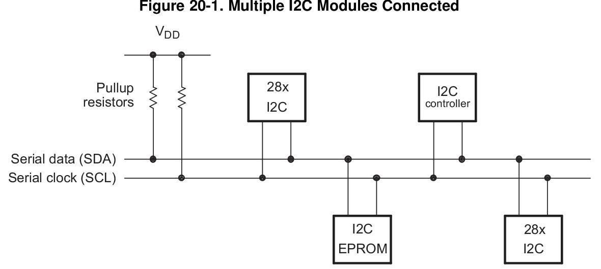

#### 20.1.1 Features

The I2C module has the following features:

- Compliance with the NXP Semiconductors I2C bus specification (version 2.1):

- Support for 8-bit format transfers

- 7-bit and 10-bit addressing modes

- General call

- START byte mode

- Support for multiple master-transmitters and slave-receivers

- Support for multiple slave-transmitters and master-receivers

- Combined master transmit/receive and receive/transmit mode

- Data transfer rate from 10 kbps up to 400 kbps (Fast-mode)

- Receive FIFO and Transmitter FIFO (16-deep x 8-bit FIFO)

- Supports two ePIE interrupts:

- I2Cx Interrupt - Any of the below events can be configured to generate an I2Cx interrupt:

- Transmit-data ready

- Receive-data ready

- Register-access ready

- No-acknowledgment received

- Arbitration lost

- Stop condition detected

- Addressed as slave

- I2Cx_FIFO interrupts:

- Transmit FIFO interrupt

- Receive FIFO interrupt

- Module enable/disable capability

- Free data format mode

#### 20.1.2 Features Not Supported

The I2C module does not support:

- High-speed mode (Hs-mode)

- CBUS-compatibility mode

#### 20.1.3 Functional Overview

Each device connected to an I2C bus is recognized by a unique address. Each device can operate as either a transmitter or a receiver, depending on the function of the device. A device connected to the I2C bus can also be considered as the master or the slave when performing data transfers. A master device is the device that initiates a data transfer on the bus and generates the clock signals to permit that transfer. During this transfer, any device addressed by this master is considered a slave. The I2C module supports the multi-master mode, in which one or more devices capable of controlling an I2C bus can be connected to the same I2C bus.

For data communication, the I2C module has a serial data pin (SDA) and a serial clock pin (SCL), as shown in Section 20.6. These two pins carry information between the 28x device and other devices connected to the I2C bus. The SDA and SCL pins both are bidirectional. They each must be connected to a positive supply voltage using a pull-up resistor. When the bus is free, both pins are high. The driver of these two pins has an open-drain configuration to perform the required wired-AND function.

There are two major transfer techniques: .

- Standard Mode: Send exactly n data values, where n is a value you program in an I2C module register. See Section 20.6 for more information.

- Repeat Mode: Keep sending data values until you use software to initiate a STOP condition or a new START condition. See Registers for RM bit information.

The I2C module consists of the following primary blocks:

- A serial interface: one data pin (SDA) and one clock pin (SCL)

- Data registers and FIFOs to temporarily hold receive data and transmit data traveling between the SDA pin and the CPU

- Control and status registers

- A peripheral bus interface to enable the CPU to access the I2C module registers and FIFOs.

- A clock synchronizer to synchronize the I2C input clock (from the device clock generator) and the clock on the SCL pin, and to synchronize data transfers with masters of different clock speeds

- A prescaler to divide down the input clock that is driven to the I2C module

- A noise filter on each of the two pins, SDA and SCL

- An arbitrator to handle arbitration between the I2C module (when it is a master) and another master

- Interrupt generation logic, so that an interrupt can be sent to the CPU

- FIFO interrupt generation logic, so that FIFO access can be synchronized to data reception and data transmission in the I2C module

Figure 20-2 shows the four registers used for transmission and reception in non-FIFO mode. The CPU writes data for transmission to I2CDXR and reads received data from I2CDRR. When the I2C module is configured as a transmitter, data written to I2CDXR is copied to I2CXSR and shifted out on the SDA pin one bit at a time. When the I2C module is configured as a receiver, received data is shifted into I2CRSR and then copied to I2CDRR.

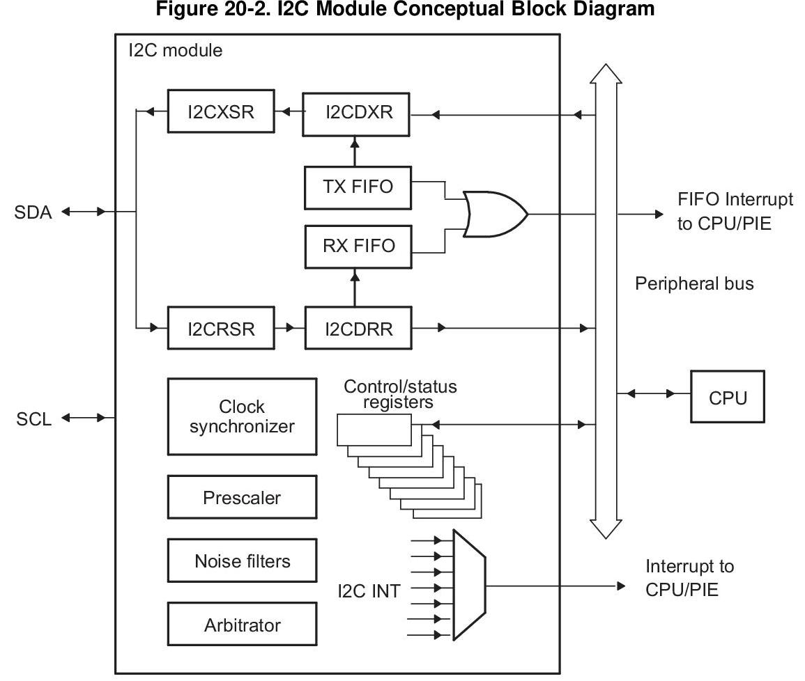

#### 20.1.4 Clock Generation

The I2C module clock determines the frequency at which the I2C module operates. A programmable prescaler in the I2C module divides down the SYSCLK to produce the I2C module clock and this I2C module clock is divided further to produce the I2C master clock on the SCL pin. Figure 20-3 shows the clock generation diagram for I2C module.

Figure 20-3. Clocking Diagram for the I2C Module

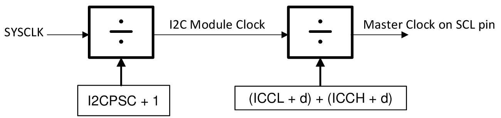

To specify the divide-down value, initialize the IPSC field of the prescaler register, I2CPSC. The resulting frequency is:

\[
\text{ I2C Module Clock (Fmod) } = \frac{\text{ SYSCLK }}{\left( {12}\mathrm{{CPSC}} + 1\right) }
\]

NOTE: To meet all of the I2C protocol timing specifications, the I2C module clock must be between 7 - 12 MHz.

The prescaler must be initialized only while the I2C module is in the reset state (IRS = 0 in I2CMDR). The prescaled frequency takes effect only when IRS is changed to 1. Changing the IPSC value while IRS = 1 has no effect.

The master clock appears on the SCL pin when the I2C module is configured to be a master on the I2C bus. This clock controls the timing of communication between the I2C module and a slave. As shown in Figure 20-3, a second clock divider in the I2C module divides down the module clock to produce the master clock. The clock divider uses the ICCL value of I2CCLKL to divide down the low portion of the module clock signal and uses the ICCH value of I2CCLKH to divide down the high portion of the module clock signal. See Section 20.1.5 for the master clock frequency equation.

#### 20.1.5 I2C Clock Divider Registers (I2CCLKL and I2CCLKH)

As explained in Section 20.1.4, when the I2C module is a master, the I2C module clock is divided down further to use as the master clock on the SCL pin. As shown in Figure 20-4, the shape of the master clock depends on two divide-down values:

- ICCL in I2CCLKL. For each master clock cycle, ICCL determines the amount of time the signal is low.

- ICCH in I2CCKLH. For each master clock cycle, ICCH determines the amount of time the signal is high.

Figure 20-4. The Roles of the Clock Divide-Down Values (ICCL and ICCH)

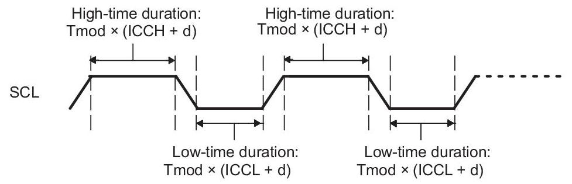

##### 20.1.5.1 Formula for the Master Clock Period

The master clock period (Tmst) is a multiple of the period of the I2C Module Clock (Tmod):

\[
\text{ Master Clock period (Tmst) } = \frac{\left\lbrack  \left( \mathrm{{ICCH}} + \mathrm{d}\right)  + \left( \mathrm{{ICCL}} + \mathrm{d}\right) \right\rbrack  }{\mathrm{I}2\mathrm{C}\text{ Module Clock (Fmod) }}
\]

where d depends on the divide-down value IPSC, as shown in Table 20-1. IPSC is described in the I2CPSC register.

Table 20-1. Dependency of Delay d on the Divide-Down Value IPSC

<table><tr><td>IPSC</td><td>d</td></tr><tr><td>0</td><td>7</td></tr><tr><td>1</td><td>6</td></tr><tr><td>Greater than 1</td><td>5</td></tr></table>

### 20.2 Configuring Device Pins

The GPIO mux registers must be configured to connect this peripheral to the device pins. To avoid glitches on the pins, the GPyGMUX bits must be configured first (while keeping the corresponding GPyMUX bits at the default of zero), followed by writing the GPyMUX register to the desired value.

Some IO functionality is defined by GPIO register settings independent of this peripheral. For input signals, the GPIO input qualification should be set to asynchronous mode by setting the appropriate GPxQSELn register bits to 11b. The internal pullups can be configured in the GPyPUD register.

See the GPIO chapter for more details on GPIO mux and settings.

### 20.3 I2C Module Operational Details

This section provides an overview of the I2C bus protocol and how it is implemented.

#### 20.3.1 Input and Output Voltage Levels

One clock pulse is generated by the master device for each data bit transferred. Due to a variety of different technology devices that can be connected to the I2C bus, the levels of logic 0 (low) and logic 1 (high) are not fixed and depend on the associated level of \( {V}_{DD} \) . For details, see the data manual for your particular device.

#### 20.3.2 Data Validity

The data on SDA must be stable during the high period of the clock (see Figure 20-5). The high or low state of the data line, SDA, should change only when the clock signal on SCL is low.

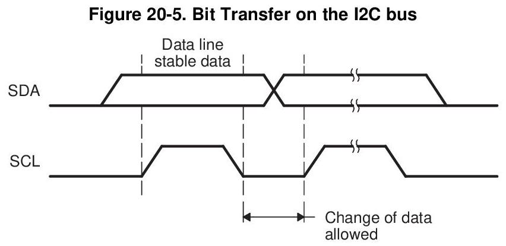

#### 20.3.3 Operating Modes

The I2C module has four basic operating modes to support data transfers as a master and as a slave. See Table 20-2 for the names and descriptions of the modes.

If the I2C module is a master, it begins as a master-transmitter and typically transmits an address for a particular slave. When giving data to the slave, the I2C module must remain a master-transmitter. To receive data from a slave, the I2C module must be changed to the master-receiver mode.

If the I2C module is a slave, it begins as a slave-receiver and typically sends acknowledgment when it recognizes its slave address from a master. If the master will be sending data to the I2C module, the module must remain a slave-receiver. If the master has requested data from the I2C module, the module must be changed to the slave-transmitter mode.

Table 20-2. Operating Modes of the I2C Module

<table><tr><td>Operating Mode</td><td>Description</td></tr><tr><td>Slave-receiver modes</td><td>The I2C module is a slave and receives data from a master.   All slaves begin in this mode. In this mode, serial data bits received on SDA are shifted in with the clock pulses that are generated by the master. As a slave, the I2C module does not generate the clock signal, but it can hold SCL low while the intervention of the device is required (RSFULL = 1 in I2CSTR) after a byte has been received. See section Section 20.3.7 for more details.</td></tr></table>

Table 20-2. Operating Modes of the I2C Module (continued)

<table><tr><td>Operating Mode</td><td>Description</td></tr><tr><td>Slave-transmitter mode</td><td>The I2C module is a slave and transmits data to a master.   This mode can be entered only from the slave-receiver mode; the I2C module must first receive a command from the master. When you are using any of the 7-bit/10-bit addressing formats, the I2C module enters its slave-transmitter mode if the slave address byte is the same as its own address (in I2COAR) and the master has transmitted R/W = 1. As a slave-transmitter, the I2C module then shifts the serial data out on SDA with the clock pulses that are generated by the master. While a slave, the I2C module does not generate the clock signal, but it can hold SCL low while the intervention of the device is required (XSMT = 0 in I2CSTR) after a byte has been transmitted. See section Section 20.3.7 for more details.</td></tr><tr><td>Master-receiver mode</td><td>The I2C module is a master and receives data from a slave.   This mode can be entered only from the master-transmitter mode; the I2C module must first transmit a command to the slave. When you are using any of the 7-bit/10-bit addressing formats, the I2C module enters its master-receiver mode after transmitting the slave address byte and R/W = 1. Serial data bits on SDA are shifted into the I2C module with the clock pulses generated by the I2C module on SCL. The clock pulses are inhibited and SCL is held low when the intervention of the device is required (RSFULL = 1 in I2CSTR) after a byte has been received.</td></tr><tr><td>Master-transmitter modes</td><td>The I2C module is a master and transmits control information and data to a slave.   All masters begin in this mode. In this mode, data assembled in any of the 7-bit/10-bit addressing formats is shifted out on SDA. The bit shifting is synchronized with the clock pulses generated by the I2C module on SCL. The clock pulses are inhibited and SCL is held low when the intervention of the device is required (XSMT = 0 in I2CSTR) after a byte has been transmitted.</td></tr></table>

To summarize, SCL will be held low in the following conditions:

- When an overrun condition is detected (RSFULL = 1), in Slave-receiver mode.

- When an underflow condition is detected (XSMT = 0), in Slave-transmitter mode.

I2C slave nodes have to accept and provide data when the I2C master node requests it.

- To release SCL in slave-receiver mode, read data from I2CDRR.

- To release SCL in slave-transmitter mode, write data to I2CDXR.

- To force a release without handling the data, reset the module using the I2CMDR.IRS bit.

Table 20-3. Master-Transmitter/Receiver Bus Activity Defined by the RM, STT, and STP Bits of I2CMDR

<table><tr><td>RM</td><td>STT</td><td>STP</td><td>Bus Activity(1)</td><td>Description</td></tr><tr><td>0</td><td>0</td><td>0</td><td>None</td><td>No activity</td></tr><tr><td>0</td><td>0</td><td>1</td><td>P</td><td>STOP condition</td></tr><tr><td>0</td><td>1</td><td>0</td><td>S-A-D..(n)..D.</td><td>START condition, slave address, \( n \) data bytes ( \( n = \) value in I2CCNT)</td></tr><tr><td>0</td><td>1</td><td>1</td><td>S-A-D..(n)..D-P</td><td>START condition, slave address, n data bytes, STOP condition (n = value in I2CCNT)</td></tr><tr><td>1</td><td>0</td><td>0</td><td>None</td><td>No activity</td></tr><tr><td>1</td><td>0</td><td>1</td><td>P</td><td>STOP condition</td></tr><tr><td>1</td><td>1</td><td>0</td><td>S-A-D-D-D.</td><td>Repeat mode transfer: START condition, slave address, continuous data transfers until STOP condition or next START condition</td></tr><tr><td>1</td><td>1</td><td>1</td><td>None</td><td>Reserved bit combination (No activity)</td></tr></table>

(1) \( \mathrm{S} = \) START condition; \( \mathrm{A} = \) Address; \( \mathrm{D} = \) Data byte; \( \mathrm{P} = \) STOP condition;

#### 20.3.4 I2C Module START and STOP Conditions

START and STOP conditions can be generated by the I2C module when the module is configured to be a master on the I2C bus. As shown in Figure 20-6:

- The START condition is defined as a high-to-low transition on the SDA line while SCL is high. A master drives this condition to indicate the start of a data transfer.

- The STOP condition is defined as a low-to-high transition on the SDA line while SCL is high. A master drives this condition to indicate the end of a data transfer.

Figure 20-6. I2C Module START and STOP Conditions

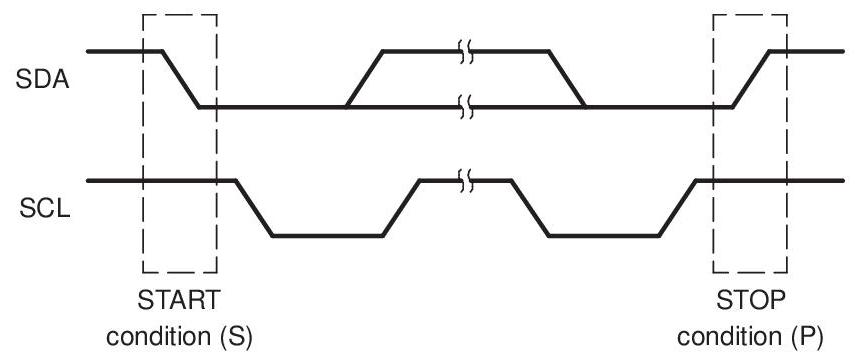

After a START condition and before a subsequent STOP condition, the I2C bus is considered busy, and the bus busy (BB) bit of I2CSTR is 1. Between a STOP condition and the next START condition, the bus is considered free, and BB is 0.

For the I2C module to start a data transfer with a START condition, the master mode bit (MST) and the START condition bit (STT) in I2CMDR must both be 1. For the I2C module to end a data transfer with a STOP condition, the STOP condition bit (STP) must be set to 1. When the BB bit is set to 1 and the STT bit is set to 1, a repeated START condition is generated. For a description of I2CMDR and its bits (including MST, STT, and STP), see Registers Section 20.6.

The I2C peripheral cannot detect a START or STOP condition while it is in reset (IRS = 0). The BB bit will remain in the cleared state (BB = 0) while the I2C peripheral is in reset (IRS = 0). When the I2C peripheral is taken out of reset (IRS set to 1) the BB bit will not correctly reflect the I2C bus status until a START or STOP condition is detected.

Follow these steps before initiating the first data transfer with I2C:

1. After taking the I2C peripheral out of reset by setting the IRS bit to 1, wait a period larger than the total time taken for the longest data transfer in the application. By waiting for a period of time after I2C comes out of reset, users can ensure that at least one START or STOP condition will have occurred on the I2C bus and been captured by the BB bit. After this period, the BB bit will correctly reflect the state of the I2C bus.

2. Check the BB bit and verify that BB \( = 0 \) (bus not busy) before proceeding.

3. Begin data transfers.

Not resetting the I2C peripheral in between transfers ensures that the BB bit reflects the actual bus status. If users must reset the I2C peripheral in between transfers, repeat steps 1 through 3 every time the I2C peripheral is taken out of reset.

#### 20.3.5 Serial Data Formats

Figure 20-7 shows an example of a data transfer on the I2C bus. The I2C module supports 1 to 8-bit data values. In Figure 20-7, 8-bit data is transferred. Each bit put on the SDA line equates to 1 pulse on the SCL line, and the values are always transferred with the most significant bit (MSB) first. The number of data values that can be transmitted or received is unrestricted. The serial data format used in Figure 20-7 is the 7-bit addressing format. The I2C module supports the formats shown in Figure 20-8 through Figure 20-10 and described in the paragraphs that follow the figures.

---

NOTE: In Figure 20-7 through Figure 20-10, n = the number of data bits (from 1 to 8) specified by

	the bit count (BC) field of I2CMDR.

---

Figure 20-7. I2C Module Data Transfer (7-Bit Addressing with 8-bit Data Configuration Shown)

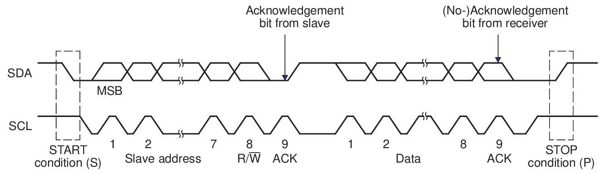

##### 20.3.5.1 7-Bit Addressing Format

The 7-bit addressing format is the default format after reset. Disabling expanded address (I2CMDR.XA = 0) and free data format (I2CMDR.FDF = 0) enables 7-bit addressing format.

In this format (see Figure 20-8), the first byte after a START condition (S) consists of a 7-bit slave address followed by a R/W bit. R/W determines the direction of the data:

- R/W = 0: The I2C master writes (transmits) data to the addressed slave. This can be achieved by setting I2CMDR.TRX = 1 (Transmitter mode)

- \( \mathrm{R}/\overline{\mathrm{W}} = 1 \) : The I2C master reads (receives) data from the slave. This can be achieved by setting I2CMDR.TRX = 0 (Receiver mode)

Figure 20-8. I2C Module 7-Bit Addressing Format (FDF = 0, XA = 0 in I2CMDR)

<table><tr><td>1</td><td></td><td>1</td><td>1</td><td>n</td><td>1</td><td></td><td>1</td><td>1</td></tr><tr><td>S</td><td>xxxxxxx</td><td>R/W</td><td>ACK</td><td>Data</td><td>ACK</td><td>Data</td><td>ACK</td><td>P</td></tr></table>

| 7 bits of slave address

An extra clock cycle dedicated for acknowledgment (ACK) is inserted after each byte. If the ACK bit is inserted by the slave after the first byte from the master, it is followed by n bits of data from the transmitter (master or slave, depending on the R/W bit). n is a number from 1 to 8 determined by the bit count (BC) field of I2CMDR. After the data bits have been transferred, the receiver inserts an ACK bit.

##### 20.3.5.2 10-Bit Addressing Format

The 10-bit addressing format can be enabled by setting expanded address (I2CMDR.XA = 1) and disabling free data format (I2CMDR.FDF = 0).

The 10-bit addressing format (see Figure 20-9) is similar to the 7-bit addressing format, but the master sends the slave address in two separate byte transfers. The first byte consists of 11110b, the two MSBs of the 10-bit slave address, and R/W. The second byte is the remaining 8 bits of the 10-bit slave address. The slave must send acknowledgment after each of the two byte transfers. Once the master has written the second byte to the slave, the master can either write data or use a repeated START condition to change the data direction. For more details about using 10-bit addressing, see the NXP Semiconductors I2C bus specification.

Figure 20-9. I2C Module 10-Bit Addressing Format (FDF = 0, XA = 1 in I2CMDR)

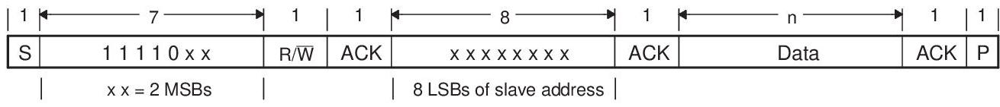

##### 20.3.5.3 Free Data Format

The free data format can be enabled by setting I2CMDR. FDF = 1.

In this format (see Figure 20-10), the first byte after a START condition (S) is a data byte. An ACK bit is inserted after each data byte, which can be from 1 to 8 bits, depending on the BC field of I2CMDR. No address or data-direction bit is sent. Therefore, the transmitter and the receiver must both support the free data format, and the direction of the data must be constant throughout the transfer.

Figure 20-10. I2C Module Free Data Format (FDF = 1 in I2CMDR)

<table><tr><td></td><td>1</td><td></td><td>1</td><td></td><td>1</td><td>1</td></tr><tr><td>S Data</td><td>ACK</td><td>Data</td><td>ACK</td><td>Data</td><td>ACK</td><td>P</td></tr></table>

NOTE: The free data format is not supported in the digital loopback mode (I2CMDR.DLB = 1).

Table 20-4. How the MST and FDF Bits of I2CMDR Affect the Role of the TRX Bit of I2CMDR

<table><tr><td>MST</td><td>FDF</td><td>I2C Module State</td><td>Function of TRX</td></tr><tr><td>0</td><td>0</td><td>In slave mode but not free data format mode</td><td>TRX is a don't care. Depending on the command from the master, the I2C module responds as a receiver or a transmitter.</td></tr><tr><td>0</td><td>1</td><td>In slave mode and free data format mode</td><td>The free data format mode requires that the I2C module remains the transmitter or the receiver throughout the transfer. TRX identifies the role of the I2C module:   TRX = 1: The I2C module is a transmitter.   TRX = 0: The I2C module is a receiver.</td></tr><tr><td>1</td><td>0</td><td>In master mode but not free data format mode</td><td>TRX = 1: The I2C module is a transmitter.   TRX \( = 0 \) : The I2C module is a receiver.</td></tr><tr><td>1</td><td>1</td><td>In master mode and free data format mode</td><td>TRX = 0: The I2C module is a receiver.   TRX \( = 1 \) : The I2C module is a transmitter.</td></tr></table>

##### 20.3.5.4 Using a Repeated START Condition

I2C master can communicate with multiple slave addresses without having to give up control of the I2C bus by driving a STOP condition. This can be achieved by driving another START condition at the end of each data type. The repeated START condition can be used with the 7-bit addressing, 10-bit addressing, and free data formats. Figure 20-11 shows a repeated START condition in the 7-bit addressing format.

Figure 20-11. Repeated START Condition (in This Case, 7-Bit Addressing Format)

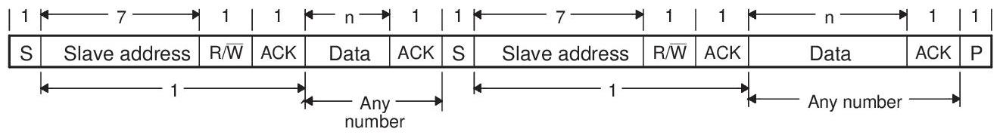

NOTE: In Figure 20-11, n = the number of data bits (from 1 to 8) specified by the bit count (BC) field of I2CMDR.

#### 20.3.6 NACK Bit Generation

When the I2C module is a receiver (master or slave), it can acknowledge or ignore bits sent by the transmitter. To ignore any new bits, the I2C module must send a no-acknowledge (NACK) bit during the acknowledge cycle on the bus. Table 20-5 summarizes the various ways you can tell the I2C module to send a NACK bit.

Table 20-5. Ways to Generate a NACK Bit

<table><tr><td>I2C Module Condition</td><td>NACK Bit Generation Options</td></tr><tr><td>Slave-receiver modes</td><td>- Allow an overrun condition (RSFULL = 1 in I2CSTR)   - Reset the module (IRS = 0 in I2CMDR)   - Set the NACKMOD bit of I2CMDR before the rising edge of the last data bit you intend to receive</td></tr><tr><td>Master-receiver mode AND Repeat mode (RM = 1 in I2CMDR)</td><td>- Generate a STOP condition (STP = 1 in I2CMDR)   - Reset the module (IRS = 0 in I2CMDR)   - Set the NACKMOD bit of I2CMDR before the rising edge of the last data bit you intend to receive</td></tr><tr><td>Master-receiver mode AND   Nonrepeat mode   (RM = 0 in I2CMDR)</td><td>- If STP = 1 in I2CMDR, allow the internal data counter to count down to 0 and thus force a STOP condition   - If STP = 0, make STP = 1 to generate a STOP condition   - Reset the module (IRS = 0 in I2CMDR). = 1 to generate a STOP condition   - Set the NACKMOD bit of I2CMDR before the rising edge of the last data bit you intend to receive</td></tr></table>

#### 20.3.7 Clock Synchronization

Under normal conditions, only one master device generates the clock signal, SCL. During the arbitration procedure, however, there are two or more masters and the clock must be synchronized so that the data output can be compared. Figure 20-12 illustrates the clock synchronization. The wired-AND property of SCL means that a device that first generates a low period on SCL overrules the other devices. At this high-to-low transition, the clock generators of the other devices are forced to start their own low period. The SCL is held low by the device with the longest low period. The other devices that finish their low periods must wait for SCL to be released, before starting their high periods. A synchronized signal on SCL is obtained, where the slowest device determines the length of the low period and the fastest device determines the length of the high period.

If a device pulls down the clock line for a longer time, the result is that all clock generators must enter the wait state. In this way, a slave slows down a fast master and the slow device creates enough time to store a received byte or to prepare a byte to be transmitted.

Figure 20-12. Synchronization of Two I2C Clock Generators During Arbitration

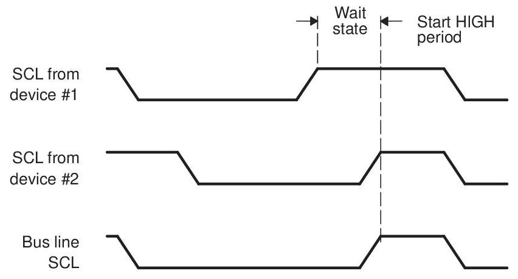

#### 20.3.8 Arbitration

If two or more master-transmitters attempt to start a transmission on the same bus at approximately the same time, an arbitration procedure is invoked. The arbitration procedure uses the data presented on the serial data bus (SDA) by the competing transmitters. Figure 20-13 illustrates the arbitration procedure between two devices. The first master-transmitter that releases the SDA line high is overruled by another master-transmitter that drives the SDA low. The arbitration procedure gives priority to the device that transmits the serial data stream with the lowest binary value. Should two or more devices send identical first bytes, arbitration continues on the subsequent bytes.

If the I2C module is the losing master, it switches to the slave-receiver mode, sets the arbitration lost (ARBL) flag, and generates the arbitration-lost interrupt request.

If during a serial transfer the arbitration procedure is still in progress when a repeated START condition or a STOP condition is transmitted to SDA, the master-transmitters involved must send the repeated START condition or the STOP condition at the same position in the format frame. Arbitration is not allowed between:

- A repeated START condition and a data bit

- A STOP condition and a data bit

- A repeated START condition and a STOP condition

Figure 20-13. Arbitration Procedure Between Two Master-Transmitters

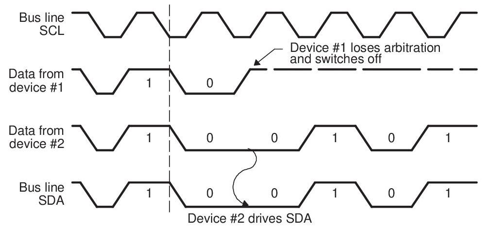

#### 20.3.9 Digital Loopback Mode

The I2C module support a self-test mode called digital loopback, which is enabled by setting the DLB bit in the I2CMDR register. In this mode, data transmitted out of the I2CDXR register is received in the I2CDRR register. The data follows an internal path, and takes n cycles to reach I2CDRR, where:

n = 8 * (SYSCLK) / (I2C module clock (Fmod))

The transmit clock and the receive clock are the same. The address seen on the external SDA pin is the address in the I2COAR register. Figure 20-14 shows the signal routing in digital loopback mode.

Figure 20-14. Pin Diagram Showing the Effects of the Digital Loopback Mode (DLB) Bit

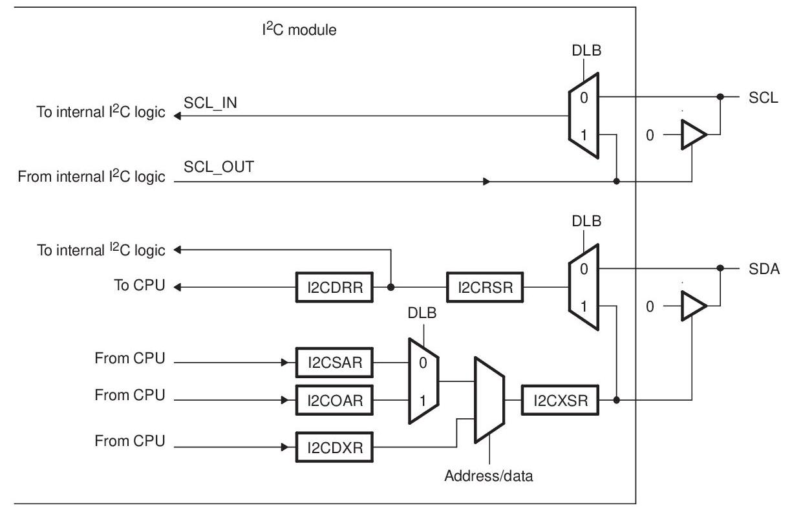

NOTE: The free data format (I2CMDR.FDF = 1) is not supported in digital loopback mode.

### 20.4 Interrupt Requests Generated by the I2C Module

Each I2C module can generate two CPU interrupts.

1. Basic I2C interrupt: Possible basic I2C interrupt sources which can trigger this interrupt are described in Section 20.4.1.

2. I2C FIFO interrupt: Possible I2C FIFO interrupt sources which can trigger this interrupt are described in Section 20.4.2

#### 20.4.1 Basic I2C Interrupt Requests

The I2C module generates the interrupt requests described in Table 20-6. As shown in Figure 20-15, all requests are multiplexed through an arbiter to a single I2C interrupt request to the CPU. Each interrupt request has a flag bit in the status register (I2CSTR) and an enable bit in the interrupt enable register (I2CIER). When one of the specified events occurs, its flag bit is set. If the corresponding enable bit is 0, the interrupt request is blocked. If the enable bit is 1, the request is forwarded to the CPU as an I2C interrupt.

The I2C interrupt is one of the maskable interrupts of the CPU. As with any maskable interrupt request, if it is properly enabled in the CPU, the CPU executes the corresponding interrupt service routine (I2CINT1A_ISR). The I2CINT1A_ISR for the I2C interrupt can determine the interrupt source by reading the interrupt source register, I2CISRC. Then the I2CINT1A_ISR can branch to the appropriate subroutine.

After the CPU reads I2CISRC, the following events occur:

1. The flag for the source interrupt is cleared in I2CSTR. Exception: The ARDY, RRDY, and XRDY bits in I2CSTR are not cleared when I2CISRC is read. To clear one of these bits, write a 1 to it.

2. The arbiter determines which of the remaining interrupt requests has the highest priority, writes the code for that interrupt to I2CISRC, and forwards the interrupt request to the CPU.

Table 20-6. Descriptions of the Basic I2C Interrupt Requests

<table><tr><td>I2C Interrupt Request</td><td>Interrupt Source</td></tr><tr><td>XRDYINT</td><td>Transmit ready condition: The data transmit register (I2CDXR) is ready to accept new data because the previous data has been copied from I2CDXR to the transmit shift register (I2CXSR).   As an alternative to using XRDYINT, the CPU can poll the XRDY bit of the status register, I2CSTR. XRDYINT should not be used when in FIFO mode. Use the FIFO interrupts instead.</td></tr><tr><td>RRDYINT</td><td>Receive ready condition: The data receive register (I2CDRR) is ready to be read because data has been copied from the receive shift register (I2CRSR) to I2CDRR.   As an alternative to using RRDYINT, the CPU can poll the RRDY bit of I2CSTR. RRDYINT should not be used when in FIFO mode. Use the FIFO interrupts instead.</td></tr><tr><td>ARDYINT</td><td>Register-access ready condition: The I2C module registers are ready to be accessed because the previously programmed address, data, and command values have been used.   The specific events that generate ARDYINT are the same events that set the ARDY bit of I2CSTR.   As an alternative to using ARDYINT, the CPU can poll the ARDY bit.</td></tr><tr><td>NACKINT</td><td>No-acknowledgment condition: The I2C module is configured as a master-transmitter and did not received acknowledgment from the slave-receiver.   As an alternative to using NACKINT, the CPU can poll the NACK bit of I2CSTR.</td></tr><tr><td>ARBLINT</td><td>Arbitration-lost condition: The I2C module has lost an arbitration contest with another master-transmitter.   As an alternative to using ARBLINT, the CPU can poll the ARBL bit of I2CSTR.</td></tr><tr><td>SCDINT</td><td>Stop condition detected: A STOP condition was detected on the I2C bus.   As an alternative to using SCDINT, the CPU can poll the SCD bit of the status register, I2CSTR.</td></tr><tr><td>AASINT</td><td>Addressed as slave condition: The I2C has been addressed as a slave device by another master on the I2C bus.   As an alternative to using AASINT, the CPU can poll the AAS bit of the status register, I2CSTR.</td></tr></table>

Figure 20-15. Enable Paths of the I2C Interrupt Requests

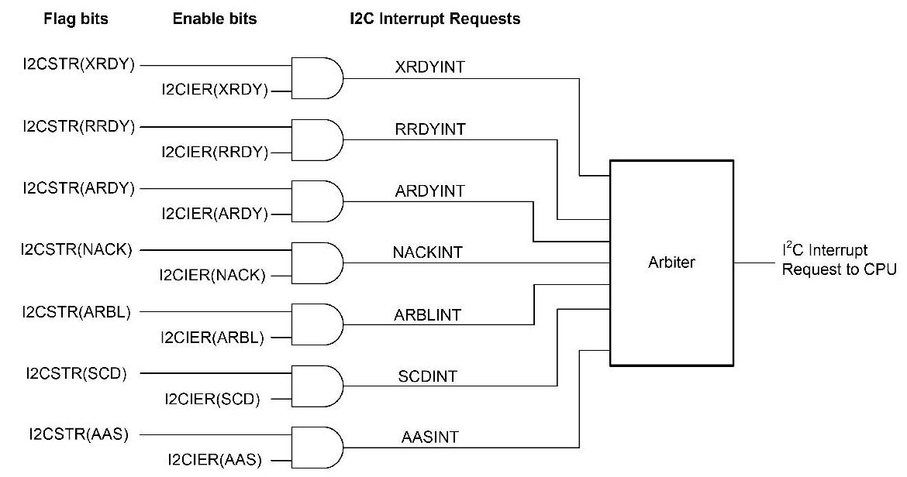

The I2C module has a backwards compatibility bit (BC) in the I2CEMDR register. The timing diagram in Figure 20-16 demonstrates the effect the backwards compatibility bit has on I2C module registers and interrupts when configured as a slave-transmitter.

Figure 20-16. Backwards Compatibility Mode Bit, Slave Transmitter

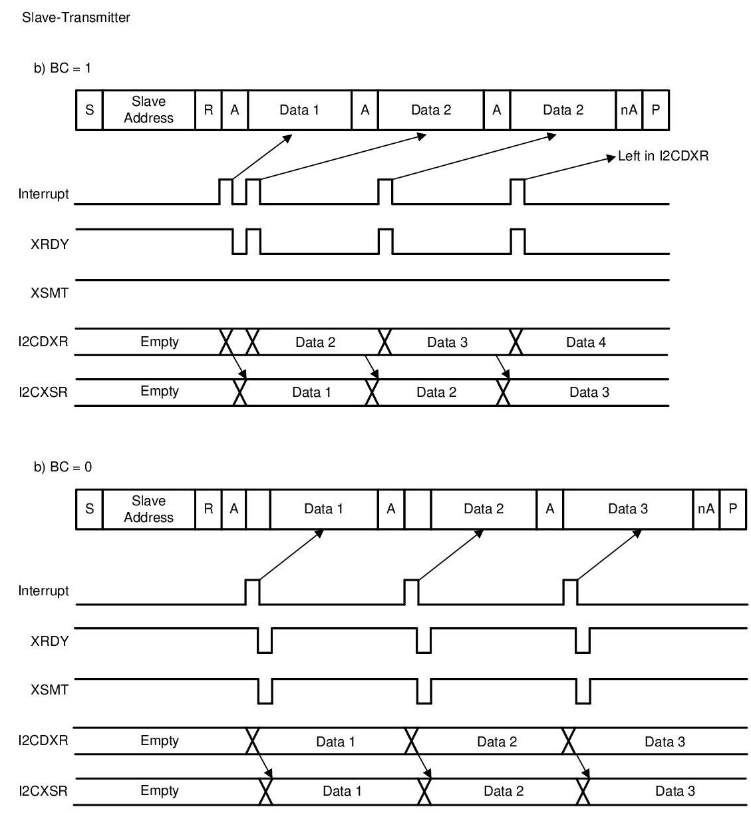

#### 20.4.2 I2C FIFO Interrupts

In addition to the seven basic I2C interrupts, the transmit and receive FIFOs each contain the ability to generate an interrupt (I2CINT2A). The transmit FIFO can be configured to generate an interrupt after transmitting a defined number of bytes, up to 16 . The receive FIFO can be configured to generate an interrupt after receiving a defined number of bytes, up to 16. These two interrupt sources are ORed together into a single maskable CPU interrupt. Figure 20-17 shows the structure of I2C FIFO interrupt. The interrupt service routine can then read the FIFO interrupt status flags to determine from which source the interrupt came. See the I2C transmit FIFO register (I2CFFTX) and the I2C receive FIFO register (I2CFFRX) descriptions.

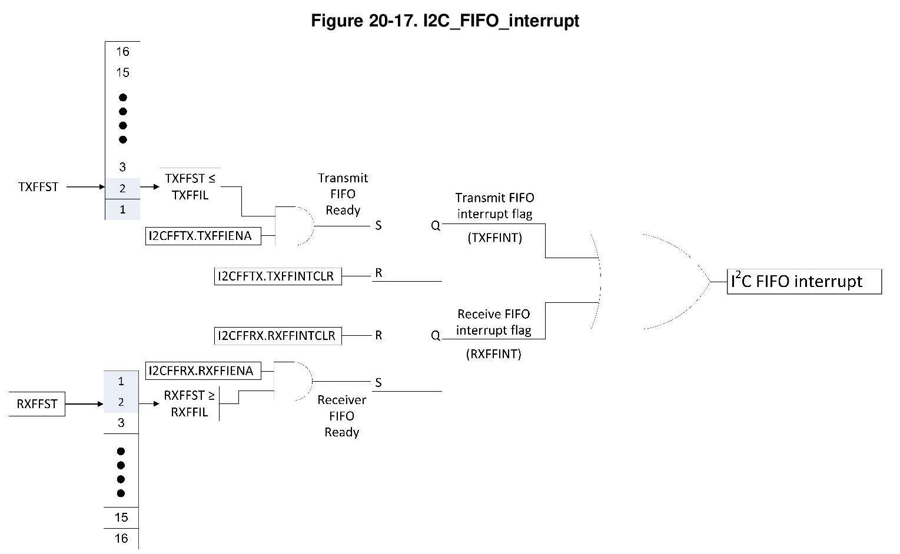

### 20.5 Resetting or Disabling the I2C Module

You can reset or disable the I2C module in two ways:

- Write 0 to the I2C reset bit (IRS) in the I2C mode register (I2CMDR). All status bits (in I2CSTR) are forced to their default values, and the I2C module remains disabled until IRS is changed to 1. The SDA and SCL pins are in the high-impedance state.

- Initiate a device reset by driving the XRS pin low. The entire device is reset and is held in the reset state until you drive the pin high. When the XRS pin is released, all I2C module registers are reset to their default values. The IRS bit is forced to 0, which resets the I2C module. The I2C module stays in the reset state until you write 1 to IRS.

The IRS must be 0 while you configure or reconfigure the I2C module. Forcing IRS to 0 can be used to save power and to clear error conditions.

### 20.6 I2C Registers

This section describes the C28x I2C Module Registers.

#### 20.6.1 I2C Base Addresses

Table 20-7. I2C Base Address Table (C28)

<table><tr><td colspan="2">Bit Field Name</td><td rowspan="2">DriverLib Name</td><td rowspan="2">Base Address</td><td rowspan="2">CPU1</td><td rowspan="2">CPU2</td><td rowspan="2">DMA</td><td rowspan="2">CLA</td><td rowspan="2">Pipeline Protected</td></tr><tr><td>Instance</td><td>Structure</td></tr><tr><td>I2caRegs</td><td>I2C_REGS</td><td>I2CA_BASE</td><td>0x0000_7300</td><td>YES</td><td>YES</td><td>-</td><td>-</td><td>YES</td></tr><tr><td>I2cbRegs</td><td>I2C_REGS</td><td>I2CB_BASE</td><td>0x0000_7340</td><td>YES</td><td>YES</td><td>-</td><td>-</td><td>YES</td></tr></table>

#### 20.6.2 I2C_REGS Registers

Table 20-8 lists the I2C_REGS registers. All register offset addresses not listed in Table 20-8 should be considered as reserved locations and the register contents should not be modified.

Table 20-8. I2C_REGS Registers

<table><tr><td>Offset</td><td>Acronym</td><td>Register Name</td><td>Write Protection</td><td>Section</td></tr><tr><td>0h</td><td>I2COAR</td><td>I2C Own address</td><td></td><td>Go</td></tr><tr><td>1h</td><td>I2CIER</td><td>I2C Interrupt Enable</td><td></td><td>Go</td></tr><tr><td>2h</td><td>I2CSTR</td><td>I2C Status</td><td></td><td>Go</td></tr><tr><td>3h</td><td>I2CCLKL</td><td>I2C Clock low-time divider</td><td></td><td>Go</td></tr><tr><td>4h</td><td>I2CCLKH</td><td>I2C Clock high-time divider</td><td></td><td>Go</td></tr><tr><td>5h</td><td>I2CCNT</td><td>I2C Data count</td><td></td><td>Go</td></tr><tr><td>6h</td><td>I2CDRR</td><td>I2C Data receive</td><td></td><td>Go</td></tr><tr><td>7h</td><td>I2CSAR</td><td>I2C Slave address</td><td></td><td>Go</td></tr><tr><td>8h</td><td>I2CDXR</td><td>I2C Data Transmit</td><td></td><td>Go</td></tr><tr><td>9h</td><td>I2CMDR</td><td>I2C Mode</td><td></td><td>Go</td></tr><tr><td>Ah</td><td>I2CISRC</td><td>I2C Interrupt Source</td><td></td><td>Go</td></tr><tr><td>Bh</td><td>I2CEMDR</td><td>I2C Extended Mode</td><td></td><td>Go</td></tr><tr><td>Ch</td><td>I2CPSC</td><td>I2C Prescaler</td><td></td><td>Go</td></tr><tr><td>20h</td><td>I2CFFTX</td><td>I2C FIFO Transmit</td><td></td><td>Go</td></tr><tr><td>21h</td><td>I2CFFRX</td><td>I2C FIFO Receive</td><td></td><td>Go</td></tr></table>

Complex bit access types are encoded to fit into small table cells. Table 20-9 shows the codes that are used for access types in this section.

Table 20-9. I2C_REGS Access Type Codes

<table><tr><td>Access Type</td><td>Code</td><td>Description</td></tr><tr><td colspan="3">Read Type</td></tr><tr><td>R</td><td>R</td><td>Read</td></tr><tr><td>R-0</td><td>R   -0</td><td>Read   Returns 0s</td></tr><tr><td colspan="3">Write Type</td></tr><tr><td>W</td><td>W</td><td>Write</td></tr><tr><td>W1C</td><td>W   1C</td><td>Write   1 to clear</td></tr><tr><td>W1S</td><td>W   1S</td><td>Write   1 to set</td></tr><tr><td colspan="3">Reset or Default Value</td></tr><tr><td>-n</td><td></td><td>Value after reset or the default value</td></tr><tr><td colspan="3">Register Array Variables</td></tr><tr><td>i, j, k, l, m, n</td><td></td><td>When these variables are used in a register name, an offset, or an address, they refer to the value of a register array where the register is part of a group of repeating registers. The register groups form a hierarchical structure and the array is represented with a formula.</td></tr><tr><td>y</td><td></td><td>When this variable is used in a register name, an offset, or an address it refers to the value of a register array.</td></tr></table>

##### 20.6.2.1 I2COAR Register (Offset = 0h) [reset = 0h]

I2COAR is shown in Figure 20-18 and described in Table 20-10.

Return to the Summary Table.

The I2C own address register (I2COAR) is a 16-bit register. The I2C module uses this register to specify its own slave address, which distinguishes it from other slaves connected to the I2C-bus. If the 7-bit addressing mode is selected (XA = 0 in I2CMDR), only bits 6-0 are used write 0s to bits 9-7.

Figure 20-18. I2COAR Register

<table><tr><td>15</td><td>14</td><td>13</td><td>12</td><td>11</td><td>10</td><td>9</td><td>8</td></tr><tr><td></td><td colspan="4">RESERVED</td><td></td><td colspan="2">OAR</td></tr><tr><td colspan="5">R-0h</td><td colspan="3">R/W-0h</td></tr><tr><td>7</td><td>6</td><td>5</td><td>4</td><td>3</td><td>2</td><td>1</td><td>0</td></tr><tr><td></td><td></td><td></td><td>OAR</td><td></td><td></td><td></td><td></td></tr><tr><td colspan="8">R/W-0h</td></tr></table>

Table 20-10. I2COAR Register Field Descriptions

<table><tr><td>Bit</td><td>Field</td><td>Type</td><td>Reset</td><td>Description</td></tr><tr><td>15-10</td><td>RESERVED</td><td>R</td><td>0h</td><td>Reserved</td></tr><tr><td>9-0</td><td>OAR</td><td>R/W</td><td>Oh</td><td>In 7-bit addressing mode (XA = 0 in I2CMDR):   00h-7Fh Bits 6-0 provide the 7-bit slave address of the I2C module. Write 0s to bits 9-7.   In 10-bit addressing mode (XA = 1 in I2CMDR):   000h-3FFh Bits 9-0 provide the 10-bit slave address of the I2C module.   Reset type: SYSRSn</td></tr></table>

20.6.2.2 I2CIER Register (Offset = 1h) [reset = 0h]

I2CIER is shown in Figure 20-19 and described in Table 20-11.

Return to the Summary Table.

I2CIER is used by the CPU to individually enable or disable I2C interrupt requests.

Figure 20-19. I2CIER Register

<table><tr><td>15</td><td>14</td><td>13</td><td>12</td><td>11</td><td>10</td><td>9</td><td>8</td></tr><tr><td></td><td></td><td></td><td colspan="2">RESERVED</td><td></td><td></td><td></td></tr><tr><td colspan="8">R-0h</td></tr><tr><td>7</td><td>6</td><td>5</td><td>4</td><td>3</td><td>2</td><td>1</td><td>0</td></tr><tr><td>RESERVED</td><td>AAS</td><td>SCD</td><td>XRDY</td><td>RRDY</td><td>ARDY</td><td>NACK</td><td>ARBL</td></tr><tr><td>R-0h</td><td>R/W-0h</td><td>R/W-0h</td><td>R/W-0h</td><td>R/W-0h</td><td>R/W-0h</td><td>R/W-0h</td><td>R/W-0h</td></tr></table>

Table 20-11. I2CIER Register Field Descriptions

<table><tr><td>Bit</td><td>Field</td><td>Type</td><td>Reset</td><td>Description</td></tr><tr><td>15-7</td><td>RESERVED</td><td>R</td><td>0h</td><td>Reserved</td></tr><tr><td>6</td><td>AAS</td><td>R/W</td><td>0h</td><td>Addressed as slave interrupt enable   Reset type: SYSRSn   0h (R/W) = Interrupt request disabled   1h (R/W) = Interrupt request enabled</td></tr><tr><td>5</td><td>SCD</td><td>R/W</td><td>0h</td><td>Stop condition detected interrupt enable Reset type: SYSRSn   Oh (R/W) = Interrupt request disabled   1h (R/W) = Interrupt request enabled</td></tr><tr><td>4</td><td>XRDY</td><td>R/W</td><td>0h</td><td>Transmit-data-ready interrupt enable bit.   This bit should not be set when using FIFO mode.   Reset type: SYSRSn   0h (R/W) = Interrupt request disabled   1h (R/W) = Interrupt request enabled</td></tr><tr><td>3</td><td>RRDY</td><td>R/W</td><td>0h</td><td>Receive-data-ready interrupt enable bit.   This bit should not be set when using FIFO mode.   Reset type: SYSRSn   Oh (R/W) = Interrupt request disabled   1h (R/W) = Interrupt request enabled</td></tr><tr><td>2</td><td>ARDY</td><td>R/W</td><td>0h</td><td>Register-access-ready interrupt enable   Reset type: SYSRSn   0h (R/W) = Interrupt request disabled   1h (R/W) = Interrupt request enabled</td></tr><tr><td>1</td><td>NACK</td><td>R/W</td><td>0h</td><td>No-acknowledgment interrupt enable   Reset type: SYSRSn   0h (R/W) = Interrupt request disabled   1h (R/W) = Interrupt request enabled</td></tr><tr><td>0</td><td>ARBL</td><td>R/W</td><td>0h</td><td>Arbitration-lost interrupt enable   Reset type: SYSRSn   0h (R/W) = Interrupt request disabled   1h (R/W) = Interrupt request enabled</td></tr></table>

##### 20.6.2.3 I2CSTR Register (Offset = 2h) [reset = 410h]

I2CSTR is shown in Figure 20-20 and described in Table 20-12.

Return to the Summary Table.

The I2C status register (I2CSTR) is a 16-bit register used to determine which interrupt has occurred and to read status information.

Figure 20-20. I2CSTR Register

<table><tr><td>15</td><td>14</td><td>13</td><td>12</td><td>11</td><td>10</td><td>9</td><td>8</td></tr><tr><td>RESERVED</td><td>SDIR</td><td>NACKSNT</td><td>BB</td><td>RSFULL</td><td>XSMT</td><td>AAS</td><td>AD0</td></tr><tr><td>R-0h</td><td>R/W1C-0h</td><td>R/W1C-0h</td><td>R-0h</td><td>R-0h</td><td>R-1h</td><td>R-0h</td><td>R-0h</td></tr><tr><td>7</td><td>6</td><td>5</td><td>4</td><td>3</td><td>2</td><td>1</td><td>0</td></tr><tr><td colspan="2">RESERVED</td><td>SCD</td><td>XRDY</td><td>RRDY</td><td>ARDY</td><td>NACK</td><td>ARBL</td></tr><tr><td colspan="2">R/W-0h</td><td>R/W1C-0h</td><td>R-1h</td><td>R/W1C-0h</td><td>R/W1C-0h</td><td>R/W1C-0h</td><td>R/W1C-0h</td></tr></table>

Table 20-12. I2CSTR Register Field Descriptions

<table><tr><td>Bit</td><td>Field</td><td>Type</td><td>Reset</td><td>Description</td></tr><tr><td>15</td><td>RESERVED</td><td>R</td><td>0h</td><td>Reserved</td></tr><tr><td>14</td><td>SDIR</td><td>R/W1C</td><td>0h</td><td>Slave direction bit   Reset type: SYSRSn   0h (R/W) = I2C is not addressed as a slave transmitter. SDIR is cleared by one of the following events:   - It is manually cleared. To clear this bit, write a 1 to it.   - Digital loopback mode is enabled.   - A START or STOP condition occurs on the I2C bus.   \( 1\mathrm{\;h}\left( {\mathrm{R}/\mathrm{W}}\right)  = 1\mathrm{{ZC}} \) is addressed as a slave transmitter.</td></tr><tr><td>13</td><td>NACKSNT</td><td>R/W1C</td><td>0h</td><td>NACK sent bit.   This bit is used when the I2C module is in the receiver mode. One instance in which NACKSNT is affected is when the NACK mode is used (see the description for NACKMOD in   Reset type: SYSRSn   0h (R/W) = NACK not sent. NACKSNT bit is cleared by any one of the following events:   - It is manually cleared. To clear this bit, write a 1 to it.   - The I2C module is reset (either when 0 is written to the IRS bit of I2CMDR or when the whole device is reset).   \( 1\mathrm{\;h}\left( {\mathrm{R}/\mathrm{W}}\right)  = \) NACK sent: A no-acknowledge bit was sent during the acknowledge cycle on the I2C-bus.</td></tr><tr><td>12</td><td>BB</td><td>R</td><td>0h</td><td>Bus busy bit.   BB indicates whether the I2C-bus is busy or is free for another data transfer. See the paragraph following the table for more information   Reset type: SYSRSn   0h (R/W) = Bus free. BB is cleared by any one of the following events:   - The I2C module receives or transmits a STOP bit (bus free).   - The I2C module is reset.   1h (R/W) = Bus busy: The I2C module has received or transmitted a START bit on the bus.</td></tr></table>

Table 20-12. I2CSTR Register Field Descriptions (continued)

<table><tr><td>Bit</td><td>Field</td><td>Type</td><td>Reset</td><td>Description</td></tr><tr><td>11</td><td>RSFULL</td><td>R</td><td>0h</td><td>Receive shift register full bit.   RSFULL indicates an overrun condition during reception. Overrun occurs when new data is received into the shift register (I2CRSR) and the old data has not been read from the receive register (I2CDRR). As new bits arrive from the SDA pin, they overwrite the bits in I2CRSR. The new data will not be copied to ICDRR until the previous data is read.   Reset type: SYSRSn   0h (R/W) = No overrun detected. RSFULL is cleared by any one of the following events:   - I2CDRR is read is read by the CPU. Emulator reads of the I2CDRR do not affect this bit.   - The I2C module is reset.   1h (R/W) = Overrun detected</td></tr><tr><td>10</td><td>XSMT</td><td>R</td><td>1h</td><td>Transmit shift register empty bit.   XSMT = 0 indicates that the transmitter has experienced underflow. Underflow occurs when the transmit shift register (I2CXSR) is empty but the data transmit register (I2CDXR) has not been loaded since the last I2CDXR-to-I2CXSR transfer. The next I2CDXR-to-I2CXSR transfer will not occur until new data is in I2CDXR. If new data is no transferred in time, the previous data may be re-transmitted on the SDA pin.   Reset type: SYSRSn   0h (R/W) = Underflow detected (empty)   1h (R/W) = No underflow detected (not empty). XSMT is set by one of the following events:   - Data is written to I2CDXR   - The I2C module is reset</td></tr><tr><td>9</td><td>AAS</td><td>R</td><td>0h</td><td>Addressed-as-slave bit   Reset type: SYSRSn   Oh (R/W) = In the 7-bit addressing mode, the AAS bit is cleared when receiving a NACK, a STOP condition, or a repeated START condition. In the 10-bit addressing mode, the AAS bit is cleared when receiving a NACK, a STOP condition, or by a slave address different from the I2C peripheral's own slave address.   1h (R/W) = The I2C module has recognized its own slave address or an address of all zeros (general call).</td></tr><tr><td>8</td><td>AD0</td><td>R</td><td>0h</td><td>Address 0 bits   Reset type: SYSRSn   0h (R/W) = AD0 has been cleared by a START or STOP condition.   1h (R/W) = An address of all zeros (general call) is detected.</td></tr><tr><td>7-6</td><td>RESERVED</td><td>R/W</td><td>0h</td><td>Reserved</td></tr><tr><td>5</td><td>SCD</td><td>R/W1C</td><td>0h</td><td>Stop condition detected bit.   SCD is set when the I2C sends or receives a STOP condition. The I2C module delays clearing of the I2CMDR[STP] bit until the SCD bit is set.   Reset type: SYSRSn   0h (R/W) = STOP condition not detected since SCD was last cleared. SCD is cleared by any one of the following events:   - I2CISRC is read by the CPU when it contains the value 110b (stop condition detected). Emulator reads of the I2CISRC do not affect this bit.   - SCD is manually cleared. To clear this bit, write a 1 to it.   - The I2C module is reset.   1h (R/W) = A STOP condition has been detected on the I2C bus.</td></tr></table>

Table 20-12. I2CSTR Register Field Descriptions (continued)

<table><tr><td>Bit</td><td>Field</td><td>Type</td><td>Reset</td><td>Description</td></tr><tr><td>4</td><td>XRDY</td><td>R</td><td>1h</td><td>Transmit-data-ready interrupt flag bit.   When not in FIFO mode, XRDY indicates that the data transmit register (I2CDXR) is ready to accept new data because the previous data has been copied from I2CDXR to the transmit shift register (I2CXSR). The CPU can poll XRDY or use the XRDY interrupt request When in FIFO mode, use TXFFINT instead.   Reset type: SYSRSn   0h (R/W) = l2CDXR not ready. XRDY is cleared when data is written to I2CDXR.   1h (R/W) = I2CDXR ready: Data has been copied from I2CDXR to I2CXSR.   XRDY is also forced to 1 when the I2C module is reset.</td></tr><tr><td>3</td><td>RRDY</td><td>R/W1C</td><td>0h</td><td>Receive-data-ready interrupt flag bit.   When not in FIFO mode, RRDY indicates that the data receive register (I2CDRR) is ready to be read because data has been copied from the receive shift register (I2CRSR) to I2CDRR. The CPU can poll RRDY or use the RRDY interrupt request When in FIFO mode, use RXFFINT instead.   Reset type: SYSRSn   0h (R/W) = I2CDRR not ready. RRDY is cleared by any one of the following events:   - I2CDRR is read by the CPU. Emulator reads of the I2CDRR do not affect this bit.   - RRDY is manually cleared. To clear this bit, write a 1 to it.   - The I2C module is reset.   1h (R/W) = I2CDRR ready: Data has been copied from I2CRSR to I2CDRR.</td></tr><tr><td>2</td><td>ARDY</td><td>R/W1C</td><td>0h</td><td>Register-access-ready interrupt flag bit (only applicable when the I2C module is in the master   mode).   ARDY indicates that the I2C module registers are ready to be accessed because the previously programmed address, data, and command values have been used. The CPU can poll ARDY or use the ARDY interrupt request.   Reset type: SYSRSn   0h (R/W) = The registers are not ready to be accessed. ARDY is cleared by any one of the following events:   - The I2C module starts using the current register contents.   - ARDY is manually cleared. To clear this bit, write a 1 to it.   - The I2C module is reset.   1h (R/W) = The registers are ready to be accessed.   In the nonrepeat mode (RM = 0 in I2CMDR): If STP = 0 in I2CMDR, the ARDY bit is set when the internal data counter counts down to 0. If STP = 1, ARDY is not affected (instead, the I2C module generates a STOP condition when the counter reaches 0) In the repeat mode (RM = 1): ARDY is set at the end of each byte transmitted from I2CDXR.</td></tr></table>

Table 20-12. I2CSTR Register Field Descriptions (continued)

<table><tr><td>Bit</td><td>Field</td><td>Type</td><td>Reset</td><td>Description</td></tr><tr><td>1</td><td>NACK</td><td>R/W1C</td><td>0h</td><td>No-acknowledgment interrupt flag bit.   NACK applies when the I2C module is a transmitter (master or slave). NACK indicates whether the I2C module has detected an acknowledge bit (ACK) or a noacknowledge bit (NACK) from the receiver. The CPU can poll NACK or use the NACK interrupt request.   Reset type: SYSRSn   0h (R/W) = ACK received/NACK not received. This bit is cleared by any one of the following events:   - An acknowledge bit (ACK) has been sent by the receiver.   - NACK is manually cleared. To clear this bit, write a 1 to it.   - The CPU reads the interrupt source register (I2CISRC) and the register contains the code for a NACK interrupt. Emulator reads of the I2CISRC do not affect this bit.   - The I2C module is reset.   1h (R/W) = NACK bit received. The hardware detects that a no-acknowledge (NACK) bit has been received.   Note: While the I2C module performs a general call transfer, NACK is 1, even if one or more slaves send acknowledgment.</td></tr><tr><td>0</td><td>ARBL</td><td>R/W1C</td><td>0h</td><td>Arbitration-lost interrupt flag bit (only applicable when the I2C module is a master-transmitter).   ARBL primarily indicates when the I2C module has lost an arbitration contest with another mastertransmitter. The CPU can poll ARBL or use the ARBL interrupt request.   Reset type: SYSRSn   0h (R/W) = Arbitration not lost. AL is cleared by any one of the following events:   - AL is manually cleared. To clear this bit, write a 1 to it.   - The CPU reads the interrupt source register (I2CISRC) and the register contains the code for an   AL interrupt. Emulator reads of the I2CISRC do not affect this bit. - The I2C module is reset.   1h (R/W) = Arbitration lost. AL is set by any one of the following events:   - The I2C module senses that it has lost an arbitration with two or more competing transmitters that started a transmission almost simultaneously.   - The I2C module attempts to start a transfer while the BB (bus busy) bit is set to 1.   When AL becomes 1, the MST and STP bits of I2CMDR are cleared, and the I2C module becomes a slave-receiver.</td></tr></table>

20.6.2.4 I2CCLKL Register (Offset = 3h) [reset = 0h]

I2CCLKL is shown in Figure 20-21 and described in Table 20-13.

Return to the Summary Table.

I2C Clock low-time divider

Figure 20-21. I2CCLKL Register

<table><tr><td>15</td><td>14</td><td>13</td><td>12</td><td>11</td><td>10</td><td>9</td><td>8</td></tr><tr><td></td><td></td><td></td><td></td><td>I2CCLKL</td><td></td><td></td><td></td></tr><tr><td colspan="8">R/W-0h</td></tr><tr><td>7</td><td>6</td><td>5</td><td>4</td><td>3</td><td>2</td><td>1</td><td>0</td></tr><tr><td></td><td></td><td></td><td></td><td>I2CCLKL</td><td></td><td></td><td></td></tr><tr><td colspan="8">R/W-0h</td></tr></table>

Table 20-13. I2CCLKL Register Field Descriptions

<table><tr><td>Bit</td><td>Field</td><td>Type</td><td>Reset</td><td>Description</td></tr><tr><td>15-0</td><td>I2CCLKL</td><td>R/W</td><td>0h</td><td>Clock low-time divide-down value.   To produce the low time duration of the master clock, the period of the module clock is multiplied by (ICCL + d). d is an adjustment factor based on the prescaler. See the Clock Divider Registers section of the Introduction for details.   Note: These bits must be set to a non-zero value for proper I2C clock generation.   Reset type: SYSRSn</td></tr></table>

20.6.2.5 I2CCLKH Register (Offset = 4h) [reset = 0h]

I2CCLKH is shown in Figure 20-22 and described in Table 20-14.

Return to the Summary Table.

I2C Clock high-time divider

Figure 20-22. I2CCLKH Register

<table><tr><td>15</td><td>14</td><td>13</td><td>12</td><td>11</td><td>10</td><td>9</td><td>8</td></tr><tr><td></td><td></td><td></td><td>I2CCLKH</td><td></td><td></td><td></td><td></td></tr><tr><td colspan="8">R/W-0h</td></tr><tr><td>7</td><td>6</td><td>5</td><td>4</td><td>3</td><td>2</td><td>1</td><td>0</td></tr><tr><td></td><td></td><td></td><td>I2CCLKH</td><td></td><td></td><td></td><td></td></tr><tr><td colspan="8">R/W-0h</td></tr></table>

Table 20-14. I2CCLKH Register Field Descriptions

<table><tr><td>Bit</td><td>Field</td><td>Type</td><td>Reset</td><td>Description</td></tr><tr><td>15-0</td><td>I2CCLKH</td><td>R/W</td><td>0h</td><td>Clock high-time divide-down value.   To produce the high time duration of the master clock, the period of the module clock is multiplied by (ICCL + d). d is an adjustment factor based on the prescaler. See the Clock Divider Registers section of the Introduction for details.   Note: These bits must be set to a non-zero value for proper I2C clock generation.   Reset type: SYSRSn</td></tr></table>

##### 20.6.2.6 I2CCNT Register (Offset = 5h) [reset = 0h]

I2CCNT is shown in Figure 20-23 and described in Table 20-15.

Return to the Summary Table.

I2CCNT is a 16-bit register used to indicate how many data bytes to transfer when the I2C module is configured as a transmitter, or to receive when configured as a master receiver. In the repeat mode (RM = 1), I2CCNT is not used.

The value written to I2CCNT is copied to an internal data counter. The internal data counter is decremented by 1 for each byte transferred (I2CCNT remains unchanged). If a STOP condition is requested in the master mode (STP = 1 in I2CMDR), the I2C module terminates the transfer with a STOP condition when the countdown is complete (that is, when the last byte has been transferred).

Figure 20-23. I2CCNT Register

<table><tr><td>15</td><td>14</td><td>13</td><td>12</td><td>11</td><td>10</td><td>9</td><td>8</td></tr><tr><td></td><td></td><td></td><td>I2CCNT</td><td></td><td></td><td></td><td></td></tr><tr><td colspan="8">R/W-0h</td></tr><tr><td>7</td><td>6</td><td>5</td><td>4</td><td>3</td><td>2</td><td>1</td><td>0</td></tr><tr><td></td><td></td><td></td><td>I2CCNT</td><td></td><td></td><td></td><td></td></tr><tr><td colspan="8">R/W-0h</td></tr></table>

Table 20-15. I2CCNT Register Field Descriptions

<table><tr><td>Bit</td><td>Field</td><td>Type</td><td>Reset</td><td>Description</td></tr><tr><td>15-0</td><td>I2CCNT</td><td>R/W</td><td>0h</td><td>Data count value. I2CCNT indicates the number of data bytes to transfer or receive. The value in I2CCNT is a don't care when the RM bit in I2CMDR is set to 1.   The start value loaded to the internal data counter is 65536.   The start value loaded to internal data counter is 1-65535. Reset type: SYSRSn</td></tr></table>

##### 20.6.2.7 I2CDRR Register (Offset = 6h) [reset = 0h]

I2CDRR is shown in Figure 20-24 and described in Table 20-16.

Return to the Summary Table.

I2CDRR is a 16-bit register used by the CPU to read received data. The I2C module can receive a data byte with 1 to 8 bits. The number of bits is selected with the bit count (BC) bits in I2CMDR. One bit at a time is shifted in from the SDA pin to the receive shift register (I2CRSR). When a complete data byte has been received, the I2C module copies the data byte from I2CRSR to I2CDRR. The CPU cannot access I2CRSR directly.

If a data byte with fewer than 8 bits is in I2CDRR, the data value is right-justified, and the other bits of I2CDRR(7-0) are undefined. For example, if BC = 011 (3-bit data size), the receive data is in I2CDRR(2- 0), and the content of I2CDRR(7-3) is undefined.

When in the receive FIFO mode, the I2CDRR register acts as the receive FIFO buffer.

Figure 20-24. I2CDRR Register

<table><tr><td>15</td><td>14</td><td>13</td><td>12</td><td>11</td><td>10</td><td>9</td><td>8</td></tr><tr><td></td><td></td><td></td><td colspan="2">RESERVED</td><td></td><td></td><td></td></tr><tr><td colspan="8">R-0h</td></tr><tr><td>7</td><td>6</td><td>5</td><td>4</td><td>3</td><td>2</td><td>1</td><td>0</td></tr><tr><td></td><td></td><td></td><td>DATA</td><td></td><td></td><td></td><td></td></tr><tr><td colspan="8">R-0h</td></tr></table>

Table 20-16. I2CDRR Register Field Descriptions

<table><tr><td>Bit</td><td>Field</td><td>Type</td><td>Reset</td><td>Description</td></tr><tr><td>15-8</td><td>RESERVED</td><td>R</td><td>0h</td><td>Reserved</td></tr><tr><td>7-0</td><td>DATA</td><td>R</td><td>0h</td><td>Receive data   Reset type: SYSRSn</td></tr></table>

##### 20.6.2.8 I2CSAR Register (Offset = 7h) [reset = 3FFh]

I2CSAR is shown in Figure 20-25 and described in Table 20-17.

Return to the Summary Table.

The I2C slave address register (I2CSAR) is a 16-bit register for storing the next slave address that will be transmitted by the I2C module when it is a master. The SAR field of I2CSAR contains a 7-bit or 10-bit slave address. When the I2C module is not using the free data format (FDF = 0 in I2CMDR), it uses this address to initiate data transfers with a slave, or slaves. When the address is nonzero, the address is for a particular slave. When the address is 0 , the address is a general call to all slaves. If the 7-bit addressing mode is selected (XA = 0 in I2CMDR), only bits 6-0 of I2CSAR are used write 0s to bits 9-7.

Figure 20-25. I2CSAR Register

<table><tr><td>15</td><td>14</td><td>13</td><td>12</td><td>11</td><td>10</td><td>9</td><td>8</td></tr><tr><td></td><td colspan="4">RESERVED</td><td></td><td colspan="2">SAR</td></tr><tr><td colspan="5">R-0h</td><td colspan="3">R/W-3FFh</td></tr><tr><td>7</td><td>6</td><td>5</td><td>4</td><td>3</td><td>2</td><td>1</td><td>0</td></tr><tr><td></td><td></td><td colspan="4">SAR</td><td></td><td></td></tr><tr><td colspan="8">R/W-3FFh</td></tr></table>

Table 20-17. I2CSAR Register Field Descriptions

<table><tr><td>Bit</td><td>Field</td><td>Type</td><td>Reset</td><td>Description</td></tr><tr><td>15-10</td><td>RESERVED</td><td>R</td><td>0h</td><td>Reserved</td></tr><tr><td>9-0</td><td>SAR</td><td>R/W</td><td>3FFh</td><td>In 7-bit addressing mode (XA = 0 in I2CMDR):   00h-7Fh Bits 6-0 provide the 7-bit slave address that the I2C module transmits when it is in the master-transmitter   mode. Write 0s to bits 9-7.   In 10-bit addressing mode (XA = 1 in I2CMDR):   000h-3FFh Bits 9-0 provide the 10-bit slave address that the I2C module transmits when it is in the master transmitter mode.   Reset type: SYSRSn</td></tr></table>

##### 20.6.2.9 I2CDXR Register (Offset = 8h) [reset = 0h]

I2CDXR is shown in Figure 20-26 and described in Table 20-18.

Return to the Summary Table.

The CPU writes transmit data to I2CDXR. This 16-bit register accepts a data byte with 1 to 8 bits. Before writing to I2CDXR, specify how many bits are in a data byte by loading the appropriate value into the bit count (BC) bits of I2CMDR. When writing a data byte with fewer than 8 bits, make sure the value is right-aligned in I2CDXR.

After a data byte is written to I2CDXR, the I2C module copies the data byte to the transmit shift register (I2CXSR). The CPU cannot access I2CXSR directly. From I2CXSR, the I2C module shifts the data byte out on the SDA pin, one bit at a time.

When in the transmit FIFO mode, the I2CDXR register acts as the transmit FIFO buffer.

Figure 20-26. I2CDXR Register

<table><tr><td>15</td><td>14</td><td>13</td><td>12</td><td>11</td><td>10</td><td>9</td><td>8</td></tr><tr><td></td><td></td><td></td><td colspan="2">RESERVED</td><td></td><td></td><td></td></tr><tr><td colspan="8">R-0h</td></tr><tr><td>7</td><td>6</td><td>5</td><td>4</td><td>3</td><td>2</td><td>1</td><td>0</td></tr><tr><td></td><td></td><td></td><td>DATA</td><td></td><td></td><td></td><td></td></tr><tr><td colspan="8">R/W-0h</td></tr></table>

Table 20-18. I2CDXR Register Field Descriptions

<table><tr><td>Bit</td><td>Field</td><td>Type</td><td>Reset</td><td>Description</td></tr><tr><td>15-8</td><td>RESERVED</td><td>R</td><td>0h</td><td>Reserved</td></tr><tr><td>7-0</td><td>DATA</td><td>R/W</td><td>0h</td><td>Transmit data   Reset type: SYSRSn</td></tr></table>

##### 20.6.2.10 I2CMDR Register (Offset = 9h) [reset = 0h]

I2CMDR is shown in Figure 20-27 and described in Table 20-19.

Return to the Summary Table.

The I2C mode register (I2CMDR) is a 16-bit register that contains the control bits of the I2C module.

Figure 20-27. I2CMDR Register

<table><tr><td>15</td><td>14</td><td>13</td><td>12</td><td>11</td><td>10</td><td>9</td><td>8</td></tr><tr><td>NACKMOD</td><td>FREE</td><td>STT</td><td>RESERVED</td><td>STP</td><td>MST</td><td>TRX</td><td>XA</td></tr><tr><td>R/W-0h</td><td>R/W-0h</td><td>R/W-0h</td><td>R-0h</td><td>R/W-0h</td><td>R/W-0h</td><td>R/W-0h</td><td>R/W-0h</td></tr><tr><td>7</td><td>6</td><td>5</td><td>4</td><td>3</td><td>2</td><td>1</td><td>0</td></tr><tr><td>RM</td><td>DLB</td><td>IRS</td><td>STB</td><td>FDF</td><td></td><td>BC</td><td></td></tr><tr><td>R/W-0h</td><td>R/W-0h</td><td>R/W-0h</td><td>R/W-0h</td><td>R/W-0h</td><td></td><td>R/W-0h</td><td></td></tr></table>

Table 20-19. I2CMDR Register Field Descriptions

<table><tr><td>Bit</td><td>Field</td><td>Type</td><td>Reset</td><td>Description</td></tr><tr><td>15</td><td>NACKMOD</td><td>R/W</td><td>0h</td><td>NACK mode bit. This bit is only applicable when the I2C module is acting as a receiver.   Reset type: SYSRSn   0h (R/W) = In the slave-receiver mode: The I2C module sends an acknowledge (ACK) bit to the transmitter during each acknowledge cycle on the bus. The I2C module only sends a no-acknowledge (NACK) bit if you set the NACKMOD bit.   In the master-receiver mode: The I2C module sends an ACK bit during each acknowledge cycle until the internal data counter counts down to 0. At that point, the I2C module sends a NACK bit to the transmitter. To have a NACK bit sent earlier, you must set the NACKMOD bit   1h (R/W) = In either slave-receiver or master-receiver mode: The I2C module sends a NACK bit to the transmitter during the next acknowledge cycle on the bus. Once the NACK bit has been sent, NACKMOD is cleared.   Important: To send a NACK bit in the next acknowledge cycle, you must set NACKMOD before the rising edge of the last data bit.</td></tr><tr><td>14</td><td>FREE</td><td>R/W</td><td>0h</td><td>This bit controls the action taken by the I2C module when a debugger breakpoint is encountered.   Reset type: SYSRSn   0h (R/W) = When I2C module is master:   If SCL is low when the breakpoint occurs, the I2C module stops immediately and keeps driving SCL low, whether the I2C module is the transmitter or the receiver. If SCL is high, the I2C module waits until SCL becomes low and then stops.   When I2C module is slave:   A breakpoint forces the I2C module to stop when the current transmission/reception is complete.   1h (R/W) = The I2C module runs free that is, it continues to operate when a breakpoint occurs.</td></tr><tr><td>13</td><td>STT</td><td>R/W</td><td>0h</td><td>START condition bit (only applicable when the I2C module is a master). The RM, STT, and STP bits determine when the I2C module starts and stops data transmissions (see Table 9-6). Note that the STT and STP bits can be used to terminate the repeat mode, and that this bit is not writable when IRS = 0.   Reset type: SYSRSn   0h (R/W) = In the master mode, STT is automatically cleared after the START condition has been generated.   1h (R/W) = In the master mode, setting STT to 1 causes the I2C module to generate a START condition on the I2C-bus</td></tr><tr><td>12</td><td>RESERVED</td><td>R</td><td>Oh</td><td>Reserved</td></tr></table>

Table 20-19. I2CMDR Register Field Descriptions (continued)

<table><tr><td>Bit</td><td>Field</td><td>Type</td><td>Reset</td><td>Description</td></tr><tr><td>11</td><td>STP</td><td>R/W</td><td>0h</td><td>STOP condition bit (only applicable when the I2C module is a master).   In the master mode, the RM, STT, and STP bits determine when the I2C module starts and stops data transmissions.   Note that the STT and STP bits can be used to terminate the repeat mode, and that this bit is not writable when IRS=0. When in nonrepeat mode, at least one byte must be transferred before a stop condition can be generated. The I2C module delays clearing of this bit until after the I2CSTR[SCD] bit is set. To avoid disrupting the I2C state machine, the user must wait until this bit is clear before initiating a new message.   Reset type: SYSRSn   0h (R/W) = STP is automatically cleared after the STOP condition has been generated   1h (R/W) = STP has been set by the device to generate a STOP condition when the internal data counter of the I2C module counts down to 0.</td></tr><tr><td>10</td><td>MST</td><td>R/W</td><td>0h</td><td>Master mode bit.   MST determines whether the I2C module is in the slave mode or the master mode. MST is automatically changed from 1 to 0 when the I2C master generates a STOP condition   Reset type: SYSRSn   0h (R/W) = Slave mode. The I2C module is a slave and receives the serial clock from the master.   1h (R/W) = Master mode. The I2C module is a master and generates the serial clock on the SCL pin.</td></tr><tr><td>9</td><td>TRX</td><td>R/W</td><td>0h</td><td>Transmitter mode bit.   When relevant, TRX selects whether the I2C module is in the transmitter mode or the receiver mode.   Reset type: SYSRSn   0h (R/W) = Receiver mode. The I2C module is a receiver and receives data on the SDA pin.   1h (R/W) = Transmitter mode. The I2C module is a transmitter and transmits data on the SDA pin.</td></tr><tr><td>8</td><td>XA</td><td>R/W</td><td>0h</td><td>Expanded address enable bit.   Reset type: SYSRSn   0h (R/W) = 7-bit addressing mode (normal address mode). The I2C module transmits 7-bit slave addresses (from bits 6-0 of I2CSAR), and its own slave address has 7 bits (bits 6-0 of I2COAR).   1h (R/W) = 10-bit addressing mode (expanded address mode). The I2C module transmits 10-bit slave addresses (from bits 9-0 of I2CSAR), and its own slave address has 10 bits (bits 9-0 of I2COAR).</td></tr><tr><td>7</td><td>RM</td><td>R/W</td><td>0h</td><td>Repeat mode bit (only applicable when the I2C module is a master-transmitter).   The RM, STT, and STP bits determine when the I2C module starts and stops data transmissions   Reset type: SYSRSn   0h (R/W) = Nonrepeat mode. The value in the data count register (I2CCNT) determines how many bytes are received/transmitted by the I2C module.   1h (R/W) = Repeat mode. A data byte is transmitted each time the I2CDXR register is written to (or until the transmit FIFO is empty when in FIFO mode) until the STP bit is manually set. The value of I2CCNT is ignored. The ARDY bit/interrupt can be used to determine when the I2CDXR (or FIFO) is ready for more data, or when the data has all been sent and the CPU is allowed to write to the STP bit.</td></tr></table>

Table 20-19. I2CMDR Register Field Descriptions (continued)

<table><tr><td>Bit</td><td>Field</td><td>Type</td><td>Reset</td><td>Description</td></tr><tr><td>6</td><td>DLB</td><td>R/W</td><td>0h</td><td>Digital loopback mode bit.   Reset type: SYSRSn   0h (R/W) = Digital loopback mode is disabled.   1h (R/W) = Digital loopback mode is enabled. For proper operation in this mode, the MST bit must be 1.   In the digital loopback mode, data transmitted out of I2CDXR is received in I2CDRR after \( n \) device cycles by an internal path, where:   n = ((I2C input clock frequency/module clock frequency) x 8) The transmit clock is also the receive clock. The address transmitted on the SDA pin is the address in I2COAR.   Note: The free data format (FDF = 1) is not supported in the digital loopback mode.</td></tr><tr><td>5</td><td>IRS</td><td>R/W</td><td>0h</td><td>I2C module reset bit.   Reset type: SYSRSn   0h (R/W) = The I2C module is in reset/disabled. When this bit is cleared to 0, all status bits (in I2CSTR) are set to their default values.   1h (R/W) = The I2C module is enabled. This has the effect of releasing the I2C bus if the I2C peripheral is holding it.</td></tr><tr><td>4</td><td>STB</td><td>R/W</td><td>0h</td><td>START byte mode bit. This bit is only applicable when the I2C module is a master. As described in version 2.1 of the Philips Semiconductors I2C-bus specification, the START byte can be used to help a slave that needs extra time to detect a START condition. When the I2C module is a slave, it ignores a START byte from a master, regardless of the value of the STB bit.   Reset type: SYSRSn   0h (R/W) = The I2C module is not in the START byte mode.   1h (R/W) = The I2C module is in the START byte mode. When you set the START condition bit (STT), the I2C module begins the transfer with more than just a START condition. Specifically, it generates:   1. A START condition   2. A START byte (0000 0001b)   3. A dummy acknowledge clock pulse   4. A repeated START condition   Then, as normal, the I2C module sends the slave address that is in I2CSAR.</td></tr><tr><td>3</td><td>FDF</td><td>R/W</td><td>Oh</td><td>Free data format mode bit.   Reset type: SYSRSn   0h (R/W) = Free data format mode is disabled. Transfers use the 7-/10-bit addressing format selected by the XA bit.   1h (R/W) = Free data format mode is enabled. Transfers have the free data (no address) format described in Section 9.2.5.   The free data format is not supported in the digital loopback mode (DLB=1).</td></tr></table>

Table 20-19. I2CMDR Register Field Descriptions (continued)

<table><tr><td>Bit</td><td>Field</td><td>Type</td><td>Reset</td><td>Description</td></tr><tr><td>2-0</td><td>BC</td><td>R/W</td><td>0h</td><td>Bit count bits.   BC defines the number of bits (1 to 8) in the next data byte that is to be received or transmitted by the I2C module. The number of bits selected with BC must match the data size of the other device. Notice that when BC = 000b, a data byte has 8 bits. BC does not affect address bytes, which always have 8 bits.   Note: If the bit count is less than 8, receive data is right-justified in I2CDRR(7-0), and the other bits of I2CDRR(7-0) are undefined. Also transmit data written to I2CDXR must be right-justified   Reset type: SYSRSn   0h (R/W) = 8 bits per data byte   \( 1\mathrm{\;h}\left( {\mathrm{R}/\mathrm{W}}\right)  = 1 \) bit per data byte   \( 2\mathrm{\;h}\left( {\mathrm{R}/\mathrm{W}}\right)  = 2 \) bits per data byte   3h (R/W) = 3 bits per data byte   4h (R/W) = 4 bits per data byte   5h (R/W) = 5 bits per data byte   6h (R/W) = 6 bits per data byte   7h (R/W) = 7 bits per data byte</td></tr></table>

##### 20.6.2.11 I2CISRC Register (Offset = Ah) [reset = 0h]

I2CISRC is shown in Figure 20-28 and described in Table 20-20.

Return to the Summary Table.

The I2C interrupt source register (I2CISRC) is a 16-bit register used by the CPU to determine which event generated the I2C interrupt.

Figure 20-28. I2CISRC Register

<table><tr><td>15</td><td>14</td><td>13</td><td>12</td><td>11</td><td>10</td><td>9</td><td>8</td></tr><tr><td></td><td colspan="2">RESERVED</td><td></td><td colspan="4">WRITE_ZEROS</td></tr><tr><td colspan="3">R-0h</td><td colspan="5">R/W-0h</td></tr><tr><td>7</td><td>6</td><td>5</td><td>4</td><td>3</td><td>2</td><td>1</td><td>0</td></tr><tr><td></td><td colspan="2">RESERVED</td><td></td><td></td><td colspan="3">INTCODE</td></tr><tr><td colspan="4">R-0h</td><td colspan="4">R-0h</td></tr></table>

Table 20-20. I2CISRC Register Field Descriptions

<table><tr><td>Bit</td><td>Field</td><td>Type</td><td>Reset</td><td>Description</td></tr><tr><td>15-12</td><td>RESERVED</td><td>R</td><td>0h</td><td>Reserved</td></tr><tr><td>11-8</td><td>WRITE_ZEROS</td><td>R/W</td><td>0h</td><td>TI internal testing bits   These reserved bit locations should always be written as zeros. Reset type: SYSRSn</td></tr><tr><td>7-3</td><td>RESERVED</td><td>R</td><td>0h</td><td>Reserved</td></tr><tr><td>2-0</td><td>INTCODE</td><td>R</td><td>0h</td><td>Interrupt code bits.   The binary code in INTCODE indicates the event that generated an I2C interrupt.   A CPU read will clear this field. If another lower priority interrupt is pending and enabled, the value corresponding to that interrupt will then be loaded. Otherwise, the value will stay cleared.   In the case of an arbitration lost, a no-acknowledgment condition detected, or a stop condition detected, a CPU read will also clear the associated interrupt flag bit in the I2CSTR register.   Emulator reads will not affect the state of this field or of the status bits in the I2CSTR register.   Reset type: SYSRSn   0h (R/W) = None   1h (R/W) = Arbitration lost   2h (R/W) = No-acknowledgment condition detected   3h (R/W) = Registers ready to be accessed   4h (R/W) = Receive data ready   5h (R/W) = Transmit data ready   6h (R/W) = Stop condition detected   7h (R/W) = Addressed as slave</td></tr></table>

20.6.2.12 I2CEMDR Register (Offset = Bh) [reset = 1h]

I2CEMDR is shown in Figure 20-29 and described in Table 20-21.

Return to the Summary Table.

I2C Extended Mode

Figure 20-29. I2CEMDR Register

<table><tr><td>15</td><td>14</td><td>13</td><td>12</td><td>11</td><td>10</td><td>9</td><td>8</td></tr><tr><td></td><td></td><td></td><td colspan="2">RESERVED</td><td></td><td></td><td></td></tr><tr><td colspan="8">R-0h</td></tr><tr><td>7</td><td>6</td><td>5</td><td>4</td><td>3</td><td>2</td><td>1</td><td>0</td></tr><tr><td></td><td></td><td></td><td>RESERVED</td><td></td><td></td><td></td><td>BC</td></tr><tr><td></td><td></td><td colspan="3">R-0h</td><td colspan="3">R/W-1h</td></tr></table>

Table 20-21. I2CEMDR Register Field Descriptions

<table><tr><td>Bit</td><td>Field</td><td>Type</td><td>Reset</td><td>Description</td></tr><tr><td>15-1</td><td>RESERVED</td><td>R</td><td>0h</td><td>Reserved</td></tr><tr><td>0</td><td>BC</td><td>R/W</td><td>1h</td><td>Backwards compatibility mode.   This bit affects the timing of the transmit status bits (XRDY and XSMT) in the I2CSTR register when in slave transmitter mode.   Check Backwards Compatibility Mode Bit, Slave Transmitter diagram for more details.   Reset type: SYSRSn   0h (R/W) = See the "Backwards Compatibility Mode Bit, Slave Transmitter" Figure for details.   1h (R/W) = See the "Backwards Compatibility Mode Bit, Slave Transmitter" Figure for details.</td></tr></table>

##### 20.6.2.13 I2CPSC Register (Offset = Ch) [reset = 0h]

I2CPSC is shown in Figure 20-30 and described in Table 20-22.

Return to the Summary Table.

The I2C prescaler register (I2CPSC) is a 16-bit register (see Figure 14-21) used for dividing down the I2C input clock to obtain the desired module clock for the operation of the I2C module. See the device-specific data manual for the supported range of values for the module clock frequency.

IPSC must be initialized while the I2C module is in reset (IRS = 0 in I2CMDR). The prescaled frequency takes effect only when IRS is changed to 1. Changing the IPSC value while IRS = 1 has no effect.

Figure 20-30. I2CPSC Register

<table><tr><td>15</td><td>14</td><td>13</td><td>12</td><td>11</td><td>10</td><td>9</td><td>8</td></tr><tr><td></td><td></td><td></td><td colspan="2">RESERVED</td><td></td><td></td><td></td></tr><tr><td colspan="8">R-0h</td></tr><tr><td>7</td><td>6</td><td>5</td><td>4</td><td>3</td><td>2</td><td>1</td><td>0</td></tr><tr><td colspan="8">IPSC</td></tr><tr><td colspan="8">R/W-0h</td></tr></table>

Table 20-22. I2CPSC Register Field Descriptions

<table><tr><td>Bit</td><td>Field</td><td>Type</td><td>Reset</td><td>Description</td></tr><tr><td>15-8</td><td>RESERVED</td><td>R</td><td>0h</td><td>Reserved</td></tr><tr><td>7-0</td><td>IPSC</td><td>R/W</td><td>0h</td><td>I2C prescaler divide-down value.   IPSC determines how much the CPU clock is divided to create the module clock of the I2C module:   module clock frequency \( = {I2C} \) input clock frequency/(IPSC + 1)   Note: IPSC must be initialized while the I2C module is in reset (IRS \( = 0 \) in I2CMDR).   Reset type: SYSRSn</td></tr></table>

##### 20.6.2.14 I2CFFTX Register (Offset = 20h) [reset = 0h]

I2CFFTX is shown in Figure 20-31 and described in Table 20-23.

Return to the Summary Table.

The I2C transmit FIFO register (I2CFFTX) is a 16-bit register that contains the I2C FIFO mode enable bit as well as the control and status bits for the transmit FIFO mode of operation on the I2C peripheral.

Figure 20-31. I2CFFTX Register

<table><tr><td>15</td><td>14</td><td>13</td><td>12</td><td>11</td><td>10</td><td>9</td><td>8</td></tr><tr><td>RESERVED</td><td>I2CFFEN</td><td>TXFFRST</td><td colspan="5">TXFFST</td></tr><tr><td>R-0h</td><td>R/W-0h</td><td>R/W-0h</td><td></td><td colspan="3">R-0h</td><td></td></tr><tr><td>7</td><td>6</td><td>5</td><td>4</td><td>3</td><td>2</td><td>1</td><td>0</td></tr><tr><td>TXFFINT</td><td>TXFFINTCLR</td><td>TXFFIENA</td><td colspan="5">TXFFIL</td></tr><tr><td>R-0h</td><td>R-0/W1S-0h</td><td>R/W-0h</td><td></td><td></td><td>R/W-0h</td><td></td><td></td></tr></table>

Table 20-23. I2CFFTX Register Field Descriptions

<table><tr><td>Bit</td><td>Field</td><td>Type</td><td>Reset</td><td>Description</td></tr><tr><td>15</td><td>RESERVED</td><td>R</td><td>0h</td><td>Reserved</td></tr><tr><td>14</td><td>I2CFFEN</td><td>R/W</td><td>0h</td><td>I2C FIFO mode enable bit.   This bit must be enabled for either the transmit or the receive FIFO to operate correctly.   Reset type: SYSRSn   0h (R/W) = Disable the I2C FIFO mode.   1h (R/W) = Enable the I2C FIFO mode.</td></tr><tr><td>13</td><td>TXFFRST</td><td>R/W</td><td>0h</td><td>Transmit FIFO Reset   Reset type: SYSRSn   0h (R/W) = Reset the transmit FIFO pointer to 0000 and hold the transmit FIFO in the reset state.   1h (R/W) = Enable the transmit FIFO operation.</td></tr><tr><td>12-8</td><td>TXFFST</td><td>R</td><td>0h</td><td>Contains the status of the transmit FIFO:   xxxxx Transmit FIFO contains xxxxx bytes.   00000 Transmit FIFO is empty.   Note: Since these bits are reset to zero, the transmit FIFO interrupt flag will be set when the transmit FIFO operation is enabled and the I2C is taken out of reset. This will generate a transmit FIFO interrupt if enabled. To avoid any detrimental effects from this, write a one to the TXFFINTCLR once the transmit FIFO operation is enabled and the I2C is taken out of reset.   Reset type: SYSRSn</td></tr><tr><td>7</td><td>TXFFINT</td><td>R</td><td>0h</td><td>Transmit FIFO interrupt flag.   This bit cleared by a CPU write of a 1 to the TXFFINTCLR bit. If the TXFFIENA bit is set, this bit will generate an interrupt when it is set.   Reset type: SYSRSn   0h (R/W) = Transmit FIFO interrupt condition has not occurred.   1h (R/W) = Transmit FIFO interrupt condition has occurred.</td></tr><tr><td>6</td><td>TXFFINTCLR</td><td>R-0/W1S</td><td>0h</td><td>Transmit FIFO Interrupt Flag Clear   Reset type: SYSRSn   0h (R/W) = Writes of zeros have no effect. Reads return a 0.   1h (R/W) = Writing a 1 to this bit clears the TXFFINT flag.</td></tr><tr><td>5</td><td>TXFFIENA</td><td>R/W</td><td>0h</td><td>Transmit FIFO Interrupt Enable   Reset type: SYSRSn   0h (R/W) = Disabled. TXFFINT flag does not generate an interrupt when set.   1h (R/W) = Enabled. TXFFINT flag does generate an interrupt when set.</td></tr></table>

Table 20-23. I2CFFTX Register Field Descriptions (continued)

<table><tr><td>Bit</td><td>Field</td><td>Type</td><td>Reset</td><td>Description</td></tr><tr><td>4-0</td><td>TXFFIL</td><td>R/W</td><td>0h</td><td>Transmit FIFO interrupt level.   These bits set the status level that will set the transmit interrupt flag. When the TXFFST4-0 bits reach a value equal to or less than these bits, the TXFFINT flag will be set. This will generate an interrupt if the TXFFIENA bit is set. Because the I2C on this device has a 16- level transmit FIFO, these bits cannot be configured for an interrupt of more than 16 FIFO levels.   Reset type: SYSRSn</td></tr></table>

##### 20.6.2.15 I2CFFRX Register (Offset = 21h) [reset = 0h]

I2CFFRX is shown in Figure 20-32 and described in Table 20-24.

Return to the Summary Table.

The I2C receive FIFO register (I2CFFRX) is a 16-bit register that contains the control and status bits for the receive FIFO mode of operation on the I2C peripheral.

Figure 20-32. I2CFFRX Register

<table><tr><td>15</td><td>14</td><td>13</td><td>12</td><td>11</td><td>10</td><td>9</td><td>8</td></tr><tr><td colspan="2">RESERVED</td><td>RXFFRST</td><td colspan="5">RXFFST</td></tr><tr><td colspan="2">R-0h</td><td>R/W-0h</td><td></td><td colspan="4">R-0h</td></tr><tr><td>7</td><td>6</td><td>5</td><td>4</td><td>3</td><td>2</td><td>1</td><td>0</td></tr><tr><td>RXFFINT</td><td>RXFFINTCLR</td><td>RXFFIENA</td><td colspan="5">RXFFIL</td></tr><tr><td>R-0h</td><td>R-0/W1S-0h</td><td>R/W-0h</td><td></td><td></td><td>R/W-0h</td><td></td><td></td></tr></table>

Table 20-24. I2CFFRX Register Field Descriptions

<table><tr><td>Bit</td><td>Field</td><td>Type</td><td>Reset</td><td>Description</td></tr><tr><td>15-14</td><td>RESERVED</td><td>R</td><td>0h</td><td>Reserved</td></tr><tr><td>13</td><td>RXFFRST</td><td>R/W</td><td>0h</td><td>I2C receive FIFO reset bit   Reset type: SYSRSn   0h (R/W) = Reset the receive FIFO pointer to 0000 and hold the receive FIFO in the reset state.   1h (R/W) = Enable the receive FIFO operation.</td></tr><tr><td>12-8</td><td>RXFFST</td><td>R</td><td>0h</td><td>Contains the status of the receive FIFO:   xxxxx Receive FIFO contains xxxxx bytes   00000 Receive FIFO is empty.   Reset type: SYSRSn</td></tr><tr><td>7</td><td>RXFFINT</td><td>R</td><td>0h</td><td>Receive FIFO interrupt flag.   This bit cleared by a CPU write of a 1 to the RXFFINTCLR bit. If the RXFFIENA bit is set, this bit will generate an interrupt when it is set   Reset type: SYSRSn   0h (R/W) = Receive FIFO interrupt condition has not occurred.   1h (R/W) = Receive FIFO interrupt condition has occurred.</td></tr><tr><td>6</td><td>RXFFINTCLR</td><td>R-0/W1S</td><td>0h</td><td>Receive FIFO interrupt flag clear bit.   Reset type: SYSRSn   0h (R/W) = Writes of zeros have no effect. Reads return a zero.   1h (R/W) = Writing a 1 to this bit clears the RXFFINT flag.</td></tr><tr><td>5</td><td>RXFFIENA</td><td>R/W</td><td>0h</td><td>Receive FIFO interrupt enable bit.   Reset type: SYSRSn   Oh (R/W) = Disabled. RXFFINT flag does not generate an interrupt when set.   1h (R/W) = Enabled. RXFFINT flag does generate an interrupt when set.</td></tr></table>

Table 20-24. I2CFFRX Register Field Descriptions (continued)

<table><tr><td>Bit</td><td>Field</td><td>Type</td><td>Reset</td><td>Description</td></tr><tr><td>4-0</td><td>RXFFIL</td><td>R/W</td><td>0h</td><td>Receive FIFO interrupt level.   These bits set the status level that will set the receive interrupt flag. When the RXFFST4-0 bits reach a value equal to or greater than these bits, the RXFFINT flag is set. This will generate an interrupt if the RXFFIENA bit is set.   Note: Since these bits are reset to zero, the receive FIFO interrupt flag will be set if the receive FIFO operation is enabled and the I2C is taken out of reset. This will generate a receive FIFO interrupt if enabled. To avoid this, modify these bits on the same instruction as or prior to setting the RXFFRST bit. Because the I2C on this device has a 16-level receive FIFO, these bits cannot be configured for an interrupt of more than 16 FIFO levels.   Reset type: SYSRSn</td></tr></table>

#### 20.6.3 Register to Driverlib Function Mapping

Table 20-25. I2C Registers to Driverlib Functions

<table><tr><td>File</td><td>Driverlib Function</td></tr><tr><td colspan="2">OAR</td></tr><tr><td>i2c.h</td><td>I2C_setOwnSlaveAddress</td></tr><tr><td colspan="2">IER</td></tr><tr><td>i2c.c</td><td>I2C_enableInterrupt</td></tr><tr><td>i2c.c</td><td>I2C_disableInterrupt</td></tr><tr><td colspan="2">STR</td></tr><tr><td>i2c.c</td><td>I2C_getInterruptStatus</td></tr><tr><td>i2c.c</td><td>I2C_clearInterruptStatus</td></tr><tr><td>i2c.h</td><td>I2C_jetStatus</td></tr><tr><td>i2c.h</td><td>I2C_getStatus</td></tr><tr><td>i2c.h</td><td>I2C_clearStatus</td></tr><tr><td colspan="2">CLKL</td></tr><tr><td>i2c.c</td><td>I2C_initMaster</td></tr><tr><td colspan="2">CLKH</td></tr><tr><td>i2c.c</td><td>I2C_initMaster</td></tr><tr><td colspan="2">CNT</td></tr><tr><td>i2c.h</td><td>I2C_setDataCount</td></tr><tr><td colspan="2">DRR</td></tr><tr><td>i2c.h</td><td>I2C_getData</td></tr><tr><td colspan="2">SAR</td></tr><tr><td>i2c.h</td><td>I2C_setSlaveAddress</td></tr><tr><td colspan="2">DXR</td></tr><tr><td>i2c.h</td><td>I2C_putData</td></tr><tr><td colspan="2">MDR</td></tr><tr><td>i2c.h</td><td>I2C_enableModule</td></tr><tr><td>i2c.h</td><td>I2C_disableModule</td></tr><tr><td>i2c.h</td><td>I2C_setConfig</td></tr><tr><td>i2c.h</td><td>I2C_setBitCount</td></tr><tr><td>i2c.h</td><td>I2C_sendStartCondition</td></tr><tr><td>i2c.h</td><td>I2C_sendStopCondition</td></tr><tr><td>i2c.h</td><td>I2C gendNACK</td></tr><tr><td>i2c.h</td><td>I2C getStopConditionStatus</td></tr><tr><td>i2c.h</td><td>I2C_setAddressMode</td></tr><tr><td>i2c.h</td><td>I2C_setEmulationMode</td></tr><tr><td>i2c.h</td><td>I2C_enableLoopback</td></tr><tr><td>i2c.h</td><td>I2C_disableLoopback</td></tr><tr><td colspan="2">ISRC</td></tr><tr><td>i2c.h</td><td>I2C_getInterruptSource</td></tr><tr><td colspan="2">PSC</td></tr><tr><td>i2c.c</td><td>I2C_initMaster</td></tr><tr><td colspan="2">FFTX</td></tr><tr><td>i2c.c</td><td>I2C_enableInterrupt</td></tr><tr><td>i2c.c</td><td>I2C_disableInterrupt</td></tr><tr><td>i2c.c</td><td>I2C_detaInterruptStatus</td></tr><tr><td>i2c.c</td><td>I2C_clearInterruptStatus</td></tr><tr><td>i2c.h</td><td>I2C enableFIFO</td></tr></table>

SPRUHM8I-December 2013-Revised September 2019

Submit Documentation Feedback

Table 20-25. I2C Registers to Driverlib Functions (continued)

<table><tr><td>File</td><td>Driverlib Function</td></tr><tr><td>i2c.h</td><td>I2C_disableFIFO</td></tr><tr><td>i2c.h</td><td>I2C_setFIFOInterruptLevel</td></tr><tr><td>i2c.h</td><td>I2C_getFIFOInterruptLevel</td></tr><tr><td>i2c.h</td><td>I2C_getTxFIFOStatus</td></tr><tr><td colspan="2">FFRX</td></tr><tr><td>i2c.c</td><td>I2C_enableInterrupt</td></tr><tr><td>i2c.c</td><td>I2C_disableInterrupt</td></tr><tr><td>i2c.c</td><td>I2C_detartnerruptStatus</td></tr><tr><td>i2c.c</td><td>I2C_clearInterruptStatus</td></tr><tr><td>i2c.h</td><td>I2C_enableFIFO</td></tr><tr><td>i2c.h</td><td>I2C_disableFIFO</td></tr><tr><td>i2c.h</td><td>I2C_setFIFOInterruptLevel</td></tr><tr><td>i2c.h</td><td>I2C_getFIFOInterruptLevel</td></tr><tr><td>i2c.h</td><td>I2C_getRxFIFOStatus</td></tr></table>

## Multichannel Buffered Serial Port (McBSP)

This document describes the multichannel buffered serial port (McBSP) of this device.

## Topic

Page

21.1 Overview. 2345

21.2 Configuring Device Pins 2347

21.3 McBSP Operation. 2347

21.4 McBSP Sample Rate Generator 2357

21.5 McBSP Exception/Error Conditions. 2364

21.6 Multichannel Selection Modes 2372

21.7 SPI Operation Using the Clock Stop Mode 2379

21.8 Receiver Configuration 2386

21.9 Transmitter Configuration 2405

21.10 Emulation and Reset Considerations 2423

21.11 Data Packing Examples 2426

21.12 Interrupt Generation 2428

21.13 McBSP Modes 2430

21.14 Special Case: External Device is the Transmit Frame Master 2431

21.15 McBSP Registers 2433

21.16 Register to Driverlib Function Mapping 2459

www.ti.com

### 21.1 Overview

该设备提供最多两个高速多通道缓冲串行端口(m:bsp),允许直

径和一个通过6个引脚连接到外部设备的控制路径组成,如图21-

This device provides up to two high-speed multichannel buffered serial ports (McBSPs) that allow direct interface to codecs and other devices in a system. The McBSP consists of a data-flow path and a control path connected to external devices by six pins as shown in Figure 21-1.

Data is communicated to devices interfaced with the McBSP via the data transmit (DX) pin for transmission and via the data receive (DR) pin for reception. Control information in the form of clocking and frame synchronization is communicated via the following pins: CLKX (transmit clock), CLKR (receive clock), FSX (transmit frame synchronization), and FSR (receive frame synchronization). McBSP接口的设备进行接收。

数据通过数据传输(DN)引脚和数据接收(DR) 引脚与与时钟和帧同步形式的控制信息通过以下引脚进行通信: CLKX(传输时钟)、CLKR (接收时钟)、 \( \mathrm{{FSX}} \) (传输帧

同步)和FSR(接收帧同步)

The CPU and the DMA controller communicate with the McBSP through 16-bit wide registers accessible via the internal peripheral bus. The CPU or the DMA controller writes the data to be transmitted to the data transmit registers (DXR1, DXR2). Data written to the DXRs is shifted out to the DX pin via the transmit shift registers (XSR1, XSR2). Similarly, receive data on the DR pin is shifted into the receive shift registers (RSR1, RSR2) and copied into the receive buffer registers (RBR1, RBR2). The contents of the receive buffer registers (RBRs) is then copied to the data receive registers (DRRs), which can be read by the CPU or the DMA controller. This allows simultaneous movement of internal and external data communications. CPU和DMA控制器通过通过内部

外围总线访问的16位宽寄存器

与McBSP通信。CPU或DMI控制器

将要传输的数据写入数据传输

的数据通过传输移位寄存器

(XSR1 , XXR2) 移位到DX引脚

类似地, DR引脚上的接收数据

移到接收移位寄存器(RSRI、

存器(RBR1、RBR2)中。然后

将接收缓冲区寄存器(PBR)的内

容复制到数据接收寄存器(DRB

其可由CPU或DMA控制器进行

外部数据通信。

If the serial word length is 8 bits, 12 bits, or 16 bits, the DRR2, RBR2, RSR2, DXR2, and XSR2 registers are not used (written, read, or shifted) For larger word lengths, these registers are needed to hold the most significant bits. 如果串行字长度为8位、12位或16位,则不使用DAP2、PBP2、RSP2、DXP2和XSP2寄存器(写入、读取或移位)对于较大的字长度,需要这些寄存器来保持最重要的位。

The frame and clock loop-back is implemented at chip level to enable CLKX and FSX to drive CLKR and FSR. If the loop-back is enabled, the CLKR and FSR get their signals from the CLKX and FSX pads; instead of the CLKR and FSR pins. 帧和时钟回路是在芯片级实现的,以使CLKX和FSX能够驱动CLKR和FSR,如果启用回路, CLKR和FSR从CLKO和FSX垫获得信号；而不是CLKR和FSR引脚。

#### 21.1.1 Features of the McBSPs

The McBSPs feature:

- Full-duplex communication

- Double-buffered transmission and triple-buffered reception, allowing a continuous data stream

- Independent clocking and framing for reception and transmission

- The capability to send interrupts to the CPU and to send DMA events to the DMA controller

- 128 channels for transmission and reception

- Multichannel selection modes that enable or disable block transfers in each of the channels

- Direct interface to industry-standard codecs, analog interface chips (AICs), and other serially connected A/D and D/A devices

- Support for external generation of clock signals and frame-synchronization signals

- A programmable sample rate generator for internal generation and control of clock signals and frame-synchronization signals

- Programmable polarity for frame-synchronization pulses and clock signals

- Direct interface to:

- T1/E1 framers

- IOM-2 compliant devices

- AC97-compliant devices (the necessary multiphase frame capability is provided)

- I2S compliant devices

- SPI devices

- A wide selection of data sizes: 8, 12, 16, 20, 24, and 32 bits

---

NOTE: A value of the chosen data size is referred to as a serial word or word throughout the

	McBSP documentation. Elsewhere, word is used to describe a 16-bit value.

---

- \( \mu \) -law and A-law companding

- The option of transmitting/receiving 8-bit data with the LSB first

- Status bits for flagging exception/error conditions

- ABIS mode is not supported

#### 21.1.2 McBSP Pins/Signals

Table 21-1 describes the McBSP interface pins and some internal signals.

Table 21-1. McBSP Interface Pins/Signals

<table><tr><td>McBSP-A Pin</td><td>McBSP-B Pin</td><td>Type</td><td>Description</td></tr><tr><td>MCLKRA</td><td>MCLKRB</td><td>I/O</td><td>Supplies or reflects the receive clock; supplys the input clock of the sample rate generator</td></tr><tr><td>MCLKXA</td><td>MCLKXB</td><td>I/O</td><td>Supplys or reflects the transmit clock; supplys the input clock of the sample rate generator</td></tr><tr><td>MDRA</td><td>MDRB</td><td>1</td><td>Serial data receive pin</td></tr><tr><td>MDXA</td><td>MDXB</td><td>O</td><td>Serial data transmit pin</td></tr><tr><td>MFSRA</td><td>MFSRB</td><td>I/O</td><td>Supplys or reflects the receive frame-sync signal; controlsg sample rate generator synchronization when GSYNC = 1 (see Section 21.4.3)</td></tr><tr><td>MFSXA</td><td>MFSXB</td><td>I/O</td><td>Supplys or reflects the transmit frame-sync signal</td></tr><tr><td colspan="4">CPU Interrupt Signals</td></tr><tr><td>MRINT</td><td></td><td></td><td>Receive interrupt to CPU</td></tr><tr><td>MXINT</td><td></td><td></td><td>Transmit interrupt to CPU</td></tr><tr><td colspan="4">DMA Events</td></tr><tr><td>REVT</td><td></td><td></td><td>Receive synchronization event to DMA</td></tr><tr><td>XEVT</td><td></td><td></td><td>Transmit synchronization event to DMA</td></tr></table>

##### 21.1.2.1 McBSP Generic Block Diagram

The McBSP consists of a data-flow path and a control path connected to external devices by six pins as shown in Figure 21-1. The figure and the text in this section use generic pin names.

Figure 21-1. Conceptual Block Diagram of the McBSP

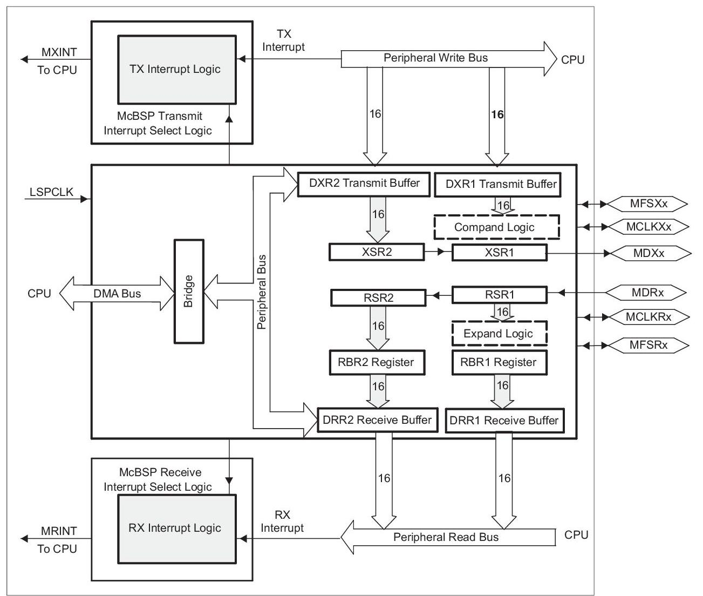

A Not available in all devices. See the device-specific data sheet

### 21.2 Configuring Device Pins

The GPIO mux registers must be configured to connect this peripheral to the device pins. To avoid glitches on the pins, the GPyGMUX bits must be configured first (while keeping the corresponding GPyMUX bits at the default of zero), followed by writing the GPyMUX register to the desired value.

Some IO functionality is defined by GPIO register settings independent of this peripheral. For input signals, the GPIO input qualification should be set to asynchronous mode by setting the appropriate GPxQSELn register bits to 11b. The internal pullups can be configured in the GPyPUD register.

See the GPIO chapter for more details on GPIO mux and settings.

### 21.3 McBSP Operation

This section addresses the following topics:

- Data transfer process 数据传输过程

- Companding (compressing and expanding) data 压缩 (压缩和扩展) 数据

- Clocking and framing data 时钟和帧数据

- Frame phases

- McBSP reception

- McBSP transmission

- Interrupts and DMA events generated by McBSPs

#### 21.3.1 Data Transfer Process of McBSPs

Figure 21-2 shows a diagram of the McBSP data transfer paths. The McBSP receive operation is triple-buffered, and transmit operation is double-buffered. The use of registers varies, depending on whether the defined length of each serial word is 16 bits.

Figure 21-2. McBSP Data Transfer Paths

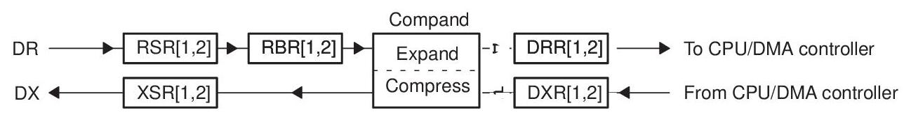

##### 21.3.1.1 Data Transfer Process for Word Length of 8, 12, or 16 Bits

If the word length is 16 bits or smaller, only one 16-bit register is needed at each stage of the data transfer paths. The registers DRR2, RBR2, RSR2, DXR2, and XSR2 are not used (written, read, or shifted).

Receive data arrives on the DR pin and is shifted into receive shift register 1 (RSR1). Once a full word is received, the content of RSR1 is copied to the receive buffer register 1 (RBR1), that is, if RBR1 is not full with previous data. RBR1 is then copied to the data receive register 1 (DRR1), unless the previous content of DRR1 has not been read by the CPU or the DMA controller. If the companding feature of the McBSP is implemented, the required word length is 8 bits and receive data is expanded into the appropriate format before being passed from RBR1 to DRR1. For more details about reception, see Section 21.3.5.

Transmit data is written by the CPU or the DMA controller to the data transmit register 1 (DXR1). If there is no previous data in the transmit shift register (XSR1), the value in DXR1 is copied to XSR1; otherwise, DXR1 is copied to XSR1 when the last bit of the previous data is shifted out on the DX pin. If selected, the companding module compresses 16-bit data into the appropriate 8-bit format before passing it to XSR1. After transmit frame synchronization, the transmitter begins shifting bits from XSR1 to the DX pin. For more details about transmission, see Section 21.3.6.

##### 21.3.1.2 Data Transfer Process for Word Length of 20, 24, or 32 Bits

If the word length is larger than 16 bits, two 16-bit registers are needed at each stage of the data transfer paths. The registers DRR2, RBR2, RSR2, DXR2, and XSR2 are needed to hold the most significant bits.

Receive data arrives on the DR pin and is shifted first into RSR2 and then into RSR1. Once the full word is received, the contents of RSR2 and RSR1 are copied to RBR2 and RBR1, respectively, if RBR1 is not full. Then the contents of RBR2 and RBR1 are copied to DRR2 and DRR1, respectively, unless the previous content of DRR1 has not been read by the CPU or the DMA controller. The CPU or the DMA controller must read data from DRR2 first and then from DRR1. When DRR1 is read, the next RBR-to-DRR copy occurs. For more details about reception, see Section 21.3.5.

For transmission, the CPU or the DMA controller must write data to DXR2 first and then to DXR1. When new data arrives in DXR1, if there is no previous data in XSR1, the contents of DXR2 and DXR1 are copied to XSR2 and XSR1, respectively; otherwise, the contents of the DXRs are copied to the XSRs when the last bit of the previous data is shifted out on the DX pin. After transmit frame synchronization, the transmitter begins shifting bits from the XSRs to the DX pin. For more details about transmission, see Section 21.3.6.

#### 21.3.2 Companding (Compressing and Expanding) Data

Companding (COMpressing and exPANDing) hardware allows compression and expansion of data in either \( \mu \) -law or A-law format. The companding standard employed in the United States and Japan is \( \mu \) -law. The European companding standard is referred to as A-law. The specifications for \( \mu \) -law and A-law log PCM are part of the CCITT G.711 recommendation.

A-law and \( \mu \) -law allow 13 bits and 14 bits of dynamic range, respectively. Any values outside this range are set to the most positive or most negative value. Thus, for companding to work best, the data transferred to and from the McBSP via the CPU or DMA controller must be at least 16 bits wide.

The \( \mu \) -law and A-law formats both encode data into 8-bit code words. Companded data is always 8 bits wide; the appropriate word length bits (RWDLEN1, RWDLEN2, XWDLEN1, XWDLEN2) must therefore be set to 0, indicating an 8-bit wide serial data stream. If companding is enabled and either of the frame phases does not have an 8-bit word length, companding continues as if the word length is 8 bits.

Figure 21-3 illustrates the companding processes. When companding is chosen for the transmitter, compression occurs during the process of copying data from DXR1 to XSR1. The transmit data is encoded according to the specified companding law (A-law or \( \mu \) -law). When companding is chosen for the receiver, expansion occurs during the process of copying data from RBR1 to DRR1. The receive data is decoded to twos complement format.

Figure 21-3. Companding Processes

##### 21.3.2.1 Companding Formats

For reception, the 8-bit compressed data in RBR1 is expanded to left-justified 16-bit data in DRR1. The receive sign-extension and justification mode specified in RJUST is ignored when companding is used.

For transmission using \( \mu \) -law compression, the 14 data bits must be left-justified in DXR1 with the remaining two low-order bits filled with 0s as shown in Figure 21-4.

21-4所示。

Figure 21-4. µ-Law Transmit Data Companding Format

<table><tr><td rowspan="2">\( \mu \) -law format in DXR1</td><td>15-2</td><td>1-0</td></tr><tr><td>Value</td><td>00</td></tr></table>

For transmission using A-law compression, the 13 data bits must be left-justified in DXR1, with the remaining three low-order bits filled with 0s as shown in Figure 21-5.

21-5所示。

Figure 21-5. A-Law Transmit Data Companding Format

<table><tr><td rowspan="2">A-law format in DXR1</td><td>15-3</td><td>2-0</td></tr><tr><td>Value</td><td>000</td></tr></table>

##### 21.3.2.2 Capability to Compand Internal Data

If the McBSP is unused (the serial port transmit and receive sections are reset), the companding hardware can compand internal data. This can be used to:

- Convert linear to the appropriate \( \mu \) -law or A-law format

- Convert \( \mu \) -law or A-law to the linear format

- Observe the quantization effects in companding by transmitting linear data and compressing and re-expanding this data. This is useful only if both XCOMPAND and RCOMPAND enable the same companding format.

Figure 21-6 shows two methods by which the McBSP can compand internal data. Data paths for these two methods are used to indicate:

- When both the transmit and receive sections of the serial port are reset, DRR1 and DXR1 are connected internally through the companding logic. Values from DXR1 are compressed, as selected by XCOMPAND, and then expanded, as selected by RCOMPAND. RRDY and XRDY bits are not set. However, data is available in DRR1 within four CPU clocks after being written to DXR1.

The advantage of this method is its speed. The disadvantage is that there is no synchronization available to the CPU and DMA to control the flow. DRR1 and DXR1 are internally connected if the (X/R)COMPAND bits are set to 10b or 11b (compand using \( \mu \) -law or A-law).

- The McBSP is enabled in digital loopback mode with companding appropriately enabled by RCOMPAND and XCOMPAND. Receive and transmit interrupts (RINT when RINTM = 0 and XINT when XINTM = 0) or synchronization events (REVT and XEVT) allow synchronization of the CPU or DMA to these conversions, respectively. Here, the time for this companding depends on the serial bit rate selected.

Figure 21-6. Two Methods by Which the McBSP Can Compand Internal Data

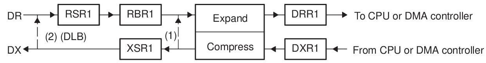

##### 21.3.2.3 Reversing Bit Order: Option to Transfer LSB First

Generally, the McBSP transmits or receives all data with the most significant bit (MSB) first. However, certain 8-bit data protocols (that do not use companded data) require the least significant bit (LSB) to be transferred first. If you set XCOMPAND = 01b in XCR2, the bit ordering of 8-bit words is reversed (LSB first) before being sent from the serial port. If you set RCOMPAND \( = {01}\mathrm{\;b} \) in RCR2, the bit ordering of 8-bit words is reversed during reception. Similar to companding, this feature is enabled only if the appropriate word length bits are set to 0 , indicating that 8-bit words are to be transferred serially. If either phase of the frame does not have an 8-bit word length, the McBSP assumes the word length is eight bits, and LSB-first

ordering is done.

首先传输最小的位(LSB)。如果您在XOF2中设置了xcompand=01b,则在从串行端口发送之前,8位单词的位顺序将被反转(LSB优先)。如果在RCF2中设置r 压缩器=01b,则在接收过程中8位单词的位序会反转。与压缩类似单词长度,则MtBSP假定单词长度为8位,并完成LSB-first排序。

#### 21.3.3 Clocking and Framing Data

This section explains basic concepts and terminology important for understanding how McBSP data transfers are timed and delimited.

##### 21.3.3.1 Clocking

Clocking 数据每次从DF针移到FSR针或从XSR针移到DK针。每个位传输的时间由时钟信号的上升或下降边缘控制。

Data is shifted one bit at a time from the DR pin to the RSR(s) or from the XSR(s) to the DX pin. The time for each bit transfer is controlled by the rising or falling edge of a clock signal.

The receive clock signal (CLKR) controls bit transfers from the DR pin to the RSR(s). The transmit clock signal (CLKX) controls bit transfers from the XSR(s) to the DX pin. CLKR or CLKX can be derived from a pin at the boundary of the McBSP or derived from inside the McBSP. The polarities of CLKR and CLKX are programmable. 接收时钟信号(QLR)控制从PF到PF的位传输。传输时钟信号(QLR)控制从SF(s)到DXS引脚的位传输。CLKF或QLKX可以从

Figure 21-7 shows how the clock signal controls the timing of each bit transfer on the pin.

Figure 21-7. Example - Clock Signal Control of Bit Transfer Timing

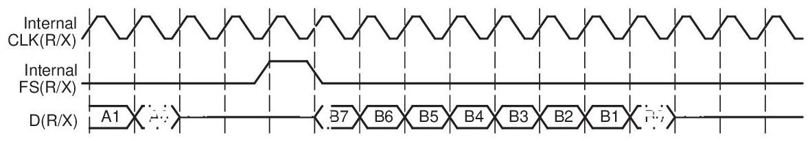

NOTE: The McBSP cannot operate at a frequency faster than 1/2 the LSPCLK frequency. When driving CLKX or CLKR at the pin, choose an appropriate input clock frequency. When using the internal sample rate generator for CLKX and/or CLKR, choose an appropriate input clock frequency and divide down value (CLKDV) (that is, be certain that CLKX or CLKR ≤ LSPCLK/2). McBSP的工作频率不能超过1/的LSPQLK频率。当在引脚处驱动CLK或CLKR时,选择一个合适的输入时钟频率。当对OLK和/或OLKR使用丙部采样率生成器时,选择适当的输入时钟频率并除法值(OLKDV)(即确定OLKX或OLKR LSPOLK(2)

##### 21.3.3.2 Serial Words

Bits traveling between a shift register (RSR or XSR) and a data pin (DR or DX) are transferred in a group called a serial word. You can define how many bits are in a word.

Bits coming in on the DR pin are held in RSR until RSR holds a full serial word. Only then is the word passed to RBR (and ultimately to the DRR).

During transmission, XSR does not accept new data from DXR until a full serial word has been passed from XSR to the DX pin.

In the exmaple in Figure 21-7, an 8-bit word size was defined (see bits 7 through 0 of word B being transferred).

##### 21.3.3.3 Frames and Frame Synchronization 帧和帧同步

One or more words are transferred in a group called a frame. You can define how many words are in a frame. 一个或多个单词在一个称为框架的组中传输。您可以定义一个框架中有多少个单词。

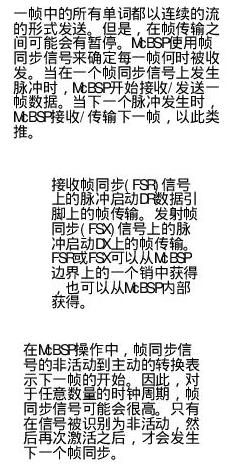

All of the words in a frame are sent in a continuous stream. However, there can be pauses between frame transfers. The McBSP uses frame-synchronization signals to determine when each frame is received/transmitted. When a pulse occurs on a frame-synchronization signal, the McBSP begins receiving/transmitting a frame of data. When the next pulse occurs, the McBSP receives/transmits the next frame, and so on.

Pulses on the receive frame-synchronization (FSR) signal initiate frame transfers on the DR data pin. Pulses on the transmit frame-sync (FSX) signal initiate frame transfers on DX. FSR or FSX can be derived from a pin at the boundary of the McBSP or derived from inside the McBSP.

In Figure 21-7, a one-word frame is transferred when a frame-synchronization pulse occurs.

In McBSP operation, the inactive-to-active transition of the frame-synchronization signal indicates the start of the next frame. For this reason, the frame-synchronization signal may be high for an arbitrary number of clock cycles. Only after the signal is recognized to have gone inactive, and then active again, does the next frame synchronization occur.

##### 21.3.3.4 Generating Transmit and Receive Interrupts

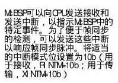

The McBSP can send receive and transmit interrupts to the CPU to indicate specific events in the McBSP. To facilitate detection of frame synchronization, these interrupts can be sent in response to frame-synchronization pulses. Set the appropriate interrupt mode bits to 10b (for reception, RINTM = 10b; for transmission, XINTM = 10b).

###### 21.3.3.4.1 Detecting Frame-Synchronization Pulses, Even in Reset State 检测帧同步脉冲,甚至处于重置状态

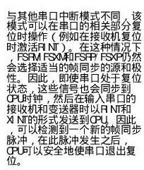

Unlike other serial port interrupt modes, this mode can operate while the associated portion of the serial port is in reset (such as activating RINT when the receiver is in reset). In this case, FSRM/FSXM and FSRP/FSXP still select the appropriate source and polarity of frame synchronization. Thus, even when the serial port is in the reset state, these signals are synchronized to the CPU clock and then sent to the CPU in the form of RINT and XINT at the point at which they feed the receiver and transmitter of the serial port. Consequently, a new frame-synchronization pulse can be detected, and after this occurs the CPU can take the serial port out of reset safely.

##### 21.3.3.5 Ignoring Frame-Synchronization Pulses 忽略帧同步脉冲

收帧同步脉冲。要使接收机或发射步忽略位(接收机FFIG=1,发射机

The McBSP can be configured to ignore transmit and/or receive frame-synchronization pulses. To have the receiver or transmitter recognize frame-synchronization pulses, clear the appropriate frame-synchronization ignore bit (RFIG = 0 for the receiver, XFIG = 0 for the transmitter). To have the receiver transmitter ignore frame-synchronization pulses until the desired frame length or number of words is reached, set the appropriate frame-synchronization ignore bit (RFIG = 1 for the receiver, XFIG = 1 for the transmitter). For more details on unexpected frame-synchronization pulses, see one of the following topics:

- Unexpected Receive Frame-Synchronization Pulse (see Section 21.5.3)

- Unexpected Transmit Frame-Synchronization Pulse (see Section 21.5.6)

You can also use the frame-synchronization ignore function for data packing (for more details, see Section 21.11.2).

##### 21.3.3.6 Frame Frequency

The frame frequency is determined by the period between frame-synchronization pulses and is defined as shown by Example 1.

Example 1: McBSP Frame Frequency

\[
\text{Frame Frequency} = \frac{\text{ Clock Frequency }}{\text{ Number of Clock Cycles Between Frame- Sync Pulses }}
\]

The frame frequency can be increased by decreasing the time between frame-synchronization pulses (limited only by the number of bits per frame). As the frame transmit frequency increases, the inactivity period between the data packets for adjacent transfers decreases to zero.

21.3.3.7 Maximum Frame Frequency

The minimum number of clock cycles between frame synchronization pulses is equal to the number of bits transferred per frame. The maximum frame frequency is defined as shown by Example 2.

Example 2: McBSP Maximum Frame Frequency

---

\[
\text{Maximum Frame Frequency} = \frac{\text{ Clock Frequency }}{\text{ Number of Bits Per Frame }}
\]

---

Figure 21-8 shows the McBSP operating at maximum packet frequency. At maximum packet frequency, the data bits in consecutive packets are transmitted contiguously with no inactivity between bits. Additional and the same continuum is the same in the case of the same in the case. 在最大分组频率下,连续分组中的数据位被

连续传输,而位之间没有不活动。

Figure 21-8. McBSP Operating at Maximum Packet Frequency

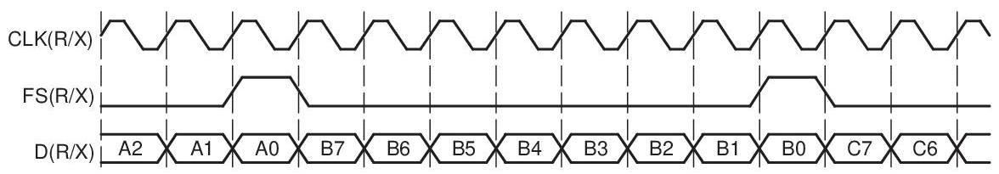

If there is a 1-bit data delay as shown in this figure, the frame-synchronization pulse overlaps the last bit transmitted in the previous frame. Effectively, this permits a continuous stream of data, making frame-synchronization pulses redundant. Theoretically, only an initial frame-synchronization pulse is required t initiate a multipacket transfer. “祝周坚在脉冲兄余。理论上,只需要一个初始的帧同步脉冲就可以启动一个多包传输。

The McBSP supports operation of the serial port in this fashion by ignoring the successive frame-synchronization pulses. Data is clocked into the receiver or clocked out of the transmitter during every clock cycle. McBSP通过忽略连续的帧同步脉冲来支持串行端口的操作。在每个时钟周期期间将数据钟入接收器或时钟出发射器。

NOTE: For XDATDLY = 0 (0-bit data delay), the first bit of data is transmitted asynchronously to the internal transmit clock signal (CLKX). For more details, see Section 21.9.13.

The McBSP allows you to configure each frame to contain one or two phases. The number of words and the number of bits per word can be specified differently for each of the two phases of a frame, allowing greater flexibility in structuring data transfers. For example, you might define a frame as consisting of one phase containing two words of 16 bits each, followed by a second phase consisting of 10 words of 8 bits each. This configuration permits you to compose frames for custom applications or, in general, to maximize the efficiency of data transfers.

##### 21.3.4.1 Number of Phases, Words, and Bits Per Frame

Table 21-2 shows which bit-fields in the receive control registers (RCR1 and RCR2) and in the transmit control registers (XCR1 and XCR2) determine the number of phases per frame, the number of words per frame, and number of bits per word for each phase, for the receiver and transmitter. The maximum number of words per frame is 128 for a single-phase frame and 256 for a dual-phase frame. The number

Table 21-2. Register Bits That Determine the Number of Phases, Words, and Bits

<table><tr><td>Operation</td><td>Number of Phases</td><td>Words per Frame Set With</td><td>Bits per Word Set With</td></tr><tr><td>Reception</td><td>1 (RPHASE = 0)</td><td>RFRLEN1</td><td>RWDLEN1</td></tr><tr><td>Reception</td><td>2 (RPHASE = 1)</td><td>RFRLEN1 and RFRLEN2</td><td>RWDLEN1 for phase 1   RWDLEN2 for phase 2</td></tr><tr><td>Transmission</td><td>1 (XPHASE = 0)</td><td>XFRLEN1</td><td>XWDLEN1</td></tr><tr><td>Transmission</td><td>2 (XPHASE = 1)</td><td>XFRLEN1 and XFRLEN2</td><td>XWDLEN1 for phase 1   XWDLEN2 for phase 2</td></tr></table>

##### 21.3.4.2 Single-Phase Frame Example 单相帧示例

Figure 21-9 shows an example of a single-phase data frame containing one 8-bit word. Because the transfer is configured for one data bit delay, the data on the DX and DR pins are available one clock cycle after FS(R/X) goes active. The figure makes the following assumptions:

- (R/X)PHASE = 0: Single-phase frame

- (R/X)FRLEN1 = 0b: 1 word per frame

- (R/X)WDLEN1 = 000b: 8-bit word length

- (R/X)FRLEN2 and (R/X)WDLEN2 are ignored

- \( \operatorname{CLK}\left( {X/R}\right) P = 0 \) : Receive data clocked on falling edge; transmit data clocked on rising edge

- \( \mathrm{{FS}}\left( {\mathrm{R}/\mathrm{X}}\right) \mathrm{P} = 0 \) : Active-high frame-synchronization signals

- (R/X)DATDLY = 01b: 1-bit data delay

Figure 21-9. Single-Phase Frame for a McBSP Data Transfer

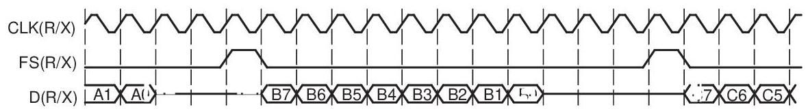

##### 21.3.4.3 Dual-Phase Frame Example

Figure 21-10 shows an example of a frame where the first phase consists of two words of 12 bits each, followed by a second phase of three words of 8 bits each. The entire bit stream in the frame is contiguous. There are no gaps either between words or between phases.

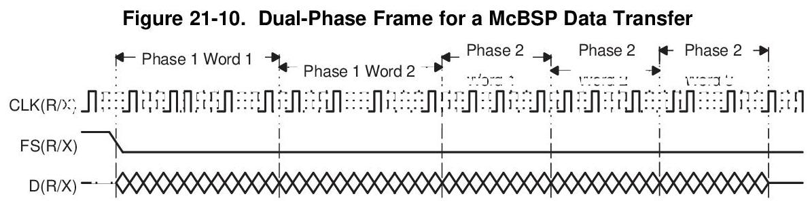

A XRDY gets asserted once per phase. So, if there are 2 phases, XRDY gets asserted twice (once per phase).

##### 21.3.4.4 Implementing the AC97 Standard With a Dual-Phase Frame

Figure 21-11 shows an example of the Audio Codec '97 (AC97) standard, which uses the dual-phase frame feature. Notice that words, not individual bits, are shown on the D(R/X) signal. The first phase (P1) consists of a single 16-bit word. The second phase (P2) consists of twelve 20-bit words. The phase configurations are listed after the figure.

Figure 21-11. Implementing the AC97 Standard With a Dual-Phase Frame

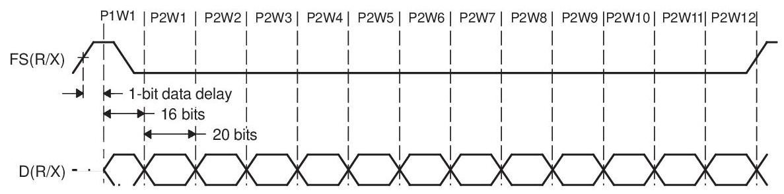

PxWy = Phase x Word y

- (R/X)PHASE = 1: Dual-phase frame

- (R/X)FRLEN1 = 0000000b: 1 word in phase 1

- (R/X)WDLEN1 = 010b: 16 bits per word in phase 1

- (R/X)FRLEN2 = 0001011b: 12 words in phase 2

- (R/X)WDLEN2 = 011b: 20 bits per word in phase 2

- CLKRP/CLKXP= 0: Receive data sampled on falling edge of internal CLKR / transmit data clocked on rising edge of internal CLKX

- FSRP/FSXP = 0: Active-high frame-sync signal

- (R/X)DATDLY = 01b: Data delay of 1 clock cycle (1-bit data delay)

Figure 21-12 shows the timing of an AC97-standard data transfer near frame synchronization. In this figure, individual bits are shown on D(R/X). Specifically, it shows the last two bits of phase 2 of one frame and the first four bits of phase 1 of the next frame. Regardless of the data delay, data transfers can occur without gaps. The first bit of the second frame (P1W1B15) immediately follows the last bit of the first frame (P2W12B0). Because a 1-bit data delay has been chosen, the transition on the frame-sync signal can occur when P2W12B0 is transferred.

Figure 21-12. Timing of an AC97-Standard Data Transfer Near Frame Synchronization

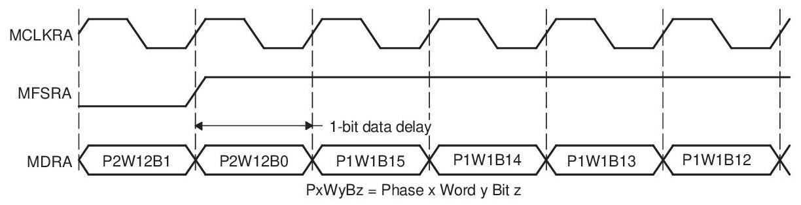

#### 21.3.5 McBSP Reception

This section explains the fundamental process of reception in the McBSP. For details about how to program the McBSP receiver, see Section 21.8.

Figure 21-13 and Figure 21-14 show how reception occurs in the McBSP. Figure 21-13 shows the physical path for the data. Figure 21-14 is a timing diagram showing signal activity for one possible reception scenario. A description of the process follows the figures.

Figure 21-13. McBSP Reception Physical Data Path

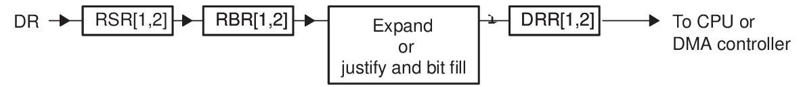

A RSR[1,2]: Receive shift registers 1 and 2

3 RBR[1,2]: Receive buffer registers 1 and 2

C DRR[1,2]: Data receive registers 1 and 2

Figure 21-14. McBSP Reception Signal Activity

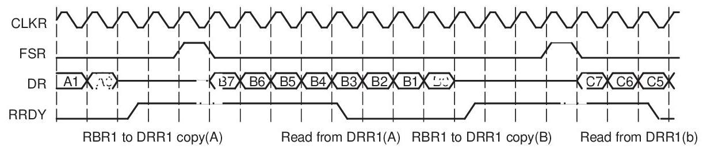

A CLKR: Internal receive clock

B FSR: Internal receive frame-synchronization signal

C DR: Data on DR pin

D RRDY: Status of receiver ready bit (high is 1)

The following process describes how data travels from the DR pin to the CPU or to the DMA controller:

1. The McBSP waits for a receive frame-synchronization pulse on internal FSR. McBSP在内部FSR上等待接收帧同步脉冲。

2. When the pulse arrives, the McBSP inserts the appropriate data delay that is selected with the RDATDLY bits of RCR2. 当脉冲到达时, M&BSP会插入用RCR2的原始数据位来选择的适当的数据延迟。

In the preceding timing diagram, a 1-bit data delay is selected. 在前面的时序图中,选择了一个1位的数据延迟。

3. The McBSP accepts data bits on the DR pin and shifts them into the receive shift register(s).

If the word length is 16 bits or smaller, only RSR1 is used. If the word length is larger than 16 bits, RSR2 and RSR1 are used and RSR2 contains the most significant bits. For details on choosing a word

length, see Section 21.8.8, Set the Receive Word Length(s). "MSPST模型BFB". 如果字的长度大于16位,则使用FBR和FBR,则采用FBR和FBR,则

4. When a full word is received, the McBSP copies the contents of the receive shift register(s) to the receive buffer register(s), provided that RBR1 is not full with previous data.

词长度的详细信息,请参见第21.8.8节,设置接收Word长度(s)。

If the word length is 16 bits or smaller, only RBR1 is used. If the word length is larger than 16 bits,

RBR2 and RBR1 are used and RBR2 contains the most significant bits.

5. The McBSP copies the contents of the receive buffer register(s) into the data receive register(s), provided that DRR1 is not full with previous data. When DRR1 receives new data, the receiver ready bit (RRDY) is set in SPCR1. This indicates that received data is ready to be read by the CPU or the DMA controller. 表明接收到的数据已经准备被CPL或DMA控制器读取。 DMA controller MEBP将接收缓冲区寄存器的内容复制到数据接收寄存器中,只要DFRI没有包含以前的数据。当DRRI接收到新数据时,在SPCRI中设置接收器准备位(RFDI)。这

If the word length is 16 bits or smaller, only DRR1 is used. If the word length is larger than 16 bits, DRR2 and DRR1 are used and DRR2 contains the most significant bits.

If companding is used during the copy (RCOMPAND = 10b or 11b in RCR2), the 8-bit compressed data in RBR1 is expanded to a left-justified 16-bit value in DRR1. If companding is disabled, the data copied from RBR[1,2] to DRR[1,2] is justified and bit filled according to the RJUST bits.

6. The CPU or the DMA controller reads the data from the data receive register(s). When DRR1 is read, RRDY is cleared and the next RBR-to-DRR copy is initiated.

NOTE: If both DRRs are required (word length larger than 16 bits), the CPU or the DMA controller must read from DRR2 first and then from DRR1. As soon as DRR1 is read, the next RBR-to-DRR copy is initiated. If DRR2 is not read first, the data in DRR2 is lost.

When activity is not properly timed, errors can occur. See the following topics for more details:

- Overrun in the Receiver (see Section 21.5.2)

- Unexpected Receive Frame-Synchronization Pulse (see Section 21.5.3)

#### 21.3.6 McBSP Transmission

This section explains the fundamental process of transmission in the McBSP. For details about how to program the McBSP transmitter, see Section 21.9. 本节解释了在McBSP中传输的基本过程。有关如何编程MbBSP发射机的详细信息,请参见第21.9节。

Figure 21-15 and Figure 21-16 show how transmission occurs in the McBSP. Figure 21-15 shows the physical path for the data. Figure 21-16 is a timing diagram showing signal activity for one possible transmission scenario. A description of the process follows the figures. 21-15和图21-16显示了MBSP中的传输发生方式。图21-15显示了数据的_____

物理路径。图21-16是显示一种可能的传输场景的信号活动的时序图。对该

过程的描述如下图所示。

Figure 21-15. McBSP Transmission Physical Data Path

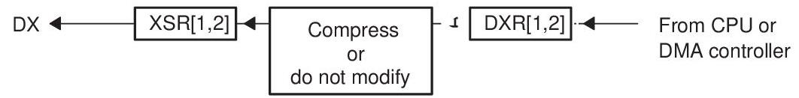

A XSR[1,2]: Transmit shift registers 1 and 2

B DXR[1,2]: Data transmit registers 1 and 2

Figure 21-16. McBSP Transmission Signal Activity

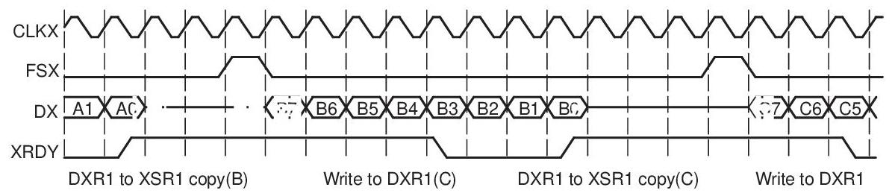

A CLKX: Internal transmit clock

B FSX: Internal transmit frame-synchronization signal

C DX: Data on DX pin

D XRDY: Status of transmitter ready bit (high is 1)

1. The CPU or the DMA controller writes data to the data transmit register(s). When DXR1 is loaded, the transmitter ready bit (XRDY) is cleared in SPCR2 to indicate that the transmitter is not ready for new data. CPU或DNA控制器将数据写入数据传输寄存器。当加载DXR1时,在SPCP2中清除发射机准备位( XRDY ),以表明发射机没有准备好处理新数据。

If the word length is 16 bits or smaller, only DXR1 is used. If the word length is larger than 16 bits, DXR2 and DXR1 are used and DXR2 contains the most significant bits. For details on choosing a word

length, see Section 21.9.9.

NOTE: If both DXRs are needed (word length larger than 16 bits), the CPU or the DMA controller must load DXR2 first and then load DXR1. As soon as DXR1 is loaded, the contents of both DXRs are copied to the transmit shift registers (XSRs), as described in the next step. If DXR2 is not loaded first, the previous content of DXR2 is passed to the XSR2.

2. When new data arrives in DXR1, the McBSP copies the content of the data transmit register(s) to the transmit shift register(s). In addition, the transmit ready bit (XRDY) is set. This indicates that the transmitter is ready to accept new data from the CPU or the DMA controller.

中时, McBSP会将数据传输寄存器的内容复制到传输移位

If the word length is 16 bits or smaller, only XSR1 is used. If the word length is larger than 16 bits, XSR2 and XSR1 are used and XSR2 contains the most significant bits.

If companding is used during the transfer (XCOMPAND = 10b or 11b in XCR2), the McBSP compresses the 16-bit data in DXR1 to 8-bit data in the \( \mu \) -law or A-law format in XSR1. If companding is disabled, the McBSP passes data from the DXR(s) to the XSR(s) without modification.

3. The McBSP waits for a transmit frame-synchronization pulse on internal FSX.

4. When the pulse arrives, the McBSP inserts the appropriate data delay that is selected with the XDATDLY bits of XCR2.

In the preceding timing diagram (Figure 21-16), a 1-bit data delay is selected.

5. The McBSP shifts data bits from the transmit shift register(s) to the DX pin.

When activity is not properly timed, errors can occur. See the following topics for more details:

- Overwrite in the Transmitter (Section 21.5.4)

- Underflow in the Transmitter (Section 21.5.5)

- Unexpected Transmit Frame-Synchronization Pulse (Section 21.5.6)

#### 21.3.7 Interrupts and DMA Events Generated by a McBSP

The McBSP sends notification of important events to the CPU and DMA via the internal signals shown in Table 21-3.

Table 21-3. Interrupts and DMA Events Generated by a McBSP

<table><tr><td>Internal Signal</td><td>Description</td></tr><tr><td>RINT</td><td>McBSP根据McBSP接收器中选择的一个条件(由SPCR1的FINTM位边   Receive interrupt 择的一个条件) 向CPU发送一个接收中断请求。   The McBSP sends a receive interrupt request to the CPU based upon a selected condition in the receiver of the McBSP (a condition selected by the RINTM bits of SPCR1).</td></tr><tr><td>XINT</td><td>Transmit interrupt   The McBSP sends a transmit interrupt request to the CPU based upon a selected condition in the transmitter of the McBSP (a condition selected by the XINTM bits of SPCR2).</td></tr><tr><td>REVT</td><td>Receive synchronization event   An REVT signal is sent to the DMA when data has been received in the data receive registers (DRRs).</td></tr><tr><td>XEVT</td><td>Transmit synchronization event   An XEVT signal is sent to the DMA when the data transmit registers (DXRs) are ready to accept the next serial word for transmission.</td></tr></table>

### 21.4 McBSP Sample Rate Generator

Each McBSP contains a sample rate generator (SRG) that can be programmed to generate an internal data clock (CLKG) and an internal frame-synchronization signal (FSG). CLKG can be used for bit shifting on the data receive (DR) pin and/or the data transmit (DX) pin. FSG can be used to initiate frame transfers on DR and/or DX. Figure 21-17 is a conceptual block diagram of the sample rate generator.

每个MoBSP包含一个采样速率生成器(SRG),可以编程生成一个内部数据时钟(CLKG)和一个内部帧同步信号(FSG。CLKG可用于数据接收(DR) 针脚

和/或数据传输(DX) 针脚上的位移。FSG可用于在DR和/或DX上启动帧传输。图21-17是采样率生成器的概念性方框图。

#### 21.4.1 Block Diagram

Figure 21-17. Conceptual Block Diagram of the Sample Rate Generator

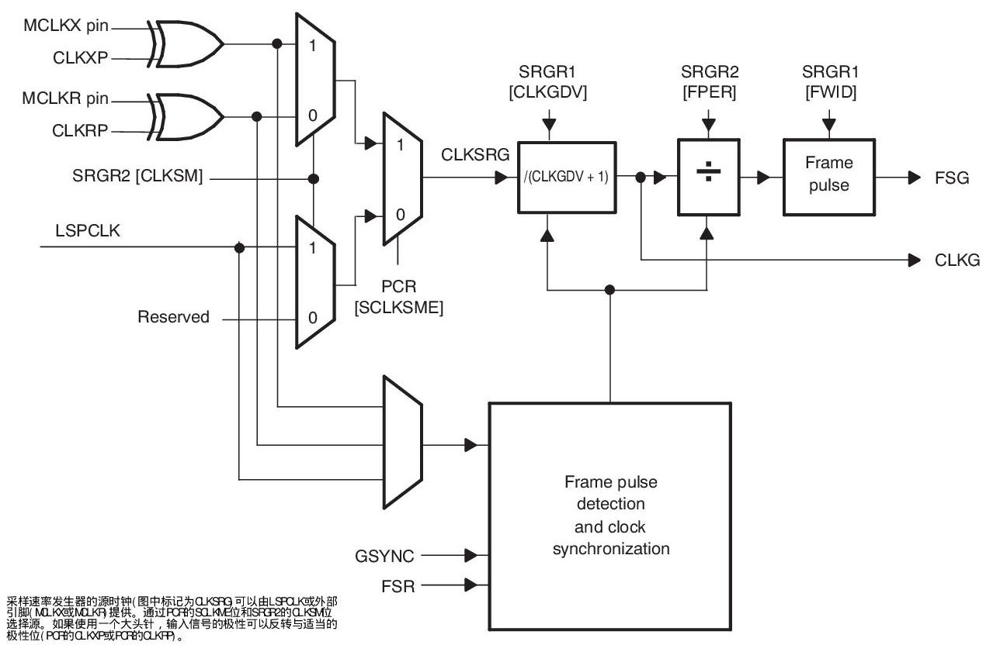

The source clock for the sample rate generator (labeled CLKSRG in the diagram) can be supplied by the LSPCLK, or by an external pin (MCLKX or MCLKR ). The source is selected with the SCLKME bit of PCR and the CLKSM bit of SRGR2. If a pin is used, the polarity of the incoming signal can be inverted with the appropriate polarity bit (CLKXP of PCR or CLKRP of PCR).

The sample rate generator has a three-stage clock divider that gives CLKG and FSG programmability. The three stages provide: 采样速率发生器有一个三级时钟分频器,它提供了QLKG和FSG的可编程性。这三个阶段提供:

- Clock divide-down. The source clock is divided according to the CLKGDV bits of SRGR1 to produce CLKG. 时钟分值。源时钟根据SFCRI 的 CLKGDVI 位进行划分,产生 CLKG

- Frame period divide-down. CLKG is divided according to the FPER bits of SRGR2 to control the period from the start of a frame-pulse to the start of the next pulse. 帧周期划分。CLKG根据SFGF2的FPER位进行划分,以控制从一个帧脉冲开始到下一个脉冲开始的周期。

- Frame-synchronization pulse-width countdown. CLKG cycles are counted according to the FWID bits of SRGR1 to control the width of each frame-synchronization pulse. \( {}_{\text{帧间步脉宽}} \) 例子. \( {}^{\lbrack {68}\rbrack } \) CRI的PWD位计算CLKG循环,以控制每个帧同步脉冲的宽度。

NOTE: The McBSP cannot operate at a frequency faster than 1/2 the source clock frequency. You must choose an input clock frequency and a CLKGDV alue such that CLKG is less than or equal to \( 1/2 \) the source clock frequency. MoBSP的工作频率不能超过 \( 1/6 \) 的源时钟频率。必须选择输入时钟频率和CLKGDV值,使CLKGJ十或等于1/源时钟频率。

In addition to the three-stage clock divider, the same leg relate generator has a frame-synchronization pulse detection and clock synchronization module that allows synchronization of the clock divide down with an incoming frame-synchronization pulse on the FSR pin. This feature is enabled or disabled with the

GSYNC bit of SRGR2. 除了三级时钟分频器外,采样速率发生器还具有帧同步脉冲检测和时钟同步模块,它允许将时钟分频与FSR引脚上的输入帧同步脉冲进行同

For details on getting the sample rate generator ready for operation, see Section 21.4.4.

##### 21.4.1.1 Clock Generation in the Sample Rate Generator 采样速率发生器中的时钟产生

---

机或两者同时使用。使用采样速时钟模式位设置为1(O)-KRN4用于应的数据时钟(用于接收CLKR,月

CLKRN4-1和CLKXM4-1对NoBSP

的影响分别部分受到数字

环回模式和时钟停止(SPI)

模式的影响,如表21-4所

示。数字环回模式采用

SPORI的DLB位来选择(如

第21.8.4节所述)。使用

SPORI 的 \( O \) LKSTP位选择时钟

停止模式(如第21.7.2节

所述)。

---

The sample rate generator can produce a clock signal (CLKG) for use by the receiver, the transmitter, or both. Use of the sample rate generator to drive clocking is controlled by the clock mode bits (CLKRM and CLKXM) in the pin control register (PCR). When a clock mode bit is set to 1 (CLKRM = 1 for reception, CLKXM = 1 for transmission), the corresponding data clock (CLKR for reception, CLKX for transmission) is driven by the internal sample rate generator output clock (CLKG).

The effects of CLKRM = 1 and CLKXM = 1 on the McBSP are partially affected by the use of the digital loopback mode and the clock stop (SPI) mode, respectively, as described in Table 21-4. The digital loopback mode (described in Section 21.8.4) is selected with the DLB bit of SPCR1. The clock stop mode (described in Section 21.7.2) is selected with the CLKSTP bits of SPCR1.

When using the sample rate generator as a clock source, make sure the sample rate generator is enabled (GRST = 1).

率生成器作为

时钟源时,请

样速率生成器

(GFST=1)。

Table 21-4. Effects of DLB and CLKSTP on Clock Modes

<table><tr><td colspan="2">Mode Bit Settings</td><td>Effect</td></tr><tr><td rowspan="2">CLKRM = 1</td><td>DLB = 0   (Digital loopback mode disabled)</td><td>CLKR is an output pin driven by the sample rate generator output clock (CLKG).</td></tr><tr><td>DLB = 1   (Digital loopback mode enabled)</td><td>CLKR is an output pin driven by internal CLKX. The source for CLKX depends on the CLKXM bit.</td></tr><tr><td rowspan="2">CLKXM = 1</td><td>CLKSTP = 00b or 01b (Clock stop (SPI) mode disabled)</td><td>CLKX is an output pin driven by the sample rate generator output clock (CLKG).</td></tr><tr><td>CLKSTP = 10b or 11b (Clock stop (SPI) mode enabled)</td><td>The McBSP is a master in an SPI system. Internal CLKX drives internal CLKR and the shift clocks of any SPI-compliant slave devices in the system. CLKX is driven by the internal sample rate generator.</td></tr></table>

##### 21.4.1.2 Choosing an Input Clock

The sample rate generator must be driven by an input clock signal from one of the three sources selectable with the SCLKME bit of PCR and the CLKSM bit of SRGR2 (see Table 21-5). When CLKSM = 1, the minimum divide down value in CLKGDV bits is 1. CLKGDV is described in Section 21.4.1.4. 鞘速率发生器必须由一个输入时钟信号驱动,这些信号可由PCF的SQLMUE位和SPCF2的CLKSM位进行选择(见表21-5)。当CLKSM4 1时, CLKDV位中的最小除法值为1。CLKGDV的描述详见第21.4.1.4节

Table 21-5. Choosing an Input Clock for the Sample Rate Generator with the SCLKME and CLKSM Bits

<table><tr><td>SCLKME</td><td>CLKSM</td><td>Input Clock for Sample Rate Generator</td></tr><tr><td>0</td><td>0</td><td>Reserved</td></tr><tr><td>0</td><td>1</td><td>LSPCLK</td></tr><tr><td>1</td><td>0</td><td>Signal on MCLKR pin</td></tr><tr><td>1</td><td>1</td><td>Signal on MCLKX pin</td></tr></table>

##### 21.4.1.3 Choosing a Polarity for the Input Clock

As shown in Figure 21-18, when the input clock is received from a pin, you can choose the polarity of the input clock. The rising edge of CLKSRG generates CLKG and FSG, but you can determine which edge of the input clock causes a rising edge on CLKSRG. The polarity options and their effects are described in

Table 21-6 如图21-18所示,当从一个大头针接收到输入时钟时,您可以选择输入时钟的极性。CLKSRG的上升边会产生CLKG和FSC

,但您可以确定输入时钟的哪条边会导致CLKSRG上的上升边。极性选项及其影响情况见表21-6。

Figure 21-18. Possible Inputs to the Sample Rate Generator and the Polarity Bits

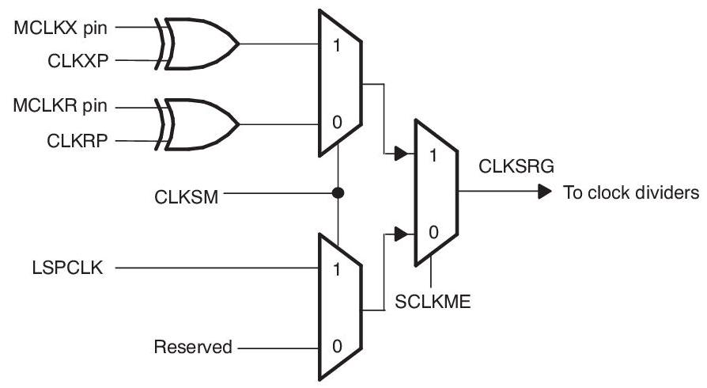

Table 21-6. Polarity Options for the Input to the Sample Rate Generator

<table><tr><td>Input Clock</td><td>Polarity Option</td><td>Effect</td></tr><tr><td>LSPCLK</td><td>Always positive polarity</td><td>Rising edge of CPU clock generates transitions on CLKG and FSG.</td></tr><tr><td rowspan="2">Signal on MCLKR pin</td><td>CLKRP = 0 in PCR</td><td>Falling edge on MCLKR pin generates transitions on CLKG and FSG.</td></tr><tr><td>CLKRP = 1 in PCR</td><td>Rising edge on MCLKR pin generates transitions on CLKG and FSG.</td></tr><tr><td rowspan="2">Signal on MCLKX pin</td><td>CLKXP = 0 in PCR</td><td>Rising edge on MCLKX pin generates transitions on CLKG and FSG.</td></tr><tr><td>CLKXP = 1 in PCR</td><td>Falling edge on MCLKX pin generates transitions on CLKG and FSG.</td></tr></table>

##### 21.4.1.4 Choosing a Frequency for the Output Clock (CLKG)

The input clock (LSPCLK or external clock) can be divided down by a programmable value to drive CLKG. Regardless of the source to the sample rate generator, the rising edge of CLKSRG (see Figure 21-1) generates CLKG and FSG. 输入时钟(LSPCLK或外部时钟) 可除以一个可编程值来驱动CLKG,无论样本速率生成器的源是什么, CLKSRG的上升边缘(见图21-1)都会生成CLKG和FSG

The first divider stage of the sample rate generator creates the output clock from the input clock. This divider stage uses a counter that is preloaded with the divide down value in the CLKGDV bits of SRGR1. The output of this stage is the data clock (CLKG). CLKG has the frequency represented by the equation below. 采样速率发生器的第一个分频器阶段从输入时钟创建输出时钟。这个分法器阶段使用一个计数器,该计数器预装有SFGRI的Q-KGDV位中的除法值。此阶段的输出值为数据时钟(Q-LKG)。

Equation 1: CLKG Frequency

\[
\text{CLKG frequency} = \frac{\text{ Input clock frequency }}{\left( \mathrm{{CLKGDV}} + 1\right) }
\]

###### 21.4.1.4.1 CLKG Frequency a KG频率

Thus, the input clock frequency is divided by a value between 1 and 256. When CLKGDV is odd or equal to 0, the CLKG duty cycle is 50%. When CLKGDV is an even value, 2p, representing an odd divide down, the high-state duration is p+1 cycles and the low-state duration is p cycles.

因此,输入时钟频率除以1和256之间的值。当CLKCDV为奇数或等于0时, CLKG的占空比为50%,当CLKCDV为偶数值2p,表示奇数除法时,高状态持续时间为p+1周期,低状态持续时间为p周期。

##### 21.4.1.5 Keeping CLKG Synchronized to External MCLKR 保持CLKG与外部MCLKF的同步

When the MCLKR pin is used to drive the sample rate generator (see Section 21.4.1.2), the GSYNC bit in SRGR2 and the FSR pin can be used to configure the timing of the output clock (CLKG) relative to the input clock. Note that this feature is available only when the MCLKR pin is used to feed the external clock. 当MQLKP引脚用于驱动采

样速率发生器(请参见

第21.4.1.2节)时,可

以使用SRGB2中的CSVNC

位和FSP引脚来配置输出

时钟的定时。请注意

GSYNC = 1 ensures that the McBSP and an external device are dividing down the input clock with the same phase relationship. If GSYNC = 1, an inactive-to-active transition on the FSR pin triggers a resynchronization of CLKG and generation of FSG. \( {}_{\mathrm{{CLKG}}}^{\mathrm{{GSAG}} = 1} \) 确保MSBS和外部设备以相同的相位关系划分输入时钟。如果是GSMC=1,则FSPBI脚上的非活动到非活动的转折

此功能只有在使用MOLKF

大头针输入外部时钟时

才可用。

For more details about synchronization, see Section 21.4.3.

#### 21.4.2 Frame Synchronization Generation in the Sample Rate Generator 采样速率发生器中的帧同步生成

The sample rate generator can produce a frame-synchronization signal (FSG) for use by the receiver, the transmitter, or both. 采样速率发生器可以产生一个帧同步信号( FSG ,供接收机、发射机或两者同时使用。

If you want the receiver to use FSG for frame synchronization, make sure FSRM = 1. (When FSRM = 0, receive frame synchronization is supplied via the FSR pin.) 如果您希望接收器使用FSS进行帧同步,请确保FSRM1。(当FSRM0时,通过FSRM1a)。

If you want the transmitter to use FSG for frame synchronization, you must set: 如果希望发射机使用FSG进行帧同步,则必须设置:

- FSXM = 1 in PCR: This indicates that transmit frame synchronization is supplied by the McBSP itself rather than from the FSX pin. PCR中的FSXN41:这表明传输帧同步是由M&BSP本身提供的,而不是来自FSX针。

FSGM = 1 in SRGR2: This indicates that when FSXM = 1, transmit frame synchronization is supplied by the sample rate generator. (When FSGM = 0 and FSXM = 1, the transmitter uses frame-synchronization pulses generated every time data is transferred from DXR[1,2] to XSR[1,2].)

In either case, the sample rate generator must be enabled \( \left( {\mathrm{{GRST}} = 1}\right) \) and the frame-synchronization logic in the sample rate generator must be enabled (FRST = 1). \( \;\begin{array}{l} \text{ 在任何一种情况下，都必须启用采样速率生成器(GFST=1) ，并且必须与 } \\  \text{ 器中的帧同步逻辑(FRST=1)。 } \end{array} \)

##### 21.4.2.1 Choosing the Width of the Frame-Synchronization Pulse on FSG 选择FSGL的帧同步脉冲的宽度

Each pulse on FSG has a programmable width. You program the FWID bits of SRGR1, and the resulting pulse width is (FWID + 1) CLKG cycles, where CLKG is the output clock of the sample rate generator. ,得到的脉冲宽度为(FWD+1) CLKG循环,其中CLKG是采样速率

FSG上帧同步脉冲启动边缘之间周期的控制

21.4.2.2 Controlling the Period Between the Starting Edges of Frame-Synchronization Pulses on FSG

You can control the amount of time from the starting edge of one FSG pulse to the starting edge of the next FSG pulse. This period is controlled in one of two ways, depending on the configuration of the sample rate generator:可以控制从一个FSCI脉冲的起始边缘到下一个FSCI脉冲的起始边缘的时间。根据采样速率生成器的配置,可以通过两种方式之一来控制此周期:

- If the sample rate generator is using an external input clock and GSYNC \( = 1 \) in SRGR2, FSG pulses in

response to an inactive-to-active transition on the FSR pin. Thus, the frame-synchronization period is

---

controlled by an external device. 如果采样速率发生器在SRGP2中使用外部输入时钟和CSMC-1,则FSG脉冲响应于FSR针上的非活动到主动的转变。因此,帧同步周期由外部设备控制。

---

- Otherwise, you program the FPER bits of SRGR2, and the resulting frame-synchronization period is (FPER + 1) CLKG cycles, where CLKG is the output clock of the sample rate generator. 否则,您将对STRP的研究中的进行编程,所得到的帧

步周期为(FPER+1)CLKG周期,其中CLKG是采样速率生

成器的输出时钟。

##### 21.4.2.3 Keeping FSG Synchronized to an External Clock \( {}^{7,2} \) FSG-Sym Bitch and FSG Syn Bitch Clock \( {}^{7,2} \)

When an external signal is selected to drive the sample rate generator (see Section 21.4.1.2), the GSYNC bit of SRGR2 and the FSR pin can be used to configure the timing of FSG pulses.

GSYNC \( = 1 \) ensures that the McBSP and an external device are dividing down the input clock with the same phase relationship. If GSYNC \( = 1 \) , an inactive to active transition on the FSR pin triggers a resynchronization of CLKG and generation of FSG.

See Section 21.4.3 for more details about synchronization.

#### 21.4.3 Synchronizing Sample Rate Generator Outputs to an External Clock

The sample rate generator can produce a clock signal (CLKG) and a frame-synchronization signal (FSG) based on an input clock signal that is either the CPU clock signal or a signal at the MCLKR or MCLKX pin. When an external clock is selected to drive the sample rate generator, the GSYNC bit of SRGR2 and the FSR pin can be used to control the timing of CLKG and the pulsing of FSG relative to the chosen input clock . 采样速率发生器可以基于CPU时钟信号或MLKP或MOLKX引脚处的输入时钟信号产生时钟信号( CLKG 和帧同步信号( FSG 。当选择外部时钟来驱动采样速率发生器时 ,可以使用SPGP2的CSMNC位和FSR引脚来控制CLKC的定时和FSG相对于所选择的输入时钟的脉冲。

Make GSYNC = 1 when you want the McBSP and an external device to divide down the input clock with the same phase relationship. If GSYNC \( = 1 \) : 当您希望McBSP和外部设备以相同的相位关系划分输入时钟时,请创建GSMC=1。如果GSMC=1 \( : \)

- An inactive-to-active transition on the FSR pin triggers a resynchronization of CLKG and a pulsing of

---

FSG. 在FSR引脚上的非活动到主动的转换会触发CLKG的重新同步和FSG的脉冲。

---

- CLKG always begins with a high state after synchronization. CKG总是从同步后的高状态开始。

- FSR is always detected at the same edge of the input clock signal that generates CLKG, no matter how long the FSR pulse is. 无论FSR脉冲有多长,都总是在产生CLKG的输入时钟信号的同一边缘检测到FSR

- The FPER bits of SRGR2 are ignored because the frame-synchronization period on FSG is determined SRGP2的FPER位被忽略,因为FSG上的帧同步周期是由FSR引脚上的下一个帧同步脉冲的到达所决定的。

by the arrival of the next frame-synchronization pulse on the FSR pin.

If GSYNC = 0, CLKG runs freely and is not resynchronized, and the frame-synchronization period on FSG is determined by FPER. 如果GSMC=0, GLKGI将自由运行,并且没有重新同步,并且FSGL的帧同步周期由FPER确定。

##### 21.4.3.1 Operating the Transmitter Synchronously with the Receiver 与接收机同步操作发射机

When GSYNC \( = 1 \) , the transmitter can operate synchronously with the receiver, provided that: # ResNC=1时

- FSX is programmed to be driven by FSG (FSGM = 1 in SRGR2 and FSXM = 1 in PCR). If the input FSR has appropriate timing so that it can be sampled by the falling edge of CLKG, it can be used, instead, by setting FSXM = 0 and connecting FSR to FSX externally. \( \underset{\text{,因此可以通过 }}{\overset{\text{ 初始组织为由 }}{ \rightarrow  }} \) 平的下降边缘进行采样,则可以通过设置 \( \underset{\text{ 并在外部连接 }}{\overset{\text{ 取动,}}{ \rightarrow  }} \) 到目的定时的定时

- The sample rate generator clock drives the transmit and receive clocking (CLKRM = CLKXM = 1 in PCR). 采样速率发生器时钟驱动传输和接收时钟(PCR中的CLKRM+CLKXM+01)。

##### 21.4.3.2 Synchronization Examples 同步示例

Figure 21-19 and Figure 21-20 show the clock and frame-synchronization operation with various polarities of CLKR and FSR. These figures assume FWID = 0 in SRGR1, for an FSG pulse that is one CLKG cycle swide. The FPER bits of SRGR2 are not programmed; the period from the start of a frame-synchronization Pulse to the start of the next pulse is determined by the arrival of the next inactive-to-active transition or the FSR pin. Each of the figures shows what happens to CLKG when it is initially synchronized and GSYNC = 1, and when it is not initially synchronized and GSYNC = 1. Figure 21-20 has a slower CLKG frequency (it has a larger divide-down value in the CLKGDV bits of SRGR1). FSR的不同极性条件下的时钟和帧F

帧同步脉冲开始到下一个脉冲开始的

主动过渡来确定。每个图都显示了

CLKG初始同步和CGSYNC=1以及初始不

20的CLKG频率较慢(它在SPGR的

CLKGDM位中有一个更大的除法值)。

Figure 21-19. CLKG Synchronization and FSG Generation When GSYNC = 1 and CLKGDV = 1

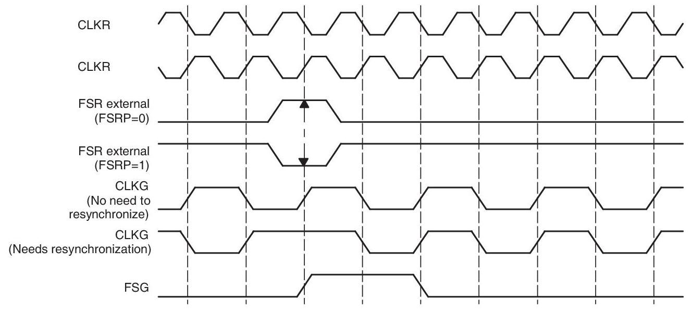

Figure 21-20. CLKG Synchronization and FSG Generation When GSYNC = 1 and CLKGDV = 3

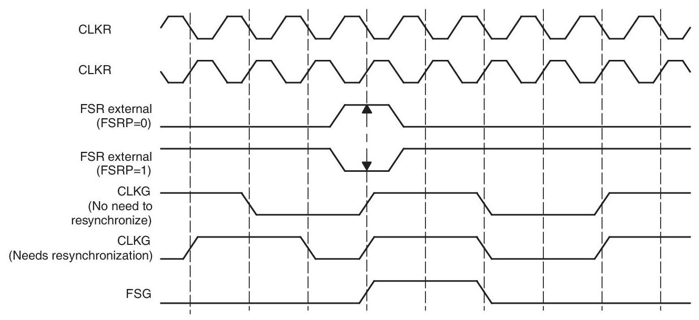

#### 21.4.4 Reset and Initialization Procedure for the Sample Rate Generator

To reset and initialize the sample rate generator: 要重置并初始化采样速率生成器:

Step 1. Place the McBSP/sample rate generator in reset.

器和发射器复位位(CFST、FRST和XRST) 自动被强制设置为0。否则,在正常运行 CLKG和/或FSG,则可以通过在SPCF2中设

During a DSP reset, the sample rate generator, the receiver, and the transmitter reset bits (GRST, RRST, and XRST) are automatically forced to 0. Otherwise, during normal operation, the sample rate generator can be reset by seting GRST = 0 in SPCR2, provided that CLKG and/or FSG is not used by any portion of the McBSP. Depending on your system you may also want to reset the receiver (RRST \( = 0 \) in SPCR1) and reset the transmitter (XRST \( = 0 \) in SPCR2).

If GRST = 0 due to a device reset, CLKG is driven by the CPU clock divided by 2, and FSG is driven inactive-low. If GRST = 0 due to program code, CLKG and FSG are driven low (inactive).

Step 2. Program the registers that affect the sample rate generator of the Fig. Chang of Standard in (4,5,6). 。步骤2:编程设置影响采样速率生成8

Program the sample rate generator registers (SRGR1 and SRGR2) as required for your application. If necessary, other control registers can be loaded with desired values, provided the respective portion of the McBSP (the receiver or transmitter) is in reasonable to the magnetic field of the hydro diffuse

After the sample rate generator registers are programmed, wait 2 CLKSRG cycles. This ensures proper synchronization internally. 在采样速率发生器寄存器被编程后,等待2个CLKSRC周期。这确保了内部的适当同步。

Step 3. Enable the sample rate generator (take it out of reset).

In SPCR2, make GRST = 1 to enable the sample rate generator.

After the sample rate generator is enabled, wait two CLKG cycles for the sample rate generator logic to stabilize. 启用采样速率生成器后,等待两个CLKG循环,使采样速率生成器逻辑稳定。

On the next rising edge of CLKSRG, CLKG transitions to 1 and starts clocking with a frequency equal to the CLKG Frequency equation below. 在CLKSRG的下一个上升边, CLKG过渡到1,并开始计时,频率等于下面的CLKG频率方程。

Table 21-7. Input Clock Selection for Sample Rate Generator

<table><tr><td>SCLKME</td><td>CLKSM</td><td>Input Clock for Sample Rate Generator</td></tr><tr><td>0</td><td>0</td><td>Reserved</td></tr><tr><td>0</td><td>1</td><td>LSPCLK</td></tr><tr><td>1</td><td>0</td><td>Signal on MCLKR pin</td></tr><tr><td>1</td><td>1</td><td>Signal on MCLKX pin</td></tr></table>

Step 4. If necessary, enable the receiver and/or the transmitter. 和/或发射器. 点间是 项目形式和/或发射器。如有必要,通过设置FFST和/或XFST-1来拆卸复位中的接收器；

If necessary, remove the receiver and/or transmitter from reset by setting RRST and/or XRST \( = 1 \) .

Step 5. If necessary, enable the frame-synchronization logic of the sample rate generator.

After the required data acquisition setup is done (DXR[1,2] is loaded with data), set GRST = 1 in SPCR2 if an internally generated frame-synchronization pulse is required. FSG is generated with an active-high edge after the programmed number of CLKG clocks (FPER + 1) have elapsed.

## Equation 2: CLKG Frequency

\[
\text{CLKG frequency} = \frac{\text{ Input clock frequency }}{\left( \mathrm{{CLKGDV}} + 1\right) }
\]

where the input clock is selected with the SCLKME bit of PCR and the CLKSM bit of SRGR2 in one of the configurations shown in Table 21-7.

### 21.5 McBSP Exception/Error Conditions

This chapter describes exception/error conditions and how to handle them. MeBSP异常/错误条件

#### 21.5.1 Types of Errors

There are five serial port events that can constitute a system error: 有五个串口事件可能构成一个系统错误:

- Receiver overrun (RFULL = 1)

This error occurs when DRR1 has not been read since the last RBR-to-DRR copy. Consequently, the receiver does not copy a new word from the RBR(s) to the DRR(s) and the RSR(s) are now full with another new word shifted in from DR. Therefore, RFULL = 1 indicates an error condition wherein any new data that can arrive at this time on DR replaces the contents of the RSR(s), and the previous word is lost. The RSRs continue to be overwritten as long as new data arrives on DR and DRR1 is not read. For more details about overrun in the receiver, see Section 21.5.2.

- Unexpected receive frame-synchronization pulse (RSYNCERR = 1)

This error occurs during reception when RFIG = 0 and an unexpected frame-synchronization pulse occurs. An unexpected frame-synchronization pulse is one that begins the next frame transfer before all the bits of the current frame have been received. Such a pulse causes data reception to abort and restart. If new data has been copied into the RBR(s) from the RSR(s) since the last RBR-to-DRR copy, this new data in the RBR(s) is lost. This is because no RBR-to-DRR copy occurs; the reception has been restarted. For more details about receive frame-synchronization errors, see Section 21.5.3.

- Transmitter data overwrite

This error occurs when the CPU or DMA controller overwrites data in the DXR(s) before the data is copied to the XSR(s). The overwritten data never reaches the DX pin. For more details about overwrite in the transmitter, see Section 21.5.4.

- Transmitter underflow (XEMPTY = 0)

If a new frame-synchronization signal arrives before new data is loaded into DXR1, the previous data in the DXR(s) is sent again. This procedure continues for every new frame-synchronization pulse that arrives until DXR1 is loaded with new data. For more details about underflow in the transmitter, see Section 21.5.5.

- Unexpected transmit frame-synchronization pulse (XSYNCERR = 1)

This error occurs during transmission when XFIG = 0 and an unexpected frame-synchronization pulse occurs. An unexpected frame-synchronization pulse is one that begins the next frame transfer before all the bits of the current frame have been transferred. Such a pulse causes the current data transmission to abort and restart. If new data has been written to the DXR(s) since the last DXR-to-XSR copy, the current value in the XSR(s) is lost. For more details about transmit frame-synchronization errors, see Section 21.5.6.

#### 21.5.2 Overrun in the Receiver

RFULL = 1 in SPCR1 indicates that the receiver has experienced overrun and is in an error condition. RFULL is set when all of the following conditions are met:

1. DRR1 has not been read since the last RBR-to-DRR copy (RRDY = 1).

2. RBR1 is full and an RBR-to-DRR copy has not occurred.

3. RSR1 is full and an RSR1-to-RBR copy has not occurred.

As described in Section 21.3.5, data arriving on DR is continuously shifted into RSR1 (for word length of 16 bits or smaller) or RSR2 and RSR1 (for word length larger than 16 bits). Once a complete word is shifted into the RSR(s), an RSR-to-RBR copy can occur only if the previous data in RBR1 has been copied to DRR1. The RRDY bit is set when new data arrives in DRR1 and is cleared when that data is read from DRR1. Until RRDY = 0, the next RBR-to-DRR copy does not take place, and the data is held in the RSR(s). New data arriving on the DR pin is shifted into RSR(s), and the previous content of the RSR(s) is lost.

You can prevent the loss of data if DRR1 is read no later than 2.5 cycles before the end of the third word is shifted into the RSR1.

NOTE: If both DRRs are needed (word length larger than 16 bits), the CPU or the DMA controller must read from DRR2 first and then from DRR1. As soon as DRR1 is read, the next RBR-to-DRR copy is initiated. If DRR2 is not read first, the data in DRR2 is lost.

After the receiver starts running from reset, a minimum of three words must be received before RFULL is set. Either of the following events clears the RFULL bit and allows subsequent transfers to be read properly:

- The CPU or DMA controller reads DRR1.

- The receiver is reset individually (RRST = 0) or as part of a device reset.

Another frame-synchronization pulse is required to restart the receiver.

##### 21.5.2.1 Example of Overrun Condition

Figure 21-21 shows the receive overrun condition. Because serial word A is not read from DRR1 before serial word B arrives in RBR1, B is not transferred to DRR1 yet. Another new word (c)) arrives and RSR1 is full with this data. DRR1 is finally read, but not earlier than 2.5 cycles before the end of word C. Therefore, new data (D) overwrites word C in RSR1. If DRR1 is not read in time, the next word can overwrite D.

Figure 21-21. Overrun in the McBSP Receiver

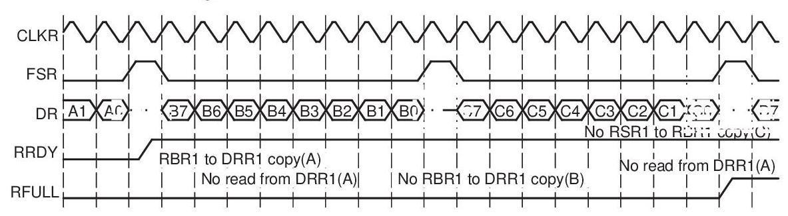

##### 21.5.2.2 Example of Preventing Overrun Condition

Figure 21-22 shows the case where RFULL is set, but the overrun condition is prevented by a read from DRR1 at least 2.5 cycles before the next serial word (c)) is completely shifted into RSR1. This ensures that an RBR1-to-DRR1 copy of word B occurs before receiver attempts to transfer word C from RSR1 to RBR1.

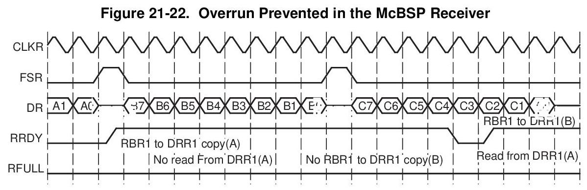

#### 21.5.3 Unexpected Receive Frame-Synchronization Pulse

Section 21.5.3.1 shows how the McBSP responds to any receive frame-synchronization pulses, including an unexpected pulse. Section 21.5.3.2 and Section 21.5.3.3 show an example of a frame-synchronization error and an example of how to prevent such an error, respectively.

##### 21.5.3.1 Possible Responses to Receive Frame-Synchronization Pulses

Figure 21-23 shows the decision tree that the receiver uses to handle all incoming frame-synchronization pulses. The figure assumes that the receiver has been started (RRST = 1 in SPCR1). Case 3 shows where an error occurs.

Figure 21-23. Possible Responses to Receive Frame-Synchronization Pulses

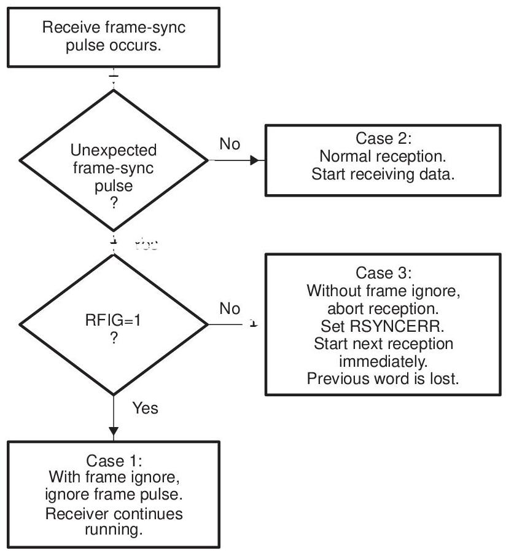

Any one of three cases can occur:

- Case 1: Unexpected internal FSR pulses with RFIG = 1 in RCR2. Receive frame-synchronization pulses are ignored, and the reception continues.

- Case 2: Normal serial port reception. Reception continues normally because the frame-synchronization pulse is not unexpected. There are three possible reasons why a receive operation might not be in progress when the pulse occurs:

- The FSR pulse is the first after the receiver is enabled (RRST = 1 in SPCR1).

- The FSR pulse is the first after DRR[1,2] is read, clearing a receiver full (RFULL = 1 in SPCR1) condition.

- The serial port is in the interpacket intervals. The programmed data delay for reception (programmed with the RDATDLY bits in RCR2) may start during these interpacket intervals for the first bit of the next word to be received. Thus, at maximum frame frequency, frame synchronization can still be received 0 to 2 clock cycles before the first bit of the synchronized frame.

- Case 3: Unexpected receive frame synchronization with RFIG = 0 (frame-synchronization pulses not ignored). Unexpected frame-synchronization pulses can originate from an external source or from the internal sample rate generator.

If a frame-synchronization pulse starts the transfer of a new frame before the current frame is fully received, this pulse is treated as an unexpected frame-synchronization pulse, and the receiver sets the receive frame-synchronization error bit (RSYNCERR) in SPCR1. RSYNCERR can be cleared only by a receiver reset or by a write of 0 to this bit.

If you want the McBSP to notify the CPU of receive frame-synchronization errors, you can set a special receive interrupt mode with the RINTM bits of SPCR1. When RINTM = 11b, the McBSP sends a receive interrupt (RINT) request to the CPU each time that RSYNCERR is set.

##### 21.5.3.2 Example of Unexpected Receive Frame-Synchronization Pulse

Figure 21-30 shows an unexpected receive frame-synchronization pulse during normal operation of the serial port, with time intervals between data packets. When the unexpected frame-synchronization pulse occurs, the RSYNCERR bit is set, the reception of data B is aborted, and the reception of data C begins. In addition, if RINTM = 11b, the McBSP sends a receive interrupt (RINT) request to the CPU.

Figure 21-24. An Unexpected Frame-Synchronization Pulse During a McBSP Reception

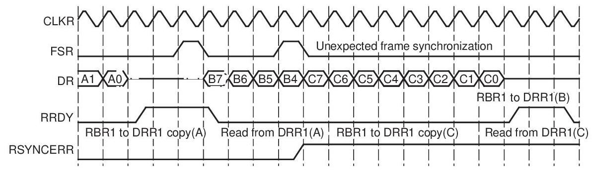

##### 21.5.3.3 Preventing Unexpected Receive Frame-Synchronization Pulses

Each frame transfer can be delayed by 0, 1, or 2 MCLKR cycles, depending on the value in the RDATDLY bits of RCR2. For each possible data delay, Figure 21-25 shows when a new frame-synchronization pulse on FSR can safely occur relative to the last bit of the current frame.

## Figure 21-25. Proper Positioning of Frame-Synchronization Pulses

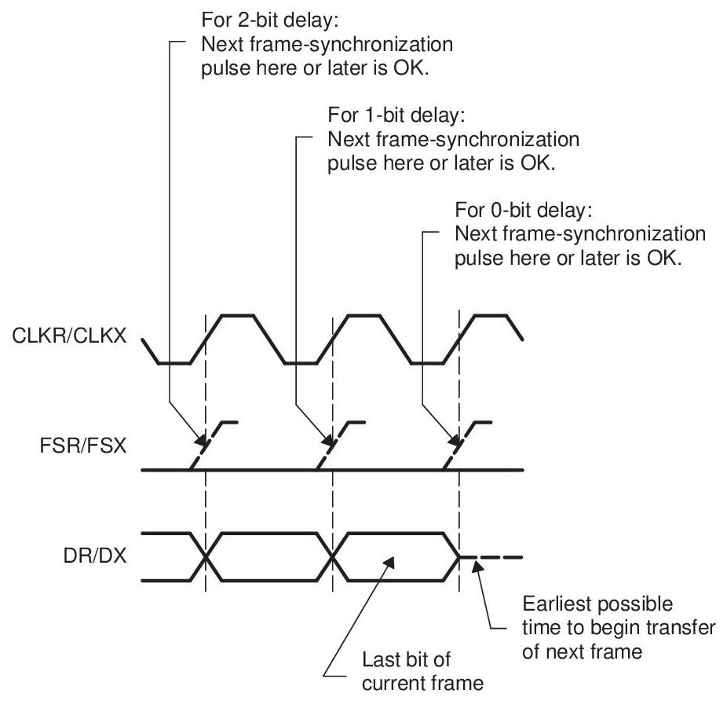

#### 21.5.4 Overwrite in the Transmitter

As described in Section 21.3.6), the transmitter must copy the data previously written to the DXR(s) by the CPU or DMA controller into the XSR(s) and then shift each bit from the XSR(s) to the DX pin. If new data is written to the DXR(s) before the previous data is copied to the XSR(s), the previous data in the DXR(s) is overwritten and thus lost.

##### 21.5.4.1 Example of Overwrite Condition

Figure 21-26 shows what happens if the data in DXR1 is overwritten before being transmitted. Initially, DXR1 is loaded with data C. A subsequent write to DXR1 overwrites C with D before C is copied to XSR1. Thus, C is never transmitted on DX.

Figure 21-26. Data in the McBSP Transmitter Overwritten and Thus Not Transmitted

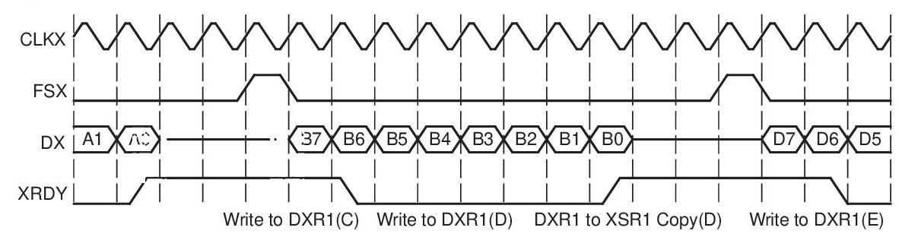

##### 21.5.4.2 Preventing Overwrites

You can prevent CPU overwrites by making the CPU:

- Poll for XRDY = 1 in SPCR2 before writing to the DXR(s). XRDY is set when data is copied from DXR1 to XSR1 and is cleared when new data is written to DXR1.

- Wait for a transmit interrupt (XINT) before writing to the DXR(s). When XINTM = 00b in SPCR2, the transmitter sends XINT to the CPU each time XRDY is set.

You can prevent DMA overwrites by synchronizing DMA transfers to the transmit synchronization event XEVT. The transmitter sends an XEVT signal each time XRDY is set.

#### 21.5.5 Underflow in the Transmitter

The McBSP indicates a transmitter empty (or underflow) condition by clearing the XEMPTY bit in SPCR2. Either of the following events activates XEMPTY (XEMPTY = 0):

- DXR1 has not been loaded since the last DXR-to-XSR copy, and all bits of the data word in the XSR(s) have been shifted out on the DX pin.

- The transmitter is reset (by forcing XRST = 0 in SPCR2, or by a device reset) and is then restarted.

In the underflow condition, the transmitter continues to transmit the old data that is in the DXR(s) for every new transmit frame-synchronization signal, until a new value is loaded into DXR1 by the CPU or the DMA controller.

NOTE: If both DXRs are needed (word length larger than 16 bits), the CPU or the DMA controller must load DXR2 first and then load DXR1. As soon as DXR1 is loaded, the contents of both DXRs are copied to the transmit shift registers (XSRs). If DXR2 is not loaded first, the previous content of DXR2 is passed to the XSR2.

XEMPTY is deactivated (XEMPTY = 1) when a new word in DXR1 is transferred to XSR1. If FSXM = 1 in PCR and FSGM = 0 in SRGR2, the transmitter generates a single internal FSX pulse in response to a DXR-to-XSR copy. Otherwise, the transmitter waits for the next frame-synchronization pulse before sending out the next frame on DX.

When the transmitter is taken out of reset (XRST = 1), it is in a transmitter ready (XRDY = 1 in SPCR2) and transmitter empty (XEMPTY = 0) state. If DXR1 is loaded by the CPU or the DMA controller before internal FSX goes active high, a valid DXR-to-XSR transfer occurs. This allows for the first word of the firs frame to be valid even before the transmit frame-synchronization pulse is generated or detected. Alternatively, if a transmit frame-synchronization pulse is detected before DXR1 is loaded, zeros are output on DX.

##### 21.5.5.1 Example of the Underflow Condition

Figure 21-27 shows an underflow condition. After B is transmitted, DXR1 is not reloaded before the subsequent frame-synchronization pulse. Thus, B is again transmitted on DX.

Figure 21-27. Underflow During McBSP Transmission

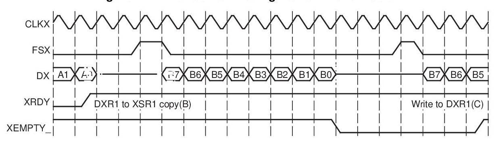

##### 21.5.5.2 Example of Preventing Underflow Condition

Figure 21-28 shows the case of writing to DXR1 just before an underflow condition would otherwise occur. After B is transmitted, C is written to DXR1 before the next frame-synchronization pulse. As a result, there is no underflow; B is not transmitted twice.

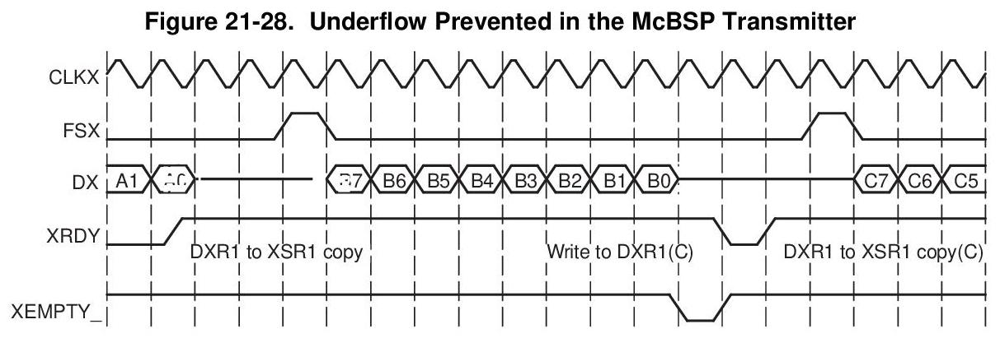

#### 21.5.6 Unexpected Transmit Frame-Synchronization Pulse

Section 21.5.6.1 shows how the McBSP responds to any transmit frame-synchronization pulses, including an unexpected pulse. Section 21.5.6.2 and Section 21.5.6.3 show examples of a frame-synchronization error and an example of how to prevent such an error, respectively.

##### 21.5.6.1 Possible Responses to Transmit Frame-Synchronization Pulses

Figure 21-29 shows the decision tree that the transmitter uses to handle all incoming frame-synchronization pulses. The figure assumes that the transmitter has been started (XRST = 1 in SPCR2). Case 3 shows where an error occurs.

Figure 21-29. Possible Responses to Transmit Frame-Synchronization Pulses

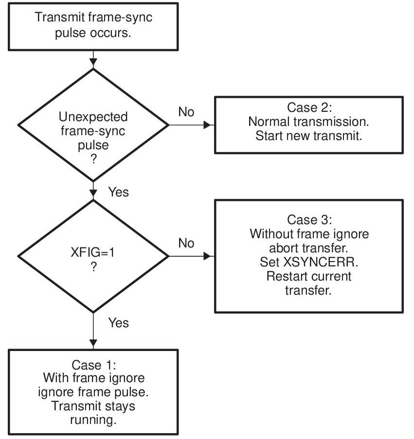

Any one of three cases can occur:

- Case 1: Unexpected internal FSX pulses with XFIG = 1 in XCR2. Transmit frame-synchronization pulses are ignored, and the transmission continues.

- Case 2: Normal serial port transmission. Transmission continues normally because the frame-synchronization pulse is not unexpected. There are two possible reasons why a transmit operations might not be in progress when the pulse occurs:

This FSX pulse is the first after the transmitter is enabled (XRST = 1).

The serial port is in the interpacket intervals. The programmed data delay for transmission (programmed with the XDATDLY bits of XCR2) may start during these interpacket intervals before the first bit of the previous word is transmitted. Thus, at maximum packet frequency, frame synchronization can still be received 0 to 2 clock cycles before the first bit of the synchronized frame.

- Case 3: Unexpected transmit frame synchronization with XFIG = 0 (frame-synchronization pulses not ignored). Unexpected frame-synchronization pulses can originate from an external source or from the internal sample rate generator.

If a frame-synchronization pulse starts the transfer of a new frame before the current frame is fully transmitted, this pulse is treated as an unexpected frame-synchronization pulse, and the transmitter sets the transmit frame-synchronization error bit (XSYNCERR) in SPCR2. XSYNCERR can be cleared only by a transmitter reset or by a write of 0 to this bit.

If you want the McBSP to notify the CPU of frame-synchronization errors, you can set a special transmit interrupt mode with the XINTM bits of SPCR2. When XINTM = 11b, the McBSP sends a transmit interrupt (XINT) request to the CPU each time that XSYNCERR is set.

##### 21.5.6.2 Example of Unexpected Transmit Frame-Synchronization Pulse

Section 21.5.3.2 shows an unexpected transmit frame-synchronization pulse during normal operation of the serial port with intervals between the data packets. When the unexpected frame-synchronization pulse occurs, the XSYNCERR bit is set and the transmission of data B is restarted because no new data has been passed to XSR1 yet. In addition, if XINTM = 11b, the McBSP sends a transmit interrupt (XINT) request to the CPU.

Figure 21-30. An Unexpected Frame-Synchronization Pulse During a McBSP Transmission

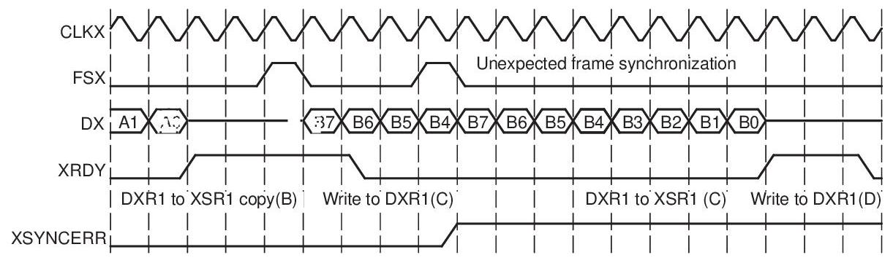

##### 21.5.6.3 Preventing Unexpected Transmit Frame-Synchronization Pulses

Each frame transfer can be delayed by 0, 1 , or 2 CLKX cycles, depending on the value in the XDATDLY bits of XCR2. For each possible data delay, Figure 21-31 shows when a new frame-synchronization pulse on FSX can safely occur relative to the last bit of the current frame.

## Figure 21-31. Proper Positioning of Frame-Synchronization Pulses

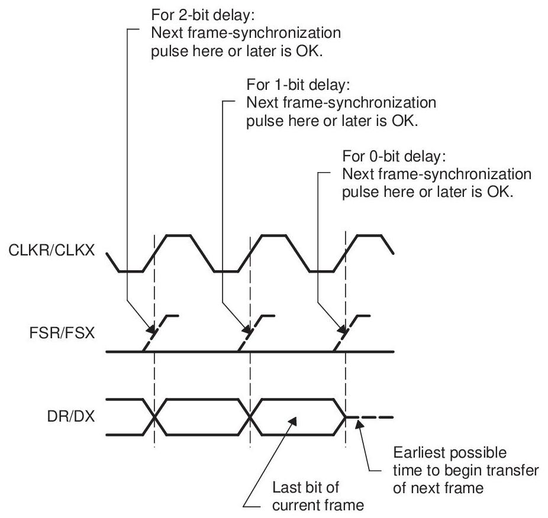

### 21.6 Multichannel Selection Modes

This section discusses the multichannel selection modes for the McBSP. 多通道选择模式

#### 21.6.1 Channels, Blocks, and Partitions

McBSP信道是移动一个串行字的位的时间槽。每个McBSP最多支持128个通道用于接收和128个通道用于传输。

A McBSP channel is a time slot for shifting in/out the bits of one serial word. Each McBSP supports up to 128 channels for reception and 128 channels for transmission.

In the receiver and in the transmitter, the 128 available channels are divided into eight blocks that each contain 16 contiguous channels (see Table 21-8 through Table 21-10): 在接收机和发射机中,128个可用通道分为8个区块,每个区块包含11

- It is possible to have two receive partitions (A & B) and 8 transmit partitions (A – H). 可以有两个接收分区(A&B)和8个传输分区(A-

- McBSP can transmit/receive on selected channels. NoBSP可以在选定的通道上传输/接收

- Each channel partition has a dedicated channel-enable register. Each bit controls whether data flow is allowed or prevented in one of the channels assigned to that partition. 每个信道分区都有一个专用的信道启用寄存器。每个位控制在分配给该分区的一个通道中是否允许或阻止数据流。

- There are three transmit multichannel modes and one receive multichannel mode. 有三种传输多通道模式和一种接收多通道模式。

Table 21-8. Block - Channel Assignment

<table><tr><td>Block</td><td>Channels</td></tr><tr><td>0</td><td>0 -15</td></tr><tr><td>1</td><td>16 - 31</td></tr><tr><td>2</td><td>32 - 47</td></tr><tr><td>3</td><td>48 - 63</td></tr><tr><td>4</td><td>64 - 79</td></tr><tr><td>5</td><td>80 - 95</td></tr><tr><td>6</td><td>96 - 111</td></tr><tr><td>7</td><td>112 - 127</td></tr></table>

The blocks are assigned to partitions according to the selected partition mode. In the two-partition mode (described in Section 21.6.4), you assign one even-numbered block (0, 2, 4, or 6) to partition A and one odd-numbered block (1, 3, 5, or 7) to partition B. In the 8-partition mode (described in Section 21.6.5), blocks 0 through 7 are automatically assigned to partitions, A through H, respectively.

Table 21-9. 2-Partition Mode

<table><tr><td>Partition</td><td>Blocks</td></tr><tr><td>A</td><td>0 or 2 or 4 or 6</td></tr><tr><td>B</td><td>1 or 3 or 5 or 7</td></tr></table>

根据所选的分区模式,将这些块分配给分区。在双分区模式 (第21.6.4节)中描述),将一个偶数块(0、2、4或6)分配给分区A,将一个奇数块(1、3、5或7)分配给分区B. 在 8分区模式(在第21.6.5节)中描述中,块0到7分别自动分配给分区A到H.

Table 21-10. 8-Partition mode

<table><tr><td>Partition</td><td>Blocks</td><td>Channels</td></tr><tr><td>A</td><td>0</td><td>0 -15</td></tr><tr><td>B</td><td>1</td><td>16 - 31</td></tr><tr><td>C</td><td>2</td><td>32 - 47</td></tr><tr><td>D</td><td>3</td><td>48 - 63</td></tr><tr><td>E</td><td>4</td><td>64 - 79</td></tr><tr><td>F</td><td>5</td><td>80 - 95</td></tr><tr><td>G</td><td>6</td><td>96 - 111</td></tr><tr><td>H</td><td>7</td><td>112 - 127</td></tr></table>

The number of partitions for reception and the number of partitions for transmission are independent. For example, it is possible to use two receive partitions (A and B) and eight transmit partitions (A-H).

21.6.2 Multichannel Selection 当MCBSP在与其他MCBSP或串行设备通信时使用时分复用(TDM数据流时和总线带宽,您可以使用多通道选择模式来防止某些通道中的数据流。

When a McBSP uses a time-division multiplexed (TDM) data stream while communicating with other McBSPs or serial devices, the McBSP may need to receive and/or transmit on only a few channels. To save memory and bus bandwidth, you can use a multichannel selection mode to prevent data flow in some of the channels.

Each channel partition has a dedicated channel enable register. If the appropriate multichannel selection mode is on, each bit in the register controls whether data flow is allowed or prevented in one of the channels that is assigned to that partition.

The McBSP has one receive multichannel selection mode (described in Section 21.6.6) and three transmit multichannel selection modes (described in Section 21.6.7).

#### 21.6.3 Configuring a Frame for Multichannel Selection

Before you enable a multichannel selection mode, make sure you properly configure the data frame:

- Select a single-phase frame (RPHASE/XPHASE = 0). Each frame represents a TDM data stream.

- Set a frame length (in RFRLEN1/XFRLEN1) that includes the highest-numbered channel to be used. For example, if you plan to use channels 0, 15, and 39 for reception, the receive frame length must be at least 40 (RFRLEN1 = 39). If XFRLEN1 = 39 in this case, the receiver creates 40 time slots per frame but only receives data during time slots 0, 15 , and 39 of each frame.

#### 21.6.4 Using Two Partitions

For multichannel selection operation in the receiver and/or the transmitter, you can use two partitions or eight partitions (described in Section 21.6.5). If you choose the 2-partition mode (RMCME = 0 for reception, XMCME = 0 for transmission), McBSP channels are activated using an alternating scheme. In response to a frame-synchronization pulse, the receiver or transmitter begins with the channels in partition A and then alternates between partitions B and A until the complete frame has been transferred. When the next frame-synchronization pulse occurs, the next frame is transferred beginning with the channels in partition A.

##### 21.6.4.1 Assigning Blocks to Partitions A and B

For reception, any two of the eight receive-channel blocks can be assigned to receive partitions A and B, which means up to 32 receive channels can be enabled at any given point in time. Similarly, any two of the eight transmit-channel blocks (up 32 enabled transmit channels) can be assigned to transmit partitions A and B.

For reception:

- Assign an even-numbered channel block (0, 2, 4, or 6) to receive partition A by writing to the RPABLK bits. In the receive multichannel selection mode (described in Section 21.6.6), the channels in this partition are controlled by receive channel enable register A (RCERA).

- Assign an odd-numbered block \( (1,3,5 \) , or 7) to receive partition B with the RPBBLK bits. In the receive multichannel selection mode, the channels in this partition are controlled by receive channel enable register B (RCERB).

For transmission:

- Assign an even-numbered channel block (0, 2, 4, or 6) to transmit partition A by writing to the XPABLK bits. In one of the transmit multichannel selection modes (described in Section 21.6.7), the channels in this partition are controlled by transmit channel enable register A (XCERA).

- Assign an odd-numbered block (1, 3, 5, or 7) to transmit partition B with the XPBBLK bits. In one of the transmit multichannel selection modes, the channels in this partition are controlled by transmit channel enable register B (XCERB).

Figure 21-32 shows an example of alternating between the channels of partition A and the channels of partition B. Channels 0-15 have been assigned to partition A, and channels 16-31 have been assigned to partition B. In response to a frame-synchronization pulse, the McBSP begins a frame transfer with partition A and then alternates between partitions B and A until the complete frame is transferred.

Figure 21-32. Alternating Between the Channels of Partition A and the Channels of Partition B

Two-partition mode. Example with fixed block assignments

<table><tr><td>Partition</td><td>A</td><td></td><td></td><td></td><td></td><td></td><td></td><td></td><td>A</td></tr><tr><td>Block</td><td></td><td></td><td></td><td></td><td></td><td></td><td></td><td></td><td></td></tr><tr><td>Channels</td><td></td><td></td><td></td><td></td><td></td><td></td><td></td><td></td><td></td></tr><tr><td>FS(R/X)</td><td></td><td></td><td></td><td></td><td></td><td></td><td></td><td></td><td></td></tr></table>

As explained in Section 21.6.4.2, you can dynamically change which blocks of channels are assigned to the partitions.

##### 21.6.4.2 Reassigning Blocks During Reception/Transmission

If you want to use more than 32 channels, you can change which channel blocks are assigned to partitions A and B during the course of a data transfer. However, these changes must be carefully timed. While a partition is being transferred, its associated block assignment bits cannot be modified and its associated channel enable register cannot be modified. For example, if block 3 is being transferred and block 3 is assigned to partition A, you cannot modify (R/X)PABLK to assign different channels to partition A, nor (R/X)CERA to change the channel configuration for partition A.

Several features of the McBSP help you time the reassignment:

- The block of channels currently involved in reception/transmission (the current block) is reflected in the RCBLK/XCBLK bits. Your program can poll these bits to determine which partition is active. When a partition is not active, it is safe to change its block assignment and channel configuration.

- At the end of every block (at the boundary of two partitions), an interrupt can be sent to the CPU. In response to the interrupt, the CPU can then check the RCBLK/XCBLK bits and update the inactive partition. See Section 21.6.8.

Figure 21-33 shows an example of reassigning channels throughout a data transfer. In response to a frame-synchronization pulse, the McBSP alternates between partitions A and B. Whenever partition B is active, the CPU changes the block assignment for partition A. Whenever partition A is active, the CPU changes the block assignment for partition B.

Figure 21-33. Reassigning Channel Blocks Throughout a McBSP Data Transfer

Two-partition mode. Example with changing block assignments

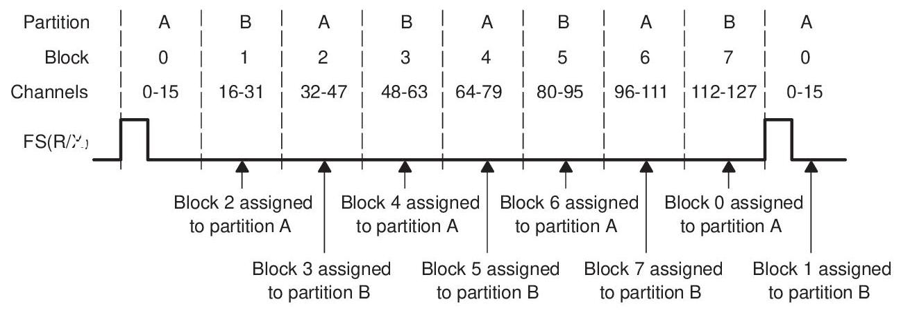

#### 21.6.5 Using Eight Partitions

For multichannel selection operation in the receiver and/or the transmitter, you can use eight partitions or two partitions (described in Section 21.6.4). If you choose the 8-partition mode (RMCME = 1 for reception, XMCME = 1 for transmission), McBSP channels are activated in the following order: A, B, C, D, E, F, G, H. In response to a frame-synchronization pulse, the receiver or transmitter begins with the channels in partition A and then continues with the other partitions in order until the complete frame has been transferred. When the next frame-synchronization pulse occurs, the next frame is transferred, beginning with the channels in partition A.

In the 8-partition mode, the (R/X)PABLK and (R/X)PBBLK bits are ignored and the 16-channel blocks are assigned to the partitions as shown in Table 21-11 and Table 21-12. These assignments cannot be changed. The tables also show the registers used to control the channels in the partitions.

Table 21-11. Receive Channel Assignment and Control With Eight Receive Partitions

<table><tr><td>Receive Partition</td><td>Assigned Block of Receive Channels</td><td>Register Used For Channel Control</td></tr><tr><td>A</td><td>Block 0: channels 0 through 15</td><td>RCERA</td></tr><tr><td>B</td><td>Block 1: channels 16 through 31</td><td>RCERB</td></tr><tr><td>C</td><td>Block 2: channels 32 through 47</td><td>RCERC</td></tr><tr><td>D</td><td>Block 3: channels 48 through 63</td><td>RCERD</td></tr><tr><td>E</td><td>Block 4: channels 64 through 79</td><td>RCERE</td></tr><tr><td>F</td><td>Block 5: channels 80 through 95</td><td>RCERF</td></tr><tr><td>G</td><td>Block 6: channels 96 through 111</td><td>RCERG</td></tr><tr><td>H</td><td>Block 7: channels 112 through 127</td><td>RCERH</td></tr></table>

Table 21-12. Transmit Channel Assignment and Control When Eight Transmit Partitions Are Used

<table><tr><td>Transmit Partition</td><td>Assigned Block of Transmit Channels</td><td>Register Used For Channel Control</td></tr><tr><td>A</td><td>Block 0: channels 0 through 15</td><td>XCERA</td></tr><tr><td>B</td><td>Block 1: channels 16 through 31</td><td>XCERB</td></tr><tr><td>C</td><td>Block 2: channels 32 through 47</td><td>XCERC</td></tr><tr><td>D</td><td>Block 3: channels 48 through 63</td><td>XCERD</td></tr><tr><td>E</td><td>Block 4: channels 64 through 79</td><td>XCERE</td></tr><tr><td>F</td><td>Block 5: channels 80 through 95</td><td>XCERF</td></tr><tr><td>G</td><td>Block 6: channels 96 through 111</td><td>XCERG</td></tr><tr><td>H</td><td>Block 7: channels 112 through 127</td><td>XCERH</td></tr></table>

Figure 21-34 shows an example of the McBSP using the 8-partition mode. In response to a frame-synchronization pulse, the McBSP begins a frame transfer with partition A and then activates B, C, D, E, F, G, and H to complete a 128-word frame.

Figure 21-34. McBSP Data Transfer in the 8-Partition Mode

Eight-partition mode

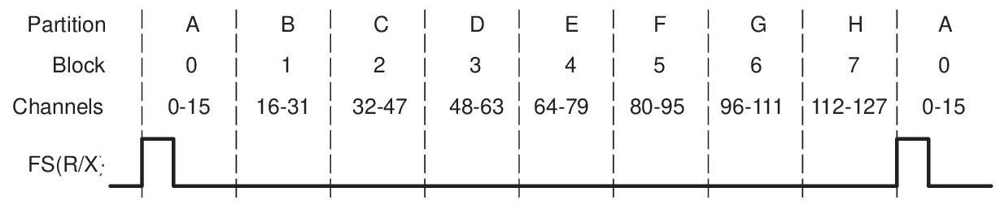

#### 21.6.6 Receive Multichannel Selection Mode

The RMCM bit of MCR1 determines whether all channels or only selected channels are enabled for reception. When RMCM = 0, all 128 receive channels are enabled and cannot be disabled. When RMCM = 1, the receive multichannel selection mode is enabled. In this mode:

- Channels can be individually enabled or disabled. The only channels enabled are those selected in the appropriate receive channel enable registers (RCERs). The way channels are assigned to the RCERs depends on the number of receive channel partitions (2 or 8), as defined by the RMCME bit of MCR1.

- If a receive channel is disabled, any bits received in that channel are passed only as far as the receive buffer register(s) (RBR(s)). The receiver does not copy the content of the RBR(s) to the DRR(s), and as a result, does not set the receiver ready bit (RRDY). Therefore, no DMA synchronization event (REVT) is generated and, if the receiver interrupt mode depends on RRDY (RINTM = 00b), no interrupt is generated.

As an example of how the McBSP behaves in the receive multichannel selection mode, suppose you enable only channels 0, 15 , and 39 and that the frame length is 40 . The McBSP:

1. Accepts bits shifted in from the DR pin in channel 0

2. Ignores bits received in channels 1-14

3. Accepts bits shifted in from the DR pin in channel 15

4. Ignores bits received in channels 16-38

5. Accepts bits shifted in from the DR pin in channel 39

#### 21.6.7 Transmit Multichannel Selection Modes

The XMCM bits of XCR2 determine whether all channels or only selected channels are enabled and unmasked for transmission. More details on enabling and masking are in Section 21.6.7.1. The McBSP has three transmit multichannel selection modes (XMCM = 01b, XMCM = 10b, and XMCM = 11b), which are described in the following table.

Table 21-13. Selecting a Transmit Multichannel Selection Mode With the XMCM Bits

<table><tr><td>XMCM</td><td>Transmit Multichannel Selection Mode</td></tr><tr><td>00b</td><td>No transmit multichannel selection mode is on. All channels are enabled and unmasked. No channels can be disabled or masked.</td></tr><tr><td>01b</td><td>All channels are disabled unless they are selected in the appropriate transmit channel enable registers (XCERs). If enabled, a channel in this mode is also unmasked.</td></tr><tr><td></td><td>The XMCME bit of MCR2 determines whether 32 channels or 128 channels are selectable in XCERs.</td></tr><tr><td>10b</td><td>All channels are enabled, but they are masked unless they are selected in the appropriate transmit channel enable registers (XCERs).   The XMCME bit of MCR2 determines whether 32 channels or 128 channels are selectable in XCERs.</td></tr><tr><td>11b</td><td>This mode is used for symmetric transmission and reception.</td></tr><tr><td></td><td>All channels are disabled for transmission unless they are enabled for reception in the appropriate receive channel enable registers (RCERs). Once enabled, they are masked unless they are also selected in the appropriate transmit channel enable registers (XCERs).   The XMCME bit of MCR2 determines whether 32 channels or 128 channels are selectable in RCERs and XCERs.</td></tr></table>

As an example of how the McBSP behaves in a transmit multichannel selection mode, suppose that XMCM = 01b (all channels disabled unless individually enabled) and that you have enabled only channels 0, 15, and 39. Suppose also that the frame length is 40. The McBSP:

1. Shifts data to the DX pin in channel 0

2. Places the DX pin in the high impedance state in channels 1-14

3. Shifts data to the DX pin in channel 15

4. Places the DX pin in the high impedance state in channels 16-38

5. Shifts data to the DX pin in channel 39

##### 21.6.7.1 Disabling/Enabling Versus Masking/Unmasking

For transmission, a channel can be:

- Enabled and unmasked (transmission can begin and can be completed)

- Enabled but masked (transmission can begin but cannot be completed)

- Disabled (transmission cannot occur)

The following definitions explain the channel control options:

---

Enabled channel 	A channel that can begin transmission by passing data from the data transmit register(s)

	(DXR(s)) to the transmit shift registers (XSR(s)).

Masked channel 	A channel that cannot complete transmission. The DX pin is held in the high impedance

	state; data cannot be shifted out on the DX pin.

	In systems where symmetric transmit and receive provides software benefits, this feature

	allows transmit channels to be disabled on a shared serial bus. A similar feature is not

	needed for reception because multiple receptions cannot cause serial bus contention.

Disabled channel 	A channel that is not enabled. A disabled channel is also masked.

	Because no DXR-to-XSR copy occurs, the XRDY bit of SPCR2 is not set. Therefore, no

	DMA synchronization event (XEVT) is generated, and if the transmit interrupt mode

	depends on XRDY (XINTM = 00b in SPCR2), no interrupt is generated.

	The XEMPTY bit of SPCR2 is not affected.

Unmasked channel 	A channel that is not masked. Data in the XSR(s) is shifted out on the DX pin.

---

##### 21.6.7.2 Activity on McBSP Pins for Different Values of XMCM

Figure 21-35 shows the activity on the McBSP pins for the various XMCM values. In all cases, the transmit frame is configured as follows:

- XPHASE = 0: Single-phase frame (required for multichannel selection modes)

- XFRLEN1 = 0000011b: 4 words per frame

- XWDLEN1 = 000b: 8 bits per word

- XMCME = 0: 2-partition mode (only partitions A and B used)

In the case where XMCM = 11b, transmission and reception are symmetric, which means the corresponding bits for the receiver (RPHASE, RFRLEN1, RWDLEN1, and RMCME) must have the same values as XPHASE, XFRLEN1, and XWDLEN1, respectively.

In the figure, the arrows showing where the various events occur are only sample indications. Wherever possible, there is a time window in which these events can occur.

#### 21.6.8 Using Interrupts Between Block Transfers

When a multichannel selection mode is used, an interrupt request can be sent to the CPU at the end of every 16-channel block (at the boundary between partitions and at the end of the frame). In the receive multichannel selection mode, a receive interrupt (RINT) request is generated at the end of each block transfer if RINTM = 01b. In any of the transmit multichannel selection modes, a transmit interrupt (XINT) request is generated at the end of each block transfer if XINTM = 01b. When RINTM/XINTM = 01b, no interrupt is generated unless a multichannel selection mode is on.

These interrupt pulses are active high and last for two CPU clock cycles.

This type of interrupt is especially helpful if you are using the two-partition mode (described in Section 21.6.4) and you want to know when you can assign a different block of channels to partition A or B.

Figure 21-35. Activity on McBSP Pins for the Possible Values of XMCM

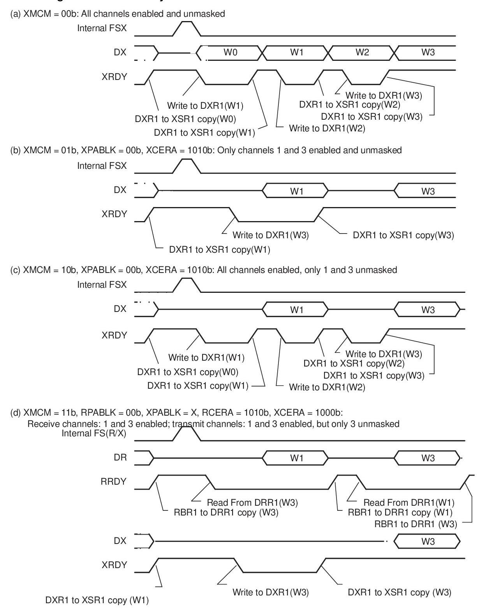

### 21.7 SPI Operation Using the Clock Stop Mode

This chapter explains how to use the McBSP in SPI mode.

#### 21.7.1 SPI Protocol

The SPI protocol is a master-slave configuration with one master device and one or more slave devices. The interface consists of the following four signals:

- Serial data input (also referred to as master in/slave out, or SPISOMI)

- Serial data output (also referred to as master out/slave in, or SPISIMO)

- Shift-clock (also referred to as SPICLK)

- Slave-enable signal (also referred to as SPISTE)

A typical SPI interface with a single slave device is shown in Figure 21-36.

Figure 21-36. Typical SPI Interface

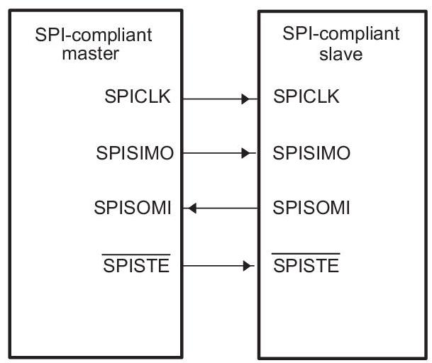

The master device controls the flow of communication by providing shift-clock and slave-enable signals. The slave-enable signal is an optional active-low signal that enables the serial data input and output of the slave device (device not sending out the clock).

In the absence of a dedicated slave-enable signal, communication between the master and slave is determined by the presence or absence of an active shift-clock. When the McBSP is operating in SPI master mode and the SPISTE signal is not used by the slave SPI port, the slave device must remain enabled at all times, and multiple slaves cannot be used.

#### 21.7.2 Clock Stop Mode

The clock stop mode of the McBSP provides compatibility with the SPI protocol. When the McBSP is configured in clock stop mode, the transmitter and receiver are internally synchronized so that the McBSF functions as an SPI master or slave device. The transmit clock signal (CLKX) corresponds to the serial clock signal (SPICLK) of the SPI protocol, while the transmit frame-synchronization signal (FSX) is used as the slave-enable signal (SPISTE).

The receive clock signal (MCLKR) and receive frame-synchronization signal (FSR) are not used in the clock stop mode because these signals are internally connected to their transmit counterparts, CLKX and FSX.

#### 21.7.3 Enable and Configure the Clock Stop Mode

The bits required to configure the McBSP as an SPI device are introduced in Table 21-14. Table 21-15 shows how the various combinations of the CLKSTP bit and the polarity bits CLKXP and CLKRP create four possible clock stop mode configurations. The timing diagrams in Section 21.7.4 show the effects of CLKSTP, CLKXP, and CLKRP.

Table 21-14. Bits Used to Enable and Configure the Clock Stop Mode

<table><tr><td>Bit Field</td><td>Description</td></tr><tr><td>CLKSTP bits of SPCR1</td><td>Use these bits to enable the clock stop mode and to select one of two timing variations. (See also Table 21-15.)</td></tr><tr><td>CLKXP bit of PCR</td><td>This bit determines the polarity of the CLKX signal. (See also Table 21-15.)</td></tr><tr><td>CLKRP bit of PCR</td><td>This bit determines the polarity of the MCLKR signal. (See also Table 21-15.)</td></tr><tr><td>CLKXM bit of PCR</td><td>This bit determines whether CLKX is an input signal (McBSP as slave) or an output signal (McBSP as master).</td></tr></table>

Table 21-14. Bits Used to Enable and Configure the Clock Stop Mode (continued)

<table><tr><td>Bit Field</td><td>Description</td></tr><tr><td>XPHASE bit of XCR2</td><td>You must use a single-phase transmit frame (XPHASE \( = 0 \) ).</td></tr><tr><td>RPHASE bit of RCR2</td><td>You must use a single-phase receive frame (RPHASE \( = 0 \) ).</td></tr><tr><td>XFRLEN1 bits of XCR1</td><td>You must use a transmit frame length of 1 serial word (XFRLEN1 = 0).</td></tr><tr><td>RFRLEN1 bits of RCR1</td><td>You must use a receive frame length of 1 serial word (RFRLEN1 = 0).</td></tr><tr><td>XWDLEN1 bits of XCR1</td><td>The XWDLEN1 bits determine the transmit packet length. XWDLEN1 must be equal to RWDLEN1 because in the clock stop mode. The McBSP transmit and receive circuits are synchronized to a single clock.</td></tr><tr><td>RWDLEN1 bits of RCR1</td><td>The RWDLEN1 bits determine the receive packet length. RWDLEN1 must be equal to XWDLEN1 because in the clock stop mode. The McBSP transmit and receive circuits are synchronized to a single clock.</td></tr></table>

Table 21-15. Effects of CLKSTP, CLKXP, and CLKRP on the Clock Scheme

<table><tr><td>Bit Settings</td><td>Clock Scheme</td></tr><tr><td>CLKSTP = 00b or 01b   CLKXP = 0 or 1   CLKRP = 0 or 1</td><td>Clock stop mode disabled. Clock enabled for non-SPI mode.</td></tr><tr><td>CLKSTP = 10b   CLKXP = 0   CLKRP = 0</td><td>Low inactive state without delay: The McBSP transmits data on the rising edge of CLKX and receives data on the falling edge of MCLKR.</td></tr><tr><td>CLKSTP = 11b   CLKXP = 0   CLKRP = 1</td><td>Low inactive state with delay: The McBSP transmits data one-half cycle ahead of the rising edge of CLKX and receives data on the rising edge of MCLKR.</td></tr><tr><td>CLKSTP = 10b   CLKXP = 1   CLKRP = 0</td><td>High inactive state without delay: The McBSP transmits data on the falling edge of CLKX and receives data on the rising edge of MCLKR.</td></tr><tr><td>CLKSTP = 11b   CLKXP = 1   CLKRP = 1</td><td>High inactive state with delay: The McBSP transmits data one-half cycle ahead of the falling edge of CLKX and receives data on the falling edge of MCLKR.</td></tr></table>

#### 21.7.4 Clock Stop Mode Timing Diagrams

The timing diagrams for the four possible clock stop mode configurations are shown here. Notice that the frame-synchronization signal used in clock stop mode is active throughout the entire transmission as a slave-enable signal. Although the timing diagrams show 8-bit transfers, the packet length can be set to 8, 12, 16, 20, 24, or 32 bits per packet. The receive packet length is selected with the RWDLEN1 bits of RCR1, and the transmit packet length is selected with the XWDLEN1 bits of XCR1. For clock stop mode the values of RWDLEN1 and XWDLEN1 must be the same because the McBSP transmit and receive circuits are synchronized to a single clock.

NOTE: Even if multiple words are consecutively transferred, the CLKX signal is always stopped and the FSX signal returns to the inactive state after a packet transfer. When consecutive packet transfers are performed, this leads to a minimum idle time of two bit-periods between each packet transfer.

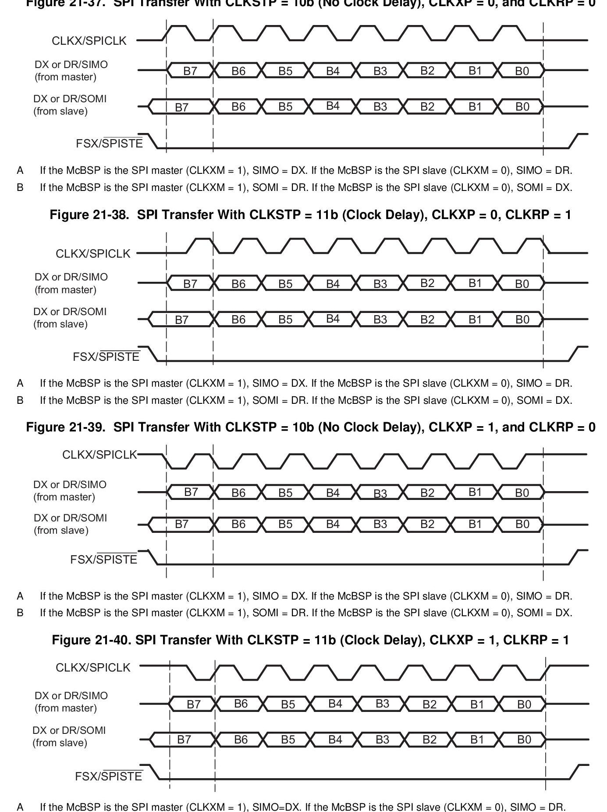

Figure 21-37. SPI Transfer With CLKSTP = 10b (No Clock Delay), CLKXP = 0, and CLKRP = 0

B If the McBSP is the SPI master (CLKXM = 1), SOMI=DR. If the McBSP is the SPI slave (CLKXM = 0), SOMI = DX.

#### 21.7.5 Procedure for Configuring a McBSP for SPI Operation

To configure the McBSP for SPI master or slave operation:

Step 1. Place the transmitter and receiver in reset.

Clear the transmitter reset bit (XRST = 0) in SPCR2 to reset the transmitter. Clear the receiver reset bit (RRST = 0) in SPCR1 to reset the receiver.

Step 2. Place the sample rate generator in reset.

Clear the sample rate generator reset bit (GRST = 0) in SPCR2 to reset the sample rate generator.

Step 3. Program registers that affect SPI operation.

Program the appropriate McBSP registers to configure the McBSP for proper operation as an SPI master or an SPI slave. For a list of important bits settings, see one of the following topics:

- McBSP as the SPI Master ( Section 21.7.6)

- McBSP as an SPI Slave ( Section 21.7.7)

Step 4. Enable the sample rate generator.

To release the sample rate generator from reset, set the sample rate generator reset bit (GRST = 1) in SPCR2.

Make sure that during the write to SPCR2, you only modify GRST. Otherwise, you modify the McBSP configuration you selected in the previous step.

Step 5. Enable the transmitter and receiver.

After the sample rate generator is released from reset, wait two sample rate generator clock periods for the McBSP logic to stabilize.

If the CPU services the McBSP transmit and receive buffers, then you can immediately enable the transmitter (XRST = 1 in SPCR2) and enable the receiver (RRST = 1 in SPCR1).

If the DMA controller services the McBSP transmit and receive buffers, then you must first configure the DMA controller (this includes enabling the channels that service the McBSP buffers). When the DMA controller is ready, make XRST = 1 and RRST = 1.

In either case, make sure you only change XRST and RRST when you write to SPCR2 and SPCR1. Otherwise, you modify the bit settings you selected earlier in this procedure.

After the transmitter and receiver are released from reset, wait two sample rate generator clock periods for the McBSP logic to stabilize.

Step 6. If necessary, enable the frame-synchronization logic of the sample rate generator.

After the required data acquisition setup is done (DXR[1,2] is loaded with data), set FRST = 1 if an internally generated frame-synchronization pulse is required (that is, if the McBSP is the SPI master).

#### 21.7.6 McBSP as the SPI Master

An SPI interface with the McBSP used as the master is shown in Figure 21-41. When the McBSP is configured as a master, the transmit output signal (DX) is used as the SPISIMO signal of the SPI protocol and the receive input signal (DR) is used as the SPISOMI signal.

The register bit values required to configure the McBSP as a master are listed in Table 21-16. After the table are more details about the configuration requirements.

Figure 21-41. SPI Interface with McBSP Used as Master

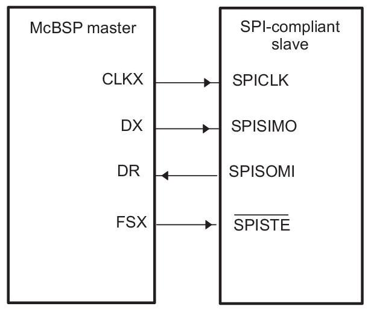

Table 21-16. Bit Values Required to Configure the McBSP as an SPI Master

<table><tr><td>Required Bit Setting</td><td>Description</td></tr><tr><td>CLKSTP = 10b or 11b</td><td>The clock stop mode (without or with a clock delay) is selected.</td></tr><tr><td>CLKXP = 0 or 1</td><td>The polarity of CLKX as seen on the MCLKX pin is positive (CLKXP = 0) or negative (CLKXP = 1).</td></tr><tr><td>CLKRP = 0 or 1</td><td>The polarity of MCLKR as seen on the MCLKR pin is positive (CLKRP = 0) or negative (CLKRP = 1).</td></tr><tr><td>CLKXM = 1</td><td>The MCLKX pin is an output pin driven by the internal sample rate generator. Because CLKSTP is equal to 10b or 11b, MCLKR is driven internally by CLKX.</td></tr><tr><td>SCLKME = 0   CLKSM = 1</td><td>The clock generated by the sample rate generator (CLKG) is derived from the CPU clock.</td></tr><tr><td>CLKGDV is a value from 1 to 255</td><td>CLKGDV defines the divide down value for CLKG.</td></tr><tr><td>FSXM = 1</td><td>The FSX pin is an output pin driven according to the FSGM bit.</td></tr><tr><td>FSGM = 0</td><td>The transmitter drives a frame-synchronization pulse on the FSX pin every time data is transferred from DXR1 to XSR1.</td></tr><tr><td>FSXP = 1</td><td>The FSX pin is active low.</td></tr><tr><td>XDATDLY = 01b</td><td>This setting provides the correct setup time on the FSX signal.</td></tr><tr><td>RDATDLY = 01b</td><td></td></tr></table>

When the McBSP functions as the SPI master, it controls the transmission of data by producing the serial clock signal. The clock signal on the MCLKX pin is enabled only during packet transfers. When packets are not being transferred, the MCLKX pin remains high or low depending on the polarity used.

For SPI master operation, the MCLKX pin must be configured as an output. The sample rate generator is then used to derive the CLKX signal from the CPU clock. The clock stop mode internally connects the MCLKX pin to the MCLKR signal so that no external signal connection is required on the MCLKR pin and both the transmit and receive circuits are clocked by the master clock (CLKX).

The data delay parameters of the McBSP (XDATDLY and RDATDLY) must be set to 1 for proper SPI master operation. A data delay value of 0 or 2 is undefined in the clock stop mode.

The McBSP can also provide a slave-enable signal (SS_) on the FSX pin. If a slave-enable signal is required, the FSX pin must be configured as an output and the transmitter must be configured so that a frame-synchronization pulse is generated automatically each time a packet is transmitted (FSGM = 0). The polarity of the FSX pin is programmable high or low; however, in most cases the pin must be configured active low.

When the McBSP is configured as described for SPI-master operation, the bit fields for frame-synchronization pulse width (FWID) and frame-synchronization period (FPER) are overridden, and custon frame-synchronization waveforms are not allowed. To see the resulting waveform produced on the FSX pin, see the timing diagrams in Section 21.7.4. The signal becomes active before the first bit of a packet transfer, and remains active until the last bit of the packet is transferred. After the packet transfer is complete, the FSX signal returns to the inactive state.

#### 21.7.7 McBSP as an SPI Slave

An SPI interface with the McBSP used as a slave is shown in Figure 21-42. When the McBSP is configured as a slave, DX is used as the SPISOMI signal and DR is used as the SPISIMO signal.

The register bit values required to configure the McBSP as a slave are listed in Table 21-17. Following the table are more details about configuration requirements.

Figure 21-42. SPI Interface With McBSP Used as Slave

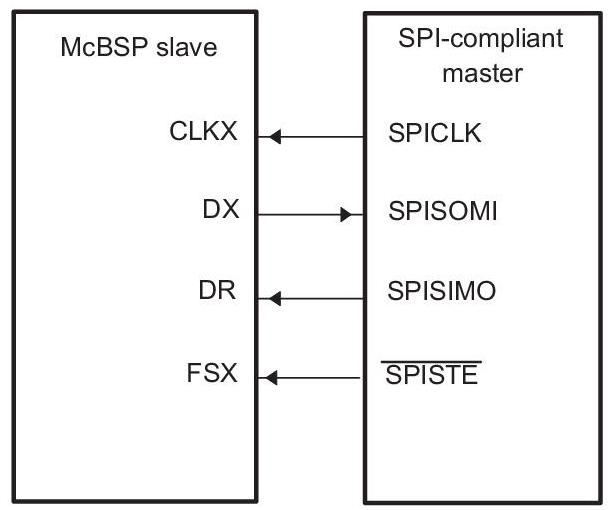

Table 21-17. Bit Values Required to Configure the McBSP as an SPI Slave

<table><tr><td>Required Bit Setting</td><td>Description</td></tr><tr><td>CLKSTP = 10b or 11b</td><td>The clock stop mode (without or with a clock delay) is selected.</td></tr><tr><td>CLKXP = 0 or 1</td><td>The polarity of CLKX as seen on the MCLKX pin is positive (CLKXP = 0) or negative (CLKXP = 1).</td></tr><tr><td>CLKRP = 0 or 1</td><td>The polarity of MCLKR as seen on the MCLKR pin is positive (CLKRP = 0) or negative (CLKRP = 1).</td></tr><tr><td>CLKXM = 0</td><td>The MCLKX pin is an input pin, so that it can be driven by the SPI master. Because CLKSTP = 10b or 11b, MCLKR is driven internally by CLKX.</td></tr><tr><td>SCLKME = 0   CLKSM = 1</td><td>The clock generated by the sample rate generator (CLKG) is derived from the CPU clock. (The sample rate generator is used to synchronize the McBSP logic with the externally-generated master clock.)</td></tr><tr><td>CLKGDV = 1</td><td>The sample rate generator divides the CPU clock before generating CLKG.</td></tr><tr><td>FSXM = 0</td><td>The FSX pin is an input pin, so that it can be driven by the SPI master.</td></tr><tr><td>FSXP = 1</td><td>The FSX pin is active low.</td></tr><tr><td>XDATDLY = 00b</td><td>These bits must be 0s for SPI slave operation.</td></tr><tr><td>RDATDLY = 00b</td><td></td></tr></table>

When the McBSP is used as an SPI slave, the master clock and slave-enable signals are generated externally by a master device. Accordingly, the CLKX and FSX pins must be configured as inputs. The MCLKX pin is internally connected to the MCLKR signal, so that both the transmit and receive circuits of the McBSP are clocked by the external master clock. The FSX pin is also internally connected to the FSR signal, and no external signal connections are required on the MCLKR and FSR pins.

Although the CLKX signal is generated externally by the master and is asynchronous to the McBSP, the sample rate generator of the McBSP must be enabled for proper SPI slave operation. The sample rate generator must be programmed to its maximum rate of half the CPU clock rate. The internal sample rate clock is then used to synchronize the McBSP logic to the external master clock and slave-enable signals.

The McBSP requires an active edge of the slave-enable signal on the FSX input for each transfer. This means that the master device must assert the slave-enable signal at the beginning of each transfer, and deassert the signal after the completion of each packet transfer; the slave-enable signal cannot remain active between transfers. Unlike the standard SPI, this pin cannot be tied low all the time.

The data delay parameters of the McBSP must be set to 0 for proper SPI slave operation. A value of 1 or 2 is undefined in the clock stop mode.

### 21.8 Receiver Configuration

To configure the McBSP receiver, perform the following procedure:

1. Place the McBSP/receiver in reset (see Section 21.8.2).

2. Program McBSP registers for the desired receiver operation (see Section 21.8.1).

3. Take the receiver out of reset (see Section 21.8.2).

#### 21.8.1 Programming the McBSP Registers for the Desired Receiver Operation

The following is a list of important tasks to be performed when you are configuring the McBSP receiver. Each task corresponds to one or more McBSP register bit fields.

- Global behavior:

- Set the receiver pins to operate as McBSP pins.

- Enable/disable the digital loopback mode.

- Enable/disable the clock stop mode.

- Enable/disable the receive multichannel selection mode.

- Data behavior:

- Choose 1 or 2 phases for the receive frame.

- Set the receive word length(s).

- Set the receive frame length.

- Enable/disable the receive frame-synchronization ignore function.

- Set the receive companding mode.

- Set the receive data delay.

- Set the receive sign-extension and justification mode.

- Set the receive interrupt mode.

- Frame-synchronization behavior:

- Set the receive frame-synchronization mode.

- Set the receive frame-synchronization polarity.

- Set the sample rate generator (SRG) frame-synchronization period and pulse width.

- Clock behavior:

- Set the receive clock mode.

- Set the receive clock polarity.

- Set the SRG clock divide-down value.

- Set the SRG clock synchronization mode.

- Set the SRG clock mode (choose an input clock).

- Set the SRG input clock polarity.

#### 21.8.2 Resetting and Enabling the Receiver

The first step of the receiver configuration procedure is to reset the receiver, and the last step is to enable the receiver (to take it out of reset). Table 21-18 describes the bits used for both of these steps.

Table 21-18. Register Bits Used to Reset or Enable the McBSP Receiver Field Descriptions

<table><tr><td>Register</td><td>Bit</td><td>Field</td><td>Value</td><td>Description</td></tr><tr><td rowspan="3">SPCR2</td><td rowspan="3">7</td><td rowspan="3">FRST</td><td></td><td>Frame-synchronization logic reset</td></tr><tr><td>0</td><td>Frame-synchronization logic is reset. The sample rate generator does not generate frame-synchronization signal FSG, even if GRST \( = 1 \) .</td></tr><tr><td>1</td><td>If GRST \( = 1 \) , frame-synchronization signal FSG is generated after (FPER + 1) number of CLKG clock cycles; all frame counters are loaded with their programmed values.</td></tr><tr><td rowspan="3">SPCR2</td><td rowspan="3">6</td><td rowspan="3">GRST</td><td></td><td>Sample rate generator reset</td></tr><tr><td>0</td><td>Sample rate generator is reset. If GRST \( = 0 \) due to a DSP reset, CLKG is driven by the CPU clock divided by 2, and FSG is driven low (inactive). If GRST = 0 due to program code, CLKG and FSG are both driven low (inactive).</td></tr><tr><td>1</td><td>Sample rate generator is enabled. CLKG is driven according to the configuration programmed in the sample rate generator registers (SRGR[1,2]). If FRST \( = 1 \) , the generator also generates the frame-synchronization signal FSG as programmed in the sample rate generator registers.</td></tr><tr><td rowspan="3">SPCR1</td><td rowspan="3">0</td><td rowspan="3">RRST</td><td></td><td>Receiver reset</td></tr><tr><td>0</td><td>The serial port receiver is disabled and in the reset state.</td></tr><tr><td>1</td><td>The serial port receiver is enabled.</td></tr></table>

##### 21.8.2.1 Reset Considerations

The serial port can be reset in the following two ways:

1. The DSP reset (XRS signal driven low) places the receiver, transmitter, and sample rate generator in reset. When the device reset is removed (XRS signal released), GRST = FRST = RRST = XRST = 0 keep the entire serial port in the reset state, provided the McBSP clock is turned on.

2. The serial port transmitter and receiver can be reset directly using the RRST and XRST bits in the serial port control registers. The sample rate generator can be reset directly using the GRST bit in SPCR2.

Table 21-19 shows the state of McBSP pins when the serial port is reset due to a device reset and a direct receiver/transmitter reset.

For more details about McBSP reset conditions and effects, see Section 21.10.2.

Table 21-19. Reset State of Each McBSP Pin

<table><tr><td>Pin</td><td>Possible State(s)</td><td>State Forced By Device Reset</td><td>State Forced By Receiver Reset (RRST = 0 and GRST = 1)</td></tr><tr><td>MDRx</td><td>1</td><td>GPIO Input</td><td>Input</td></tr><tr><td>MCLKRx</td><td>I/O/Z</td><td>GPIO Input</td><td>Known state if input; MCLKR running if output</td></tr><tr><td>MFSRx</td><td>I/O/Z</td><td>GPIO Input</td><td>Known state if input; FSRP inactive state if output   Transmitter reset (XRST = 0 and GRST = 1)</td></tr><tr><td>MDXx</td><td>O/Z</td><td>GPIO Input</td><td>Low impedance after transmit bit clock provided</td></tr><tr><td>MCLKXx</td><td>I/O/Z</td><td>GPIO Input</td><td>Known state if input; CLKX running if output</td></tr><tr><td>MFSXx</td><td>I/O/Z</td><td>GPIO Input</td><td>Known state if input; FSXP inactive state if output</td></tr></table>

#### 21.8.3 Set the Receiver Pins to Operate as McBSP Pins

To configure a pin for its McBSP function, you should configure the bits of the GPxMUXn register appropriately. In addition to this, bits 12 and 13 of the PCR register must be set to 0 . These bits are defined as reserved.

#### 21.8.4 Digital Loopback Mode

The DLB bit determines whether the digital loopback mode is on. DLB is described in Table 21-20.

Table 21-20. Register Bit Used to Enable/Disable the Digital Loopback Mode

<table><tr><td>Register</td><td>Bit</td><td>Name</td><td>Function</td><td></td><td>Type</td><td>Reset Value</td></tr><tr><td>SPCR1</td><td>15</td><td>DLB</td><td colspan="2">Digital loopback mode</td><td>R/W</td><td>0</td></tr><tr><td></td><td></td><td></td><td>DLB = 0</td><td>Digital loopback mode is disabled.</td><td></td><td></td></tr><tr><td></td><td></td><td></td><td>DLB = 1</td><td>Digital loopback mode is enabled.</td><td></td><td></td></tr></table>

##### 21.8.4.1 Digital Loopback Mode

In the digital loopback mode, the receive signals are connected internally through multiplexers to the corresponding transmit signals, as shown in Table 21-21. This mode allows testing of serial port code with a single DSP device; the McBSP receives the data it transmits.

Table 21-21. Receive Signals Connected to Transmit Signals in Digital Loopback Mode

<table><tr><td>This Receive Signal</td><td>Is Fed Internally by This Transmit Signal</td></tr><tr><td>MDR (receive data)</td><td>MDX (transmit data)</td></tr><tr><td>MFSR (receive frame synchronization)</td><td>MFSX (transmit frame synchronization)</td></tr><tr><td>MCLKR (receive clock)</td><td>MCLKX (transmit clock)</td></tr></table>

#### 21.8.5 Clock Stop Mode

The CLKSTP bits determine whether the clock stop mode is on. CLKSTP is described in Table 21-22.

Table 21-22. Register Bits Used to Enable/Disable the Clock Stop Mode

<table><tr><td>Register</td><td>Bit</td><td>Name</td><td>Function</td><td></td><td>Type</td><td>Reset Value</td></tr><tr><td>SPCR1</td><td>12-11</td><td>CLKSTP</td><td>Clock stop mode</td><td></td><td>R/W</td><td>00</td></tr><tr><td></td><td></td><td></td><td>CLKSTP = 0Xb</td><td>Clock stop mode disabled; normal clocking for non-SPI mode</td><td></td><td></td></tr><tr><td></td><td></td><td></td><td>CLKSTP = 10b</td><td>Clock stop mode enabled, without clock delay</td><td></td><td></td></tr><tr><td></td><td></td><td></td><td>CLKSTP = 11b</td><td>Clock stop mode enabled, with clock delay</td><td></td><td></td></tr></table>

##### 21.8.5.1 Clock Stop Mode

The clock stop mode supports the SPI master-slave protocol. If you do not plan to use the SPI protocol, you can clear CLKSTP to disable the clock stop mode.

In the clock stop mode, the clock stops at the end of each data transfer. At the beginning of each data transfer, the clock starts immediately (CLKSTP = 10b) or after a half-cycle delay (CLKSTP = 11b). The CLKXP bit determines whether the starting edge of the clock on the MCLKX pin is rising or falling. The CLKRP bit determines whether receive data is sampled on the rising or falling edge of the clock shown on the MCLKR pin.

Table 21-23 summarizes the impact of CLKSTP, CLKXP, and CLKRP on serial port operation. In the clock stop mode, the receive clock is tied internally to the transmit clock, and the receive frame-synchronization signal is tied internally to the transmit frame-synchronization signal.

www.ti.com

Table 21-23. Effects of CLKSTP, CLKXP, and CLKRP on the Clock Scheme

<table><tr><td>Bit Settings</td><td>Clock Scheme</td></tr><tr><td>CLKSTP = 00b or 01b   CLKXP = 0 or 1   CLKRP = 0 or 1</td><td>Clock stop mode disabled. Clock enabled for non-SPI mode.</td></tr><tr><td>CLKSTP = 10b   CLKXP = 0   CLKRP = 0</td><td>Low inactive state without delay: The McBSP transmits data on the rising edge of CLKX and receives data on the falling edge of MCLKR.</td></tr><tr><td>CLKSTP = 11b   CLKXP = 0   CLKRP = 1</td><td>Low inactive state with delay: The McBSP transmits data one-half cycle ahead of the rising edge of CLKX and receives data on the rising edge of MCLKR.</td></tr><tr><td>CLKSTP = 10b   CLKXP = 1   CLKRP = 0</td><td>High inactive state without delay: The McBSP transmits data on the falling edge of CLKX and receives data on the rising edge of MCLKR.</td></tr><tr><td>CLKSTP = 11b   CLKXP = 1   CLKRP = 1</td><td>High inactive state with delay: The McBSP transmits data one-half cycle ahead of the falling edge of CLKX and receives data on the falling edge of MCLKR.</td></tr></table>

#### 21.8.6 Receive Multichannel Selection Mode

The RMCM bit determines whether the receive multichannel selection mode is on. RMCM is described in Table 21-24. For more details, see Section 21.6.6.

Table 21-24. Register Bit Used to Enable/Disable the Receive Multichannel Selection Mode

<table><tr><td>Register</td><td>Bit</td><td>Name</td><td>Function</td><td></td><td>Type</td><td>Reset Value</td></tr><tr><td>MCR1</td><td>0</td><td>RMCM</td><td></td><td>Receive multichannel selection mode</td><td>R/W</td><td>0</td></tr><tr><td></td><td></td><td></td><td>RMCM = 0</td><td>The mode is disabled.   All 128 channels are enabled.</td><td></td><td></td></tr><tr><td></td><td></td><td></td><td>RMCM = 1</td><td>The mode is enabled.   Channels can be individually enabled or disabled.   The only channels enabled are those selected in the appropriate receive channel enable registers (RCERs). The way channels are assigned to the RCERs depends on the number of receive channel partitions (2 or 8), as defined by the RMCME bit.</td><td></td><td></td></tr></table>

#### 21.8.7 Receive Frame Phases

The RPHASE bit (see Table 21-25) determines whether the receive data frame has one or two phases.

Table 21-25. Register Bit Used to Choose One or Two Phases for the Receive Frame

<table><tr><td>Register</td><td>Bit</td><td>Name</td><td>Function</td><td>Type</td><td>Reset Value</td></tr><tr><td>RCR2</td><td>15</td><td>RPHASE</td><td>Receive phase number</td><td>R/W</td><td>0</td></tr><tr><td></td><td></td><td></td><td>Specifies whether the receive frame has 1 or 2 phases.</td><td></td><td></td></tr><tr><td></td><td></td><td></td><td>RPHASE = 0 Single-phase frame</td><td></td><td></td></tr><tr><td></td><td></td><td></td><td>RPHASE = 1 Dual-phase frame</td><td></td><td></td></tr></table>

#### 21.8.8 Receive Word Length(s)

The RWDLEN1 and RWDLEN2 bit fields (see Table 21-26) determine how many bits are in each serial word in phase 1 and in phase 2, respectively, of the receive data frame.

Table 21-26. Register Bits Used to Set the Receive Word Length(s)

<table><tr><td>Registe r</td><td>Bit</td><td>Name</td><td>Function</td><td></td><td>Type</td><td>Reset Value</td></tr><tr><td rowspan="9">RCR1</td><td>7-5</td><td rowspan="9">RWDLEN1</td><td>Receive word length 1</td><td></td><td>R/W</td><td>000</td></tr><tr><td></td><td colspan="4">Specifies the length of every serial word in phase 1 of the receive frame.</td></tr><tr><td></td><td>RWDLEN1 = 000</td><td>8 bits</td><td></td><td></td></tr><tr><td></td><td>RWDLEN1 = 001</td><td>12 bits</td><td></td><td></td></tr><tr><td></td><td>RWDLEN1 = 010</td><td>16 bits</td><td></td><td></td></tr><tr><td></td><td>RWDLEN1 = 011</td><td>20 bits</td><td></td><td></td></tr><tr><td></td><td>RWDLEN1 = 100</td><td>24 bits</td><td></td><td></td></tr><tr><td></td><td>RWDLEN1 = 101</td><td>32 bits</td><td></td><td></td></tr><tr><td></td><td>RWDLEN1 = 11X</td><td>Reserved</td><td></td><td></td></tr><tr><td>RCR2</td><td>7-5</td><td>RWDLEN2</td><td colspan="2">Receive word length 2</td><td>R/W</td><td>000</td></tr><tr><td></td><td></td><td></td><td colspan="4">If a dual-phase frame is selected, RWDLEN2 specifies the length of every serial word in phase 2 of the frame.</td></tr><tr><td></td><td></td><td></td><td>RWDLEN2 = 000</td><td>8 bits</td><td></td><td></td></tr><tr><td></td><td></td><td></td><td>RWDLEN2 = 001</td><td>12 bits</td><td></td><td></td></tr><tr><td></td><td></td><td></td><td>RWDLEN2 = 010</td><td>16 bits</td><td></td><td></td></tr><tr><td></td><td></td><td></td><td>RWDLEN2 = 011</td><td>20 bits</td><td></td><td></td></tr><tr><td></td><td></td><td></td><td>RWDLEN2 = 100</td><td>24 bits</td><td></td><td></td></tr><tr><td></td><td></td><td></td><td>RWDLEN2 = 101</td><td>32 bits</td><td></td><td></td></tr><tr><td></td><td></td><td></td><td>RWDLEN2 = 11X</td><td>Reserved</td><td></td><td></td></tr></table>

##### 21.8.8.1 Word Length Bits

Each frame can have one or two phases, depending on the value that you load into the RPHASE bit. If a single-phase frame is selected, RWDLEN1 selects the length for every serial word received in the frame. If a dual-phase frame is selected, RWDLEN1 determines the length of the serial words in phase 1 of the frame and RWDLEN2 determines the word length in phase 2 of the frame.

#### 21.8.9 Receive Frame Length

The RFRLEN1 and RFRLEN2 bit fields (see Table 21-27) determine how many serial words are in phase 1 and in phase 2, respectively, of the receive data frame.

Table 21-27. Register Bits Used to Set the Receive Frame Length

<table><tr><td>Regist er</td><td>Bit</td><td>Name</td><td>Function</td><td></td><td>Type</td><td>Reset Value</td></tr><tr><td>RCR1</td><td>14-8</td><td>RFRLEN1</td><td>Receive frame length 1</td><td></td><td>R/W</td><td>0000000</td></tr><tr><td></td><td></td><td></td><td></td><td>(RFRLEN1 + 1) is the number of serial words in phase 1 of the receive frame.</td><td></td><td></td></tr><tr><td></td><td></td><td></td><td>RFRLEN1 = 000 0000</td><td>1 word in phase 1</td><td></td><td></td></tr><tr><td></td><td></td><td></td><td>RFRLEN1 = 000 0001</td><td>2 words in phase 1</td><td></td><td></td></tr><tr><td></td><td></td><td></td><td></td><td></td><td></td><td></td></tr><tr><td></td><td></td><td></td><td>RFRLEN1 = 111 1111</td><td>128 words in phase 1</td><td></td><td></td></tr></table>

Table 21-27. Register Bits Used to Set the Receive Frame Length (continued)

<table><tr><td>Regist er</td><td>Bit</td><td>Name</td><td>Function</td><td></td><td>Type</td><td>Reset Value</td></tr><tr><td>RCR2</td><td>14-8</td><td>RFRLEN2</td><td>Receive frame length 2   If a dual-phase frame is selected, (RFRLEN2 + 1) is the number of serial   words in phase 2 of the receive frame.</td><td></td><td>R/W</td><td>0000000</td></tr><tr><td></td><td></td><td></td><td>RFRLEN2 = 000 0000</td><td>1 word in phase 2</td><td></td><td></td></tr><tr><td></td><td></td><td></td><td>RFRLEN2 = 000 0001</td><td>2 words in phase 2</td><td></td><td></td></tr><tr><td></td><td></td><td></td><td></td><td></td><td></td><td></td></tr><tr><td></td><td></td><td></td><td>RFRLEN2 = 111 1111</td><td>128 words in phase 2</td><td></td><td></td></tr></table>

##### 21.8.9.1 Selected Frame Length

The receive frame length is the number of serial words in the receive frame. Each frame can have one or two phases, depending on value that you load into the RPHASE bit.

If a single-phase frame is selected (RPHASE = 0), the frame length is equal to the length of phase 1. If a dual-phase frame is selected (RPHASE = 1), the frame length is the length of phase 1 plus the length of phase 2.

The 7-bit RFRLEN fields allow up to 128 words per phase. See Table 21-28 for a summary of how to calculate the frame length. This length corresponds to the number of words or logical time slots or channels per frame-synchronization pulse.

Program the RFRLEN fields with [ \( w \) minus 1], where \( w \) represents the number of words per phase. For the example, if you want a phase length of 128 words in phase 1, load 127 into RFRLEN1.

Table 21-28. How to Calculate the Length of the Receive Frame

<table><tr><td>RPHASE</td><td>RFRLEN1</td><td>RFRLEN2</td><td>Frame Length</td></tr><tr><td>0</td><td>\( 0 \leq \) RFRLEN1 \( \leq  {127} \)</td><td>Don't care</td><td>(RFRLEN1 + 1) words</td></tr><tr><td>1</td><td>0 ≤ RFRLEN1 ≤ 127</td><td>\( 0 \leq \) RFRLEN2 \( \leq  {127} \)</td><td>(RFRLEN1 + 1) + (RFRLEN2 + 1) words</td></tr></table>

#### 21.8.10 Receive Frame-Synchronization Ignore Function

The RFIG bit (see Table 21-29) controls the receive frame-synchronization ignore function.

Table 21-29. Register Bit Used to Enable/Disable the Receive Frame-Synchronization Ignore Function

<table><tr><td>Registe r</td><td>Bit</td><td>Name</td><td>Function</td><td></td><td>Type</td><td>Reset Value</td></tr><tr><td>RCR2</td><td>2</td><td rowspan="3">RFIG</td><td></td><td>Receive frame-synchronization ignore</td><td>R/W</td><td>0</td></tr><tr><td></td><td></td><td>RFIG = 0</td><td>0 An unexpected receive frame-synchronization pulse causes the   McBSP to restart the frame transfer.</td><td></td><td></td></tr><tr><td></td><td></td><td>RFIG = 1</td><td>pulses.</td><td></td><td></td></tr></table>

##### 21.8.10.1 Unexpected Frame-Synchronization Pulses and the Frame-Synchronization Ignore Function

If a frame-synchronization pulse starts the transfer of a new frame before the current frame is fully received, this pulse is treated as an unexpected frame-synchronization pulse.

When RFIG = 1, reception continues, ignoring the unexpected frame-synchronization pulses.

When RFIG = 0, an unexpected FSR pulse causes the McBSP to discard the contents of RSR[1,2] in favor of the new incoming data. Therefore, if RFIG = 0 and an unexpected frame-synchronization pulse occurs, the serial port:

1. Aborts the current data transfer

2. Sets RSYNCERR in SPCR1 to 1

3. Begins the transfer of a new data word

For more details about the frame-synchronization error condition, see Section 21.5.3.

##### 21.8.10.2 Examples of Effects of RFIG

Figure 21-43 shows an example in which word B is interrupted by an unexpected frame-synchronization pulse when (R/X)FIG = 0 . In the case of reception, the reception of B is aborted (B is lost), and a new data word C in this example) is received after the appropriate data delay. This condition is a receive synchronization error, which sets the RSYNCERR bit.

Figure 21-43. Unexpected Frame-Synchronization Pulse With (R/X)FIG = 0

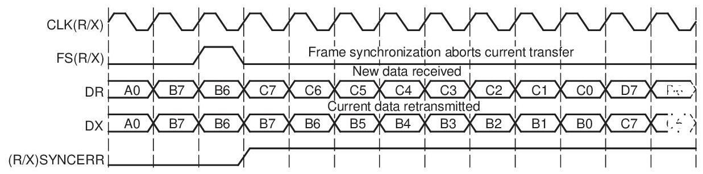

In contrast with Figure 21-43, Figure 21-44 shows McBSP operation when unexpected frame-synchronization signals are ignored (when (R/X)FIG = 1). Here, the transfer of word B is not affected by an unexpected pulse.

Figure 21-44. Unexpected Frame-Synchronization Pulse With (R/X)FIG = 1

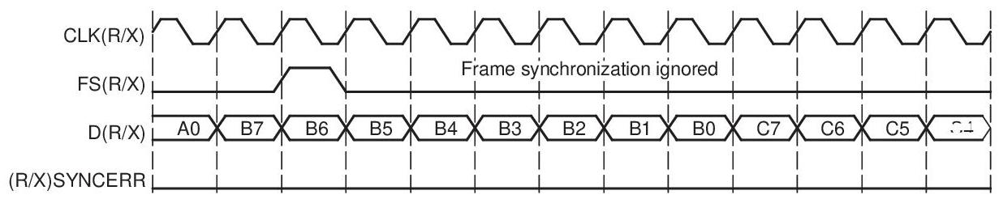

#### 21.8.11 Receive Companding Mode

The RCOMPAND bits (see Table 21-30) determine whether companding or another data transfer option is chosen for McBSP reception.

Table 21-30. Register Bits Used to Set the Receive Companding Mode

<table><tr><td>Regist er</td><td>Bit</td><td>Name</td><td>Function</td><td>Type</td><td>Reset Value</td></tr><tr><td>RCR2</td><td>4-3</td><td>RCOMPAND</td><td>Receive companding mode</td><td>R/W</td><td>00</td></tr><tr><td></td><td></td><td></td><td colspan="3">Modes other than 00b are enabled only when the appropriate RWDLEN is 000b, indicating 8-bit data.</td></tr><tr><td></td><td></td><td></td><td>RCOMPAND = 00 No companding, any size data, MSB received first</td><td></td><td></td></tr><tr><td></td><td></td><td></td><td>RCOMPAND = 01 No companding, 8-bit data, LSB received first (for details, see Section 21.8.11.4).</td><td></td><td></td></tr><tr><td></td><td></td><td></td><td>RCOMPAND = 10 0 \( \mu \) -law companding, 8-bit data, MSB received first</td><td></td><td></td></tr><tr><td></td><td></td><td></td><td>RCOMPAND = 11 1 A-law companding, 8-bit data, MSB received first</td><td></td><td></td></tr></table>

##### 21.8.11.1 Companding

Companding (COMpressing and exPANDing) hardware allows compression and expansion of data in either \( \mu \) -law or A-law format. The companding standard employed in the United States and Japan is \( \mu \) -law. The European companding standard is referred to as A-law. The specifications for \( \mu \) -law and A-law log PCM are part of the CCITT G.711 recommendation.

A-law and \( \mu \) -law allow 13 bits and 14 bits of dynamic range, respectively. Any values outside this range are set to the most positive or most negative value. Thus, for companding to work best, the data transferred to and from the McBSP via the CPU or DMA controller must be at least 16 bits wide.

The \( \mu \) -law and A-law formats both encode data into 8-bit code words. Companded data is always 8 bits wide; the appropriate word length bits (RWDLEN1, RWDLEN2, XWDLEN1, XWDLEN2) must therefore be set to 0, indicating an 8-bit wide serial data stream. If companding is enabled and either of the frame phases does not have an 8-bit word length, companding continues as if the word length is 8 bits.

Figure 21-45 illustrates the companding processes. When companding is chosen for the transmitter, compression occurs during the process of copying data from DXR1 to XSR1. The transmit data is encoded according to the specified companding law (A-law or \( \mu \) -law). When companding is chosen for the receiver, expansion occurs during the process of copying data from RBR1 to DRR1. The receive data is decoded to 2's-complement format.

Figure 21-45. Companding Processes for Reception and for Transmission

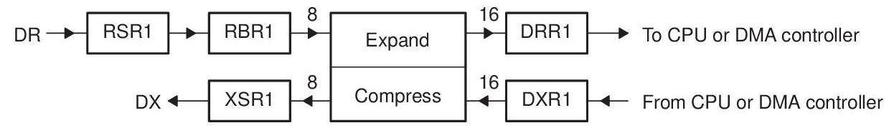

##### 21.8.11.2 Format of Expanded Data

For reception, the 8-bit compressed data in RBR1 is expanded to left-justified 16-bit data in DRR1. The RJUST bit of SPCR1 is ignored when companding is used.

##### 21.8.11.3 Companding Internal Data

If the McBSP is otherwise unused (the serial port transmit and receive sections are reset), the companding hardware can compand internal data. See Section 21.3.2.2.

##### 21.8.11.4 Option to Receive LSB First

Normally, the McBSP transmits or receives all data with the most significant bit (MSB) first. However, certain 8-bit data protocols (that do not use companded data) require the least significant bit (LSB) to be transferred first. If you set RCOMPAND = 01b in RCR2, the bit ordering of 8-bit words is reversed during reception. Similar to companding, this feature is enabled only if the appropriate word length bits are set to 0 , indicating that 8-bit words are to be transferred serially. If either phase of the frame does not have an 8- bit word length, the McBSP assumes the word length is eight bits and LSB-first ordering is done.

#### 21.8.12 Receive Data Delay

The RDATDLY bits (see Table 21-31) determine the length of the data delay for the receive frame.

Table 21-31. Register Bits Used to Set the Receive Data Delay

<table><tr><td>Register</td><td>Bit</td><td>Name</td><td>Function</td><td></td><td>Type</td><td>Reset Value</td></tr><tr><td>RCR2</td><td>1-0</td><td>RDATDLY</td><td>Receive data delay</td><td></td><td>R/W</td><td>00</td></tr><tr><td></td><td></td><td></td><td>RDATDLY \( = {00} \)</td><td>0-bit data delay</td><td></td><td></td></tr><tr><td></td><td></td><td></td><td>RDATDLY \( = {01} \)</td><td>1-bit data delay</td><td></td><td></td></tr><tr><td></td><td></td><td></td><td>RDATDLY \( = {10} \)</td><td>2-bit data delay</td><td></td><td></td></tr><tr><td></td><td></td><td></td><td>RDATDLY \( = {11} \)</td><td>Reserved</td><td></td><td></td></tr></table>

##### 21.8.12.1 Data Delay

The start of a frame is defined by the first clock cycle in which frame synchronization is found to be active. The beginning of actual data reception or transmission with respect to the start of the frame can be delayed if required. This delay is called data delay.

RDATDLY specifies the data delay for reception. The range of programmable data delay is zero to two bit-clocks (RDATDLY = 00b-10b), as described in Table 21-31 and shown in Figure 21-46. In this figure, the data transferred is an 8-bit value with bits labeled B7, B6, B5, and so on. Typically a 1-bit delay is selected, because data often follows a 1-cycle active frame-synchronization pulse.

##### 21.8.12.2 0-Bit Data Delay

Normally, a frame-synchronization pulse is detected or sampled with respect to an edge of internal serial clock CLK(R/X). Thus, on the following cycle or later (depending on the data delay value), data may be received or transmitted. However, in the case of 0-bit data delay, the data must be ready for reception and/or transmission on the same serial clock cycle.

For reception, this problem is solved because receive data is sampled on the first falling edge of MCLKR where an active-high internal FSR is detected. However, data transmission must begin on the rising edge of the internal CLKX clock that generated the frame synchronization. Therefore, the first data bit is assumed to be present in XSR1, and thus on DX. The transmitter then asynchronously detects the frame-synchronization signal (FSX) going active high and immediately starts driving the first bit to be transmitted on the DX pin.

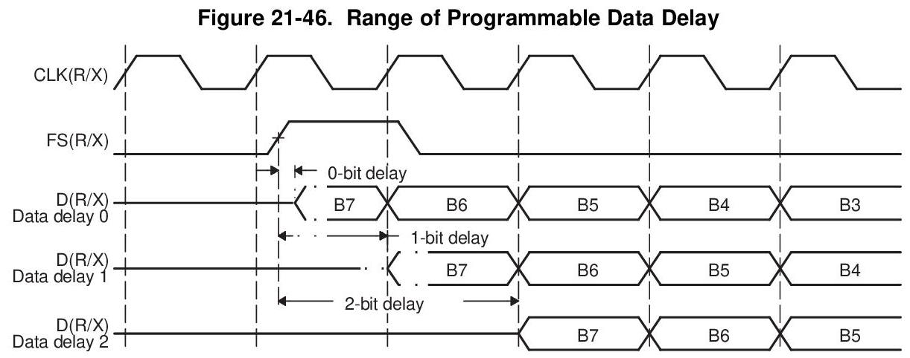

##### 21.8.12.3 2-Bit Data Delay

A data delay of two bit periods allows the serial port to interface to different types of T1 framing devices where the data stream is preceded by a framing bit. During reception of such a stream with data delay of two bits (framing bit appears after a 1-bit delay and data appears after a 2-bit delay), the serial port essentially discards the framing bit from the data stream, as shown in Figure 21-47. In this figure, the data transferred is an 8-bit value with bits labeled B7, B6, B5, and so on.

Figure 21-47. 2-Bit Data Delay Used to Skip a Framing Bit

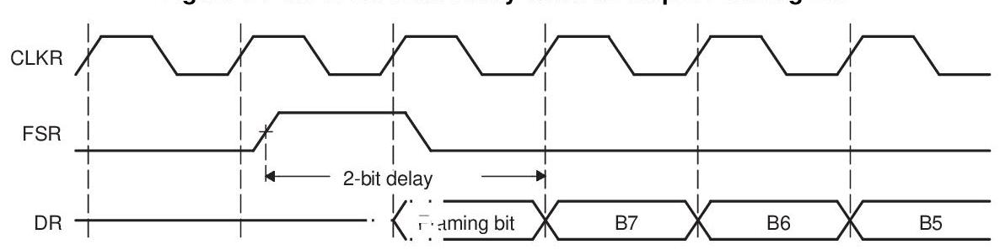

#### 21.8.13 Receive Sign-Extension and Justification Mode

The RJUST bits (see Table 21-32) determine whether data received by the McBSP is sign-extended and how it is justified.

Table 21-32. Register Bits Used to Set the Receive Sign-Extension and Justification Mode

<table><tr><td>Register</td><td>Bit</td><td>Name</td><td>Function</td><td>Type</td><td>Reset Value</td></tr><tr><td>SPCR1</td><td>14-13</td><td>RJUST</td><td>Receive sign-extension and justification mode</td><td>R/W</td><td>00</td></tr><tr><td></td><td></td><td></td><td>RJUST = 00 Right justify data and zero fill MSBs in DRR[1,2]</td><td></td><td></td></tr><tr><td></td><td></td><td></td><td>RJUST = 01 Right justify data and sign extend it into the MSBs in DRR[1,2]</td><td></td><td></td></tr><tr><td></td><td></td><td></td><td>RJUST = 10 Left justify data and zero fill LSBs in DRR[1,2]</td><td></td><td></td></tr><tr><td></td><td></td><td></td><td>RJUST = 11 Reserved</td><td></td><td></td></tr></table>

##### 21.8.13.1 Sign-Extension and the Justification

RJUST in SPCR1 selects whether data in RBR[1,2] is right- or left-justified (with respect to the MSB) in DRR[1,2] and whether unused bits in DRR[1,2] are filled with zeros or with sign bits.

Table 21-33 and Table 21-34 show the effects of various RJUST values. The first table shows the effect on an example 12-bit receive-data value ABCh. The second table shows the effect on an example 20-bit receive-data value ABCDEh.

Table 21-33. Example: Use of RJUST Field With 12-Bit Data Value ABCh

<table><tr><td>RJUST</td><td>Justification</td><td>Extension</td><td>Value in DRR2</td><td>Value in DRR1</td></tr><tr><td>00b</td><td>Right</td><td>Zero fill MSBs</td><td>0000h</td><td>0ABCh</td></tr><tr><td>01b</td><td>Right</td><td>Sign extend data into MSBs</td><td>FFFFh</td><td>FABCh</td></tr><tr><td>10b</td><td>Left</td><td>Zero fill LSBs</td><td>0000h</td><td>ABC0h</td></tr><tr><td>11b</td><td>Reserved</td><td>Reserved</td><td>Reserved</td><td>Reserved</td></tr></table>

Table 21-34. Example: Use of RJUST Field With 20-Bit Data Value ABCDEh

<table><tr><td>RJUST</td><td>Justification</td><td>Extension</td><td>Value in DRR2</td><td>Value in DRR1</td></tr><tr><td>00b</td><td>Right</td><td>Zero fill MSBs</td><td>000Ah</td><td>BCDEh</td></tr><tr><td>01b</td><td>Right</td><td>Sign extend data into MSBs</td><td>FFFAh</td><td>BCDEh</td></tr><tr><td>10b</td><td>Left</td><td>Zero fill LSBs</td><td>ABCDh</td><td>E000h</td></tr><tr><td>11b</td><td>Reserved</td><td>Reserved</td><td>Reserved</td><td>Reserved</td></tr></table>

#### 21.8.14 Receive Interrupt Mode

The RINTM bits (see Table 21-35) determine which event generates a receive interrupt request to the CPU.

The receive interrupt (RINT) informs the CPU of changes to the serial port status. Four options exist for configuring this interrupt. The options are set by the receive interrupt mode bits, RINTM, in SPCR1.

Table 21-35. Register Bits Used to Set the Receive Interrupt Mode

<table><tr><td>Register</td><td>Bit</td><td>Name</td><td>Function</td><td></td><td>Type</td><td>Reset Value</td></tr><tr><td>SPCR1</td><td>5-4</td><td rowspan="5">RINTM</td><td>Receive interrupt mode</td><td></td><td>R/W</td><td>00</td></tr><tr><td></td><td></td><td>RINTM = 00</td><td>every serial word by tracking the RRDY bit in SPCR1.   Regardless of the value of RINTM, RRDY can be read to   detect the RRDY \( = 1 \) condition.</td><td></td><td></td></tr><tr><td></td><td></td><td>RINTM = 01</td><td>RINT generated by an end-of-block or end-of-frame condition   in the receive multichannel selection mode. In the multichannel   selection mode, interrupt after every 16-channel block   boundary has been crossed within a frame and at the end of   the frame. For details, see Section 21.6.8. In any other serial   transfer case, this setting is not applicable and, therefore, no   interrupts are generated.</td><td></td><td></td></tr><tr><td></td><td></td><td>RINTM = 10</td><td>RINT generated by a new receive frame-synchronization pulse.   Interrupt on detection of receive frame-synchronization pulses.   This generates an interrupt even when the receiver is in its   reset state. This is done by synchronizing the incoming frame-   synchronization pulse to the CPU clock and sending it to the   CPU via RINT.</td><td></td><td></td></tr><tr><td></td><td></td><td>RINTM = 11</td><td>RINT generated when RSYNCERR is set. Interrupt on frame-   synchronization error. Regardless of the value of RINTM,   RSYNCERR can be read to detect this condition. For   information on using RSYNCERR, see Section 21.5.3.</td><td></td><td></td></tr></table>

#### 21.8.15 Receive Frame-Synchronization Mode

The bits described in Table 21-36 determine the source for receive frame synchronization and the function of the FSR pin.

##### 21.8.15.1 Receive Frame-Synchronization Modes

Table 21-37 shows how you can select various sources to provide the receive frame-synchronization signal and the effect on the FSR pin. The polarity of the signal on the FSR pin is determined by the FSRP bit.

In digital loopback mode (DLB = 1), the transmit frame-synchronization signal is used as the receive frame-synchronization signal.

Also in the clock stop mode, the internal receive clock signal (MCLKR) and the internal receive frame-synchronization signal (FSR) are internally connected to their transmit counterparts, CLKX and FSX.

Table 21-36. Register Bits Used to Set the Receive Frame Synchronization Mode

<table><tr><td>Register</td><td>Bit</td><td>Name</td><td colspan="2">Function</td><td>Type</td><td>Reset Value</td></tr><tr><td rowspan="3">PCR</td><td>10</td><td rowspan="3">FSRM</td><td colspan="2">Receive frame-synchronization mode</td><td>R/W</td><td>0</td></tr><tr><td></td><td>FSRM = 0</td><td>Receive frame synchronization is supplied by an external source via the FSR pin.</td><td></td><td></td></tr><tr><td></td><td>FSRM = 1</td><td>Receive frame synchronization is supplied by the sample rate generator. FSR is an output pin reflecting internal FSR, except when GSYNC = 1 in SRGR2.</td><td></td><td></td></tr></table>

Table 21-36. Register Bits Used to Set the Receive Frame Synchronization Mode (continued)

<table><tr><td>Register</td><td>Bit</td><td>Name</td><td>Function</td><td></td><td>Type</td><td>Reset Value</td><td></td></tr><tr><td rowspan="3">SRGR2</td><td>15</td><td>GSYNC</td><td colspan="5">Sample rate generator clock synchronization mode 采样速率发生器时钟同步模式 R/W   If the sample rate generator creates a frame-synchronization signal (FSG) that is derived from an external input clock, the GSYNC bit determines whether FSG is kept synchronized with pulses on the FSR pin. 如果采样速率发生器创建一个从外部输入时钟产生的帧同步信号( FSG ,则GSYND位确定FSG是否与FSR引脚上的脉冲保持同步。</td></tr><tr><td></td><td></td><td>GSYNC \( = 0 \)</td><td>No clock synchronization is used: CLKG oscillates without adjustment, and FSG pulses every (FPER + 1) CLKG cycles. 不使用时钟同步:CLKG不调整而振荡,每(FPER+1) CLKG循环进行FSG脉冲。</td><td></td><td></td><td></td></tr><tr><td></td><td></td><td>GSYNC = 1</td><td colspan="4">Clock synchronization is used. When a pulse is detected on the FSR pin: 使用时钟同步。当在FSR引脚上检测到脉冲时:   - CLKG is adjusted as necessary so that it is synchronized with the input clock on the MCLKR pin. CLKG根据需要进行调整,使其与MCLKR针上的输入时钟同步。   - FSG pulses FSG only pulses in response to a pulse on the FSR pin. The frame-synchronization period defined in FPER is ignored. FSG脉冲FSG仅响应FSR针上的脉冲进行脉冲。在FPER中定义的帧同步化周期将被忽略。   For more details, see Section 21.4.3.</td></tr><tr><td>SPCR1</td><td>15</td><td rowspan="2">DLB</td><td colspan="2">Digital loopback mode</td><td>R/W</td><td>0</td><td></td></tr><tr><td></td><td></td><td>DLB = 0   DLB = 1</td><td>Digital loopback mode is disabled.   Digital loopback mode is enabled. The receive signals, including the receive frame-synchronization signal, are connected internally through multiplexers to the corresponding transmit signals.</td><td></td><td></td><td></td></tr><tr><td>SPCR1</td><td>12-11</td><td rowspan="4">CLKSTP</td><td>Clock stop mode</td><td></td><td>R/W</td><td>00</td><td></td></tr><tr><td></td><td></td><td>CLKSTP = 0Xb</td><td>Clock stop mode disabled; normal clocking for non-SPI mode.</td><td></td><td></td><td></td></tr><tr><td></td><td></td><td>CLKSTP = 10b</td><td>Clock stop mode enabled without clock delay. The internal receive clock signal (MCLKR) and the internal receive frame-synchronization signal (FSR) are internally connected to their transmit counterparts, CLKX and FSX.</td><td></td><td></td><td></td></tr><tr><td></td><td></td><td>CLKSTP = 11b</td><td>Clock stop mode enabled with clock delay. The internal receive clock signal (MCLKR) and the internal receive frame-synchronization signal (FSR) are internally connected to their transmit counterparts, CLKX and FSX.</td><td></td><td></td><td></td></tr></table>

Table 21-37. Select Sources to Provide the Receive Frame-Synchronization Signal and the Effect on the FSR Pin

<table><tr><td>DLB</td><td>FSRM</td><td>GSYNC</td><td>Source of Receive Frame Synchronization</td><td>FSR Pin Status</td></tr><tr><td>0</td><td>0</td><td>0 or 1</td><td>An external frame-synchronization signal enters the McBSP through the FSR pin. The signal is then inverted as determined by FSRP before being used as internal FSR.</td><td>Input</td></tr><tr><td>0</td><td>1</td><td>0</td><td>Internal FSR is driven by the sample rate generator frame-synchronization signal (FSG).</td><td>Output. FSG is inverted as determined by FSRP before being driven out on the FSR pin.</td></tr><tr><td>0</td><td>1</td><td>1</td><td>Internal FSR is driven by the sample rate generator frame-synchronization signal (FSG).</td><td>Input. The external frame-synchronization input on the FSR pin is used to synchronize CLKG and generate FSG pulses.</td></tr><tr><td>1</td><td>0</td><td>0</td><td>Internal FSX drives internal FSR.</td><td>High impedance</td></tr></table>

Table 21-37. Select Sources to Provide the Receive Frame-Synchronization Signal and the Effect on the FSR Pin (continued)

<table><tr><td>DLB</td><td>FSRM</td><td>GSYNC</td><td>Source of Receive Frame Synchronization</td><td>FSR Pin Status</td></tr><tr><td>1</td><td>0 or 1</td><td>1</td><td>Internal FSX drives internal FSR.</td><td>Input. If the sample rate generator is running, external FSR is used to synchronize CLKG and generate FSG pulses.</td></tr><tr><td>1</td><td>1</td><td>0</td><td>Internal FSX drives internal FSR.</td><td>Output. Receive (same as transmit) frame synchronization is inverted as determined by FSRP before being driven out on the FSR pin.</td></tr></table>

#### 21.8.16 Receive Frame-Synchronization Polarity

The FSRP bit (see Table 21-38) determines whether frame-synchronization pulses are active high or active low on the FSR pin.

Table 21-38. Register Bit Used to Set Receive Frame-Synchronization Polarity

<table><tr><td>Register</td><td>Bit</td><td>Name</td><td>Function</td><td>Type</td><td>Reset Value</td></tr><tr><td>PCR</td><td>2</td><td>FSRP</td><td>Receive frame-synchronization polarity</td><td>R/W</td><td>0</td></tr><tr><td></td><td></td><td></td><td>FSRP \( = 0 \) Frame-synchronization pulse FSR is active high.</td><td></td><td></td></tr><tr><td></td><td></td><td></td><td>FSRP = 1 Frame-synchronization pulse FSR is active low.</td><td></td><td></td></tr></table>

##### 21.8.16.1 Frame-Synchronization Pulses, Clock Signals, and Their Polarities

Receive frame-synchronization pulses can be generated internally by the sample rate generator (see Section 21.4.2) or driven by an external source. The source of frame synchronization is selected by programming the mode bit, FSRM, in PCR. FSR is also affected by the GSYNC bit in SRGR2. For information about the effects of FSRM and GSYNC, see Section 21.8.15. Similarly, receive clocks can be selected to be inputs or outputs by programming the mode bit, CLKRM, in the PCR (see Section 21.8.17).

When FSR and FSX are inputs (FSXM = FSRM= 0, external frame-synchronization pulses), the McBSP detects them on the internal falling edge of clock, internal MCLKR, and internal CLKX, respectively. The receive data arriving at the DR pin is also sampled on the falling edge of internal MCLKR. These internal clock signals are either derived from an external source via CLK(R/X) pins or driven by the sample rate generator clock (CLKG) internal to the McBSP.

When FSR and FSX are outputs, implying that they are driven by the sample rate generator, they are generated (transition to their active state) on the rising edge of the internal clock, CLK(R/X). Similarly, data on the DX pin is output on the rising edge of internal CLKX.

FSRP, FSXP, CLKRP, and CLKXP in the pin control register (PCR) configure the polarities of the FSR, FSX, MCLKR, and CLKX signals, respectively. All frame-synchronization signals (internal FSR, internal FSX) that are internal to the serial port are active high. If the serial port is configured for external frame synchronization (FSR/FSX are inputs to McBSP), and FSRP = FSXP = 1, the external active-low frame-synchronization signals are inverted before being sent to the receiver (internal FSR) and transmitter (internal FSX). Similarly, if internal synchronization (FSR/FSX are output pins and GSYNC = 0) is selected, the internal active-high frame-synchronization signals are inverted, if the polarity bit FS(R/X)P = 1, before being sent to the FS(R/X) pin.

On the transmit side, the transmit clock polarity bit, CLKXP, sets the edge used to shift and clock out transmit data. Data is always transmitted on the rising edge of internal CLKX. If CLKXP = 1 and external clocking is selected (CLKXM = 0 and CLKX is an input), the external falling-edge triggered input clock on CLKX is inverted to a rising-edge triggered clock before being sent to the transmitter. If CLKXP = 1, and internal clocking selected (CLKXM = 1 and CLKX is an output pin), the internal (rising-edge triggered) clock, internal CLKX, is inverted before being sent out on the MCLKX pin.

Similarly, the receiver can reliably sample data that is clocked with a rising edge clock (by the transmitter). The receive clock polarity bit, CLKRP, sets the edge used to sample received data. The receive data is always sampled on the falling edge of internal MCLKR. Therefore, if CLKRP = 1 and external clocking is selected (CLKRM = 0 and MCLKR is an input pin), the external rising-edge triggered input clock on MCLKR is inverted to a falling-edge triggered clock before being sent to the receiver. If CLKRP = 1 and internal clocking is selected (CLKRM = 1), the internal falling-edge triggered clock is inverted to a rising-edge triggered clock before being sent out on the MCLKR pin.

MCLKRP = CLKXP in a system where the same clock (internal or external) is used to clock the receiver and transmitter. The receiver uses the opposite edge as the transmitter to ensure valid setup and hold of data around this edge. Figure 21-48 shows how data clocked by an external serial device using a rising edge can be sampled by the McBSP receiver on the falling edge of the same clock.

Figure 21-48. Data Clocked Externally Using a Rising Edge and Sampled by the McBSP Receiver on a Falling Edge

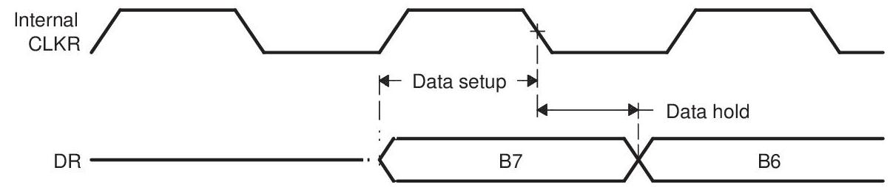

Set the SRG Frame-Synchronization Period and Pulse Width

##### 21.8.16.2 Frame-Synchronization Period and the Frame-Synchronization Pulse Width

The sample rate generator can produce a clock signal, CLKG, and a frame-synchronization signal, FSG. If the sample rate generator is supplying receive or transmit frame synchronization, you must program the bit fields FPER and FWID.

On FSG, the period from the start of a frame-synchronization pulse to the start of the next pulse is (FPER + 1) CLKG cycles. The 12 bits of FPER allow a frame-synchronization period of 1 to 4096 CLKG cycles, which allows up to 4096 data bits per frame. When GSYNC = 1, FPER is a don't care value.

Each pulse on FSG has a width of (FWID + 1) CLKG cycles. The eight bits of FWID allow a pulse width of 1 to 256 CLKG cycles. It is recommended that FWID be programmed to a value less than the programmed word length.

The values in FPER and FWID are loaded into separate down-counters. The 12-bit FPER counter counts down the generated clock cycles from the programmed value (4095 maximum) to 0 . The 8-bit FWID counter counts down from the programmed value (255 maximum) to 0. Table 21-39 shows settings for FPER and FWID.

Figure 21-49 shows a frame-synchronization period of 16 CLKG periods (FPER = 15 or 00001111b) and a frame-synchronization pulse with an active width of 2 CLKG periods (FWID = 1).

Table 21-39. Register Bits Used to Set the SRG Frame-Synchronization Period and Pulse Width

<table><tr><td>Register</td><td>Bit</td><td>Name</td><td>Function</td><td>Type</td><td>Reset Value</td></tr><tr><td>SRGR2</td><td>11-0</td><td>FPER</td><td>Sample rate generator frame-synchronization period   For the frame-synchronization signal FSG, (FPER + 1) determines the period from the start of a frame-synchronization pulse to the start of the next frame-synchronization pulse.   Range for (FPER + 1):   1 to 4096 CLKG cycles</td><td>R/W</td><td>0000 0000 0000</td></tr><tr><td>SRGR1</td><td>15-8</td><td>FWID</td><td>Sample rate generator frame-synchronization pulse width   This field plus 1 determines the width of each frame-synchronization pulse on FSG.</td><td>R/W</td><td>0000 0000</td></tr></table>

Table 21-39. Register Bits Used to Set the SRG Frame-Synchronization Period and Pulse Width (continued)

<table><tr><td>Register</td><td></td><td>Bit Name</td><td>Function</td><td>Type</td><td>Reset Value</td></tr><tr><td></td><td></td><td></td><td>Range for (FWID + 1):</td><td></td><td></td></tr><tr><td></td><td></td><td></td><td>1 to 256 CLKG cycles</td><td></td><td></td></tr></table>

Figure 21-49. Frame of Period 16 CLKG Periods and Active Width of 2 CLKG Periods

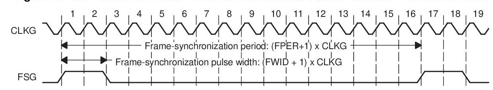

When the sample rate generator comes out of reset, FSG is in its inactive state. Then, when GRST = 1 and FSGM = 1, a frame-synchronization pulse is generated. The frame width value (FWID + 1) is counted down on every CLKG cycle until it reaches 0, at which time FSG goes low. At the same time, the frame period value (FPER + 1) is also counting down. When this value reaches 0, FSG goes high, indicating a new frame.

#### 21.8.17 Receive Clock Mode

Table 21-40 shows the settings for bits used to set receive clock mode.

Table 21-40. Register Bits Used to Set the Receive Clock Mode

<table><tr><td>Register</td><td>Bit</td><td>Name</td><td>Function</td><td></td><td>Type</td><td>Reset Value</td></tr><tr><td rowspan="7">PCR</td><td rowspan="7">8</td><td rowspan="7">CLKRM</td><td colspan="2" rowspan="2">Receive clock mode   Case 1: Digital loopback mode not set (DLB = 0) in SPCR1.</td><td>R/W</td><td>0</td></tr><tr><td></td><td></td></tr><tr><td>CLKRM = 0</td><td>The MCLKR pin is an input pin that supplies the   internal receive clock (MCLKR).</td><td></td><td></td></tr><tr><td>CLKRM = 1</td><td>Internal MCLKR is driven by the sample rate generator of the McBSP. The MCLKR pin is an output pin that reflects internal MCLKR.</td><td></td><td></td></tr><tr><td colspan="3">Case 2: Digital loopback mode set (DLB = 1) in SPCR1.</td><td></td></tr><tr><td>CLKRM = 0</td><td>The MCLKR pin is in the high impedance state. The internal receive clock (MCLKR) is driven by the internal transmit clock (CLKX). Internal CLKX is derived according to the CLKXM bit of PCR.</td><td></td><td></td></tr><tr><td>CLKRM = 1</td><td>Internal MCLKR is driven by internal CLKX. The MCLKR pin is an output pin that reflects internal MCLKR. Internal CLKX is derived according to the CLKXM bit of PCR.</td><td></td><td></td></tr><tr><td rowspan="3">SPCR1</td><td rowspan="3">15</td><td rowspan="3">DLB</td><td colspan="2">Digital loopback mode</td><td>R/W</td><td>00</td></tr><tr><td>DLB = 0</td><td>Digital loopback mode is disabled.</td><td></td><td></td></tr><tr><td>DLB = 1</td><td>Digital loopback mode is enabled. The receive signals, including the receive frame-synchronization signal, are connected internally through multiplexers to the corresponding transmit signals.</td><td></td><td></td></tr></table>